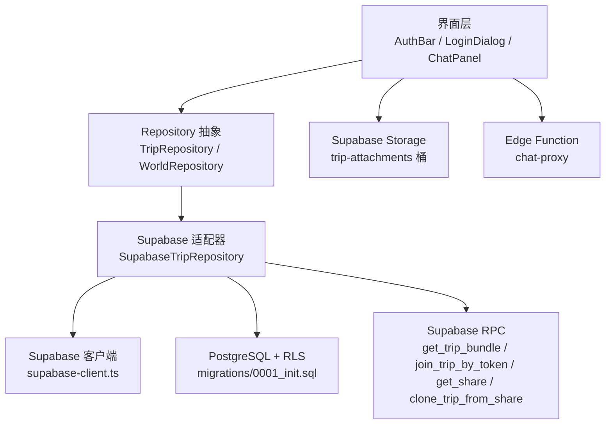
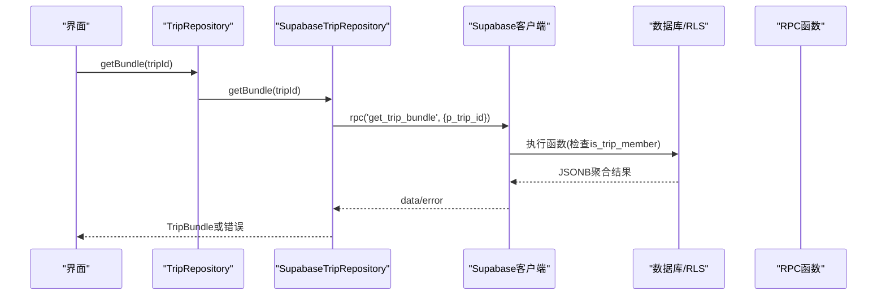
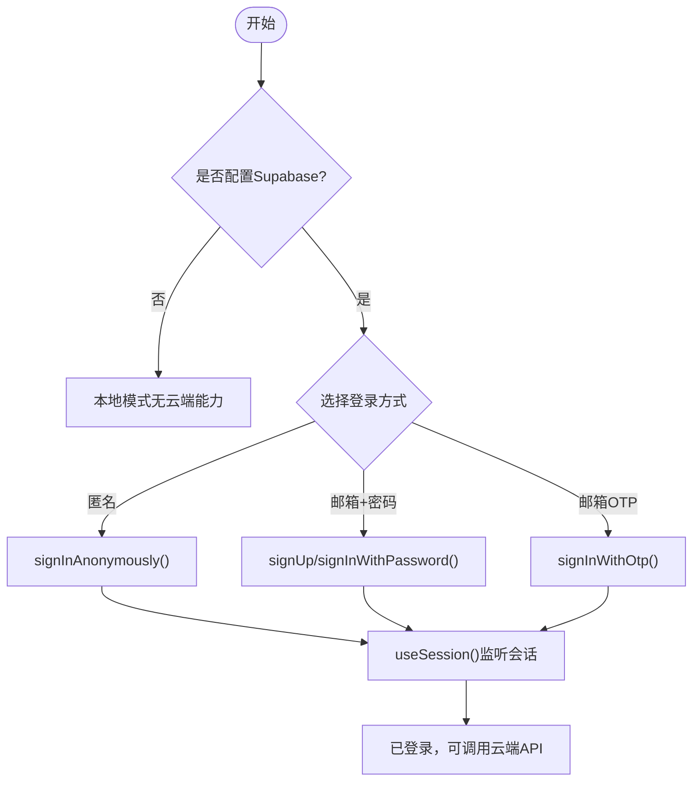
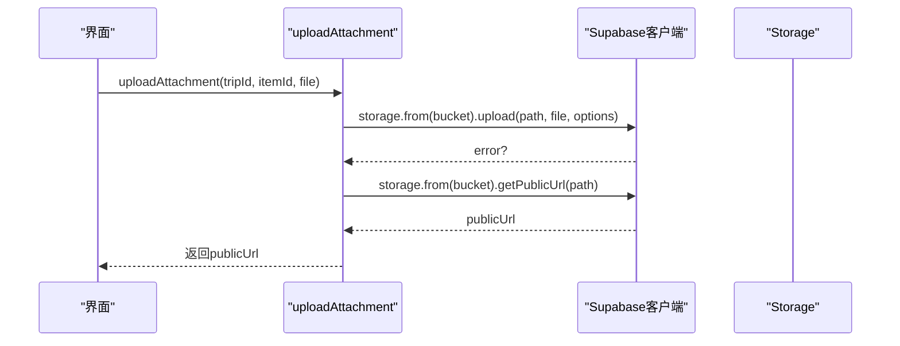
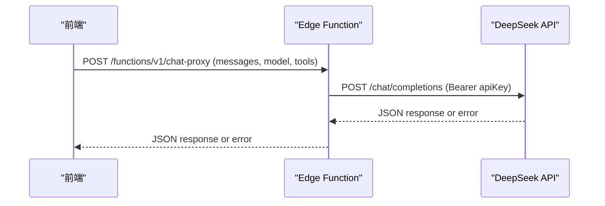
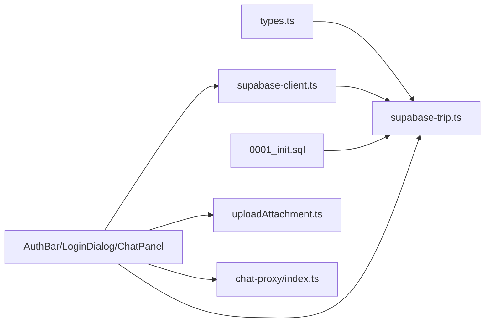

# API参考文档

<cite>
**本文引用的文件**
- [src/data/types.ts](file://src/data/types.ts)
- [src/data/supabase-client.ts](file://src/data/supabase-client.ts)
- [src/data/adapters/supabase-trip.ts](file://src/data/adapters/supabase-trip.ts)
- [supabase/migrations/0001_init.sql](file://supabase/migrations/0001_init.sql)
- [supabase/functions/chat-proxy/index.ts](file://supabase/functions/chat-proxy/index.ts)
- [src/features/trip/uploadAttachment.ts](file://src/features/trip/uploadAttachment.ts)
- [src/features/auth/AuthBar.tsx](file://src/features/auth/AuthBar.tsx)
- [src/features/auth/LoginDialog.tsx](file://src/features/auth/LoginDialog.tsx)
- [src/features/trip/queries.ts](file://src/features/trip/queries.ts)
- [src/features/trip/ChatPanel.tsx](file://src/features/trip/ChatPanel.tsx)
- [scripts/verify-supabase.cjs](file://scripts/verify-supabase.cjs)
- [scripts/verify-password-login.cjs](file://scripts/verify-password-login.cjs)
</cite>

## 目录
1. [简介](#简介)
2. [项目结构](#项目结构)
3. [核心组件](#核心组件)
4. [架构总览](#架构总览)
5. [详细组件分析](#详细组件分析)
6. [依赖关系分析](#依赖关系分析)
7. [性能考量](#性能考量)
8. [故障排查指南](#故障排查指南)
9. [结论](#结论)
10. [附录：完整API定义与示例](#附录完整api定义与示例)

## 简介
本API参考文档面向“玩无一失”项目的后端集成与前端调用，覆盖以下范围：
- Repository接口定义（世界库、行程）
- 数据类型规范（行程、成员、日程、条目、票券、费用、打包清单等）
- 请求/响应格式与错误码约定
- Supabase RPC使用方法（一次性获取行程全量数据、凭邀请加入、匿名读取分享快照、克隆行程）
- 文件上传API（Supabase Storage）调用方式与限制
- 认证流程（匿名登录、邮箱+密码、邮箱OTP）
- 完整的API调用示例、参数说明与返回值格式
- 错误处理策略与重试机制建议

## 项目结构
本项目采用分层设计：
- 数据层：类型定义、Repository抽象、Supabase客户端与适配器
- 领域层：行程计算、世界库schema等
- 功能层：认证、行程协作、聊天代理、地图与内容
- 迁移与函数：数据库表结构与权限、Edge Function

图表来源
- [src/data/adapters/supabase-trip.ts:141-198](file://src/data/adapters/supabase-trip.ts#L141-L198)
- [src/data/supabase-client.ts:17-34](file://src/data/supabase-client.ts#L17-L34)
- [supabase/migrations/0001_init.sql:392-525](file://supabase/migrations/0001_init.sql#L392-L525)
- [supabase/functions/chat-proxy/index.ts:32-80](file://supabase/functions/chat-proxy/index.ts#L32-L80)
- [src/features/trip/uploadAttachment.ts:21-37](file://src/features/trip/uploadAttachment.ts#L21-L37)

章节来源
- [src/data/types.ts:1-300](file://src/data/types.ts#L1-L300)
- [src/data/supabase-client.ts:1-106](file://src/data/supabase-client.ts#L1-L106)
- [src/data/adapters/supabase-trip.ts:1-548](file://src/data/adapters/supabase-trip.ts#L1-L548)
- [supabase/migrations/0001_init.sql:1-530](file://supabase/migrations/0001_init.sql#L1-L530)

## 核心组件
- Repository接口
  - TripRepository：提供行程、成员、日程、条目、投票、票券、费用的增删改查与协作邀请能力
  - WorldRepository：提供世界库国家、城市、POI的查询与搜索
- Supabase客户端与认证
  - 配置检测、会话监听、匿名/邮箱/OTP登录、登出
- Supabase适配器
  - 将SQL列名映射为驼峰字段，封装RPC调用，统一错误抛出
- 文件上传
  - 图片上传到trip-attachments桶，返回公开URL；支持删除
- Edge Function
  - chat-proxy：大模型中继，校验JWT，转发消息并返回结果

章节来源
- [src/data/types.ts:69-79](file://src/data/types.ts#L69-L79)
- [src/data/types.ts:263-299](file://src/data/types.ts#L263-L299)
- [src/data/supabase-client.ts:45-105](file://src/data/supabase-client.ts#L45-L105)
- [src/data/adapters/supabase-trip.ts:141-524](file://src/data/adapters/supabase-trip.ts#L141-L524)
- [src/features/trip/uploadAttachment.ts:1-54](file://src/features/trip/uploadAttachment.ts#L1-L54)
- [supabase/functions/chat-proxy/index.ts:1-81](file://supabase/functions/chat-proxy/index.ts#L1-L81)

## 架构总览
系统通过Repository抽象屏蔽底层实现差异。云端模式下，SupabaseTripRepository使用Supabase客户端访问数据库与RPC，同时结合RLS保证行级安全。文件上传走Storage，AI对话走Edge Function。

图表来源
- [src/data/adapters/supabase-trip.ts:159-198](file://src/data/adapters/supabase-trip.ts#L159-L198)
- [supabase/migrations/0001_init.sql:392-427](file://supabase/migrations/0001_init.sql#L392-L427)

## 详细组件分析

### Repository接口与数据类型
- 世界库
  - 类型：PoiSummary、CitySummary、CountrySummary、WorldIndex、PoiQuery、SearchHit
  - 接口：WorldRepository（索引、列表、详情、搜索）
- 行程层
  - 类型：ItemStatus、MemberRole、TripStatus、ExpenseCategory、TransportMode、PackingItem、Trip、TripMember、TripInvite、TripDay、TripItem、ItemVote、Ticket、Expense、TripBundle、CreateTripInput、AddItemInput
  - 接口：TripRepository（CRUD、协作邀请、投票、票券、费用）

复杂度与约束
- TripBundle一次性聚合多表数据，减少往返
- 金额以分为单位，汇率保留小数位
- 枚举值受数据库约束（如item_status、transport_mode等）

章节来源
- [src/data/types.ts:10-79](file://src/data/types.ts#L10-L79)
- [src/data/types.ts:83-299](file://src/data/types.ts#L83-L299)

### Supabase客户端与认证流程
- 配置检测：isSupabaseConfigured基于环境变量
- 会话监听：useSession返回loading/session/user
- 登录方式：
  - 匿名登录：无需邮件配置，获得真实uid便于RLS
  - 邮箱+密码注册/登录
  - 邮箱OTP：需配置邮件服务，回跳后刷新完成登录
- 登出：signOut

图表来源
- [src/data/supabase-client.ts:17-34](file://src/data/supabase-client.ts#L17-L34)
- [src/data/supabase-client.ts:45-105](file://src/data/supabase-client.ts#L45-L105)
- [src/features/auth/AuthBar.tsx:18-56](file://src/features/auth/AuthBar.tsx#L18-L56)
- [src/features/auth/LoginDialog.tsx:18-159](file://src/features/auth/LoginDialog.tsx#L18-L159)

章节来源
- [src/data/supabase-client.ts:1-106](file://src/data/supabase-client.ts#L1-L106)
- [src/features/auth/AuthBar.tsx:1-57](file://src/features/auth/AuthBar.tsx#L1-L57)
- [src/features/auth/LoginDialog.tsx:1-159](file://src/features/auth/LoginDialog.tsx#L1-L159)

### Supabase RPC接口
- get_trip_bundle(p_trip_id: uuid): 一次性返回行程全量数据（trip、members、days、items、votes、tickets、expenses、expenseShares、transports、accommodations、myNotes）。非成员会抛FORBIDDEN
- join_trip_by_token(p_token: text, p_display_name: text): 凭邀请token加入行程，支持认领幽灵成员；无效token抛INVALID_INVITE
- get_share(p_slug: text): 匿名按slug读取分享快照（精确匹配，不可枚举）
- clone_trip_from_share(p_slug: text, p_start_date: date, p_title: text): 从分享快照克隆为新行程（需登录）

调用方式
- 通过Supabase客户端rpc方法调用，参数为JSON对象
- 错误处理：捕获error.message，区分权限类错误（如FORBIDDEN）与业务错误

章节来源
- [supabase/migrations/0001_init.sql:392-525](file://supabase/migrations/0001_init.sql#L392-L525)
- [src/data/adapters/supabase-trip.ts:159-198](file://src/data/adapters/supabase-trip.ts#L159-L198)
- [src/data/adapters/supabase-trip.ts:407-413](file://src/data/adapters/supabase-trip.ts#L407-L413)

### 文件上传API（Supabase Storage）
- 桶名：trip-attachments
- 路径规则：{tripId}/{itemId}/{timestamp}-{safeFilename}
- 限制：仅图片类型，单文件最大5MB
- 方法：
  - uploadAttachment(tripId, itemId, file): 上传并返回公开URL
  - deleteAttachment(url): 根据公开URL反解路径并删除
- 注意：本地模式不支持上传，仅在已连接云端时可用

图表来源
- [src/features/trip/uploadAttachment.ts:21-37](file://src/features/trip/uploadAttachment.ts#L21-L37)
- [src/features/trip/uploadAttachment.ts:39-54](file://src/features/trip/uploadAttachment.ts#L39-L54)

章节来源
- [src/features/trip/uploadAttachment.ts:1-54](file://src/features/trip/uploadAttachment.ts#L1-L54)

### Edge Function：chat-proxy
- 作用：大模型中继，隐藏API Key，默认开启JWT校验
- 输入：messages数组、可选tools/tool_choice/temperature/model
- 输出：上游模型响应体（JSON）
- 错误：
  - 缺少Authorization头：401
  - 未配置DEEPSEEK_API_KEY：500
  - messages为空或非数组：400
  - 上游错误：透传status与detail

调用方式
- 直接fetch调用：/functions/v1/chat-proxy
- 必须携带Authorization: Bearer <access_token>与apikey

图表来源
- [supabase/functions/chat-proxy/index.ts:32-80](file://supabase/functions/chat-proxy/index.ts#L32-L80)
- [src/features/trip/ChatPanel.tsx:155-190](file://src/features/trip/ChatPanel.tsx#L155-L190)

章节来源
- [supabase/functions/chat-proxy/index.ts:1-81](file://supabase/functions/chat-proxy/index.ts#L1-L81)
- [src/features/trip/ChatPanel.tsx:150-349](file://src/features/trip/ChatPanel.tsx#L150-L349)

### 数据流与处理逻辑
- 读取全量：get_trip_bundle一次聚合多表，适配器映射为TripBundle
- 写操作：通过Repository方法插入/更新，受RLS保护
- 协作邀请：生成随机token，记录有效期与使用次数；join_trip_by_token幂等加入
- 费用分摊：先清后插expense_shares，确保一致性

章节来源
- [src/data/adapters/supabase-trip.ts:159-198](file://src/data/adapters/supabase-trip.ts#L159-L198)
- [src/data/adapters/supabase-trip.ts:473-518](file://src/data/adapters/supabase-trip.ts#L473-L518)
- [supabase/migrations/0001_init.sql:431-465](file://supabase/migrations/0001_init.sql#L431-L465)

## 依赖关系分析
- 组件耦合
  - 界面层依赖Repository抽象，不关心具体实现
  - SupabaseTripRepository依赖supabase-client与migrations定义的表结构
  - 认证模块与界面交互，驱动登录态变化
- 外部依赖
  - @supabase/supabase-js：客户端、存储、函数调用
  - @tanstack/react-query：缓存与乐观更新
  - zod：世界库schema校验

图表来源
- [src/data/types.ts:1-300](file://src/data/types.ts#L1-L300)
- [src/data/adapters/supabase-trip.ts:1-548](file://src/data/adapters/supabase-trip.ts#L1-L548)
- [src/data/supabase-client.ts:1-106](file://src/data/supabase-client.ts#L1-L106)
- [supabase/migrations/0001_init.sql:1-530](file://supabase/migrations/0001_init.sql#L1-L530)
- [src/features/trip/uploadAttachment.ts:1-54](file://src/features/trip/uploadAttachment.ts#L1-L54)
- [supabase/functions/chat-proxy/index.ts:1-81](file://supabase/functions/chat-proxy/index.ts#L1-L81)

章节来源
- [package.json:18-31](file://package.json#L18-L31)

## 性能考量
- 一次性聚合：get_trip_bundle减少多次往返，提升加载速度
- 乐观更新：React Query在写操作前更新本地状态，提升交互流畅度
- 缓存策略：staleTime设置合理过期时间，避免频繁刷新
- 文件上传：限制大小与类型，降低带宽压力

[本节为通用指导，不直接分析具体文件]

## 故障排查指南
- 认证失败
  - 未配置Supabase：isSupabaseConfigured为false，无法启用云端能力
  - 未登录：调用需要鉴权的API会失败，需先登录
- 权限错误
  - FORBIDDEN：非行程成员访问受限资源
  - INVALID_INVITE：邀请链接无效或已过期
- 网络/函数错误
  - chat-proxy返回非2xx：解析错误信息并提示用户
  - Storage上传失败：检查文件类型与大小
- 验证脚本
  - verify-supabase.cjs：端到端验证匿名登录、创建行程、读取bundle
  - verify-password-login.cjs：验证邮箱+密码注册/登录闭环

章节来源
- [src/data/supabase-client.ts:17-34](file://src/data/supabase-client.ts#L17-L34)
- [src/data/adapters/supabase-trip.ts:159-165](file://src/data/adapters/supabase-trip.ts#L159-L165)
- [supabase/migrations/0001_init.sql:431-465](file://supabase/migrations/0001_init.sql#L431-L465)
- [src/features/trip/ChatPanel.tsx:155-190](file://src/features/trip/ChatPanel.tsx#L155-L190)
- [scripts/verify-supabase.cjs:1-29](file://scripts/verify-supabase.cjs#L1-L29)
- [scripts/verify-password-login.cjs:1-33](file://scripts/verify-password-login.cjs#L1-L33)

## 结论
本项目通过Repository抽象与Supabase深度集成，提供了完整的旅行行程管理能力。认证、RPC、Storage与Edge Function共同构成稳定可靠的云端能力。遵循本文档的API定义与错误处理策略，可实现一致且健壮的集成体验。

[本节为总结性内容，不直接分析具体文件]

## 附录：完整API定义与示例

### Repository接口定义
- TripRepository
  - listTrips(): Promise<Trip[]>
  - getBundle(tripId): Promise<TripBundle | null>
  - createTrip(input): Promise<Trip>
  - updateTrip(id, patch): Promise<Trip>
  - deleteTrip(id): Promise<void>
  - addDay(tripId, date, cityId?): Promise<TripDay>
  - updateDay(id, patch): Promise<TripDay>
  - removeDay(id): Promise<void>
  - addItem(input): Promise<TripItem>
  - updateItem(id, patch): Promise<TripItem>
  - moveItem(id, to): Promise<TripItem>
  - removeItem(id): Promise<void>
  - addMember(tripId, displayName): Promise<TripMember>
  - removeMember(id): Promise<void>
  - createInvite(tripId, opts?): Promise<TripInvite>
  - listInvites(tripId): Promise<TripInvite[]>
  - revokeInvite(id): Promise<void>
  - joinTripByToken(token, displayName?): Promise<void>
  - vote(itemId, memberId, value): Promise<void>
  - upsertTicket(input): Promise<Ticket>
  - removeTicket(id): Promise<void>
  - upsertExpense(input): Promise<Expense>
  - removeExpense(id): Promise<void>

章节来源
- [src/data/types.ts:263-299](file://src/data/types.ts#L263-L299)

### 数据类型规范（节选）
- Trip：id、ownerId、title、startDate、endDate、baseCurrency、preferences、sourceTripId、sourceLabel、status、packing、updatedAt
- TripItem：id、tripId、dayId、kind、poiId、customTitle、transportMode、fromCityId、toCityId、rank、slotStart、slotEnd、status、note、address、images、updatedAt
- Expense：id、tripId、dayId、itemId、category、title、amountCents、currency、fxRate、payerMemberId、spentAt、note、splitMode、shares
- Ticket：id、tripId、itemId、title、channel、officialUrl、priceCents、currency、timeSlot、bookingRef、booked、leadDays、note

章节来源
- [src/data/types.ts:113-239](file://src/data/types.ts#L113-L239)

### 请求/响应格式与错误码
- RPC get_trip_bundle
  - 请求：{p_trip_id: string}
  - 响应：JSONB包含trip、members、days、items、votes、tickets、expenses、expenseShares、transports、accommodations、myNotes
  - 错误：FORBIDDEN（非成员）
- RPC join_trip_by_token
  - 请求：{p_token: string, p_display_name?: string}
  - 响应：memberId
  - 错误：INVALID_INVITE
- 文件上传
  - 请求：multipart/form-data（图片），bucket=trip-attachments，path={tripId}/{itemId}/{timestamp}-{filename}
  - 响应：publicUrl
  - 错误：类型不符、超过5MB、存储写入失败
- Edge Function chat-proxy
  - 请求：POST /functions/v1/chat-proxy，headers含Authorization与apikey，body.messages为非空数组
  - 响应：上游模型响应体
  - 错误：401（缺授权）、500（未配置Key）、400（messages非法）、上游错误码

章节来源
- [supabase/migrations/0001_init.sql:392-525](file://supabase/migrations/0001_init.sql#L392-L525)
- [src/features/trip/uploadAttachment.ts:21-37](file://src/features/trip/uploadAttachment.ts#L21-L37)
- [supabase/functions/chat-proxy/index.ts:32-80](file://supabase/functions/chat-proxy/index.ts#L32-L80)

### 认证流程与调用示例
- 匿名登录
  - 调用：signInAnonymously()
  - 适用：快速体验，RLS生效
- 邮箱+密码
  - 注册：signUp(email, password)
  - 登录：signInWithPassword(email, password)
- 邮箱OTP
  - 发送：signInWithOtp(email)，回跳后刷新页面
- 登出：signOut()

章节来源
- [src/data/supabase-client.ts:71-105](file://src/data/supabase-client.ts#L71-L105)
- [src/features/auth/LoginDialog.tsx:52-82](file://src/features/auth/LoginDialog.tsx#L52-L82)

### 错误处理策略与重试机制
- 统一错误抛出：适配器层对数据库/RPC错误直接throw，上层捕获并提示
- 权限错误：识别FORBIDDEN并引导登录
- 网络错误：Edge Function返回非2xx时解析错误信息
- 重试建议：
  - 对瞬时网络错误进行有限次重试（如3次，指数退避）
  - 对权限错误不进行重试，直接提示用户
  - 对文件上传失败，提示用户检查文件类型与大小后重试

章节来源
- [src/data/adapters/supabase-trip.ts:159-165](file://src/data/adapters/supabase-trip.ts#L159-L165)
- [src/features/trip/ChatPanel.tsx:155-190](file://src/features/trip/ChatPanel.tsx#L155-L190)