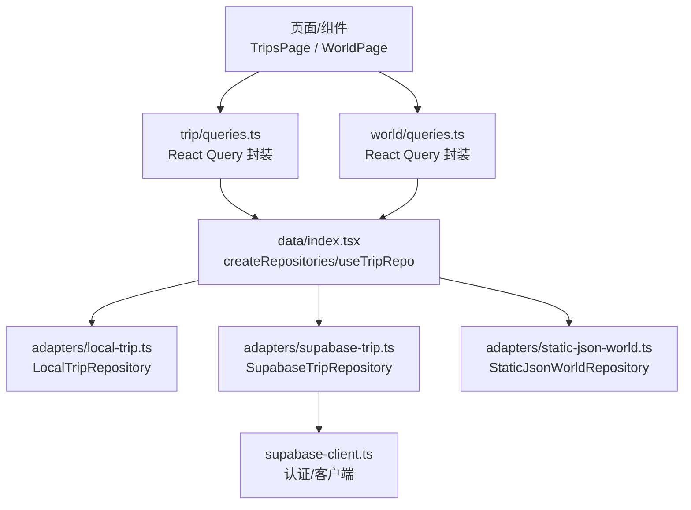
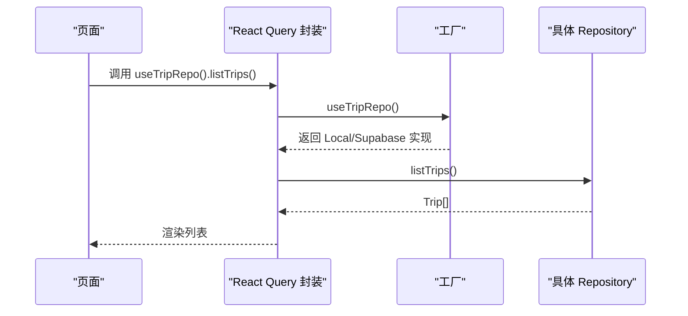
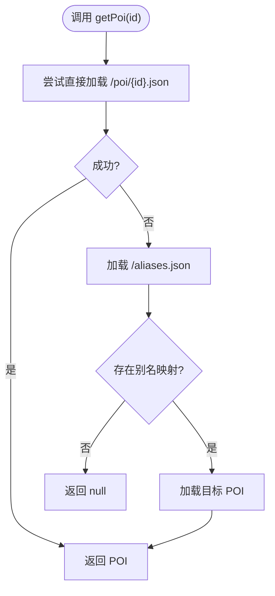
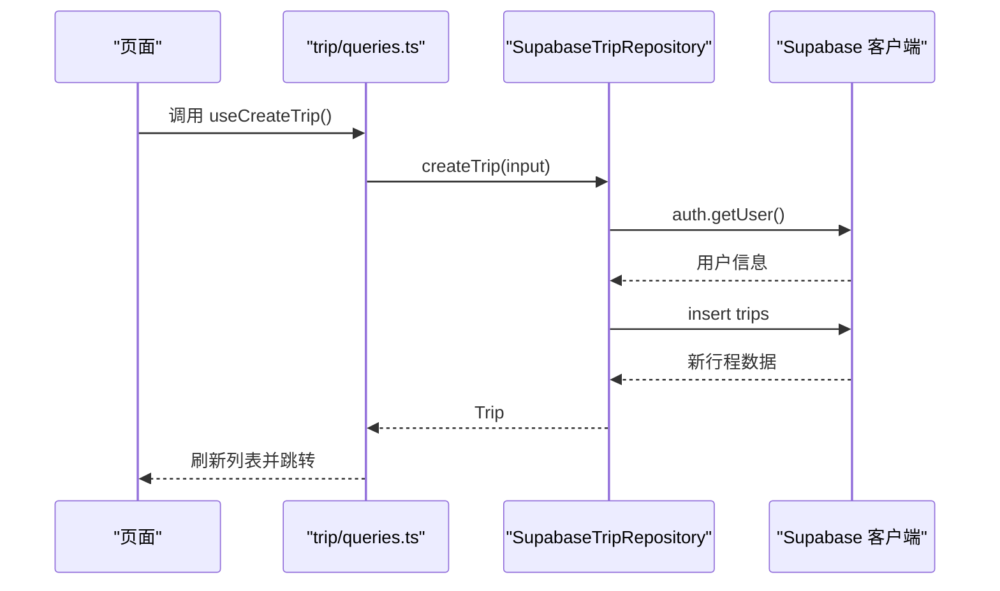
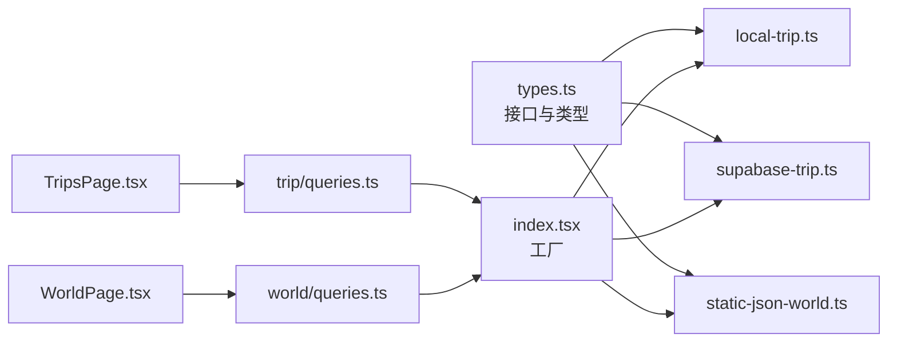

# Repository接口定义

<cite>
**本文引用的文件**
- [src/data/types.ts](file://src/data/types.ts)
- [src/data/adapters/local-trip.ts](file://src/data/adapters/local-trip.ts)
- [src/data/adapters/supabase-trip.ts](file://src/data/adapters/supabase-trip.ts)
- [src/data/adapters/static-json-world.ts](file://src/data/adapters/static-json-world.ts)
- [src/data/index.tsx](file://src/data/index.tsx)
- [src/data/supabase-client.ts](file://src/data/supabase-client.ts)
- [src/features/trip/queries.ts](file://src/features/trip/queries.ts)
- [src/features/world/queries.ts](file://src/features/world/queries.ts)
- [src/pages/TripsPage.tsx](file://src/pages/TripsPage.tsx)
</cite>

## 目录
1. [简介](#简介)
2. [项目结构](#项目结构)
3. [核心组件](#核心组件)
4. [架构总览](#架构总览)
5. [详细组件分析](#详细组件分析)
6. [依赖关系分析](#依赖关系分析)
7. [性能考虑](#性能考虑)
8. [故障排查指南](#故障排查指南)
9. [结论](#结论)
10. [附录：调用示例与集成指南](#附录调用示例与集成指南)

## 简介
本文件为“Repository 接口”的权威 API 文档，聚焦以下目标：
- 完整说明 WorldRepository 与 TripRepository 的接口定义、方法参数、返回值与使用场景。
- 解释 Repository 模式在本项目中的设计原理，以及不同实现（本地存储 localStorage、Supabase 云端、静态 JSON）的差异与取舍。
- 给出错误处理策略、性能优化建议与最佳实践。
- 提供具体调用示例与集成指南，帮助快速上手与扩展。

## 项目结构
数据访问层采用“接口 + 多实现 + 工厂注入”的结构：
- 类型与接口：集中在 src/data/types.ts，统一描述世界库与行程的数据模型和仓库接口。
- 适配器实现：
  - 行程：LocalTripRepository（本地）、SupabaseTripRepository（云端）。
  - 世界库：StaticJsonWorldRepository（静态 JSON）。
- 工厂与注入：src/data/index.tsx 提供 createRepositories、useTripRepo、useWorld 等工具，按环境选择实现。
- 上层封装：features/* 下的 queries.ts 基于 React Query 封装查询与变更，屏蔽底层差异。



图表来源
- [src/data/index.tsx:21-29](file://src/data/index.tsx#L21-L29)
- [src/data/adapters/local-trip.ts:67-79](file://src/data/adapters/local-trip.ts#L67-L79)
- [src/data/adapters/supabase-trip.ts:141-148](file://src/data/adapters/supabase-trip.ts#L141-L148)
- [src/data/adapters/static-json-world.ts:48-81](file://src/data/adapters/static-json-world.ts#L48-L81)
- [src/data/supabase-client.ts:22-34](file://src/data/supabase-client.ts#L22-L34)

章节来源
- [src/data/index.tsx:1-57](file://src/data/index.tsx#L1-L57)
- [src/data/types.ts:1-300](file://src/data/types.ts#L1-L300)

## 核心组件
- WorldRepository：面向“世界库”的只读数据访问接口，提供国家、城市、POI 的索引、列表、详情与搜索能力。
- TripRepository：面向“行程”的读写接口，包含行程、日程、条目、成员、投票、票据、费用等全生命周期操作，并支持协作邀请（云端）。

章节来源
- [src/data/types.ts:69-79](file://src/data/types.ts#L69-L79)
- [src/data/types.ts:263-299](file://src/data/types.ts#L263-L299)

## 架构总览
- 单一职责：每个 Adapter 仅负责一种数据源（本地/云端/静态），对外暴露一致的接口。
- 工厂切换：根据是否配置 Supabase 自动选择 TripRepository 实现；WorldRepository 始终使用静态 JSON。
- 上层解耦：UI 通过 useTripRepo/useWorld 获取仓库实例，不感知后端差异。
- 乐观更新：trip/queries.ts 对写操作进行乐观更新，提升交互流畅度。



图表来源
- [src/features/trip/queries.ts:17-20](file://src/features/trip/queries.ts#L17-L20)
- [src/data/index.tsx:42-54](file://src/data/index.tsx#L42-L54)
- [src/data/adapters/local-trip.ts:89-95](file://src/data/adapters/local-trip.ts#L89-L95)
- [src/data/adapters/supabase-trip.ts:150-157](file://src/data/adapters/supabase-trip.ts#L150-L157)

## 详细组件分析

### WorldRepository 接口定义
- getIndex(): Promise<WorldIndex>
  - 作用：获取世界库索引（国家、城市、POI 摘要）。
  - 返回：包含 countries、cities、pois 的索引对象。
- listCountries(): Promise<CountrySummary[]>
  - 作用：列出所有国家摘要。
- getCountry(id: string): Promise<Country | null>
  - 作用：按 ID 获取国家详情，不存在返回 null。
- listCities(countryId?: string): Promise<CitySummary[]>
  - 作用：可选按国家过滤的城市列表。
- getCity(id: string): Promise<City | null>
  - 作用：按 ID 获取城市详情。
- listPois(q?: PoiQuery): Promise<PoiSummary[]>
  - 作用：按条件筛选 POI（城市、类型、标签、关键词、排序）。
- getPoi(id: string): Promise<Poi | null>
  - 作用：获取 POI 详情，支持别名重定向。
- getPois(ids: string[]): Promise<Record<string, Poi>>
  - 作用：批量获取 POI 详情，去重并发请求。
- search(keyword: string): Promise<SearchHit[]>
  - 作用：全文检索，返回命中项（城市或 POI）。

章节来源
- [src/data/types.ts:69-79](file://src/data/types.ts#L69-L79)
- [src/data/adapters/static-json-world.ts:78-166](file://src/data/adapters/static-json-world.ts#L78-L166)

#### 静态 JSON 实现要点
- 资源路径：BASE_URL + data/...，构建产物由 scripts/build-index.ts 生成。
- 缓存策略：getIndex/getPoi/listPois/search 等方法内部使用 memo 与 Promise 缓存，避免重复请求。
- 容错：单个 POI 解析失败降级为 null，不影响整体可用性。
- 别名：getPoi 支持 aliases.json 重定向，兼容旧 ID。



图表来源
- [src/data/adapters/static-json-world.ts:67-76](file://src/data/adapters/static-json-world.ts#L67-L76)
- [src/data/adapters/static-json-world.ts:129-137](file://src/data/adapters/static-json-world.ts#L129-L137)

### TripRepository 接口定义
- 基础能力
  - kind: 'local' | 'supabase' | 'snapshot' | 'mock'
  - capabilities: { canWrite: boolean; canSync: boolean }
  - listTrips(): Promise<Trip[]>
  - getBundle(tripId: string): Promise<TripBundle | null>
  - createTrip(input: CreateTripInput): Promise<Trip>
  - updateTrip(id: string, patch: Partial<Trip>): Promise<Trip>
  - deleteTrip(id: string): Promise<void>
- 日程管理
  - addDay(tripId: string, date: string, cityId?: string | null): Promise<TripDay>
  - updateDay(id: string, patch: Partial<TripDay>): Promise<TripDay>
  - removeDay(id: string): Promise<void>
- 条目管理
  - addItem(input: AddItemInput): Promise<TripItem>
  - updateItem(id: string, patch: Partial<TripItem>): Promise<TripItem>
  - moveItem(id: string, to: { dayId: string | null; rank: string }): Promise<TripItem>
  - removeItem(id: string): Promise<void>
- 成员与协作
  - addMember(tripId: string, displayName: string): Promise<TripMember>
  - removeMember(id: string): Promise<void>
  - createInvite(tripId: string, opts?): Promise<TripInvite>
  - listInvites(tripId: string): Promise<TripInvite[]>
  - revokeInvite(id: string): Promise<void>
  - joinTripByToken(token: string, displayName?: string | null): Promise<void>
- 投票与附件
  - vote(itemId: string, memberId: string, value: 1 | -1 | 0): Promise<void>
  - upsertTicket(input: Omit<Ticket, 'id'> & { id? }): Promise<Ticket>
  - removeTicket(id: string): Promise<void>
  - upsertExpense(input: Omit<Expense, 'id'> & { id? }): Promise<Expense>
  - removeExpense(id: string): Promise<void>

章节来源
- [src/data/types.ts:263-299](file://src/data/types.ts#L263-L299)

#### 本地存储实现（LocalTripRepository）
- 存储介质：localStorage，键名固定，数据结构与云端对齐（含 updatedAt）。
- 写入策略：统一 mutate 包装，保证 bundle.trip.updatedAt 更新与持久化。
- 能力标记：canWrite=true, canSync=false，UI 显示“仅本机”。
- 约束与校验：
  - 删除成员时若已有账目记录则抛错，需先处理账目。
  - 添加条目时默认标题按种类填充（交通/备注/住宿），确保满足约束。
- 协作功能：本地不支持邀请/加入，相关方法抛出错误或返回空集合。

```mermaid
classDiagram
class LocalTripRepository {
+kind : "local"
+capabilities : "{ canWrite : true, canSync : false }"
+listTrips() Promise~Trip[]~
+getBundle(tripId) Promise~TripBundle|null~
+createTrip(input) Promise~Trip~
+updateTrip(id, patch) Promise~Trip~
+deleteTrip(id) Promise~void~
+addDay(tripId, date, cityId?) Promise~TripDay~
+updateDay(id, patch) Promise~TripDay~
+removeDay(id) Promise~void~
+addItem(input) Promise~TripItem~
+updateItem(id, patch) Promise~TripItem~
+moveItem(id, to) Promise~TripItem~
+removeItem(id) Promise~void~
+addMember(tripId, displayName) Promise~TripMember~
+removeMember(id) Promise~void~
+createInvite(...) Promise~TripInvite~
+listInvites(tripId) Promise~TripInvite[]~
+revokeInvite(id) Promise~void~
+joinTripByToken(token, displayName?) Promise~void~
+vote(itemId, memberId, value) Promise~void~
+upsertTicket(input) Promise~Ticket~
+removeTicket(id) Promise~void~
+upsertExpense(input) Promise~Expense~
+removeExpense(id) Promise~void~
}
```

图表来源
- [src/data/adapters/local-trip.ts:67-349](file://src/data/adapters/local-trip.ts#L67-L349)

#### 云端实现（SupabaseTripRepository）
- 数据一致性：字段与 SQL 迁移一一对应（camelCase ↔ snake_case），视图层可互换。
- 读取优化：getBundle 通过 RPC 一次性拉取全量，减少多次往返。
- 权限控制：RLS 限制未登录用户无法写入；创建/加入等操作需先登录。
- 协作邀请：支持生成/查看/撤销邀请，凭 token 加入行程。
- 费用分摊：expense_shares 先删后插，受 RLS 保护。
- 错误处理：网络/权限错误直接抛出，供上层捕获提示。



图表来源
- [src/features/trip/queries.ts:32-39](file://src/features/trip/queries.ts#L32-L39)
- [src/data/adapters/supabase-trip.ts:200-218](file://src/data/adapters/supabase-trip.ts#L200-L218)
- [src/data/supabase-client.ts:22-34](file://src/data/supabase-client.ts#L22-L34)

章节来源
- [src/data/adapters/supabase-trip.ts:1-548](file://src/data/adapters/supabase-trip.ts#L1-L548)
- [src/data/supabase-client.ts:1-106](file://src/data/supabase-client.ts#L1-L106)

## 依赖关系分析
- 工厂依赖：
  - isSupabaseConfigured 决定 TripRepository 的实现。
  - WorldRepository 始终使用 StaticJsonWorldRepository。
- 上层依赖：
  - features/trip/queries.ts 依赖 useTripRepo 进行 CRUD。
  - features/world/queries.ts 依赖 useWorld 进行只读查询。
- 运行时依赖：
  - Supabase 客户端在 supabase-client.ts 中初始化，未配置时回退到本地。



图表来源
- [src/data/index.tsx:21-29](file://src/data/index.tsx#L21-L29)
- [src/features/trip/queries.ts:1-236](file://src/features/trip/queries.ts#L1-L236)
- [src/features/world/queries.ts:1-62](file://src/features/world/queries.ts#L1-L62)
- [src/pages/TripsPage.tsx:1-201](file://src/pages/TripsPage.tsx#L1-L201)

章节来源
- [src/data/index.tsx:1-57](file://src/data/index.tsx#L1-L57)
- [src/data/types.ts:1-300](file://src/data/types.ts#L1-L300)

## 性能考虑
- 世界库（静态 JSON）
  - 索引与 POI 详情使用内存缓存，避免重复 fetch。
  - 列表查询在内存中过滤与排序，适合小中型数据集。
  - 搜索基于预构建的 search.json，快速匹配并限制结果数量。
- 行程（本地）
  - 单次 localStorage 读写，无网络开销；大数据集时注意序列化成本。
  - 统一 mutate 包装减少重复逻辑与状态不一致风险。
- 行程（云端）
  - getBundle 通过 RPC 一次拉取全量，显著降低往返次数。
  - 写操作配合 React Query 乐观更新，提升拖拽排程等高频交互体验。
  - 费用分摊采用“先删后插”，简单可靠且受 RLS 保护。

[本节为通用性能讨论，不直接分析具体文件]

## 故障排查指南
- 世界库资源缺失
  - 现象：getJson 返回非 2xx，抛出“世界库资源缺失”错误。
  - 处理：执行构建脚本生成 content 索引与资源；检查 BASE_URL 与部署路径。
- Supabase 未配置或未登录
  - 现象：SupabaseTripRepository 抛出“Supabase 未配置”或“未登录”错误。
  - 处理：配置环境变量 VITE_SUPABASE_URL/VITE_SUPABASE_ANON_KEY；先调用登录流程。
- 删除成员失败
  - 现象：外键约束导致删除失败（如该成员有账目记录）。
  - 处理：先清理关联账目再删除；错误码 23503 对应外键冲突。
- 协作邀请不可用
  - 现象：本地模式下 createInvite/joinTripByToken 抛出错误。
  - 处理：切换到云端模式或登录后重试。

章节来源
- [src/data/adapters/static-json-world.ts:21-25](file://src/data/adapters/static-json-world.ts#L21-L25)
- [src/data/adapters/supabase-trip.ts:145-148](file://src/data/adapters/supabase-trip.ts#L145-L148)
- [src/data/adapters/supabase-trip.ts:200-218](file://src/data/adapters/supabase-trip.ts#L200-L218)
- [src/data/adapters/supabase-trip.ts:355-364](file://src/data/adapters/supabase-trip.ts#L355-L364)
- [src/data/adapters/local-trip.ts:283-295](file://src/data/adapters/local-trip.ts#L283-L295)

## 结论
- 通过统一的 Repository 接口，世界库与行程数据访问被抽象为可替换的实现，便于在不同环境下运行与测试。
- 本地与云端实现保持数据结构一致，降低迁移成本；云端提供协作与权限控制能力。
- 结合 React Query 的乐观更新与缓存策略，兼顾了用户体验与数据一致性。
- 建议在新增数据源时遵循现有接口契约，并在工厂中注册新的实现。

[本节为总结性内容，不直接分析具体文件]

## 附录：调用示例与集成指南

### 在页面中使用 TripRepository
- 获取仓库实例：
  - 使用 useTripRepo() 获取当前环境的 TripRepository。
- 常见操作：
  - 列出行程：repo.listTrips()
  - 创建行程：repo.createTrip({ title, startDate, endDate, baseCurrency })
  - 删除行程：repo.deleteTrip(id)
- 参考页面：
  - TripsPage 展示了创建与删除行程的用法。

章节来源
- [src/pages/TripsPage.tsx:25-47](file://src/pages/TripsPage.tsx#L25-L47)
- [src/pages/TripsPage.tsx:180-191](file://src/pages/TripsPage.tsx#L180-L191)

### 在页面中使用 WorldRepository
- 获取仓库实例：
  - 使用 useWorld() 获取 StaticJsonWorldRepository。
- 常见操作：
  - 获取索引：world.getIndex()
  - 查询 POI 列表：world.listPois({ cityId, types, tags, keyword, sort })
  - 获取 POI 详情：world.getPoi(id)
  - 搜索：world.search(keyword)
- 参考封装：
  - world/queries.ts 提供了 useWorldIndex、usePois、usePoi 等 Hook。

章节来源
- [src/features/world/queries.ts:8-62](file://src/features/world/queries.ts#L8-L62)

### 集成步骤
- 配置 Supabase（可选）：
  - 设置环境变量 VITE_SUPABASE_URL 与 VITE_SUPABASE_ANON_KEY。
  - 未配置时自动回退到本地存储。
- 构建世界库资源：
  - 运行构建脚本生成 public/data 下的 index.json、search.json、aliases.json 等。
- 在应用根节点提供仓库：
  - 使用 RepositoryProvider 包裹应用，或通过 createRepositories 手动注入。
- 在组件中消费：
  - 使用 useTripRepo/useWorld 获取仓库实例，调用相应方法。

章节来源
- [src/data/supabase-client.ts:17-34](file://src/data/supabase-client.ts#L17-L34)
- [src/data/index.tsx:21-29](file://src/data/index.tsx#L21-L29)
- [src/data/index.tsx:31-54](file://src/data/index.tsx#L31-L54)