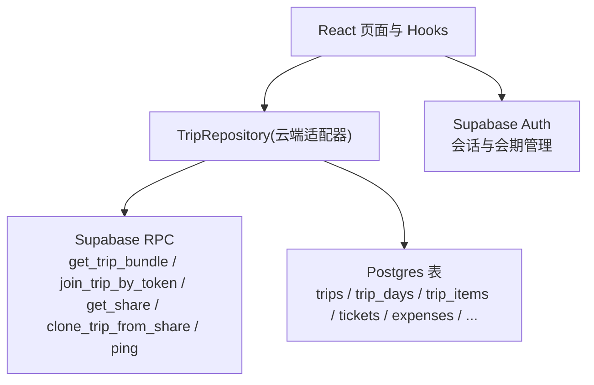
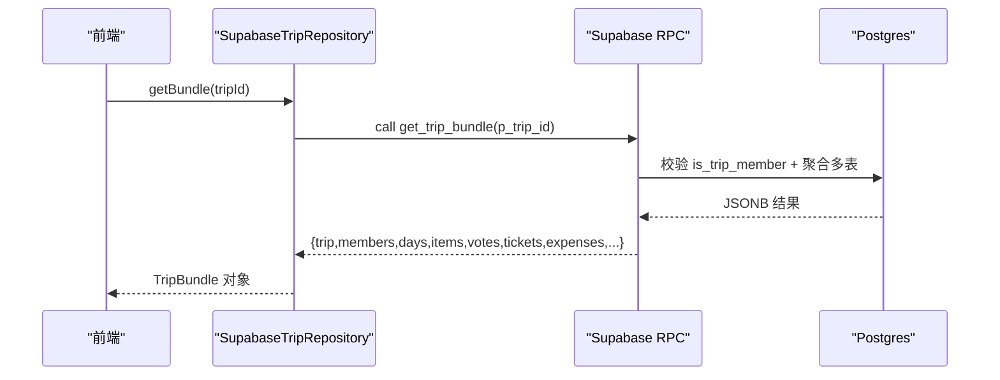
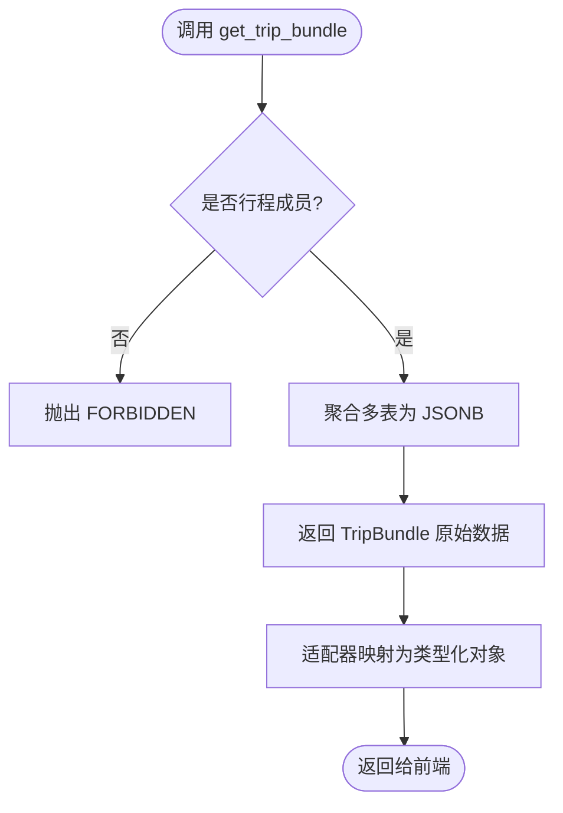
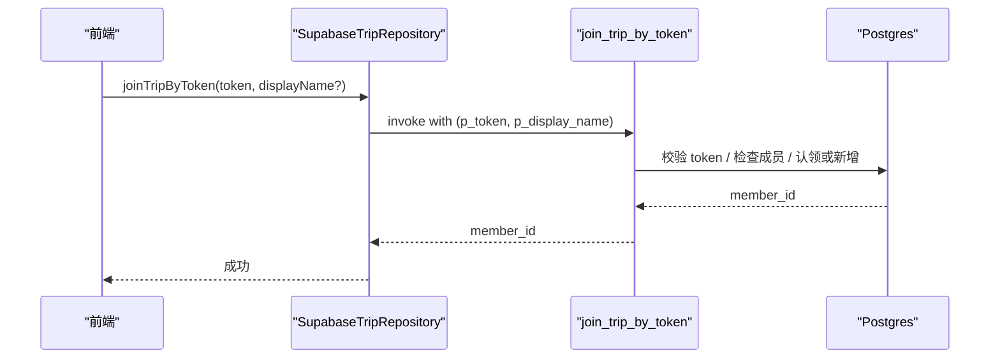
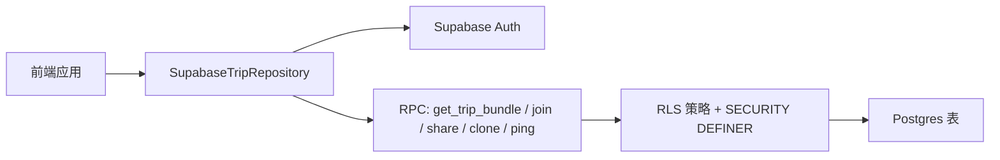

# Supabase RPC接口

<cite>
**本文引用的文件**
- [supabase/migrations/0001_init.sql](file://supabase/migrations/0001_init.sql)
- [src/data/adapters/supabase-trip.ts](file://src/data/adapters/supabase-trip.ts)
- [src/features/trip/queries.ts](file://src/features/trip/queries.ts)
- [src/data/types.ts](file://src/data/types.ts)
- [src/data/supabase-client.ts](file://src/data/supabase-client.ts)
- [supabase/functions/chat-proxy/index.ts](file://supabase/functions/chat-proxy/index.ts)
- [docs/技术方案.md](file://docs/技术方案.md)
</cite>

## 目录
1. [简介](#简介)
2. [项目结构](#项目结构)
3. [核心组件](#核心组件)
4. [架构总览](#架构总览)
5. [详细组件分析](#详细组件分析)
6. [依赖关系分析](#依赖关系分析)
7. [性能考虑](#性能考虑)
8. [故障排查指南](#故障排查指南)
9. [结论](#结论)
10. [附录：客户端集成与示例](#附录客户端集成与示例)

## 简介
本文件面向使用 Supabase 的开发者，系统化说明本项目中基于 Postgres RPC 的聚合查询与协作能力，重点覆盖 get_trip_bundle 等接口的使用方法、参数格式、返回数据结构、错误处理策略，以及在前端的集成方式与性能优化建议。同时解释为何选择 RPC 而非多次 REST 请求，以及在旅行行程协作场景中的适用性。

## 项目结构
- 数据访问层通过 Repository 抽象屏蔽后端差异；云端实现调用 Supabase RPC 与表操作。
- 迁移脚本集中定义表结构、RLS 策略与所有 RPC 函数。
- 前端通过 React Query hooks 封装读取与写操作，配合乐观更新提升交互体验。

图表来源
- [src/data/adapters/supabase-trip.ts:150-198](file://src/data/adapters/supabase-trip.ts#L150-L198)
- [supabase/migrations/0001_init.sql:392-525](file://supabase/migrations/0001_init.sql#L392-L525)

章节来源
- [src/data/adapters/supabase-trip.ts:1-548](file://src/data/adapters/supabase-trip.ts#L1-L548)
- [supabase/migrations/0001_init.sql:1-530](file://supabase/migrations/0001_init.sql#L1-L530)

## 核心组件
- 云端适配器：将业务方法映射到 Supabase RPC 与表操作，统一字段命名（camelCase/snake_case）并组装 TripBundle。
- 迁移脚本：定义全部 RPC 函数、RLS 权限、触发器与索引，确保安全与一致性。
- 前端查询封装：提供 useTripBundle 等 hooks，结合 TanStack Query 缓存与失效策略。

章节来源
- [src/data/adapters/supabase-trip.ts:141-198](file://src/data/adapters/supabase-trip.ts#L141-L198)
- [src/features/trip/queries.ts:15-30](file://src/features/trip/queries.ts#L15-L30)
- [supabase/migrations/0001_init.sql:392-525](file://supabase/migrations/0001_init.sql#L392-L525)

## 架构总览
RPC 在本项目中承担三类职责：
- 聚合读取：一次往返获取行程全量数据，避免多次 REST 请求带来的延迟与并发压力。
- 协作控制：凭邀请 token 加入行程，支持幽灵成员认领与幂等加入。
- 分享与克隆：匿名精确读取分享快照，或按快照克隆为新行程草稿。

图表来源
- [src/data/adapters/supabase-trip.ts:159-198](file://src/data/adapters/supabase-trip.ts#L159-L198)
- [supabase/migrations/0001_init.sql:392-429](file://supabase/migrations/0001_init.sql#L392-L429)

## 详细组件分析

### RPC 列表与用途
- get_trip_bundle(p_trip_id uuid)
  - 作用：一次性返回行程全量数据（行程、成员、日程、条目、投票、票券、账本、分摊、交通、住宿、个人笔记）。
  - 权限：仅行程成员可调用；非成员抛出 FORBIDDEN。
  - 返回：JSONB 对象，键名包含 trip、members、days、items、votes、tickets、expenses、expenseShares、transports、accommodations、myNotes。
- join_trip_by_token(p_token text, p_display_name text default null)
  - 作用：凭邀请 token 加入行程，支持认领幽灵成员并继承历史。
  - 权限：仅已认证用户可调用。
  - 返回：新/已有成员 ID（uuid）。
- get_share(p_slug text)
  - 作用：匿名按 slug 精确读取分享快照（不可枚举）。
  - 权限：anon 与 authenticated 均可调用。
  - 返回：净化后的 payload（jsonb）。
- clone_trip_from_share(p_slug text, p_start_date date, p_title text default null)
  - 作用：从分享快照克隆为当前用户的草稿行程（事务内完成）。
  - 权限：仅已认证用户可调用。
  - 返回：新行程 ID（uuid）。
- ping()
  - 作用：保活函数（免费档闲置约 7 天会暂停，定时任务调用）。
  - 权限：anon 可调用。
  - 返回：文本 "ok"。

章节来源
- [supabase/migrations/0001_init.sql:392-525](file://supabase/migrations/0001_init.sql#L392-L525)

### get_trip_bundle 详解
- 输入参数
  - p_trip_id: uuid，目标行程 ID。
- 权限校验
  - 内部调用 is_trip_member(p_trip_id)，非成员直接 raise exception 'FORBIDDEN'。
- 数据聚合
  - 以 jsonb_build_object 聚合 trips、trip_members、trip_days、trip_items、item_votes、tickets、expenses、expense_shares、transports、accommodations、personal_notes（仅当前用户）。
- 前端适配
  - 适配器将 snake_case 字段映射为 camelCase，并合并 expense.shares 到 Expense 对象。
  - 可选二次调用 get_member_aliases 修正成员显示名（失败降级不阻断主流程）。

图表来源
- [supabase/migrations/0001_init.sql:392-429](file://supabase/migrations/0001_init.sql#L392-L429)
- [src/data/adapters/supabase-trip.ts:159-198](file://src/data/adapters/supabase-trip.ts#L159-L198)

章节来源
- [supabase/migrations/0001_init.sql:392-429](file://supabase/migrations/0001_init.sql#L392-L429)
- [src/data/adapters/supabase-trip.ts:159-198](file://src/data/adapters/supabase-trip.ts#L159-L198)

### join_trip_by_token 流程
- 输入参数
  - p_token: text，邀请令牌。
  - p_display_name: text 可选，认领时用于覆盖幽灵成员展示名。
- 逻辑要点
  - 校验 token 有效性（未过期、未达最大使用次数）。
  - 若已是成员则幂等返回成员 ID。
  - 若定向认领幽灵成员，则绑定当前用户并继承其历史。
  - 否则新增成员记录。
  - 增加 token 使用计数。
- 权限
  - 仅已认证用户可调用。

图表来源
- [supabase/migrations/0001_init.sql:431-465](file://supabase/migrations/0001_init.sql#L431-L465)
- [src/data/adapters/supabase-trip.ts:407-413](file://src/data/adapters/supabase-trip.ts#L407-L413)

章节来源
- [supabase/migrations/0001_init.sql:431-465](file://supabase/migrations/0001_init.sql#L431-L465)
- [src/data/adapters/supabase-trip.ts:407-413](file://src/data/adapters/supabase-trip.ts#L407-L413)

### get_share 与 clone_trip_from_share
- get_share(p_slug)
  - 匿名精确读取分享快照，防止枚举攻击。
  - 返回净化后的 payload（不含敏感字段如 booking_ref）。
- clone_trip_from_share(p_slug, p_start_date, p_title?)
  - 在事务内创建新行程、复制日程与条目（重置状态为候选），返回新行程 ID。
  - 需要已认证用户。

章节来源
- [supabase/migrations/0001_init.sql:467-520](file://supabase/migrations/0001_init.sql#L467-L520)

### 其他 Edge Function（非 RPC）
- chat-proxy
  - 大模型中继，隐藏 API Key，默认开启 JWT 校验，按账号限流。
  - 与 RPC 不同，属于 Edge Function 范畴，但同样体现“服务端藏密钥 + 鉴权”的设计思路。

章节来源
- [supabase/functions/chat-proxy/index.ts:1-81](file://supabase/functions/chat-proxy/index.ts#L1-L81)

## 依赖关系分析
- 前端依赖
  - supabase-client：配置与认证，提供 supabase 实例与登录态监听。
  - TripRepository 实现：封装 RPC 与表操作，统一类型映射。
  - React Query hooks：缓存、失效与乐观更新。
- 后端依赖
  - RLS 与 SECURITY DEFINER 函数：保证跨表权限判断无递归且安全。
  - 触发器：自动维护 updated_at、创建行程后自动添加 owner 为成员。

图表来源
- [src/data/supabase-client.ts:1-106](file://src/data/supabase-client.ts#L1-L106)
- [src/data/adapters/supabase-trip.ts:141-198](file://src/data/adapters/supabase-trip.ts#L141-L198)
- [supabase/migrations/0001_init.sql:288-387](file://supabase/migrations/0001_init.sql#L288-L387)

章节来源
- [src/data/supabase-client.ts:1-106](file://src/data/supabase-client.ts#L1-L106)
- [src/data/adapters/supabase-trip.ts:141-198](file://src/data/adapters/supabase-trip.ts#L141-L198)
- [supabase/migrations/0001_init.sql:288-387](file://supabase/migrations/0001_init.sql#L288-L387)

## 性能考虑
- 使用 get_trip_bundle 一次往返获取全量数据，避免 6+ 次 REST 请求，显著降低国内访问 Supabase 节点的延迟影响。
- 前端采用 TanStack Query 缓存与 staleTime 控制，减少重复请求。
- 写操作采用乐观更新，拖拽排序等高频交互无需等待网络往返，提升 PC 端体验。
- 使用 fractional indexing（rank 字符串）避免整段重排，降低写放大。
- 分享快照模式避免对生产表开放匿名只读，减少误用风险与额外过滤开销。

章节来源
- [docs/技术方案.md:407-420](file://docs/技术方案.md#L407-L420)
- [src/features/trip/queries.ts:41-63](file://src/features/trip/queries.ts#L41-L63)

## 故障排查指南
- 常见错误
  - FORBIDDEN：调用 get_trip_bundle 时非行程成员，需先登录并加入行程。
  - INVALID_INVITE：邀请 token 无效、过期或已达最大使用次数。
  - AUTH_REQUIRED：某些 RPC（如 clone_trip_from_share）要求已认证用户。
  - SHARE_NOT_FOUND：分享 slug 不存在或已被撤销。
- 定位步骤
  - 确认 supabase-client 已正确配置 URL 与 anon key，且已登录。
  - 检查 RLS 策略与 SECURITY DEFINER 函数是否生效。
  - 查看 RPC 返回的错误消息，区分权限问题与数据问题。
  - 对于分享相关错误，确认 slug 是否正确且未被撤销。

章节来源
- [supabase/migrations/0001_init.sql:392-525](file://supabase/migrations/0001_init.sql#L392-L525)
- [src/data/adapters/supabase-trip.ts:159-179](file://src/data/adapters/supabase-trip.ts#L159-L179)

## 结论
本项目通过 Postgres RPC 实现了高内聚、低耦合的数据访问方案：get_trip_bundle 将多表聚合封装在服务端，前端只需一次调用即可获得完整上下文；join_trip_by_token 保障协作安全与幂等；分享与克隆机制兼顾隐私与易用性。配合 RLS 与 SECURITY DEFINER，既保证了安全性，又简化了前端权限判断逻辑。整体架构在零自建服务器的前提下，满足旅行行程协作的核心需求。

## 附录：客户端集成与示例

### 使用 get_trip_bundle 的前端集成
- 通过 useTripBundle hook 获取数据，传入 tripId，自动缓存与失效。
- 适配器内部调用 RPC，并将结果映射为类型化的 TripBundle。
- 错误处理：捕获 FORBIDDEN 提示登录；其他错误降级为空数据。

章节来源
- [src/features/trip/queries.ts:22-30](file://src/features/trip/queries.ts#L22-L30)
- [src/data/adapters/supabase-trip.ts:159-198](file://src/data/adapters/supabase-trip.ts#L159-L198)

### 使用 join_trip_by_token 的集成
- 前端调用 joinTripByToken(token, displayName?)，成功后刷新 bundle。
- 适配器内部调用 RPC，处理认领与新增成员逻辑。

章节来源
- [src/data/adapters/supabase-trip.ts:407-413](file://src/data/adapters/supabase-trip.ts#L407-L413)
- [supabase/migrations/0001_init.sql:431-465](file://supabase/migrations/0001_init.sql#L431-L465)

### 使用 get_share 与 clone_trip_from_share 的集成
- 匿名读取分享：get_share(slug) 返回净化后的 payload。
- 克隆为新行程：clone_trip_from_share(slug, startDate, title?) 返回新行程 ID。

章节来源
- [supabase/migrations/0001_init.sql:467-520](file://supabase/migrations/0001_init.sql#L467-L520)

### 数据类型参考
- TripBundle：包含 trip、members、days、items、votes、tickets、expenses。
- Expense：包含 shares 数组，表示分摊份额。
- Ticket：包含半敏感字段 bookingRef，分享快照中会被净化。

章节来源
- [src/data/types.ts:113-239](file://src/data/types.ts#L113-L239)

### 性能优化建议
- 优先使用 get_trip_bundle 聚合读取，减少往返。
- 使用 TanStack Query 的 staleTime 与 gcTime 控制缓存策略。
- 写操作采用乐观更新，失败回滚并 toast 提示。
- 避免在分享快照中包含敏感字段（由服务端净化）。

章节来源
- [docs/技术方案.md:407-420](file://docs/技术方案.md#L407-L420)
- [src/features/trip/queries.ts:41-63](file://src/features/trip/queries.ts#L41-L63)