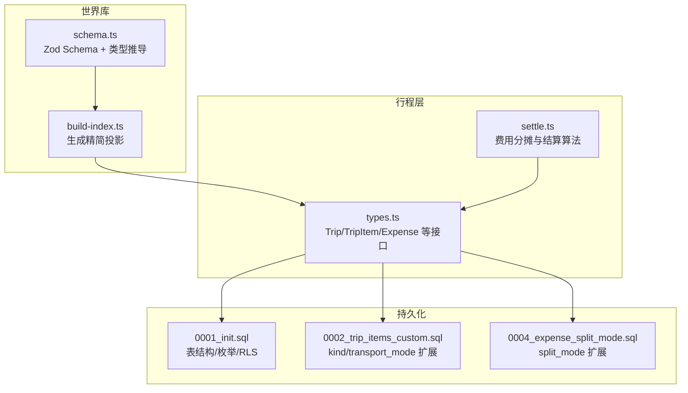
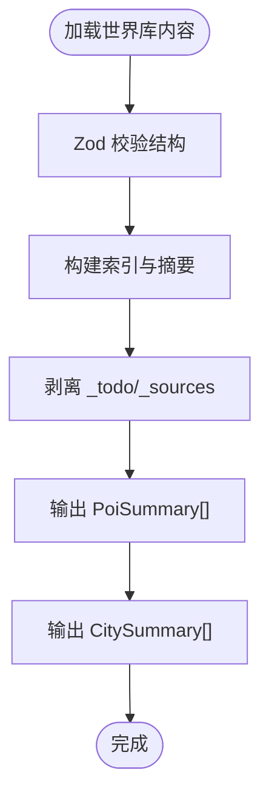
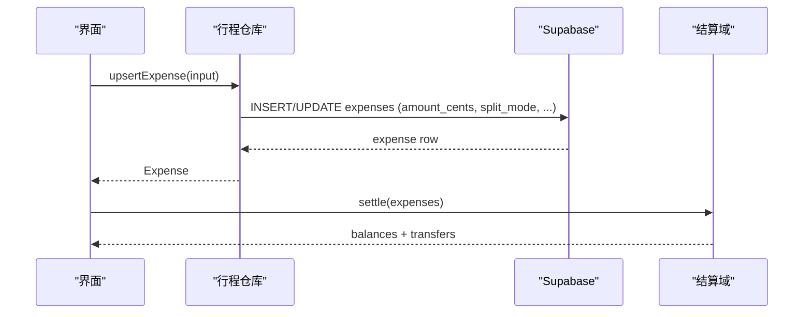
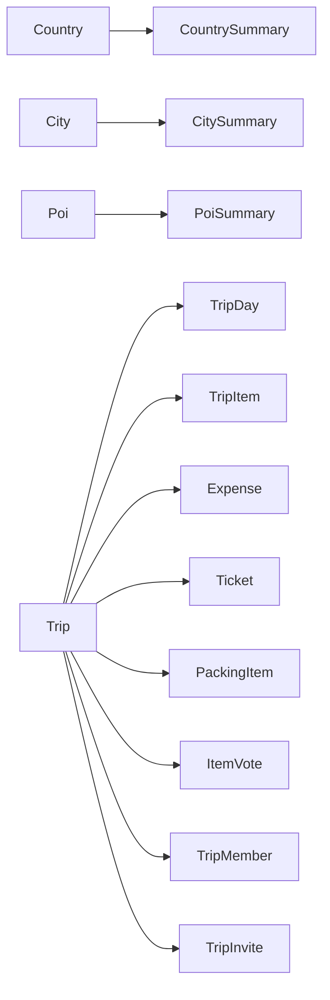
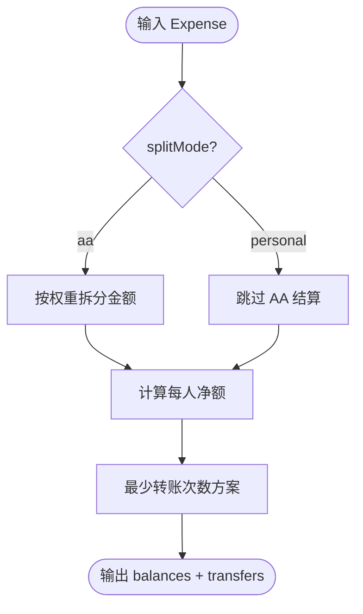
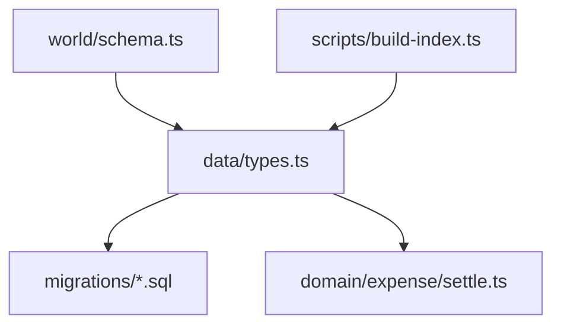

# 数据类型规范

<cite>
**本文引用的文件**
- [src/data/types.ts](file://src/data/types.ts)
- [src/domain/world/schema.ts](file://src/domain/world/schema.ts)
- [supabase/migrations/0001_init.sql](file://supabase/migrations/0001_init.sql)
- [supabase/migrations/0002_trip_items_custom.sql](file://supabase/migrations/0002_trip_items_custom.sql)
- [supabase/migrations/0004_expense_split_mode.sql](file://supabase/migrations/0004_expense_split_mode.sql)
- [src/domain/expense/settle.ts](file://src/domain/expense/settle.ts)
- [scripts/build-index.ts](file://scripts/build-index.ts)
</cite>

## 目录
1. [简介](#简介)
2. [项目结构](#项目结构)
3. [核心组件](#核心组件)
4. [架构总览](#架构总览)
5. [详细组件分析](#详细组件分析)
6. [依赖关系分析](#依赖关系分析)
7. [性能考量](#性能考量)
8. [故障排查指南](#故障排查指南)
9. [结论](#结论)
10. [附录](#附录)

## 简介
本规范聚焦于“世界库”与“行程层”的核心数据类型，覆盖以下实体：PoiSummary、CitySummary、CountrySummary、Trip、TripItem、Expense，以及与之相关的 TripDay、Ticket、PackingItem、ItemVote、TripMember、TripInvite 等。文档说明字段含义、类型约束、业务规则、类型之间的关系图与继承层次，并提供类型验证规则与转换示例路径，帮助开发者在前后端、数据适配层与领域逻辑之间保持一致的数据契约。

## 项目结构
- 世界库 schema 定义位于 domain/world/schema.ts，使用 Zod 进行运行时校验与类型推导；同时导出精简投影 PoiSummarySchema 用于列表与地图渲染。
- 行程层类型定义集中在 data/types.ts，包含 Trip、TripItem、Expense、PackingItem、Ticket、ItemVote、TripDay、TripMember、TripInvite 等，并与 Supabase 迁移中的列名保持 camelCase/snake_case 映射。
- Supabase 迁移脚本（0001_init.sql、0002_trip_items_custom.sql、0004_expense_split_mode.sql）定义了数据库枚举、表结构与约束，是类型与业务规则的权威来源之一。
- 构建脚本 scripts/build-index.ts 负责将世界库内容编译为索引与精简投影（如 PoiSummary），并剥离编著期字段。



图表来源
- [src/domain/world/schema.ts:1-317](file://src/domain/world/schema.ts#L1-L317)
- [scripts/build-index.ts:45-76](file://scripts/build-index.ts#L45-L76)
- [src/data/types.ts:1-300](file://src/data/types.ts#L1-L300)
- [supabase/migrations/0001_init.sql:1-530](file://supabase/migrations/0001_init.sql#L1-L530)
- [supabase/migrations/0002_trip_items_custom.sql:1-75](file://supabase/migrations/0002_trip_items_custom.sql#L1-L75)
- [supabase/migrations/0004_expense_split_mode.sql:1-9](file://supabase/migrations/0004_expense_split_mode.sql#L1-L9)

章节来源
- [src/domain/world/schema.ts:1-317](file://src/domain/world/schema.ts#L1-L317)
- [src/data/types.ts:1-300](file://src/data/types.ts#L1-L300)
- [supabase/migrations/0001_init.sql:1-530](file://supabase/migrations/0001_init.sql#L1-L530)
- [supabase/migrations/0002_trip_items_custom.sql:1-75](file://supabase/migrations/0002_trip_items_custom.sql#L1-L75)
- [supabase/migrations/0004_expense_split_mode.sql:1-9](file://supabase/migrations/0004_expense_split_mode.sql#L1-L9)
- [scripts/build-index.ts:45-76](file://scripts/build-index.ts#L45-L76)

## 核心组件
本节概述所有核心数据类型的职责与关键字段，后续章节展开详细分析与图示。

- 世界库
  - CountrySummary：国家摘要，含 id、name、localName、currency、hasVisa。
  - CitySummary：城市摘要，含 id、name、localName、country、location、poiCount、hasSurvival。
  - PoiSummary：景点摘要，含 id、type、name、localName、city、country、location、tags、popularity、closedWeekdays、hasGuide、durationMinutes、bookingLeadDays。
  - 完整实体 Country/City/Poi 由 schema.ts 的 Zod 定义与 z.infer 推导，提供强约束与可验证性。

- 行程层
  - Trip：行程主记录，含标题、起止日期、基准币种、偏好、状态、打包清单、更新时间等。
  - TripDay：行程日，关联日期与城市。
  - TripItem：时间线条目，支持 poi/transport/note/accommodation 多种 kind，含时段、排序、状态、地址、图片等。
  - Expense：费用记录，金额以整数分存储，含分类、币种、汇率、付款人、花费时间、分摊模式与份额。
  - Ticket：票券信息，含渠道、价格、时间槽、确认号、是否已预订等。
  - PackingItem：打包清单项，含分类、文本、完成状态、归属与负责人。
  - ItemVote：投票，成员对条目的正负倾向。
  - TripMember/TripInvite：协作成员与邀请令牌。

章节来源
- [src/data/types.ts:12-239](file://src/data/types.ts#L12-L239)
- [src/domain/world/schema.ts:58-231](file://src/domain/world/schema.ts#L58-L231)

## 架构总览
下图展示世界库与行程层之间的类型关系与数据流向：世界库提供 POI/城市/国家参考数据；行程层通过 Trip/TripItem 组织日程，并通过 Expense/Ticket 记录消费与票务；构建脚本将世界库内容编译为精简投影供前端使用。

```mermaid
classDiagram
class CountrySummary {
+string id
+string name
+string localName
+string currency
+boolean hasVisa
}
class CitySummary {
+string id
+string name
+string localName
+string country
+{lat : number;lng : number} location
+number poiCount
+boolean hasSurvival
}
class PoiSummary {
+string id
+string type
+string name
+string localName
+string city
+string country
+{lat : number;lng : number} location
+string[] tags
+number popularity
+number[] closedWeekdays
+boolean hasGuide
+[number,number] durationMinutes
+number|null bookingLeadDays
}
class Trip {
+string id
+string|nullable ownerId
+string title
+string|nullable startDate
+string|nullable endDate
+string baseCurrency
+object preferences
+string|nullable sourceTripId
+string|nullable sourceLabel
+string status
+PackingItem[] packing
+string updatedAt
}
class TripDay {
+string id
+string tripId
+string date
+string|nullable cityId
+string|nullable note
}
class TripItem {
+string id
+string tripId
+string|nullable dayId
+string kind
+string|nullable poiId
+string|nullable customTitle
+TransportMode|nullable transportMode
+string|nullable fromCityId
+string|nullable toCityId
+string rank
+string|nullable slotStart
+string|nullable slotEnd
+string status
+string|nullable note
+string|nullable address
+string[]|nullable images
+string updatedAt
}
class Expense {
+string id
+string tripId
+string|nullable dayId
+string|nullable itemId
+string category
+string title
+number amountCents
+string currency
+number fxRate
+string payerMemberId
+string spentAt
+string|nullable note
+string splitMode
+{memberId : string;weight : number}[] shares
}
class Ticket {
+string id
+string tripId
+string|nullable itemId
+string title
+string|nullable channel
+string|nullable officialUrl
+number|null priceCents
+string|null currency
+string|null timeSlot
+string|null bookingRef
+boolean booked
+number|null leadDays
+string|null note
}
TripDay --> Trip : "属于"
TripItem --> Trip : "属于"
Expense --> Trip : "属于"
Ticket --> Trip : "属于"
CitySummary --> CountrySummary : "所属国家"
PoiSummary --> CitySummary : "位于城市"
```

图表来源
- [src/data/types.ts:12-239](file://src/data/types.ts#L12-L239)
- [src/domain/world/schema.ts:58-231](file://src/domain/world/schema.ts#L58-L231)

## 详细组件分析

### 世界库类型：Country、City、Poi 与摘要投影
- Country
  - 标识与名称：id（ISO 3166-1 alpha-2）、name、localName。
  - 基础信息：currency（三字代码）、languages、timezone、plugTypes、emergencyNumbers、tipping。
  - 签证信息：visaArea、type、applyChannel、materials、fee、processingDays、earliestApplyDays、latestApplyDays、notes。
  - 校验：id 小写两位字母；currency 长度 3；语言数组至少一项；易变字段需带 source 与 verifiedAt。

- City
  - 标识与名称：id（格式 city-xxx）、name、localName。
  - 地理与时区：country（两位字母）、location（经纬度范围校验）、timezone。
  - 生存信息与交通通票：survival（主题、摘要、提示、来源与核实日期）、transitPasses（名称、范围、权益、可选价格与链接）。

- Poi
  - 标识与分类：id（格式 poi-xxx）、aliases、type（博物馆/地标/公园/观景台/教堂/市场/餐厅/车站/设施/其他）。
  - 名称与位置：name、localName、city、country、location。
  - 标签与热度：tags、popularity（0-100）。
  - 外部引用：wikidataId、officialUrl。
  - 游览信息：visit.durationMinutes（区间分钟）、durationNote、bestTime。
  - 开放性与预约：openness（闭馆周、固定闭馆日、季节性区间）、booking（required、leadDays、url）。
  - 设施：toilet/wifi/locker/water/accessible。
  - 易变信息：price/hours/booking（均带 source 与 verifiedAt）。
  - 导览与图片：guide（入口、路线、亮点、收藏、提示）、image（版权图源与署名）。
  - 编著期字段：_todo/_sources（构建时剥离）。

- 摘要投影
  - PoiSummary：从 Poi 派生的精简视图，包含 id/type/name/localName/city/country/location/tags/popularity/closedWeekdays/hasGuide/durationMinutes/bookingLeadDays。
  - CitySummary：id/name/localName/country/location/poiCount/hasSurvival。
  - CountrySummary：id/name/localName/currency/hasVisa。
  - 构建流程：build-index.ts 读取世界库内容，生成精简投影并写入静态资源。



图表来源
- [src/domain/world/schema.ts:20-231](file://src/domain/world/schema.ts#L20-L231)
- [scripts/build-index.ts:45-76](file://scripts/build-index.ts#L45-L76)

章节来源
- [src/domain/world/schema.ts:58-231](file://src/domain/world/schema.ts#L58-L231)
- [scripts/build-index.ts:45-76](file://scripts/build-index.ts#L45-L76)

### 行程层类型：Trip、TripDay、TripItem、Expense、Ticket、PackingItem、ItemVote、TripMember、TripInvite
- Trip
  - 基本信息：id、ownerId、title、startDate、endDate、baseCurrency、preferences（如 excludeTags）。
  - 跟随来源：sourceTripId、sourceLabel。
  - 状态：planning/ongoing/finished/archived。
  - 打包清单：packing（见 PackingItem）。
  - 更新：updatedAt。

- TripDay
  - id、tripId、date、cityId（世界库城市引用）、note。

- TripItem
  - 种类：kind（poi/transport/note/accommodation）。
  - 目标：poiId 或 customTitle（二选一）。
  - 交通相关：transportMode（train/flight/bus/ferry/car/walk/other）、fromCityId、toCityId。
  - 排序与时段：rank（fractional index）、slotStart/slotEnd。
  - 状态：wishlist/candidate/confirmed/visited/dropped。
  - 备注与地址：note、address（住宿详细地址）。
  - 附件：images（公开 URL 数组，仅云端档）。
  - 更新：updatedAt。

- Expense
  - 分类：ticket/transport/food/stay/shopping/other。
  - 金额与货币：amountCents（整数分）、currency、fxRate（换算到行程基准币种）。
  - 付款人与时间：payerMemberId、spentAt。
  - 分摊模式：splitMode（aa/personal）。
  - 份额：shares（成员与权重）。
  - 备注：note。

- Ticket
  - 标题、渠道、官方链接、价格（cents）、币种、时间槽、确认号（不进入分享快照）、是否已预订、建议提前天数、备注。

- PackingItem
  - 分类、文本、完成状态、归属（ownerId）、负责人（assigneeId，公共项）、备注。

- ItemVote
  - itemId、memberId、value（1/-1）。

- TripMember
  - id、tripId、userId（可为空即幽灵成员）、displayName、role（owner/member）、color。

- TripInvite
  - id、tripId、token、claimMemberId（定向认领幽灵成员）、expiresAt、maxUses、usedCount、createdAt。



图表来源
- [src/data/types.ts:212-239](file://src/data/types.ts#L212-L239)
- [supabase/migrations/0001_init.sql:162-190](file://supabase/migrations/0001_init.sql#L162-L190)
- [supabase/migrations/0004_expense_split_mode.sql:1-9](file://supabase/migrations/0004_expense_split_mode.sql#L1-L9)
- [src/domain/expense/settle.ts:1-141](file://src/domain/expense/settle.ts#L1-L141)

章节来源
- [src/data/types.ts:95-239](file://src/data/types.ts#L95-L239)
- [supabase/migrations/0001_init.sql:100-190](file://supabase/migrations/0001_init.sql#L100-L190)
- [supabase/migrations/0002_trip_items_custom.sql:1-75](file://supabase/migrations/0002_trip_items_custom.sql#L1-L75)
- [supabase/migrations/0004_expense_split_mode.sql:1-9](file://supabase/migrations/0004_expense_split_mode.sql#L1-L9)
- [src/domain/expense/settle.ts:1-141](file://src/domain/expense/settle.ts#L1-L141)

### 类型之间的关系与继承层次
- 世界库
  - CountrySummary 与 CitySummary、PoiSummary 为精简投影，分别来源于完整的 Country/City/Poi 定义。
  - PoiSummary 由 PoiSchema.pick().extend() 派生，保留必要字段并补充 closedWeekdays/hasGuide/durationMinutes/bookingLeadDays。

- 行程层
  - Trip 聚合 TripDay、TripItem、Expense、Ticket、PackingItem、ItemVote、TripMember、TripInvite。
  - TripItem.kind 决定附加字段语义（transport 需要 transportMode/fromCityId/toCityId；accommodation 需要 address）。
  - Expense.splitMode 影响结算行为（personal 不参与 AA 结算）。



图表来源
- [src/domain/world/schema.ts:233-242](file://src/domain/world/schema.ts#L233-L242)
- [src/data/types.ts:113-239](file://src/data/types.ts#L113-L239)

章节来源
- [src/domain/world/schema.ts:233-242](file://src/domain/world/schema.ts#L233-L242)
- [src/data/types.ts:113-239](file://src/data/types.ts#L113-L239)

### 类型验证规则与业务规则
- 世界库
  - 日期格式：YYYY-MM-DD。
  - 坐标范围：lat ∈ [-90,90]，lng ∈ [-180,180]。
  - 国家边界框校验：检查 POI 坐标是否在指定国家范围内，防止经纬度写反。
  - 游览时长区间：下限 ≤ 上限。
  - 高热度博物馆（≥80）必须配备 guide 深导览。
  - 易变字段时效：verifiedAt 不得晚于今天；超过 180 天未核实发出警告。
  - 构建时剥离 _todo/_sources 等编著期字段。

- 行程层
  - 枚举约束：item_status、member_role、trip_status、expense_category、transport_mode、split_mode。
  - 金额单位：一律整数分（cents），避免浮点漂移。
  - 分摊算法：按权重拆分，最大余数法保证总和守恒。
  - 结算主体：trip_members.id（支持幽灵成员参与记账与结算）。
  - 个人自付：splitMode=personal 的支出跳过共同分摊。



图表来源
- [src/domain/expense/settle.ts:38-130](file://src/domain/expense/settle.ts#L38-L130)
- [supabase/migrations/0004_expense_split_mode.sql:1-9](file://supabase/migrations/0004_expense_split_mode.sql#L1-L9)

章节来源
- [src/domain/world/schema.ts:20-231](file://src/domain/world/schema.ts#L20-L231)
- [src/domain/expense/settle.ts:1-141](file://src/domain/expense/settle.ts#L1-L141)
- [supabase/migrations/0004_expense_split_mode.sql:1-9](file://supabase/migrations/0004_expense_split_mode.sql#L1-L9)

### 转换示例与适配器
- 世界库构建
  - build-index.ts 将完整 Poi 转换为 PoiSummary，剥离编著期字段，并生成城市索引（含 poiCount、hasSurvival）。
  - 查询过滤：支持按城市、类型、标签、关键词筛选 POI。

- 行程数据映射
  - Supabase 适配器将数据库 snake_case 列映射为 types.ts 的 camelCase 字段（例如 start_date → startDate）。
  - TripBundle 一次性获取行程全量数据，减少往返。

章节来源
- [scripts/build-index.ts:45-76](file://scripts/build-index.ts#L45-L76)
- [src/data/adapters/supabase-trip.ts:33-75](file://src/data/adapters/supabase-trip.ts#L33-L75)
- [src/data/types.ts:231-239](file://src/data/types.ts#L231-L239)

## 依赖关系分析
- 世界库 schema 是类型与校验的唯一事实来源；行程层通过导入 world schema 的类型（如 Poi['type']）保持与参考数据一致。
- 行程层类型与数据库迁移严格对应，确保 API 与存储层的一致性。
- 结算域依赖行程层 Expense 类型，实现分摊与最小转账次数算法。



图表来源
- [src/domain/world/schema.ts:1-317](file://src/domain/world/schema.ts#L1-L317)
- [src/data/types.ts:1-300](file://src/data/types.ts#L1-L300)
- [supabase/migrations/0001_init.sql:1-530](file://supabase/migrations/0001_init.sql#L1-L530)
- [supabase/migrations/0002_trip_items_custom.sql:1-75](file://supabase/migrations/0002_trip_items_custom.sql#L1-L75)
- [supabase/migrations/0004_expense_split_mode.sql:1-9](file://supabase/migrations/0004_expense_split_mode.sql#L1-L9)
- [src/domain/expense/settle.ts:1-141](file://src/domain/expense/settle.ts#L1-L141)
- [scripts/build-index.ts:45-76](file://scripts/build-index.ts#L45-L76)

章节来源
- [src/domain/world/schema.ts:1-317](file://src/domain/world/schema.ts#L1-L317)
- [src/data/types.ts:1-300](file://src/data/types.ts#L1-L300)
- [supabase/migrations/0001_init.sql:1-530](file://supabase/migrations/0001_init.sql#L1-L530)
- [supabase/migrations/0002_trip_items_custom.sql:1-75](file://supabase/migrations/0002_trip_items_custom.sql#L1-L75)
- [supabase/migrations/0004_expense_split_mode.sql:1-9](file://supabase/migrations/0004_expense_split_mode.sql#L1-L9)
- [src/domain/expense/settle.ts:1-141](file://src/domain/expense/settle.ts#L1-L141)
- [scripts/build-index.ts:45-76](file://scripts/build-index.ts#L45-L76)

## 性能考量
- 世界库精简投影：PoiSummary/CitySummary 降低传输与渲染开销，适合列表与地图场景。
- 行程 Bundle：一次性获取 TripBundle，减少多次网络往返。
- 金额运算：统一使用整数分，避免浮点误差累积。
- 结算算法：针对旅行团规模（n≤8）采用回溯+剪枝求最优解；更大规模退化为贪心，保证 n−1 笔以内。

[本节为通用指导，无需特定文件来源]

## 故障排查指南
- 世界库内容校验失败
  - 检查日期格式、坐标范围、国家边界框、游览时长区间、高热度博物馆导览要求、易变字段时效。
  - 构建前运行内容校验脚本，修复结构错误后再构建。

- 行程数据不一致
  - 核对 types.ts 字段与 migrations 列名映射（camelCase ↔ snake_case）。
  - 确认 TripItem.kind 与附加字段一致性（transport 需要 transportMode/fromCityId/toCityId）。
  - 检查 Expense.splitMode 是否符合预期（personal 不参与 AA 结算）。

- 结算异常
  - 确认金额单位为整数分，权重为正数。
  - 验证 splitAmount 的最大余数法分配结果总和守恒。
  - 检查 computeBalances 中 personal 支出是否被正确跳过。

章节来源
- [src/domain/world/schema.ts:248-317](file://src/domain/world/schema.ts#L248-L317)
- [src/data/types.ts:159-228](file://src/data/types.ts#L159-L228)
- [src/domain/expense/settle.ts:38-130](file://src/domain/expense/settle.ts#L38-L130)
- [supabase/migrations/0001_init.sql:100-190](file://supabase/migrations/0001_init.sql#L100-L190)
- [supabase/migrations/0004_expense_split_mode.sql:1-9](file://supabase/migrations/0004_expense_split_mode.sql#L1-L9)

## 结论
本规范明确了世界库与行程层的核心数据类型、字段约束与业务规则，提供了类型关系图与关键流程图，帮助团队在数据建模、适配层与领域逻辑间保持一致。遵循本规范可有效降低数据不一致风险，提升系统可维护性与可扩展性。

[本节为总结性内容，无需特定文件来源]

## 附录
- 枚举值参考
  - item_status：wishlist/candidate/confirmed/visited/dropped
  - member_role：owner/member
  - trip_status：planning/ongoing/finished/archived
  - expense_category：ticket/transport/food/stay/shopping/other
  - transport_mode：train/flight/bus/ferry/car/walk/other
  - split_mode：aa/personal

- 关键类型路径
  - 世界库 schema：[src/domain/world/schema.ts](file://src/domain/world/schema.ts)
  - 行程层类型：[src/data/types.ts](file://src/data/types.ts)
  - 费用结算：[src/domain/expense/settle.ts](file://src/domain/expense/settle.ts)
  - 数据库迁移：[supabase/migrations/0001_init.sql](file://supabase/migrations/0001_init.sql)、[supabase/migrations/0002_trip_items_custom.sql](file://supabase/migrations/0002_trip_items_custom.sql)、[supabase/migrations/0004_expense_split_mode.sql](file://supabase/migrations/0004_expense_split_mode.sql)
  - 构建脚本：[scripts/build-index.ts](file://scripts/build-index.ts)

[本节为参考信息，无需特定文件来源]