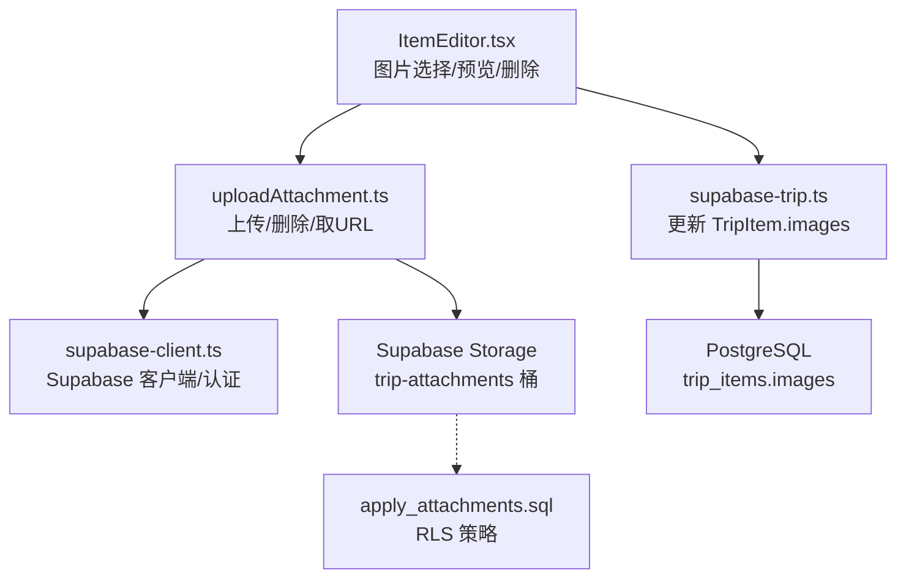
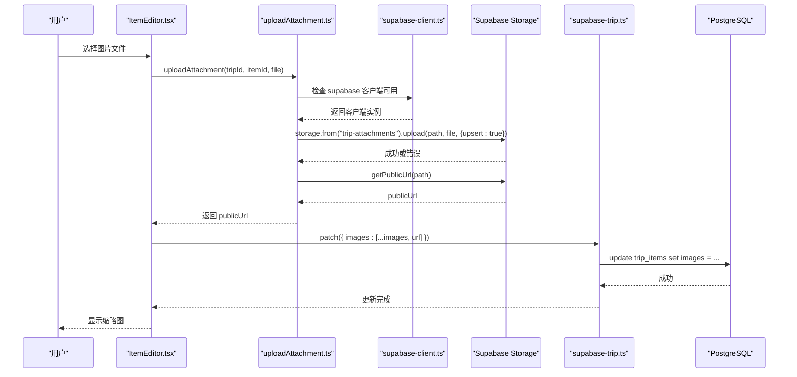
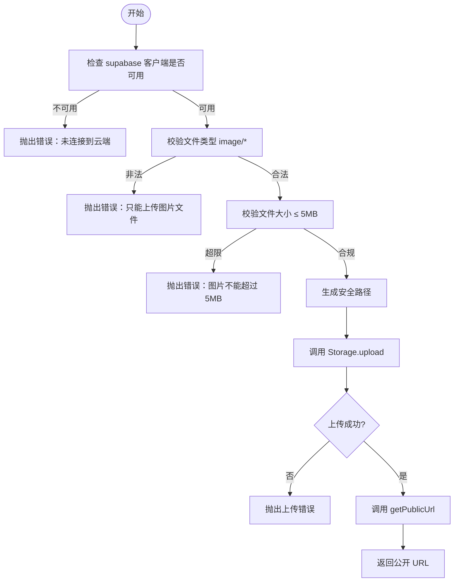
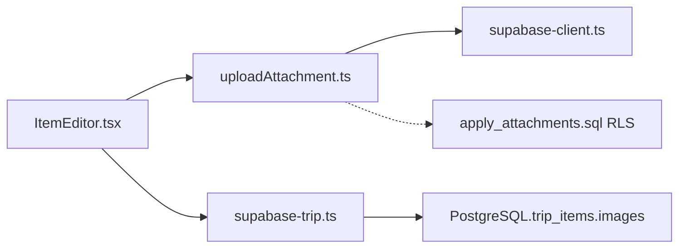

# 文件上传接口

<cite>
**本文引用的文件**
- [src/features/trip/uploadAttachment.ts](file://src/features/trip/uploadAttachment.ts)
- [src/data/supabase-client.ts](file://src/data/supabase-client.ts)
- [src/features/trip/ItemEditor.tsx](file://src/features/trip/ItemEditor.tsx)
- [src/features/trip/ItemEditor.module.css](file://src/features/trip/ItemEditor.module.css)
- [supabase/migrations/0005_trip_item_images.sql](file://supabase/migrations/0005_trip_item_images.sql)
- [supabase/apply_attachments.sql](file://supabase/apply_attachments.sql)
- [src/data/types.ts](file://src/data/types.ts)
- [src/data/adapters/supabase-trip.ts](file://src/data/adapters/supabase-trip.ts)
- [src/ui/toast.tsx](file://src/ui/toast.tsx)
</cite>

## 目录
1. [简介](#简介)
2. [项目结构](#项目结构)
3. [核心组件](#核心组件)
4. [架构总览](#架构总览)
5. [详细组件分析](#详细组件分析)
6. [依赖关系分析](#依赖关系分析)
7. [性能与体验优化](#性能与体验优化)
8. [故障排查指南](#故障排查指南)
9. [结论](#结论)
10. [附录：完整示例与最佳实践](#附录完整示例与最佳实践)

## 简介
本文件上传接口用于在“云端档”模式下，将用户选择的图片附件上传至 Supabase Storage 的 trip-attachments 桶，并返回公开直链 URL。该 URL 会写入行程条目 TripItem.images 字段，以便后续展示与分享。本地档（localStorage）模式不支持图片上传，仅保留 images 字段以兼容导出快照。

本接口涵盖：
- 文件选择与基础校验（类型、大小）
- 上传流程与错误处理
- 公开 URL 获取与写回数据层
- Supabase Storage 集成与权限控制（RLS）
- 安全策略（文件名清洗、MIME 白名单、大小限制）
- 前端交互（缩略图预览、删除、错误提示）

[无具体文件分析引用]

## 项目结构
围绕文件上传的关键路径如下：
- 前端 UI：ItemEditor.tsx 提供图片选择、预览、删除与错误提示
- 上传逻辑：uploadAttachment.ts 封装 Supabase Storage 上传、删除与 URL 获取
- 客户端配置：supabase-client.ts 提供 Supabase 客户端单例与认证能力
- 数据模型与持久化：types.ts 定义 TripItem.images；supabase-trip.ts 负责更新 images 数组
- 数据库与存储配置：migrations/0005_trip_item_images.sql 增加 images 列；apply_attachments.sql 创建 bucket 与 RLS 策略

图表来源
- [src/features/trip/ItemEditor.tsx:377-449](file://src/features/trip/ItemEditor.tsx#L377-L449)
- [src/features/trip/uploadAttachment.ts:21-46](file://src/features/trip/uploadAttachment.ts#L21-L46)
- [src/data/supabase-client.ts:24-34](file://src/data/supabase-client.ts#L24-L34)
- [src/data/adapters/supabase-trip.ts:310-333](file://src/data/adapters/supabase-trip.ts#L310-L333)
- [supabase/apply_attachments.sql:60-78](file://supabase/apply_attachments.sql#L60-L78)

章节来源
- [src/features/trip/ItemEditor.tsx:377-449](file://src/features/trip/ItemEditor.tsx#L377-L449)
- [src/features/trip/uploadAttachment.ts:1-54](file://src/features/trip/uploadAttachment.ts#L1-L54)
- [src/data/supabase-client.ts:1-34](file://src/data/supabase-client.ts#L1-L34)
- [src/data/adapters/supabase-trip.ts:310-333](file://src/data/adapters/supabase-trip.ts#L310-L333)
- [supabase/migrations/0005_trip_item_images.sql:1-12](file://supabase/migrations/0005_trip_item_images.sql#L1-L12)
- [supabase/apply_attachments.sql:1-82](file://supabase/apply_attachments.sql#L1-L82)

## 核心组件
- 上传与删除封装：uploadAttachment.ts
  - uploadAttachment(tripId, itemId, file): 校验文件、生成安全路径、调用 Storage 上传、返回公开 URL
  - deleteAttachment(url): 从公开 URL 反解对象路径并删除
  - isCloudStorage(): 判断是否启用云端存储
- 前端交互：ItemEditor.tsx
  - ImageSection：文件选择、上传中状态、错误提示、缩略图网格、删除按钮
- 客户端与认证：supabase-client.ts
  - 提供 supabase 客户端实例、匿名登录等能力，决定 isCloudStorage() 行为
- 数据适配：supabase-trip.ts
  - updateItem 支持 images 字段更新，将上传后的 URL 数组持久化到 trip_items.images
- 数据库与存储配置：
  - migrations/0005_trip_item_images.sql：为 trip_items 添加 images text[] 列
  - apply_attachments.sql：创建 trip-attachments 桶、设置 MIME 白名单与文件大小限制、配置 RLS 策略

章节来源
- [src/features/trip/uploadAttachment.ts:1-54](file://src/features/trip/uploadAttachment.ts#L1-L54)
- [src/features/trip/ItemEditor.tsx:377-449](file://src/features/trip/ItemEditor.tsx#L377-L449)
- [src/data/supabase-client.ts:1-34](file://src/data/supabase-client.ts#L1-L34)
- [src/data/adapters/supabase-trip.ts:310-333](file://src/data/adapters/supabase-trip.ts#L310-L333)
- [supabase/migrations/0005_trip_item_images.sql:1-12](file://supabase/migrations/0005_trip_item_images.sql#L1-L12)
- [supabase/apply_attachments.sql:1-82](file://supabase/apply_attachments.sql#L1-L82)

## 架构总览
下图展示了从用户选择图片到最终显示缩略图的完整调用链，以及后端权限与存储策略的作用点。

图表来源
- [src/features/trip/ItemEditor.tsx:394-418](file://src/features/trip/ItemEditor.tsx#L394-L418)
- [src/features/trip/uploadAttachment.ts:21-36](file://src/features/trip/uploadAttachment.ts#L21-L36)
- [src/data/supabase-client.ts:24-34](file://src/data/supabase-client.ts#L24-L34)
- [src/data/adapters/supabase-trip.ts:310-333](file://src/data/adapters/supabase-trip.ts#L310-L333)

## 详细组件分析

### 上传与删除封装（uploadAttachment.ts）
- 文件校验
  - 类型校验：仅允许 image/* 类型
  - 大小限制：最大 5MB
- 路径生成
  - 文件名清洗：移除不安全字符并截取长度，避免注入与过长路径
  - 对象 key：tripId/itemId/时间戳-安全文件名
- 上传与 URL 获取
  - 使用 upsert 确保幂等覆盖
  - 上传成功后通过 getPublicUrl 获取公开直链
- 删除
  - 从公开 URL 解析对象路径后调用 remove 删除
- 云端可用性
  - isCloudStorage() 基于 supabase 客户端是否为 null 判定

图表来源
- [src/features/trip/uploadAttachment.ts:21-36](file://src/features/trip/uploadAttachment.ts#L21-L36)

章节来源
- [src/features/trip/uploadAttachment.ts:1-54](file://src/features/trip/uploadAttachment.ts#L1-L54)

### 前端交互（ItemEditor.tsx）
- 图片区域渲染
  - 非云端模式：显示提示文案，不暴露上传入口
  - 云端模式：展示缩略图网格、上传按钮、删除按钮
- 文件选择与上传
  - 触发 onPick：设置 busy 状态、清空 input、调用 uploadAttachment
  - 成功：追加 URL 到 images 并通过 patch 更新
  - 失败：捕获错误并显示错误信息
- 删除图片
  - 触发 onRemove：调用 deleteAttachment，成功后从 images 过滤掉对应 URL
- 样式
  - 缩略图固定尺寸、圆角、边框
  - 上传按钮虚线框，hover 高亮
  - 错误提示红色文字

章节来源
- [src/features/trip/ItemEditor.tsx:377-449](file://src/features/trip/ItemEditor.tsx#L377-L449)
- [src/features/trip/ItemEditor.module.css:89-158](file://src/features/trip/ItemEditor.module.css#L89-L158)

### Supabase 客户端与认证（supabase-client.ts）
- 客户端初始化
  - 读取环境变量 SUPABASE_URL 与 SUPABASE_ANON_KEY
  - 若配置齐全则创建客户端，否则 supabase 为 null
- 会话监听
  - useSession 提供 loading/session/user 状态
- 登录方式
  - 匿名登录、邮箱 OTP、邮箱+密码注册/登录、登出
- 对上传的影响
  - 未配置时 isCloudStorage() 为 false，UI 隐藏上传入口
  - 已配置但用户未登录时，Storage RLS 会拒绝写入

章节来源
- [src/data/supabase-client.ts:1-34](file://src/data/supabase-client.ts#L1-L34)
- [src/data/supabase-client.ts:71-105](file://src/data/supabase-client.ts#L71-L105)

### 数据模型与持久化（types.ts 与 supabase-trip.ts）
- TripItem.images
  - 类型为 string[] | null，仅云端模式使用，本地模式保留兼容
- 更新 images
  - supabase-trip.ts 的 updateItem 支持 images 字段映射到数据库列
  - 前端通过 patch({ images: [...] }) 触发更新

章节来源
- [src/data/types.ts:159-186](file://src/data/types.ts#L159-L186)
- [src/data/adapters/supabase-trip.ts:310-333](file://src/data/adapters/supabase-trip.ts#L310-L333)

### 数据库与存储配置（migrations 与 apply_attachments.sql）
- trip_items.images 列
  - 迁移脚本为 trip_items 表新增 images text[] 列，默认空数组
- trip-attachments 桶
  - 动态探测版本差异，插入 bucket 并设置 file_size_limit=5MB、allowed_mime_types 仅图片
- RLS 策略
  - 公开读：任何人均可读取 trip-attachments 下的对象
  - 已登录用户可上传与删除：authenticated 角色允许 insert/delete 且限定 bucket_id

章节来源
- [supabase/migrations/0005_trip_item_images.sql:1-12](file://supabase/migrations/0005_trip_item_images.sql#L1-L12)
- [supabase/apply_attachments.sql:28-58](file://supabase/apply_attachments.sql#L28-L58)
- [supabase/apply_attachments.sql:60-78](file://supabase/apply_attachments.sql#L60-L78)

## 依赖关系分析
- ItemEditor.tsx 依赖 uploadAttachment.ts 进行上传与删除
- uploadAttachment.ts 依赖 supabase-client.ts 获取客户端实例
- supabase-trip.ts 依赖 supabase 客户端更新 trip_items.images
- 存储访问受 apply_attachments.sql 中的 RLS 策略约束
- 数据类型由 types.ts 统一描述，保证前后端一致

图表来源
- [src/features/trip/ItemEditor.tsx:377-449](file://src/features/trip/ItemEditor.tsx#L377-L449)
- [src/features/trip/uploadAttachment.ts:21-46](file://src/features/trip/uploadAttachment.ts#L21-L46)
- [src/data/supabase-client.ts:24-34](file://src/data/supabase-client.ts#L24-L34)
- [src/data/adapters/supabase-trip.ts:310-333](file://src/data/adapters/supabase-trip.ts#L310-L333)
- [supabase/apply_attachments.sql:60-78](file://supabase/apply_attachments.sql#L60-L78)

章节来源
- [src/features/trip/ItemEditor.tsx:377-449](file://src/features/trip/ItemEditor.tsx#L377-L449)
- [src/features/trip/uploadAttachment.ts:21-46](file://src/features/trip/uploadAttachment.ts#L21-L46)
- [src/data/supabase-client.ts:24-34](file://src/data/supabase-client.ts#L24-L34)
- [src/data/adapters/supabase-trip.ts:310-333](file://src/data/adapters/supabase-trip.ts#L310-L333)
- [supabase/apply_attachments.sql:60-78](file://supabase/apply_attachments.sql#L60-L78)

## 性能与体验优化
- 当前实现要点
  - 前端无进度条：上传过程通过 busy 状态禁用按钮并显示“上传中…”
  - 无图片压缩：直接上传原图，受限于 5MB 上限与 MIME 白名单
  - 无额外安全检查：依赖浏览器 accept 与后端 MIME 白名单
- 建议优化方向
  - 进度监控：使用 Supabase Storage 的流式上传回调或自定义分片上传，展示百分比进度
  - 图片压缩：在前端使用 Canvas/WebAssembly 压缩后再上传，降低带宽与存储成本
  - 格式验证：扩展 MIME 白名单与前端校验，拒绝危险类型
  - 安全加固：服务端校验文件名与内容头，结合 WAF/CDN 防护
  - 错误反馈：接入 toast.tsx 统一提示，提升用户体验

[本节为通用指导，不直接分析具体文件]

## 故障排查指南
- 无法看到上传入口
  - 检查 supabase 客户端是否配置（SUPABASE_URL、SUPABASE_ANON_KEY）
  - 确认 isCloudStorage() 返回 true
  - 参考：[src/data/supabase-client.ts:24-34](file://src/data/supabase-client.ts#L24-L34)、[src/features/trip/uploadAttachment.ts:16-19](file://src/features/trip/uploadAttachment.ts#L16-L19)
- 上传失败：类型或大小不符
  - 检查文件类型是否为 image/*，大小是否超过 5MB
  - 参考：[src/features/trip/uploadAttachment.ts:21-25](file://src/features/trip/uploadAttachment.ts#L21-L25)
- 上传失败：权限不足
  - 确认用户已登录（匿名登录也算 authenticated）
  - 检查 Storage RLS 策略是否正确创建
  - 参考：[supabase/apply_attachments.sql:60-78](file://supabase/apply_attachments.sql#L60-L78)
- 删除失败
  - 检查 URL 是否能正确解析对象路径
  - 参考：[src/features/trip/uploadAttachment.ts:40-53](file://src/features/trip/uploadAttachment.ts#L40-L53)
- 图片未显示
  - 确认 TripItem.images 已更新并持久化
  - 参考：[src/data/adapters/supabase-trip.ts:310-333](file://src/data/adapters/supabase-trip.ts#L310-L333)

章节来源
- [src/data/supabase-client.ts:24-34](file://src/data/supabase-client.ts#L24-L34)
- [src/features/trip/uploadAttachment.ts:16-53](file://src/features/trip/uploadAttachment.ts#L16-L53)
- [supabase/apply_attachments.sql:60-78](file://supabase/apply_attachments.sql#L60-L78)
- [src/data/adapters/supabase-trip.ts:310-333](file://src/data/adapters/supabase-trip.ts#L310-L333)

## 结论
本文件上传接口以最小依赖实现了“选择—校验—上传—取URL—写回—展示”的闭环，并通过 Supabase Storage 的 RLS 策略保障安全性。当前实现简洁可靠，适合快速上线；如需更好的体验与安全性，可在前端加入进度监控、图片压缩与更严格的格式校验，并在服务端加强内容检测与访问控制。

[本节为总结性内容，不直接分析具体文件]

## 附录：完整示例与最佳实践

### 完整上传流程（步骤说明）
- 准备环境
  - 配置环境变量 SUPABASE_URL、SUPABASE_ANON_KEY
  - 执行 apply_attachments.sql 创建 bucket 与 RLS 策略
  - 执行 0005_trip_item_images.sql 为 trip_items 添加 images 列
- 前端操作
  - 进入 ItemEditor 的图片区域（需云端模式）
  - 点击“+ 上传”，选择图片文件
  - 等待上传完成，页面显示缩略图
  - 可点击删除按钮移除图片
- 数据落库
  - 上传成功后，images 数组追加公开 URL
  - 通过 updateItem 持久化到 trip_items.images

章节来源
- [supabase/apply_attachments.sql:1-82](file://supabase/apply_attachments.sql#L1-L82)
- [supabase/migrations/0005_trip_item_images.sql:1-12](file://supabase/migrations/0005_trip_item_images.sql#L1-L12)
- [src/features/trip/ItemEditor.tsx:394-418](file://src/features/trip/ItemEditor.tsx#L394-L418)
- [src/data/adapters/supabase-trip.ts:310-333](file://src/data/adapters/supabase-trip.ts#L310-L333)

### 最佳实践
- 安全
  - 始终启用 RLS，仅允许 authenticated 用户上传/删除
  - 限制 MIME 类型与文件大小，避免恶意文件
  - 文件名清洗与长度限制，防止路径注入
- 体验
  - 增加上传进度条与重试机制
  - 前端压缩图片，减少带宽与存储占用
  - 统一错误提示（可使用 toast.tsx）
- 可维护性
  - 集中管理上传逻辑（uploadAttachment.ts），便于扩展与测试
  - 明确数据模型（TripItem.images），保持前后端一致

章节来源
- [src/features/trip/uploadAttachment.ts:21-46](file://src/features/trip/uploadAttachment.ts#L21-L46)
- [src/ui/toast.tsx:1-81](file://src/ui/toast.tsx#L1-L81)
- [supabase/apply_attachments.sql:28-78](file://supabase/apply_attachments.sql#L28-L78)