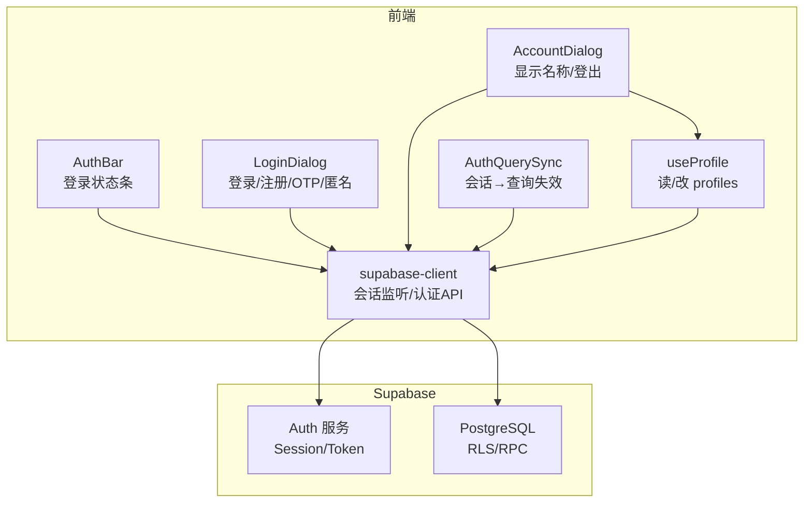
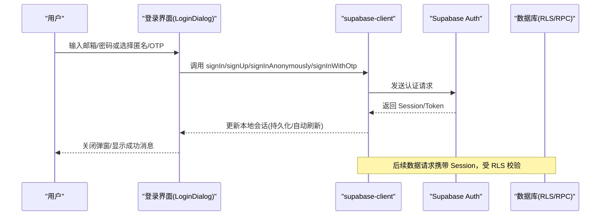
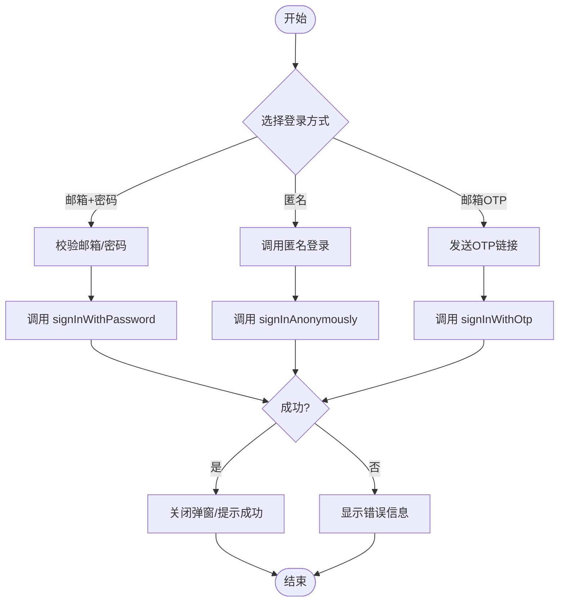
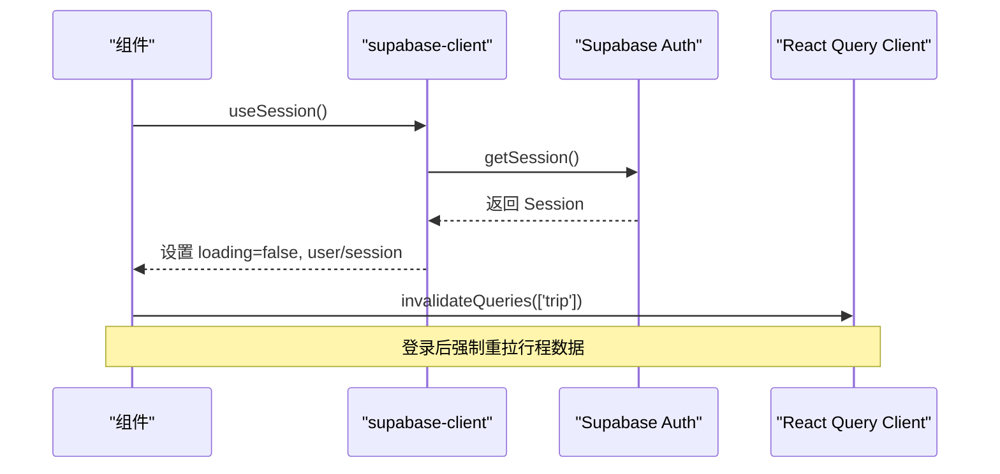
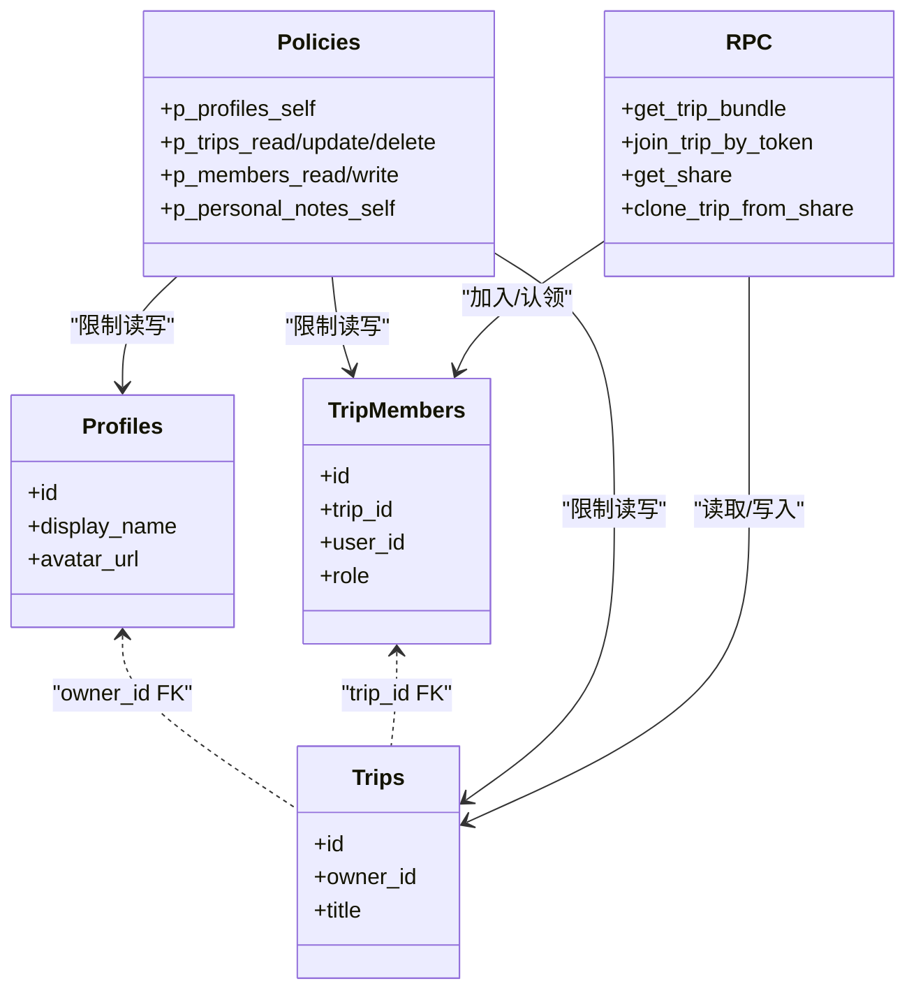
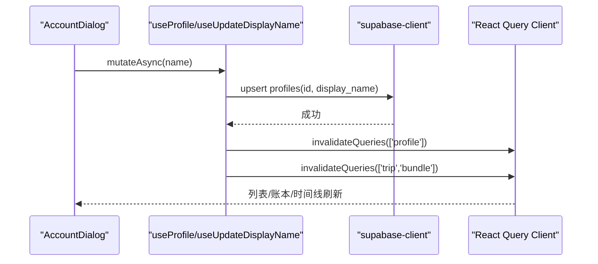
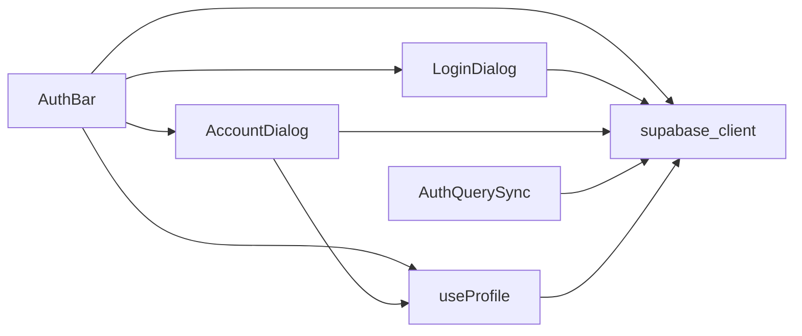

# 认证接口

<cite>
**本文引用的文件**
- [src/data/supabase-client.ts](file://src/data/supabase-client.ts)
- [src/features/auth/AuthBar.tsx](file://src/features/auth/AuthBar.tsx)
- [src/features/auth/LoginDialog.tsx](file://src/features/auth/LoginDialog.tsx)
- [src/features/auth/AccountDialog.tsx](file://src/features/auth/AccountDialog.tsx)
- [src/features/auth/AuthQuerySync.tsx](file://src/features/auth/AuthQuerySync.tsx)
- [src/features/auth/useProfile.ts](file://src/features/auth/useProfile.ts)
- [supabase/migrations/0001_init.sql](file://supabase/migrations/0001_init.sql)
- [scripts/verify-password-login.cjs](file://scripts/verify-password-login.cjs)
</cite>

## 目录
1. [简介](#简介)
2. [项目结构](#项目结构)
3. [核心组件](#核心组件)
4. [架构总览](#架构总览)
5. [详细组件分析](#详细组件分析)
6. [依赖关系分析](#依赖关系分析)
7. [性能考虑](#性能考虑)
8. [故障排查指南](#故障排查指南)
9. [结论](#结论)
10. [附录](#附录)

## 简介
本文件面向“认证相关接口”的完整说明，覆盖用户登录、注册、会话管理与权限验证流程；解释 Supabase Auth 在前端的集成方式与自定义认证逻辑；包含令牌管理、状态同步与错误处理机制；并提供认证时序图与集成示例。该应用支持三种登录方式：邮箱+密码、匿名快速体验、邮箱魔法链接（OTP）。所有数据访问通过 Supabase RLS（行级安全）进行权限控制，必须拥有有效会话才能读写受保护资源。

## 项目结构
认证能力由以下模块协作完成：
- 客户端与认证入口：封装 Supabase 客户端实例、会话监听与认证方法
- UI 层：登录条、登录对话框、账户对话框
- 状态同步：登录态变化时触发查询失效，确保数据按新会话刷新
- 资料与别名：读取/更新 profiles.display_name，并联动行程成员缓存
- 后端权限：RLS 策略与 RPC 函数定义在迁移文件中

图表来源
- [src/features/auth/AuthBar.tsx:18-56](file://src/features/auth/AuthBar.tsx#L18-L56)
- [src/features/auth/LoginDialog.tsx:18-159](file://src/features/auth/LoginDialog.tsx#L18-L159)
- [src/features/auth/AccountDialog.tsx:13-96](file://src/features/auth/AccountDialog.tsx#L13-L96)
- [src/features/auth/AuthQuerySync.tsx:15-27](file://src/features/auth/AuthQuerySync.tsx#L15-L27)
- [src/features/auth/useProfile.ts:19-65](file://src/features/auth/useProfile.ts#L19-L65)
- [src/data/supabase-client.ts:17-106](file://src/data/supabase-client.ts#L17-L106)

章节来源
- [src/data/supabase-client.ts:17-106](file://src/data/supabase-client.ts#L17-L106)
- [src/features/auth/AuthBar.tsx:18-56](file://src/features/auth/AuthBar.tsx#L18-L56)
- [src/features/auth/LoginDialog.tsx:18-159](file://src/features/auth/LoginDialog.tsx#L18-L159)
- [src/features/auth/AccountDialog.tsx:13-96](file://src/features/auth/AccountDialog.tsx#L13-L96)
- [src/features/auth/AuthQuerySync.tsx:15-27](file://src/features/auth/AuthQuerySync.tsx#L15-L27)
- [src/features/auth/useProfile.ts:19-65](file://src/features/auth/useProfile.ts#L19-L65)
- [supabase/migrations/0001_init.sql:25-327](file://supabase/migrations/0001_init.sql#L25-L327)

## 核心组件
- supabase-client：提供 isSupabaseConfigured、useSession、signInAnonymously、signInWithOtp、signUp、signInWithPassword、signOut。负责创建 Supabase 客户端、持久化 Session、自动刷新 Token、监听 auth 状态变化。
- AuthBar：根据是否配置 Supabase、是否加载完毕、是否已登录，渲染登录按钮或用户信息与登出操作。
- LoginDialog：实现邮箱+密码登录/注册、匿名登录、邮箱 OTP 登录，统一错误与成功提示。
- AccountDialog：查看当前身份、修改显示名称（profiles.display_name）、登出。
- useProfile：读取当前用户的 profiles，并通过 React Query 缓存；提供更新显示名称的 Mutation，并在成功后使相关查询失效。
- AuthQuerySync：监听会话变化，立即失效 trip 相关查询，避免登录后仍展示旧数据。

章节来源
- [src/data/supabase-client.ts:17-106](file://src/data/supabase-client.ts#L17-L106)
- [src/features/auth/AuthBar.tsx:18-56](file://src/features/auth/AuthBar.tsx#L18-L56)
- [src/features/auth/LoginDialog.tsx:18-159](file://src/features/auth/LoginDialog.tsx#L18-L159)
- [src/features/auth/AccountDialog.tsx:13-96](file://src/features/auth/AccountDialog.tsx#L13-L96)
- [src/features/auth/useProfile.ts:19-65](file://src/features/auth/useProfile.ts#L19-L65)
- [src/features/auth/AuthQuerySync.tsx:15-27](file://src/features/auth/AuthQuerySync.tsx#L15-L27)

## 架构总览
认证流程围绕 Supabase Auth 展开：前端通过 supabase-client 调用认证 API，Supabase 返回并维护 Session/Token；React 组件通过 useSession 订阅会话变化；业务数据访问受 RLS 约束，未登录或无权限将被拒绝；当会话变化时，AuthQuerySync 主动失效查询缓存，保证数据一致性。

图表来源
- [src/features/auth/LoginDialog.tsx:37-82](file://src/features/auth/LoginDialog.tsx#L37-L82)
- [src/data/supabase-client.ts:71-106](file://src/data/supabase-client.ts#L71-L106)
- [supabase/migrations/0001_init.sql:309-386](file://supabase/migrations/0001_init.sql#L309-L386)

## 详细组件分析

### 登录/注册/登出流程
- 邮箱+密码登录：表单校验后调用 signInWithPassword，成功后关闭弹窗并刷新页面以获取最新会话。
- 邮箱+密码注册：校验邮箱与密码长度后调用 signUp，提示“注册成功，使用同一邮箱登录”。
- 匿名登录：一键调用 signInAnonymously，获得真实 uid，便于 RLS 生效。
- 邮箱魔法链接：调用 signInWithOtp，邮件回跳至首页后刷新完成登录。
- 登出：调用 signOut，清除会话，触发查询失效。

图表来源
- [src/features/auth/LoginDialog.tsx:37-82](file://src/features/auth/LoginDialog.tsx#L37-L82)
- [src/data/supabase-client.ts:71-106](file://src/data/supabase-client.ts#L71-L106)

章节来源
- [src/features/auth/LoginDialog.tsx:18-159](file://src/features/auth/LoginDialog.tsx#L18-L159)
- [src/data/supabase-client.ts:71-106](file://src/data/supabase-client.ts#L71-L106)

### 会话管理与状态同步
- 会话监听：useSession 初始化时获取当前 Session，并订阅 onAuthStateChange，实时更新 loading/session/user。
- 查询失效：AuthQuerySync 在 session 或 loading 变化时，失效 ['trip'] 分组查询，确保登录后用新会话重新拉取数据。
- 令牌管理：supabase-client 启用 persistSession 与 autoRefreshToken，无需手动刷新 Token；HashRouter 下关闭 detectSessionInUrl，避免路由干扰。

图表来源
- [src/data/supabase-client.ts:45-69](file://src/data/supabase-client.ts#L45-L69)
- [src/features/auth/AuthQuerySync.tsx:15-27](file://src/features/auth/AuthQuerySync.tsx#L15-L27)

章节来源
- [src/data/supabase-client.ts:45-69](file://src/data/supabase-client.ts#L45-L69)
- [src/features/auth/AuthQuerySync.tsx:15-27](file://src/features/auth/AuthQuerySync.tsx#L15-L27)

### 权限验证与数据访问
- RLS 策略：profiles 仅本人可读写；trips 及子表通过 is_trip_member/is_trip_owner 判定；personal_notes 仅本人且必须是行程成员；shares 仅 owner 管理。
- RPC 函数：get_trip_bundle、join_trip_by_token、get_share、clone_trip_from_share 等，部分仅限 authenticated 角色执行。
- 匿名访问：仅 get_share 和 ping 允许 anon；其他写操作需 authenticated。

图表来源
- [supabase/migrations/0001_init.sql:25-327](file://supabase/migrations/0001_init.sql#L25-L327)
- [supabase/migrations/0001_init.sql:392-525](file://supabase/migrations/0001_init.sql#L392-L525)

章节来源
- [supabase/migrations/0001_init.sql:25-327](file://supabase/migrations/0001_init.sql#L25-L327)
- [supabase/migrations/0001_init.sql:392-525](file://supabase/migrations/0001_init.sql#L392-L525)

### 显示名称与别名同步
- 读取：useProfile 基于 userId 查询 profiles，启用 react-query 缓存，登录态变化自动重取。
- 更新：useUpdateDisplayName 将 trim 后的名称 upsert 到 profiles，成功后失效 ['profile'] 与 ['trip','bundle']，确保全局昵称在所有行程中即时生效。
- 显示：AuthBar 优先使用 profile.display_name，匿名用户显示“匿名用户”，否则截断 email/id。

图表来源
- [src/features/auth/useProfile.ts:41-65](file://src/features/auth/useProfile.ts#L41-L65)
- [src/features/auth/AccountDialog.tsx:27-36](file://src/features/auth/AccountDialog.tsx#L27-L36)

章节来源
- [src/features/auth/useProfile.ts:19-65](file://src/features/auth/useProfile.ts#L19-L65)
- [src/features/auth/AccountDialog.tsx:13-96](file://src/features/auth/AccountDialog.tsx#L13-L96)

## 依赖关系分析
- 组件耦合：
  - AuthBar 依赖 supabase-client 的 isSupabaseConfigured、useSession、signOut，以及 useProfile、LoginDialog、AccountDialog。
  - LoginDialog 依赖 supabase-client 的四种认证方法。
  - AccountDialog 依赖 supabase-client 的 useSession、signOut 与 useProfile 的 useUpdateDisplayName。
  - AuthQuerySync 依赖 supabase-client 的 useSession 与 React Query 的 invalidateQueries。
  - useProfile 依赖 supabase-client 的 supabase 单例与 useSession。
- 外部依赖：
  - @supabase/supabase-js：认证与 REST 客户端
  - @tanstack/react-query：缓存与失效管理
  - Supabase 后端：Auth、RLS、RPC

图表来源
- [src/features/auth/AuthBar.tsx:18-56](file://src/features/auth/AuthBar.tsx#L18-L56)
- [src/features/auth/LoginDialog.tsx:18-159](file://src/features/auth/LoginDialog.tsx#L18-L159)
- [src/features/auth/AccountDialog.tsx:13-96](file://src/features/auth/AccountDialog.tsx#L13-L96)
- [src/features/auth/AuthQuerySync.tsx:15-27](file://src/features/auth/AuthQuerySync.tsx#L15-L27)
- [src/features/auth/useProfile.ts:19-65](file://src/features/auth/useProfile.ts#L19-L65)
- [src/data/supabase-client.ts:17-106](file://src/data/supabase-client.ts#L17-L106)

章节来源
- [src/features/auth/AuthBar.tsx:18-56](file://src/features/auth/AuthBar.tsx#L18-L56)
- [src/features/auth/LoginDialog.tsx:18-159](file://src/features/auth/LoginDialog.tsx#L18-L159)
- [src/features/auth/AccountDialog.tsx:13-96](file://src/features/auth/AccountDialog.tsx#L13-L96)
- [src/features/auth/AuthQuerySync.tsx:15-27](file://src/features/auth/AuthQuerySync.tsx#L15-L27)
- [src/features/auth/useProfile.ts:19-65](file://src/features/auth/useProfile.ts#L19-L65)
- [src/data/supabase-client.ts:17-106](file://src/data/supabase-client.ts#L17-L106)

## 性能考虑
- 会话持久化与自动刷新：启用 persistSession 与 autoRefreshToken，减少重复登录与 Token 过期导致的失败。
- 查询缓存与失效：使用 react-query 缓存 profile 与 trip 数据；会话变化时及时失效，避免陈旧数据。
- 最小化网络往返：通过 RPC（如 get_trip_bundle）一次性获取行程全量数据，降低多次请求开销。
- 条件渲染：未配置 Supabase 时不渲染认证相关 UI，零干扰本地模式。

[本节为通用指导，不直接分析具体文件]

## 故障排查指南
- 未配置 Supabase：isSupabaseConfigured 为 false 时，认证 UI 不渲染；检查环境变量 VITE_SUPABASE_URL 与 VITE_SUPABASE_ANON_KEY。
- 邮箱+密码登录失败：确认后台 Email provider 开启“Email/Password”，若开启确认邮件，需先确认再登录；可使用脚本验证闭环。
- OTP 登录无效：确认邮件服务商配置正确，回跳地址设置为首页；打开邮件后刷新页面完成登录。
- 登录后数据未刷新：检查 AuthQuerySync 是否正确失效 ['trip']；必要时手动刷新页面。
- 显示名称保存失败：检查名称是否为空；确认 RLS 允许本人修改；查看错误消息定位问题。

章节来源
- [src/data/supabase-client.ts:17-34](file://src/data/supabase-client.ts#L17-L34)
- [scripts/verify-password-login.cjs:1-33](file://scripts/verify-password-login.cjs#L1-L33)
- [src/features/auth/LoginDialog.tsx:37-82](file://src/features/auth/LoginDialog.tsx#L37-L82)
- [src/features/auth/AuthQuerySync.tsx:15-27](file://src/features/auth/AuthQuerySync.tsx#L15-L27)
- [src/features/auth/useProfile.ts:41-65](file://src/features/auth/useProfile.ts#L41-L65)

## 结论
本项目通过 Supabase Auth 实现了完整的认证体系，支持邮箱+密码、匿名、OTP 三种登录方式；结合 RLS 与 RPC 保障数据安全；通过 react-query 与会话监听实现高效的状态同步与缓存失效；UI 层提供简洁一致的登录与账户管理体验。部署时需确保环境变量与后端配置正确，并按需开启邮件服务与匿名登录。

[本节为总结性内容，不直接分析具体文件]

## 附录

### 认证接口清单（前端暴露的方法）
- 会话与配置
  - isSupabaseConfigured：布尔值，指示是否配置了 Supabase
  - useSession()：返回 { loading, session, user }，监听会话变化
- 认证方法
  - signInAnonymously()：匿名登录
  - signInWithOtp(email)：发送邮箱魔法链接
  - signUp(email, password)：注册账号
  - signInWithPassword(email, password)：邮箱+密码登录
  - signOut()：登出

章节来源
- [src/data/supabase-client.ts:17-106](file://src/data/supabase-client.ts#L17-L106)

### 集成示例（端到端流程）
- 用户点击“登录”弹出 LoginDialog
- 选择“邮箱+密码”并填写表单
- 调用 signInWithPassword，成功后关闭弹窗
- AuthQuerySync 检测到会话变化，失效 ['trip'] 查询
- 页面重新拉取行程数据，显示成员与账本

章节来源
- [src/features/auth/AuthBar.tsx:18-56](file://src/features/auth/AuthBar.tsx#L18-L56)
- [src/features/auth/LoginDialog.tsx:18-159](file://src/features/auth/LoginDialog.tsx#L18-L159)
- [src/features/auth/AuthQuerySync.tsx:15-27](file://src/features/auth/AuthQuerySync.tsx#L15-L27)