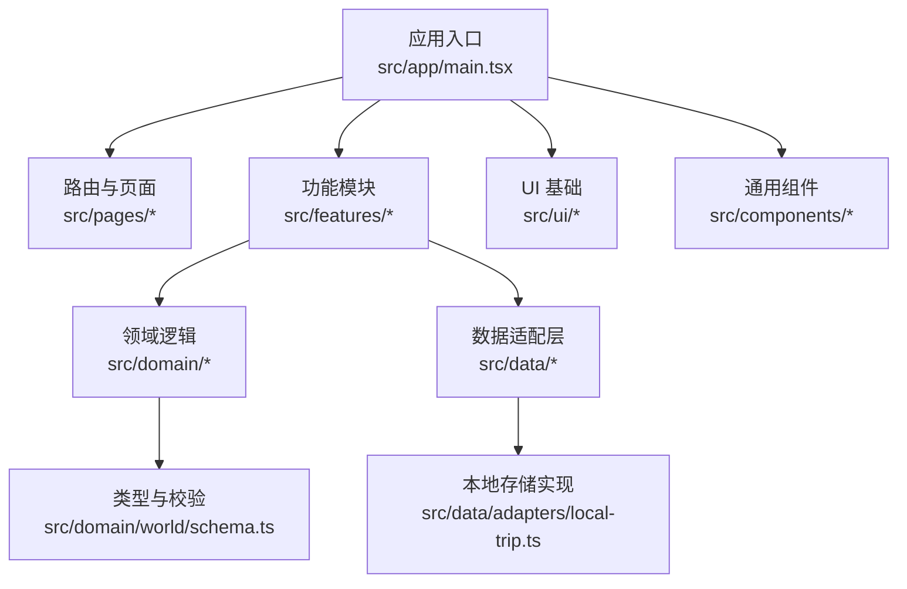
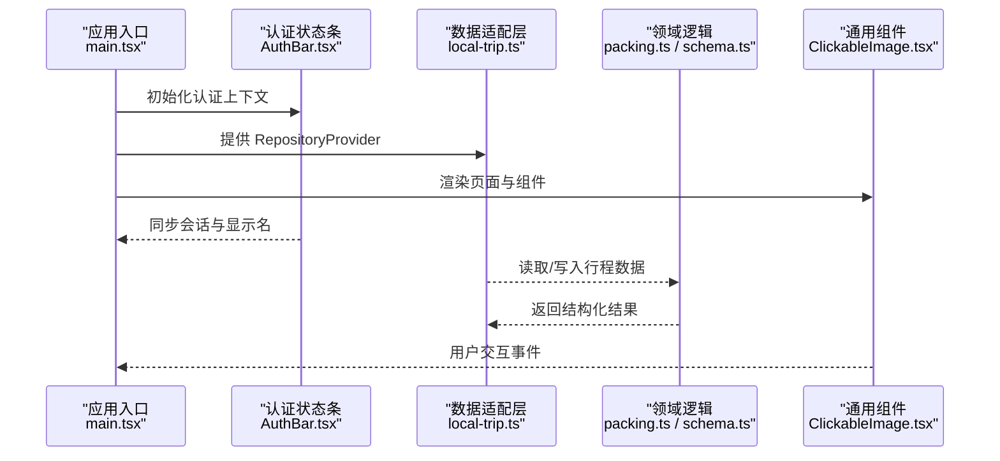
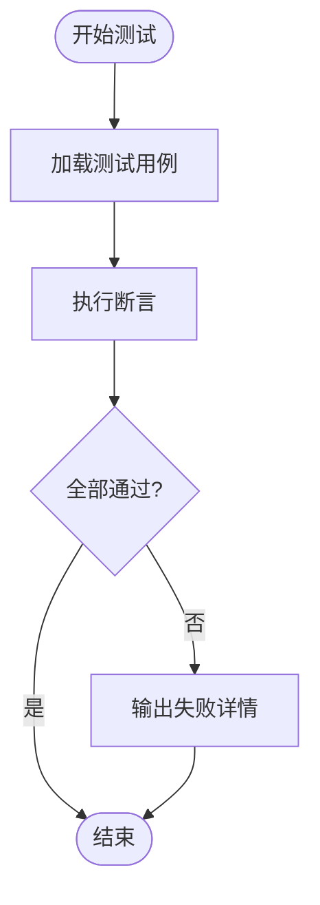
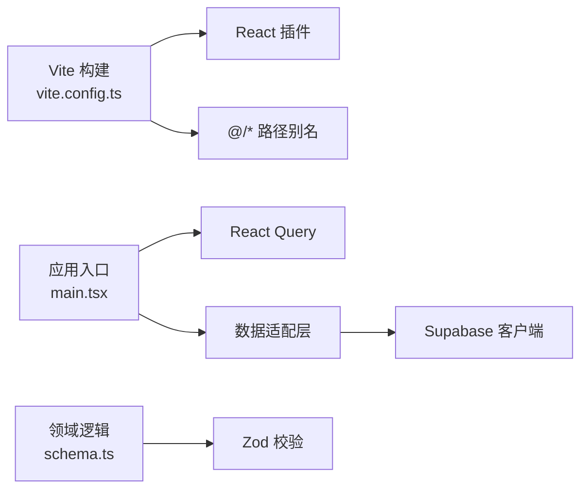
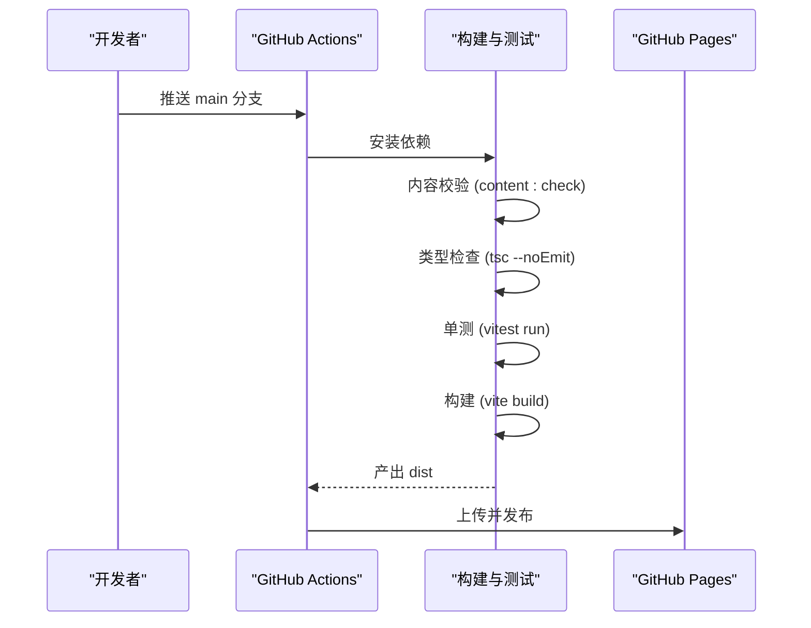

# 代码规范

<cite>
**本文引用的文件**
- [package.json](file://package.json)
- [tsconfig.json](file://tsconfig.json)
- [vite.config.ts](file://vite.config.ts)
- [.github/workflows/deploy.yml](file://.github/workflows/deploy.yml)
- [src/app/main.tsx](file://src/app/main.tsx)
- [src/components/ClickableImage.tsx](file://src/components/ClickableImage.tsx)
- [src/features/auth/AuthBar.tsx](file://src/features/auth/AuthBar.tsx)
- [src/data/adapters/local-trip.ts](file://src/data/adapters/local-trip.ts)
- [src/domain/world/schema.ts](file://src/domain/world/schema.ts)
- [src/domain/trip/packing.ts](file://src/domain/trip/packing.ts)
- [src/domain/trip/packing.test.ts](file://src/domain/trip/packing.test.ts)
</cite>

## 目录
1. [简介](#简介)
2. [项目结构](#项目结构)
3. [核心组件](#核心组件)
4. [架构总览](#架构总览)
5. [详细组件分析](#详细组件分析)
6. [依赖分析](#依赖分析)
7. [性能考虑](#性能考虑)
8. [故障排查指南](#故障排查指南)
9. [结论](#结论)
10. [附录](#附录)

## 简介
本规范面向“玩无一失”前端工程，统一 TypeScript、React、测试、注释与提交规范，并明确 ESLint/Prettier/Git 工作流建议与自动化检查点。规范基于仓库现有配置与实践提炼，确保在本地开发、CI 与 GitHub Pages 部署中保持一致的代码质量与可维护性。

## 项目结构
- 应用入口与运行时装配：src/app/main.tsx
- 路由与页面：src/pages/*（按页面拆分）
- 功能域：src/features/*（认证、行程、世界库等）
- 领域逻辑：src/domain/*（纯函数与业务规则，含单测）
- 数据适配层：src/data/*（本地与云端适配器抽象）
- UI 基础：src/ui/*（样式与通用 UI）
- 脚本与内容校验：scripts/*（构建索引、内容校验）
- 构建与测试：vite.config.ts、package.json、tsconfig.json
- CI/CD：.github/workflows/deploy.yml

**图示来源**
- [src/app/main.tsx:1-38](file://src/app/main.tsx#L1-L38)
- [src/domain/world/schema.ts:1-317](file://src/domain/world/schema.ts#L1-L317)
- [src/data/adapters/local-trip.ts:1-349](file://src/data/adapters/local-trip.ts#L1-L349)

**章节来源**
- [package.json:7-16](file://package.json#L7-L16)
- [vite.config.ts:5-36](file://vite.config.ts#L5-L36)
- [tsconfig.json:1-31](file://tsconfig.json#L1-L31)

## 核心组件
- 应用启动与上下文装配：使用 React Query、RepositoryProvider、ToastProvider、AuthQuerySync 与 RouterProvider 组合根节点，关闭窗口聚焦重取以避免不必要的闪烁。
- 认证状态条：根据 Supabase 配置与登录态渲染登录/登出与账户信息；未配置时不渲染，保证本地模式零干扰。
- 图片预览组件：自包含的点击放大与画廊能力，通过 Portal 挂载到 body，支持键盘导航与无障碍属性。
- 本地行程适配器：以 localStorage 为事实源，提供与云端一致的 TripRepository 接口，便于离线开发与演示。
- 世界库 Schema：以 Zod 定义国家、城市、POI 等数据结构，并提供运行时解析与 CI 内容校验。

**章节来源**
- [src/app/main.tsx:12-37](file://src/app/main.tsx#L12-L37)
- [src/features/auth/AuthBar.tsx:1-57](file://src/features/auth/AuthBar.tsx#L1-L57)
- [src/components/ClickableImage.tsx:1-147](file://src/components/ClickableImage.tsx#L1-L147)
- [src/data/adapters/local-trip.ts:1-349](file://src/data/adapters/local-trip.ts#L1-L349)
- [src/domain/world/schema.ts:1-317](file://src/domain/world/schema.ts#L1-L317)

## 架构总览
下图展示从入口到功能域与数据层的调用关系，以及类型校验在数据侧的边界作用。

**图示来源**
- [src/app/main.tsx:12-37](file://src/app/main.tsx#L12-L37)
- [src/features/auth/AuthBar.tsx:18-56](file://src/features/auth/AuthBar.tsx#L18-L56)
- [src/data/adapters/local-trip.ts:67-349](file://src/data/adapters/local-trip.ts#L67-L349)
- [src/domain/trip/packing.ts:79-163](file://src/domain/trip/packing.ts#L79-L163)
- [src/domain/world/schema.ts:14-317](file://src/domain/world/schema.ts#L14-L317)
- [src/components/ClickableImage.tsx:14-146](file://src/components/ClickableImage.tsx#L14-L146)

## 详细组件分析

### TypeScript 编码规范
- 严格模式与可选策略
  - 启用 strict、noUnusedLocals、noUnusedParameters、noFallthroughCasesInSwitch、noUncheckedIndexedAccess，提升类型安全。
  - 使用 react-jsx 与 ESNext 模块解析，开启 isolatedModules 以便并行编译。
  - 路径别名 @/* 指向 src/*，统一导入风格。
- 目标与兼容性
  - 编译目标 ES2022，构建产物 target 设为 es2020，兼顾现代浏览器与打包体积。
- 类型与校验
  - 世界库使用 Zod 定义 schema，并在 CI 与运行时双重校验，避免脏数据进入渲染层。

实践要点
- 所有外部输入（JSON、URL、日期）必须经过 schema 校验后再使用。
- 对外暴露的类型优先来自 z.infer，保持类型与校验一致。
- 禁止隐式 any，必要时显式标注类型。

**章节来源**
- [tsconfig.json:1-31](file://tsconfig.json#L1-L31)
- [src/domain/world/schema.ts:14-317](file://src/domain/world/schema.ts#L14-L317)

### React 组件编写标准
- 组件职责单一：如 ClickableImage 专注图片预览与画廊，AuthBar 专注认证状态展示。
- 受控与可访问性：按钮具备 aria-label，对话框 role="dialog"，键盘事件处理 Escape 与方向键。
- 副作用管理：useEffect 清理监听器与 DOM 样式，避免内存泄漏与布局抖动。
- 样式组织：CSS Modules 命名与组件同名，避免全局污染。

最佳实践
- 组件 props 使用具名对象解构与内联类型注解，提高可读性。
- 长列表或大图使用懒加载与虚拟滚动（按需）。
- 跨层级状态尽量通过 Context/Store 管理，避免 prop drilling。

**章节来源**
- [src/components/ClickableImage.tsx:14-146](file://src/components/ClickableImage.tsx#L14-L146)
- [src/features/auth/AuthBar.tsx:18-56](file://src/features/auth/AuthBar.tsx#L18-L56)

### 文件命名约定与目录结构规则
- 文件命名
  - 组件：PascalCase.tsx + 同名 .module.css
  - 工具与领域逻辑：camelCase.ts
  - 测试：与源文件同名，后缀 .test.ts
- 目录组织
  - features 按功能域划分，domain 存放纯函数与业务规则，data 存放数据适配，ui 存放基础样式与通用 UI。
- 资源与脚本
  - public 放置静态资源，scripts 放置构建与校验脚本。

**章节来源**
- [src/components/ClickableImage.tsx:1-147](file://src/components/ClickableImage.tsx#L1-L147)
- [src/domain/trip/packing.ts:1-164](file://src/domain/trip/packing.ts#L1-L164)
- [src/domain/trip/packing.test.ts:1-102](file://src/domain/trip/packing.test.ts#L1-L102)

### 测试编写规范
- 框架与配置
  - 使用 Vitest，环境为 node，测试文件匹配 src/**/*.test.ts。
- 断言与用例设计
  - 针对纯函数（如 suggestPacking）进行多场景覆盖：基础项、活动标签推导、成员复制、公共项、天数下限、气候带差异等。
  - 关注边界条件与向后兼容（如无月份时的默认文案）。
- 运行命令
  - 单元测试：npm run test
  - 监听模式：npm run test:watch

**图示来源**
- [vite.config.ts:32-35](file://vite.config.ts#L32-L35)
- [src/domain/trip/packing.test.ts:1-102](file://src/domain/trip/packing.test.ts#L1-L102)

**章节来源**
- [vite.config.ts:32-35](file://vite.config.ts#L32-L35)
- [src/domain/trip/packing.test.ts:1-102](file://src/domain/trip/packing.test.ts#L1-L102)

### 注释标准
- 文件头注释说明模块职责、约束与依赖（如 packing.ts 的打包助手说明）。
- 关键函数与复杂逻辑需添加行内注释，解释意图与边界条件。
- 对外 API 建议使用 JSDoc 描述参数与返回值（可选）。

示例参考
- 打包助手文件头注释说明了算法依据与输出性质。
- 世界库 schema 文件头说明了数据来源与校验策略。

**章节来源**
- [src/domain/trip/packing.ts:1-10](file://src/domain/trip/packing.ts#L1-L10)
- [src/domain/world/schema.ts:1-13](file://src/domain/world/schema.ts#L1-L13)

### 代码审查检查点
- 类型安全：是否启用 strict，是否存在隐式 any，是否使用 z.infer 导出类型。
- 副作用：useEffect 是否正确清理，DOM 操作是否影响布局。
- 可访问性：按钮与对话框是否具备必要属性。
- 数据一致性：适配器与 schema 字段对齐，避免运行时错误。
- 测试覆盖：新增逻辑是否补充单测，边界用例是否覆盖。

**章节来源**
- [src/data/adapters/local-trip.ts:67-349](file://src/data/adapters/local-trip.ts#L67-L349)
- [src/domain/world/schema.ts:14-317](file://src/domain/world/schema.ts#L14-L317)

### ESLint 配置建议
- 建议启用以下规则（结合团队偏好调整）：
  - 严格模式：@typescript-eslint/no-unused-vars、@typescript-eslint/no-explicit-any
  - 代码风格：import/order、prefer-const、no-var
  - React：react-hooks/exhaustive-deps、jsx-a11y/alt-text
  - 复杂度：max-lines-per-function、complexity
- 集成方式：在 package.json 中添加 scripts，或在 IDE 中启用保存时自动修复。

[本节为通用建议，无需具体文件引用]

### Prettier 格式化建议
- 统一缩进、引号、分号与换行规则。
- 与编辑器集成，保存时自动格式化。
- 与 Git hooks 配合，提交前强制格式化。

[本节为通用建议，无需具体文件引用]

### Git 提交信息规范
- 格式：type(scope): subject
  - type：feat、fix、docs、style、refactor、test、chore
  - scope：模块名（如 trip、world、auth）
- 示例：
  - feat(trip): 增加打包清单智能建议
  - fix(world): 修正 POI 坐标范围校验
  - docs: 更新技术方案与部署说明

[本节为通用建议，无需具体文件引用]

## 依赖分析
- 构建与运行
  - Vite + React 插件，路径别名 @/*
  - 构建产物拆分 vendor 与 query 以提升缓存命中率
- 运行时依赖
  - React Query 用于数据请求与缓存
  - Supabase 客户端用于云端数据与认证
  - Zod 用于数据校验
  - Zustand 用于轻量状态管理（如有）
- 测试依赖
  - Vitest 作为测试框架与环境

**图示来源**
- [vite.config.ts:5-31](file://vite.config.ts#L5-L31)
- [src/app/main.tsx:1-37](file://src/app/main.tsx#L1-L37)
- [src/domain/world/schema.ts:14-317](file://src/domain/world/schema.ts#L14-L317)

**章节来源**
- [package.json:18-43](file://package.json#L18-L43)
- [vite.config.ts:5-31](file://vite.config.ts#L5-L31)

## 性能考虑
- 首屏优化
  - 大库拆分：vendor 与 query 单独分包，减少首屏体积。
  - 懒加载：图片 lazy 加载，非首屏组件按需引入。
- 渲染优化
  - 避免不必要重渲染：合理使用 memo、useMemo、useCallback。
  - 列表虚拟化：大数据量时使用虚拟滚动。
- 网络优化
  - 合理设置 React Query 的 refetchOnWindowFocus 与重试策略。
  - 使用相对路径 base: './' 适配子路径部署。

**章节来源**
- [vite.config.ts:19-31](file://vite.config.ts#L19-L31)
- [src/app/main.tsx:12-20](file://src/app/main.tsx#L12-L20)

## 故障排查指南
- 常见问题
  - #root 不存在：检查 index.html 根节点是否存在。
  - 本地存储损坏：localStorage 读取异常时回退为空 store。
  - 世界库数据异常：Zod 校验失败时降级渲染，避免白屏。
- 定位方法
  - 查看控制台错误堆栈，确认抛出位置。
  - 使用浏览器开发者工具检查网络请求与缓存。
  - 运行 npm run content:validate 与 npx tsc --noEmit 快速定位问题。

**章节来源**
- [src/app/main.tsx:22-24](file://src/app/main.tsx#L22-L24)
- [src/data/adapters/local-trip.ts:51-65](file://src/data/adapters/local-trip.ts#L51-L65)
- [src/domain/world/schema.ts:14-317](file://src/domain/world/schema.ts#L14-L317)

## 结论
本规范基于仓库现有实践，明确了 TypeScript、React、测试、注释与提交标准，并结合 Vite、Zod、React Query 与 Supabase 的技术栈给出可操作的检查点与优化建议。建议在团队内推广并持续迭代，确保代码质量与交付效率。

## 附录

### 自动化流程与 CI/CD
- 本地脚本
  - 内容校验与构建：npm run content:check
  - 类型检查：npm run typecheck
  - 单元测试：npm run test
  - 构建：npm run build
- CI 门禁
  - 内容校验 → 类型检查 → 单测 → 构建 → 发布至 GitHub Pages
- 环境变量
  - 构建时注入 Supabase 公开凭据（anon key），通过 Secrets 管理。

**图示来源**
- [.github/workflows/deploy.yml:1-51](file://.github/workflows/deploy.yml#L1-L51)
- [package.json:7-16](file://package.json#L7-L16)

**章节来源**
- [.github/workflows/deploy.yml:1-51](file://.github/workflows/deploy.yml#L1-L51)
- [package.json:7-16](file://package.json#L7-L16)