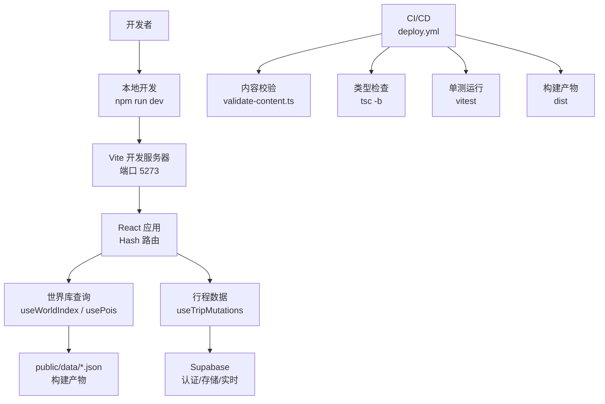
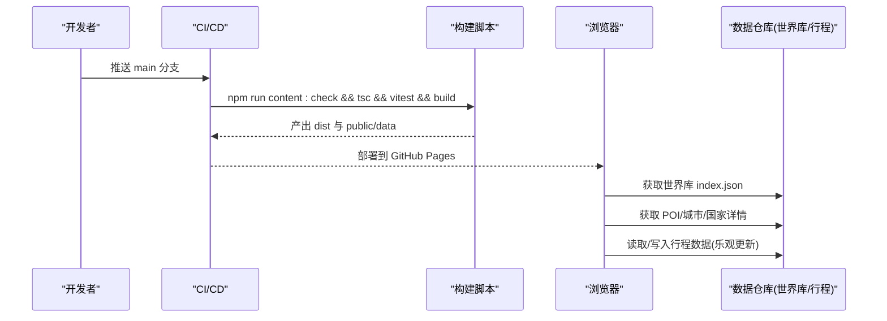
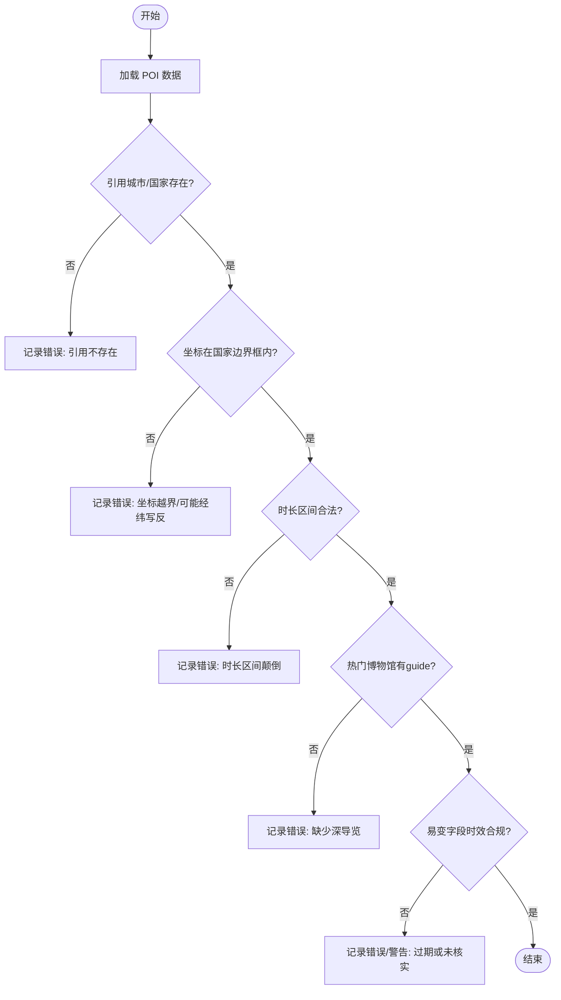
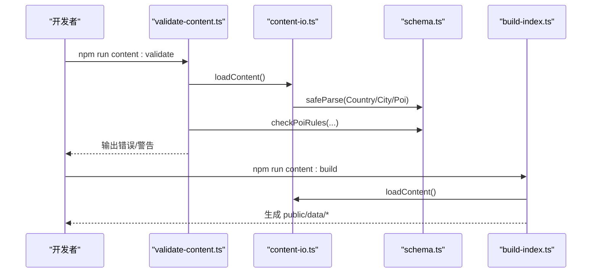
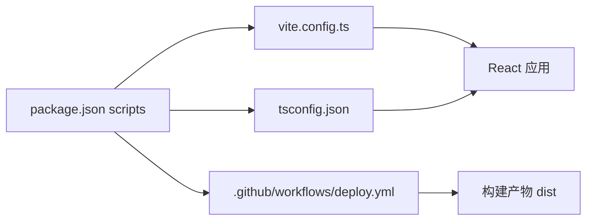

# 开发指南

<cite>
**本文引用的文件**
- [package.json](file://package.json)
- [vite.config.ts](file://vite.config.ts)
- [tsconfig.json](file://tsconfig.json)
- [.github/workflows/deploy.yml](file://.github/workflows/deploy.yml)
- [scripts/build-index.ts](file://scripts/build-index.ts)
- [scripts/validate-content.ts](file://scripts/validate-content.ts)
- [scripts/content-io.ts](file://scripts/content-io.ts)
- [content/README.md](file://content/README.md)
- [src/domain/world/schema.ts](file://src/domain/world/schema.ts)
- [src/data/types.ts](file://src/data/types.ts)
- [src/features/trip/queries.ts](file://src/features/trip/queries.ts)
- [src/features/world/queries.ts](file://src/features/world/queries.ts)
- [src/app/main.tsx](file://src/app/main.tsx)
- [src/app/router.tsx](file://src/app/router.tsx)
</cite>

## 目录
1. [简介](#简介)
2. [项目结构](#项目结构)
3. [核心组件](#核心组件)
4. [架构总览](#架构总览)
5. [详细组件分析](#详细组件分析)
6. [依赖关系分析](#依赖关系分析)
7. [性能考量](#性能考量)
8. [故障排查指南](#故障排查指南)
9. [结论](#结论)
10. [附录](#附录)

## 简介
本指南面向“玩无一失”项目的开发者，覆盖代码规范、提交与分支策略、代码审查流程、开发工具链使用、调试技巧、性能分析方法、内容构建脚本工作原理、数据验证流程、扩展开发方法以及新功能开发的完整流程与最佳实践。目标是让新成员快速上手，老成员高效协作，确保质量与交付一致性。

## 项目结构
- 前端工程：基于 Vite + React + TypeScript，路由采用 HashRouter 以兼容 GitHub Pages 子路径与离线访问。
- 世界库（静态内容）：位于 content/，由构建脚本生成 public/data/ 下的运行时数据与索引。
- 业务领域：domain/ 定义类型与规则校验；features/ 按功能组织页面与交互；data/ 提供数据仓库抽象与适配器。
- 后端集成：通过 Supabase JS SDK 与函数进行认证、行程协作与实时同步。
- CI/CD：GitHub Actions 在 main 分支推送时执行内容校验、类型检查、单测与构建并部署到 GitHub Pages。

图表来源
- [vite.config.ts:15-31](file://vite.config.ts#L15-L31)
- [src/app/router.tsx:15-30](file://src/app/router.tsx#L15-L30)
- [src/features/world/queries.ts:1-62](file://src/features/world/queries.ts#L1-L62)
- [src/features/trip/queries.ts:1-236](file://src/features/trip/queries.ts#L1-L236)
- [.github/workflows/deploy.yml:19-52](file://.github/workflows/deploy.yml#L19-L52)

章节来源
- [vite.config.ts:1-37](file://vite.config.ts#L1-L37)
- [src/app/router.tsx:1-31](file://src/app/router.tsx#L1-L31)
- [package.json:7-16](file://package.json#L7-L16)

## 核心组件
- 世界库 Schema 与规则：集中定义国家、城市、POI 的数据结构与业务规则，并提供 CI 可调用的校验函数。
- 内容 IO 与构建：读取 content/ 源文件，按 schema 解析，输出 index.json、search.json、aliases.json 及分桶 JSON。
- 数据层与适配：统一抽象 WorldRepository 与 TripRepository，屏蔽本地/云端实现差异。
- 查询与状态：基于 @tanstack/react-query 封装世界库与行程数据的查询与乐观更新。
- 应用入口与路由：初始化 QueryClient、Provider、Toast、Auth 同步与路由。

章节来源
- [src/domain/world/schema.ts:1-317](file://src/domain/world/schema.ts#L1-L317)
- [scripts/content-io.ts:1-92](file://scripts/content-io.ts#L1-L92)
- [scripts/build-index.ts:1-120](file://scripts/build-index.ts#L1-L120)
- [src/data/types.ts:1-300](file://src/data/types.ts#L1-L300)
- [src/features/world/queries.ts:1-62](file://src/features/world/queries.ts#L1-L62)
- [src/features/trip/queries.ts:1-236](file://src/features/trip/queries.ts#L1-L236)
- [src/app/main.tsx:1-38](file://src/app/main.tsx#L1-L38)

## 架构总览
- 构建期：content/ 源文件经 validate-content.ts 校验后，build-index.ts 生成 public/data/ 静态资源。
- 运行期：前端通过 world queries 拉取 index.json 等静态数据；行程数据通过 Repository 抽象读写 Supabase。
- 路由：HashRouter 保证 GitHub Pages 子路径与离线 file:// 零配置可用。
- 缓存：世界库数据 staleTime/gcTime 设为无限，避免重复请求；行程数据使用 react-query 的失效与重试策略。

图表来源
- [.github/workflows/deploy.yml:19-52](file://.github/workflows/deploy.yml#L19-L52)
- [scripts/validate-content.ts:1-76](file://scripts/validate-content.ts#L1-L76)
- [scripts/build-index.ts:1-120](file://scripts/build-index.ts#L1-L120)
- [src/features/world/queries.ts:1-62](file://src/features/world/queries.ts#L1-L62)
- [src/features/trip/queries.ts:1-236](file://src/features/trip/queries.ts#L1-L236)

## 详细组件分析

### 世界库 Schema 与规则
- 职责：定义 Country/City/Poi 的结构与约束；提供 checkPoiRules 进行引用完整性、坐标越界、时长区间、深导览要求、易变字段时效等业务规则校验。
- 关键点：
  - 所有“会变”的信息必须带 source 与 verifiedAt。
  - 闭馆日、游览时长、预约提前期必须结构化，供算法驱动提醒。
  - 高热度博物馆必须配备 guide 深导览且亮点需标注展厅位置。
  - 日期差计算使用纯字符串 UTC 计算，避免时区陷阱。

图表来源
- [src/domain/world/schema.ts:244-317](file://src/domain/world/schema.ts#L244-L317)

章节来源
- [src/domain/world/schema.ts:1-317](file://src/domain/world/schema.ts#L1-L317)

### 内容构建与校验流程
- 校验：validate-content.ts 调用 loadContent() 解析 content/ 下 JSON，结合 schema 与 checkPoiRules 输出 error/warn，error 导致非零退出。
- 构建：build-index.ts 清理并写入 public/data/，生成 index.json、search.json、aliases.json 及 country/city/poi 分桶文件，同时剥离 _todo/_sources 等编著期字段。
- 工作流：npm run content:validate → npm run content:build → 前端消费 public/data/*。

图表来源
- [scripts/validate-content.ts:1-76](file://scripts/validate-content.ts#L1-L76)
- [scripts/content-io.ts:1-92](file://scripts/content-io.ts#L1-L92)
- [scripts/build-index.ts:1-120](file://scripts/build-index.ts#L1-L120)
- [src/domain/world/schema.ts:1-317](file://src/domain/world/schema.ts#L1-L317)

章节来源
- [scripts/validate-content.ts:1-76](file://scripts/validate-content.ts#L1-L76)
- [scripts/content-io.ts:1-92](file://scripts/content-io.ts#L1-L92)
- [scripts/build-index.ts:1-120](file://scripts/build-index.ts#L1-L120)
- [content/README.md:1-47](file://content/README.md#L1-L47)

### 数据层与适配器
- 世界库接口：WorldRepository 定义 listCountries/listCities/getCity/listPois/getPoi/search 等方法，返回类型来自 data/types.ts。
- 行程接口：TripRepository 定义 trip/day/item/member/vote/ticket/expense 等 CRUD 与邀请能力，支持 local/supabase/snapshot/mock 多种实现。
- 优势：UI 与 features 不感知底层存储，便于切换与测试。

章节来源
- [src/data/types.ts:1-300](file://src/data/types.ts#L1-L300)

### 查询与状态管理
- 世界库查询：useWorldIndex/usePois/usePoi/useCity/useCountry 将静态数据缓存为永久（staleTime/gcTime 无穷），减少网络开销。
- 行程查询与变更：useTripMutations 对拖拽排程等高频操作采用乐观更新，提升交互流畅度；失败回滚并在完成后刷新缓存。
- 应用初始化：main.tsx 配置 QueryClient 关闭窗口聚焦重取，避免误闪；注入 RepositoryProvider、Toast、Auth 同步与 Router。

章节来源
- [src/features/world/queries.ts:1-62](file://src/features/world/queries.ts#L1-L62)
- [src/features/trip/queries.ts:1-236](file://src/features/trip/queries.ts#L1-L236)
- [src/app/main.tsx:1-38](file://src/app/main.tsx#L1-L38)

### 路由与页面
- 路由：HashRouter 用于兼容 GitHub Pages 子路径与离线 file://；根路径重定向到 /trips。
- 页面：TripsPage/TripPage/WorldPage 分别承载行程列表、行程详情与世界库浏览。

章节来源
- [src/app/router.tsx:1-31](file://src/app/router.tsx#L1-L31)

## 依赖关系分析
- 构建与运行：
  - package.json scripts 串联 content:validate、content:build、tsc、vite build。
  - vite.config.ts 配置 base、alias、server port、manualChunks 与 test 环境。
  - tsconfig.json 启用严格模式、模块解析、路径别名与包含范围。
- CI：
  - .github/workflows/deploy.yml 在 main 分支 push 时执行内容校验、类型检查、单测与构建，上传 dist 并部署到 GitHub Pages。

图表来源
- [package.json:7-16](file://package.json#L7-L16)
- [vite.config.ts:1-37](file://vite.config.ts#L1-L37)
- [tsconfig.json:1-31](file://tsconfig.json#L1-L31)
- [.github/workflows/deploy.yml:19-52](file://.github/workflows/deploy.yml#L19-L52)

章节来源
- [package.json:1-45](file://package.json#L1-L45)
- [vite.config.ts:1-37](file://vite.config.ts#L1-L37)
- [tsconfig.json:1-31](file://tsconfig.json#L1-L31)
- [.github/workflows/deploy.yml:1-52](file://.github/workflows/deploy.yml#L1-L52)

## 性能考量
- 构建优化：
  - manualChunks 将 react/react-dom/react-router-dom 与 @tanstack/react-query 单独分包，利于缓存与并行加载。
  - target es2020 平衡兼容性与体积。
- 运行期优化：
  - 世界库数据永久缓存，避免重复请求。
  - 行程高频操作使用乐观更新，降低网络往返带来的卡顿。
  - 关闭窗口聚焦重取，减少不必要的刷新。
- 建议：
  - 新增大依赖时评估是否放入 vendor/query 分包。
  - 对地图瓦片与图片资源考虑懒加载与按需加载。
  - 关注 public/data 体积增长，定期审计。

[本节为通用指导，无需特定文件来源]

## 故障排查指南
- 内容校验失败：
  - 现象：npm run content:validate 报错或 CI 失败。
  - 处理：根据错误定位具体文件与字段，修正 schema 违规或业务规则问题；必要时补充 source 与 verifiedAt。
- 构建失败：
  - 现象：npm run content:build 或 npm run build 失败。
  - 处理：先解决 validate 错误；检查 public/data 权限与磁盘空间；确认 Node 版本与依赖安装。
- 类型检查失败：
  - 现象：tsc -b 报错。
  - 处理：修复类型不匹配；注意 strict 与 noUnusedLocals/noUnusedParameters 规则。
- 单测失败：
  - 现象：vitest run 失败。
  - 处理：查看断言与 mock 数据；确保 domain 逻辑改动后测试用例同步更新。
- 路由与资源加载：
  - 现象：GitHub Pages 子路径或离线 file:// 无法加载。
  - 处理：确认 base 为相对路径、路由使用 HashRouter；检查构建产物路径。

章节来源
- [scripts/validate-content.ts:1-76](file://scripts/validate-content.ts#L1-L76)
- [scripts/build-index.ts:1-120](file://scripts/build-index.ts#L1-L120)
- [vite.config.ts:1-37](file://vite.config.ts#L1-L37)
- [src/app/router.tsx:1-31](file://src/app/router.tsx#L1-L31)

## 结论
“玩无一失”通过严格的 Schema 与 CI 门禁保障世界库质量，借助构建脚本将内容转化为高性能静态资源；前端以 react-query 与 Repository 抽象实现解耦与可维护性；CI/CD 自动化保障发布质量。遵循本指南的规范与流程，可显著提升团队协作效率与交付稳定性。

[本节为总结，无需特定文件来源]

## 附录

### 代码规范
- 语言与工具：TypeScript 严格模式；ESLint/Prettier 可按团队约定引入；Vitest 单测命名与断言清晰。
- 模块组织：feature-based 分层，domain 保持无副作用；utils 仅放纯函数。
- 命名：常量/枚举大写；变量小驼峰；组件首字母大写；文件与目录语义化。
- 注释：公共 API 与复杂逻辑添加说明；避免冗余注释。

[本节为通用指导，无需特定文件来源]

### 提交规范
- 格式：type(scope): subject
  - type: feat/fix/docs/style/refactor/perf/test/chore
  - scope: 模块名，如 world/trip/auth
  - subject: 简洁描述变更目的
- 示例：feat(world): 增加 POI 闭馆日校验规则
- 提交信息应关联需求或问题编号。

[本节为通用指导，无需特定文件来源]

### 分支策略
- main：稳定分支，仅接受合并后的发布内容。
- develop：日常开发集成分支（可选）。
- feature/*：新功能分支，从 main 检出，PR 合并回 main。
- hotfix/*：紧急修复分支，合并后打 tag 发布。

[本节为通用指导，无需特定文件来源]

### 代码审查流程
- 创建 PR：描述变更背景、影响范围与测试情况。
- 审查要点：
  - 是否符合 Schema 与业务规则。
  - 是否引入新的外部依赖或增大包体积。
  - 是否有相应单测与文档更新。
  - 是否存在潜在性能与可访问性问题。
- 合并条件：CI 全绿、至少一名 reviewer 批准、无遗留评论。

[本节为通用指导，无需特定文件来源]

### 开发工具链使用
- 本地开发：npm run dev 启动 Vite 服务（端口 5273），自动执行 content:build。
- 类型检查：npm run typecheck 或 npx tsc -b。
- 单测：npm run test 或 npm run test:watch。
- 构建预览：npm run build 与 npm run preview。
- 内容脚本：npm run content:validate 与 npm run content:build。

章节来源
- [package.json:7-16](file://package.json#L7-L16)
- [vite.config.ts:15-31](file://vite.config.ts#L15-L31)

### 调试技巧
- 世界库数据：打开浏览器 Network 面板查看 public/data/*.json 加载；在控制台打印 useWorldIndex/usePois 结果。
- 行程数据：使用 React DevTools 查看 react-query 缓存与状态；观察 optimistic 更新与回滚行为。
- 路由：确认 URL hash 变化与页面渲染一致；检查 NotFound 兜底。
- 日志：在关键函数入口添加 console.log 或使用浏览器断点。

[本节为通用指导，无需特定文件来源]

### 性能分析方法
- 构建分析：使用 Vite 插件或打包分析工具查看 chunk 大小与依赖关系。
- 运行分析：Performance 面板录制交互，识别长任务；Network 面板分析请求与缓存命中。
- 世界库：监控 public/data 体积增长；对热点 POI 列表分页或懒加载。
- 内存：长时间运行后检查内存泄漏，尤其是地图与大量 DOM 节点。

[本节为通用指导，无需特定文件来源]

### 内容构建脚本工作原理
- 读取与解析：content-io.ts 遍历 content/ 下 JSON，使用 zod schema 安全解析，收集 failures。
- 校验：validate-content.ts 调用 checkPoiRules 进行业务规则校验，error 级问题阻断构建。
- 构建：build-index.ts 生成 index.json、search.json、aliases.json 与 country/city/poi 分桶文件，剥离编著期字段。

章节来源
- [scripts/content-io.ts:1-92](file://scripts/content-io.ts#L1-L92)
- [scripts/validate-content.ts:1-76](file://scripts/validate-content.ts#L1-L76)
- [scripts/build-index.ts:1-120](file://scripts/build-index.ts#L1-L120)

### 数据验证流程
- 结构校验：zod schema 强制字段类型、必填与格式。
- 业务规则：引用完整性、坐标越界、时长区间、深导览要求、易变字段时效。
- 输出：error 级问题使进程非零退出；warn 级提示未达标项。

章节来源
- [src/domain/world/schema.ts:244-317](file://src/domain/world/schema.ts#L244-L317)
- [scripts/validate-content.ts:1-76](file://scripts/validate-content.ts#L1-L76)

### 扩展开发方法
- 新增世界库实体：
  - 在 schema.ts 中扩展类型与规则。
  - 在 content/ 下新增对应 JSON 文件，遵循 content/README.md 规范。
  - 运行 content:validate 与 content:build 验证。
- 新增行程功能：
  - 在 types.ts 中定义数据结构。
  - 在 features/ 下实现 UI 与查询/变更 hooks。
  - 编写单测覆盖核心逻辑。
- 新增适配器：
  - 实现 WorldRepository/TripRepository 接口。
  - 在 RepositoryProvider 中注册新实现。

[本节为通用指导，无需特定文件来源]

### 新功能开发完整流程
- 需求分析与设计：明确输入输出、边界与异常。
- 分支与实现：从 main 创建 feature/* 分支，增量提交。
- 本地验证：content:validate、tsc、vitest、build、preview。
- 提 PR：附变更说明、截图与测试报告。
- 审查与合并：根据反馈修改，直至 CI 全绿与评审通过。
- 发布：main 分支触发 CI 部署到 GitHub Pages。

[本节为通用指导，无需特定文件来源]