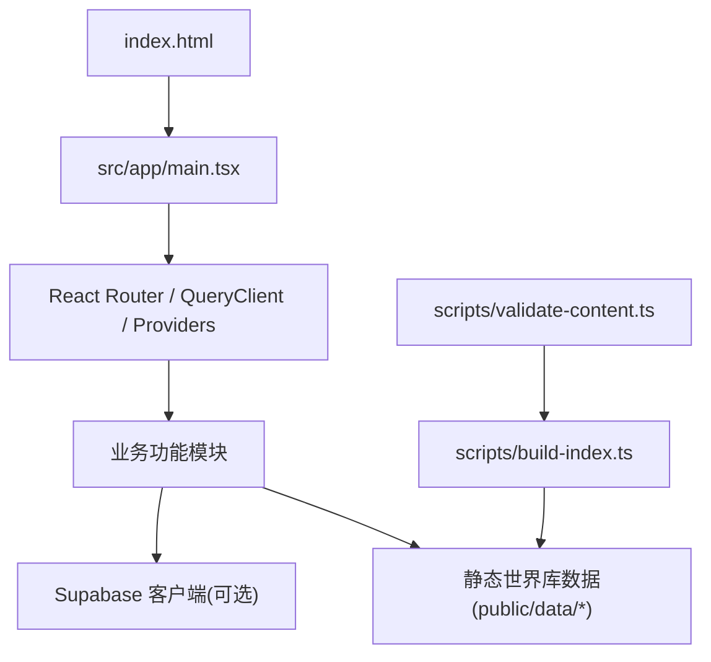
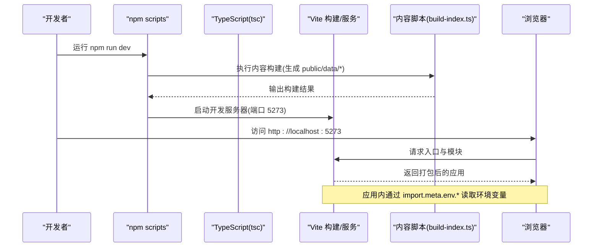
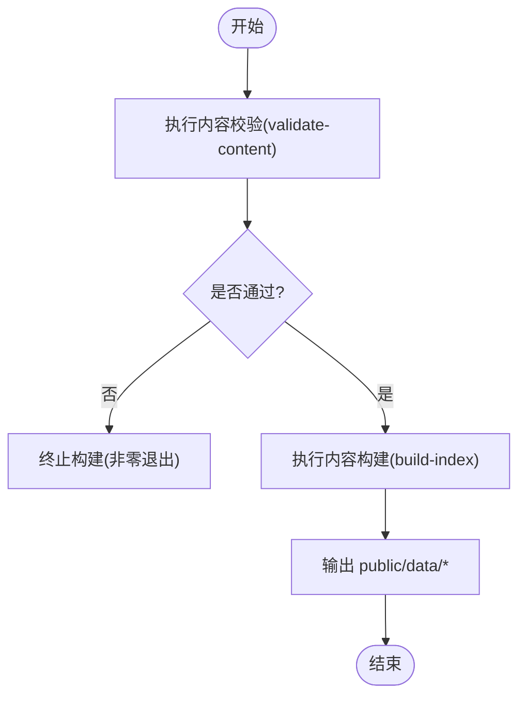
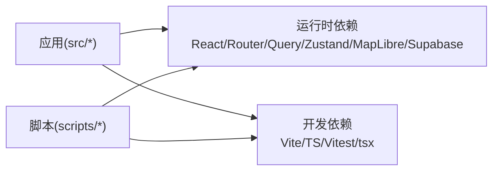

# 开发环境配置

<cite>
**本文引用的文件**
- [package.json](file://package.json)
- [vite.config.ts](file://vite.config.ts)
- [tsconfig.json](file://tsconfig.json)
- [index.html](file://index.html)
- [src/data/supabase-client.ts](file://src/data/supabase-client.ts)
- [scripts/build-index.ts](file://scripts/build-index.ts)
- [scripts/validate-content.ts](file://scripts/validate-content.ts)
- [scripts/verify-password-login.cjs](file://scripts/verify-password-login.cjs)
- [src/app/main.tsx](file://src/app/main.tsx)
</cite>

## 目录
1. [简介](#简介)
2. [项目结构](#项目结构)
3. [核心组件](#核心组件)
4. [架构总览](#架构总览)
5. [详细组件分析](#详细组件分析)
6. [依赖分析](#依赖分析)
7. [性能考虑](#性能考虑)
8. [故障排查指南](#故障排查指南)
9. [结论](#结论)
10. [附录](#附录)

## 简介
本指南面向“玩无一失”项目的开发者，提供从零搭建本地开发环境的完整步骤与最佳实践。内容覆盖 Node.js 版本要求、依赖安装流程、环境变量配置、Vite 构建选项、TypeScript 编译设置、开发服务器启动方式、IDE 推荐配置、代码格式化规则、调试环境搭建以及常见问题排查方案。

## 项目结构
本项目采用 Vite + React + TypeScript 的前端工程化方案，配合脚本工具完成内容数据预处理与校验；通过 Supabase 客户端集成实现云端能力（可选）。关键入口与配置文件如下：
- 应用入口：index.html 加载 src/app/main.tsx
- 构建与脚本：package.json 中定义 dev/build/test 等命令
- 构建配置：vite.config.ts 配置别名、端口、分包策略与测试
- 类型与模块：tsconfig.json 配置 ES 目标、模块解析、路径别名与严格模式
- 运行时环境：Supabase 客户端读取 VITE_SUPABASE_URL 与 VITE_SUPABASE_ANON_KEY
- 内容构建：scripts/build-index.ts 将 content/ 下的 JSON 编著源编译为 public/data/ 下的静态资源
- 内容校验：scripts/validate-content.ts 在 CI 或构建前校验世界库数据

图表来源
- [index.html:1-20](file://index.html#L1-L20)
- [src/app/main.tsx:1-38](file://src/app/main.tsx#L1-L38)
- [scripts/build-index.ts:1-120](file://scripts/build-index.ts#L1-L120)
- [scripts/validate-content.ts:1-76](file://scripts/validate-content.ts#L1-L76)

章节来源
- [package.json:1-45](file://package.json#L1-L45)
- [vite.config.ts:1-37](file://vite.config.ts#L1-L37)
- [tsconfig.json:1-31](file://tsconfig.json#L1-L31)
- [index.html:1-20](file://index.html#L1-L20)

## 核心组件
- 开发与构建脚本
  - 开发：先构建世界库索引，再启动 Vite 开发服务器
  - 构建：先校验并构建世界库，再进行 TypeScript 类型检查与 Vite 构建
  - 预览：使用 Vite 预览生产产物
  - 类型检查：执行 TypeScript 类型检查
  - 测试：运行 Vitest 单元测试
- 世界库内容处理
  - 校验：基于 schema 与业务规则校验 content/ 下数据
  - 构建：将 content/ 编译为 public/data/ 下的 index.json、city/*.json、poi/*.json、search.json、aliases.json
- 前端运行时
  - 应用初始化：创建 QueryClient、挂载路由与全局 Provider
  - 认证与数据：根据环境变量决定是否启用 Supabase 客户端与登录态同步

章节来源
- [package.json:7-16](file://package.json#L7-L16)
- [scripts/validate-content.ts:1-76](file://scripts/validate-content.ts#L1-L76)
- [scripts/build-index.ts:1-120](file://scripts/build-index.ts#L1-L120)
- [src/app/main.tsx:1-38](file://src/app/main.tsx#L1-L38)

## 架构总览
下图展示了开发到构建的关键流程与环境变量注入点。

图表来源
- [package.json:7-16](file://package.json#L7-L16)
- [vite.config.ts:15-18](file://vite.config.ts#L15-L18)
- [scripts/build-index.ts:1-120](file://scripts/build-index.ts#L1-L120)

## 详细组件分析

### Node.js 版本与包管理器
- 版本建议
  - 推荐使用 Node.js 18+，以匹配现代包生态与 Vite 5.x 的兼容性
  - 若遇到兼容问题，可回退至 16.x LTS
- 包管理器
  - 建议使用 npm 或 pnpm/yarn 均可，但需锁定版本以避免依赖漂移
  - 首次克隆后执行依赖安装命令，确保 package-lock.json 生效

章节来源
- [package.json:1-45](file://package.json#L1-L45)

### 依赖安装流程
- 安装依赖
  - 在项目根目录执行依赖安装命令，等待完成
- 验证安装
  - 执行类型检查与测试，确认环境正常
  - 执行内容校验与构建，确保 world 数据可用

章节来源
- [package.json:7-16](file://package.json#L7-L16)

### 环境变量配置
- 必需的环境变量（用于 Supabase 集成）
  - VITE_SUPABASE_URL：Supabase 项目 URL
  - VITE_SUPABASE_ANON_KEY：匿名访问密钥
- 作用范围
  - 仅在前端运行时通过 import.meta.env.* 注入
  - 未配置时，应用自动降级为本地模式（不连接云端）
- 安全提示
  - 不要将 .env 提交到仓库
  - 生产部署请通过平台环境变量注入

章节来源
- [src/data/supabase-client.ts:17-34](file://src/data/supabase-client.ts#L17-L34)
- [scripts/verify-password-login.cjs:4-18](file://scripts/verify-password-login.cjs#L4-L18)

### Vite 构建工具配置
- 基础路径
  - 使用相对路径 base: './'，适配 GitHub Pages 子路径与离线 file:// 场景
- 插件与别名
  - 启用 React 插件
  - 配置 @ 指向 src 目录，便于统一导入
- 开发服务器
  - 默认端口 5273，非严格占用（strictPort: false）
- 构建优化
  - target: es2020
  - manualChunks 拆分 vendor 与 query，减少首屏体积
- 测试
  - Vitest 环境为 node，扫描 src/**/*.test.ts

章节来源
- [vite.config.ts:1-37](file://vite.config.ts#L1-L37)

### TypeScript 编译设置
- 目标与库
  - target: ES2022，lib: ES2022, DOM, DOM.Iterable
- 模块与解析
  - module: ESNext，moduleResolution: bundler
  - allowImportingTsExtensions: true，resolveJsonModule: true
- 严格模式
  - strict: true，noUnusedLocals/Parameters，noFallthroughCasesInSwitch，noUncheckedIndexedAccess
- 路径别名与类型
  - baseUrl: ".", paths: {"@/*": ["src/*"]}
  - types: vite/client, node
- 输出控制
  - noEmit: true（由 Vite 负责产出）

章节来源
- [tsconfig.json:1-31](file://tsconfig.json#L1-L31)

### 开发服务器启动方式
- 启动开发模式
  - 执行开发脚本，会先构建世界库索引，再启动 Vite 开发服务器
  - 默认访问地址：http://localhost:5273
- 预览生产构建
  - 构建完成后，使用预览命令查看产物效果

章节来源
- [package.json:7-16](file://package.json#L7-L16)
- [vite.config.ts:15-18](file://vite.config.ts#L15-L18)

### 世界库内容构建与校验
- 内容校验
  - 校验字段类型、必填项与业务规则（如引用完整性、坐标越界、时长区间等）
  - 错误级别会导致进程非零退出，警告仅提示
- 内容构建
  - 将 content/ 下的国家、城市、POI 数据编译为 public/data/ 下的静态 JSON
  - 生成 index.json、country/*.json、city/*.json、poi/*.json、search.json、aliases.json
  - 剥离编著期字段，仅保留运行时所需数据

图表来源
- [scripts/validate-content.ts:1-76](file://scripts/validate-content.ts#L1-L76)
- [scripts/build-index.ts:1-120](file://scripts/build-index.ts#L1-L120)

章节来源
- [scripts/validate-content.ts:1-76](file://scripts/validate-content.ts#L1-L76)
- [scripts/build-index.ts:1-120](file://scripts/build-index.ts#L1-L120)

### IDE 推荐配置
- VS Code 扩展建议
  - ESLint（如需）、Prettier（如需）、Tailwind CSS IntelliSense（按需）
  - 启用 TypeScript 语言服务与 React 语法支持
- 编辑器设置
  - 开启保存时格式化（可选）
  - 使用项目 tsconfig.json 作为类型检查依据
  - 路径别名 @ 需在编辑器中识别（通常由 Vite 与 TS 配置共同保证）

[本节为通用建议，不直接分析具体文件]

### 代码格式化规则
- 本项目未内置 Prettier/ESLint 配置，建议在团队内统一制定规则
- 建议：
  - 使用 Prettier 进行统一格式化
  - 使用 ESLint 进行代码质量检查
  - 在编辑器中启用保存时自动修复

[本节为通用建议，不直接分析具体文件]

### 调试环境搭建
- 浏览器调试
  - 打开开发者工具，利用 Source Map 定位源码位置
  - 结合 React DevTools 调试组件状态与 props
- 网络请求调试
  - 若启用 Supabase，可在 Network 面板观察鉴权与数据请求
- 日志与提示
  - 使用全局 Toast 组件反馈操作结果
  - 开发模式下可使用 agentation 工具快速定位 UI 元素

章节来源
- [src/app/main.tsx:25-37](file://src/app/main.tsx#L25-L37)

## 依赖分析
- 运行时依赖
  - React、React DOM、React Router DOM、TanStack Query、Zustand、MapLibre GL、Supabase JS、DnD Kit、pmtiles
- 开发依赖
  - Vite、@vitejs/plugin-react、TypeScript、Vitest、tsx、agentation、Node 类型声明、React 类型声明
- 构建与脚本
  - 使用 tsx 执行 TypeScript 脚本（内容构建与校验）
  - 使用 Vite 进行开发与构建，Vitest 进行单元测试

图表来源
- [package.json:18-43](file://package.json#L18-L43)

章节来源
- [package.json:18-43](file://package.json#L18-L43)

## 性能考虑
- 首屏优化
  - 通过 manualChunks 将 React、Router、Query 等大包单独拆分，利于缓存与并行加载
- 目标版本
  - 构建目标设为 es2020，兼顾兼容性与性能
- 资源路径
  - 使用相对 base 路径，适配子路径与离线场景
- 数据加载
  - 世界库数据预构建为静态 JSON，减少运行时计算与请求次数

章节来源
- [vite.config.ts:19-31](file://vite.config.ts#L19-L31)
- [scripts/build-index.ts:1-120](file://scripts/build-index.ts#L1-L120)

## 故障排查指南
- 无法启动开发服务器
  - 检查端口 5273 是否被占用；Vite 已配置非严格占用，可尝试切换端口
  - 确认依赖安装成功且无版本冲突
- 世界库构建失败
  - 执行内容校验脚本，修复报错的数据结构或业务规则问题
  - 关注控制台输出的错误文件与消息
- Supabase 相关错误
  - 确认已配置 VITE_SUPABASE_URL 与 VITE_SUPABASE_ANON_KEY
  - 使用密码登录验证脚本检测邮箱/密码登录闭环是否正常
- 类型检查失败
  - 执行类型检查命令，按错误提示修复类型问题
- 构建产物异常
  - 检查 Vite 配置中的 base、target、manualChunks 等选项是否符合预期
  - 清理缓存后重新构建

章节来源
- [vite.config.ts:15-31](file://vite.config.ts#L15-L31)
- [scripts/validate-content.ts:20-73](file://scripts/validate-content.ts#L20-L73)
- [scripts/verify-password-login.cjs:4-33](file://scripts/verify-password-login.cjs#L4-L33)
- [package.json:7-16](file://package.json#L7-L16)

## 结论
通过遵循本指南，你可以在本地快速搭建“玩无一失”的开发环境，理解 Vite 与 TypeScript 的配置要点，掌握世界库内容的构建与校验流程，并在需要时接入 Supabase 实现云端能力。遇到问题时，可参考故障排查指南逐步定位与解决。

## 附录
- 常用命令速查
  - 开发：npm run dev
  - 构建：npm run build
  - 预览：npm run preview
  - 类型检查：npm run typecheck
  - 测试：npm run test / npm run test:watch
  - 内容校验：npm run content:validate
  - 内容构建：npm run content:build
  - 内容检查（校验+构建）：npm run content:check

章节来源
- [package.json:7-16](file://package.json#L7-L16)