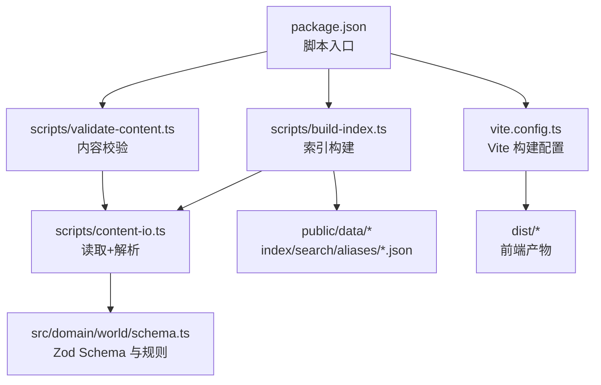
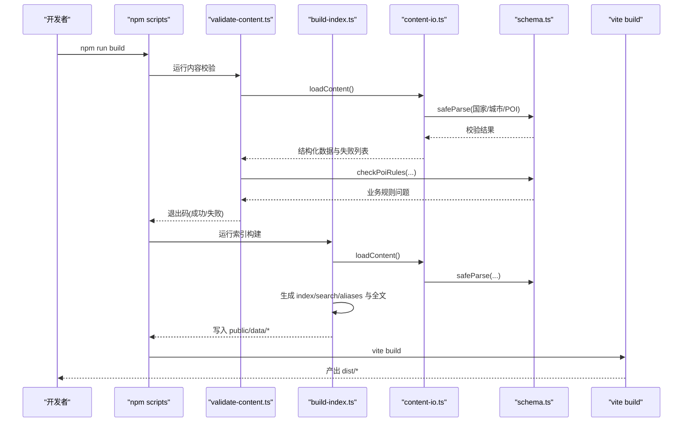
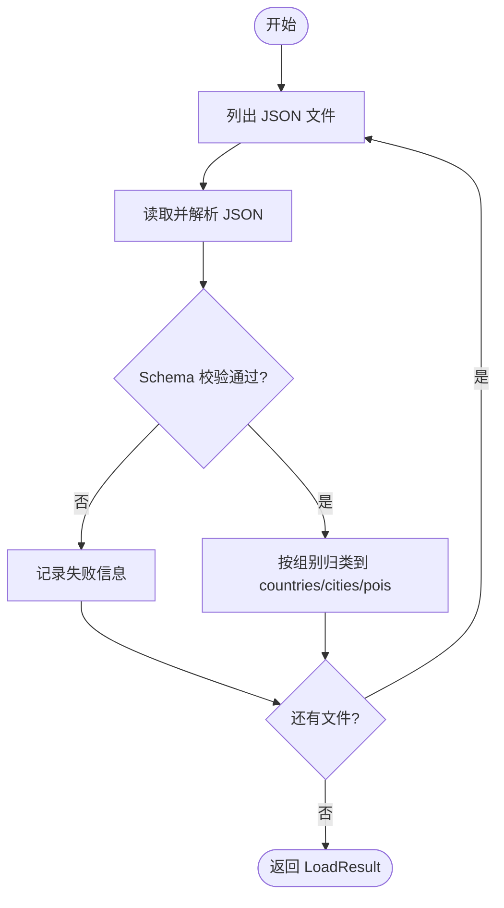
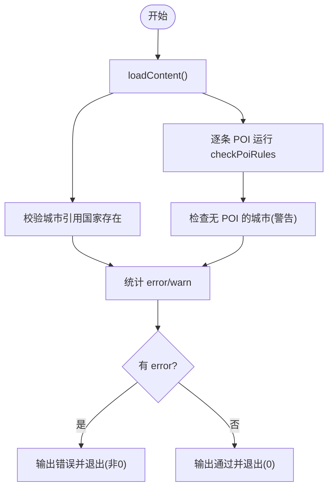
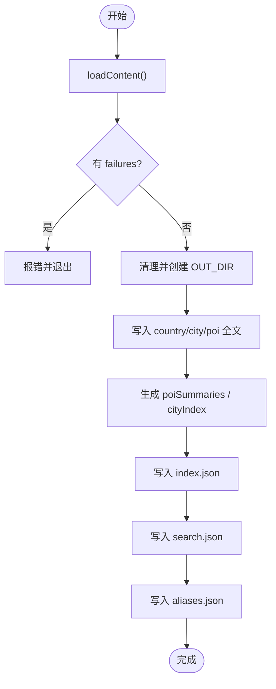
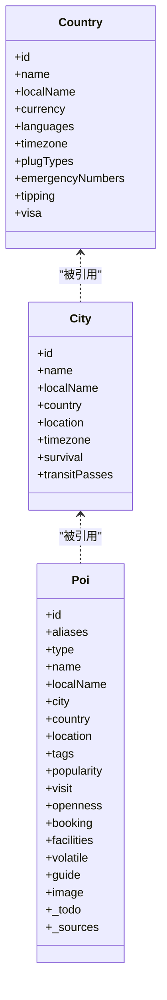
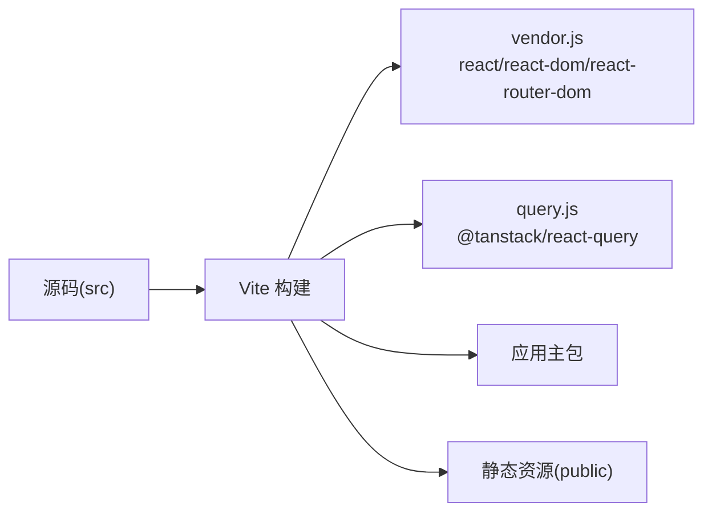
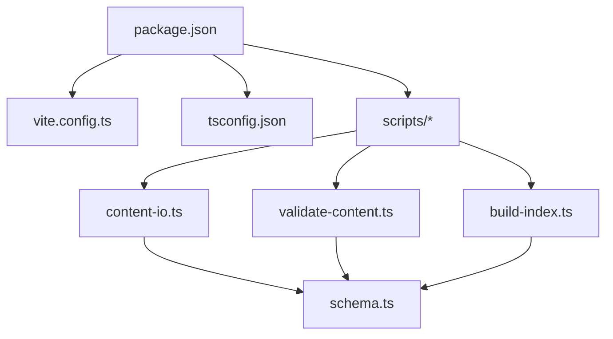

# 构建系统

<cite>
**本文引用的文件**
- [package.json](file://package.json)
- [vite.config.ts](file://vite.config.ts)
- [tsconfig.json](file://tsconfig.json)
- [scripts/build-index.ts](file://scripts/build-index.ts)
- [scripts/validate-content.ts](file://scripts/validate-content.ts)
- [scripts/content-io.ts](file://scripts/content-io.ts)
- [src/domain/world/schema.ts](file://src/domain/world/schema.ts)
- [content/countries/ch.json](file://content/countries/ch.json)
- [content/cities/paris.json](file://content/cities/paris.json)
- [content/pois/eiffel-tower.json](file://content/pois/eiffel-tower.json)
</cite>

## 目录
1. [简介](#简介)
2. [项目结构](#项目结构)
3. [核心组件](#核心组件)
4. [架构总览](#架构总览)
5. [详细组件分析](#详细组件分析)
6. [依赖分析](#依赖分析)
7. [性能考虑](#性能考虑)
8. [故障排查指南](#故障排查指南)
9. [结论](#结论)
10. [附录](#附录)

## 简介
本文件面向“玩无一失”项目的构建系统，系统性说明以下内容：
- 内容构建脚本的工作原理：世界库索引生成、数据验证流程与内容处理管道。
- Vite 构建配置、资源优化策略与性能调优方法。
- TypeScript 编译流程、模块打包与代码分割策略。
- 构建脚本扩展方法与自定义构建任务开发指南。

目标是让读者既能理解现有构建链路，也能安全地扩展和定制构建任务。

## 项目结构
- 内容源位于 content/，按国家、城市、POI 三类 JSON 组织。
- 构建产物由 scripts/ 下的 Node 脚本生成到 public/data/，供运行时加载。
- 前端应用基于 Vite + React，TypeScript 类型与校验集中在 src/domain/world/schema.ts。
- 构建命令在 package.json 中编排，串联内容校验、索引构建与前端打包。

图表来源
- [package.json:7-16](file://package.json#L7-L16)
- [scripts/validate-content.ts:1-76](file://scripts/validate-content.ts#L1-L76)
- [scripts/build-index.ts:1-120](file://scripts/build-index.ts#L1-L120)
- [scripts/content-io.ts:1-92](file://scripts/content-io.ts#L1-L92)
- [src/domain/world/schema.ts:1-317](file://src/domain/world/schema.ts#L1-L317)
- [vite.config.ts:1-37](file://vite.config.ts#L1-L37)

章节来源
- [package.json:7-16](file://package.json#L7-L16)
- [vite.config.ts:1-37](file://vite.config.ts#L1-L37)
- [tsconfig.json:1-31](file://tsconfig.json#L1-L31)

## 核心组件
- 内容读取与解析：scripts/content-io.ts 负责扫描 content/ 下三类 JSON，使用 schema 进行结构化校验并聚合结果。
- 内容校验：scripts/validate-content.ts 调用 schema 的业务规则检查（如引用完整性、坐标越界、时长区间、深导览缺失、时效性），输出错误/警告并在 CI 中作为门禁。
- 索引构建：scripts/build-index.ts 将校验通过的内容生成 index.json、search.json、aliases.json 以及国家/城市/POI 全文 JSON，剥离编著期字段，输出到 public/data/。
- 类型与规则：src/domain/world/schema.ts 定义 Country/City/Poi 等 Zod Schema 与业务规则函数 checkPoiRules，是校验与构建的共同事实来源。
- 前端构建：vite.config.ts 配置 base、别名、开发服务器端口、构建目标与手动分包策略；tsconfig.json 配置 TS 编译选项与路径映射。

章节来源
- [scripts/content-io.ts:1-92](file://scripts/content-io.ts#L1-L92)
- [scripts/validate-content.ts:1-76](file://scripts/validate-content.ts#L1-L76)
- [scripts/build-index.ts:1-120](file://scripts/build-index.ts#L1-L120)
- [src/domain/world/schema.ts:1-317](file://src/domain/world/schema.ts#L1-L317)
- [vite.config.ts:1-37](file://vite.config.ts#L1-L37)
- [tsconfig.json:1-31](file://tsconfig.json#L1-L31)

## 架构总览
整体构建流水线如下：
- 开发模式：先执行内容构建，再启动 Vite 开发服务器。
- 生产构建：先执行内容校验与构建，再进行 TypeScript 类型检查与 Vite 打包。
- 内容管线：读取 -> 解析 -> 校验 -> 生成索引与全文 -> 写入 public/data/。
- 前端管线：TS 编译 -> Vite 打包 -> 输出 dist/。

图表来源
- [package.json:7-16](file://package.json#L7-L16)
- [scripts/validate-content.ts:1-76](file://scripts/validate-content.ts#L1-L76)
- [scripts/build-index.ts:1-120](file://scripts/build-index.ts#L1-L120)
- [scripts/content-io.ts:1-92](file://scripts/content-io.ts#L1-L92)
- [src/domain/world/schema.ts:1-317](file://src/domain/world/schema.ts#L1-L317)
- [vite.config.ts:1-37](file://vite.config.ts#L1-L37)

## 详细组件分析

### 内容读取与解析（content-io.ts）
- 职责：遍历 content/countries、cities、pois 三个目录，读取 JSON 并使用对应 Schema 进行 safeParse，收集成功条目与失败信息。
- 关键点：
  - 统一输出结构 LoadResult，包含 countries、cities、pois、failures。
  - 提供 today() 用于业务规则中的日期比较。
  - 路径计算基于 ROOT/CONTENT_DIR/OUT_DIR，确保脚本可移植。

图表来源
- [scripts/content-io.ts:32-85](file://scripts/content-io.ts#L32-L85)

章节来源
- [scripts/content-io.ts:1-92](file://scripts/content-io.ts#L1-L92)

### 内容校验（validate-content.ts）
- 职责：CI 门禁，两层校验：
  - 结构校验：由 content-io.ts 的 safeParse 完成。
  - 业务规则：checkPoiRules 检查引用完整性、坐标范围、时长区间、高热度博物馆是否具备深导览、易变字段时效性等。
- 输出：error 级导致进程非零退出；warn 仅提示。

图表来源
- [scripts/validate-content.ts:20-73](file://scripts/validate-content.ts#L20-L73)
- [src/domain/world/schema.ts:263-316](file://src/domain/world/schema.ts#L263-L316)

章节来源
- [scripts/validate-content.ts:1-76](file://scripts/validate-content.ts#L1-L76)
- [src/domain/world/schema.ts:244-317](file://src/domain/world/schema.ts#L244-L317)

### 索引构建（build-index.ts）
- 职责：将 world 内容编译为运行时数据，输出到 public/data/：
  - 国家/城市/POI 全文 JSON。
  - index.json：国家摘要、城市摘要、POI 摘要（排序依据 popularity）。
  - search.json：轻量搜索索引（城市名、本地名、标签拼接）。
  - aliases.json：旧 id → 新 id 映射，保证老行程不断链。
- 关键处理：
  - 剥离 _todo/_sources 等编著期字段，不进入运行时数据。
  - 生成 poi 摘要时提取 closedWeekdays、hasGuide、durationMinutes、bookingLeadDays 等关键字段。

图表来源
- [scripts/build-index.ts:19-116](file://scripts/build-index.ts#L19-L116)

章节来源
- [scripts/build-index.ts:1-120](file://scripts/build-index.ts#L1-L120)

### 类型与规则（schema.ts）
- 职责：定义所有内容的 Zod Schema 与派生类型，并提供业务规则函数 checkPoiRules。
- 要点：
  - 易变字段采用 Verifiable(value, source, verifiedAt) 模式，强制来源与核实时间。
  - Openness 结构化闭馆日/季节性开放，支撑算法能力。
  - checkPoiRules 实现引用完整性、坐标边界框检查、时长区间合法性、高热度博物馆必须配备 guide、易变字段时效性检查等。

图表来源
- [src/domain/world/schema.ts:58-103](file://src/domain/world/schema.ts#L58-L103)
- [src/domain/world/schema.ts:157-218](file://src/domain/world/schema.ts#L157-L218)

章节来源
- [src/domain/world/schema.ts:1-317](file://src/domain/world/schema.ts#L1-L317)

### 示例数据
- 国家示例：ch.json 展示签证信息、货币、语言、紧急电话等。
- 城市示例：paris.json 展示生存主题、交通通票等。
- POI 示例：eiffel-tower.json 展示游览时长、预约提前期、设施、易变字段与深导览。

章节来源
- [content/countries/ch.json:1-45](file://content/countries/ch.json#L1-L45)
- [content/cities/paris.json:1-47](file://content/cities/paris.json#L1-L47)
- [content/pois/eiffel-tower.json:1-72](file://content/pois/eiffel-tower.json#L1-L72)

### Vite 构建配置与优化
- base: './' 支持 GitHub Pages 子路径与离线 file:// 场景。
- alias: '@' 指向 src，简化导入。
- server: 默认端口 5273，允许端口冲突时自动切换。
- build.target: es2020，平衡兼容性与现代特性。
- manualChunks: 将 react/react-dom/react-router-dom 与 @tanstack/react-query 单独分包，利于缓存与并行加载。
- 双端分流：注释指出动态 import 在 AppShell 中完成，此处只切分体积大且首屏不需要的库。

图表来源
- [vite.config.ts:5-31](file://vite.config.ts#L5-L31)

章节来源
- [vite.config.ts:1-37](file://vite.config.ts#L1-L37)

### TypeScript 编译流程
- target: ES2022，lib 包含 ES2022/DOM/DOM.Iterable。
- module: ESNext，moduleResolution: bundler，适配 Vite/Rollup。
- jsx: react-jsx，启用现代 JSX 转换。
- strict: true，开启严格检查；noUnusedLocals/Parameters、noFallthroughCasesInSwitch、noUncheckedIndexedAccess 提升健壮性。
- paths: '@/*' -> 'src/*'，配合 Vite alias。
- include: 包含 src、scripts、vite.config.ts，便于统一类型检查。

章节来源
- [tsconfig.json:1-31](file://tsconfig.json#L1-L31)

## 依赖分析
- 脚本依赖：
  - validate-content.ts 依赖 content-io.ts 与 schema.ts。
  - build-index.ts 依赖 content-io.ts 与 schema.ts。
- 构建依赖：
  - package.json 脚本串联 validate、build-index、tsc、vite build。
  - vite.config.ts 依赖 @vitejs/plugin-react 与 node:url。
- 外部依赖：
  - zod 用于运行时与构建期类型校验。
  - tsx 用于直接运行 TypeScript 脚本。

图表来源
- [package.json:7-16](file://package.json#L7-L16)
- [scripts/content-io.ts:1-92](file://scripts/content-io.ts#L1-L92)
- [scripts/validate-content.ts:1-76](file://scripts/validate-content.ts#L1-L76)
- [scripts/build-index.ts:1-120](file://scripts/build-index.ts#L1-L120)
- [src/domain/world/schema.ts:1-317](file://src/domain/world/schema.ts#L1-L317)
- [vite.config.ts:1-37](file://vite.config.ts#L1-L37)

章节来源
- [package.json:7-16](file://package.json#L7-L16)
- [vite.config.ts:1-37](file://vite.config.ts#L1-L37)

## 性能考虑
- 内容构建阶段：
  - 批量读取与解析，避免重复 I/O。
  - 生成精简摘要与搜索索引，减少前端请求与内存占用。
  - 剥离编著期字段，降低运行时数据体积。
- 前端构建阶段：
  - 设置 target 为 es2020，利用现代语法与 API。
  - 使用 manualChunks 拆分大型第三方库，提高缓存命中与并行加载。
  - 使用相对 base 路径，适配多种部署环境，减少重定向开销。
- 建议优化方向：
  - 按需引入与懒加载：在路由或功能模块中使用动态 import，进一步减小首屏体积。
  - 图片与媒体资源：结合 CDN 与压缩策略，按需生成多尺寸图片。
  - 缓存策略：对 vendor/query 等大体积包设置长期缓存，配合版本化文件名。

[本节为通用指导，无需特定文件来源]

## 故障排查指南
- 内容校验失败：
  - 现象：npm run content:check 或 CI 失败，输出 error 级别问题。
  - 排查步骤：
    - 查看具体文件与字段路径，定位 schema 校验失败原因。
    - 检查业务规则：引用是否存在、坐标是否在边界框内、时长区间是否合法、高热度博物馆是否缺少 guide、易变字段是否过期。
  - 参考：
    - 校验脚本与规则定义位置。
- 索引构建失败：
  - 现象：build-index.ts 报错并退出。
  - 排查步骤：
    - 确认已通过内容校验。
    - 检查 public/data 目录权限与磁盘空间。
    - 核对 POI 摘要字段生成逻辑是否符合预期。
- 前端构建异常：
  - 现象：vite build 报错。
  - 排查步骤：
    - 检查 TypeScript 类型错误（tsc -b）。
    - 检查别名与路径映射是否正确。
    - 检查依赖版本与插件兼容性。

章节来源
- [scripts/validate-content.ts:20-73](file://scripts/validate-content.ts#L20-L73)
- [scripts/build-index.ts:45-51](file://scripts/build-index.ts#L45-L51)
- [src/domain/world/schema.ts:263-316](file://src/domain/world/schema.ts#L263-L316)

## 结论
本项目构建了清晰的内容与前端双轨流水线：
- 内容侧以 schema 为中心，实现强一致的结构校验与业务规则检查，并通过索引构建输出高效的数据产品。
- 前端侧基于 Vite 与 TypeScript，配置简洁明确，重点通过手动分包与目标平台设定优化性能。
- 脚本可扩展性强，新增内容类型或构建任务只需遵循现有模式：定义 schema、编写读取/校验/生成逻辑、接入 package.json 脚本。

[本节为总结，无需特定文件来源]

## 附录

### 构建命令速查
- 开发：npm run dev（先构建内容，再启动 Vite 开发服务器）
- 构建：npm run build（先校验与构建内容，再 tsc 类型检查与 Vite 打包）
- 预览：npm run preview
- 类型检查：npm run typecheck
- 测试：npm run test / npm run test:watch
- 内容校验：npm run content:validate
- 内容构建：npm run content:build
- 完整检查：npm run content:check

章节来源
- [package.json:7-16](file://package.json#L7-L16)

### 自定义构建任务开发指南
- 新增内容类型：
  - 在 schema.ts 中定义新的 Zod Schema 与类型。
  - 在 content-io.ts 中添加新的目录与分组，复用 loadContent 流程。
  - 在 validate-content.ts 中补充业务规则检查。
  - 在 build-index.ts 中增加生成逻辑与输出路径。
- 新增构建任务：
  - 在 scripts/ 下新建脚本，遵循现有命名与模块化风格。
  - 在 package.json 的 scripts 中注册命令，必要时组合已有脚本。
  - 如需类型检查，确保 tsconfig.json include 覆盖新脚本。

章节来源
- [scripts/content-io.ts:47-85](file://scripts/content-io.ts#L47-L85)
- [scripts/validate-content.ts:20-73](file://scripts/validate-content.ts#L20-L73)
- [scripts/build-index.ts:45-116](file://scripts/build-index.ts#L45-L116)
- [package.json:7-16](file://package.json#L7-L16)
- [tsconfig.json:23-30](file://tsconfig.json#L23-L30)