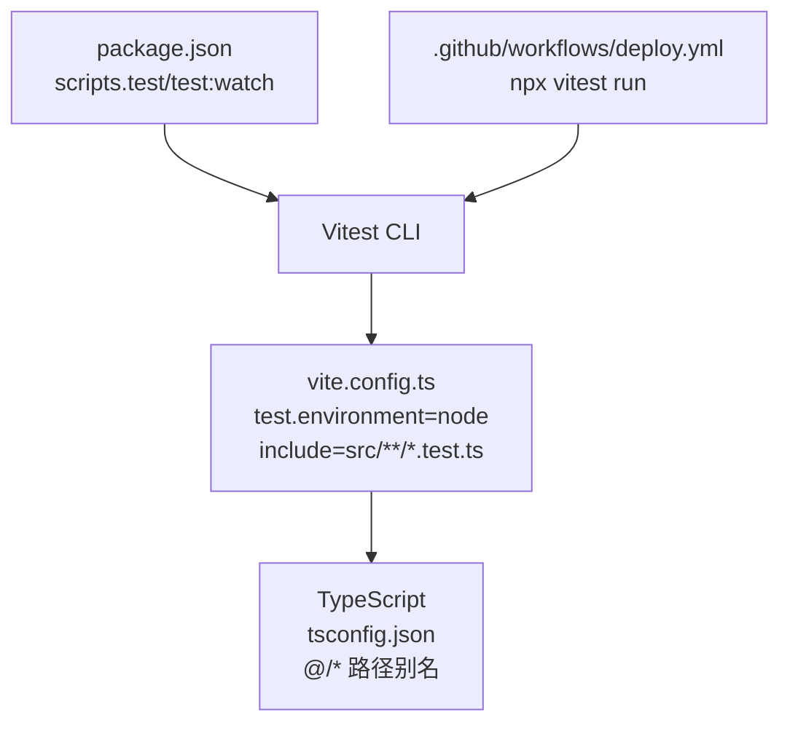
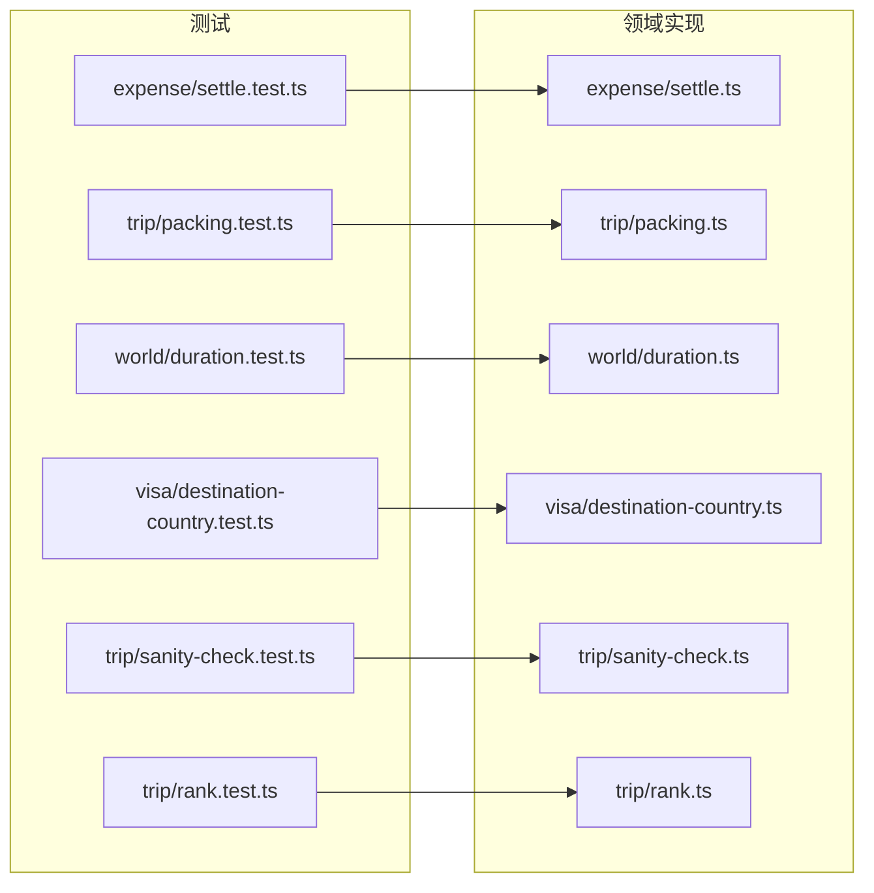
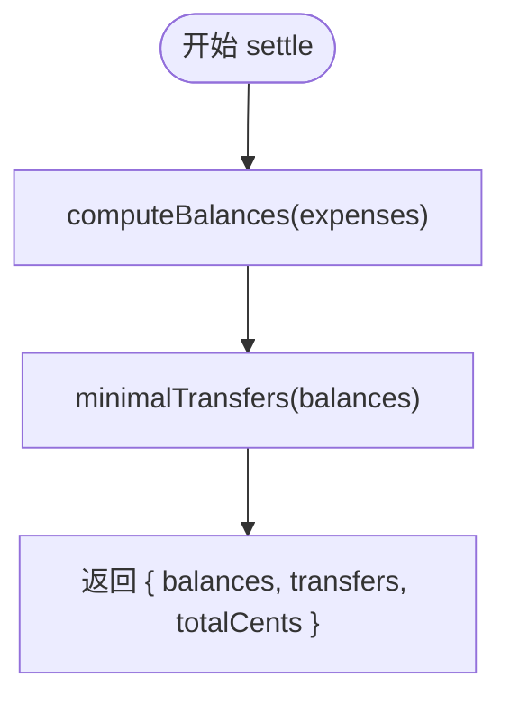
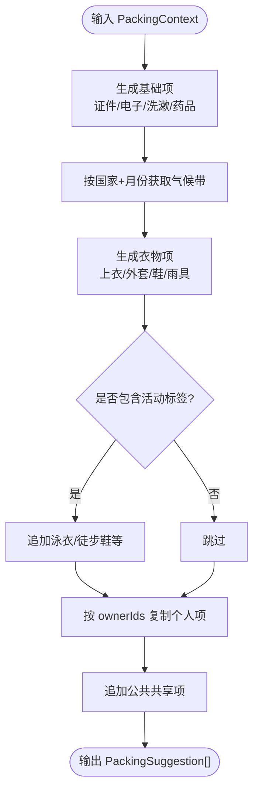
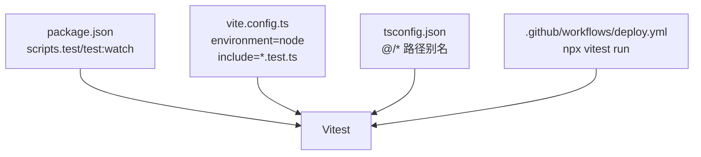

# 测试指南

<cite>
**本文引用的文件**
- [package.json](file://package.json)
- [vite.config.ts](file://vite.config.ts)
- [tsconfig.json](file://tsconfig.json)
- [deploy.yml](file://.github/workflows/deploy.yml)
- [settle.test.ts](file://src/domain/expense/settle.test.ts)
- [settle.ts](file://src/domain/expense/settle.ts)
- [packing.test.ts](file://src/domain/trip/packing.test.ts)
- [packing.ts](file://src/domain/trip/packing.ts)
- [duration.test.ts](file://src/domain/world/duration.test.ts)
- [destination-country.test.ts](file://src/domain/visa/destination-country.test.ts)
- [sanity-check.test.ts](file://src/domain/trip/sanity-check.test.ts)
- [rank.test.ts](file://src/domain/trip/rank.test.ts)
</cite>

## 目录
1. [简介](#简介)
2. [项目结构](#项目结构)
3. [核心组件](#核心组件)
4. [架构总览](#架构总览)
5. [详细组件分析](#详细组件分析)
6. [依赖分析](#依赖分析)
7. [性能考虑](#性能考虑)
8. [故障排查指南](#故障排查指南)
9. [结论](#结论)
10. [附录](#附录)

## 简介
本指南面向“玩无一失”项目的测试体系建设，聚焦以下目标：
- 基于 Vitest 的测试框架配置与运行方式
- 单元测试编写规范与最佳实践（领域逻辑、工具函数）
- 如何扩展至组件测试与集成测试（含模拟数据与环境准备）
- 覆盖率报告生成与持续集成中的执行策略
- 测试驱动开发（TDD）工作流建议

本项目已具备完善的领域层单测基础，覆盖费用结算、打包建议、时长格式化、签证国家判定、行程体检等核心业务。CI 已在 GitHub Actions 中集成类型检查、内容校验、单测与构建发布流程。

## 项目结构
- 测试入口与脚本
  - 通过 package.json 暴露 test 与 test:watch 命令，底层调用 vitest run 与 vitest
- 测试配置
  - vite.config.ts 中启用 Vitest，设置运行环境为 node，匹配 src/**/*.test.ts
- TypeScript 配置
  - tsconfig.json 开启严格模式、路径别名 @/* -> src/*，便于在测试中按模块导入
- CI 流水线
  - .github/workflows/deploy.yml 在 main 分支推送时执行内容校验、类型检查、vitest run 与构建

**图表来源**
- [package.json:7-16](file://package.json#L7-L16)
- [vite.config.ts:32-35](file://vite.config.ts#L32-L35)
- [tsconfig.json:23-27](file://tsconfig.json#L23-L27)
- [deploy.yml:34-38](file://.github/workflows/deploy.yml#L34-L38)

**章节来源**
- [package.json:7-16](file://package.json#L7-L16)
- [vite.config.ts:32-35](file://vite.config.ts#L32-L35)
- [tsconfig.json:1-30](file://tsconfig.json#L1-L30)
- [deploy.yml:19-38](file://.github/workflows/deploy.yml#L19-L38)

## 核心组件
- 费用结算（domain/expense）
  - 以整数分计算避免浮点漂移；支持权重分摊、最小转账次数结算、金额格式化
  - 单测覆盖分摊守恒、幽灵成员参与、个人自付跳过、端到端归零等关键场景
- 打包建议（domain/trip/packing）
  - 依据目的地国家、月份气候带、POI 类型/标签推导衣物与活动装备
  - 单测覆盖基础项、货币提示、活动推断、成员复制、公共项归属、天数下限、气候差异等
- 时长格式化（domain/world/duration）
  - 分钟/小时混排、区间折叠、非整小时保留一位小数
- 签证国家判定（domain/visa/destination-country）
  - 停留最久优先，并列时回退首个入境国；空行程给出明确提示
  - 将行程编译为使馆要求的四列表格，缺省字段使用占位符
- 行程体检（domain/trip/sanity-check）
  - 检测过满、闭馆日、预约截止提醒、城市折返等
- 排序与插入（domain/trip/rank）
  - 稳定可复现的 rank 生成与插入位置计算，压力场景下仍保持有序

**章节来源**
- [settle.test.ts:1-108](file://src/domain/expense/settle.test.ts#L1-L108)
- [settle.ts:1-141](file://src/domain/expense/settle.ts#L1-L141)
- [packing.test.ts:1-102](file://src/domain/trip/packing.test.ts#L1-L102)
- [packing.ts:1-164](file://src/domain/trip/packing.ts#L1-L164)
- [duration.test.ts:1-24](file://src/domain/world/duration.test.ts#L1-L24)
- [destination-country.test.ts:1-85](file://src/domain/visa/destination-country.test.ts#L1-L85)
- [sanity-check.test.ts:1-98](file://src/domain/trip/sanity-check.test.ts#L1-L98)
- [rank.test.ts:1-76](file://src/domain/trip/rank.test.ts#L1-L76)

## 架构总览
下图展示测试与领域代码的交互关系：测试用例位于 domain 同级或子目录下，直接 import 对应实现模块，验证其纯函数行为与边界条件。

**图表来源**
- [settle.test.ts:1-108](file://src/domain/expense/settle.test.ts#L1-L108)
- [packing.test.ts:1-102](file://src/domain/trip/packing.test.ts#L1-L102)
- [duration.test.ts:1-24](file://src/domain/world/duration.test.ts#L1-L24)
- [destination-country.test.ts:1-85](file://src/domain/visa/destination-country.test.ts#L1-L85)
- [sanity-check.test.ts:1-98](file://src/domain/trip/sanity-check.test.ts#L1-L98)
- [rank.test.ts:1-76](file://src/domain/trip/rank.test.ts#L1-L76)

## 详细组件分析

### 费用结算（Expense Settle）
- 设计要点
  - 金额统一以整数分计算，避免浮点误差
  - 分摊采用最大余数法保证总和守恒
  - 结算采用贪心策略，使欠最多者直接还给被欠最多者，转账次数上限 n-1
- 单测重点
  - 分摊守恒、权重分摊、大量小额不漂移
  - 余额计算：付款人记正、参与人记负；幽灵成员参与；个人自付跳过
  - 最小转账方案：三人一笔账、互相抵消、n-1 上界
  - 端到端：多笔混合支出后余额归零
- 复杂度
  - splitAmount: O(n)
  - computeBalances: O(m) m 为账单数
  - minimalTransfers: O(u+v) u,v 为债权人与债务人数量

**图表来源**
- [settle.ts:72-130](file://src/domain/expense/settle.ts#L72-L130)

**章节来源**
- [settle.test.ts:1-108](file://src/domain/expense/settle.test.ts#L1-L108)
- [settle.ts:1-141](file://src/domain/expense/settle.ts#L1-L141)

### 打包建议（Packing Suggestion）
- 设计要点
  - 基于目的地国家与月份的气候带推导衣物分层
  - 根据 POI 类型/标签推导活动相关物品
  - 个人行李按成员复制，公共项仅一份且 ownerId=null
- 单测重点
  - 基础项必含、货币提示、海滩/徒步活动推断
  - 成员复制与公共项归属、单人模式兜底
  - 天数下限、不同国家同月的气候差异
- 复杂度
  - suggestPacking: O(k + c + t)，k 为基础项数，c 为国家/货币去重，t 为标签集合判断

**图表来源**
- [packing.ts:79-163](file://src/domain/trip/packing.ts#L79-L163)

**章节来源**
- [packing.test.ts:1-102](file://src/domain/trip/packing.test.ts#L1-L102)
- [packing.ts:1-164](file://src/domain/trip/packing.ts#L1-L164)

### 时长格式化（Duration Format）
- 设计要点
  - 不足一小时显示分钟，整小时显示整数小时
  - 区间上下界相同不显示区间，跨小时区间混排
- 单测重点
  - 分钟/小时单位选择、区间折叠、非整小时精度、跨小时格式

**章节来源**
- [duration.test.ts:1-24](file://src/domain/world/duration.test.ts#L1-L24)

### 签证国家判定（Visa Country Decision）
- 设计要点
  - 停留最久国家优先；晚数并列回退首个入境国
  - 未排国家的日期不参与计数；空行程给出明确提示
  - 将行程编译为使馆要求的四列表格，缺省字段用占位符
- 单测重点
  - 停留统计、并列回退、空行程处理、表格行构造与缺省值

**章节来源**
- [destination-country.test.ts:1-85](file://src/domain/visa/destination-country.test.ts#L1-L85)

### 行程体检（Sanity Check）
- 设计要点
  - 检测一天内景点过多导致过满
  - 闭馆日检测、预约截止提醒、城市折返提示
  - 候选状态不计入体检
- 单测重点
  - 距离估算、过满/宽松场景、闭馆日、预约提醒、已有票券不重复提醒、折返检测、候选忽略

**章节来源**
- [sanity-check.test.ts:1-98](file://src/domain/trip/sanity-check.test.ts#L1-L98)

### 排序与插入（Rank Utilities）
- 设计要点
  - 在两个 rank 之间生成新 rank，保证严格递增
  - 批量生成严格递增序列；按位置插入计算 rank
  - 防止 a>=b 的非法输入，末位不为 0 保证后续插值空间
- 单测重点
  - 区间内生成、反复插入稳定性、非法输入抛错、末尾约束、空列表初始 rank

**章节来源**
- [rank.test.ts:1-76](file://src/domain/trip/rank.test.ts#L1-L76)

## 依赖分析
- 测试框架与运行环境
  - Vitest 作为测试运行器，运行环境为 Node
  - 通过 vite.config.ts 的 include 规则匹配所有 *.test.ts
- TypeScript 与路径别名
  - 使用 @/* 指向 src，测试可直接按模块路径导入
- CI 集成
  - GitHub Actions 在 main 分支推送时执行内容校验、类型检查、vitest run 与构建

**图表来源**
- [package.json:7-16](file://package.json#L7-L16)
- [vite.config.ts:32-35](file://vite.config.ts#L32-L35)
- [tsconfig.json:23-27](file://tsconfig.json#L23-L27)
- [deploy.yml:34-38](file://.github/workflows/deploy.yml#L34-L38)

**章节来源**
- [package.json:7-16](file://package.json#L7-L16)
- [vite.config.ts:32-35](file://vite.config.ts#L32-L35)
- [tsconfig.json:1-30](file://tsconfig.json#L1-L30)
- [deploy.yml:19-38](file://.github/workflows/deploy.yml#L19-L38)

## 性能考虑
- 领域单测多为纯函数，时间复杂度低，适合快速回归
- 费用结算的贪心算法在人数较少时表现良好，转账次数有理论上限
- 打包建议涉及字符串拼接与集合判断，注意控制输入规模与去重开销
- 建议在新增复杂算法时补充基准测试或边界压力用例（如大量成员、长行程）

[本节为通用指导，无需具体文件引用]

## 故障排查指南
- 测试未执行
  - 确认测试文件命名符合 *.test.ts，且位于 include 匹配范围
  - 检查 vite.config.ts 的 environment 与 include 配置
- 类型错误导致测试失败
  - 先运行类型检查，确保 tsconfig 的 strict 与 noUnusedLocals 等规则通过
- CI 失败
  - 查看 GitHub Actions 日志，定位到 content:check、tsc、vitest run 哪一步失败
  - 本地复现：npm run content:check && npx tsc --noEmit && npx vitest run
- 覆盖率报告
  - 当前 CI 未启用覆盖率；如需在本地生成，可在 vitest 命令中添加 coverage 选项并安装相应插件

**章节来源**
- [vite.config.ts:32-35](file://vite.config.ts#L32-L35)
- [tsconfig.json:1-30](file://tsconfig.json#L1-L30)
- [deploy.yml:34-38](file://.github/workflows/deploy.yml#L34-L38)

## 结论
本项目已建立以 Vitest 为核心的领域层单测体系，覆盖费用结算、打包建议、时长格式化、签证判定、行程体检与排序工具等关键逻辑。测试遵循纯函数验证、边界与异常场景覆盖的原则，并与 CI 紧密集成。未来可扩展组件测试与集成测试，完善覆盖率报告与性能基准，进一步提升质量保障能力。

[本节为总结性内容，无需具体文件引用]

## 附录

### 测试框架配置与运行
- 运行命令
  - 单次运行：npm test
  - 监听模式：npm run test:watch
- 配置要点
  - 运行环境：Node
  - 匹配规则：src/**/*.test.ts
  - 路径别名：@/* -> src/*

**章节来源**
- [package.json:7-16](file://package.json#L7-L16)
- [vite.config.ts:32-35](file://vite.config.ts#L32-L35)
- [tsconfig.json:23-27](file://tsconfig.json#L23-L27)

### 单元测试编写规范与最佳实践
- 组织方式
  - 每个领域模块与其同名或语义相关的 *.test.ts 放在同一目录
  - 使用 describe 分组、it 描述用例、expect 断言结果
- 断言风格
  - 精确断言数值与结构，避免模糊匹配
  - 对异常路径使用 toThrow 等断言
- 数据准备
  - 使用工厂函数或常量构造输入，保证可读性与复用
  - 对复杂对象使用最小必要字段，减少耦合
- 可维护性
  - 用例命名清晰表达意图
  - 拆分大用例为多个小用例，便于定位问题

**章节来源**
- [settle.test.ts:1-108](file://src/domain/expense/settle.test.ts#L1-L108)
- [packing.test.ts:1-102](file://src/domain/trip/packing.test.ts#L1-L102)
- [destination-country.test.ts:1-85](file://src/domain/visa/destination-country.test.ts#L1-L85)
- [sanity-check.test.ts:1-98](file://src/domain/trip/sanity-check.test.ts#L1-L98)
- [rank.test.ts:1-76](file://src/domain/trip/rank.test.ts#L1-L76)

### 领域逻辑测试示例
- 费用结算
  - 分摊守恒、权重分摊、个人自付跳过、最小转账次数、端到端归零
- 打包建议
  - 基础项、货币提示、活动推断、成员复制、公共项归属、气候差异
- 时长格式化
  - 单位选择、区间折叠、精度控制
- 签证判定
  - 停留统计、并列回退、空行程处理、表格构造
- 行程体检
  - 过满、闭馆日、预约提醒、折返检测、候选忽略
- 排序工具
  - 区间生成、批量序列、插入位置、非法输入

**章节来源**
- [settle.test.ts:1-108](file://src/domain/expense/settle.test.ts#L1-L108)
- [packing.test.ts:1-102](file://src/domain/trip/packing.test.ts#L1-L102)
- [duration.test.ts:1-24](file://src/domain/world/duration.test.ts#L1-L24)
- [destination-country.test.ts:1-85](file://src/domain/visa/destination-country.test.ts#L1-L85)
- [sanity-check.test.ts:1-98](file://src/domain/trip/sanity-check.test.ts#L1-L98)
- [rank.test.ts:1-76](file://src/domain/trip/rank.test.ts#L1-L76)

### 组件测试与集成测试（扩展建议）
- 组件测试
  - 引入浏览器环境（如 jsdom），渲染 React 组件，模拟用户交互与状态变化
  - 使用 React Testing Library 进行查询与断言
- 集成测试
  - 模拟后端接口（如 Supabase），验证数据流与副作用
  - 结合 Vite 的模块系统，按需 mock 外部依赖
- 模拟数据
  - 抽取固定 fixture，避免硬编码分散在各用例
  - 使用工厂函数生成可变但受控的数据集

[本节为概念性指导，无需具体文件引用]

### 测试环境配置与覆盖率报告
- 环境
  - 当前使用 Node 环境运行领域单测
  - 如需浏览器环境，可在 vite.config.ts 中切换或添加 browser 配置
- 覆盖率
  - 在 vitest 命令中添加 coverage 选项，并安装相应插件
  - 在 CI 中可选择性启用覆盖率门禁

**章节来源**
- [vite.config.ts:32-35](file://vite.config.ts#L32-L35)

### TDD 工作流程建议
- 红-绿-重构
  - 先写失败用例（红），再实现最小满足逻辑（绿），最后重构提升质量
- 增量演进
  - 每次只解决一个需求点，逐步完善用例与实现
- 回归保障
  - 修改核心逻辑前运行相关用例，确保无回归

[本节为方法论指导，无需具体文件引用]

### 持续集成中的测试执行策略
- 触发时机
  - main 分支推送与手动触发
- 执行步骤
  - 内容校验、类型检查、vitest run、构建发布
- 产物与部署
  - 构建产物上传至 Pages 并发布

**章节来源**
- [deploy.yml:19-38](file://.github/workflows/deploy.yml#L19-L38)