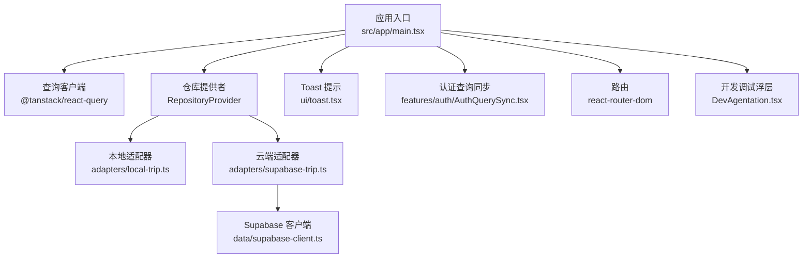
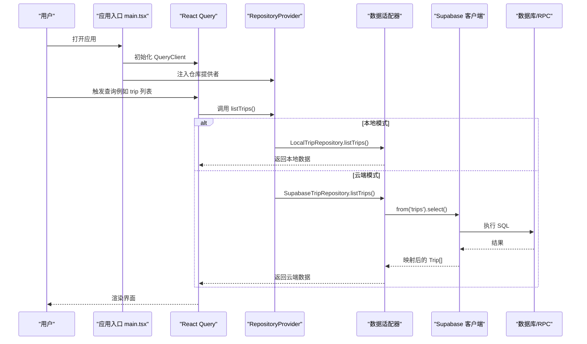
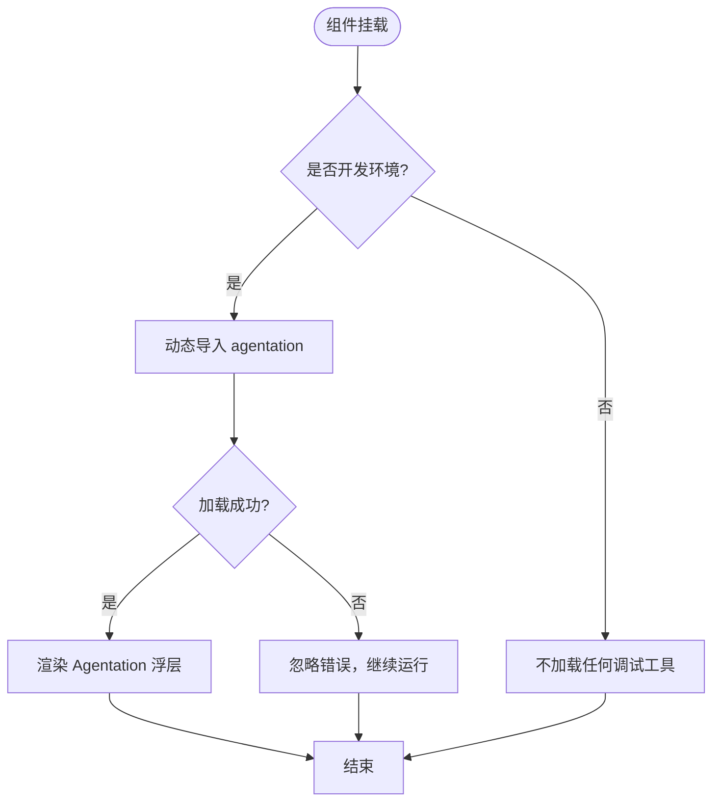
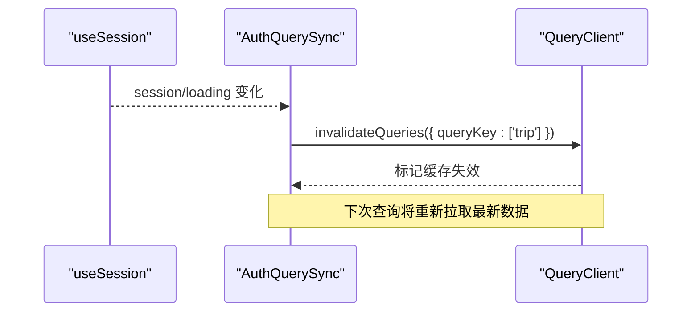
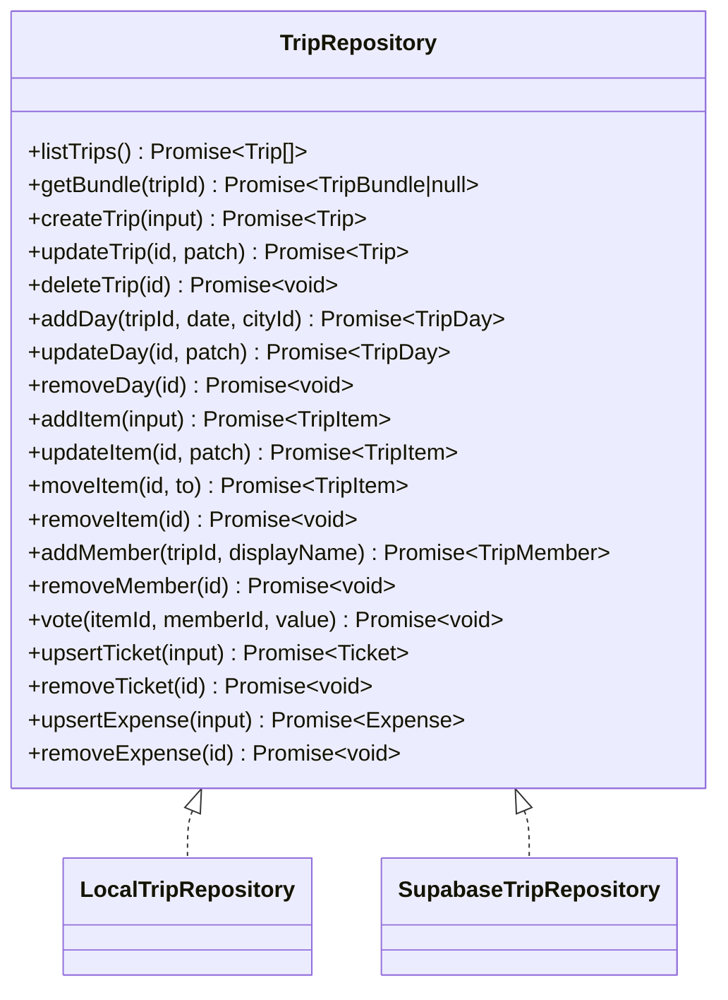
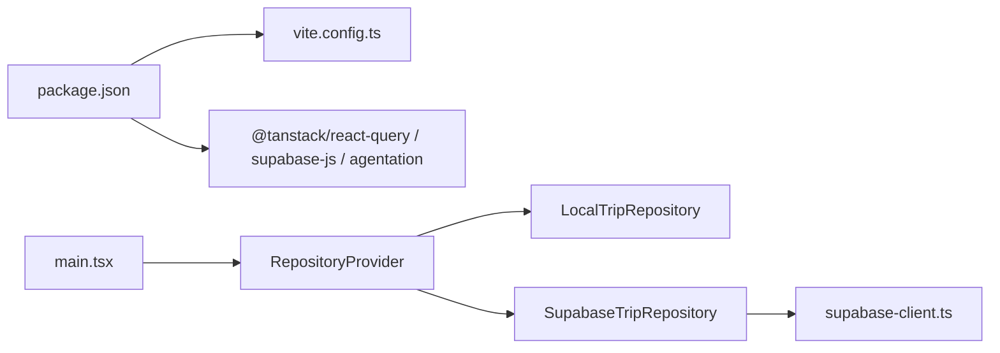

# 调试工具

<cite>
**本文引用的文件**
- [DevAgentation.tsx](file://src/app/DevAgentation.tsx)
- [main.tsx](file://src/app/main.tsx)
- [package.json](file://package.json)
- [vite.config.ts](file://vite.config.ts)
- [supabase-client.ts](file://src/data/supabase-client.ts)
- [AuthQuerySync.tsx](file://src/features/auth/AuthQuerySync.tsx)
- [local-trip.ts](file://src/data/adapters/local-trip.ts)
- [supabase-trip.ts](file://src/data/adapters/supabase-trip.ts)
- [toast.tsx](file://src/ui/toast.tsx)
- [Timeline.tsx](file://src/features/trip/Timeline.tsx)
- [技术方案.md](file://docs/技术方案.md)
</cite>

## 目录
1. [简介](#简介)
2. [项目结构](#项目结构)
3. [核心组件](#核心组件)
4. [架构总览](#架构总览)
5. [详细组件分析](#详细组件分析)
6. [依赖关系分析](#依赖关系分析)
7. [性能注意事项](#性能注意事项)
8. [故障排查指南](#故障排查指南)
9. [结论](#结论)
10. [附录](#附录)

## 简介
本指南面向“玩无一失”项目的开发与维护人员，聚焦于在浏览器中高效定位问题、监控错误与优化性能。内容覆盖：
- 浏览器开发者工具的高级用法（网络、渲染、内存、断点）
- React DevTools 配置与性能分析技巧
- 错误监控工具 Agentation 的使用方式与集成要点
- 日志记录策略与调试断点设置
- 网络请求调试、状态管理调试与数据库查询优化方法
- 常见问题调试流程与性能瓶颈定位技巧

## 项目结构
本项目基于 Vite + React 构建，采用模块化组织：
- 应用入口与全局上下文：src/app/main.tsx
- 开发期调试浮层：src/app/DevAgentation.tsx
- 数据访问层：src/data/adapters/local-trip.ts、src/data/adapters/supabase-trip.ts、src/data/supabase-client.ts
- 认证与查询同步：src/features/auth/AuthQuerySync.tsx
- 用户反馈：src/ui/toast.tsx
- 业务页面与面板：src/features/trip/*（如 Timeline.tsx）
- 构建与脚本：package.json、vite.config.ts

图表来源
- [main.tsx:1-37](file://src/app/main.tsx#L1-L37)
- [DevAgentation.tsx:15-35](file://src/app/DevAgentation.tsx#L15-L35)
- [supabase-client.ts:17-34](file://src/data/supabase-client.ts#L17-L34)
- [local-trip.ts:67-79](file://src/data/adapters/local-trip.ts#L67-L79)
- [supabase-trip.ts:141-198](file://src/data/adapters/supabase-trip.ts#L141-L198)

章节来源
- [main.tsx:1-37](file://src/app/main.tsx#L1-L37)
- [package.json:1-45](file://package.json#L1-L45)
- [vite.config.ts:1-37](file://vite.config.ts#L1-L37)

## 核心组件
- 应用启动与上下文装配：在入口创建 QueryClient、提供 RepositoryProvider、ToastProvider、路由与认证同步，并挂载开发调试浮层。
- 开发调试浮层（Agentation）：仅在开发模式动态加载，用于快速定位 UI 元素并生成结构化描述（CSS 选择器、React 组件路径、坐标），便于协作沟通与问题复现。
- 认证与查询同步：监听登录态变化，自动失效相关查询，避免登录后仍显示旧数据。
- 数据适配器：本地与云端两套实现统一接口；云端通过 Supabase RPC 一次性获取行程全量数据，减少往返次数。
- Toast 提示：轻量级全局提示，用于操作反馈与错误提示。

章节来源
- [main.tsx:15-37](file://src/app/main.tsx#L15-L37)
- [DevAgentation.tsx:1-35](file://src/app/DevAgentation.tsx#L1-L35)
- [AuthQuerySync.tsx:1-27](file://src/features/auth/AuthQuerySync.tsx#L1-L27)
- [supabase-trip.ts:159-198](file://src/data/adapters/supabase-trip.ts#L159-L198)
- [toast.tsx:1-82](file://src/ui/toast.tsx#L1-L82)

## 架构总览
下图展示了从应用入口到数据层的调用链路与关键调试点：

图表来源
- [main.tsx:15-37](file://src/app/main.tsx#L15-L37)
- [supabase-trip.ts:150-157](file://src/data/adapters/supabase-trip.ts#L150-L157)
- [local-trip.ts:89-95](file://src/data/adapters/local-trip.ts#L89-L95)

## 详细组件分析

### 开发调试浮层（Agentation）
- 作用：在右下角挂一个工具条，点击任意元素即可生成 CSS 选择器、React 组件路径、坐标等结构化信息，帮助将“右下角那个按钮”这类模糊描述转化为可精确定位的代码引用。
- 加载时机：仅在开发模式动态 import，生产构建会被剔除，不影响产物体积。
- 使用建议：
  - 在 dev 模式下启用，配合浏览器控制台查看生成的选择器与组件路径。
  - 遇到 UI 问题时，用该工具快速定位到具体组件与 DOM 节点，提升协作效率。
  - 若动态加载失败，不会阻断应用运行（已做容错）。

图表来源
- [DevAgentation.tsx:18-31](file://src/app/DevAgentation.tsx#L18-L31)

章节来源
- [DevAgentation.tsx:1-35](file://src/app/DevAgentation.tsx#L1-L35)
- [package.json:33-43](file://package.json#L33-L43)

### 应用入口与查询客户端
- 初始化 QueryClient 时关闭窗口聚焦重取，避免切换标签页导致不必要的刷新；真正的实时性由 Supabase Realtime 接管。
- 提供 RepositoryProvider、ToastProvider、认证同步组件与路由，最后挂载 DevAgentation。
- 调试要点：
  - 使用 React DevTools 的 Profiler 观察渲染耗时与重渲染原因。
  - 使用 Network 面板检查首次加载资源与 API 请求。
  - 使用 Performance 面板录制交互过程，定位卡顿帧。

章节来源
- [main.tsx:15-37](file://src/app/main.tsx#L15-L37)

### 认证与查询同步
- 监听 Supabase 会话变化，登录或登出后立即失效 ['trip'] 分组查询，强制以新会话重新拉取数据，解决“登录后列表仍为空”的问题。
- 调试要点：
  - 在 React DevTools 中查看 QueryClient 缓存键与状态。
  - 在 Network 面板确认登录成功后是否有新的 trip 查询。
  - 若仍有陈旧数据，检查是否误用了其他 queryKey 或未正确失效。

图表来源
- [AuthQuerySync.tsx:15-23](file://src/features/auth/AuthQuerySync.tsx#L15-L23)
- [supabase-client.ts:45-68](file://src/data/supabase-client.ts#L45-L68)

章节来源
- [AuthQuerySync.tsx:1-27](file://src/features/auth/AuthQuerySync.tsx#L1-L27)
- [supabase-client.ts:17-68](file://src/data/supabase-client.ts#L17-L68)

### 数据适配器与数据库查询优化
- 本地适配器：基于 localStorage 存储，适合无后端凭据时的开发与演示；所有写操作会更新 updatedAt，便于排序与变更检测。
- 云端适配器：通过 RPC get_trip_bundle 一次获取行程全量数据（包含成员、日程、条目、投票、票据、账单等），显著减少往返次数；字段映射集中处理，保证与迁移一致。
- 调试要点：
  - 使用 Network 面板查看 RPC 调用与响应体大小，评估是否仍需拆分查询。
  - 对慢查询，结合 Supabase 后台日志与索引策略进行优化。
  - 对比本地与云端行为差异，确保逻辑一致性。

图表来源
- [local-trip.ts:67-349](file://src/data/adapters/local-trip.ts#L67-L349)
- [supabase-trip.ts:141-524](file://src/data/adapters/supabase-trip.ts#L141-L524)

章节来源
- [local-trip.ts:67-349](file://src/data/adapters/local-trip.ts#L67-L349)
- [supabase-trip.ts:159-198](file://src/data/adapters/supabase-trip.ts#L159-L198)

### Toast 提示与用户反馈
- 提供统一的 toast 能力，支持 success/error/warn/info 类型，自动消失并可手动关闭。
- 调试要点：
  - 在关键错误路径调用 toast 展示错误信息，便于用户感知与问题上报。
  - 结合浏览器控制台输出更详细的堆栈与上下文，辅助定位。

章节来源
- [toast.tsx:1-82](file://src/ui/toast.tsx#L1-L82)

### 页面级错误与降级
- 技术方案中明确：按路由分段包裹 ErrorBoundary，右栏详情面板崩溃不影响主时间线；对地图瓦片加载失败、POI JSON 结构异常等情况提供降级与告警。
- 调试要点：
  - 在 Timeline 等复杂面板中关注 Suspense fallback 与错误边界表现。
  - 使用浏览器控制台过滤错误日志，快速定位白屏或渲染异常。

章节来源
- [Timeline.tsx:638-666](file://src/features/trip/Timeline.tsx#L638-L666)
- [技术方案.md:1159-1177](file://docs/技术方案.md#L1159-L1177)

## 依赖关系分析
- 构建与插件：Vite + React 插件，基础路径为相对路径，便于子路径部署与离线访问。
- 包依赖：agentation 作为开发依赖，仅开发模式加载；@tanstack/react-query 负责数据缓存与同步；Supabase 客户端用于云端数据访问。
- 模块耦合：数据适配器通过统一接口解耦 UI 与数据源；认证与查询同步通过 React Context 与 QueryClient 解耦。

图表来源
- [package.json:18-43](file://package.json#L18-L43)
- [vite.config.ts:5-31](file://vite.config.ts#L5-L31)
- [main.tsx:25-37](file://src/app/main.tsx#L25-L37)
- [supabase-client.ts:17-34](file://src/data/supabase-client.ts#L17-L34)

章节来源
- [package.json:1-45](file://package.json#L1-L45)
- [vite.config.ts:1-37](file://vite.config.ts#L1-L37)

## 性能注意事项
- 首屏与分包：通过 manualChunks 将 react、react-router-dom、@tanstack/react-query 单独切分，减少重复加载。
- 查询策略：关闭 refetchOnWindowFocus，避免频繁重取；利用 Supabase Realtime 保障实时性。
- 数据聚合：使用 RPC 一次性获取行程全量数据，减少多次往返。
- 渲染优化：使用 React DevTools Profiler 识别不必要重渲染；对大图与地图瓦片进行懒加载与缓存。
- 内存与网络：使用 Performance 与 Memory 面板分析长任务与内存泄漏；在网络面板中关注大响应与重试。

[本节为通用指导，不直接分析具体文件]

## 故障排查指南
- 登录后数据未刷新：
  - 检查 AuthQuerySync 是否正确监听 session 变化并失效 ['trip'] 查询。
  - 在 React DevTools 中查看 QueryClient 缓存键与状态。
  - 在 Network 面板确认是否有新的 trip 查询。
- 地图或 POI 加载失败：
  - 参考技术方案中的降级策略，检查占位卡与备用视图是否正常。
  - 使用 Network 面板查看瓦片请求状态码与响应体。
- 数据不一致（本地 vs 云端）：
  - 对比 local-trip.ts 与 supabase-trip.ts 的字段映射与默认值。
  - 使用浏览器 Storage 面板清理本地数据后重试。
- 错误边界与白屏：
  - 确认各路由面板被 ErrorBoundary 包裹，局部崩溃不影响整体。
  - 在控制台查看错误堆栈，定位具体组件与调用链。

章节来源
- [AuthQuerySync.tsx:15-23](file://src/features/auth/AuthQuerySync.tsx#L15-L23)
- [supabase-trip.ts:159-198](file://src/data/adapters/supabase-trip.ts#L159-L198)
- [local-trip.ts:67-79](file://src/data/adapters/local-trip.ts#L67-L79)
- [Timeline.tsx:638-666](file://src/features/trip/Timeline.tsx#L638-L666)
- [技术方案.md:1159-1177](file://docs/技术方案.md#L1159-L1177)

## 结论
本项目在调试与排障方面提供了良好的基础设施：
- 通过 Agentation 快速定位 UI 元素，提升协作效率。
- 使用 React Query 与 Supabase Realtime 组合，兼顾性能与实时性。
- 数据适配器统一接口，便于本地与云端切换与测试。
- 完善的错误边界与降级策略，保障用户体验。
建议在开发过程中结合浏览器开发者工具、React DevTools 与项目内置的调试能力，形成标准化的问题定位与性能优化流程。

[本节为总结，不直接分析具体文件]

## 附录
- 浏览器开发者工具常用面板：
  - Elements：检查 DOM 与样式，使用 Agentation 生成的选择器快速定位。
  - Console：查看日志与错误堆栈，过滤特定关键词。
  - Network：分析请求与响应，关注状态码、耗时与缓存命中。
  - Performance：录制交互过程，识别长任务与重渲染热点。
  - Memory：分析堆快照，定位内存泄漏。
- React DevTools：
  - Components：查看组件树与 props/state。
  - Profiler：记录渲染耗时，分析重渲染原因。
  - 结合 QueryClient 缓存键与状态，验证数据流。
- 断点设置：
  - 在关键函数（如适配器方法、认证回调、查询失效处）设置断点，逐步跟踪数据流。
  - 条件断点：根据 userId、tripId 等筛选特定场景。
- 日志记录策略：
  - 对用户可见的错误使用 Toast 提示。
  - 对内部错误输出到控制台，附带上下文信息（如 tripId、userId）。
  - 在生产环境中谨慎输出敏感信息，必要时接入外部监控平台。

[本节为通用指导，不直接分析具体文件]