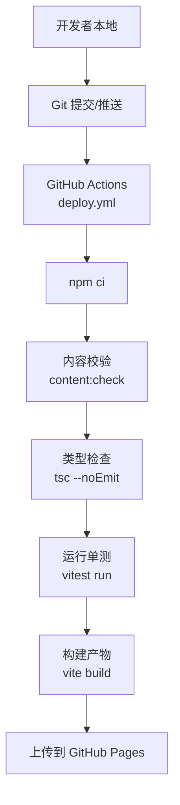
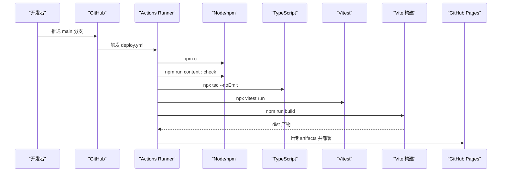
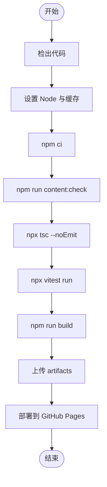
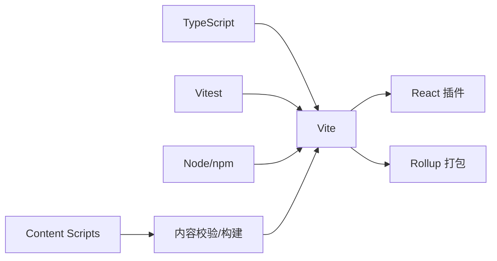

# 贡献工作流

<cite>
**本文引用的文件**
- [package.json](file://package.json)
- [.github/workflows/deploy.yml](file://.github/workflows/deploy.yml)
- [vite.config.ts](file://vite.config.ts)
- [tsconfig.json](file://tsconfig.json)
- [content/README.md](file://content/README.md)
- [scripts/validate-content.ts](file://scripts/validate-content.ts)
- [src/domain/trip/sanity-check.test.ts](file://src/domain/trip/sanity-check.test.ts)
- [src/domain/world/staleness.ts](file://src/domain/world/staleness.ts)
</cite>

## 目录
1. [简介](#简介)
2. [项目结构](#项目结构)
3. [核心组件](#核心组件)
4. [架构总览](#架构总览)
5. [详细组件分析](#详细组件分析)
6. [依赖分析](#依赖分析)
7. [性能考虑](#性能考虑)
8. [故障排查指南](#故障排查指南)
9. [结论](#结论)
10. [附录](#附录)

## 简介
本文件为“玩无一失”项目的贡献工作流规范，覆盖分支策略、Pull Request 流程与代码审查标准；详细说明 GitHub Actions 部署流水线、自动化测试与构建流程；并给出版本发布流程、变更日志维护与向后兼容性保证。同时提供新功能开发、常规 Bug 修复与紧急修复的标准流程，确保团队协作一致、质量可控、可追溯。

## 项目结构
仓库采用前端单页应用 + 内容数据脚本的混合结构：
- 前端工程：基于 Vite + React + TypeScript，使用 Vitest 进行单元测试，Vitest 配置内嵌于 Vite 配置中。
- 内容数据：世界库（国家/城市/景点）以 JSON 形式维护在 content 目录，通过脚本校验与构建生成运行时数据与索引。
- CI/CD：GitHub Actions 将 main 分支推送到 GitHub Pages，包含内容校验、类型检查、单测与构建产物上传。

**图表来源**
- [.github/workflows/deploy.yml:1-52](file://.github/workflows/deploy.yml#L1-L52)
- [package.json:7-16](file://package.json#L7-L16)
- [vite.config.ts:5-36](file://vite.config.ts#L5-L36)

**章节来源**
- [.github/workflows/deploy.yml:1-52](file://.github/workflows/deploy.yml#L1-L52)
- [package.json:1-45](file://package.json#L1-L45)
- [vite.config.ts:1-37](file://vite.config.ts#L1-L37)

## 核心组件
- 构建与脚本入口：package.json 定义了 dev/build/test/content 相关脚本，串联内容校验、类型检查、测试与构建。
- 内容校验：scripts/validate-content.ts 负责加载 world 内容并执行结构与业务规则校验，错误会终止进程，用于 CI 门禁。
- 测试框架：Vitest 通过 vite.config.ts 中的 test 配置启用，匹配 src/**/*.test.ts。
- 类型系统：tsconfig.json 开启严格模式与多项安全选项，配合 tsc -b 做跨包类型检查。
- 部署流水线：.github/workflows/deploy.yml 定义 push main 或手动触发时构建并部署到 GitHub Pages。

**章节来源**
- [package.json:7-16](file://package.json#L7-L16)
- [scripts/validate-content.ts:1-76](file://scripts/validate-content.ts#L1-L76)
- [vite.config.ts:32-36](file://vite.config.ts#L32-L36)
- [tsconfig.json:1-31](file://tsconfig.json#L1-L31)
- [.github/workflows/deploy.yml:1-52](file://.github/workflows/deploy.yml#L1-L52)

## 架构总览
下图展示从代码提交到线上发布的完整流水线，以及内容与测试在其中的作用。

**图表来源**
- [.github/workflows/deploy.yml:19-51](file://.github/workflows/deploy.yml#L19-L51)
- [package.json:7-16](file://package.json#L7-L16)

## 详细组件分析

### Git 分支策略
- 主分支
  - main：生产可用分支，仅允许合并已通过审查且通过 CI 的 PR。
- 功能分支
  - feature/*：新增功能或大改动，命名建议 feature/<描述>。
- 修复分支
  - fix/*：常规 Bug 修复，命名建议 fix/<问题简述>。
- 紧急修复分支
  - hotfix/*：线上紧急修复，命名建议 hotfix/<问题简述>，优先合并至 main 后打标签。
- 发布分支（可选）
  - release/*：预发布分支，用于集成测试与回归验证，完成后合并回 main 并打标签。

说明：
- 所有分支均需在 PR 中通过 CI 检查（内容校验、类型检查、单测、构建）。
- 禁止直接向 main 推送代码，必须通过 PR 合并。

### Pull Request 流程
- 创建 PR
  - 选择目标分支为 main（hotfix 可直接指向 main）。
  - 填写 PR 模板（若仓库未内置模板，请在 PR 描述中包含：变更目的、影响范围、自测步骤、风险点）。
- 自动检查
  - CI 会在 PR 上运行内容校验、类型检查、单测与构建，全部通过才可合并。
- 代码审查
  - 至少一名 reviewer 批准。
  - 关注点：可读性、边界条件、性能、安全性、可测试性、对内容数据的合规性。
- 合并策略
  - 推荐 Squash and Merge 或 Rebase and Merge，保持 main 历史整洁。
- 合并后
  - 如需发布，按“版本发布流程”执行。

### 代码审查标准
- 正确性
  - 逻辑正确、边界条件覆盖、异常路径处理。
- 可测试性
  - 关键逻辑具备单测或集成测试用例，新增/修改需补充测试。
- 可读性
  - 命名清晰、函数职责单一、注释必要且不过度。
- 性能
  - 避免不必要的重渲染与重复计算，合理使用分包与懒加载。
- 安全性
  - 不泄露敏感信息，输入输出校验完备。
- 内容数据合规
  - 遵循 content/README.md 的三条硬规则与字段规范，确保 source 与 verifiedAt 齐全。

### GitHub Actions 部署流水线
- 触发条件
  - push 到 main 分支或 workflow_dispatch 手动触发。
- 权限与环境
  - 授予 contents/pages/id-token 权限，使用 GitHub Pages 环境。
- 构建步骤
  - 安装依赖、内容校验（content:check）、类型检查（tsc --noEmit）、运行单测（vitest run）、构建（vite build）。
- 部署步骤
  - 上传 dist 产物并通过 actions/deploy-pages 部署到 GitHub Pages。

**图表来源**
- [.github/workflows/deploy.yml:19-51](file://.github/workflows/deploy.yml#L19-L51)

**章节来源**
- [.github/workflows/deploy.yml:1-52](file://.github/workflows/deploy.yml#L1-L52)
- [package.json:7-16](file://package.json#L7-L16)

### 自动化测试与构建
- 测试
  - 使用 Vitest，配置文件位于 vite.config.ts，匹配 src/**/*.test.ts。
  - 示例测试覆盖领域逻辑（如行程体检、距离计算等），可在本地运行 npm test 或 npm run test:watch。
- 类型检查
  - 使用 TypeScript 严格模式，配合 tsconfig.json 的 strict、noUnusedLocals、noUncheckedIndexedAccess 等选项。
- 构建
  - Vite 构建目标 es2020，拆分 vendor 与 query 等公共库，优化首屏与缓存。
  - base 设置为相对路径，适配 GitHub Pages 子路径与离线访问。

**章节来源**
- [vite.config.ts:5-36](file://vite.config.ts#L5-L36)
- [tsconfig.json:1-31](file://tsconfig.json#L1-L31)
- [src/domain/trip/sanity-check.test.ts:1-98](file://src/domain/trip/sanity-check.test.ts#L1-L98)

### 版本发布流程
- 版本号管理
  - 当前版本由 package.json 的 version 字段管理（例如 0.1.0）。
- 打标签
  - 在 main 分支上打语义化标签 v<major>.<minor>.<patch>，用于记录发布快照。
- 发布说明
  - 在仓库 Releases 页面创建发布说明，列出主要变更、修复与已知问题。
- 回滚策略
  - 若新版本出现严重问题，可通过 GitHub Pages 重新部署上一个稳定版本的 dist 产物（保留历史 artifact）。

注意：仓库未包含专门的 changelog 文件，建议在每次 Release 的说明中维护变更记录。

**章节来源**
- [package.json:1-10](file://package.json#L1-L10)

### 变更日志维护
- 由于仓库未内置 CHANGELOG，建议在每次发布时在 GitHub Releases 中记录：
  - 新增功能、重要改进、Bug 修复、破坏性变更。
  - 关联 PR 编号与作者。
- 对于内容数据变更，遵循 content/README.md 的规范，确保每条易变信息都有 source 与 verifiedAt。

**章节来源**
- [content/README.md:13-41](file://content/README.md#L13-L41)

### 向后兼容性保证
- 前端兼容
  - 构建目标为 es2020，确保现代浏览器支持。
- 内容数据兼容
  - 新增字段需默认值或兼容逻辑，避免破坏现有消费端。
- 接口与迁移
  - Supabase 迁移文件位于 supabase/migrations，新增字段需考虑旧客户端行为。
- 时效性提示
  - 使用 staleness 逻辑对超过阈值的信息进行警示，降低过期数据对用户的影响。

**章节来源**
- [vite.config.ts:19-21](file://vite.config.ts#L19-L21)
- [src/domain/world/staleness.ts:1-48](file://src/domain/world/staleness.ts#L1-L48)

### 新功能开发标准流程
- 创建 feature/* 分支。
- 实现功能并补充单测（vitest）。
- 本地运行 npm run content:check、npm run typecheck、npm test。
- 提交 PR 并等待 CI 与审查通过。
- 合并至 main 后，按需发布。

### 常规 Bug 修复流程
- 创建 fix/* 分支。
- 复现问题并编写最小化测试用例。
- 修复后运行全套检查与测试。
- 提交 PR，合并后纳入下一次发布。

### 紧急修复流程（hotfix）
- 创建 hotfix/* 分支，直接从 main 拉取。
- 快速修复并补充必要测试。
- 直接合并至 main，立即触发 CI 与部署。
- 在 Releases 中记录紧急修复说明。

## 依赖分析
- 构建与工具链
  - Vite、React、TypeScript、Vitest 构成开发与构建核心。
- 运行时依赖
  - React Router、TanStack Query、Supabase JS、MapLibre GL、Zustand 等支撑功能。
- 脚本与内容
  - scripts 目录下的校验与构建脚本保障内容质量与一致性。

**图表来源**
- [package.json:18-43](file://package.json#L18-L43)
- [vite.config.ts:1-36](file://vite.config.ts#L1-L36)

**章节来源**
- [package.json:18-43](file://package.json#L18-L43)
- [vite.config.ts:1-36](file://vite.config.ts#L1-L36)

## 性能考虑
- 代码分割
  - 将 react、react-dom、react-router-dom 与 @tanstack/react-query 单独分包，提升缓存命中率与并行加载能力。
- 构建目标
  - 使用 es2020 作为目标，平衡兼容性与体积。
- 资源路径
  - base 使用相对路径，适配 GitHub Pages 子路径与离线场景。
- 内容数据
  - 内容校验与构建前置，避免运行时解析开销。

[本节为通用指导，不直接分析具体文件]

## 故障排查指南
- 内容校验失败
  - 检查 content 目录下的 JSON 是否符合 schema 与业务规则，确保 source 与 verifiedAt 齐全。
  - 参考 scripts/validate-content.ts 的错误输出定位问题文件。
- 类型检查失败
  - 根据 tsc 报错信息修正类型定义与使用方式，确保严格模式下无隐患。
- 单测失败
  - 运行 npm run test:watch 定位失败用例，补充或修复测试。
- 构建失败
  - 检查依赖安装与 Vite 配置，确认环境变量注入（如 Supabase URL/Key）是否正确。
- 部署失败
  - 检查 GitHub Pages 权限与 Secrets 配置，确认 artifacts 已上传。

**章节来源**
- [scripts/validate-content.ts:20-76](file://scripts/validate-content.ts#L20-L76)
- [.github/workflows/deploy.yml:22-38](file://.github/workflows/deploy.yml#L22-L38)

## 结论
本工作流通过严格的分支策略、PR 流程与代码审查标准，结合 GitHub Actions 的内容校验、类型检查、单测与构建，确保代码质量与发布稳定性。版本发布与变更日志维护在 Releases 中进行，向后兼容性通过构建目标与内容数据策略保障。新功能、常规修复与紧急修复均有明确流程，便于团队协作与持续交付。

## 附录
- 常用命令
  - 开发：npm run dev
  - 构建：npm run build
  - 预览：npm run preview
  - 类型检查：npm run typecheck
  - 测试：npm run test / npm run test:watch
  - 内容校验与构建：npm run content:check
- 内容数据规范
  - 遵循 content/README.md 的三条硬规则与字段速查表，确保数据质量与可追溯性。

**章节来源**
- [package.json:7-16](file://package.json#L7-L16)
- [content/README.md:1-47](file://content/README.md#L1-L47)