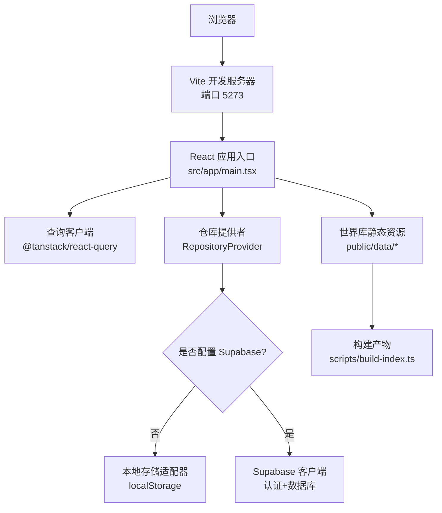
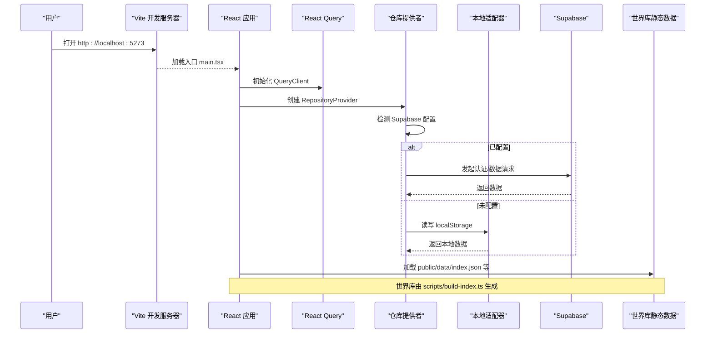
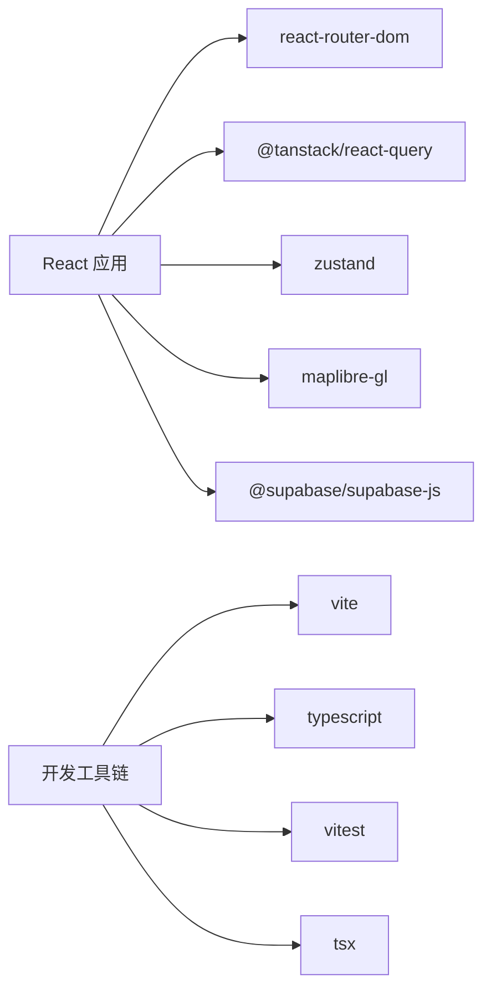

# 快速开始

<cite>
**本文引用的文件**
- [package.json](file://package.json)
- [vite.config.ts](file://vite.config.ts)
- [tsconfig.json](file://tsconfig.json)
- [index.html](file://index.html)
- [.env.example](file://.env.example)
- [.env](file://.env)
- [src/app/main.tsx](file://src/app/main.tsx)
- [src/data/supabase-client.ts](file://src/data/supabase-client.ts)
- [scripts/build-index.ts](file://scripts/build-index.ts)
- [scripts/validate-content.ts](file://scripts/validate-content.ts)
- [content/README.md](file://content/README.md)
</cite>

## 目录
1. [简介](#简介)
2. [项目结构](#项目结构)
3. [核心组件](#核心组件)
4. [架构总览](#架构总览)
5. [详细组件分析](#详细组件分析)
6. [依赖分析](#依赖分析)
7. [性能注意事项](#性能注意事项)
8. [故障排除指南](#故障排除指南)
9. [结论](#结论)
10. [附录](#附录)

## 简介
本指南面向首次接触“玩无一失”的新用户，目标是在最短时间内完成环境准备、克隆安装、本地运行与基础开发配置。项目基于 Vite + React + TypeScript，支持离线世界库与可选的 Supabase 云端协作；默认即可在本地完整体验所有交互，填入凭据后可开启跨设备同步与协作能力。

## 项目结构
- 前端应用：Vite 构建，React 18，TypeScript，路由使用 react-router-dom，数据请求与缓存使用 @tanstack/react-query，状态管理使用 zustand，地图使用 maplibre-gl。
- 内容系统：content/ 为“世界库”编著源（国家、城市、POI），通过脚本生成 public/data/ 下的运行时数据与搜索索引。
- 数据存储：未配置 Supabase 时自动回退到 localStorage 本地适配器；配置后切换至 Supabase 并启用 RLS 权限控制。
- 构建与脚本：提供内容校验、构建、类型检查、测试等命令。

图表来源
- [vite.config.ts:5-18](file://vite.config.ts#L5-L18)
- [src/app/main.tsx:1-37](file://src/app/main.tsx#L1-L37)
- [src/data/supabase-client.ts:17-34](file://src/data/supabase-client.ts#L17-L34)
- [scripts/build-index.ts:1-13](file://scripts/build-index.ts#L1-L13)

章节来源
- [package.json:1-45](file://package.json#L1-L45)
- [vite.config.ts:1-37](file://vite.config.ts#L1-L37)
- [index.html:1-20](file://index.html#L1-L20)

## 核心组件
- 应用启动与上下文：React 根节点渲染 QueryClient、RepositoryProvider、ToastProvider、路由与开发者增强组件。
- 数据访问层：根据环境变量决定是否启用 Supabase；未配置时使用本地适配器，保证 clone 后即可运行。
- 世界库构建：将 content/ 中的 JSON 源编译为 public/data/ 下的 index、country、city、poi、search、aliases 等运行时数据。
- 开发与构建：Vite 开发服务器默认端口 5273；构建目标 es2020；提供类型检查与测试命令。

章节来源
- [src/app/main.tsx:1-37](file://src/app/main.tsx#L1-L37)
- [src/data/supabase-client.ts:17-34](file://src/data/supabase-client.ts#L17-L34)
- [scripts/build-index.ts:1-13](file://scripts/build-index.ts#L1-L13)
- [vite.config.ts:15-31](file://vite.config.ts#L15-L31)

## 架构总览
下图展示了从浏览器到数据源的调用链路，以及世界库构建流程。

图表来源
- [src/app/main.tsx:1-37](file://src/app/main.tsx#L1-L37)
- [src/data/supabase-client.ts:17-34](file://src/data/supabase-client.ts#L17-L34)
- [scripts/build-index.ts:1-13](file://scripts/build-index.ts#L1-L13)

## 详细组件分析

### 环境与安装
- Node.js 版本建议：Node 18+（ESM 模块与较新语法更稳定）。
- 包管理器：npm（项目使用 npm 脚本与 lock 文件）。
- 克隆与安装：
  - 克隆仓库后进入项目目录。
  - 执行安装依赖：npm install。
- 可选：如需启用云端协作，复制 .env.example 为 .env 并填写 Supabase URL 与匿名密钥。

章节来源
- [package.json:1-45](file://package.json#L1-L45)
- [.env.example:1-5](file://.env.example#L1-L5)
- [.env:1-10](file://.env#L1-L10)

### 本地运行
- 启动开发服务器：npm run dev
  - 会自动先构建世界库内容，再启动 Vite 服务。
  - 默认端口 5273，若占用会尝试其他端口。
- 预览构建产物：npm run build && npm run preview
- 类型检查：npm run typecheck
- 单元测试：npm run test / npm run test:watch

章节来源
- [package.json:7-16](file://package.json#L7-L16)
- [vite.config.ts:15-18](file://vite.config.ts#L15-L18)

### 世界库内容工作流
- 校验内容：npm run content:validate
  - 对 content/ 下的 JSON 进行结构与业务规则校验，错误会终止进程。
- 构建内容：npm run content:build
  - 生成 public/data/ 下的 index、country、city、poi、search、aliases 等运行时数据。
- 构建前检查：npm run build 会先执行内容校验与构建。

章节来源
- [content/README.md:1-47](file://content/README.md#L1-L47)
- [scripts/validate-content.ts:1-76](file://scripts/validate-content.ts#L1-L76)
- [scripts/build-index.ts:1-13](file://scripts/build-index.ts#L1-L13)
- [package.json:7-16](file://package.json#L7-L16)

### 登录与云端模式
- 未配置 Supabase：应用自动使用本地适配器，功能完整可用，仅不跨设备同步。
- 配置 Supabase：
  - 在 .env 中设置 VITE_SUPABASE_URL 与 VITE_SUPABASE_ANON_KEY。
  - 重启开发服务器以生效。
  - 应用内支持匿名登录、邮箱 OTP、邮箱密码等方式。
- 注意：部分协作功能（如邀请加入行程）需要云端模式。

章节来源
- [src/data/supabase-client.ts:1-106](file://src/data/supabase-client.ts#L1-L106)
- [.env:1-10](file://.env#L1-L10)

### 开发工具与调试技巧
- 开发服务器：Vite 提供热更新与快速反馈，默认端口 5273。
- 类型检查：使用 npm run typecheck 在提交前确保类型安全。
- 测试：使用 Vitest 运行单元测试，支持 watch 模式。
- 世界库调试：修改 content/ 后先跑 content:validate，再 content:build，查看 public/data/ 产物确认输出。
- 网络请求：在浏览器开发者工具的 Network 面板观察 API 调用与静态资源加载。
- 本地存储：在 Application 面板查看 localStorage 中的行程数据键值。

章节来源
- [vite.config.ts:15-35](file://vite.config.ts#L15-L35)
- [package.json:7-16](file://package.json#L7-L16)

## 依赖分析
- 运行时依赖：React、React Router、React Query、Zustand、MapLibre GL、Supabase JS、拖拽库等。
- 开发依赖：Vite、TypeScript、Vitest、tsx、Agentation 等。
- 构建目标：es2020，模块解析采用 bundler 模式，路径别名 @ 指向 src。

图表来源
- [package.json:18-43](file://package.json#L18-L43)
- [tsconfig.json:1-31](file://tsconfig.json#L1-L31)

章节来源
- [package.json:18-43](file://package.json#L18-L43)
- [tsconfig.json:1-31](file://tsconfig.json#L1-L31)

## 性能注意事项
- 首屏优化：Vite 配置中将大型库拆分为 vendor、query 等独立 chunk，减少首屏体积。
- 世界库：运行时数据预先生成，避免运行时读取大量 JSON 文件带来的开销。
- 地图与图片：按需加载与 CDN 资源，注意 CSP 策略限制的图片域名。
- 构建目标：es2020 在现代浏览器上具备良好性能表现。

章节来源
- [vite.config.ts:19-31](file://vite.config.ts#L19-L31)
- [index.html:7-8](file://index.html#L7-L8)

## 故障排除指南
- 无法启动或端口冲突
  - 现象：开发服务器启动失败或端口被占用。
  - 处理：Vite 默认端口 5273，可修改 vite.config.ts 的 server.port；或关闭占用该端口的进程后重试。
- 世界库构建失败
  - 现象：npm run dev 或 npm run build 报内容校验错误。
  - 处理：先执行 npm run content:validate 修复问题，再执行 npm run content:build。
- 页面空白或资源加载失败
  - 现象：浏览器控制台出现 CSP 或资源 404。
  - 处理：检查 index.html 的 CSP meta 标签允许的域名；确认 world data 已构建到 public/data/。
- 云端功能不可用
  - 现象：协作、邀请等功能报错或不可用。
  - 处理：确认 .env 中已正确设置 VITE_SUPABASE_URL 与 VITE_SUPABASE_ANON_KEY，并重启开发服务器；在应用内完成登录。
- 本地数据异常
  - 现象：行程数据丢失或错乱。
  - 处理：检查浏览器 Application -> Local Storage 中的键值；必要时清除后重新创建行程。

章节来源
- [vite.config.ts:15-18](file://vite.config.ts#L15-L18)
- [scripts/validate-content.ts:20-73](file://scripts/validate-content.ts#L20-L73)
- [scripts/build-index.ts:45-55](file://scripts/build-index.ts#L45-L55)
- [index.html:7-8](file://index.html#L7-L8)
- [src/data/supabase-client.ts:17-34](file://src/data/supabase-client.ts#L17-L34)

## 结论
通过以上步骤，你可以在最短时间内完成“玩无一失”的环境搭建、本地运行与基础开发。项目默认即可离线运行，世界库内容可通过脚本校验与构建；配置 Supabase 后即可解锁云端协作能力。建议在开发过程中频繁运行类型检查与内容校验，以保证代码与数据的稳定性。

## 附录
- 常用命令速查
  - 安装依赖：npm install
  - 开发运行：npm run dev
  - 构建预览：npm run build && npm run preview
  - 类型检查：npm run typecheck
  - 单元测试：npm run test / npm run test:watch
  - 内容校验：npm run content:validate
  - 内容构建：npm run content:build

章节来源
- [package.json:7-16](file://package.json#L7-L16)