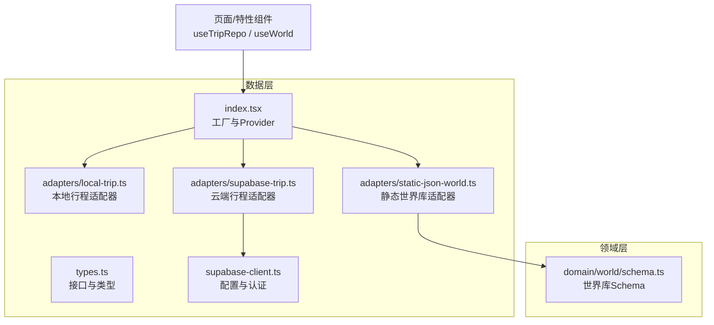
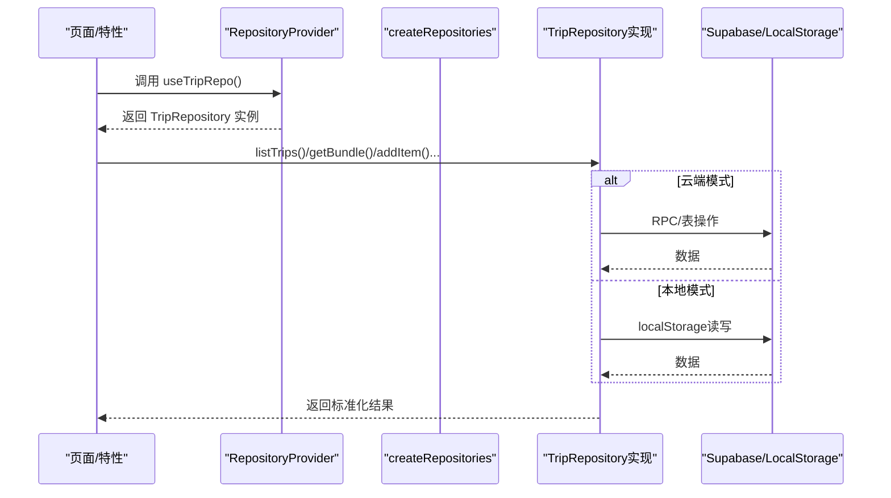
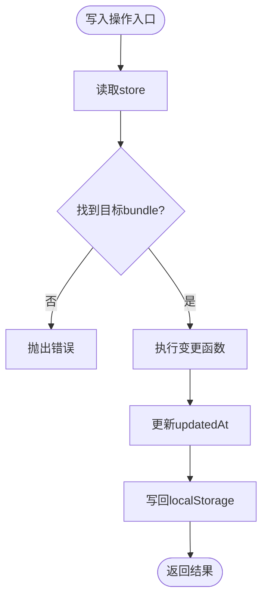
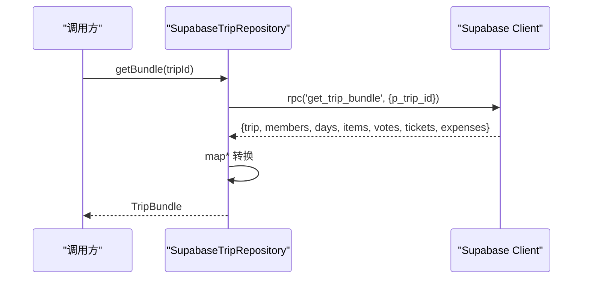
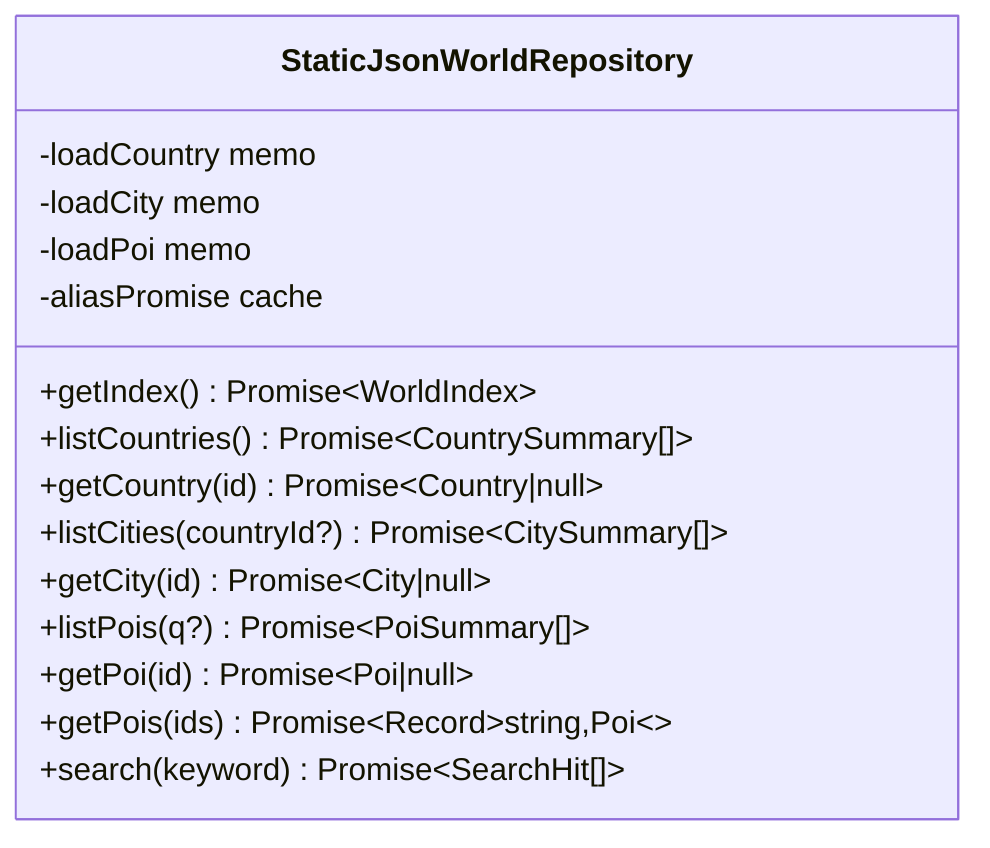
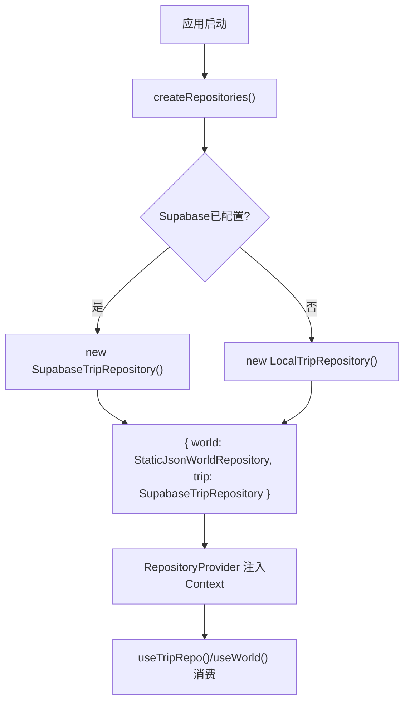
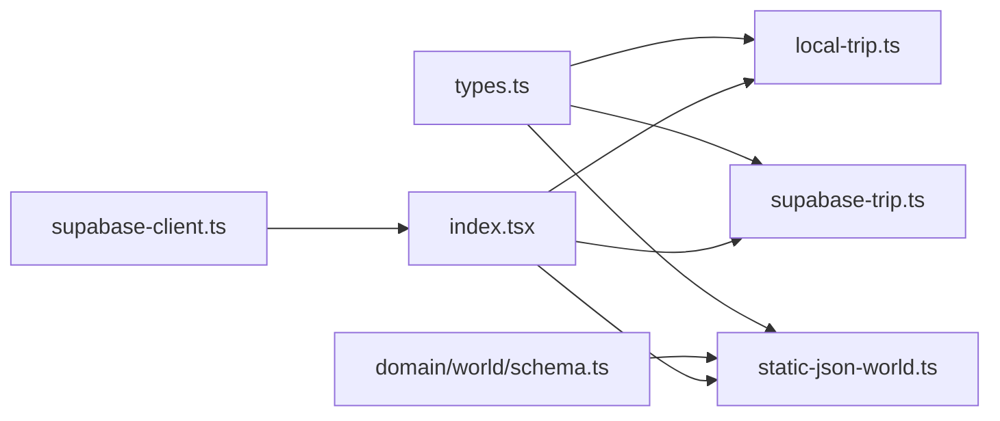

# Repository模式实现

<cite>
**本文引用的文件**
- [src/data/types.ts](file://src/data/types.ts)
- [src/data/index.tsx](file://src/data/index.tsx)
- [src/data/adapters/local-trip.ts](file://src/data/adapters/local-trip.ts)
- [src/data/adapters/supabase-trip.ts](file://src/data/adapters/supabase-trip.ts)
- [src/data/adapters/static-json-world.ts](file://src/data/adapters/static-json-world.ts)
- [src/data/supabase-client.ts](file://src/data/supabase-client.ts)
- [src/domain/world/schema.ts](file://src/domain/world/schema.ts)
</cite>

## 目录
1. [简介](#简介)
2. [项目结构](#项目结构)
3. [核心组件](#核心组件)
4. [架构总览](#架构总览)
5. [详细组件分析](#详细组件分析)
6. [依赖关系分析](#依赖关系分析)
7. [性能与可扩展性](#性能与可扩展性)
8. [故障排查指南](#故障排查指南)
9. [结论](#结论)
10. [附录：扩展新数据源适配器的步骤](#附录：扩展新数据源适配器的步骤)

## 简介
本仓库采用Repository模式对数据访问进行抽象，将“业务领域”与“具体存储后端”解耦。通过统一的接口定义（TripRepository、WorldRepository）和适配器工厂，应用可以在不同存储后端之间无缝切换：本地开发使用 localStorage，云端协作使用 Supabase；世界库默认使用静态 JSON，未来可替换为数据库或远程服务。该设计使视图层无需关心数据来源，仅依赖接口调用，从而提升可测试性与可维护性。

## 项目结构
数据访问层位于 src/data，包含类型定义、适配器实现、Supabase客户端以及React上下文注入点。世界库schema位于 domain/world，提供强类型的数据契约与校验规则。

图表来源
- [src/data/index.tsx:21-29](file://src/data/index.tsx#L21-L29)
- [src/data/adapters/local-trip.ts:67-69](file://src/data/adapters/local-trip.ts#L67-L69)
- [src/data/adapters/supabase-trip.ts:141-143](file://src/data/adapters/supabase-trip.ts#L141-L143)
- [src/data/adapters/static-json-world.ts:48-80](file://src/data/adapters/static-json-world.ts#L48-L80)
- [src/data/supabase-client.ts:22-34](file://src/data/supabase-client.ts#L22-L34)
- [src/domain/world/schema.ts:14-32](file://src/domain/world/schema.ts#L14-L32)

章节来源
- [src/data/index.tsx:1-57](file://src/data/index.tsx#L1-L57)
- [src/data/types.ts:1-300](file://src/data/types.ts#L1-L300)

## 核心组件
- TripRepository：定义行程相关的所有读写操作（创建/更新/删除行程、日程、条目、成员、投票、票据、费用等），并暴露能力标志（是否可写、是否可同步）。
- WorldRepository：定义世界库的只读查询（国家、城市、POI、索引、搜索等）。
- 适配器实现：
  - LocalTripRepository：基于localStorage的离线实现，用于开发与演示。
  - SupabaseTripRepository：基于Supabase的云端实现，支持协作、邀请、RLS权限控制。
  - StaticJsonWorldRepository：基于静态JSON的世界库实现，具备内存缓存与容错解析。
- 工厂与注入：createRepositories根据环境决定使用哪个TripRepository；通过React Context提供useTripRepo/useWorld供上层消费。

章节来源
- [src/data/types.ts:69-79](file://src/data/types.ts#L69-L79)
- [src/data/types.ts:263-299](file://src/data/types.ts#L263-L299)
- [src/data/index.tsx:21-29](file://src/data/index.tsx#L21-L29)
- [src/data/adapters/local-trip.ts:67-69](file://src/data/adapters/local-trip.ts#L67-L69)
- [src/data/adapters/supabase-trip.ts:141-143](file://src/data/adapters/supabase-trip.ts#L141-L143)
- [src/data/adapters/static-json-world.ts:48-80](file://src/data/adapters/static-json-world.ts#L48-L80)

## 架构总览
Repository模式在本项目中的体现：
- 统一接口：TripRepository与WorldRepository作为契约，屏蔽底层存储差异。
- 适配器工厂：根据环境变量判断是否配置了Supabase，动态选择云端或本地适配器。
- 能力检测：每个适配器声明capabilities（如canWrite/canSync），UI据此显示状态或禁用功能。
- 数据映射：云端适配器负责将数据库列名（snake_case）映射到领域字段（camelCase），保证接口一致性。
- 世界库只读：WorldRepository仅提供读取能力，便于构建索引与搜索。

图表来源
- [src/data/index.tsx:21-29](file://src/data/index.tsx#L21-L29)
- [src/data/adapters/supabase-trip.ts:150-157](file://src/data/adapters/supabase-trip.ts#L150-L157)
- [src/data/adapters/local-trip.ts:89-95](file://src/data/adapters/local-trip.ts#L89-L95)

## 详细组件分析

### TripRepository 接口与能力模型
- 职责：封装所有与行程相关的CRUD与协作能力（成员、邀请、投票、票据、费用）。
- 能力标志：kind标识当前适配器类型；capabilities表示是否可写、是否可同步，供UI控制编辑入口与协作提示。
- 关键方法：listTrips、getBundle、createTrip、updateTrip、deleteTrip、addDay/updateDay/removeDay、addItem/updateItem/moveItem/removeItem、addMember/removeMember、createInvite/listInvites/revokeInvite/joinTripByToken、vote、upsertTicket/removeTicket、upsertExpense/removeExpense。

章节来源
- [src/data/types.ts:263-299](file://src/data/types.ts#L263-L299)

### LocalTripRepository（本地适配器）
- 存储：使用localStorage键值存储，以bundle为单位组织行程数据（trip、members、days、items、votes、tickets、expenses）。
- 写入策略：通过mutate包装函数确保事务式更新并刷新updatedAt时间戳。
- 兼容性：读取时自动补齐缺失字段（如kind、splitMode、ownerId、assigneeId），避免旧数据导致渲染异常。
- 协作限制：邀请相关方法抛出错误，表明仅云端模式支持。

图表来源
- [src/data/adapters/local-trip.ts:71-79](file://src/data/adapters/local-trip.ts#L71-L79)
- [src/data/adapters/local-trip.ts:51-65](file://src/data/adapters/local-trip.ts#L51-L65)

章节来源
- [src/data/adapters/local-trip.ts:67-349](file://src/data/adapters/local-trip.ts#L67-L349)

### SupabaseTripRepository（云端适配器）
- 数据映射：提供mapTrip/mapMember/mapDay/mapItem/mapVote/mapTicket/mapExpense等函数，将数据库列名转换为领域对象。
- 批量获取：getBundle通过RPC一次性拉取完整bundle，减少往返次数。
- 权限控制：依赖Supabase RLS，未登录或无权限会触发FORBIDDEN错误，由上层处理。
- 协作能力：支持创建/列出/撤销邀请，以及通过token加入行程。
- 费用分摊：expense_shares先删后写，确保一致性。

图表来源
- [src/data/adapters/supabase-trip.ts:159-198](file://src/data/adapters/supabase-trip.ts#L159-L198)
- [src/data/adapters/supabase-trip.ts:35-137](file://src/data/adapters/supabase-trip.ts#L35-L137)

章节来源
- [src/data/adapters/supabase-trip.ts:141-548](file://src/data/adapters/supabase-trip.ts#L141-L548)

### StaticJsonWorldRepository（世界库适配器）
- 数据来源：从public/data下加载index.json、country/city/poi JSON及search.json、aliases.json。
- 缓存策略：对getIndex/loadCountry/loadCity/loadPoi/search进行Promise级缓存，避免重复请求。
- 容错机制：使用safeParse校验数据结构，单个POI异常不影响整体渲染。
- 搜索与过滤：支持按城市、类型、标签、关键词筛选，并按热度或名称排序。

图表来源
- [src/data/adapters/static-json-world.ts:48-167](file://src/data/adapters/static-json-world.ts#L48-L167)

章节来源
- [src/data/adapters/static-json-world.ts:1-167](file://src/data/adapters/static-json-world.ts#L1-L167)

### 工厂与注入（适配器工厂模式）
- createRepositories：根据isSupabaseConfigured决定使用SupabaseTripRepository或LocalTripRepository；world始终使用StaticJsonWorldRepository。
- RepositoryProvider：通过React Context提供repositories，支持外部传入value以便测试覆盖。
- Hooks：useTripRepo/useWorld简化消费端获取对应Repository实例。

图表来源
- [src/data/index.tsx:21-29](file://src/data/index.tsx#L21-L29)
- [src/data/supabase-client.ts:22-34](file://src/data/supabase-client.ts#L22-L34)

章节来源
- [src/data/index.tsx:1-57](file://src/data/index.tsx#L1-L57)
- [src/data/supabase-client.ts:1-106](file://src/data/supabase-client.ts#L1-L106)

## 依赖关系分析
- 类型契约：types.ts定义TripRepository与WorldRepository，所有适配器必须实现这些接口。
- 领域模型：domain/world/schema.ts提供世界库数据的强类型与校验，被StaticJsonWorldRepository使用。
- 运行时配置：supabase-client.ts提供isSupabaseConfigured与客户端单例，驱动工厂选择。
- 适配器耦合：
  - LocalTripRepository仅依赖localStorage与领域rank工具。
  - SupabaseTripRepository依赖supabase-client与SQL/RPC约定。
  - StaticJsonWorldRepository依赖静态资源路径与zod schema。

图表来源
- [src/data/types.ts:69-79](file://src/data/types.ts#L69-L79)
- [src/data/types.ts:263-299](file://src/data/types.ts#L263-L299)
- [src/domain/world/schema.ts:14-32](file://src/domain/world/schema.ts#L14-L32)
- [src/data/supabase-client.ts:22-34](file://src/data/supabase-client.ts#L22-L34)
- [src/data/index.tsx:21-29](file://src/data/index.tsx#L21-L29)

章节来源
- [src/data/types.ts:1-300](file://src/data/types.ts#L1-L300)
- [src/domain/world/schema.ts:1-317](file://src/domain/world/schema.ts#L1-L317)
- [src/data/supabase-client.ts:1-106](file://src/data/supabase-client.ts#L1-L106)
- [src/data/index.tsx:1-57](file://src/data/index.tsx#L1-L57)

## 性能与可扩展性
- 性能优化
  - 世界库静态JSON：使用memo化Promise缓存，避免重复fetch；search.json与index.json懒加载。
  - 云端bundle一次拉取：getBundle通过RPC减少多次往返，降低网络开销。
  - 本地写入原子化：mutate封装确保每次变更都刷新updatedAt并持久化。
- 可扩展性
  - 新增适配器：实现TripRepository或WorldRepository接口，并在工厂中注册。
  - 能力检测：通过capabilities控制UI行为（如禁用协作功能）。
  - 数据迁移：云端适配器负责字段映射，保持接口稳定，便于后端演进。

[本节为通用指导，不直接分析具体文件]

## 故障排查指南
- 云端模式不可用
  - 检查环境变量是否配置SUPABASE_URL与SUPABASE_ANON_KEY；若未配置，工厂将回退到本地适配器。
  - 确认已登录；RLS策略要求用户身份，否则RPC或表操作会被拒绝。
- 世界库资源缺失
  - 静态JSON需提前构建；若index.json或search.json缺失，会抛出明确错误提示。
- 数据兼容性问题
  - 本地适配器在读取时会补齐缺失字段（如kind、splitMode），若仍出现异常，检查历史数据格式。
- 协作邀请失败
  - 本地适配器不支持邀请功能，会抛出错误；需在云端模式下使用。

章节来源
- [src/data/supabase-client.ts:22-34](file://src/data/supabase-client.ts#L22-L34)
- [src/data/adapters/static-json-world.ts:21-25](file://src/data/adapters/static-json-world.ts#L21-L25)
- [src/data/adapters/local-trip.ts:283-295](file://src/data/adapters/local-trip.ts#L283-L295)

## 结论
本项目通过Repository模式实现了数据访问层的清晰分层与高度解耦。TripRepository与WorldRepository定义了稳定的接口契约，适配器工厂根据运行环境动态选择实现，使得同一套UI代码可在本地与云端无缝切换。世界库采用静态JSON并提供缓存与容错，适合只读场景。未来如需引入新的存储后端（如其他云数据库或本地SQLite），只需实现相应适配器并在工厂中注册即可。

[本节为总结性内容，不直接分析具体文件]

## 附录：扩展新数据源适配器的步骤
- 定义适配器类并实现TripRepository或WorldRepository接口。
- 在适配器中声明kind与capabilities，以告知UI其能力边界。
- 实现必要的数据映射逻辑（如将数据库字段映射到领域对象）。
- 在createRepositories中注册新适配器，可通过环境变量或配置开关进行选择。
- 编写单元测试验证适配器行为，确保与接口契约一致。

示例路径参考
- 实现TripRepository：参考 [src/data/adapters/local-trip.ts:67-349](file://src/data/adapters/local-trip.ts#L67-L349)
- 实现WorldRepository：参考 [src/data/adapters/static-json-world.ts:48-167](file://src/data/adapters/static-json-world.ts#L48-L167)
- 工厂注册：参考 [src/data/index.tsx:21-29](file://src/data/index.tsx#L21-L29)

章节来源
- [src/data/adapters/local-trip.ts:67-349](file://src/data/adapters/local-trip.ts#L67-L349)
- [src/data/adapters/static-json-world.ts:48-167](file://src/data/adapters/static-json-world.ts#L48-L167)
- [src/data/index.tsx:21-29](file://src/data/index.tsx#L21-L29)