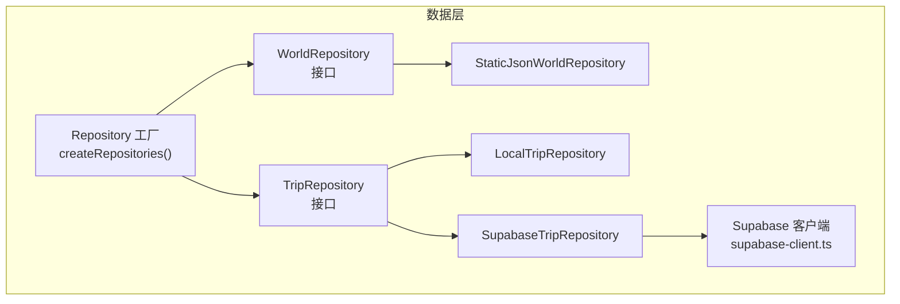
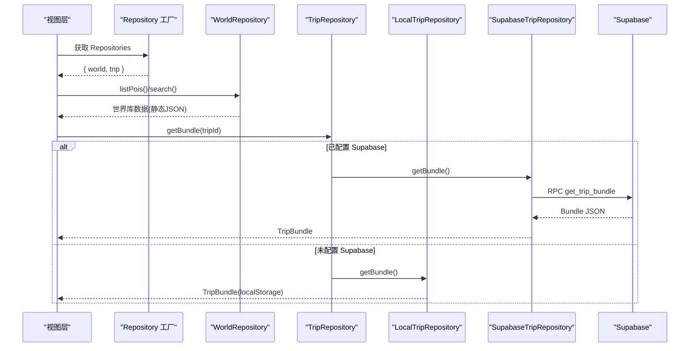
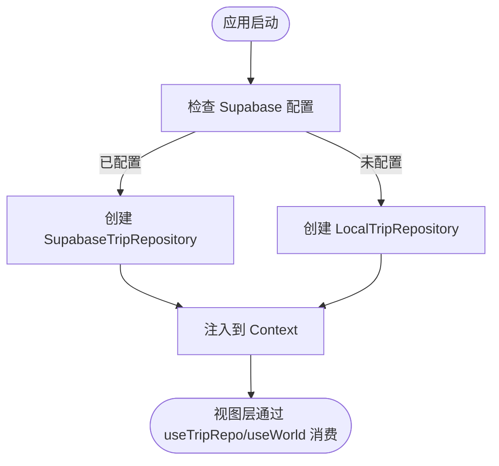
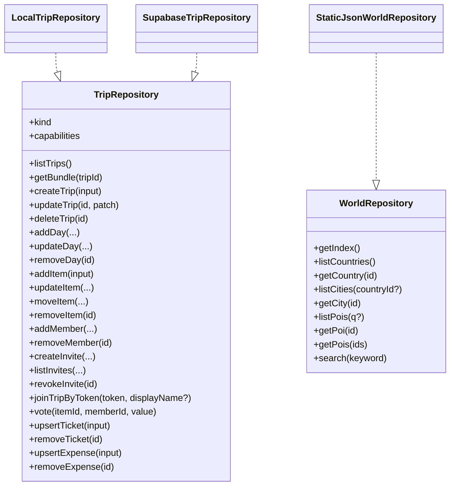
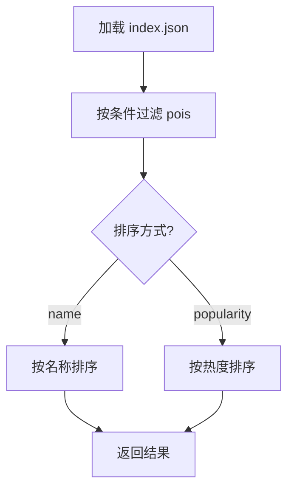
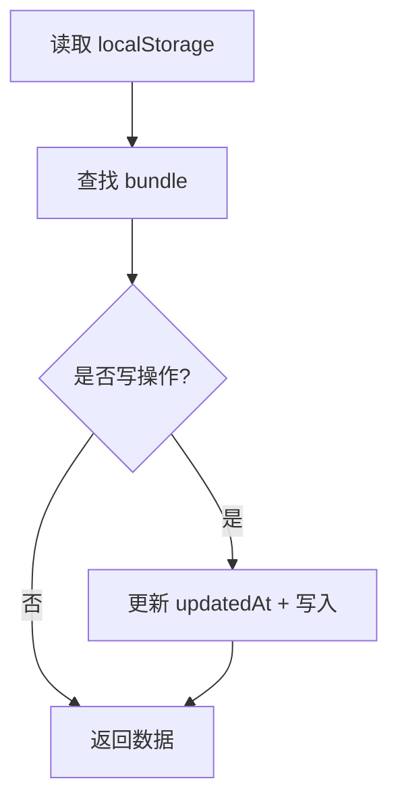
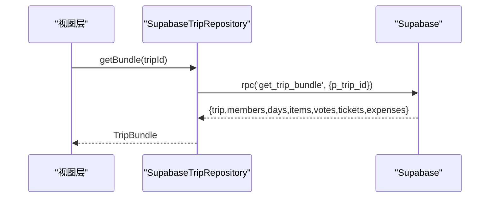
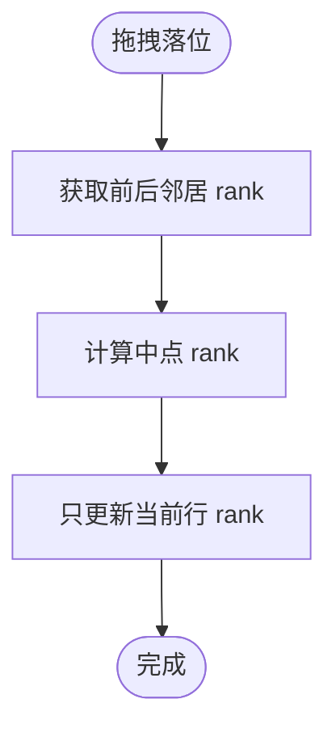
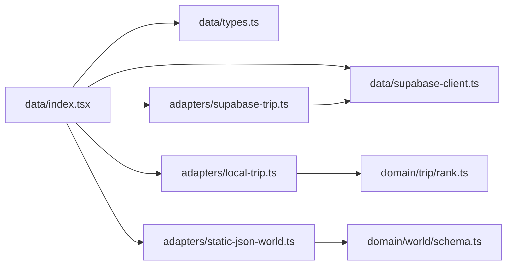

# 数据层架构

<cite>
**本文引用的文件**
- [src/data/index.tsx](file://src/data/index.tsx)
- [src/data/types.ts](file://src/data/types.ts)
- [src/data/supabase-client.ts](file://src/data/supabase-client.ts)
- [src/data/adapters/local-trip.ts](file://src/data/adapters/local-trip.ts)
- [src/data/adapters/supabase-trip.ts](file://src/data/adapters/supabase-trip.ts)
- [src/data/adapters/static-json-world.ts](file://src/data/adapters/static-json-world.ts)
- [src/domain/world/schema.ts](file://src/domain/world/schema.ts)
- [src/domain/trip/rank.ts](file://src/domain/trip/rank.ts)
- [docs/技术方案.md](file://docs/技术方案.md)
</cite>

## 目录
1. [简介](#简介)
2. [项目结构](#项目结构)
3. [核心组件](#核心组件)
4. [架构总览](#架构总览)
5. [详细组件分析](#详细组件分析)
6. [依赖关系分析](#依赖关系分析)
7. [性能考量](#性能考量)
8. [故障排查指南](#故障排查指南)
9. [结论](#结论)
10. [附录](#附录)

## 简介
本文件系统化阐述“玩无一失”的数据层架构，围绕 Repository 模式、数据适配器设计、类型系统定义与缓存策略展开。重点说明本地存储与云端存储的切换机制、数据同步策略与冲突解决算法，并给出数据模型定义、API 接口规范与错误处理机制，最后提供数据访问最佳实践与性能优化建议。

## 项目结构
数据层位于 src/data，采用“接口 + 多实现”的 Repository 模式：
- 类型与接口：src/data/types.ts
- 仓库工厂与注入：src/data/index.tsx
- 世界库适配器（静态 JSON）：src/data/adapters/static-json-world.ts
- 行程适配器（本地 localStorage）：src/data/adapters/local-trip.ts
- 行程适配器（Supabase 云端）：src/data/adapters/supabase-trip.ts
- Supabase 客户端与认证集成：src/data/supabase-client.ts
- 领域模型与校验：src/domain/world/schema.ts、src/domain/trip/rank.ts
- 总体技术决策与演进路线：docs/技术方案.md

图表来源
- [src/data/index.tsx:21-29](file://src/data/index.tsx#L21-L29)
- [src/data/adapters/static-json-world.ts:48-167](file://src/data/adapters/static-json-world.ts#L48-L167)
- [src/data/adapters/local-trip.ts:67-349](file://src/data/adapters/local-trip.ts#L67-L349)
- [src/data/adapters/supabase-trip.ts:141-548](file://src/data/adapters/supabase-trip.ts#L141-L548)
- [src/data/supabase-client.ts:17-34](file://src/data/supabase-client.ts#L17-L34)

章节来源
- [src/data/index.tsx:1-57](file://src/data/index.tsx#L1-L57)
- [src/data/types.ts:1-300](file://src/data/types.ts#L1-L300)

## 核心组件
- Repository 工厂与上下文注入：统一入口 createRepositories() 根据是否配置 Supabase 决定返回哪个 Trip 适配器；World 始终使用静态 JSON 适配器。通过 React Context 暴露 useTripRepo/useWorld 给上层消费。
- 类型系统：types.ts 集中定义 Trip/Item/Expense/Ticket/Vote/Member/Day/Invite 等数据结构与接口；world schema 用 zod 定义国家/城市/POI 的结构与约束，并在运行时 safeParse 容错。
- 世界库适配器：从 /data/*.json 读取，内存级 memo 缓存，支持索引、搜索、别名重定向与查询过滤。
- 本地行程适配器：基于 localStorage 的 TripBundle 持久化，字段与云端对齐，canSync=false，UI 显示“仅本机”。
- 云端行程适配器：通过 supabase-js 调用表与 RPC（如 get_trip_bundle），一次往返拉取全量；写操作受 RLS 约束；邀请加入走 join_trip_by_token。
- 排序与并发友好：rank.ts 实现 fractional index，拖拽只写一行，天然抗并发冲突。

章节来源
- [src/data/index.tsx:21-57](file://src/data/index.tsx#L21-L57)
- [src/data/types.ts:10-300](file://src/data/types.ts#L10-L300)
- [src/data/adapters/static-json-world.ts:21-167](file://src/data/adapters/static-json-world.ts#L21-L167)
- [src/data/adapters/local-trip.ts:28-349](file://src/data/adapters/local-trip.ts#L28-L349)
- [src/data/adapters/supabase-trip.ts:33-548](file://src/data/adapters/supabase-trip.ts#L33-L548)
- [src/domain/trip/rank.ts:1-91](file://src/domain/trip/rank.ts#L1-L91)
- [src/domain/world/schema.ts:14-317](file://src/domain/world/schema.ts#L14-L317)

## 架构总览
数据层以 Repository 为抽象边界，视图层只依赖接口，不感知后端差异。世界库当前为静态 JSON，未来可无缝切换到数据库；行程数据在开发阶段走本地存储，上线后走 Supabase。

图表来源
- [src/data/index.tsx:21-29](file://src/data/index.tsx#L21-L29)
- [src/data/adapters/static-json-world.ts:78-167](file://src/data/adapters/static-json-world.ts#L78-L167)
- [src/data/adapters/local-trip.ts:89-115](file://src/data/adapters/local-trip.ts#L89-L115)
- [src/data/adapters/supabase-trip.ts:150-198](file://src/data/adapters/supabase-trip.ts#L150-L198)

## 详细组件分析

### Repository 工厂与注入
- 职责：根据环境选择 Trip 适配器；提供 World 适配器；通过 Context 注入到应用。
- 关键点：
  - isSupabaseConfigured 决定是否使用 SupabaseTripRepository。
  - 世界库固定为 StaticJsonWorldRepository。
  - 暴露 useTripRepo/useWorld 简化消费。

图表来源
- [src/data/index.tsx:21-57](file://src/data/index.tsx#L21-L57)
- [src/data/supabase-client.ts:17-34](file://src/data/supabase-client.ts#L17-L34)

章节来源
- [src/data/index.tsx:1-57](file://src/data/index.tsx#L1-L57)
- [src/data/supabase-client.ts:17-34](file://src/data/supabase-client.ts#L17-L34)

### 类型系统与领域模型
- types.ts 定义 Trip 及其子实体（成员、日程、条目、投票、票券、账单），以及接口契约（listTrips/getBundle/createTrip/updateTrip/deleteTrip/addDay/updateDay/removeDay/addItem/updateItem/moveItem/removeItem/addMember/removeMember/createInvite/listInvites/revokeInvite/joinTripByToken/vote/upsertTicket/removeTicket/upsertExpense/removeExpense）。
- world schema 用 zod 严格校验国家/城市/POI 结构，并提供运行时 safeParse 降级能力，避免单条数据异常导致白屏。

图表来源
- [src/data/types.ts:83-300](file://src/data/types.ts#L83-L300)
- [src/data/adapters/local-trip.ts:67-349](file://src/data/adapters/local-trip.ts#L67-L349)
- [src/data/adapters/supabase-trip.ts:141-548](file://src/data/adapters/supabase-trip.ts#L141-L548)
- [src/data/adapters/static-json-world.ts:48-167](file://src/data/adapters/static-json-world.ts#L48-L167)

章节来源
- [src/data/types.ts:10-300](file://src/data/types.ts#L10-L300)
- [src/domain/world/schema.ts:14-317](file://src/domain/world/schema.ts#L14-L317)

### 世界库适配器（静态 JSON）
- 数据来源：/data/*.json（由构建脚本生成），不可变资源。
- 缓存策略：内存 Map 缓存 Promise，避免重复 fetch；index/search/alias 全局缓存。
- 查询能力：按城市、类型、标签、关键词过滤与排序；支持 POI 别名重定向。
- 容错：safeParse 失败时降级，控制台告警但不阻断渲染。

图表来源
- [src/data/adapters/static-json-world.ts:78-167](file://src/data/adapters/static-json-world.ts#L78-L167)

章节来源
- [src/data/adapters/static-json-world.ts:21-167](file://src/data/adapters/static-json-world.ts#L21-L167)

### 本地行程适配器（localStorage）
- 存储结构：bundles + order 数组，键名 wwys:trips:v1。
- 一致性：所有写操作更新 updatedAt，列表按更新时间倒序。
- 兼容性：读取时归一化旧数据（kind/images/splitMode/packing 字段补齐）。
- 能力：canWrite=true, canSync=false；协作邀请相关方法抛错提示。

图表来源
- [src/data/adapters/local-trip.ts:51-79](file://src/data/adapters/local-trip.ts#L51-L79)
- [src/data/adapters/local-trip.ts:89-115](file://src/data/adapters/local-trip.ts#L89-L115)

章节来源
- [src/data/adapters/local-trip.ts:28-349](file://src/data/adapters/local-trip.ts#L28-L349)

### 云端行程适配器（Supabase）
- 读取：getBundle 通过 RPC 一次性返回 trip/members/days/items/votes/tickets/expenses，减少往返。
- 映射：mapTrip/mapMember/mapDay/mapItem/mapVote/mapTicket/mapExpense 将 snake_case 列映射为驼峰字段。
- 写操作：逐项 update/insert，expense shares 先删后插；删除 day/item 利用外键/级联规则。
- 权限：RLS 限制读写，必须登录；非成员会返回 FORBIDDEN。
- 协作：邀请创建/列表/撤销/加入均通过表或 RPC。

图表来源
- [src/data/adapters/supabase-trip.ts:150-198](file://src/data/adapters/supabase-trip.ts#L150-L198)

章节来源
- [src/data/adapters/supabase-trip.ts:33-548](file://src/data/adapters/supabase-trip.ts#L33-L548)
- [src/data/supabase-client.ts:17-34](file://src/data/supabase-client.ts#L17-L34)

### 排序与并发友好设计（Fractional Index）
- 原理：rank 视为 base62 小数，插入时计算相邻两个 rank 的中点，只写一行，天然抗并发。
- 工具函数：initialRank/rankBetween/sequentialRanks/byRank/rankForInsert。
- 优势：拖拽落位无需批量更新，多人同时编辑不会互相覆盖。

图表来源
- [src/domain/trip/rank.ts:22-91](file://src/domain/trip/rank.ts#L22-L91)

章节来源
- [src/domain/trip/rank.ts:1-91](file://src/domain/trip/rank.ts#L1-L91)

## 依赖关系分析
- 工厂依赖 supabase-client 的配置判断来决定 Trip 适配器。
- 世界库适配器依赖 domain/world/schema 进行安全解析。
- 云端适配器依赖 supabase-js 与数据库迁移定义的表结构与 RPC。
- 本地适配器依赖 domain/trip/rank 进行排序。

图表来源
- [src/data/index.tsx:1-57](file://src/data/index.tsx#L1-L57)
- [src/data/adapters/static-json-world.ts:1-167](file://src/data/adapters/static-json-world.ts#L1-L167)
- [src/data/adapters/local-trip.ts:1-349](file://src/data/adapters/local-trip.ts#L1-L349)
- [src/data/adapters/supabase-trip.ts:1-548](file://src/data/adapters/supabase-trip.ts#L1-L548)
- [src/data/supabase-client.ts:1-106](file://src/data/supabase-client.ts#L1-L106)
- [src/domain/world/schema.ts:1-317](file://src/domain/world/schema.ts#L1-L317)
- [src/domain/trip/rank.ts:1-91](file://src/domain/trip/rank.ts#L1-L91)

章节来源
- [src/data/index.tsx:1-57](file://src/data/index.tsx#L1-L57)
- [src/data/adapters/static-json-world.ts:1-167](file://src/data/adapters/static-json-world.ts#L1-L167)
- [src/data/adapters/local-trip.ts:1-349](file://src/data/adapters/local-trip.ts#L1-L349)
- [src/data/adapters/supabase-trip.ts:1-548](file://src/data/adapters/supabase-trip.ts#L1-L548)
- [src/data/supabase-client.ts:1-106](file://src/data/supabase-client.ts#L1-L106)
- [src/domain/world/schema.ts:1-317](file://src/domain/world/schema.ts#L1-L317)
- [src/domain/trip/rank.ts:1-91](file://src/domain/trip/rank.ts#L1-L91)

## 性能考量
- 世界库缓存：对 index/search/alias 及单个资源请求做内存级 Promise 缓存，避免重复网络开销。
- 一次性加载：TripBundle 通过 RPC 一次返回全部关联数据，减少多次往返。
- 排序优化：fractional index 使拖拽排序只写一行，降低写放大。
- PWA 缓存策略：世界库 JSON 使用 StaleWhileRevalidate 缓存，提升首开速度；行程数据不走 SW 缓存，避免过期。
- 乐观更新：写操作优先更新本地缓存，失败再回滚，保证交互流畅。

章节来源
- [src/data/adapters/static-json-world.ts:21-167](file://src/data/adapters/static-json-world.ts#L21-L167)
- [src/data/adapters/supabase-trip.ts:150-198](file://src/data/adapters/supabase-trip.ts#L150-L198)
- [src/domain/trip/rank.ts:1-91](file://src/domain/trip/rank.ts#L1-L91)
- [docs/技术方案.md:407-429](file://docs/技术方案.md#L407-L429)
- [docs/技术方案.md:947-962](file://docs/技术方案.md#L947-L962)

## 故障排查指南
- Supabase 未配置或未登录：
  - 现象：useSession 返回 loading=false，无 session；创建/更新等操作抛出“未登录”或“Supabase 未配置”。
  - 处理：确保环境变量 VITE_SUPABASE_URL/VITE_SUPABASE_ANON_KEY 正确；先执行匿名或邮箱登录。
- 世界库资源缺失：
  - 现象：fetch /data/*.json 返回非 200，抛出“世界库资源缺失”。
  - 处理：运行内容构建脚本生成 /data 目录。
- 数据不一致：
  - 现象：云端更新后前端仍显示旧数据。
  - 处理：刷新 Query 缓存或使用 invalidate 触发重新获取；确认 SW 缓存策略未拦截。
- 协作邀请失败：
  - 现象：本地模式调用 createInvite/joinTripByToken 抛错。
  - 处理：切换到云端模式并登录。

章节来源
- [src/data/supabase-client.ts:71-106](file://src/data/supabase-client.ts#L71-L106)
- [src/data/adapters/static-json-world.ts:21-25](file://src/data/adapters/static-json-world.ts#L21-L25)
- [src/data/adapters/local-trip.ts:283-295](file://src/data/adapters/local-trip.ts#L283-L295)
- [docs/技术方案.md:407-429](file://docs/技术方案.md#L407-L429)

## 结论
该数据层通过 Repository 模式解耦了视图与存储实现，世界库与行程数据分别采用静态 JSON 与 Supabase 双轨方案，具备高内聚、低耦合、易扩展的特点。类型系统以 zod 为核心保障数据质量，排序算法与缓存策略兼顾性能与并发友好。配合 PWA 与离线只读快照，能在弱网环境下保持可用性与稳定性。

## 附录

### 本地与云端切换机制
- 切换依据：isSupabaseConfigured 布尔值。
- 行为差异：
  - 本地：canWrite=true, canSync=false；协作功能不可用。
  - 云端：canWrite=true, canSync=true；需登录并通过 RLS 授权。

章节来源
- [src/data/index.tsx:21-29](file://src/data/index.tsx#L21-L29)
- [src/data/adapters/local-trip.ts:67-70](file://src/data/adapters/local-trip.ts#L67-L70)
- [src/data/adapters/supabase-trip.ts:141-144](file://src/data/adapters/supabase-trip.ts#L141-L144)

### 数据同步策略与冲突解决
- 同步策略：MVP 不做 CRDT/OT，采用字段级 last-write-wins + 实体级版本提示；拖拽排序天然抗并发。
- 冲突提示：当更新影响行数为 0（被他人修改）时，前端提示并重新加载 bundle。
- 离线策略：有网导出离线包；无网进入只读模式，禁用编辑入口。

章节来源
- [docs/技术方案.md:422-429](file://docs/技术方案.md#L422-L429)
- [docs/技术方案.md:963-976](file://docs/技术方案.md#L963-L976)

### API 接口规范（TripRepository）
- 读取：listTrips/getBundle/getPois/search
- 写入：createTrip/updateTrip/deleteTrip/addDay/updateDay/removeDay/addItem/updateItem/moveItem/removeItem/addMember/removeMember/vote/upsertTicket/removeTicket/upsertExpense/removeExpense
- 协作：createInvite/listInvites/revokeInvite/joinTripByToken（仅云端）

章节来源
- [src/data/types.ts:263-300](file://src/data/types.ts#L263-L300)

### 错误处理机制
- 世界库：safeParse 失败降级，控制台告警。
- 云端：RLS 拒绝返回 FORBIDDEN；未登录抛错；外键约束错误（如移除成员）转换为业务提示。
- 本地：不存在行程或成员时抛错；协作功能抛错提示。

章节来源
- [src/data/adapters/static-json-world.ts:67-76](file://src/data/adapters/static-json-world.ts#L67-L76)
- [src/data/adapters/supabase-trip.ts:160-166](file://src/data/adapters/supabase-trip.ts#L160-L166)
- [src/data/adapters/supabase-trip.ts:355-364](file://src/data/adapters/supabase-trip.ts#L355-L364)
- [src/data/adapters/local-trip.ts:71-87](file://src/data/adapters/local-trip.ts#L71-L87)

### 最佳实践与性能优化建议
- 使用 Repository 接口屏蔽存储细节，便于替换与测试。
- 世界库资源尽量复用缓存，避免重复 fetch。
- 复杂页面使用一次性 Bundle 加载，减少往返。
- 拖拽排序使用 fractional index，避免批量更新。
- 写操作采用乐观更新，失败回滚并提示。
- 离线场景导出快照，确保行前可用性。

章节来源
- [src/data/adapters/static-json-world.ts:21-167](file://src/data/adapters/static-json-world.ts#L21-L167)
- [src/data/adapters/supabase-trip.ts:150-198](file://src/data/adapters/supabase-trip.ts#L150-L198)
- [src/domain/trip/rank.ts:1-91](file://src/domain/trip/rank.ts#L1-L91)
- [docs/技术方案.md:407-429](file://docs/技术方案.md#L407-L429)
- [docs/技术方案.md:947-976](file://docs/技术方案.md#L947-L976)