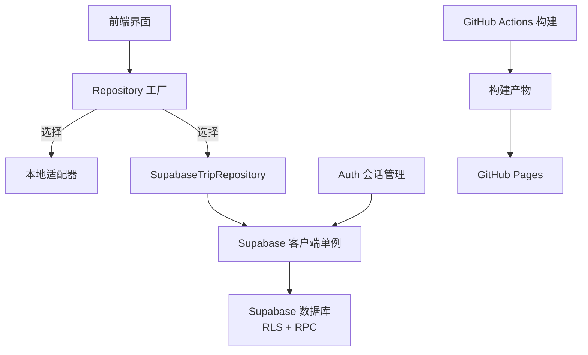
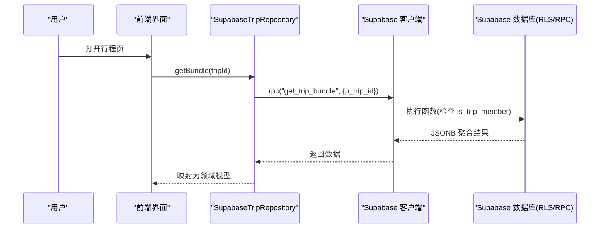
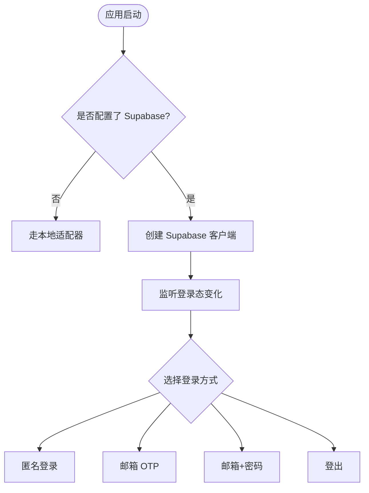
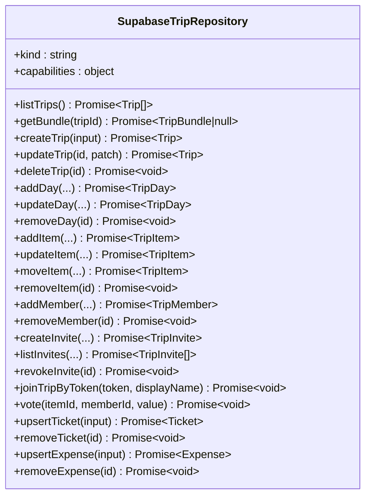
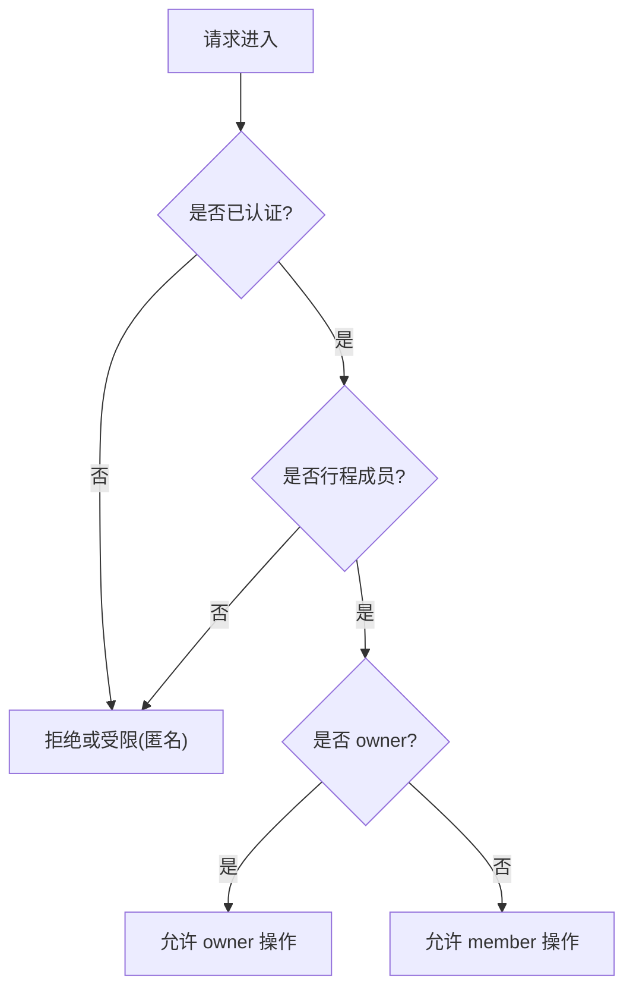
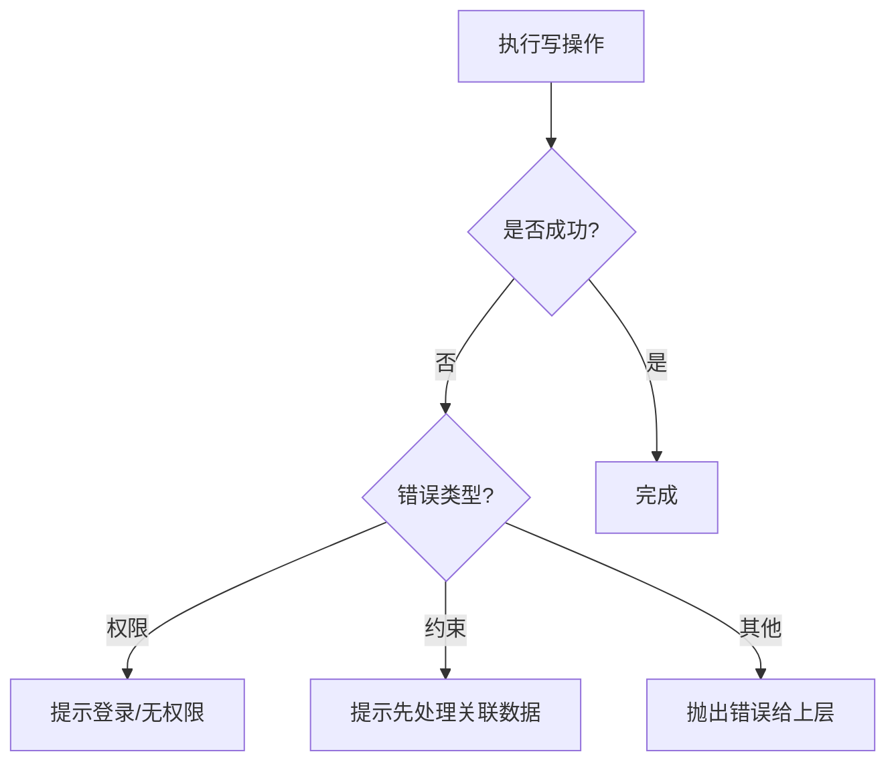
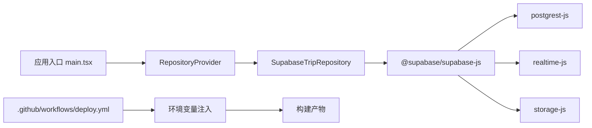

# Supabase云端适配器

<cite>
**本文引用的文件**
- [src/data/supabase-client.ts](file://src/data/supabase-client.ts)
- [src/data/adapters/supabase-trip.ts](file://src/data/adapters/supabase-trip.ts)
- [supabase/migrations/0001_init.sql](file://supabase/migrations/0001_init.sql)
- [supabase/migrations/0002_trip_items_custom.sql](file://supabase/migrations/0002_trip_items_custom.sql)
- [scripts/verify-supabase.cjs](file://scripts/verify-supabase.cjs)
- [src/features/auth/AuthQuerySync.tsx](file://src/features/auth/AuthQuerySync.tsx)
- [src/app/main.tsx](file://src/app/main.tsx)
- [.github/workflows/deploy.yml](file://.github/workflows/deploy.yml)
- [docs/技术方案.md](file://docs/技术方案.md)
</cite>

## 目录
1. [简介](#简介)
2. [项目结构](#项目结构)
3. [核心组件](#核心组件)
4. [架构总览](#架构总览)
5. [详细组件分析](#详细组件分析)
6. [依赖关系分析](#依赖关系分析)
7. [性能与优化](#性能与优化)
8. [故障排查指南](#故障排查指南)
9. [结论](#结论)
10. [附录：部署与环境配置](#附录部署与环境配置)

## 简介
本文件面向“Supabase云端适配器”的实现与使用，围绕以下目标展开：
- 客户端配置、数据库连接管理与认证集成
- 行级安全策略（RLS）、权限控制与数据隔离
- 批量操作优化、查询性能调优与错误重试机制
- 云端部署配置、环境变量设置与监控告警建议

该适配器通过统一的 Repository 接口对接 Supabase，使前端在本地与云端之间无缝切换；同时利用服务端 RPC 聚合读取，减少网络往返，并通过 RLS 保证多用户协作时的数据安全。

## 项目结构
与 Supabase 云端适配相关的关键位置如下：
- 客户端与认证：src/data/supabase-client.ts
- 云端适配器实现：src/data/adapters/supabase-trip.ts
- 数据库结构与权限：supabase/migrations/*.sql
- 端到端验证脚本：scripts/verify-supabase.cjs
- 登录态与查询缓存同步：src/features/auth/AuthQuerySync.tsx
- 应用启动与全局重试策略：src/app/main.tsx
- CI/CD 与构建环境注入：.github/workflows/deploy.yml
- 环境与部署说明：docs/技术方案.md

图表来源
- [src/data/adapters/supabase-trip.ts:141-148](file://src/data/adapters/supabase-trip.ts#L141-L148)
- [src/data/supabase-client.ts:24-34](file://src/data/supabase-client.ts#L24-L34)
- [.github/workflows/deploy.yml:19-41](file://.github/workflows/deploy.yml#L19-L41)

章节来源
- [src/data/supabase-client.ts:1-106](file://src/data/supabase-client.ts#L1-L106)
- [src/data/adapters/supabase-trip.ts:1-548](file://src/data/adapters/supabase-trip.ts#L1-L548)
- [supabase/migrations/0001_init.sql:1-530](file://supabase/migrations/0001_init.sql#L1-L530)
- [supabase/migrations/0002_trip_items_custom.sql:1-75](file://supabase/migrations/0002_trip_items_custom.sql#L1-L75)
- [scripts/verify-supabase.cjs:1-56](file://scripts/verify-supabase.cjs#L1-L56)
- [src/features/auth/AuthQuerySync.tsx:1-26](file://src/features/auth/AuthQuerySync.tsx#L1-L26)
- [src/app/main.tsx:12-20](file://src/app/main.tsx#L12-L20)
- [.github/workflows/deploy.yml:1-51](file://.github/workflows/deploy.yml#L1-L51)
- [docs/技术方案.md:1079-1127](file://docs/技术方案.md#L1079-L1127)

## 核心组件
- Supabase 客户端单例与认证集成：提供 createClient 实例、会话监听、匿名/邮箱登录/登出等能力，并决定何时启用云端模式。
- SupabaseTripRepository：实现 TripRepository 的云端版本，封装所有对 trips、trip_days、trip_items、item_votes、tickets、expenses、expense_shares 等的读写，以及邀请加入、RPC 调用等。
- 数据库迁移与 RLS：定义表结构、索引、触发器、RLS 策略和 RPC，确保数据访问的安全性与一致性。
- 端到端验证脚本：模拟真实流程（匿名登录→创建行程→读取 bundle→清理），用于快速验证后端配置是否正确。

章节来源
- [src/data/supabase-client.ts:14-106](file://src/data/supabase-client.ts#L14-L106)
- [src/data/adapters/supabase-trip.ts:141-524](file://src/data/adapters/supabase-trip.ts#L141-L524)
- [supabase/migrations/0001_init.sql:25-530](file://supabase/migrations/0001_init.sql#L25-L530)
- [scripts/verify-supabase.cjs:22-54](file://scripts/verify-supabase.cjs#L22-L54)

## 架构总览
整体数据流从前端发起请求，经 Repository 层路由到 Supabase 客户端，最终由数据库执行 RLS 校验与业务逻辑（含 RPC）。关键路径包括：
- 列表与详情：listTrips → trips 表；getBundle → get_trip_bundle RPC
- 写操作：create/update/delete 各实体均受 RLS 约束
- 协作与邀请：join_trip_by_token 将成员加入行程
- 分享与克隆：get_share / clone_trip_from_share 支持匿名读取与跟随

图表来源
- [src/data/adapters/supabase-trip.ts:159-198](file://src/data/adapters/supabase-trip.ts#L159-L198)
- [supabase/migrations/0001_init.sql:393-429](file://supabase/migrations/0001_init.sql#L393-L429)

章节来源
- [src/data/adapters/supabase-trip.ts:150-198](file://src/data/adapters/supabase-trip.ts#L150-L198)
- [supabase/migrations/0001_init.sql:393-429](file://supabase/migrations/0001_init.sql#L393-L429)

## 详细组件分析

### 客户端配置与认证集成
- 环境变量：VITE_SUPABASE_URL、VITE_SUPABASE_ANON_KEY
- 客户端初始化：createClient 开启持久化与会话自动刷新，关闭 URL 会话检测以避免 HashRouter 冲突
- 会话监听：useSession hook 订阅 auth 状态变化，未配置时直接返回未登录
- 登录方式：匿名登录、邮箱 OTP、邮箱+密码注册/登录、登出

图表来源
- [src/data/supabase-client.ts:17-34](file://src/data/supabase-client.ts#L17-L34)
- [src/data/supabase-client.ts:45-69](file://src/data/supabase-client.ts#L45-L69)
- [src/data/supabase-client.ts:71-105](file://src/data/supabase-client.ts#L71-L105)

章节来源
- [src/data/supabase-client.ts:17-105](file://src/data/supabase-client.ts#L17-L105)

### 数据库连接管理与批量读取
- 列表读取：listTrips 按 updated_at 倒序获取行程
- 批量读取：getBundle 通过 RPC 一次性聚合 trip、members、days、items、votes、tickets、expenses、expenseShares、transports、accommodations、myNotes，避免多次往返
- 字段映射：mapTrip/mapMember/mapDay/mapItem/mapVote/mapTicket/mapExpense 将 snake_case 列名转换为 camelCase 领域模型

图表来源
- [src/data/adapters/supabase-trip.ts:141-524](file://src/data/adapters/supabase-trip.ts#L141-L524)

章节来源
- [src/data/adapters/supabase-trip.ts:150-198](file://src/data/adapters/supabase-trip.ts#L150-L198)
- [src/data/adapters/supabase-trip.ts:200-524](file://src/data/adapters/supabase-trip.ts#L200-L524)

### 行级安全策略（RLS）与权限控制
- 角色与函数：is_trip_member、is_trip_owner 作为 SECURITY DEFINER 函数，避免 RLS 递归问题
- 表级 RLS：profiles、trips、trip_members、trip_days、trip_items、item_votes、tickets、expenses、expense_shares、transports、accommodations、personal_notes、trip_invites、shares 全部启用 RLS
- 策略要点：
  - profiles：仅本人读写
  - trips：成员可读，owner 可增删改
  - trip_members：成员可读，owner 可增删改（加入走 RPC）
  - 子表统一模板：基于 is_trip_member 控制读写
  - personal_notes：仅本人且必须是行程成员
  - trip_invites：成员可读可建，匿名不可读（加入走 RPC）
  - shares：仅 owner 管理，匿名读取通过 get_share RPC

图表来源
- [supabase/migrations/0001_init.sql:288-386](file://supabase/migrations/0001_init.sql#L288-L386)

章节来源
- [supabase/migrations/0001_init.sql:288-386](file://supabase/migrations/0001_init.sql#L288-L386)

### 实时同步机制
- 当前实现以“按需拉取 + React Query 缓存失效”为主：登录态变化时主动失效 ['trip'] 分组，强制重拉
- 注释指出真正的实时性由 Supabase Realtime 在后续阶段接管；当前未在前端显式建立 realtime 订阅
- 如需增强实时性，可在 Repository 层引入 supabase.channel 订阅变更事件，并结合 react-query 增量更新

章节来源
- [src/app/main.tsx:12-20](file://src/app/main.tsx#L12-L20)
- [src/features/auth/AuthQuerySync.tsx:1-26](file://src/features/auth/AuthQuerySync.tsx#L1-L26)

### 批量操作优化与查询性能
- 批量读取：get_trip_bundle 一次 RPC 聚合多表数据，显著减少往返次数
- 索引优化：
  - trips(owner_id)、trip_days(trip_id)、trip_items(trip_id, day_id, rank)、item_votes(trip_id)、tickets(trip_id)、expenses(trip_id)、expense_shares(trip_id)
  - 交通条目 kind 索引（迁移 0002）
- 写操作最小化：updateItem/upsertTicket/upsertExpense 仅提交必要字段，减少冗余传输

章节来源
- [supabase/migrations/0001_init.sql:65-190](file://supabase/migrations/0001_init.sql#L65-L190)
- [supabase/migrations/0002_trip_items_custom.sql:69-70](file://supabase/migrations/0002_trip_items_custom.sql#L69-L70)
- [src/data/adapters/supabase-trip.ts:159-198](file://src/data/adapters/supabase-trip.ts#L159-L198)

### 错误处理与重试机制
- 客户端错误：adapter 中大多数写操作在 error 时直接抛出，交由上层 UI 提示
- 权限错误：getBundle 中对 FORBIDDEN 进行识别，提示登录
- 外键约束：removeMember 捕获 23503 错误码，提示先处理账目再移除
- 全局重试：react-query 默认 retry=1，refetchOnWindowFocus=false，避免频繁重拉导致抖动

图表来源
- [src/data/adapters/supabase-trip.ts:160-166](file://src/data/adapters/supabase-trip.ts#L160-L166)
- [src/data/adapters/supabase-trip.ts:355-364](file://src/data/adapters/supabase-trip.ts#L355-L364)
- [src/app/main.tsx:16-19](file://src/app/main.tsx#L16-L19)

章节来源
- [src/data/adapters/supabase-trip.ts:160-166](file://src/data/adapters/supabase-trip.ts#L160-L166)
- [src/data/adapters/supabase-trip.ts:355-364](file://src/data/adapters/supabase-trip.ts#L355-L364)
- [src/app/main.tsx:16-19](file://src/app/main.tsx#L16-L19)

### 协作邀请与数据隔离
- 邀请机制：trip_invites 存储 token、过期时间、最大使用次数；join_trip_by_token 幂等加入，支持认领幽灵成员
- 数据隔离：personal_notes 仅本人可见；shares 匿名读取通过 get_share 精确匹配 slug，防止枚举
- 影子成员：trip_members.user_id 可为 null，代表幽灵成员，仍可参与投票与记账

章节来源
- [supabase/migrations/0001_init.sql:247-267](file://supabase/migrations/0001_init.sql#L247-L267)
- [supabase/migrations/0001_init.sql:371-386](file://supabase/migrations/0001_init.sql#L371-L386)
- [supabase/migrations/0001_init.sql:431-474](file://supabase/migrations/0001_init.sql#L431-L474)
- [src/data/adapters/supabase-trip.ts:366-413](file://src/data/adapters/supabase-trip.ts#L366-L413)

## 依赖关系分析
- 前端依赖：@supabase/supabase-js（包含 postgrest-js、realtime-js、storage-js）
- 运行时依赖：React Query（缓存与失效）、React Router（HashRouter）
- 构建与部署：Vite 构建、GitHub Actions 注入环境变量并发布到 GitHub Pages

图表来源
- [package-lock.json:1361-1388](file://package-lock.json#L1361-L1388)
- [.github/workflows/deploy.yml:22-26](file://.github/workflows/deploy.yml#L22-L26)

章节来源
- [package-lock.json:1361-1388](file://package-lock.json#L1361-L1388)
- [.github/workflows/deploy.yml:22-26](file://.github/workflows/deploy.yml#L22-L26)

## 性能与优化
- 批量读取：优先使用 get_trip_bundle 减少往返
- 索引覆盖：充分利用 trip_items(day_id, rank)、trip_items(kind) 等索引
- 写操作精简：只提交变更字段，避免全量更新
- 缓存策略：关闭窗口聚焦重取，降低闪动；登录态变化时主动失效相关查询
- 免费档保活：定时调用 ping RPC 保持项目活跃

章节来源
- [src/data/adapters/supabase-trip.ts:159-198](file://src/data/adapters/supabase-trip.ts#L159-L198)
- [supabase/migrations/0001_init.sql:127-128](file://supabase/migrations/0001_init.sql#L127-L128)
- [supabase/migrations/0002_trip_items_custom.sql:69-70](file://supabase/migrations/0002_trip_items_custom.sql#L69-L70)
- [src/app/main.tsx:16-19](file://src/app/main.tsx#L16-L19)
- [supabase/migrations/0001_init.sql:522-525](file://supabase/migrations/0001_init.sql#L522-L525)

## 故障排查指南
- 无法读取或写入：确认已登录（RLS 基于 auth.uid()），未登录会被拒绝
- 权限错误：检查 is_trip_member/is_trip_owner 判定是否符合预期
- 外键约束失败：如 removeMember 报错 23503，需先处理关联账目
- 邀请无效：检查 token 是否过期、使用次数是否达到上限
- 分享不可见：确认 slug 精确匹配且未被撤销

章节来源
- [src/data/supabase-client.ts:71-105](file://src/data/supabase-client.ts#L71-L105)
- [supabase/migrations/0001_init.sql:288-386](file://supabase/migrations/0001_init.sql#L288-L386)
- [src/data/adapters/supabase-trip.ts:355-364](file://src/data/adapters/supabase-trip.ts#L355-L364)
- [supabase/migrations/0001_init.sql:431-474](file://supabase/migrations/0001_init.sql#L431-L474)

## 结论
该 Supabase 云端适配器通过清晰的职责划分与严格的 RLS 策略，实现了安全的多用户协作与高效的数据访问。借助 RPC 批量读取与合理的索引设计，显著降低了网络开销与查询延迟。结合 React Query 的缓存与失效策略，保证了用户体验的一致性。未来可进一步增强实时同步能力，以满足更高频的协作场景。

## 附录：部署与环境配置
- 环境变量：
  - VITE_SUPABASE_URL：Supabase 项目地址
  - VITE_SUPABASE_ANON_KEY：匿名密钥（前端公开，安全性由 RLS 保障）
  - VITE_APP_ENV：开发/生产环境标识
- CI/CD：
  - GitHub Actions 在构建时将环境变量注入，生成静态站点并发布至 GitHub Pages
- 免费档运维：
  - 定期调用 ping RPC 保活
  - 建议增加定时备份任务导出关键表为 JSON

章节来源
- [docs/技术方案.md:1079-1127](file://docs/技术方案.md#L1079-L1127)
- [.github/workflows/deploy.yml:22-26](file://.github/workflows/deploy.yml#L22-L26)
- [supabase/migrations/0001_init.sql:522-525](file://supabase/migrations/0001_init.sql#L522-L525)