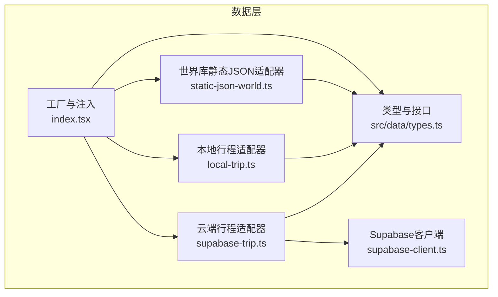
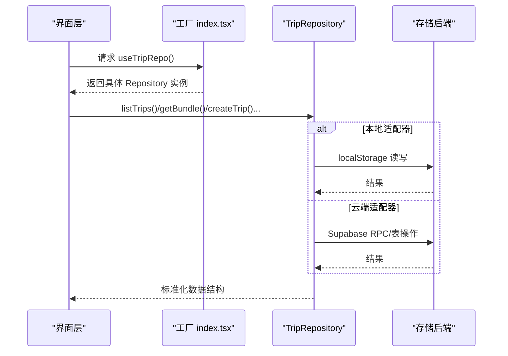
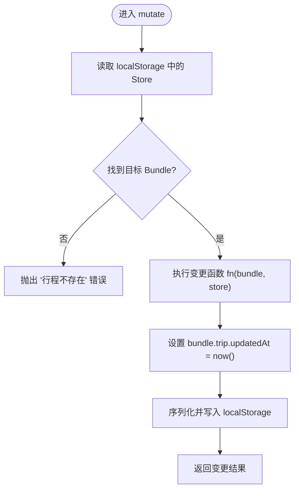
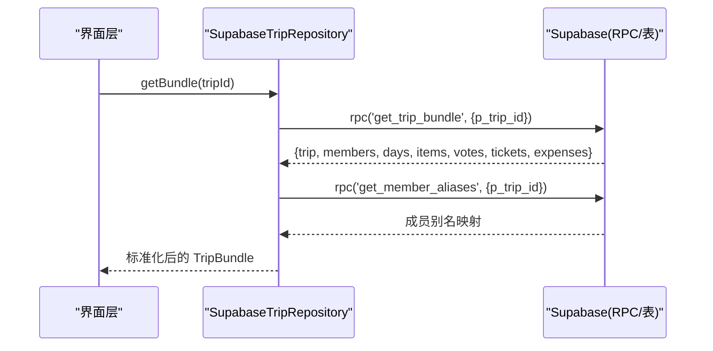
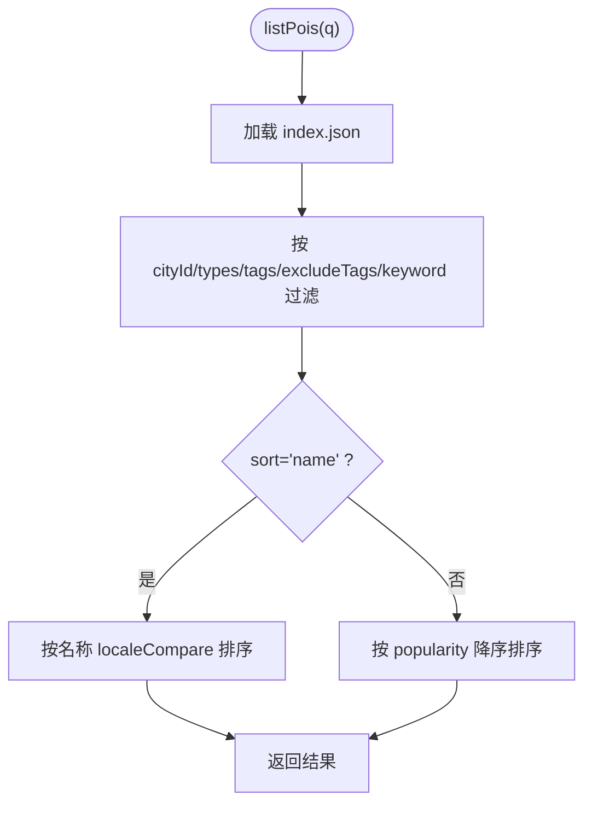
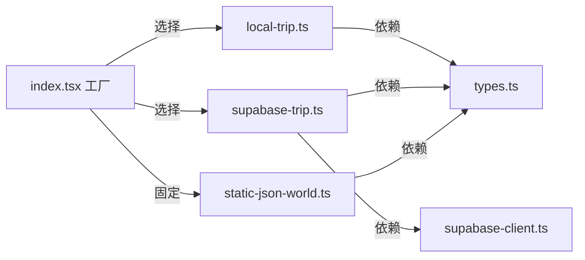

# 数据适配器

<cite>
**本文引用的文件**
- [src/data/adapters/local-trip.ts](file://src/data/adapters/local-trip.ts)
- [src/data/adapters/supabase-trip.ts](file://src/data/adapters/supabase-trip.ts)
- [src/data/adapters/static-json-world.ts](file://src/data/adapters/static-json-world.ts)
- [src/data/types.ts](file://src/data/types.ts)
- [src/data/index.tsx](file://src/data/index.tsx)
- [src/data/supabase-client.ts](file://src/data/supabase-client.ts)
</cite>

## 目录
1. [简介](#简介)
2. [项目结构](#项目结构)
3. [核心组件](#核心组件)
4. [架构总览](#架构总览)
5. [详细组件分析](#详细组件分析)
6. [依赖关系分析](#依赖关系分析)
7. [性能考量](#性能考量)
8. [故障排查指南](#故障排查指南)
9. [结论](#结论)
10. [附录：自定义适配器开发指南](#附录自定义适配器开发指南)

## 简介
本仓库采用“适配器（Repository）”模式抽象数据访问层，将上层 UI 与具体存储后端解耦。当前实现了三类适配器：
- 本地存储适配器：基于浏览器 localStorage，用于无云端凭据时的开发与演示。
- Supabase 云端适配器：基于 Supabase 数据库、RPC 与 RLS，提供协作、邀请、投票、账单等能力。
- 静态 JSON 世界库适配器：从构建产物中读取不可变的世界知识（国家/城市/POI），用于景点检索与详情展示。

通过统一的接口定义与工厂注入，视图层对底层存储完全无感知，可无缝切换或扩展新的存储后端。

## 项目结构
数据适配器的关键位置与职责如下：
- 类型与接口定义：src/data/types.ts
- 适配器实现：
  - 行程本地存储：src/data/adapters/local-trip.ts
  - 行程云端存储：src/data/adapters/supabase-trip.ts
  - 世界库静态 JSON：src/data/adapters/static-json-world.ts
- 工厂与注入：src/data/index.tsx
- Supabase 客户端与登录态：src/data/supabase-client.ts

图表来源
- [src/data/index.tsx:21-28](file://src/data/index.tsx#L21-L28)
- [src/data/types.ts:263-299](file://src/data/types.ts#L263-L299)
- [src/data/adapters/local-trip.ts:67-79](file://src/data/adapters/local-trip.ts#L67-L79)
- [src/data/adapters/supabase-trip.ts:141-148](file://src/data/adapters/supabase-trip.ts#L141-L148)
- [src/data/adapters/static-json-world.ts:48-81](file://src/data/adapters/static-json-world.ts#L48-L81)
- [src/data/supabase-client.ts:17-34](file://src/data/supabase-client.ts#L17-L34)

章节来源
- [src/data/index.tsx:1-56](file://src/data/index.tsx#L1-L56)
- [src/data/types.ts:1-300](file://src/data/types.ts#L1-L300)

## 核心组件
- TripRepository 接口：统一描述行程相关的所有读写操作（创建/更新/删除行程、日程、条目、成员、投票、票据、账单等），并声明 capabilities（是否可写、是否可同步）。
- WorldRepository 接口：统一描述世界库的查询与搜索能力（国家/城市/POI 列表与详情、索引、关键词搜索）。
- 工厂 createRepositories：根据环境配置选择具体的 TripRepository 实现；WorldRepository 固定为静态 JSON 实现。
- Supabase 客户端：提供 isSupabaseConfigured、登录态监听与认证方法，驱动云端适配器的启用与权限控制。

章节来源
- [src/data/types.ts:69-79](file://src/data/types.ts#L69-L79)
- [src/data/types.ts:263-299](file://src/data/types.ts#L263-L299)
- [src/data/index.tsx:21-28](file://src/data/index.tsx#L21-L28)
- [src/data/supabase-client.ts:17-34](file://src/data/supabase-client.ts#L17-L34)

## 架构总览
适配器模式将业务逻辑与数据源解耦。工厂在运行时决定使用哪个实现；所有调用方仅依赖接口，从而支持：
- 本地开发时走 localStorage，无需网络与账号。
- 生产环境走 Supabase，开启协作、邀请、投票与多端同步。
- 世界库始终走静态 JSON，保证离线可用与快速加载。

图表来源
- [src/data/index.tsx:21-28](file://src/data/index.tsx#L21-L28)
- [src/data/adapters/local-trip.ts:51-65](file://src/data/adapters/local-trip.ts#L51-L65)
- [src/data/adapters/supabase-trip.ts:150-157](file://src/data/adapters/supabase-trip.ts#L150-L157)

## 详细组件分析

### 本地存储适配器（LocalTripRepository）
- 数据存储策略
  - 以键值形式持久化到 localStorage，键名为固定字符串，内部维护 bundles 字典与 order 数组，按更新时间倒序排列。
  - 写入前进行基础校验与归一化（如补齐 kind、splitMode、ownerId/assigneeId 等字段），确保历史数据兼容。
- 性能特点
  - 纯内存+磁盘读写，无网络开销；适合单机演示与开发调试。
  - 每次写操作都会序列化整个 store 并落盘，数据量较大时可能影响性能。
- 功能限制
  - canSync = false，不暴露协作邀请、加入行程等云端特性；这些方法会抛出错误提示。
  - 不支持图片附件上传（images 字段保留但为空数组）。
- 适用场景
  - 未配置 Supabase 的环境；克隆代码即可运行；演示工作流与交互。
- 关键流程示例
  - 添加条目：计算排序 rank，默认标题兜底，写入 items 并更新 updatedAt。
  - 删除日程：将属于该日程的条目退回候选池（dayId 置空），避免误删用户积累的点。
  - 移除成员：若存在关联账目记录则拒绝删除，保障数据一致性。

图表来源
- [src/data/adapters/local-trip.ts:71-79](file://src/data/adapters/local-trip.ts#L71-L79)
- [src/data/adapters/local-trip.ts:51-65](file://src/data/adapters/local-trip.ts#L51-L65)

章节来源
- [src/data/adapters/local-trip.ts:1-349](file://src/data/adapters/local-trip.ts#L1-L349)

### Supabase 云端适配器（SupabaseTripRepository）
- 数据存储策略
  - 与数据库迁移严格对齐，camelCase 与 snake_case 之间通过映射函数转换。
  - 读路径优先使用 RPC get_trip_bundle 一次性拉取全量数据，减少往返次数。
  - 写路径直接操作对应表，利用外键约束与级联规则保持数据一致。
- 性能特点
  - 通过批量聚合读取降低网络延迟影响；写操作遵循 RLS 安全策略。
  - 费用分摊（expense_shares）采用“先删后插”的方式维护，非原子但受 RLS 保护。
- 功能限制
  - 必须已登录才能写（RLS 基于 auth.uid()）；未登录会触发权限错误。
  - 协作邀请、加入行程等能力仅在云端可用。
- 适用场景
  - 多人协作、跨设备同步、需要邀请与权限控制的场景。
- 关键流程示例
  - 获取行程包：调用 RPC 并合并成员别名，失败时降级处理。
  - 新增条目：查询同日程最后一条的 rank，计算新条目排序，插入 trip_items。
  - 删除日程：直接删除 trip_days，trip_items.day_id 因 on delete set null 自动退回候选池。
  - 删除成员：捕获外键冲突错误码，提示先处理账目再移除。

图表来源
- [src/data/adapters/supabase-trip.ts:159-198](file://src/data/adapters/supabase-trip.ts#L159-L198)
- [src/data/adapters/supabase-trip.ts:171-179](file://src/data/adapters/supabase-trip.ts#L171-L179)

章节来源
- [src/data/adapters/supabase-trip.ts:1-548](file://src/data/adapters/supabase-trip.ts#L1-L548)
- [src/data/supabase-client.ts:1-106](file://src/data/supabase-client.ts#L1-L106)

### 静态 JSON 世界库适配器（StaticJsonWorldRepository）
- 数据存储策略
  - 数据由脚本从 content/ 编译到 public/data/，包含 index.json、search.json、aliases.json 以及各 country/city/poi 的 JSON。
  - 全部为不可变资源，首次加载后通过 Promise 缓存（memo）避免重复 fetch。
  - 使用 schema 校验（zod）解析数据，异常时降级为“卡片打不开”，不影响整体应用。
- 性能特点
  - 纯静态资源，CDN/浏览器缓存友好；索引与搜索预构建，前端过滤与排序开销低。
  - 批量获取 getPois(ids) 使用 Promise.all 并发请求，提升吞吐。
- 功能限制
  - 只读，不提供写操作；别名重定向用于兼容旧 id。
- 适用场景
  - 默认 M1–M5 的世界知识展示；离线可用；快速检索 POI/城市。
- 关键流程示例
  - 列表查询：基于 index.json 的 pois 进行 cityId、types、tags、excludeTags、keyword 过滤与排序。
  - 详情获取：优先直链 poi/{id}.json，失败则查 aliases.json 重定向。
  - 搜索：加载 search.json 并按关键词匹配，返回最多 20 条命中。

图表来源
- [src/data/adapters/static-json-world.ts:100-127](file://src/data/adapters/static-json-world.ts#L100-L127)

章节来源
- [src/data/adapters/static-json-world.ts:1-167](file://src/data/adapters/static-json-world.ts#L1-L167)

## 依赖关系分析
- 工厂依赖
  - 通过 isSupabaseConfigured 判断是否启用云端适配器；否则回退到本地适配器。
  - WorldRepository 固定为 StaticJsonWorldRepository。
- 类型依赖
  - 所有适配器均依赖 types.ts 中的接口与数据结构，确保前后端/不同存储间的数据契约一致。
- 运行时依赖
  - 云端适配器依赖 supabase-client 提供的客户端与认证能力。
  - 世界库适配器依赖构建产出的静态 JSON 资源。

图表来源
- [src/data/index.tsx:21-28](file://src/data/index.tsx#L21-L28)
- [src/data/supabase-client.ts:17-34](file://src/data/supabase-client.ts#L17-L34)
- [src/data/types.ts:263-299](file://src/data/types.ts#L263-L299)

章节来源
- [src/data/index.tsx:1-56](file://src/data/index.tsx#L1-L56)
- [src/data/supabase-client.ts:1-106](file://src/data/supabase-client.ts#L1-L106)
- [src/data/types.ts:1-300](file://src/data/types.ts#L1-L300)

## 性能考量
- 本地适配器
  - 优点：零网络延迟，交互响应快。
  - 风险：localStorage 容量有限（通常约 5MB），大量条目可能导致序列化/反序列化开销增大。
- 云端适配器
  - 优点：可扩展、可协作、可跨设备同步。
  - 优化：使用 RPC 聚合读取减少往返；写操作受 RLS 保护，避免额外校验逻辑。
- 世界库适配器
  - 优点：静态资源缓存友好，首屏加载快；索引与搜索预构建，前端过滤成本低。
  - 优化：Promise 缓存避免重复 fetch；并发获取多个 POI 提升吞吐。

[本节为通用性能讨论，不直接分析具体文件]

## 故障排查指南
- 本地适配器
  - 常见错误：localStorage 读取失败或格式损坏时，会回退到空 store，不会中断应用。
  - 协作邀请相关方法会抛错，提示需切换到云端模式。
- 云端适配器
  - 未登录：创建行程等方法会抛错，需先完成登录。
  - 权限不足：RPC 返回 FORBIDDEN 时，提示登录或检查成员身份。
  - 外键约束：删除成员时若存在关联账目记录，会抛出特定错误码，需先处理账目。
- 世界库适配器
  - 资源缺失：当 index.json 或 POI JSON 缺失时，会抛出明确错误，提示先执行构建脚本。
  - 结构异常：POI 数据不符合 schema 时，降级为“卡片打不开”，并在控制台输出简要问题。

章节来源
- [src/data/adapters/local-trip.ts:283-295](file://src/data/adapters/local-trip.ts#L283-L295)
- [src/data/adapters/supabase-trip.ts:200-218](file://src/data/adapters/supabase-trip.ts#L200-L218)
- [src/data/adapters/supabase-trip.ts:355-364](file://src/data/adapters/supabase-trip.ts#L355-L364)
- [src/data/adapters/static-json-world.ts:21-25](file://src/data/adapters/static-json-world.ts#L21-L25)
- [src/data/adapters/static-json-world.ts:67-76](file://src/data/adapters/static-json-world.ts#L67-L76)

## 结论
本项目通过清晰的 Repository 接口与工厂注入机制，实现了本地、云端与静态世界库三种适配器的统一抽象。开发者可在不改动上层业务的前提下，灵活切换或扩展新的存储后端。本地适配器便于开发与演示，云端适配器提供协作与同步能力，世界库适配器提供稳定高效的静态内容服务。

[本节为总结性内容，不直接分析具体文件]

## 附录：自定义适配器开发指南
- 目标
  - 为新存储后端实现一个适配器，使其能无缝替换现有实现，且不影响上层 UI。
- 步骤
  1. 确定适配器类型
     - 若为行程数据：实现 TripRepository 接口（参考 src/data/types.ts:263-299）。
     - 若为世界库数据：实现 WorldRepository 接口（参考 src/data/types.ts:69-79）。
  2. 设计数据模型映射
     - 将后端数据结构转换为接口定义的类型（如 camelCase/snake_case 转换、枚举映射、时间格式统一）。
  3. 实现核心方法
     - 读：尽量聚合查询以减少往返（参考云端适配器的 getBundle 思路）。
     - 写：遵循幂等性与一致性要求，必要时使用事务或“先删后插”策略。
  4. 错误处理
     - 区分网络错误、权限错误、数据约束错误，向上抛出明确信息以便上层提示。
  5. 注册到工厂
     - 在 src/data/index.tsx 的 createRepositories 中添加条件分支，根据环境变量或运行时状态选择新适配器。
  6. 测试与验证
     - 单元测试覆盖关键路径；E2E 验证端到端流程；性能测试评估读写延迟与吞吐。
- 注意事项
  - 保持 capabilities 语义正确（canWrite/canSync），让 UI 据此禁用编辑入口或显示协作状态。
  - 对于世界库适配器，建议提供索引与搜索预构建，以提升查询性能。
  - 对于云端适配器，注意 RLS 策略与权限模型，确保写操作具备必要的安全上下文。

章节来源
- [src/data/types.ts:69-79](file://src/data/types.ts#L69-L79)
- [src/data/types.ts:263-299](file://src/data/types.ts#L263-L299)
- [src/data/index.tsx:21-28](file://src/data/index.tsx#L21-L28)