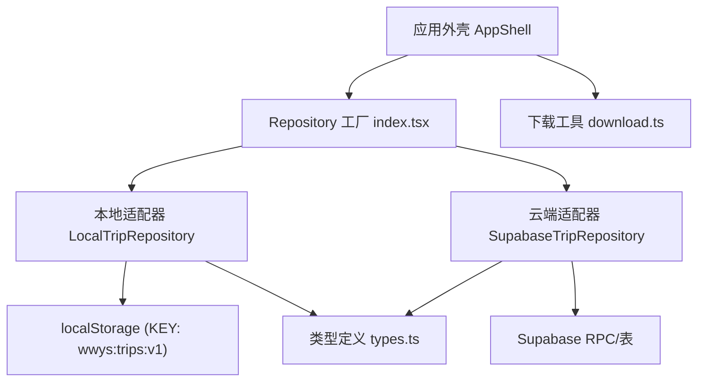
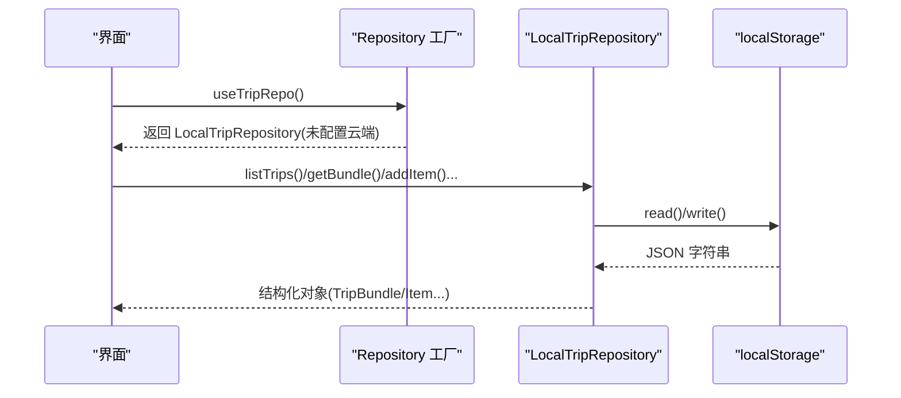
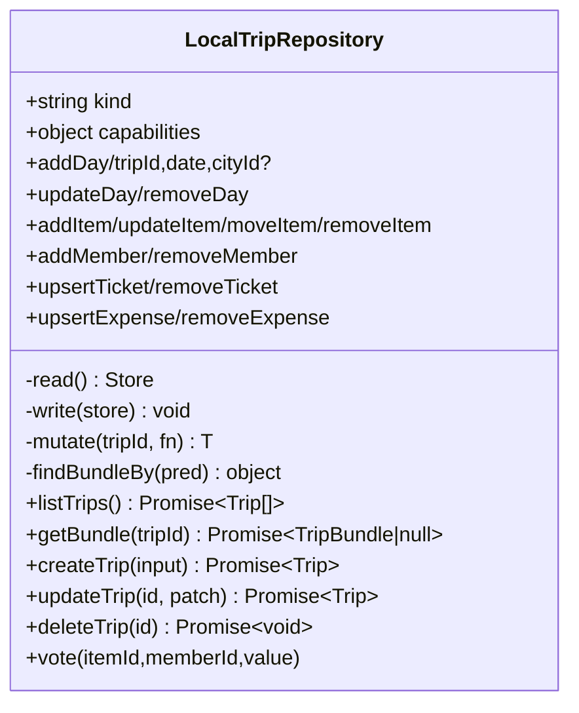
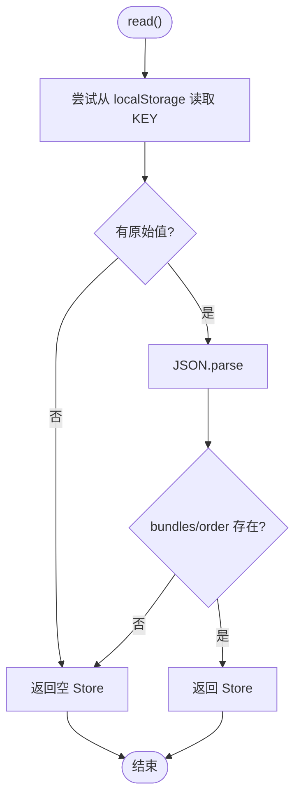
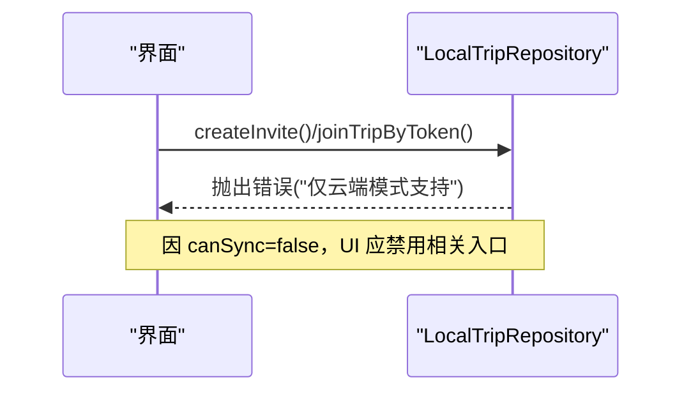
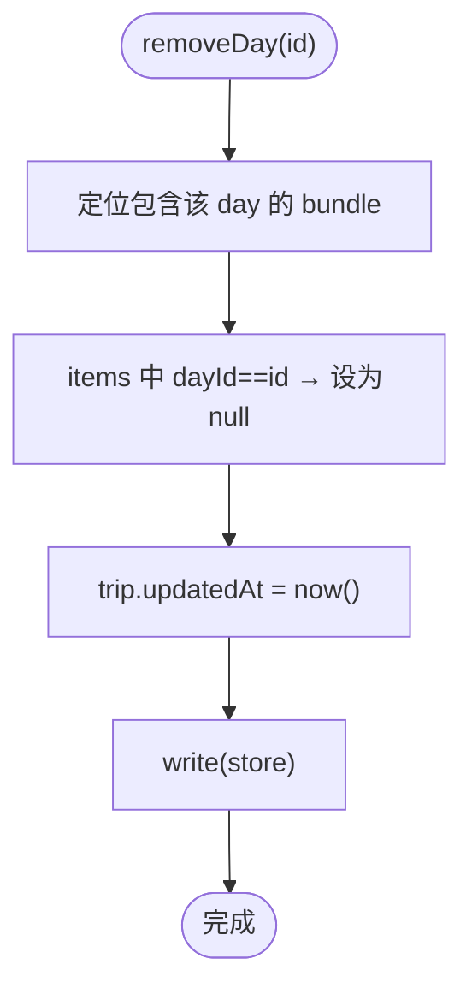
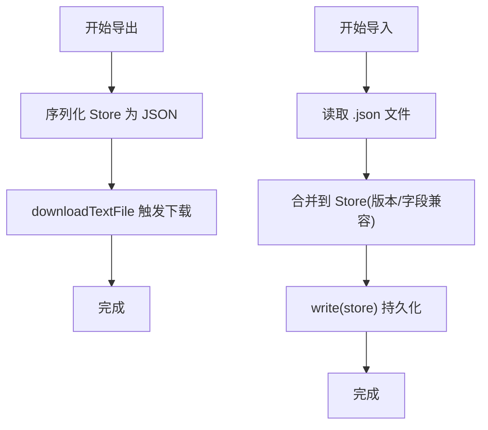
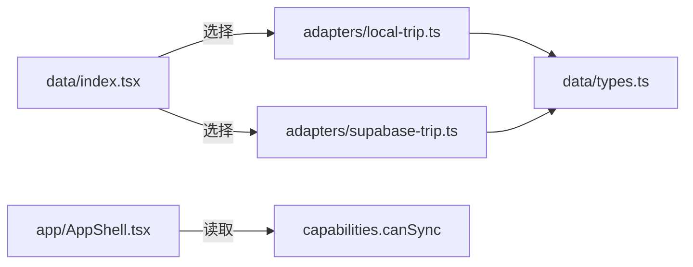

# 本地存储适配器

<cite>
**本文引用的文件**
- [src/data/adapters/local-trip.ts](file://src/data/adapters/local-trip.ts)
- [src/data/types.ts](file://src/data/types.ts)
- [src/data/index.tsx](file://src/data/index.tsx)
- [src/data/adapters/supabase-trip.ts](file://src/data/adapters/supabase-trip.ts)
- [src/app/AppShell.tsx](file://src/app/AppShell.tsx)
- [src/utils/download.ts](file://src/utils/download.ts)
- [docs/技术方案.md](file://docs/技术方案.md)
</cite>

## 目录
1. [简介](#简介)
2. [项目结构](#项目结构)
3. [核心组件](#核心组件)
4. [架构总览](#架构总览)
5. [详细组件分析](#详细组件分析)
6. [依赖关系分析](#依赖关系分析)
7. [性能与空间管理](#性能与空间管理)
8. [故障排查指南](#故障排查指南)
9. [结论](#结论)
10. [附录：最佳实践清单](#附录最佳实践清单)

## 简介
本文件聚焦“本地存储适配器”，即基于浏览器 localStorage 的行程数据持久化实现。它在不配置云端凭据时作为开发与演示的数据源，提供完整的增删改查、日程/条目/成员/投票/票券/账单等能力；同时通过统一的 Repository 接口与云端适配器互换，使 UI 层无需感知后端差异。文档将深入说明：
- localStorage 的使用方式与数据序列化策略
- 离线模式下的数据持久化、同步能力边界与冲突处理
- 本地数据的导入导出、备份恢复思路与存储空间管理
- 本地存储的最佳实践与性能优化建议

## 项目结构
围绕本地存储适配器的关键位置如下：
- 数据仓库工厂：根据是否配置云端来决定使用本地或云端适配器
- 本地适配器：封装 localStorage 读写、数据结构归一化、事务式写入
- 类型定义：统一 Trip/TripBundle/Item/Expense 等模型，确保本地与云端一致
- 应用外壳：展示“仅本机”或“云端同步”状态，驱动 UI 行为
- 工具函数：下载文本文件（可用于导出）

图表来源
- [src/data/index.tsx:21-29](file://src/data/index.tsx#L21-L29)
- [src/data/adapters/local-trip.ts:28-79](file://src/data/adapters/local-trip.ts#L28-L79)
- [src/data/adapters/supabase-trip.ts:141-198](file://src/data/adapters/supabase-trip.ts#L141-L198)
- [src/data/types.ts:230-299](file://src/data/types.ts#L230-L299)
- [src/app/AppShell.tsx:15-24](file://src/app/AppShell.tsx#L15-L24)
- [src/utils/download.ts:5-19](file://src/utils/download.ts#L5-L19)

章节来源
- [src/data/index.tsx:1-57](file://src/data/index.tsx#L1-L57)
- [src/data/adapters/local-trip.ts:1-349](file://src/data/adapters/local-trip.ts#L1-L349)
- [src/data/types.ts:1-300](file://src/data/types.ts#L1-L300)
- [src/app/AppShell.tsx:1-27](file://src/app/AppShell.tsx#L1-L27)
- [src/utils/download.ts:1-31](file://src/utils/download.ts#L1-L31)

## 核心组件
- LocalTripRepository：实现 TripRepository 接口的本地版本，所有写操作通过 mutate 包装，保证 updated_at 更新与持久化；读路径支持旧数据归一化（补齐 kind/images/splitMode 等字段）。
- Store 结构：以 bundles（按 tripId 索引）+ order（列表顺序）组织数据，JSON 序列化后存入 localStorage。
- 工厂 createRepositories：当未配置 Supabase 时自动选择 LocalTripRepository，UI 通过 capabilities.canSync 显示“仅本机”。
- 类型契约：Trip/TripBundle/Item/Expense 等类型在 types.ts 中统一定义，确保本地与云端一致。

章节来源
- [src/data/adapters/local-trip.ts:28-115](file://src/data/adapters/local-trip.ts#L28-L115)
- [src/data/index.tsx:21-29](file://src/data/index.tsx#L21-L29)
- [src/data/types.ts:113-239](file://src/data/types.ts#L113-L239)

## 架构总览
本地适配器通过统一的 TripRepository 接口暴露能力，上层业务不关心数据来自 localStorage 还是 Supabase。本地模式下 canSync=false，UI 会禁用协作相关入口并提示“仅本机”。

图表来源
- [src/data/index.tsx:21-29](file://src/data/index.tsx#L21-L29)
- [src/data/adapters/local-trip.ts:51-79](file://src/data/adapters/local-trip.ts#L51-L79)

## 详细组件分析

### 本地适配器类与能力
- 能力声明：kind='local'，capabilities={canWrite:true, canSync:false}，用于 UI 控制编辑与协作入口。
- 写入封装：mutate(tripId, fn) 读取 store → 执行变更 → 更新 updatedAt → 写回 localStorage。
- 跨实体查找：findBundleBy(pred) 用于 item/ticket/expense 等全局唯一 id 的反向定位。

图表来源
- [src/data/adapters/local-trip.ts:67-349](file://src/data/adapters/local-trip.ts#L67-L349)

章节来源
- [src/data/adapters/local-trip.ts:67-349](file://src/data/adapters/local-trip.ts#L67-L349)

### 数据模型与序列化
- Store：bundles 为 Record<tripId, TripBundle>，order 维护列表顺序。
- 序列化：read/write 对 Store 进行 JSON.parse/stringify，异常时降级为空 Store，避免白屏。
- 归一化：getBundle 中对历史数据进行兼容补齐（如 items.kind/images、expenses.splitMode、packing.ownerId/assigneeId），确保渲染稳定。

图表来源
- [src/data/adapters/local-trip.ts:51-65](file://src/data/adapters/local-trip.ts#L51-L65)

章节来源
- [src/data/adapters/local-trip.ts:51-115](file://src/data/adapters/local-trip.ts#L51-L115)
- [src/data/types.ts:230-239](file://src/data/types.ts#L230-L239)

### 离线模式与同步边界
- 本地模式 canSync=false，UI 显示“仅本机”，协作邀请/加入行程等方法直接抛错或返回空结果，避免误用。
- 云端模式由 SupabaseTripRepository 提供，具备 canSync=true，支持邀请、加入、RLS 权限校验等。

图表来源
- [src/data/adapters/local-trip.ts:283-295](file://src/data/adapters/local-trip.ts#L283-L295)
- [src/data/adapters/supabase-trip.ts:366-413](file://src/data/adapters/supabase-trip.ts#L366-L413)
- [src/app/AppShell.tsx:15-24](file://src/app/AppShell.tsx#L15-L24)

章节来源
- [src/data/adapters/local-trip.ts:283-295](file://src/data/adapters/local-trip.ts#L283-L295)
- [src/data/adapters/supabase-trip.ts:366-413](file://src/data/adapters/supabase-trip.ts#L366-L413)
- [src/app/AppShell.tsx:15-24](file://src/app/AppShell.tsx#L15-L24)

### 数据一致性、删除与级联
- 删除日程 removeDay：将该日程下条目退回候选池（dayId=null），避免误删用户积累的点。
- 删除条目 removeItem：清理 votes 并将关联 ticket.itemId 置空，保持引用完整。
- 删除成员 removeMember：若该成员已有账本记录则拒绝删除，需先处理账务。

图表来源
- [src/data/adapters/local-trip.ts:189-196](file://src/data/adapters/local-trip.ts#L189-L196)

章节来源
- [src/data/adapters/local-trip.ts:189-196](file://src/data/adapters/local-trip.ts#L189-L196)
- [src/data/adapters/local-trip.ts:246-253](file://src/data/adapters/local-trip.ts#L246-L253)
- [src/data/adapters/local-trip.ts:271-281](file://src/data/adapters/local-trip.ts#L271-L281)

### 数据导入导出、备份恢复与空间管理
- 导出：可使用通用下载工具将任意文本内容生成文件（例如导出当前本地快照 JSON），便于备份与迁移。
- 导入：可将导出的 JSON 文件解析后合并到本地 Store（注意版本号与字段兼容性），再 write 持久化。
- 空间管理：localStorage 容量有限（通常约 5MB），应避免存储大对象；图片附件 URL 仅在云端模式使用，本地模式保留字段但不会上传。
- 离线包：技术方案定义了“离线只读快照”流程，行前可导出 bundle 与引用的世界库数据至 IndexedDB 并提供下载；行中无网时切换为只读模式。

图表来源
- [src/utils/download.ts:5-19](file://src/utils/download.ts#L5-L19)
- [src/data/adapters/local-trip.ts:51-65](file://src/data/adapters/local-trip.ts#L51-L65)
- [docs/技术方案.md:963-976](file://docs/技术方案.md#L963-L976)

章节来源
- [src/utils/download.ts:1-31](file://src/utils/download.ts#L1-L31)
- [src/data/adapters/local-trip.ts:51-65](file://src/data/adapters/local-trip.ts#L51-L65)
- [docs/技术方案.md:963-976](file://docs/技术方案.md#L963-L976)

## 依赖关系分析
- 工厂依赖：index.tsx 根据 isSupabaseConfigured 决定实例化 LocalTripRepository 或 SupabaseTripRepository。
- 类型依赖：两个适配器均依赖 types.ts 中的 Trip/TripBundle/Item/Expense 等类型，保证契约一致。
- UI 依赖：AppShell 通过 capabilities.canSync 显示存储状态，影响交互。

图表来源
- [src/data/index.tsx:21-29](file://src/data/index.tsx#L21-L29)
- [src/data/adapters/local-trip.ts:67-69](file://src/data/adapters/local-trip.ts#L67-L69)
- [src/data/adapters/supabase-trip.ts:141-143](file://src/data/adapters/supabase-trip.ts#L141-L143)
- [src/app/AppShell.tsx:15-24](file://src/app/AppShell.tsx#L15-L24)

章节来源
- [src/data/index.tsx:1-57](file://src/data/index.tsx#L1-L57)
- [src/data/adapters/local-trip.ts:67-69](file://src/data/adapters/local-trip.ts#L67-L69)
- [src/data/adapters/supabase-trip.ts:141-143](file://src/data/adapters/supabase-trip.ts#L141-L143)
- [src/app/AppShell.tsx:15-24](file://src/app/AppShell.tsx#L15-L24)

## 性能与空间管理
- 批量读取：getBundle 一次性返回 TripBundle，减少多次往返（本地为内存对象，云端通过 RPC 一次拉取）。
- 写入原子性：mutate 封装了“读→改→写”过程，避免并发导致的脏写（单线程浏览器环境）。
- 排序与索引：列表按 updatedAt 倒序，日常查询 O(n)；如需频繁检索可考虑在 Store 上建立额外索引（谨慎评估体积）。
- 序列化开销：每次写都会 JSON.stringify 整个 Store，数据量大时可能卡顿；建议拆分键或使用分片存储（如 trips:v1/items、trips:v1/days）。
- 空间限制：localStorage 容量有限，避免存储大对象；图片仅存 URL，不在本地存储二进制。
- 降级策略：read 捕获异常返回空 Store，保障可用性。

[本节为通用指导，不直接分析具体文件]

## 故障排查指南
- 无法创建行程/添加条目：检查传入参数是否符合约束（如交通/备注需要 customTitle），参考 addItem 默认标题逻辑。
- 删除成员失败：若该成员已有账本记录，需先处理账务再删除。
- 协作功能不可用：本地模式不支持邀请/加入，需切换到云端模式。
- 数据丢失/损坏：read 异常会降级为空 Store，可通过导入备份恢复。
- 性能问题：大量条目导致写入卡顿，考虑拆分存储键或减少单次写体量。

章节来源
- [src/data/adapters/local-trip.ts:198-231](file://src/data/adapters/local-trip.ts#L198-L231)
- [src/data/adapters/local-trip.ts:271-281](file://src/data/adapters/local-trip.ts#L271-L281)
- [src/data/adapters/local-trip.ts:283-295](file://src/data/adapters/local-trip.ts#L283-L295)
- [src/data/adapters/local-trip.ts:51-65](file://src/data/adapters/local-trip.ts#L51-L65)

## 结论
本地存储适配器以简洁可靠的 localStorage 方案实现了完整的行程管理能力，并通过统一的 Repository 接口与云端适配器无缝替换。其优势在于开发体验友好、离线可用、零依赖；局限在于不具备多端同步与协作能力。结合导出/导入与离线快照机制，可在旅行场景提供稳健的本地优先体验。

[本节为总结，不直接分析具体文件]

## 附录：最佳实践清单
- 始终通过 Repository 访问数据，不要直接操作 localStorage，以便未来切换后端。
- 写操作尽量合并，减少 write 次数；必要时拆分 Store 键以降低序列化成本。
- 对历史数据做归一化处理（如 kind/images/splitMode），避免 UI 多处兜底。
- 删除操作遵循级联规则（日程→条目退回候选池；条目→votes/clean 引用）。
- 导出定期备份，导入时做好版本与字段兼容校验。
- 图片附件仅在云端模式使用，本地模式只保存 URL，避免占用本地空间。
- 利用 capabilities.canSync 控制 UI 行为，避免误导用户以为已同步。

[本节为通用指导，不直接分析具体文件]