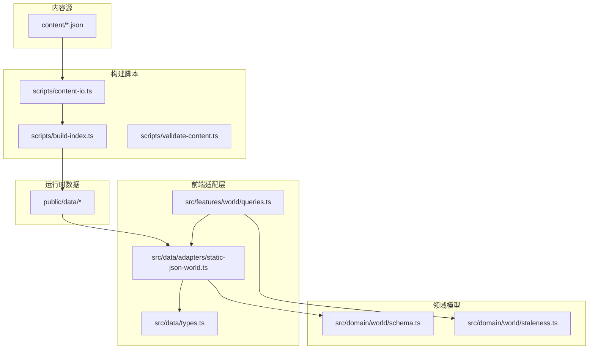
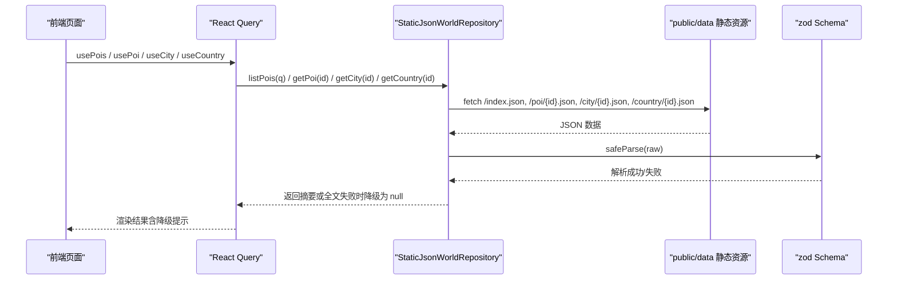
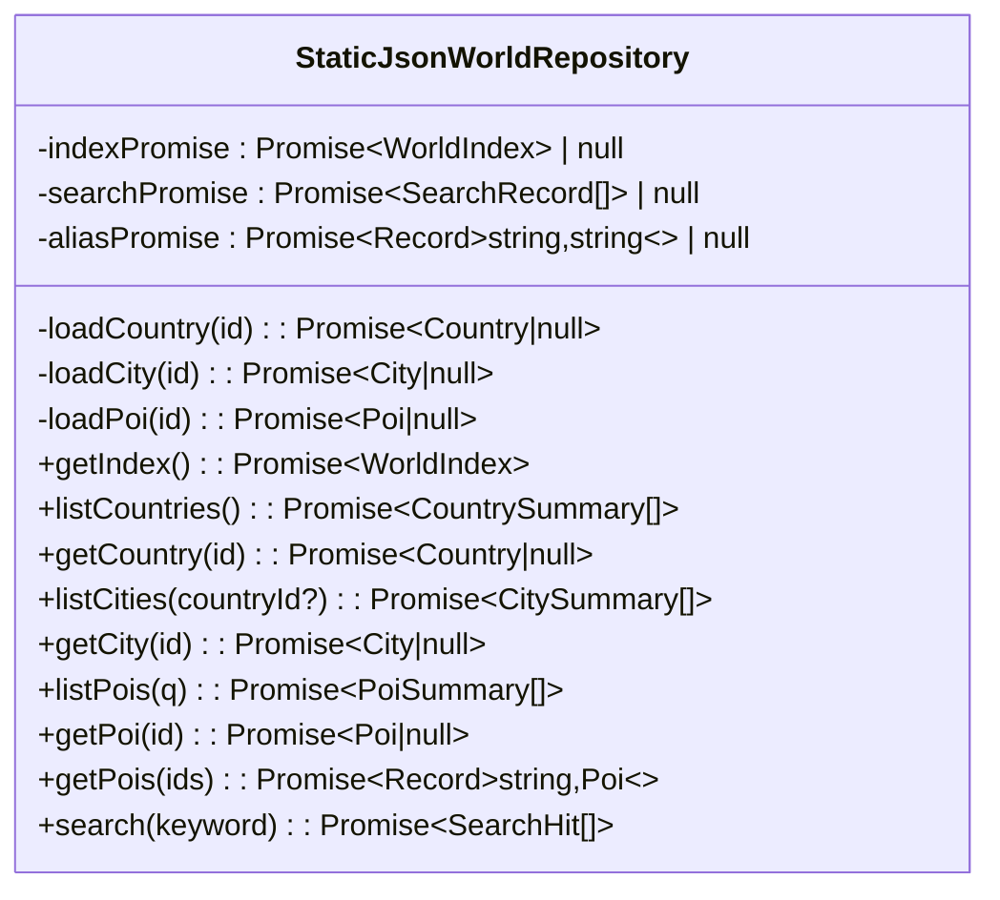
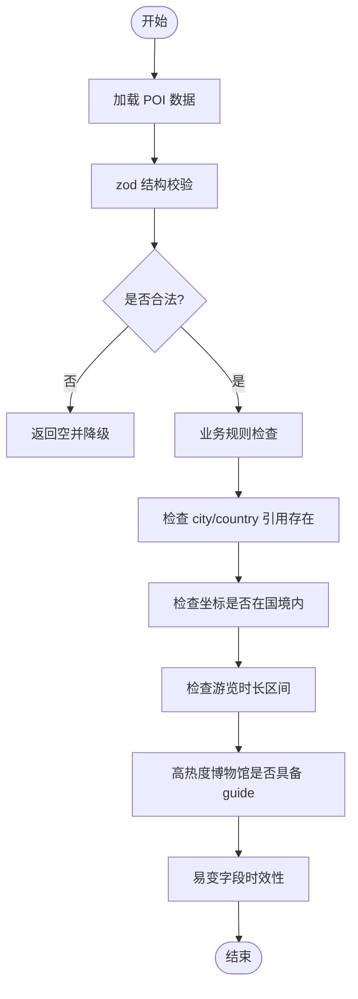
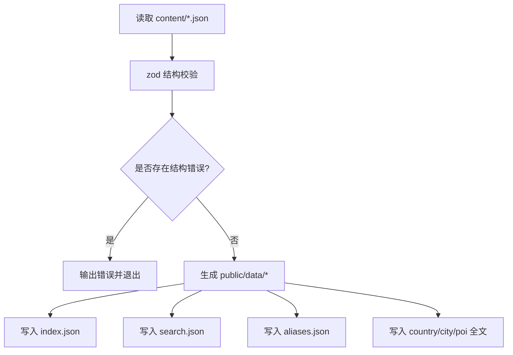
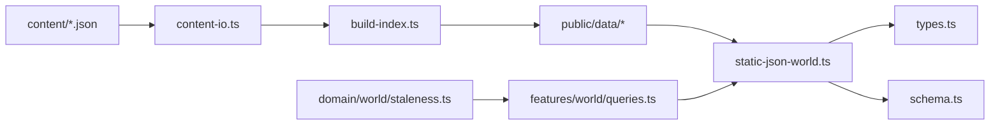

# 静态世界库适配器

<cite>
**本文引用的文件**
- [static-json-world.ts](file://src/data/adapters/static-json-world.ts)
- [schema.ts](file://src/domain/world/schema.ts)
- [build-index.ts](file://scripts/build-index.ts)
- [content-io.ts](file://scripts/content-io.ts)
- [validate-content.ts](file://scripts/validate-content.ts)
- [types.ts](file://src/data/types.ts)
- [index.tsx](file://src/data/index.tsx)
- [queries.ts](file://src/features/world/queries.ts)
- [staleness.ts](file://src/domain/world/staleness.ts)
- [paris.json](file://content/cities/paris.json)
- [eiffel-tower.json](file://content/pois/eiffel-tower.json)
</cite>

## 目录
1. [简介](#简介)
2. [项目结构](#项目结构)
3. [核心组件](#核心组件)
4. [架构总览](#架构总览)
5. [详细组件分析](#详细组件分析)
6. [依赖关系分析](#依赖关系分析)
7. [性能与缓存策略](#性能与缓存策略)
8. [数据构建、索引与验证](#数据构建索引与验证)
9. [数据更新、版本管理与增量策略](#数据更新版本管理与增量策略)
10. [维护指南与扩展方法](#维护指南与扩展方法)
11. [故障排查](#故障排查)
12. [结论](#结论)

## 简介
本仓库实现了一个“静态世界库适配器”，用于在浏览器端以不可变静态 JSON 的形式提供国家、城市与景点（POI）数据。其核心目标是：
- 通过预构建的 index.json、search.json、aliases.json 等静态资源，降低运行时请求数量并提升首屏性能。
- 使用内存级 memo 缓存与 React Query 的永久缓存策略，避免重复网络请求。
- 以 zod schema 进行严格的数据校验与降级容错，确保单个 POI 异常不会导致应用白屏。
- 提供完整的构建、校验、搜索、别名重定向能力，支撑内容维护与长期演进。

## 项目结构
围绕“静态世界库”的关键目录与职责如下：
- content：编著源数据（国家、城市、POI），由脚本编译为运行时数据。
- scripts：构建与校验脚本，负责读取 content、生成 public/data 下的静态资源。
- src/domain/world：领域模型与规则（zod schema、时效性判定）。
- src/data/adapters：数据访问层适配器，当前默认实现为静态 JSON 适配器。
- src/features/world：前端查询封装，基于 React Query 提供世界库数据的查询 Hook。
- src/data/types：Repository 接口与类型定义，屏蔽后端差异。

图表来源
- [build-index.ts:1-120](file://scripts/build-index.ts#L1-L120)
- [content-io.ts:1-92](file://scripts/content-io.ts#L1-L92)
- [static-json-world.ts:1-167](file://src/data/adapters/static-json-world.ts#L1-L167)
- [schema.ts:1-317](file://src/domain/world/schema.ts#L1-L317)
- [queries.ts:1-61](file://src/features/world/queries.ts#L1-L61)

章节来源
- [build-index.ts:1-120](file://scripts/build-index.ts#L1-L120)
- [content-io.ts:1-92](file://scripts/content-io.ts#L1-L92)
- [static-json-world.ts:1-167](file://src/data/adapters/static-json-world.ts#L1-L167)
- [schema.ts:1-317](file://src/domain/world/schema.ts#L1-L317)
- [queries.ts:1-61](file://src/features/world/queries.ts#L1-L61)

## 核心组件
- StaticJsonWorldRepository：实现 WorldRepository 接口，负责从 public/data 加载国家、城市、POI 摘要与全文，并提供搜索与别名重定向。
- Schema（zod）：定义 Country/City/Poi 的结构与业务规则，支持 CI 校验与运行时 safeParse 降级。
- build-index：将 content 中的源数据编译为运行时的 index.json、country/city/poi 全文、search.json、aliases.json。
- validate-content：CI 门禁，执行结构校验与业务规则检查，阻止错误内容进入构建产物。
- queries：React Query 封装，针对静态世界库设置永不失效的缓存策略。

章节来源
- [static-json-world.ts:1-167](file://src/data/adapters/static-json-world.ts#L1-L167)
- [schema.ts:1-317](file://src/domain/world/schema.ts#L1-L317)
- [build-index.ts:1-120](file://scripts/build-index.ts#L1-L120)
- [validate-content.ts:1-76](file://scripts/validate-content.ts#L1-L76)
- [queries.ts:1-61](file://src/features/world/queries.ts#L1-L61)

## 架构总览
静态世界库适配器采用“构建期生成 + 运行时只读”的架构：
- 构建期：从 content 读取并校验，生成 index.json（导航摘要）、search.json（轻量搜索）、aliases.json（旧 id→新 id 映射）以及 country/city/poi 全文。
- 运行时：浏览器通过 fetch 获取静态资源，适配器内部对每个资源做 memo 缓存；同时用 zod 的 safeParse 保证即使个别 POI 结构异常也能降级处理。

图表来源
- [static-json-world.ts:21-76](file://src/data/adapters/static-json-world.ts#L21-L76)
- [queries.ts:1-61](file://src/features/world/queries.ts#L1-L61)
- [schema.ts:157-218](file://src/domain/world/schema.ts#L157-L218)

## 详细组件分析

### 静态世界库适配器（StaticJsonWorldRepository）
- 职责：实现 WorldRepository 接口，统一对外暴露国家、城市、POI 的列表与详情查询、搜索、别名重定向。
- 关键机制：
  - 资源路径：BASE 由 import.meta.env.BASE_URL 推导，默认指向 /data。
  - 网络请求：getJson 统一 fetch，失败抛出包含构建提示的错误信息。
  - 内存缓存：memo(fn) 对每个 key 缓存 Promise，避免重复请求；失败时删除缓存键以便重试。
  - 结构化解析：loadCountry/loadCity/loadPoi 分别使用 CountrySchema/CitySchema/PoiSchema.safeParse，失败时返回 null 并降级。
  - 别名重定向：getPoi 先尝试直接加载 poi/{id}.json，若失败则加载 aliases.json 并重定向到新 id。
  - 搜索：search 使用 search.json 记录进行本地过滤，结合 index.cities 补充城市名作为副标题。

图表来源
- [static-json-world.ts:48-167](file://src/data/adapters/static-json-world.ts#L48-L167)

章节来源
- [static-json-world.ts:19-167](file://src/data/adapters/static-json-world.ts#L19-L167)

### 领域模型与规则（schema.ts）
- 公共约束：IsoDate、HttpsUrl、Verifiable(value) 强制易变字段携带 source 与 verifiedAt。
- 实体模型：
  - Country：签证、货币、语言、时区、插口、紧急电话等。
  - City：生存主题、通票信息等。
  - Poi：基础信息、开放规则（闭馆日/季节性）、预约提前期、设施、易变字段、深导览、图片版权信息等。
- 派生类型：PoiSummary 精简投影，供列表与地图展示。
- 业务规则：checkPoiRules 校验引用完整性、坐标边界框、时长区间、高热度博物馆必须配备 guide、易变字段时效性等。

图表来源
- [schema.ts:20-317](file://src/domain/world/schema.ts#L20-L317)

章节来源
- [schema.ts:1-317](file://src/domain/world/schema.ts#L1-L317)

### 构建与内容 I/O（build-index.ts、content-io.ts）
- content-io：
  - 扫描 content/countries、cities、pois 下的 JSON，按 schema 解析并收集 failures。
  - 提供 today() 工具函数用于时效性判断。
- build-index：
  - 读取 loadContent 的结果，若存在 failures 则中止构建。
  - 写入 public/data：
    - country/{id}.json、city/{id}.json、poi/{id}.json（剥离 _todo/_sources 等编著期字段）。
    - index.json：国家摘要、城市摘要（含 POI 计数、是否有 survival）、POI 摘要（排序依据 popularity）。
    - search.json：城市与 POI 的轻量搜索记录（name/localName/tags 拼接）。
    - aliases.json：旧 id → 新 id 映射，保障老行程不断链。

图表来源
- [content-io.ts:47-85](file://scripts/content-io.ts#L47-L85)
- [build-index.ts:45-116](file://scripts/build-index.ts#L45-L116)

章节来源
- [content-io.ts:1-92](file://scripts/content-io.ts#L1-L92)
- [build-index.ts:1-120](file://scripts/build-index.ts#L1-L120)

### 前端查询封装（queries.ts）
- 针对静态世界库设置 staleTime/gcTime 为 Infinity，表示构建产物一旦发布即视为永不过期，由 Service Worker 或 CDN 缓存控制版本。
- 提供 useWorldIndex、usePois、usePoi、usePoiMap、useCity、useCountry 等 Hook，统一调用 WorldRepository。

章节来源
- [queries.ts:1-61](file://src/features/world/queries.ts#L1-L61)

## 依赖关系分析
- 适配器依赖领域 schema 进行运行时解析与降级。
- 构建脚本依赖 content-io 读取与解析 content，再产出 public/data。
- 前端查询封装依赖适配器接口，屏蔽具体实现细节。
- 时效性模块（staleness.ts）用于界面展示“信息可能过期”的警示。

图表来源
- [content-io.ts:1-92](file://scripts/content-io.ts#L1-L92)
- [build-index.ts:1-120](file://scripts/build-index.ts#L1-L120)
- [static-json-world.ts:1-167](file://src/data/adapters/static-json-world.ts#L1-L167)
- [types.ts:1-300](file://src/data/types.ts#L1-L300)
- [queries.ts:1-61](file://src/features/world/queries.ts#L1-L61)
- [staleness.ts:1-49](file://src/domain/world/staleness.ts#L1-L49)

章节来源
- [types.ts:1-300](file://src/data/types.ts#L1-L300)
- [static-json-world.ts:1-167](file://src/data/adapters/static-json-world.ts#L1-L167)
- [queries.ts:1-61](file://src/features/world/queries.ts#L1-L61)

## 性能与缓存策略
- 构建期优化：
  - index.json 聚合国家、城市、POI 摘要，一次请求即可满足导航所需全部数据。
  - search.json 提供轻量搜索索引，避免全量 POI 文本匹配。
  - aliases.json 支持旧 id 重定向，减少运行时分支逻辑。
- 运行时优化：
  - 内存 memo 缓存：每个资源（country/city/poi）按 id 缓存 Promise，避免重复 fetch。
  - React Query 永久缓存：staleTime/gcTime 设为 Infinity，配合 SW/CDN 缓存控制版本。
  - 安全降级：safeParse 失败时返回 null，UI 可显示“这张卡打不开”而非白屏。
- 数据体积控制：
  - build-index 剥离 _todo/_sources 等编著期字段，仅保留运行时必要字段。
  - PoiSummary 精简投影，减少列表与地图渲染的数据量。

章节来源
- [static-json-world.ts:21-76](file://src/data/adapters/static-json-world.ts#L21-L76)
- [build-index.ts:27-43](file://scripts/build-index.ts#L27-L43)
- [queries.ts:1-61](file://src/features/world/queries.ts#L1-L61)

## 数据构建、索引与验证
- 构建流程：
  - 读取 content 下所有 JSON，使用 zod schema 校验结构。
  - 生成 public/data 下的 index.json、search.json、aliases.json 以及 country/city/poi 全文。
  - 若存在结构错误，构建中止并输出错误清单。
- 索引生成：
  - index.json：包含国家摘要、城市摘要（含 POI 计数、是否有 survival）、POI 摘要（按 popularity 降序）。
  - search.json：城市与 POI 的轻量搜索记录，便于前端快速过滤。
  - aliases.json：旧 id 到最新 id 的映射，保障历史链接可用。
- 内容验证：
  - validate-content 执行两层校验：结构校验（zod）与业务规则（checkPoiRules）。
  - 业务规则包括：引用完整性、坐标边界框、时长区间、高热度博物馆 guide 要求、易变字段时效性等。
  - error 级问题会导致进程非零退出，warn 级问题仅提示。

章节来源
- [build-index.ts:45-116](file://scripts/build-index.ts#L45-L116)
- [validate-content.ts:20-73](file://scripts/validate-content.ts#L20-L73)
- [schema.ts:263-317](file://src/domain/world/schema.ts#L263-L317)

## 数据更新、版本管理与增量策略
- 版本管理：
  - 构建产物包含 generatedAt 时间戳，可用于追踪版本。
  - 前端通过 React Query 永久缓存，实际版本切换由 Service Worker 或 CDN 缓存策略控制。
- 增量更新策略：
  - 由于数据为静态资源，推荐采用“全量替换 + 强缓存”的策略：每次发布新的 public/data 目录，并通过文件名哈希或版本号控制缓存。
  - 对于小范围更新（如某个 POI 的 volatile 字段），只需重新构建并替换对应文件，但整体仍建议全量发布以保证一致性。
- 别名重定向：
  - 通过 aliases.json 将旧 id 映射到新 id，确保历史行程与分享链接不断链。

章节来源
- [build-index.ts:78-110](file://scripts/build-index.ts#L78-L110)
- [static-json-world.ts:129-137](file://src/data/adapters/static-json-world.ts#L129-L137)
- [queries.ts:1-61](file://src/features/world/queries.ts#L1-L61)

## 维护指南与扩展方法
- 维护指南：
  - 编辑 content 下的国家、城市、POI JSON，遵循三条硬规则：易变字段带来源与核实日期、闭馆日结构化、深导览亮点带展厅位置。
  - 运行 npm run content:validate 进行结构与业务规则校验，确保无 error 后再构建。
  - 运行 npm run content:build 生成 public/data 下的静态资源。
- 扩展方法：
  - 新增字段：在 schema.ts 中扩展 zod schema，并在 build-index.ts 中决定是否纳入运行时数据。
  - 新增查询：在 WorldRepository 接口中添加方法，并在 StaticJsonWorldRepository 中实现。
  - 新增搜索维度：在 search.json 构建逻辑中增加字段拼接，并在适配器 search 方法中支持过滤。
  - 新增时效性规则：在 staleness.ts 中调整阈值与标签，并在 UI 中展示警示。

章节来源
- [content/README.md:1-47](file://content/README.md#L1-L47)
- [schema.ts:157-218](file://src/domain/world/schema.ts#L157-L218)
- [build-index.ts:27-43](file://scripts/build-index.ts#L27-L43)
- [static-json-world.ts:149-165](file://src/data/adapters/static-json-world.ts#L149-L165)
- [staleness.ts:1-49](file://src/domain/world/staleness.ts#L1-L49)

## 故障排查
- 常见错误：
  - 资源缺失：fetch 返回非 ok 状态，提示先运行 content:build。
  - 结构异常：safeParse 失败，控制台输出前三个 issues，POI 降级为 null。
  - 构建失败：validate-content 检测到结构错误或业务规则问题，需修复后重新构建。
- 调试建议：
  - 检查 content 下的 JSON 是否符合 schema 定义。
  - 确认 public/data 已正确生成，尤其是 index.json、search.json、aliases.json。
  - 查看浏览器控制台日志，定位 safeParse 失败的 POI 与字段。

章节来源
- [static-json-world.ts:21-25](file://src/data/adapters/static-json-world.ts#L21-L25)
- [static-json-world.ts:67-76](file://src/data/adapters/static-json-world.ts#L67-L76)
- [validate-content.ts:20-73](file://scripts/validate-content.ts#L20-L73)

## 结论
静态世界库适配器通过“构建期生成 + 运行时只读”的模式，实现了高性能、高可靠的世界库数据访问。其核心优势包括：
- 构建期聚合与精简，减少运行时请求与数据体积。
- 运行时内存缓存与 React Query 永久缓存，提升响应速度。
- 严格的 schema 校验与降级容错，保障用户体验。
- 完善的构建、校验、搜索、别名重定向机制，支撑内容维护与长期演进。

在实际使用中，建议遵循内容编写规范，定期运行校验与构建，并结合 Service Worker/CDN 缓存策略进行版本管理。对于扩展需求，可在 schema、构建逻辑与适配器接口中进行渐进式增强。