# 类型系统

<cite>
**本文引用的文件**
- [src/data/types.ts](file://src/data/types.ts)
- [src/domain/world/schema.ts](file://src/domain/world/schema.ts)
- [src/domain/date.ts](file://src/domain/date.ts)
- [src/domain/visa/destination-country.ts](file://src/domain/visa/destination-country.ts)
- [src/domain/trip/closure-check.ts](file://src/domain/trip/closure-check.ts)
- [src/domain/expense/settle.ts](file://src/domain/expense/settle.ts)
- [src/domain/trip/packing.ts](file://src/domain/trip/packing.ts)
- [src/domain/trip/rank.ts](file://src/domain/trip/rank.ts)
- [src/data/adapters/local-trip.ts](file://src/data/adapters/local-trip.ts)
- [src/features/trip/uploadTicketAttachment.ts](file://src/features/trip/uploadTicketAttachment.ts)
- [src/components/PdfViewer.tsx](file://src/components/PdfViewer.tsx)
- [supabase/migrations/0008_ticket_attachments.sql](file://supabase/migrations/0008_ticket_attachments.sql)
- [tsconfig.json](file://tsconfig.json)
</cite>

## 更新摘要
**变更内容**
- 新增 TicketAttachment 接口，定义 PDF 附件元数据结构
- 扩展 Ticket 接口的 attachments 属性，支持 PDF 附件数组
- 新增门票 PDF 附件上传、删除和预览功能
- 数据库迁移添加 tickets 表的 attachments jsonb 列
- 更新存储桶配置以支持 PDF 文件上传

## 目录
1. [简介](#简介)
2. [项目结构](#项目结构)
3. [核心组件](#核心组件)
4. [架构总览](#架构总览)
5. [详细组件分析](#详细组件分析)
6. [依赖关系分析](#依赖关系分析)
7. [性能考量](#性能考量)
8. [故障排查指南](#故障排查指南)
9. [结论](#结论)
10. [附录：类型扩展与自定义规范](#附录：类型扩展与自定义规范)

## 简介
本文件系统化梳理"玩无一失"的类型系统，覆盖 TypeScript 类型定义的组织方式、领域模型设计、类型推导机制、枚举与联合类型的组合使用、类型验证策略、运行时类型检查以及类型安全的最佳实践。同时提供类型扩展指南与自定义类型定义规范，帮助在保持强类型约束的前提下进行功能演进与团队协作。

**更新** 本次更新新增了门票 PDF 附件功能，包括 TicketAttachment 接口定义、PDF 附件管理功能和相应的类型安全保证。

## 项目结构
类型系统按"领域 + 数据层 + 工具"分层组织：
- 领域层（domain）：世界库 schema、日期工具、行程业务规则（闭馆日校验、打包建议、排序键）、签证决策、费用结算等纯函数与类型。
- 数据层（data）：Repository 接口与聚合数据结构（TripBundle 等），统一抽象本地与云端实现。
- 功能层（features）：具体业务功能实现，包括新的门票 PDF 附件管理。
- 配置（tsconfig）：严格模式、路径别名、模块解析策略，保障类型一致性与可维护性。

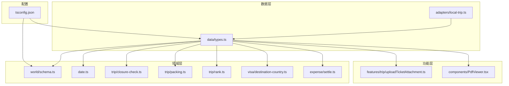

**图表来源**
- [src/data/types.ts:1-310](file://src/data/types.ts#L1-L310)
- [src/domain/world/schema.ts:1-317](file://src/domain/world/schema.ts#L1-L317)
- [src/features/trip/uploadTicketAttachment.ts:1-59](file://src/features/trip/uploadTicketAttachment.ts#L1-L59)
- [src/components/PdfViewer.tsx:1-123](file://src/components/PdfViewer.tsx#L1-L123)

## 核心组件
- 世界库 Schema 与类型推导：基于 Zod 的运行时 schema 与 z.infer 生成的 TS 类型，确保数据契约与类型同步。
- 行程与协作数据模型：以 Trip、TripItem、Expense、Ticket、PackingItem 等为核心，配合 TripRepository 接口统一访问。
- **新增** 门票 PDF 附件系统：TicketAttachment 接口定义 PDF 附件元数据，支持上传、删除和预览功能。
- 领域工具：日期字符串工具、闭馆日校验、打包建议、分数序排序键、签证送签国判断、费用分摊与最小转账计算。
- 适配器：LocalTripRepository 实现 TripRepository，保证离线开发体验与云端能力一致的接口契约。

**章节来源**
- [src/domain/world/schema.ts:1-317](file://src/domain/world/schema.ts#L1-L317)
- [src/data/types.ts:1-310](file://src/data/types.ts#L1-L310)
- [src/features/trip/uploadTicketAttachment.ts:1-59](file://src/features/trip/uploadTicketAttachment.ts#L1-L59)
- [src/components/PdfViewer.tsx:1-123](file://src/components/PdfViewer.tsx#L1-L123)

## 架构总览
类型系统围绕"单一事实源 + 运行时校验 + 编译期类型"构建：
- 世界库 schema 是事实源，导出 TS 类型供全仓使用；CI 与运行时代码共享同一份 schema 做校验与容错解析。
- 数据层通过 Repository 接口解耦存储实现，类型集中在 data/types.ts，便于替换后端而不影响 UI。
- 领域函数均为纯函数，输入输出类型明确，便于单测与复用。
- **新增** 门票 PDF 附件功能通过独立的 uploadTicketAttachment 模块处理，与图片上传功能分离。

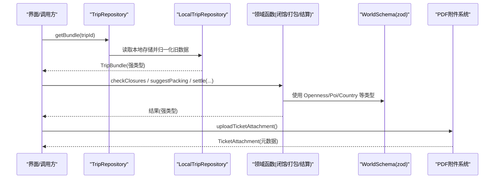

**图表来源**
- [src/data/adapters/local-trip.ts:67-115](file://src/data/adapters/local-trip.ts#L67-L115)
- [src/features/trip/uploadTicketAttachment.ts:18-43](file://src/features/trip/uploadTicketAttachment.ts#L18-L43)
- [src/components/PdfViewer.tsx:52-83](file://src/components/PdfViewer.tsx#L52-L83)

## 详细组件分析

### 世界库 Schema 与类型推导
- 使用 Zod 定义 Country、City、Poi 等结构，并通过 z.infer 生成 TS 类型，保证 schema 与类型始终一致。
- 易变字段采用 Verifiable 包装，强制携带 value/source/verifiedAt，避免过期信息误导算法。
- 派生类型如 PoiSummary 通过 pick/extend 精简投影，减少传输与渲染成本。
- 业务规则校验（checkPoiRules）在 CI 中执行，发现引用不存在的城市/国家、坐标越界、时长区间颠倒、高热度博物馆缺少深导览等问题。

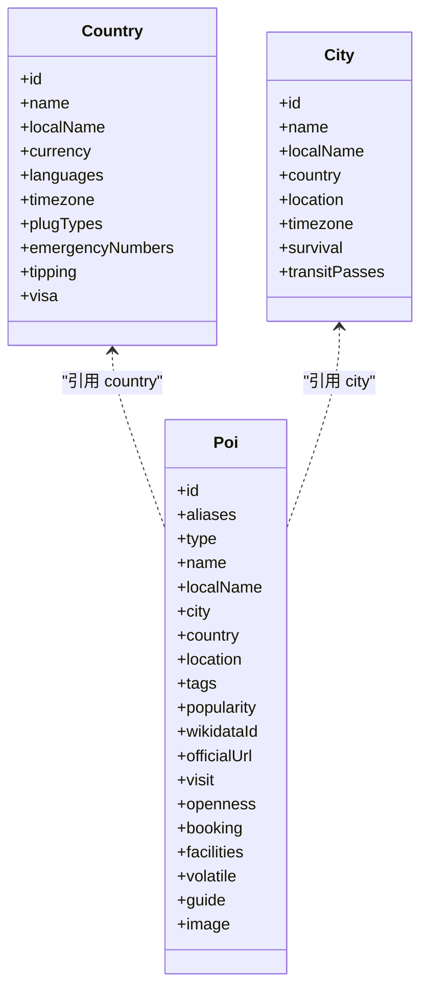

**图表来源**
- [src/domain/world/schema.ts:58-231](file://src/domain/world/schema.ts#L58-L231)

**章节来源**
- [src/domain/world/schema.ts:1-317](file://src/domain/world/schema.ts#L1-L317)

### 行程与协作数据模型
- 核心类型集中在 data/types.ts，包括 Trip、TripDay、TripItem、PackingItem、Ticket、Expense、TripMember、TripInvite、TripBundle 等。
- 枚举与联合类型：
  - ItemStatus、MemberRole、TripStatus、ExpenseCategory、TransportMode、ItemKind 等用于状态机与分类。
  - ExpenseSplitMode 区分共同分摊与个人自付，影响结算逻辑。
- Repository 接口统一 CRUD 与协作能力，屏蔽底层存储差异。
- **新增** TicketAttachment 接口定义 PDF 附件元数据结构，包含 url、name、size、uploadedAt 字段。

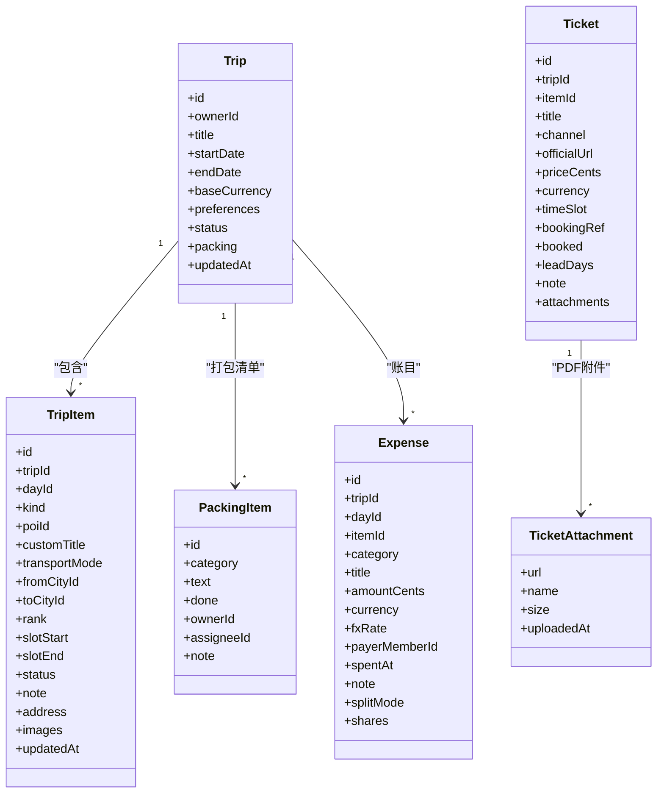

**图表来源**
- [src/data/types.ts:113-239](file://src/data/types.ts#L113-L239)
- [src/data/types.ts:195-220](file://src/data/types.ts#L195-L220)

**章节来源**
- [src/data/types.ts:1-310](file://src/data/types.ts#L1-L310)

### 门票 PDF 附件系统
**新增** 完整的 PDF 附件管理系统，支持上传、删除和预览功能：

- **TicketAttachment 接口**：定义 PDF 附件元数据结构，包含文件 URL、名称、大小和上传时间
- **uploadTicketAttachment 函数**：处理 PDF 文件上传到 Supabase Storage，返回元数据对象
- **deleteTicketAttachment 函数**：根据 URL 删除对应的 PDF 文件
- **PdfViewer 组件**：提供 PDF 文件的内嵌预览功能，支持 iframe 渲染和错误处理
- **数据库支持**：tickets 表新增 attachments jsonb 列，存储 PDF 附件元数据数组

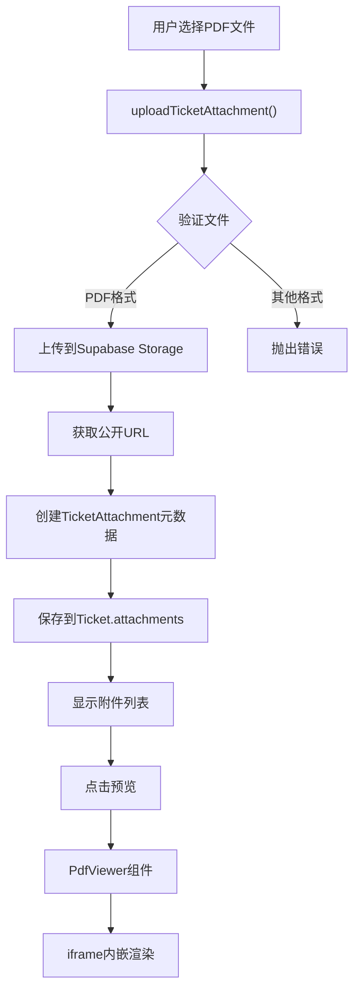

**图表来源**
- [src/features/trip/uploadTicketAttachment.ts:18-43](file://src/features/trip/uploadTicketAttachment.ts#L18-L43)
- [src/components/PdfViewer.tsx:52-83](file://src/components/PdfViewer.tsx#L52-L83)
- [src/data/types.ts:195-220](file://src/data/types.ts#L195-L220)

**章节来源**
- [src/features/trip/uploadTicketAttachment.ts:1-59](file://src/features/trip/uploadTicketAttachment.ts#L1-L59)
- [src/components/PdfViewer.tsx:1-123](file://src/components/PdfViewer.tsx#L1-L123)
- [src/data/types.ts:195-220](file://src/data/types.ts#L195-L220)
- [supabase/migrations/0008_ticket_attachments.sql:1-20](file://supabase/migrations/0008_ticket_attachments.sql#L1-L20)

### 日期工具与时间语义
- 所有日期以 ISO 字符串流转，避免 Date 对象时区陷阱。
- 提供 isValidDate、addDays、diffDays、weekday、monthDay、todayStr、dateRange、formatCn 等工具，确保跨时区一致性。
- weekday 返回值与 openness.closedWeekdays 对齐，支撑闭馆日校验。

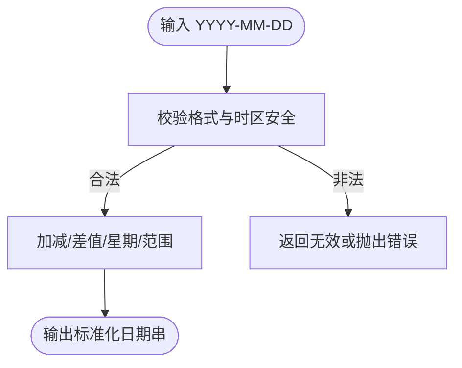

**图表来源**
- [src/domain/date.ts:10-69](file://src/domain/date.ts#L10-L69)

**章节来源**
- [src/domain/date.ts:1-69](file://src/domain/date.ts#L1-L69)

### 闭馆日校验与可执行建议
- 依据 POI 的 Openness（固定闭馆日、周几闭馆、季节性开放区间）判定指定日期是否闭馆。
- 批量校验日程，给出同程内可替换日期建议，驱动"一键改期"。
- 与日期工具紧密耦合，保证星期与月份比较的一致性。

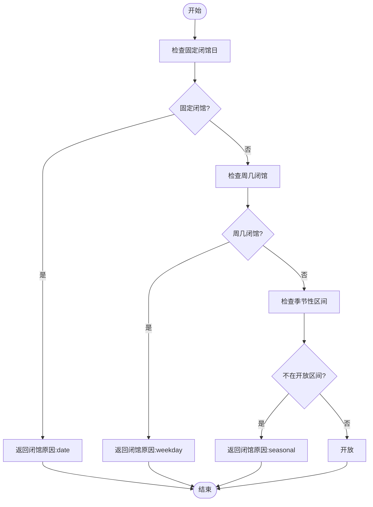

**图表来源**
- [src/domain/trip/closure-check.ts:37-98](file://src/domain/trip/closure-check.ts#L37-L98)
- [src/domain/date.ts:37-51](file://src/domain/date.ts#L37-L51)

**章节来源**
- [src/domain/trip/closure-check.ts:1-98](file://src/domain/trip/closure-check.ts#L1-L98)

### 打包建议与活动感知
- 基于行程天数、目的地国家、货币、已排 POI 类型/标签推导衣物与装备建议。
- 支持按成员复制个人行李项，公共项仅一份并可指定负责人。
- 结合气候带与活动标签生成个性化建议，提升行前准备效率。

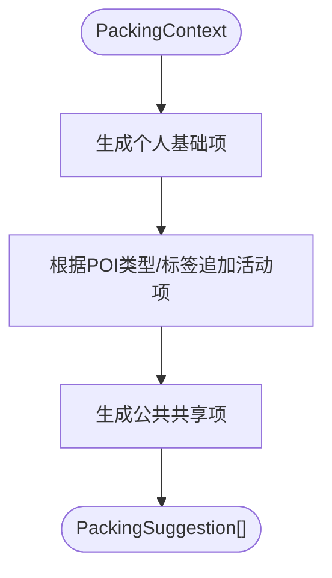

**图表来源**
- [src/domain/trip/packing.ts:79-164](file://src/domain/trip/packing.ts#L79-L164)

**章节来源**
- [src/domain/trip/packing.ts:1-164](file://src/domain/trip/packing.ts#L1-L164)

### 分数序排序键（拖拽排序）
- 使用 base62 小数表示 rank，支持任意位置插入且无需重写后续条目，抗并发冲突。
- 提供 initialRank、rankBetween、sequentialRanks、byRank、rankForInsert 等工具。
- 不变量：末位不为最小字符，保证可插值空间。

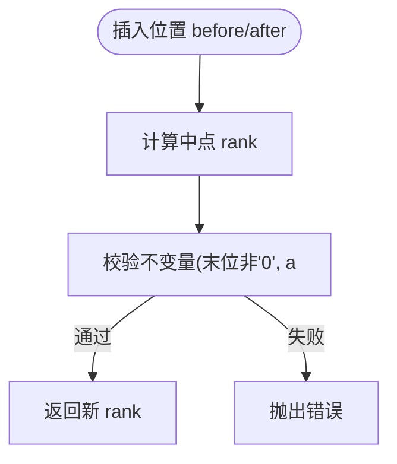

**图表来源**
- [src/domain/trip/rank.ts:22-59](file://src/domain/trip/rank.ts#L22-L59)
- [src/domain/trip/rank.ts:66-91](file://src/domain/trip/rank.ts#L66-L91)

**章节来源**
- [src/domain/trip/rank.ts:1-91](file://src/domain/trip/rank.ts#L1-L91)

### 签证送签国判断与行程单
- 依据各国家停留晚数决定主要目的地国；若并列则回退到首个入境国。
- 输出包含 nightsByCountry、是否因并列而回落、可读 reason。
- 将行程时间线编译为使馆要求的行程单表格。

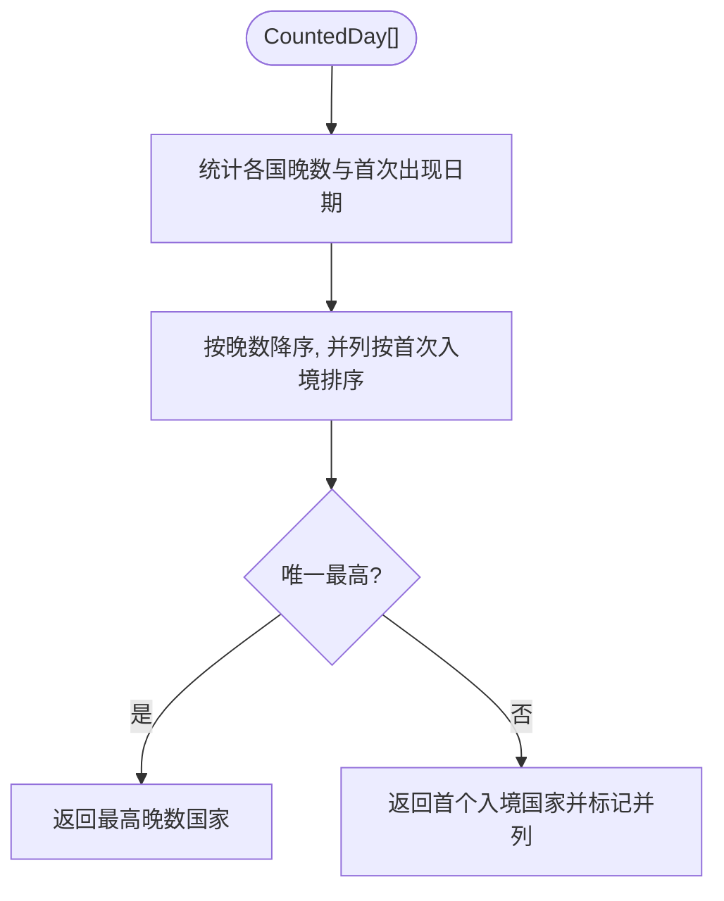

**图表来源**
- [src/domain/visa/destination-country.ts:27-74](file://src/domain/visa/destination-country.ts#L27-L74)

**章节来源**
- [src/domain/visa/destination-country.ts:1-119](file://src/domain/visa/destination-country.ts#L1-L119)

### 费用分摊与最小转账
- 金额一律以整数分运算，避免浮点漂移。
- splitAmount 用最大余数法保证分摊总和守恒。
- computeBalances 累计每人净额；minimalTransfers 贪心结算，次数上限 n-1。
- 支持个人自付跳过共同分摊。

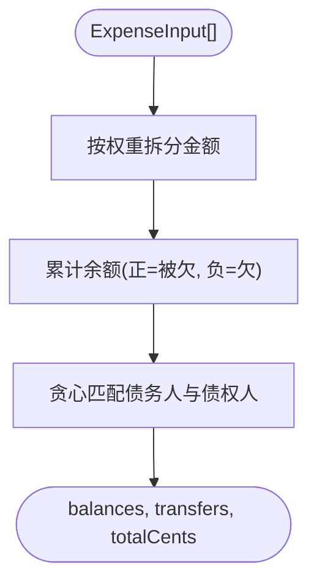

**图表来源**
- [src/domain/expense/settle.ts:38-141](file://src/domain/expense/settle.ts#L38-L141)

**章节来源**
- [src/domain/expense/settle.ts:1-141](file://src/domain/expense/settle.ts#L1-L141)

### 适配器与数据归一化
- LocalTripRepository 实现 TripRepository，提供离线开发与演示能力。
- 读取时归一化旧数据（补齐 kind、splitMode、ownerId/assigneeId 默认值），保证上层类型稳定。
- canSync=false 提示 UI 当前不可同步，避免误以为已在协作。

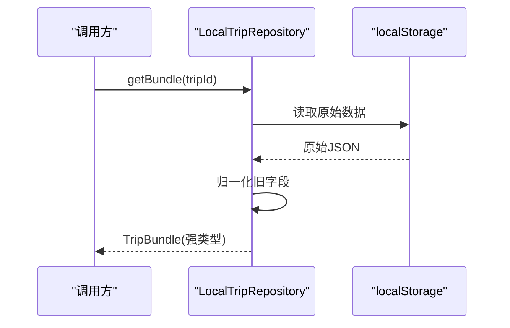

**图表来源**
- [src/data/adapters/local-trip.ts:67-115](file://src/data/adapters/local-trip.ts#L67-L115)

**章节来源**
- [src/data/adapters/local-trip.ts:1-349](file://src/data/adapters/local-trip.ts#L1-L349)

## 依赖关系分析
- world/schema.ts 是类型与校验的事实源，被 data/types.ts、closure-check.ts、packing.ts 等广泛引用。
- date.ts 为多个领域函数提供日期操作，确保跨时区一致性。
- data/types.ts 集中定义 Repository 接口与聚合类型，被 adapters 与上层 UI 引用。
- **新增** uploadTicketAttachment.ts 依赖 types.ts 中的 TicketAttachment 类型，提供类型安全的 PDF 附件管理。
- PdfViewer.tsx 依赖 supabase-client 和 types.ts，提供类型安全的 PDF 预览功能。
- tsconfig.json 启用严格模式与路径别名，保障类型一致性与导入简洁性。

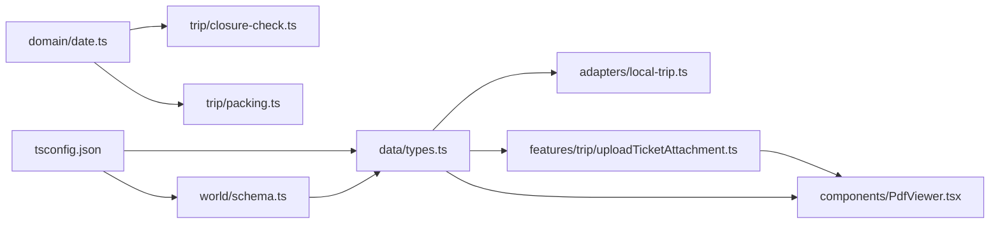

**图表来源**
- [src/domain/world/schema.ts:1-317](file://src/domain/world/schema.ts#L1-L317)
- [src/data/types.ts:1-310](file://src/data/types.ts#L1-L310)
- [src/features/trip/uploadTicketAttachment.ts:1-59](file://src/features/trip/uploadTicketAttachment.ts#L1-L59)
- [src/components/PdfViewer.tsx:1-123](file://src/components/PdfViewer.tsx#L1-L123)

**章节来源**
- [src/domain/world/schema.ts:1-317](file://src/domain/world/schema.ts#L1-L317)
- [src/data/types.ts:1-310](file://src/data/types.ts#L1-L310)
- [src/features/trip/uploadTicketAttachment.ts:1-59](file://src/features/trip/uploadTicketAttachment.ts#L1-L59)
- [src/components/PdfViewer.tsx:1-123](file://src/components/PdfViewer.tsx#L1-L123)

## 性能考量
- 世界库使用精简投影（PoiSummary）降低传输与渲染开销。
- 分数序排序键避免拖拽时的 N 次更新，减少写放大与并发冲突。
- 费用结算采用整数分运算与贪心算法，复杂度低且结果稳定可复现。
- 日期处理全部基于字符串与 UTC 换算，避免 Date 对象带来的额外开销与时区问题。
- **新增** PDF 附件采用元数据分离存储，文件本体存储在 Supabase Storage，仅元数据保存在数据库中，减少数据库负载。
- **新增** PDF 预览使用 Blob URL 技术，避免重复下载，提高预览性能。

## 故障排查指南
- 世界库内容校验失败：检查 POI 的 city/country 引用是否存在、坐标是否在边界框内、时长区间是否颠倒、高热度博物馆是否配备 guide。参考 schema 中的 checkPoiRules。
- 闭馆日冲突：确认 Openness 的 closedWeekdays、closedDates、seasonal 是否正确；使用 openDatesAmong 在同程内寻找可替换日期。
- 费用结算异常：确认 splitMode 与 shares 是否正确展开；金额必须为整数分；注意个人自付不参与共同分摊。
- 适配器兼容性问题：读取旧档时需确保归一化逻辑生效（kind、splitMode、ownerId/assigneeId 默认值）。
- **新增** PDF 附件上传失败：检查文件是否为 PDF 格式、文件大小是否超过 10MB 限制、Supabase Storage 连接是否正常。
- **新增** PDF 预览加载失败：确认 Supabase Storage bucket 权限设置正确、MIME 类型配置包含 application/pdf、网络连接正常。

**章节来源**
- [src/domain/world/schema.ts:248-317](file://src/domain/world/schema.ts#L248-L317)
- [src/domain/trip/closure-check.ts:37-98](file://src/domain/trip/closure-check.ts#L37-L98)
- [src/domain/expense/settle.ts:72-141](file://src/domain/expense/settle.ts#L72-L141)
- [src/data/adapters/local-trip.ts:97-115](file://src/data/adapters/local-trip.ts#L97-L115)
- [src/features/trip/uploadTicketAttachment.ts:24-26](file://src/features/trip/uploadTicketAttachment.ts#L24-L26)
- [src/components/PdfViewer.tsx:57-74](file://src/components/PdfViewer.tsx#L57-L74)

## 结论
本项目通过"Zod schema + z.infer"、"Repository 接口抽象"、"纯函数领域逻辑"和"严格 TS 配置"，构建了稳健的类型系统。类型与运行时校验同源，既保证了编译期安全，又提供了运行期容错与可观测性。建议在新增领域能力时遵循现有模式：先定义 schema 与类型，再实现纯函数逻辑，最后通过适配器暴露给 UI。

**更新** 本次新增的门票 PDF 附件功能进一步完善了类型系统，通过 TicketAttachment 接口和相关的上传、预览功能，为用户提供了完整的电子票管理能力，同时保持了类型安全和良好的用户体验。

## 附录：类型扩展与自定义规范
- 新增领域类型
  - 在 domain 下新增模块，优先使用 Zod 定义 schema，并通过 z.infer 导出 TS 类型。
  - 对易变字段使用 Verifiable 包装，强制携带 source 与 verifiedAt。
  - 如需精简投影，使用 pick/extend 派生类型，避免重复定义。
- 枚举与联合类型
  - 使用 z.enum 定义枚举，并在多处复用；对于状态机，尽量使用联合类型表达有限状态。
  - 在 data/types.ts 中集中声明业务枚举（如 ItemStatus、TransportMode），便于全局一致。
- 类型验证策略
  - 编译期：开启 strict、noUncheckedIndexedAccess、noUnusedLocals/Parameters 等严格选项。
  - 运行期：在数据入口（如 adapter、API 响应）使用 safeParse 进行容错解析，降级渲染而非白屏。
  - CI：引入 schema 的业务规则校验（如 checkPoiRules），防止脏数据入库。
- 类型安全的最佳实践
  - 所有日期以 ISO 字符串流转，仅在必要时进行 UTC 换算。
  - 金额一律使用整数分，避免浮点误差。
  - 对外暴露的接口（如 Repository）保持向后兼容，内部变更不影响上层。
  - **新增** 外部资源（如 PDF 文件）的元数据与实体分离存储，通过接口定义确保类型安全。
- 自定义类型定义规范
  - 命名：类型名使用名词短语（如 TripItem、Expense、TicketAttachment），函数名使用动词短语（如 decideVisaCountry、uploadTicketAttachment）。
  - 文档：在关键类型与函数上方添加注释说明用途、约束与示例。
  - 测试：为复杂逻辑编写单测，覆盖边界条件与异常分支。

**章节来源**
- [src/data/types.ts:195-220](file://src/data/types.ts#L195-L220)
- [src/features/trip/uploadTicketAttachment.ts:1-59](file://src/features/trip/uploadTicketAttachment.ts#L1-L59)
- [src/components/PdfViewer.tsx:1-123](file://src/components/PdfViewer.tsx#L1-L123)