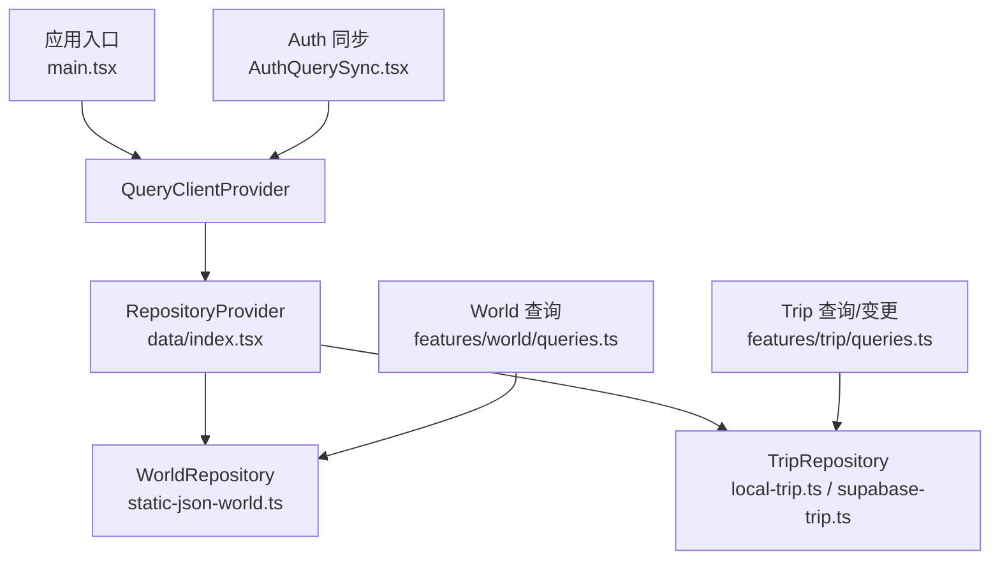
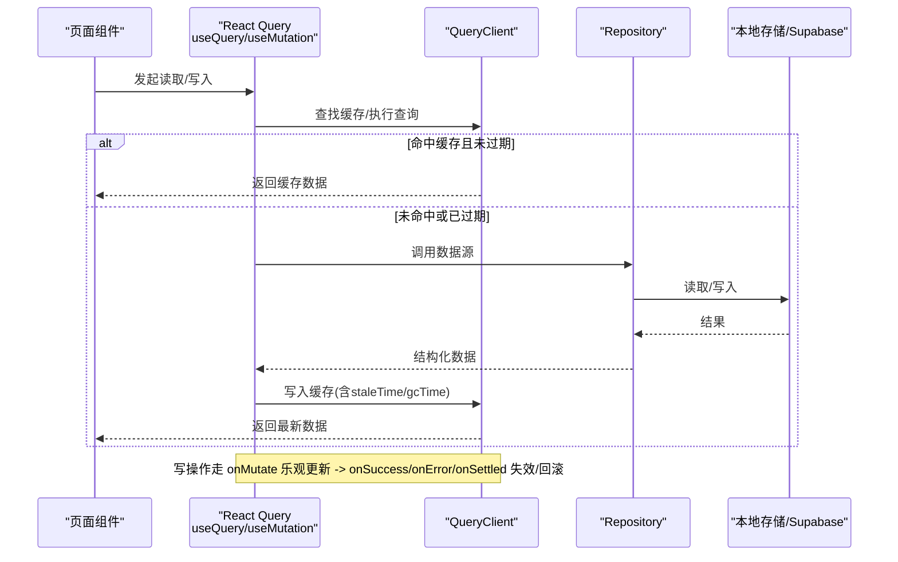
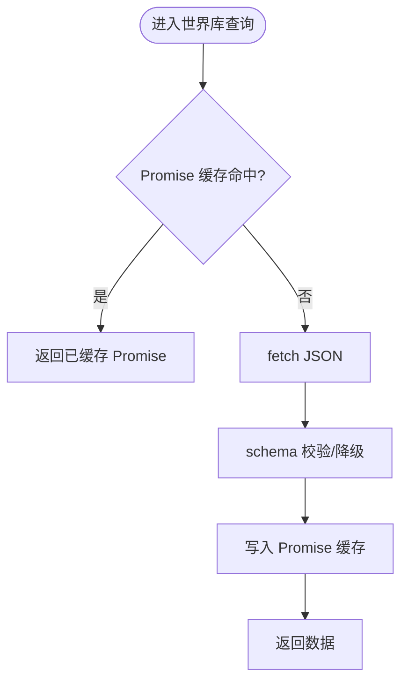
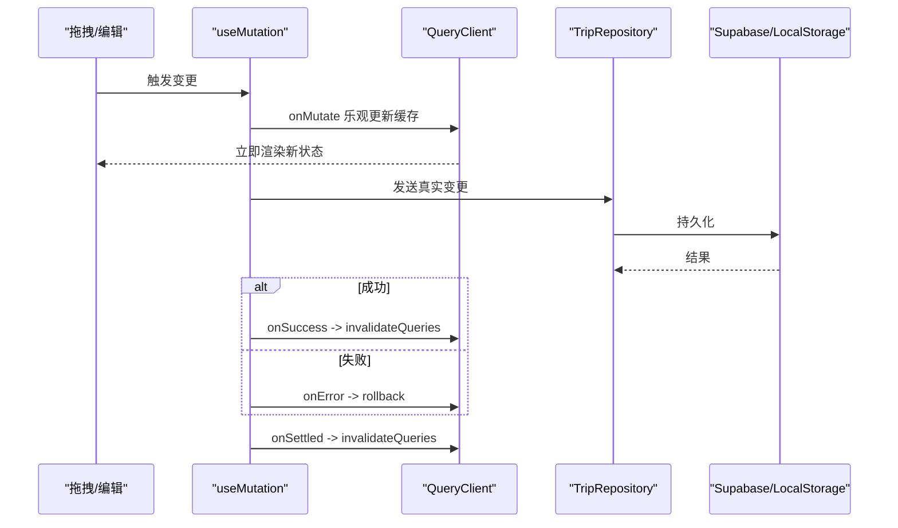
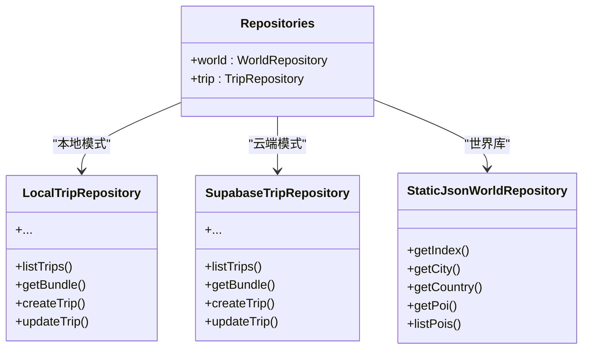
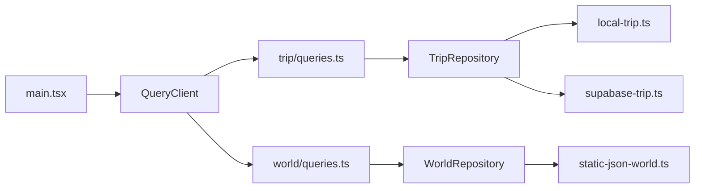

# 缓存策略

<cite>
**本文引用的文件**
- [src/app/main.tsx](file://src/app/main.tsx)
- [vite.config.ts](file://vite.config.ts)
- [src/features/trip/queries.ts](file://src/features/trip/queries.ts)
- [src/features/world/queries.ts](file://src/features/world/queries.ts)
- [src/data/index.tsx](file://src/data/index.tsx)
- [src/data/adapters/local-trip.ts](file://src/data/adapters/local-trip.ts)
- [src/data/adapters/supabase-trip.ts](file://src/data/adapters/supabase-trip.ts)
- [src/data/adapters/static-json-world.ts](file://src/data/adapters/static-json-world.ts)
- [src/features/auth/AuthQuerySync.tsx](file://src/features/auth/AuthQuerySync.tsx)
- [src/features/auth/useProfile.ts](file://src/features/auth/useProfile.ts)
- [src/domain/world/staleness.ts](file://src/domain/world/staleness.ts)
- [src/ui/toast.tsx](file://src/ui/toast.tsx)
</cite>

## 目录
1. [简介](#简介)
2. [项目结构](#项目结构)
3. [核心组件](#核心组件)
4. [架构总览](#架构总览)
5. [详细组件分析](#详细组件分析)
6. [依赖关系分析](#依赖关系分析)
7. [性能考量](#性能考量)
8. [故障排除指南](#故障排除指南)
9. [结论](#结论)
10. [附录：最佳实践与调试清单](#附录最佳实践与调试清单)

## 简介
本文件系统化梳理本项目基于 React Query（@tanstack/react-query）的“玩无一失”缓存策略，覆盖以下方面：
- 全局缓存配置与默认行为
- 本地缓存与服务器缓存的协调机制
- 失效策略、一致性保证与内存管理
- 预取与缓存预热思路
- 性能优化建议与可观测性/调试手段
- 常见问题排查与最佳实践

该方案以“静态世界库永久缓存 + 行程数据短期缓存 + 写操作乐观更新 + 登录态变更触发失效”为核心设计，兼顾首屏体验、交互流畅性与数据一致性。

## 项目结构
- 应用入口集中创建并注入 QueryClient，统一控制重试、窗口聚焦重取等默认行为。
- 数据访问通过 Repository 抽象，按环境在本地存储与云端之间切换，视图层只感知接口。
- 功能模块按领域组织查询与变更逻辑，分别定义各自的 staleTime/gcTime 策略。
- 构建阶段将 react-query 单独分包，便于缓存与加载优化。

图表来源
- [src/app/main.tsx:16-20](file://src/app/main.tsx#L16-L20)
- [src/data/index.tsx:21-29](file://src/data/index.tsx#L21-L29)
- [src/data/adapters/static-json-world.ts:48-81](file://src/data/adapters/static-json-world.ts#L48-L81)
- [src/data/adapters/local-trip.ts:67-95](file://src/data/adapters/local-trip.ts#L67-L95)
- [src/data/adapters/supabase-trip.ts:141-198](file://src/data/adapters/supabase-trip.ts#L141-L198)
- [src/features/world/queries.ts:8-30](file://src/features/world/queries.ts#L8-L30)
- [src/features/trip/queries.ts:17-38](file://src/features/trip/queries.ts#L17-L38)
- [src/features/auth/AuthQuerySync.tsx:15-23](file://src/features/auth/AuthQuerySync.tsx#L15-L23)

章节来源
- [src/app/main.tsx:16-20](file://src/app/main.tsx#L16-L20)
- [vite.config.ts:19-30](file://vite.config.ts#L19-L30)

## 核心组件
- QueryClient 全局配置：关闭窗口聚焦自动重取、限制重试次数，避免不必要的网络抖动与闪烁。
- World 仓库：静态 JSON 内容，运行时永不过期；内部使用 Promise 级 memo 缓存，避免重复请求。
- Trip 仓库：本地开发模式使用 localStorage 持久化；云端模式通过 Supabase RPC 一次性拉取聚合数据。
- 查询封装：为不同数据域设置合适的 staleTime，区分静态内容与动态数据。
- 变更封装：统一的乐观更新 + 失败回滚 + 成功后失效相关查询，保障一致性与交互流畅。

章节来源
- [src/app/main.tsx:16-20](file://src/app/main.tsx#L16-L20)
- [src/data/adapters/static-json-world.ts:27-39](file://src/data/adapters/static-json-world.ts#L27-L39)
- [src/data/adapters/local-trip.ts:67-95](file://src/data/adapters/local-trip.ts#L67-L95)
- [src/data/adapters/supabase-trip.ts:150-198](file://src/data/adapters/supabase-trip.ts#L150-L198)
- [src/features/world/queries.ts:5-30](file://src/features/world/queries.ts#L5-L30)
- [src/features/trip/queries.ts:45-63](file://src/features/trip/queries.ts#L45-L63)

## 架构总览
下图展示了从 UI 到数据源的完整调用链，以及缓存在各层的落点与失效路径。

图表来源
- [src/features/trip/queries.ts:45-63](file://src/features/trip/queries.ts#L45-L63)
- [src/features/trip/queries.ts:65-216](file://src/features/trip/queries.ts#L65-L216)
- [src/features/world/queries.ts:8-30](file://src/features/world/queries.ts#L8-L30)
- [src/data/adapters/static-json-world.ts:48-81](file://src/data/adapters/static-json-world.ts#L48-L81)
- [src/data/adapters/supabase-trip.ts:150-198](file://src/data/adapters/supabase-trip.ts#L150-L198)

## 详细组件分析

### 全局缓存配置与默认行为
- 在应用入口处创建 QueryClient，并设置默认查询选项：
  - 重试次数限制为 1，降低瞬时错误导致的频繁重试。
  - 关闭 refetchOnWindowFocus，避免切标签页带来的不必要刷新。
- 构建时将 react-query 单独分包，利于浏览器缓存与按需加载。

章节来源
- [src/app/main.tsx:16-20](file://src/app/main.tsx#L16-L20)
- [vite.config.ts:19-30](file://vite.config.ts#L19-L30)

### 世界库缓存：静态内容、永久有效
- 世界库为不可变静态资源，查询配置中 staleTime 与 gcTime 均设为无穷大，确保运行时不再主动刷新。
- 仓库内部对 index、country、city、poi 等资源进行 Promise 级 memo 缓存，同一进程内多次请求直接复用 Promise，减少网络开销。
- 单个 POI 解析失败时降级处理，不影响整体渲染。

图表来源
- [src/data/adapters/static-json-world.ts:27-39](file://src/data/adapters/static-json-world.ts#L27-L39)
- [src/data/adapters/static-json-world.ts:78-81](file://src/data/adapters/static-json-world.ts#L78-L81)
- [src/data/adapters/static-json-world.ts:67-76](file://src/data/adapters/static-json-world.ts#L67-L76)

章节来源
- [src/features/world/queries.ts:5-30](file://src/features/world/queries.ts#L5-L30)
- [src/data/adapters/static-json-world.ts:27-39](file://src/data/adapters/static-json-world.ts#L27-L39)
- [src/data/adapters/static-json-world.ts:78-81](file://src/data/adapters/static-json-world.ts#L78-L81)

### 行程数据缓存：短期有效、写操作乐观更新
- 列表与详情采用不同的 staleTime：
  - 行程列表：60 秒内视为新鲜。
  - 行程 Bundle：30 秒内视为新鲜。
- 写操作统一通过 useMutation 的 onMutate 进行乐观更新，立即修改对应 queryKey 的缓存；成功则失效相关查询，失败则回滚到之前快照。
- 所有写操作完成后，都会失效当前 Bundle 与列表，保证后续读取拿到最新状态。

图表来源
- [src/features/trip/queries.ts:45-63](file://src/features/trip/queries.ts#L45-L63)
- [src/features/trip/queries.ts:65-216](file://src/features/trip/queries.ts#L65-L216)

章节来源
- [src/features/trip/queries.ts:17-38](file://src/features/trip/queries.ts#L17-L38)
- [src/features/trip/queries.ts:45-63](file://src/features/trip/queries.ts#L45-L63)
- [src/features/trip/queries.ts:65-216](file://src/features/trip/queries.ts#L65-L216)

### 本地缓存与服务器缓存的协调
- 仓库工厂根据是否配置 Supabase 决定使用本地存储或云端适配器，接口完全一致，视图层无感知。
- 本地适配器使用 localStorage 持久化，适合离线开发与演示；云端适配器通过 RPC 一次拉取聚合数据，减少往返。
- 登录态变化时，统一失效 ['trip'] 分组，确保权限变更后重新获取数据。

图表来源
- [src/data/index.tsx:21-29](file://src/data/index.tsx#L21-L29)
- [src/data/adapters/local-trip.ts:67-95](file://src/data/adapters/local-trip.ts#L67-L95)
- [src/data/adapters/supabase-trip.ts:141-198](file://src/data/adapters/supabase-trip.ts#L141-L198)
- [src/data/adapters/static-json-world.ts:48-81](file://src/data/adapters/static-json-world.ts#L48-L81)

章节来源
- [src/data/index.tsx:21-29](file://src/data/index.tsx#L21-L29)
- [src/features/auth/AuthQuerySync.tsx:15-23](file://src/features/auth/AuthQuerySync.tsx#L15-L23)

### 缓存一致性保证
- 写操作后统一失效相关查询键，避免脏读。
- 登录态变化时，主动失效 ['trip'] 分组，确保权限变更后数据正确。
- 用户资料查询将 userId 放入 queryKey，登录态变化时自动重取。

章节来源
- [src/features/trip/queries.ts:56-63](file://src/features/trip/queries.ts#L56-L63)
- [src/features/auth/AuthQuerySync.tsx:15-23](file://src/features/auth/AuthQuerySync.tsx#L15-L23)
- [src/features/auth/useProfile.ts:23-35](file://src/features/auth/useProfile.ts#L23-L35)

### 内存管理与垃圾回收
- 世界库使用 Promise 级 memo 缓存，生命周期与进程一致；对于大型资源（如 search.json、index.json）会保持引用直到页面卸载。
- 行程数据由 React Query 管理，遵循配置的 staleTime 与 gcTime；未显式设置时采用默认策略。
- 建议在大数据量场景下结合分页/懒加载，避免一次性加载过多数据导致内存压力。

章节来源
- [src/data/adapters/static-json-world.ts:27-39](file://src/data/adapters/static-json-world.ts#L27-L39)
- [src/features/world/queries.ts:5-30](file://src/features/world/queries.ts#L5-L30)

### 预取与缓存预热
- 当前代码未显式使用 prefetchQuery/fetchQuery，但可通过以下方式实现预热：
  - 在进入详情页前，基于路由参数预取对应 Bundle 或 POI。
  - 对高频访问的世界库条目，可在首页或导航处预取。
- 注意：世界库已配置永久缓存，预热仅能减少首次延迟；行程数据需考虑 staleTime 与失效策略。

[本节为概念性说明，不直接分析具体文件]

## 依赖关系分析
- 应用入口提供 QueryClient 实例，被各功能模块共享。
- 功能模块通过 useRepositories 获取对应仓库实现，屏蔽底层差异。
- 世界库与行程库解耦，前者静态、后者动态，缓存策略独立。

图表来源
- [src/app/main.tsx:16-20](file://src/app/main.tsx#L16-L20)
- [src/features/trip/queries.ts:17-38](file://src/features/trip/queries.ts#L17-L38)
- [src/features/world/queries.ts:8-30](file://src/features/world/queries.ts#L8-L30)
- [src/data/index.tsx:21-29](file://src/data/index.tsx#L21-L29)

章节来源
- [src/app/main.tsx:16-20](file://src/app/main.tsx#L16-L20)
- [src/data/index.tsx:21-29](file://src/data/index.tsx#L21-L29)

## 性能考量
- 减少网络往返：行程 Bundle 通过单次 RPC 拉取聚合数据，避免多次细粒度请求。
- 合理设置 staleTime：静态内容永久缓存，动态数据短期缓存，平衡新鲜度与性能。
- 关闭窗口聚焦重取：避免切标签页造成的闪烁与多余请求。
- 代码分割：将 react-query 单独分包，提升缓存命中率与加载速度。
- 乐观更新：提升交互响应性，降低等待感。

章节来源
- [src/data/adapters/supabase-trip.ts:150-198](file://src/data/adapters/supabase-trip.ts#L150-L198)
- [src/features/world/queries.ts:5-30](file://src/features/world/queries.ts#L5-L30)
- [src/features/trip/queries.ts:45-63](file://src/features/trip/queries.ts#L45-L63)
- [vite.config.ts:19-30](file://vite.config.ts#L19-L30)

## 故障排除指南
- 登录后仍显示旧数据：检查是否触发了 ['trip'] 分组的失效；确认 AuthQuerySync 是否正确监听 session 变化。
- 世界库资源缺失：确认构建产物是否存在，仓库内部会在 fetch 失败时抛出明确错误信息。
- 单条 POI 解析异常：仓库会降级处理并记录警告，不会导致白屏。
- 写操作后界面未更新：确认 onMutate 是否成功更新缓存，onSuccess/onSettled 是否调用了 invalidateQueries。
- 用户资料未刷新：确认 queryKey 包含 userId，以便登录态变化时自动重取。

章节来源
- [src/features/auth/AuthQuerySync.tsx:15-23](file://src/features/auth/AuthQuerySync.tsx#L15-L23)
- [src/data/adapters/static-json-world.ts:21-25](file://src/data/adapters/static-json-world.ts#L21-L25)
- [src/data/adapters/static-json-world.ts:67-76](file://src/data/adapters/static-json-world.ts#L67-L76)
- [src/features/trip/queries.ts:56-63](file://src/features/trip/queries.ts#L56-L63)
- [src/features/auth/useProfile.ts:23-35](file://src/features/auth/useProfile.ts#L23-L35)

## 结论
本项目围绕 React Query 构建了分层清晰、策略明确的缓存体系：
- 世界库：静态内容，永久缓存，内部 Promise 级 memo 去重。
- 行程数据：短期缓存，写操作乐观更新，变更后统一失效。
- 登录态：变化时主动失效相关查询，保证权限变更后数据一致。
- 全局配置：关闭窗口聚焦重取、限制重试，提升稳定性与用户体验。
该方案在保证一致性的同时，显著提升了首屏与交互性能，并为后续扩展（如实时协作、离线缓存）预留了良好空间。

[本节为总结性内容，不直接分析具体文件]

## 附录：最佳实践与调试清单

### 缓存配置最佳实践
- 静态资源：staleTime 与 gcTime 设为 Infinity，配合 Service Worker 或构建产物版本控制。
- 动态数据：根据业务频率设置合理的 staleTime（如 30–120 秒），避免过短导致频繁请求。
- 写操作：统一使用 onMutate 乐观更新，onSuccess/onSettled 失效相关查询，onError 回滚。
- 登录态：在 session 变化时失效受权限影响的查询分组。
- 构建优化：将第三方库（如 react-query）单独分包，提高缓存命中率。

章节来源
- [src/features/world/queries.ts:5-30](file://src/features/world/queries.ts#L5-L30)
- [src/features/trip/queries.ts:45-63](file://src/features/trip/queries.ts#L45-L63)
- [src/features/auth/AuthQuerySync.tsx:15-23](file://src/features/auth/AuthQuerySync.tsx#L15-L23)
- [vite.config.ts:19-30](file://vite.config.ts#L19-L30)

### 缓存预热策略建议
- 路由进入前：基于目标 ID 预取 Bundle 或 POI，减少首屏等待。
- 导航区：对热门城市/POI 进行轻量预取。
- 注意：世界库已永久缓存，预热主要减少首次延迟；行程数据需考虑 staleTime 与失效策略。

[本节为概念性说明，不直接分析具体文件]

### 调试与可观测性
- 使用 React DevTools 的 Query 面板查看缓存键、状态与最近请求。
- 关注仓库中的错误提示与降级日志（如世界库资源缺失、POI 解析异常）。
- 通过 toast 反馈用户操作结果，辅助定位问题。

章节来源
- [src/data/adapters/static-json-world.ts:21-25](file://src/data/adapters/static-json-world.ts#L21-L25)
- [src/data/adapters/static-json-world.ts:67-76](file://src/data/adapters/static-json-world.ts#L67-L76)
- [src/ui/toast.tsx:42-81](file://src/ui/toast.tsx#L42-L81)

### 时效性标记（世界库）
- 超过 90 天未核实的数据标记为“可能过期”，超过 180 天标记为“务必确认”。
- 用于引导用户回到官方源核验，增强可信度。

章节来源
- [src/domain/world/staleness.ts:22-31](file://src/domain/world/staleness.ts#L22-L31)