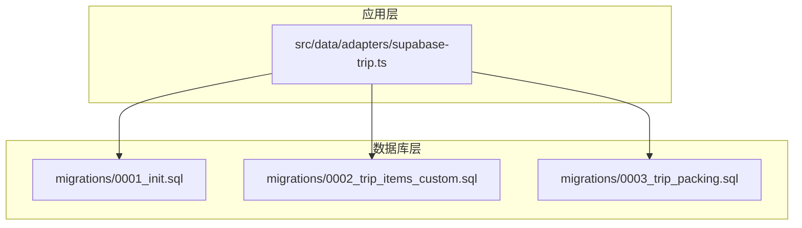
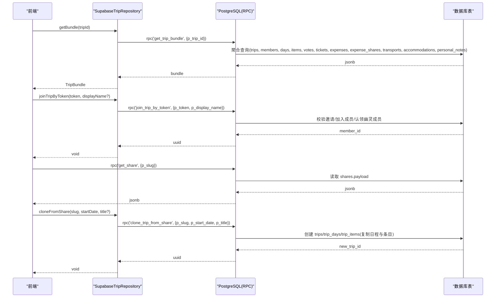
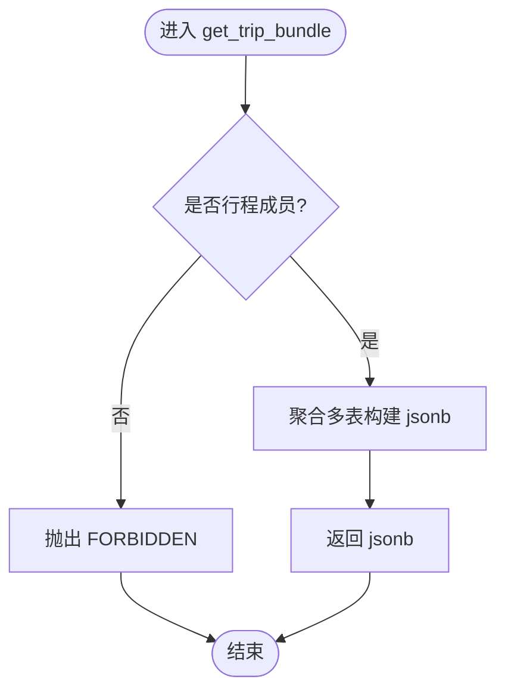
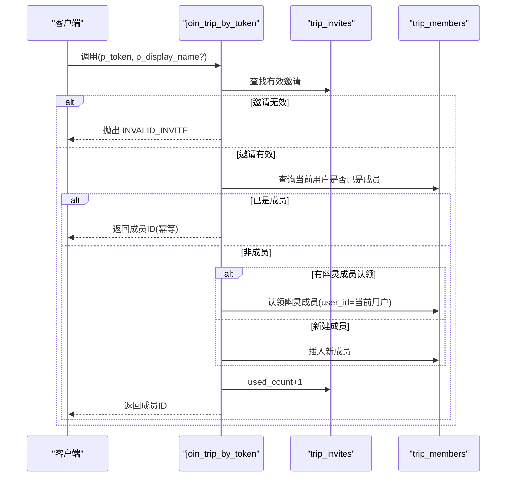
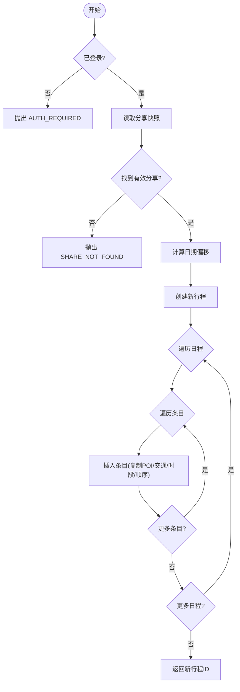
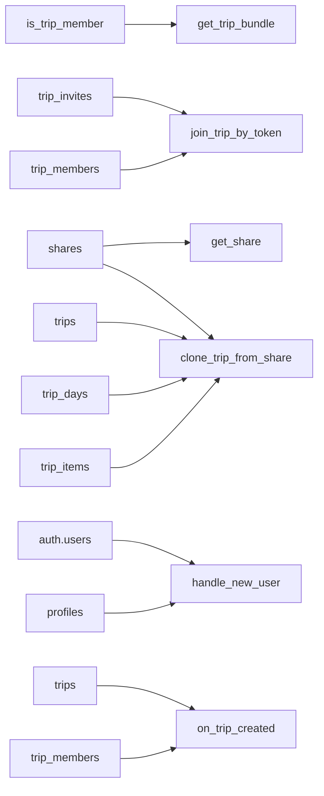

# 数据库函数与存储过程

<cite>
**本文引用的文件**
- [supabase/migrations/0001_init.sql](file://supabase/migrations/0001_init.sql)
- [supabase/migrations/0002_trip_items_custom.sql](file://supabase/migrations/0002_trip_items_custom.sql)
- [supabase/migrations/0003_trip_packing.sql](file://supabase/migrations/0003_trip_packing.sql)
- [src/data/adapters/supabase-trip.ts](file://src/data/adapters/supabase-trip.ts)
</cite>

## 目录
1. [简介](#简介)
2. [项目结构](#项目结构)
3. [核心组件](#核心组件)
4. [架构总览](#架构总览)
5. [详细组件分析](#详细组件分析)
6. [依赖关系分析](#依赖关系分析)
7. [性能考量](#性能考量)
8. [故障排查指南](#故障排查指南)
9. [结论](#结论)
10. [附录：调用示例](#附录：调用示例)

## 简介
本文件为“玩无一失”的数据库函数与存储过程提供权威文档，覆盖以下核心 RPC 与触发器：
- get_trip_bundle：一次性聚合返回行程全量数据（成员校验、多表聚合）
- join_trip_by_token：凭邀请令牌加入行程（支持认领幽灵成员、幂等）
- get_share：按 slug 匿名读取分享快照（精确匹配、不可枚举）
- clone_trip_from_share：从分享快照克隆为新行程（事务内复制日程与条目）
- ping：保活函数（供定时任务或健康检查使用）
- handle_new_user：新用户自动创建资料
- on_trip_created：创建行程后自动将所有者添加为成员

同时说明权限控制（RLS + SECURITY DEFINER）、错误处理机制、以及前端调用路径与性能优化建议。

## 项目结构
- 数据库层：Supabase SQL 迁移脚本集中定义表、索引、RLS 策略、RPC 与触发器
- 应用层：前端通过 Supabase JS SDK 调用 RPC 或直接操作表；适配器封装了与数据库交互的细节

图表来源
- [supabase/migrations/0001_init.sql:393-525](file://supabase/migrations/0001_init.sql#L393-L525)
- [supabase/migrations/0002_trip_items_custom.sql:21-67](file://supabase/migrations/0002_trip_items_custom.sql#L21-L67)
- [supabase/migrations/0003_trip_packing.sql:1-21](file://supabase/migrations/0003_trip_packing.sql#L1-L21)
- [src/data/adapters/supabase-trip.ts:150-198](file://src/data/adapters/supabase-trip.ts#L150-L198)

章节来源
- [supabase/migrations/0001_init.sql:393-525](file://supabase/migrations/0001_init.sql#L393-L525)
- [src/data/adapters/supabase-trip.ts:150-198](file://src/data/adapters/supabase-trip.ts#L150-L198)

## 核心组件
本节聚焦五个核心 RPC 与两个关键触发器，逐一说明参数、返回值、权限与错误处理。

- get_trip_bundle(p_trip_id uuid) → jsonb
  - 功能：以安全定义者模式聚合 trips、trip_members、trip_days、trip_items、item_votes、tickets、expenses、expense_shares、transports、accommodations、personal_notes 等表，一次返回完整行程数据
  - 权限：仅成员可访问；非成员抛出 FORBIDDEN
  - 错误：FORBIDDEN（未授权）
  - 前端调用：通过 Supabase RPC 调用，失败时若包含 FORBIDDEN 则提示登录

- join_trip_by_token(p_token text, p_display_name text = null) → uuid
  - 功能：验证邀请令牌有效性（未过期、未超次数），加入成员；支持认领幽灵成员并继承其历史；幂等重复加入直接返回已有成员 ID；自增 used_count
  - 权限：仅已认证用户可执行
  - 错误：INVALID_INVITE（令牌无效/过期/已达上限）
  - 前端调用：通过 RPC 调用，错误直接向上抛出

- get_share(p_slug text) → jsonb
  - 功能：按 slug 精确匹配读取分享快照 payload，且仅当未被撤销（revoked_at is null）
  - 权限：匿名与已认证均可执行
  - 错误：无行返回即视为不存在（不抛错）

- clone_trip_from_share(p_slug text, p_start_date date, p_title text = null) → uuid
  - 功能：在事务中基于分享快照创建新行程，复制日程与条目（仅复制 POI 引用、交通字段、时段与顺序；票券/账本/个人笔记不复制；状态重置为候选），计算日期偏移并回填 source 信息
  - 权限：仅已认证用户可执行
  - 错误：AUTH_REQUIRED（未登录）、SHARE_NOT_FOUND（分享不存在或被撤销）

- ping() → text
  - 功能：简单保活，返回固定文本
  - 权限：匿名可执行

- handle_new_user() 触发器
  - 触发时机：auth.users 插入后
  - 行为：在 profiles 表中插入/忽略冲突的用户资料，display_name 优先取 raw_user_meta_data.display_name，否则取邮箱前缀，默认“旅行者”

- on_trip_created() 触发器
  - 触发时机：trips 插入后
  - 行为：将 owner 自动添加为 trip_members，角色为 owner，显示名取自 profiles

章节来源
- [supabase/migrations/0001_init.sql:34-46](file://supabase/migrations/0001_init.sql#L34-L46)
- [supabase/migrations/0001_init.sql:84-95](file://supabase/migrations/0001_init.sql#L84-L95)
- [supabase/migrations/0001_init.sql:393-429](file://supabase/migrations/0001_init.sql#L393-L429)
- [supabase/migrations/0001_init.sql:432-465](file://supabase/migrations/0001_init.sql#L432-L465)
- [supabase/migrations/0001_init.sql:468-474](file://supabase/migrations/0001_init.sql#L468-L474)
- [supabase/migrations/0001_init.sql:477-520](file://supabase/migrations/0001_init.sql#L477-L520)
- [supabase/migrations/0001_init.sql:523-525](file://supabase/migrations/0001_init.sql#L523-L525)
- [supabase/migrations/0002_trip_items_custom.sql:21-67](file://supabase/migrations/0002_trip_items_custom.sql#L21-L67)

## 架构总览
下图展示前端如何通过适配器调用后端 RPC，以及各 RPC 与数据库表的交互关系。

图表来源
- [src/data/adapters/supabase-trip.ts:150-198](file://src/data/adapters/supabase-trip.ts#L150-L198)
- [src/data/adapters/supabase-trip.ts:366-413](file://src/data/adapters/supabase-trip.ts#L366-L413)
- [supabase/migrations/0001_init.sql:393-525](file://supabase/migrations/0001_init.sql#L393-L525)

## 详细组件分析

### get_trip_bundle：聚合查询函数
- 参数
  - p_trip_id: uuid，目标行程 ID
- 返回值
  - jsonb，包含 trip、members、days、items、votes、tickets、expenses、expenseSharges、transports、accommodations、myNotes 等键
- 权限控制
  - 使用 SECURITY DEFINER 并以 public.is_trip_member 校验成员身份；非成员抛出 FORBIDDEN
- 错误处理
  - FORBIDDEN：未通过成员校验
- 性能要点
  - 单次 RPC 聚合多表，减少多次往返
  - 使用 to_jsonb(t) 投影整行，便于后续新增列无需修改 RPC 投影
- 前端集成
  - 适配器调用 RPC，若错误消息包含 FORBIDDEN 则提示登录；否则解析为 TripBundle

图表来源
- [supabase/migrations/0001_init.sql:393-429](file://supabase/migrations/0001_init.sql#L393-L429)

章节来源
- [supabase/migrations/0001_init.sql:393-429](file://supabase/migrations/0001_init.sql#L393-L429)
- [src/data/adapters/supabase-trip.ts:150-198](file://src/data/adapters/supabase-trip.ts#L150-L198)

### join_trip_by_token：邀请加入函数
- 参数
  - p_token: text，邀请令牌
  - p_display_name: text（可选），认领时的显示名
- 返回值
  - uuid，新加入或认领的成员 ID
- 权限控制
  - 仅已认证用户可执行
- 错误处理
  - INVALID_INVITE：令牌不存在、已过期或达到最大使用次数
- 业务逻辑
  - 校验邀请有效性
  - 若当前用户已是成员，幂等返回成员 ID
  - 若邀请指定 claim_member_id（幽灵成员），更新 user_id 并设置 display_name
  - 否则插入新成员
  - 增加 used_count

图表来源
- [supabase/migrations/0001_init.sql:432-465](file://supabase/migrations/0001_init.sql#L432-L465)

章节来源
- [supabase/migrations/0001_init.sql:432-465](file://supabase/migrations/0001_init.sql#L432-L465)
- [src/data/adapters/supabase-trip.ts:366-413](file://src/data/adapters/supabase-trip.ts#L366-L413)

### get_share：分享读取函数
- 参数
  - p_slug: text，分享唯一标识
- 返回值
  - jsonb，分享快照 payload（仅当未被撤销）
- 权限控制
  - 匿名与已认证均可执行
- 错误处理
  - 无行返回表示分享不存在或已被撤销（不抛错）

章节来源
- [supabase/migrations/0001_init.sql:468-474](file://supabase/migrations/0001_init.sql#L468-L474)

### clone_trip_from_share：克隆行程函数
- 参数
  - p_slug: text，分享标识
  - p_start_date: date，新行程起始日期
  - p_title: text（可选），新行程标题
- 返回值
  - uuid，新创建的行程 ID
- 权限控制
  - 仅已认证用户可执行
- 错误处理
  - AUTH_REQUIRED：未登录
  - SHARE_NOT_FOUND：分享不存在或已被撤销
- 业务逻辑
  - 读取分享快照，计算日期偏移
  - 创建新行程，记录来源信息
  - 遍历日程与条目，复制 POI 引用、交通字段、时段与顺序；状态重置为候选；不复制票券/账本/个人笔记
  - 返回新行程 ID

图表来源
- [supabase/migrations/0001_init.sql:477-520](file://supabase/migrations/0001_init.sql#L477-L520)
- [supabase/migrations/0002_trip_items_custom.sql:21-67](file://supabase/migrations/0002_trip_items_custom.sql#L21-L67)

章节来源
- [supabase/migrations/0001_init.sql:477-520](file://supabase/migrations/0001_init.sql#L477-L520)
- [supabase/migrations/0002_trip_items_custom.sql:21-67](file://supabase/migrations/0002_trip_items_custom.sql#L21-L67)

### ping：保活函数
- 参数：无
- 返回值：text，固定值
- 权限：匿名可执行
- 用途：供定时任务或健康检查保持服务活跃

章节来源
- [supabase/migrations/0001_init.sql:523-525](file://supabase/migrations/0001_init.sql#L523-L525)

### 触发器：handle_new_user 与 on_trip_created
- handle_new_user
  - 触发：auth.users 插入后
  - 行为：在 profiles 插入/忽略冲突，display_name 优先级：raw_user_meta_data.display_name > 邮箱前缀 > 默认“旅行者”
- on_trip_created
  - 触发：trips 插入后
  - 行为：将 owner 自动添加为 trip_members，角色为 owner，显示名来自 profiles

章节来源
- [supabase/migrations/0001_init.sql:34-46](file://supabase/migrations/0001_init.sql#L34-L46)
- [supabase/migrations/0001_init.sql:84-95](file://supabase/migrations/0001_init.sql#L84-L95)

## 依赖关系分析
- 函数间依赖
  - get_trip_bundle 依赖 is_trip_member 进行成员校验
  - join_trip_by_token 依赖 trip_invites 与 trip_members 表
  - clone_trip_from_share 依赖 shares 表及 trips/trip_days/trip_items 表
  - get_share 依赖 shares 表
  - ping 无依赖
- 触发器依赖
  - handle_new_user 依赖 auth.users 与 profiles
  - on_trip_created 依赖 trips 与 trip_members
- 前端依赖
  - 适配器通过 Supabase JS SDK 调用 RPC 或直接操作表

图表来源
- [supabase/migrations/0001_init.sql:290-304](file://supabase/migrations/0001_init.sql#L290-L304)
- [supabase/migrations/0001_init.sql:393-525](file://supabase/migrations/0001_init.sql#L393-L525)
- [supabase/migrations/0001_init.sql:34-46](file://supabase/migrations/0001_init.sql#L34-L46)
- [supabase/migrations/0001_init.sql:84-95](file://supabase/migrations/0001_init.sql#L84-L95)

章节来源
- [supabase/migrations/0001_init.sql:290-304](file://supabase/migrations/0001_init.sql#L290-L304)
- [supabase/migrations/0001_init.sql:393-525](file://supabase/migrations/0001_init.sql#L393-L525)

## 性能考量
- 使用 get_trip_bundle 聚合查询，显著减少前端多次往返请求
- 使用 to_jsonb(t) 投影整行，便于后续新增列无需修改 RPC 投影
- 对 trip_items.kind 建立索引，便于按类型过滤（如交通段）
- 使用 SECURITY DEFINER 避免递归 RLS 带来的额外开销
- 对频繁访问的表（如 trips、trip_items、expenses）已建立必要索引
- 分享读取 get_share 仅返回 payload，避免冗余字段传输

[本节为通用性能建议，不直接分析具体代码]

## 故障排查指南
- FORBIDDEN（get_trip_bundle）
  - 原因：调用者不是行程成员
  - 处理：提示登录或检查成员关系
- INVALID_INVITE（join_trip_by_token）
  - 原因：令牌不存在、已过期或达到最大使用次数
  - 处理：重新生成邀请链接或检查有效期与次数限制
- AUTH_REQUIRED（clone_trip_from_share）
  - 原因：未登录
  - 处理：引导用户登录
- SHARE_NOT_FOUND（clone_trip_from_share）
  - 原因：分享不存在或已被撤销
  - 处理：确认分享链接有效
- 触发器异常
  - handle_new_user：检查 auth.users 插入流程与 profiles 表约束
  - on_trip_created：检查 trips 插入流程与 trip_members 外键约束

章节来源
- [supabase/migrations/0001_init.sql:393-429](file://supabase/migrations/0001_init.sql#L393-L429)
- [supabase/migrations/0001_init.sql:432-465](file://supabase/migrations/0001_init.sql#L432-L465)
- [supabase/migrations/0001_init.sql:477-520](file://supabase/migrations/0001_init.sql#L477-L520)

## 结论
本项目的数据库函数与触发器围绕“行程协作”的核心场景设计，通过 SECURITY DEFINER 与 RLS 实现细粒度权限控制，利用聚合 RPC 提升性能，并通过触发器简化常见自动化流程。前端适配器统一封装调用细节，使上层业务更简洁可靠。

[本节为总结性内容，不直接分析具体代码]

## 附录：调用示例
以下为典型调用方式（概念性示例，实际参数与返回值以函数定义为准）：
- 获取行程全量数据
  - 调用：rpc('get_trip_bundle', { p_trip_id })
  - 成功：返回 jsonb 包含行程与关联数据
  - 失败：包含 FORBIDDEN 时提示登录
- 加入行程
  - 调用：rpc('join_trip_by_token', { p_token, p_display_name? })
  - 成功：返回成员 ID
  - 失败：INVALID_INVITE
- 读取分享
  - 调用：rpc('get_share', { p_slug })
  - 成功：返回 jsonb payload
  - 失败：无行返回
- 克隆行程
  - 调用：rpc('clone_trip_from_share', { p_slug, p_start_date, p_title? })
  - 成功：返回新行程 ID
  - 失败：AUTH_REQUIRED 或 SHARE_NOT_FOUND
- 保活
  - 调用：rpc('ping')
  - 成功：返回固定文本

章节来源
- [src/data/adapters/supabase-trip.ts:150-198](file://src/data/adapters/supabase-trip.ts#L150-L198)
- [src/data/adapters/supabase-trip.ts:366-413](file://src/data/adapters/supabase-trip.ts#L366-L413)
- [supabase/migrations/0001_init.sql:393-525](file://supabase/migrations/0001_init.sql#L393-L525)