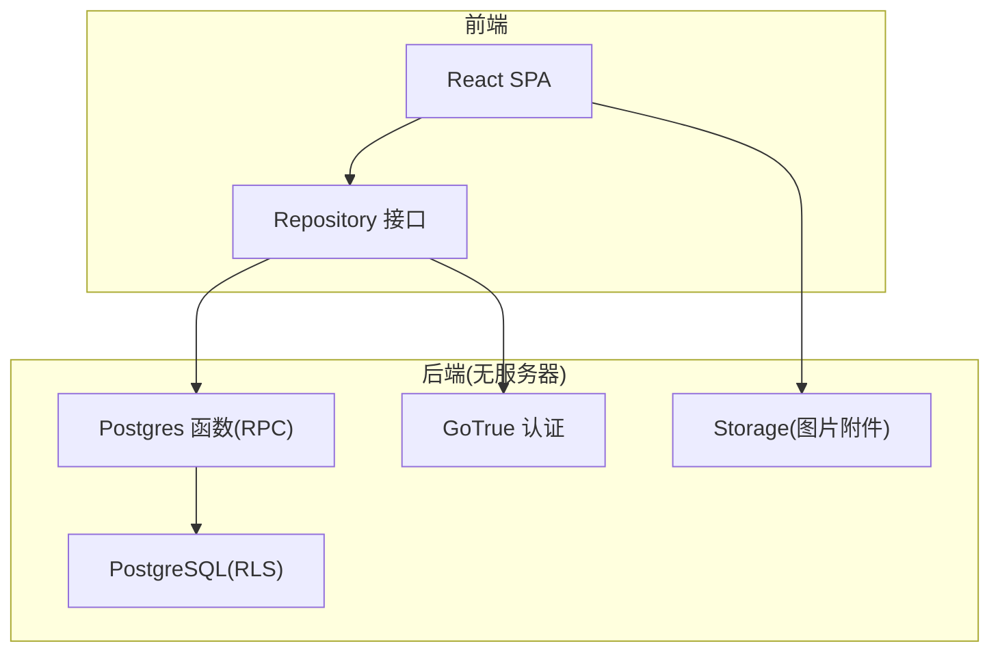
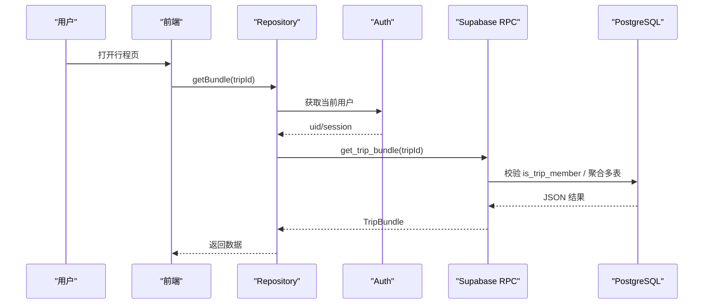
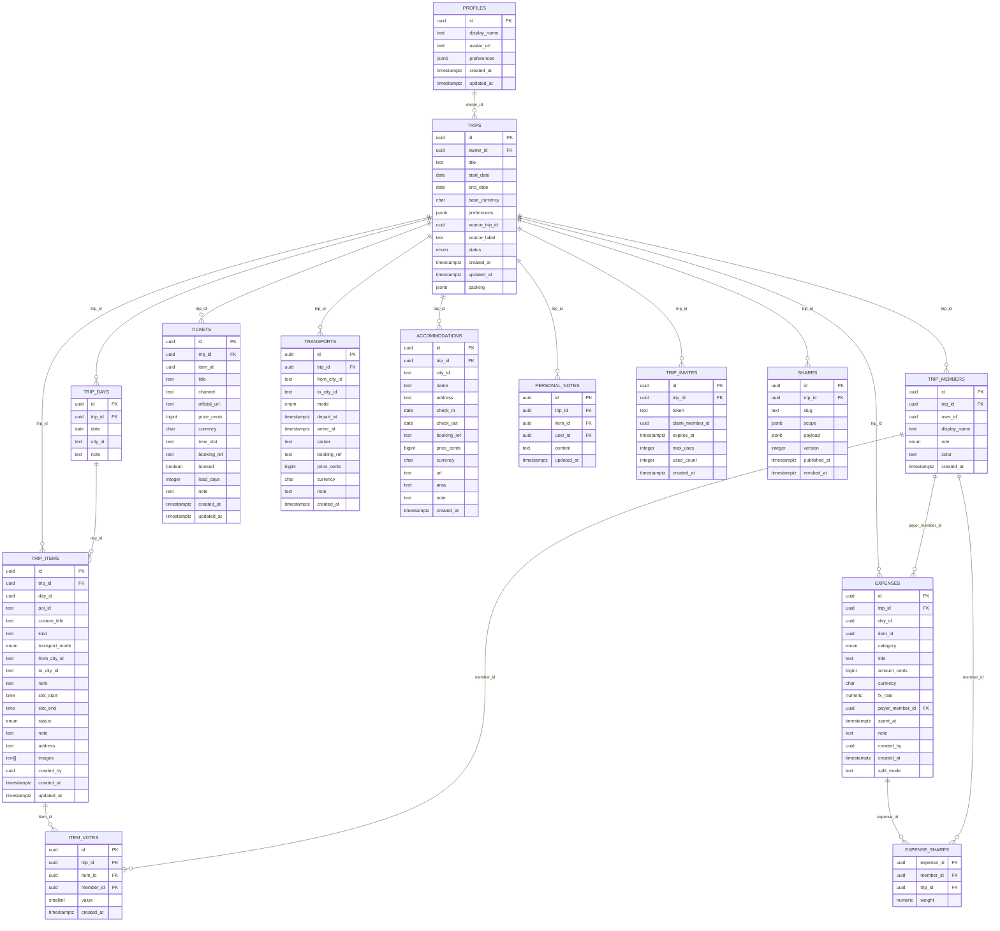
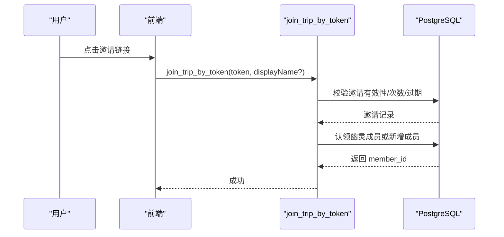
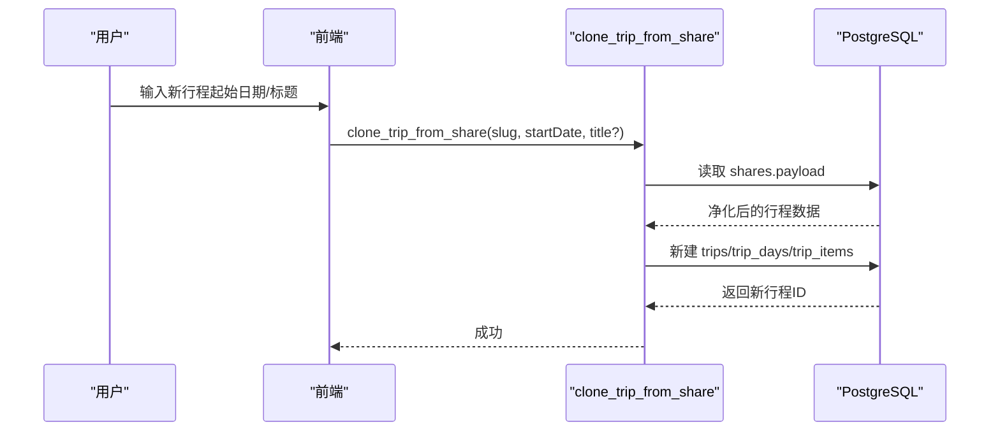

# 数据库设计

<cite>
**本文引用的文件**
- [supabase/migrations/0001_init.sql](file://supabase/migrations/0001_init.sql)
- [supabase/migrations/0002_trip_items_custom.sql](file://supabase/migrations/0002_trip_items_custom.sql)
- [supabase/migrations/0003_trip_packing.sql](file://supabase/migrations/0003_trip_packing.sql)
- [supabase/migrations/0004_expense_split_mode.sql](file://supabase/migrations/0004_expense_split_mode.sql)
- [supabase/migrations/0005_trip_item_images.sql](file://supabase/migrations/0005_trip_item_images.sql)
- [supabase/migrations/0007_trip_item_address.sql](file://supabase/migrations/0007_trip_item_address.sql)
- [supabase/apply_attachments.sql](file://supabase/apply_attachments.sql)
- [src/data/types.ts](file://src/data/types.ts)
- [docs/技术方案.md](file://docs/技术方案.md)
- [src/features/trip/queries.ts](file://src/features/trip/queries.ts)
</cite>

## 目录
1. [简介](#简介)
2. [项目结构](#项目结构)
3. [核心组件](#核心组件)
4. [架构总览](#架构总览)
5. [详细组件分析](#详细组件分析)
6. [依赖关系分析](#依赖关系分析)
7. [性能与索引优化](#性能与索引优化)
8. [行级安全、认证与数据隔离](#行级安全认证与数据隔离)
9. [迁移脚本管理](#迁移脚本管理)
10. [备份与恢复策略](#备份与恢复策略)
11. [性能监控方案](#性能监控方案)
12. [SQL 查询示例与最佳实践](#sql-查询示例与最佳实践)
13. [故障排查指南](#故障排查指南)
14. [结论](#结论)

## 简介
本文件面向“玩无一失”的数据库设计与实现，聚焦 PostgreSQL（Supabase）表结构设计、实体关系映射、索引与约束、行级安全策略、认证流程与数据隔离机制；并给出迁移脚本管理、备份恢复策略、性能监控方案以及常用 SQL 查询示例与最佳实践。目标是让读者在不深入代码细节的情况下，也能理解并维护该系统的数据库层。

## 项目结构
本项目采用“静态世界库 + 运行时行程数据”的双轨架构：
- 世界库（城市、国家、POI）以 JSON 形式随仓库发布，构建期生成索引供前端使用。
- 行程相关数据（用户、行程、成员、条目、票券、账本、住宿交通等）存储在 Supabase Postgres，通过 RLS 与 RPC 提供安全访问。

图表来源
- [docs/技术方案.md:62-125](file://docs/技术方案.md#L62-L125)
- [supabase/migrations/0001_init.sql:288-525](file://supabase/migrations/0001_init.sql#L288-L525)

章节来源
- [docs/技术方案.md:62-125](file://docs/技术方案.md#L62-L125)

## 核心组件
- 用户与资料：profiles（扩展 auth.users），仅本人可读写。
- 行程与成员：trips、trip_members（支持幽灵成员）。
- 日程与条目：trip_days、trip_items（含 kind/transport_mode/address/images）、item_votes。
- 票券：tickets（半敏感字段不进入分享快照）。
- 账本：expenses、expense_shares（金额整数分、汇率换算、分摊权重）。
- 交通与住宿：transports、accommodations（签证行程单必需）。
- 个人笔记：personal_notes（仅本人可见）。
- 邀请与分享：trip_invites、shares（匿名只读经 RPC get_share）。
- 存储：trip-attachments bucket（公开读，已登录写/删）。

章节来源
- [supabase/migrations/0001_init.sql:25-267](file://supabase/migrations/0001_init.sql#L25-L267)
- [supabase/migrations/0002_trip_items_custom.sql:11-15](file://supabase/migrations/0002_trip_items_custom.sql#L11-L15)
- [supabase/migrations/0003_trip_packing.sql:13-16](file://supabase/migrations/0003_trip_packing.sql#L13-L16)
- [supabase/migrations/0004_expense_split_mode.sql:6-8](file://supabase/migrations/0004_expense_split_mode.sql#L6-L8)
- [supabase/migrations/0005_trip_item_images.sql:10-11](file://supabase/migrations/0005_trip_item_images.sql#L10-L11)
- [supabase/migrations/0007_trip_item_address.sql:10-11](file://supabase/migrations/0007_trip_item_address.sql#L10-L11)
- [supabase/apply_attachments.sql:15-83](file://supabase/apply_attachments.sql#L15-L83)

## 架构总览
系统通过 Repository 抽象数据访问，前端不直接操作数据库；所有权限判定在数据库侧（RLS + SECURITY DEFINER 函数），RPC 封装复杂业务（如一次性取回行程全量数据、凭 token 加入行程、匿名读取分享快照、从分享克隆行程）。

图表来源
- [supabase/migrations/0001_init.sql:393-429](file://supabase/migrations/0001_init.sql#L393-L429)
- [src/features/trip/queries.ts:22-29](file://src/features/trip/queries.ts#L22-L29)

## 详细组件分析

### 实体关系图（ER）

图表来源
- [supabase/migrations/0001_init.sql:25-267](file://supabase/migrations/0001_init.sql#L25-L267)
- [supabase/migrations/0002_trip_items_custom.sql:11-15](file://supabase/migrations/0002_trip_items_custom.sql#L11-L15)
- [supabase/migrations/0003_trip_packing.sql:13-16](file://supabase/migrations/0003_trip_packing.sql#L13-L16)
- [supabase/migrations/0004_expense_split_mode.sql:6-8](file://supabase/migrations/0004_expense_split_mode.sql#L6-L8)
- [supabase/migrations/0005_trip_item_images.sql:10-11](file://supabase/migrations/0005_trip_item_images.sql#L10-L11)
- [supabase/migrations/0007_trip_item_address.sql:10-11](file://supabase/migrations/0007_trip_item_address.sql#L10-L11)

### 关键业务流程时序

#### 凭邀请加入行程

图表来源
- [supabase/migrations/0001_init.sql:432-465](file://supabase/migrations/0001_init.sql#L432-L465)

#### 从分享克隆行程

图表来源
- [supabase/migrations/0001_init.sql:477-520](file://supabase/migrations/0001_init.sql#L477-L520)
- [supabase/migrations/0002_trip_items_custom.sql:21-67](file://supabase/migrations/0002_trip_items_custom.sql#L21-L67)

### 类型与列映射
- 前端类型定义与数据库列一一对应（camelCase ↔ snake_case），便于切换数据源时零改动。
- 关键字段：金额用整数分；时间用 date/time/timestamptz；JSONB 用于偏好、打包清单、分享范围等。

章节来源
- [src/data/types.ts:83-239](file://src/data/types.ts#L83-L239)
- [supabase/migrations/0001_init.sql:25-267](file://supabase/migrations/0001_init.sql#L25-L267)

## 依赖关系分析
- 子表冗余 trip_id 以简化 RLS 判断，避免在策略中做复杂 join。
- trip_members 是投票与账本的主体，解耦了账号与身份（幽灵成员）。
- personal_notes 仅本人可见，不参与分享快照。
- shares 表对匿名不可直接访问，唯一入口为 get_share(slug)。

章节来源
- [docs/技术方案.md:325-357](file://docs/技术方案.md#L325-L357)
- [supabase/migrations/0001_init.sql:288-386](file://supabase/migrations/0001_init.sql#L288-L386)

## 性能与索引优化
- 主键：所有表均使用 UUID 主键，天然分布式友好。
- 常用查询索引：
  - trips.owner_id 加速按用户筛选行程。
  - trip_items.trip_id、trip_items.day_id+rank 加速按天排序与候选池查询。
  - expenses.trip_id、expense_shares.trip_id 加速账本聚合。
  - transports/accommodations.trip_id 加速签证行程单导出。
  - personal_notes.user_id+trip_id 加速个人笔记查询。
  - trip_items.kind 加速交通/备注过滤。
- 更新触发器：自动维护 updated_at，便于乐观锁与审计。
- 批量读取：get_trip_bundle 一次聚合多表，减少往返延迟。

章节来源
- [supabase/migrations/0001_init.sql:65-229](file://supabase/migrations/0001_init.sql#L65-L229)
- [supabase/migrations/0002_trip_items_custom.sql:69-70](file://supabase/migrations/0002_trip_items_custom.sql#L69-L70)
- [supabase/migrations/0001_init.sql:272-285](file://supabase/migrations/0001_init.sql#L272-L285)
- [supabase/migrations/0001_init.sql:393-429](file://supabase/migrations/0001_init.sql#L393-L429)

## 行级安全、认证与数据隔离
- 认证：邮箱+密码，会话持久化；登录态闪烁由前端处理。
- RLS：
  - profiles：仅本人读写。
  - trips：成员可读；仅 owner 可创建/删除；成员可更新。
  - trip_members：成员可读；仅 owner 可增删改（加入走 RPC）。
  - 行程子表：统一模板“成员可读写”。
  - personal_notes：仅本人（且必须是行程成员）。
  - trip_invites：成员可读；匿名不可读。
  - shares：仅 owner 管理；匿名经 RPC 精确读取。
- 防递归：is_trip_member/is_trip_owner 使用 SECURITY DEFINER 绕过 RLS 递归。
- 数据隔离：幽灵成员可被引用但不具备登录能力；个人笔记互不可见；分享快照不含敏感信息。

章节来源
- [supabase/migrations/0001_init.sql:288-386](file://supabase/migrations/0001_init.sql#L288-L386)
- [docs/技术方案.md:432-599](file://docs/技术方案.md#L432-L599)

## 迁移脚本管理
- 迁移文件位于 supabase/migrations，命名有序，幂等执行（if not exists / drop if exists）。
- 0001 初始化：建表、枚举、触发器、RLS、RPC。
- 后续增量：
  - 0002：trip_items 增加 kind/transport_mode/from_city_id/to_city_id，并重写克隆逻辑。
  - 0003：trips 增加 packing 列。
  - 0004：expenses 增加 split_mode。
  - 0005：trip_items 增加 images 数组。
  - 0007：trip_items 增加 address。
- apply_attachments.sql：手动在控制台执行，创建 trip-attachments bucket 与存储 RLS。

章节来源
- [supabase/migrations/0001_init.sql:1-530](file://supabase/migrations/0001_init.sql#L1-L530)
- [supabase/migrations/0002_trip_items_custom.sql:1-75](file://supabase/migrations/0002_trip_items_custom.sql#L1-L75)
- [supabase/migrations/0003_trip_packing.sql:1-21](file://supabase/migrations/0003_trip_packing.sql#L1-L21)
- [supabase/migrations/0004_expense_split_mode.sql:1-9](file://supabase/migrations/0004_expense_split_mode.sql#L1-L9)
- [supabase/migrations/0005_trip_item_images.sql:1-12](file://supabase/migrations/0005_trip_item_images.sql#L1-L12)
- [supabase/migrations/0007_trip_item_address.sql:1-12](file://supabase/migrations/0007_trip_item_address.sql#L1-L12)
- [supabase/apply_attachments.sql:1-83](file://supabase/apply_attachments.sql#L1-L83)

## 备份与恢复策略
- 免费档无自动备份：建议通过 CI/定时任务定期导出关键表为 JSON 提交到私有分支。
- 保活：定时调用 ping() 防止闲置暂停。
- 恢复：基于仓库中的迁移脚本重建数据库，再导入历史 JSON 备份。

章节来源
- [docs/技术方案.md:1120-1125](file://docs/技术方案.md#L1120-L1125)
- [supabase/migrations/0001_init.sql:523-525](file://supabase/migrations/0001_init.sql#L523-L525)

## 性能监控方案
- 查询缓存：TanStack Query 配置 staleTime，减少重复请求。
- 批量读取：get_trip_bundle 降低往返次数。
- 乐观更新：前端 onMutate 即时更新缓存，失败回滚。
- 连接与节点：注意 Supabase 节点延迟，必要时调整重试与超时。
- 日志与审计：updated_at 与 created_by 辅助定位问题。

章节来源
- [src/features/trip/queries.ts:22-29](file://src/features/trip/queries.ts#L22-L29)
- [src/features/trip/queries.ts:45-63](file://src/features/trip/queries.ts#L45-L63)
- [supabase/migrations/0001_init.sql:393-429](file://supabase/migrations/0001_init.sql#L393-L429)

## SQL 查询示例与最佳实践
以下示例描述查询意图与关键条件，具体语句请参考对应迁移文件的函数与表结构。

- 一次性取回行程全量数据
  - 目的：减少多次往返，提升首屏加载速度。
  - 参考路径：[supabase/migrations/0001_init.sql:393-429](file://supabase/migrations/0001_init.sql#L393-L429)

- 凭邀请加入行程
  - 目的：校验邀请有效性、认领幽灵成员或新增成员。
  - 参考路径：[supabase/migrations/0001_init.sql:432-465](file://supabase/migrations/0001_init.sql#L432-L465)

- 匿名读取分享快照
  - 目的：按 slug 精确读取，不可枚举。
  - 参考路径：[supabase/migrations/0001_init.sql:468-474](file://supabase/migrations/0001_init.sql#L468-L474)

- 从分享克隆行程
  - 目的：将净化后的快照复制为新行程（仅复制 POI/交通/时段与顺序，不复制票券/账本/个人笔记）。
  - 参考路径：[supabase/migrations/0001_init.sql:477-520](file://supabase/migrations/0001_init.sql#L477-L520), [supabase/migrations/0002_trip_items_custom.sql:21-67](file://supabase/migrations/0002_trip_items_custom.sql#L21-L67)

- 预算与分摊计算（概念）
  - 金额一律整数分；按权重拆分，保证总额一致；净额结算校验总和为零。
  - 参考路径：[docs/技术方案.md:775-800](file://docs/技术方案.md#L775-L800)

最佳实践
- 所有写操作带 updated_at 比较，实现乐观锁。
- 敏感字段（booking_ref）不进入分享快照。
- 使用事务包裹复杂写入（如克隆行程）。
- 索引优先覆盖高频查询条件（trip_id、kind、user_id+trip_id）。

章节来源
- [supabase/migrations/0001_init.sql:393-525](file://supabase/migrations/0001_init.sql#L393-L525)
- [supabase/migrations/0002_trip_items_custom.sql:21-67](file://supabase/migrations/0002_trip_items_custom.sql#L21-L67)
- [docs/技术方案.md:775-800](file://docs/技术方案.md#L775-L800)

## 故障排查指南
- 无法读取自己刚创建的行程
  - 原因：创建后 owner 还不是成员。
  - 解决：触发器 on_trip_created 自动添加 owner 为成员。
  - 参考路径：[supabase/migrations/0001_init.sql:84-95](file://supabase/migrations/0001_init.sql#L84-L95)

- 分享页面匿名访问报错
  - 原因：未通过 RPC 读取 shares。
  - 解决：使用 get_share(slug) 精确读取。
  - 参考路径：[supabase/migrations/0001_init.sql:468-474](file://supabase/migrations/0001_init.sql#L468-L474)

- 图片上传失败
  - 原因：未应用 attachements 脚本或未登录。
  - 解决：执行 apply_attachments.sql，确保已登录。
  - 参考路径：[supabase/apply_attachments.sql:15-83](file://supabase/apply_attachments.sql#L15-L83)

- 账本分摊误差
  - 原因：浮点运算导致误差。
  - 解决：金额一律整数分，使用 splitCents 算法分配余数。
  - 参考路径：[docs/技术方案.md:775-800](file://docs/技术方案.md#L775-L800)

章节来源
- [supabase/migrations/0001_init.sql:84-95](file://supabase/migrations/0001_init.sql#L84-L95)
- [supabase/migrations/0001_init.sql:468-474](file://supabase/migrations/0001_init.sql#L468-L474)
- [supabase/apply_attachments.sql:15-83](file://supabase/apply_attachments.sql#L15-L83)
- [docs/技术方案.md:775-800](file://docs/技术方案.md#L775-L800)

## 结论
本数据库设计围绕“零成本、高可靠、易维护”的目标，采用严格的 RLS 与 RPC 边界、合理的冗余与索引、以及幂等的迁移脚本，确保在免费托管环境下稳定运行。通过一次性批量读取、乐观更新与完善的备份恢复策略，兼顾性能与数据安全。建议在后续演进中持续完善监控与测试，确保“万无一失”的承诺。