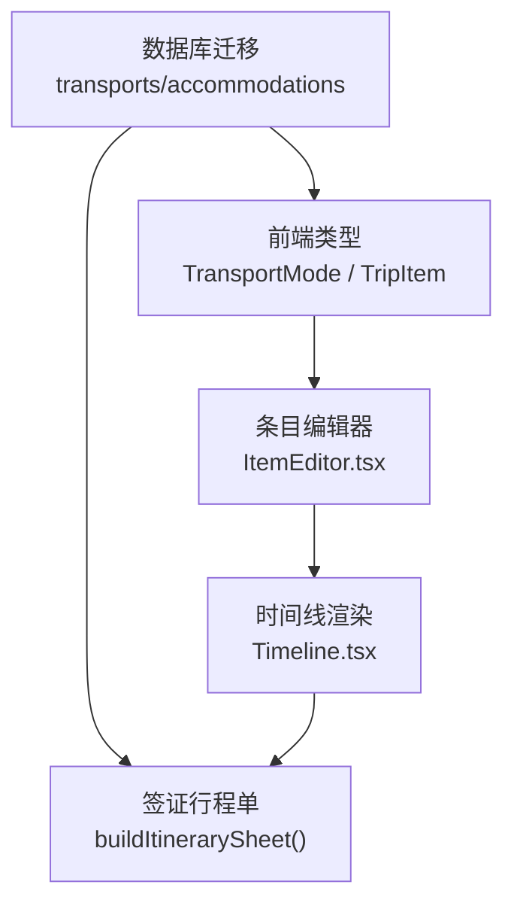
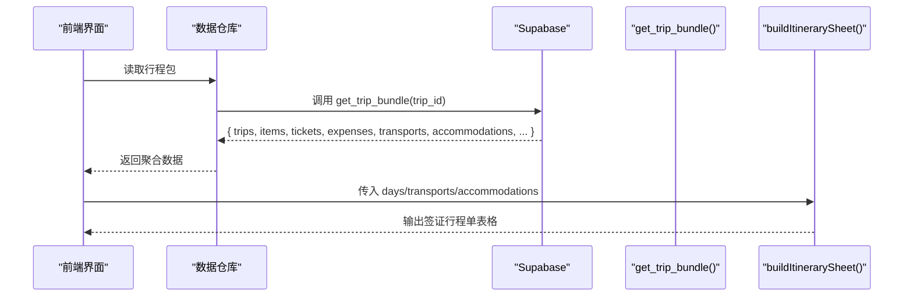
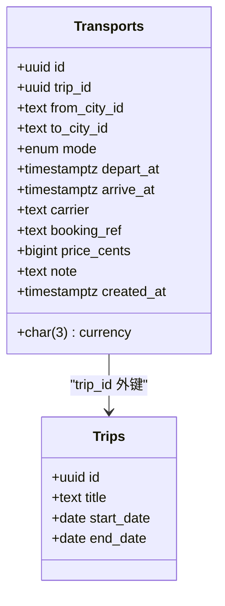
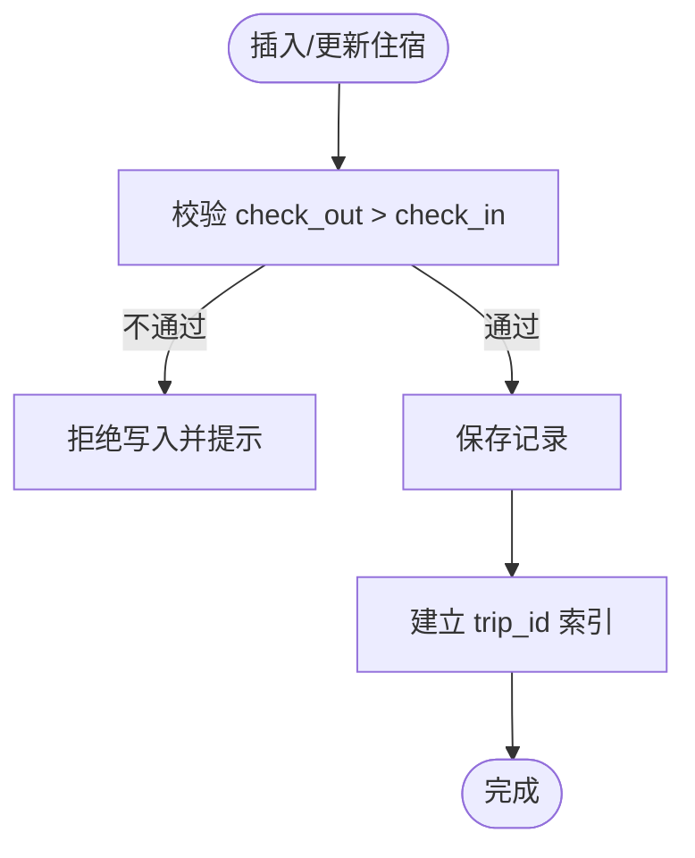
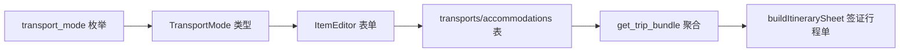

# 出行物流表

<cite>
**本文引用的文件**
- [supabase/migrations/0001_init.sql](file://supabase/migrations/0001_init.sql)
- [src/data/types.ts](file://src/data/types.ts)
- [src/features/trip/ItemEditor.tsx](file://src/features/trip/ItemEditor.tsx)
- [src/domain/visa/destination-country.ts](file://src/domain/visa/destination-country.ts)
- [src/features/trip/Timeline.tsx](file://src/features/trip/Timeline.tsx)
</cite>

## 目录
1. [简介](#简介)
2. [项目结构](#项目结构)
3. [核心组件](#核心组件)
4. [架构总览](#架构总览)
5. [详细组件分析](#详细组件分析)
6. [依赖关系分析](#依赖关系分析)
7. [性能考虑](#性能考虑)
8. [故障排查指南](#故障排查指南)
9. [结论](#结论)
10. [附录：录入示例与查询用法](#附录：录入示例与查询用法)

## 简介
本文件聚焦“出行物流”相关的数据模型与使用方式，围绕两张关键表展开：
- 交通表 transports：用于记录行程中的跨城/跨国移动信息，支撑时间线串联、签证行程单生成与费用统计。
- 住宿表 accommodations：用于记录每晚住宿信息，支撑签证行程单、区域展示与预订管理。

文档将说明两表的字段设计、枚举与约束、时间管理策略、与旅行规划中其他实体的关联关系，并提供数据验证规则、录入示例与查询用法。

## 项目结构
与出行物流直接相关的代码位置：
- 数据库迁移定义（表结构、索引、RLS）：supabase/migrations/0001_init.sql
- 前端类型定义（与数据库列名一一对应）：src/data/types.ts
- 条目编辑界面（交通/住宿的录入入口）：src/features/trip/ItemEditor.tsx
- 签证行程单生成逻辑（依赖交通与住宿）：src/domain/visa/destination-country.ts
- 时间线渲染（交通/住宿在时间线上的呈现）：src/features/trip/Timeline.tsx

图表来源
- [supabase/migrations/0001_init.sql:195-229](file://supabase/migrations/0001_init.sql#L195-L229)
- [src/data/types.ts:90-94](file://src/data/types.ts#L90-L94)
- [src/features/trip/ItemEditor.tsx:124-290](file://src/features/trip/ItemEditor.tsx#L124-L290)
- [src/domain/visa/destination-country.ts:99-118](file://src/domain/visa/destination-country.ts#L99-L118)
- [src/features/trip/Timeline.tsx:149-176](file://src/features/trip/Timeline.tsx#L149-L176)

章节来源
- [supabase/migrations/0001_init.sql:195-229](file://supabase/migrations/0001_init.sql#L195-L229)
- [src/data/types.ts:90-94](file://src/data/types.ts#L90-L94)

## 核心组件
- 交通表 transports：存储一次出行的交通方式、起止城市、出发/到达时间、承运方、确认号、价格与币种、备注等。通过 trip_id 与行程关联，支持按日期排序参与行程时间线与签证材料。
- 住宿表 accommodations：存储每晚住宿的名称、地址、入住/退房日期、确认号、价格与币种、区域、备注等。通过 trip_id 与行程关联，并内置入住日期校验。

章节来源
- [supabase/migrations/0001_init.sql:195-229](file://supabase/migrations/0001_init.sql#L195-L229)

## 架构总览
出行物流在系统中的角色：
- 作为行程的子实体，受行级安全（RLS）保护，仅行程成员可读写。
- 被打包进一次性获取的行程包（get_trip_bundle），随行程一起加载，便于前端渲染与导出。
- 为签证行程单提供结构化输入：每日交通与住宿信息汇总成表格。

图表来源
- [supabase/migrations/0001_init.sql:393-427](file://supabase/migrations/0001_init.sql#L393-L427)
- [src/domain/visa/destination-country.ts:99-118](file://src/domain/visa/destination-country.ts#L99-L118)

## 详细组件分析

### 交通表（transports）
- 设计要点
  - 主键 id：自增 UUID。
  - 关联 trip_id：外键指向 trips，删除级联。
  - 起止城市 from_city_id/to_city_id：文本引用世界库城市 ID（如 city-paris）。
  - 交通方式 mode：枚举 transport_mode，默认 train。
  - 时间 depart_at/arrive_at：带时区时间戳，用于排序与时间线展示。
  - 承运方 carrier：可选。
  - 预订信息 booking_ref：敏感字段，不参与分享快照。
  - 价格 price_cents/currency：金额以整数分存储，币种三字母码。
  - 备注 note：自由文本。
  - 创建时间 created_at：自动填充。
  - 索引 idx_transports_trip：按 trip_id 加速查询。
- 行为与约束
  - 通过 RLS 策略 p_transports_member 限制为行程成员可读写。
  - 在 get_trip_bundle 中按 depart_at 排序后聚合到结果集。
- 前端映射
  - 类型层 TransportMode 与数据库枚举一致。
  - ItemKind 包含 'transport'，用于时间线图标与样式区分。
  - 条目编辑器暴露方式、出发地/到达地、出发/到达时间、备注等字段。

图表来源
- [supabase/migrations/0001_init.sql:195-210](file://supabase/migrations/0001_init.sql#L195-L210)
- [supabase/migrations/0001_init.sql:51-64](file://supabase/migrations/0001_init.sql#L51-L64)

章节来源
- [supabase/migrations/0001_init.sql:195-210](file://supabase/migrations/0001_init.sql#L195-L210)
- [src/data/types.ts:90-94](file://src/data/types.ts#L90-L94)
- [src/features/trip/ItemEditor.tsx:124-223](file://src/features/trip/ItemEditor.tsx#L124-L223)
- [src/features/trip/Timeline.tsx:149-176](file://src/features/trip/Timeline.tsx#L149-L176)

### 住宿表（accommodations）
- 设计要点
  - 主键 id：自增 UUID。
  - 关联 trip_id：外键指向 trips，删除级联。
  - 城市 city_id：文本引用世界库城市 ID。
  - 名称 name：必填。
  - 地址 address：签证行程单必填项。
  - 入住 check_in/退房 check_out：日期类型，且存在约束 check_out > check_in。
  - 预订信息 booking_ref：敏感字段，不参与分享快照。
  - 价格 price_cents/currency：金额以整数分存储，币种三字母码。
  - 链接 url：可选。
  - 区域 area：隐藏酒店名时展示的区域信息。
  - 备注 note：自由文本。
  - 创建时间 created_at：自动填充。
  - 索引 idx_accommodations_trip：按 trip_id 加速查询。
- 行为与约束
  - 通过 RLS 策略 p_accommodations_member 限制为行程成员可读写。
  - 在 get_trip_bundle 中按 check_in 排序后聚合到结果集。
- 前端映射
  - 条目编辑器中住宿条目支持名称、所在城市、入住/退房时间、地址、预订信息等。
  - 地址字段支持单独复制，便于粘贴至签证材料或地图应用。

图表来源
- [supabase/migrations/0001_init.sql:212-229](file://supabase/migrations/0001_init.sql#L212-L229)

章节来源
- [supabase/migrations/0001_init.sql:212-229](file://supabase/migrations/0001_init.sql#L212-L229)
- [src/features/trip/ItemEditor.tsx:226-290](file://src/features/trip/ItemEditor.tsx#L226-L290)

### 与旅行规划中其他实体的关联
- 与行程（trips）：两表均通过 trip_id 关联，确保数据隔离与权限控制。
- 与行程天（trip_days）：虽然两表未直接外键关联 trip_days，但通过 get_trip_bundle 与前端时间线渲染，可将交通/住宿按日期组织到时间线中。
- 与条目（trip_items）：前端将交通/住宿作为条目的一种 kind（transport/accommodation）进行统一编辑与展示；数据库层面仍保留独立的 transports/accommodations 表以满足签证与财务需求。
- 与票券（tickets）：景点票务独立于交通/住宿；但两者共同构成完整的行程保障信息。
- 与费用（expenses）：交通与住宿可作为费用分类（transport/stay）的来源，便于预算与结算。

章节来源
- [supabase/migrations/0001_init.sql:51-64](file://supabase/migrations/0001_init.sql#L51-L64)
- [supabase/migrations/0001_init.sql:100-128](file://supabase/migrations/0001_init.sql#L100-L128)
- [supabase/migrations/0001_init.sql:143-160](file://supabase/migrations/0001_init.sql#L143-L160)
- [supabase/migrations/0001_init.sql:165-190](file://supabase/migrations/0001_init.sql#L165-L190)
- [src/features/trip/Timeline.tsx:149-176](file://src/features/trip/Timeline.tsx#L149-L176)

## 依赖关系分析
- 数据库层
  - 枚举 transport_mode 由迁移定义，供前端类型与业务逻辑保持一致。
  - RLS 策略对 transports/accommodations 统一采用“行程成员可读写”模板。
- 前端层
  - types.ts 中的 TransportMode 与数据库枚举一致，避免前后端不一致。
  - ItemEditor 提供交通/住宿的录入表单，并通过乐观更新提升交互体验。
  - Timeline 根据条目 kind 渲染不同图标与样式，增强可读性。
- 签证模块
  - buildItinerarySheet 接收 days、transports、accommodations，生成使馆要求的行程单表格。

图表来源
- [supabase/migrations/0001_init.sql:13-19](file://supabase/migrations/0001_init.sql#L13-L19)
- [src/data/types.ts:90-94](file://src/data/types.ts#L90-L94)
- [src/features/trip/ItemEditor.tsx:124-290](file://src/features/trip/ItemEditor.tsx#L124-L290)
- [supabase/migrations/0001_init.sql:393-427](file://supabase/migrations/0001_init.sql#L393-L427)
- [src/domain/visa/destination-country.ts:99-118](file://src/domain/visa/destination-country.ts#L99-L118)

章节来源
- [supabase/migrations/0001_init.sql:13-19](file://supabase/migrations/0001_init.sql#L13-L19)
- [src/data/types.ts:90-94](file://src/data/types.ts#L90-L94)
- [src/features/trip/ItemEditor.tsx:124-290](file://src/features/trip/ItemEditor.tsx#L124-L290)
- [supabase/migrations/0001_init.sql:393-427](file://supabase/migrations/0001_init.sql#L393-L427)
- [src/domain/visa/destination-country.ts:99-118](file://src/domain/visa/destination-country.ts#L99-L118)

## 性能考虑
- 索引优化：两表均针对 trip_id 建立索引，利于按行程快速检索。
- 批量聚合：get_trip_bundle 一次性拉取多类数据，减少网络往返。
- 排序策略：transports 按 depart_at 排序，accommodations 按 check_in 排序，便于时间线展示与签证材料生成。
- 敏感字段隔离：booking_ref 不参与分享快照，降低隐私风险与数据传输量。

[本节为通用指导，无需特定文件来源]

## 故障排查指南
- 常见错误
  - 住宿入住/退房日期不合法：check_out 必须大于 check_in，否则写入失败。
  - 权限不足：非行程成员无法读写 transports/accommodations。
  - 数据不一致：前端 TransportMode 与数据库枚举不一致会导致提交失败。
- 定位方法
  - 检查 RLS 策略是否生效（p_transports_member/p_accommodations_member）。
  - 核对 get_trip_bundle 返回的 transports/accommodations 是否按预期排序。
  - 查看 ItemEditor 表单字段是否与类型定义一致。

章节来源
- [supabase/migrations/0001_init.sql:356-369](file://supabase/migrations/0001_init.sql#L356-L369)
- [supabase/migrations/0001_init.sql:212-229](file://supabase/migrations/0001_init.sql#L212-L229)
- [src/data/types.ts:90-94](file://src/data/types.ts#L90-L94)

## 结论
transports 与 accommodations 是出行物流的核心数据结构，分别承载交通与住宿的关键信息。它们通过严格的约束与权限控制，确保数据质量与安全；同时与行程、条目、票券、费用等实体协同工作，支撑时间线编排与签证材料生成。前端通过统一的条目编辑器与时间线渲染，提供流畅的录入与查看体验。

[本节为总结性内容，无需特定文件来源]

## 附录：录入示例与查询用法

### 录入示例（概念性步骤）
- 添加交通
  - 选择条目种类为“交通”，填写方式（火车/飞机/大巴/轮渡/自驾/步行/其他）、出发地与到达地、出发时间与到达时间、承运方、确认号、价格与币种、备注。
  - 参考路径：[ItemEditor 交通部分:124-223](file://src/features/trip/ItemEditor.tsx#L124-L223)
- 添加住宿
  - 选择条目种类为“住宿”，填写名称、所在城市、入住时间与退房时间、地址、确认号、价格与币种、区域、备注。
  - 注意：check_out 必须晚于 check_in。
  - 参考路径：[ItemEditor 住宿部分:226-290](file://src/features/trip/ItemEditor.tsx#L226-L290)

### 查询用法（概念性步骤）
- 按行程获取所有交通与住宿
  - 通过 get_trip_bundle(trip_id) 一次性获取 transports 与 accommodations，并按日期排序。
  - 参考路径：[get_trip_bundle:393-427](file://supabase/migrations/0001_init.sql#L393-L427)
- 生成签证行程单
  - 将 days、transports、accommodations 传入 buildItinerarySheet，得到按日期的交通与住宿表格。
  - 参考路径：[buildItinerarySheet:99-118](file://src/domain/visa/destination-country.ts#L99-L118)

[本节为操作指引，具体 SQL 语句不在本文展示]