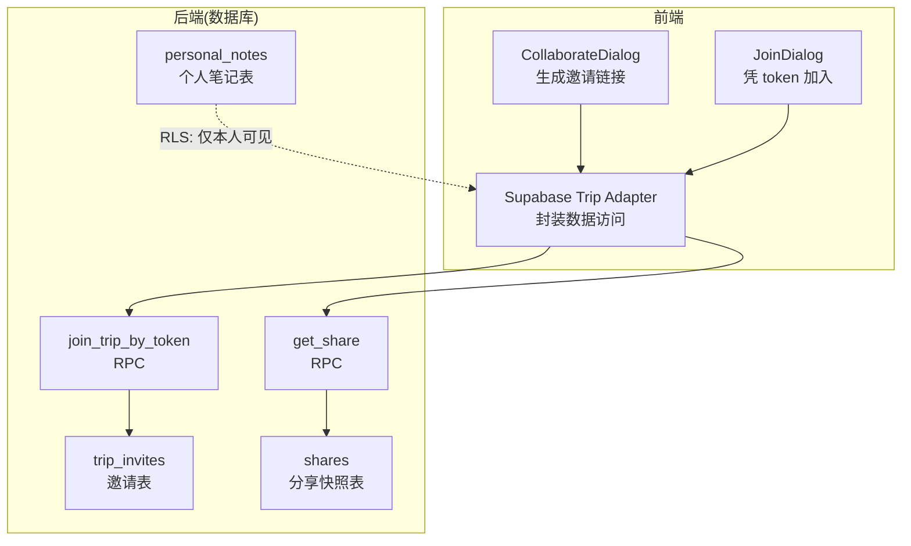
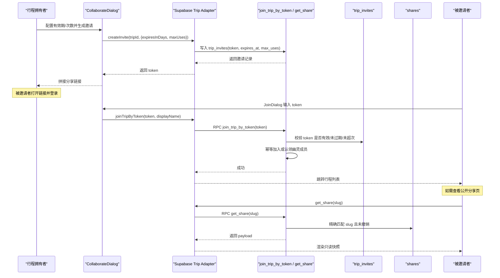
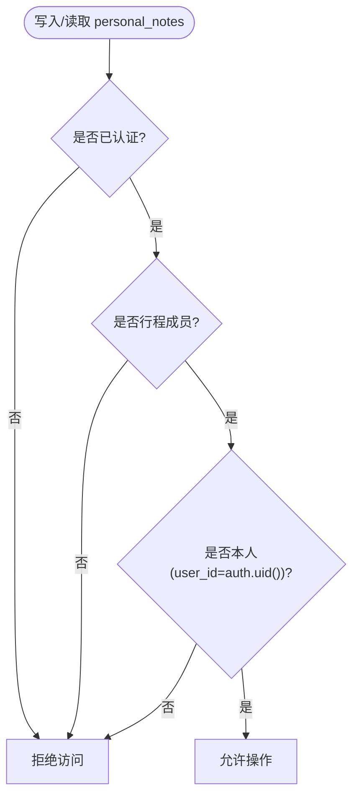
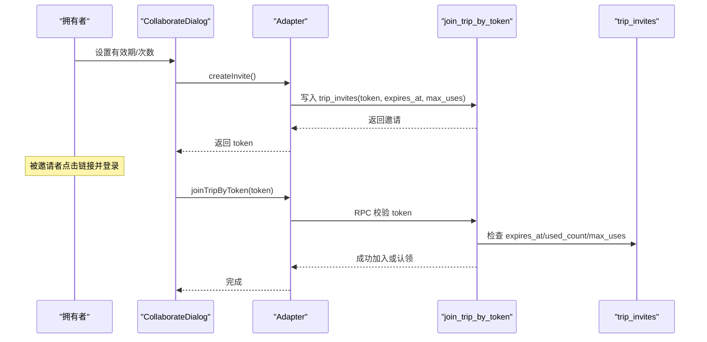
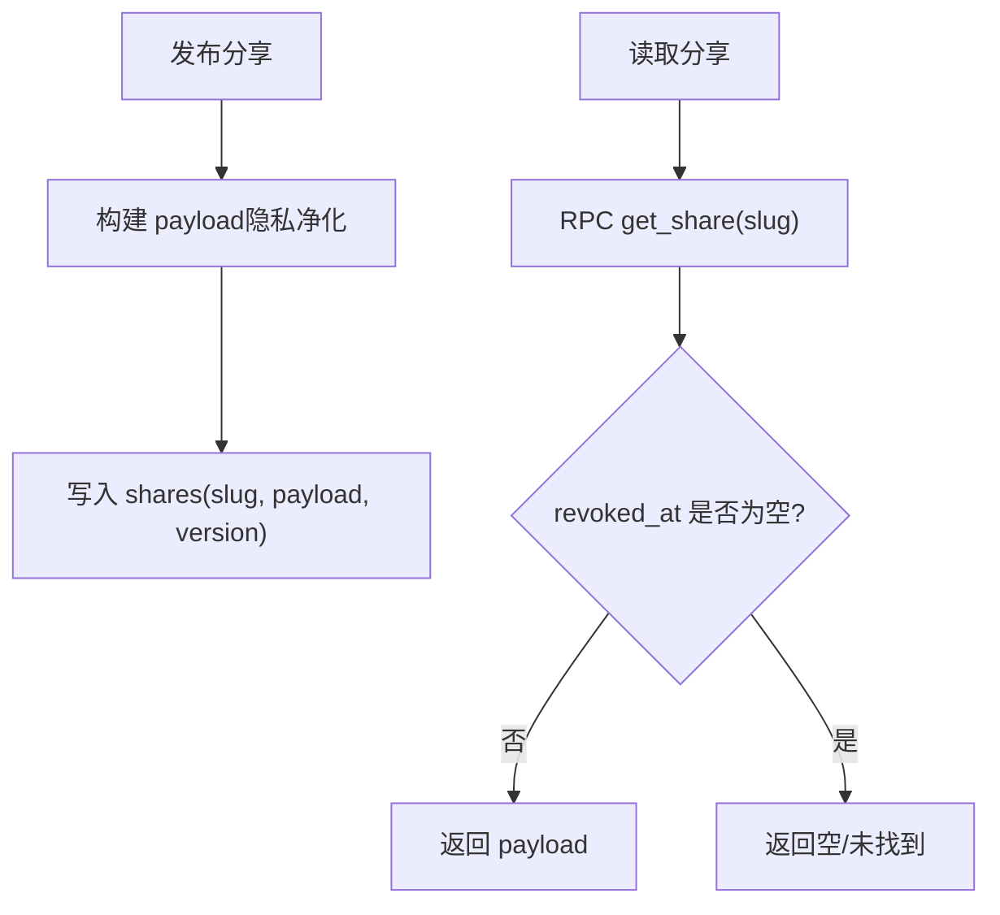
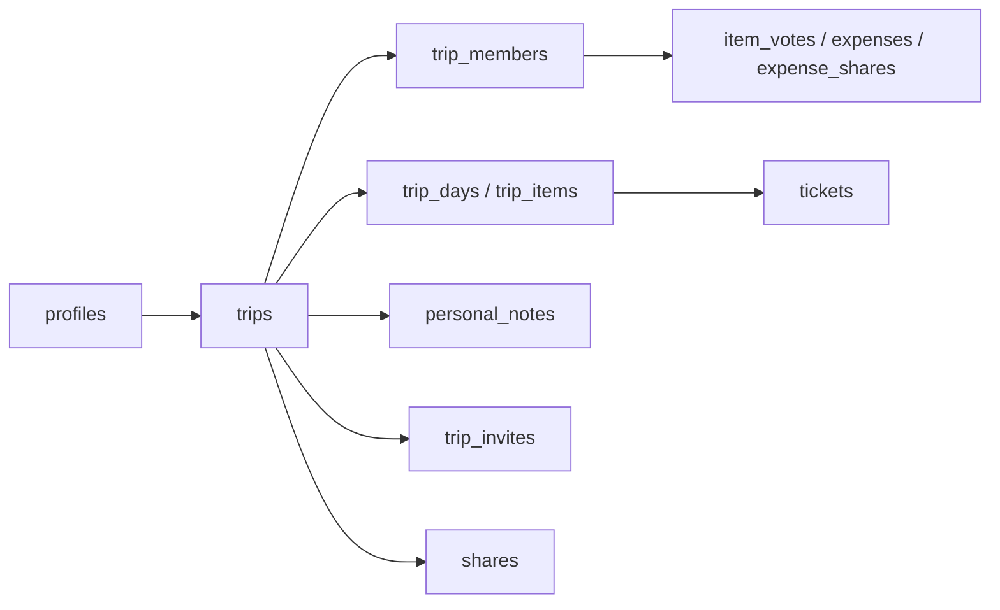

# 协作分享表

<cite>
**本文引用的文件**
- [supabase/migrations/0001_init.sql](file://supabase/migrations/0001_init.sql)
- [supabase/migrations/0002_trip_items_custom.sql](file://supabase/migrations/0002_trip_items_custom.sql)
- [src/features/trip/CollaborateDialog.tsx](file://src/features/trip/CollaborateDialog.tsx)
- [src/features/trip/JoinDialog.tsx](file://src/features/trip/JoinDialog.tsx)
- [src/data/adapters/supabase-trip.ts](file://src/data/adapters/supabase-trip.ts)
- [docs/技术方案.md](file://docs/技术方案.md)
</cite>

## 目录
1. [引言](#引言)
2. [项目结构](#项目结构)
3. [核心组件](#核心组件)
4. [架构总览](#架构总览)
5. [详细组件分析](#详细组件分析)
6. [依赖关系分析](#依赖关系分析)
7. [性能考量](#性能考量)
8. [故障排查指南](#故障排查指南)
9. [结论](#结论)
10. [附录](#附录)

## 引言
本文件聚焦“玩无一失”的协作与分享能力，围绕三张关键表进行系统化说明：个人笔记表 personal_notes、邀请表 trip_invites、分享表 shares。文档将解释隐私保护机制、用户隔离策略、邀请令牌的生命周期管理（含使用限制与过期）、分享快照的发布与撤销，以及权限控制与安全设计。同时提供完整的协作流程示例与分享链接生成逻辑，帮助读者快速理解并正确使用这些能力。

## 项目结构
- 数据库层：通过 Supabase 迁移脚本定义表结构、RLS 策略与 RPC 函数，集中体现权限边界与数据流转。
- 前端交互层：协作弹窗负责生成邀请链接；加入弹窗负责凭 token 加入行程；数据适配器封装对 Supabase 的调用。
- 技术文档：技术方案中对邀请与分享的安全细节进行了补充说明。

图表来源
- [supabase/migrations/0001_init.sql:244-267](file://supabase/migrations/0001_init.sql#L244-L267)
- [supabase/migrations/0001_init.sql:431-474](file://supabase/migrations/0001_init.sql#L431-L474)
- [src/features/trip/CollaborateDialog.tsx:16-22](file://src/features/trip/CollaborateDialog.tsx#L16-L22)
- [src/features/trip/JoinDialog.tsx:27-38](file://src/features/trip/JoinDialog.tsx#L27-L38)
- [src/data/adapters/supabase-trip.ts:366-413](file://src/data/adapters/supabase-trip.ts#L366-L413)

章节来源
- [supabase/migrations/0001_init.sql:244-267](file://supabase/migrations/0001_init.sql#L244-L267)
- [src/features/trip/CollaborateDialog.tsx:16-22](file://src/features/trip/CollaborateDialog.tsx#L16-L22)
- [src/features/trip/JoinDialog.tsx:27-38](file://src/features/trip/JoinDialog.tsx#L27-L38)
- [src/data/adapters/supabase-trip.ts:366-413](file://src/data/adapters/supabase-trip.ts#L366-L413)

## 核心组件
- personal_notes（个人笔记）：成员间互不可见，永不进入分享快照；通过 RLS 强制 user_id=当前用户且为行程成员才可读写。
- trip_invites（邀请）：基于唯一 token 的邀请凭证，支持过期时间、最大使用次数、定向认领幽灵成员；加入通过服务端 RPC 校验并幂等处理。
- shares（分享）：发布时生成已隐私净化的快照 payload，按 slug 精确读取；支持版本管理与撤销（revoked_at）。

章节来源
- [supabase/migrations/0001_init.sql:231-267](file://supabase/migrations/0001_init.sql#L231-L267)
- [supabase/migrations/0001_init.sql:371-386](file://supabase/migrations/0001_init.sql#L371-L386)
- [supabase/migrations/0001_init.sql:467-474](file://supabase/migrations/0001_init.sql#L467-L474)
- [docs/技术方案.md:559-585](file://docs/技术方案.md#L559-L585)

## 架构总览
下图展示了从“创建邀请”到“加入协作”，再到“分享快照读取”的端到端流程，涵盖前端交互、RPC 校验与数据库 RLS 约束。

图表来源
- [src/features/trip/CollaborateDialog.tsx:42-55](file://src/features/trip/CollaborateDialog.tsx#L42-L55)
- [src/data/adapters/supabase-trip.ts:366-413](file://src/data/adapters/supabase-trip.ts#L366-L413)
- [supabase/migrations/0001_init.sql:431-474](file://supabase/migrations/0001_init.sql#L431-L474)
- [docs/技术方案.md:515-585](file://docs/技术方案.md#L515-L585)

## 详细组件分析

### personal_notes（个人笔记）
- 设计目标：成员间的私密备注，不共享给其他成员，也不进入分享快照。
- 字段要点：
  - trip_id：归属行程
  - item_id：可选关联具体条目
  - user_id：作者标识
  - content：文本内容
  - updated_at：更新时间
- 隐私保护与用户隔离：
  - RLS 策略要求 user_id=当前用户 且 必须为该行程成员，否则拒绝所有读写。
  - 在聚合查询中（如 get_trip_bundle），仅返回当前用户的 personal_notes，避免跨用户泄露。
- 复杂度与索引：
  - 常用查询按 (user_id, trip_id) 组合过滤，已建立复合索引以优化性能。
- 错误处理：
  - 非本人或非成员访问将被 RLS 拦截，返回无权限错误。

图表来源
- [supabase/migrations/0001_init.sql:231-242](file://supabase/migrations/0001_init.sql#L231-L242)
- [supabase/migrations/0001_init.sql:371-375](file://supabase/migrations/0001_init.sql#L371-L375)
- [supabase/migrations/0001_init.sql:393-427](file://supabase/migrations/0001_init.sql#L393-L427)

章节来源
- [supabase/migrations/0001_init.sql:231-242](file://supabase/migrations/0001_init.sql#L231-L242)
- [supabase/migrations/0001_init.sql:371-375](file://supabase/migrations/0001_init.sql#L371-L375)
- [supabase/migrations/0001_init.sql:393-427](file://supabase/migrations/0001_init.sql#L393-L427)

### trip_invites（邀请）
- 设计目标：安全地邀请他人加入行程，支持过期、次数限制与定向认领。
- 关键字段：
  - token：唯一邀请码
  - claim_member_id：指向一个“幽灵成员”（尚未绑定真实账号的成员），用于后续认领
  - expires_at：过期时间（可为空表示永久）
  - max_uses：最大使用次数（默认 20）
  - used_count：已使用次数
- 生命周期与限制：
  - 创建：前端生成随机 token，写入 trip_invites，可设置有效期与次数。
  - 使用：通过 RPC join_trip_by_token 校验 token 有效性（未过期、未超限），然后幂等地加入或认领幽灵成员，并递增 used_count。
  - 撤销：删除对应邀请记录即可失效。
- 安全考虑：
  - 加入必须走 SECURITY DEFINER 函数，禁止直接插入 trip_members，防止越权加入。
  - 匿名不可读 trip_invites，仅成员可管理。

图表来源
- [src/features/trip/CollaborateDialog.tsx:42-55](file://src/features/trip/CollaborateDialog.tsx#L42-L55)
- [src/data/adapters/supabase-trip.ts:366-413](file://src/data/adapters/supabase-trip.ts#L366-L413)
- [supabase/migrations/0001_init.sql:244-256](file://supabase/migrations/0001_init.sql#L244-L256)
- [supabase/migrations/0001_init.sql:431-465](file://supabase/migrations/0001_init.sql#L431-L465)

章节来源
- [supabase/migrations/0001_init.sql:244-256](file://supabase/migrations/0001_init.sql#L244-L256)
- [supabase/migrations/0001_init.sql:431-465](file://supabase/migrations/0001_init.sql#L431-L465)
- [src/features/trip/CollaborateDialog.tsx:42-55](file://src/features/trip/CollaborateDialog.tsx#L42-L55)
- [src/data/adapters/supabase-trip.ts:366-413](file://src/data/adapters/supabase-trip.ts#L366-L413)

### shares（分享）
- 设计目标：发布“已隐私净化”的只读快照，支持版本管理与撤销。
- 关键字段：
  - slug：不可枚举的唯一短链标识（base62 长度固定）
  - scope：发布范围（例如仅某几天或某些条目）
  - payload：已净化后的 JSON 快照（不含敏感字段）
  - version：版本号
  - published_at：发布时间
  - revoked_at：撤销时间（置值即失效）
- 发布与读取：
  - 发布：由拥有者在服务端生成 payload（剔除 booking_ref、personal_notes 等敏感信息），写入 shares。
  - 读取：匿名或登录用户均可通过 RPC get_share(slug) 精确读取，无法枚举。
- 撤销机制：
  - 设置 revoked_at 后，get_share 不再返回该快照，链接立即失效。
- 安全考虑：
  - shares 表不开启任何面向匿名的策略，仅通过 RPC 精确读取，避免 PostgREST 全表拉取风险。

图表来源
- [supabase/migrations/0001_init.sql:258-267](file://supabase/migrations/0001_init.sql#L258-L267)
- [supabase/migrations/0001_init.sql:467-474](file://supabase/migrations/0001_init.sql#L467-L474)
- [docs/技术方案.md:559-585](file://docs/技术方案.md#L559-L585)

章节来源
- [supabase/migrations/0001_init.sql:258-267](file://supabase/migrations/0001_init.sql#L258-L267)
- [supabase/migrations/0001_init.sql:467-474](file://supabase/migrations/0001_init.sql#L467-L474)
- [docs/技术方案.md:559-585](file://docs/技术方案.md#L559-L585)

## 依赖关系分析
- 表间关系：
  - personal_notes.trip_id → trips.id；personal_notes.user_id → profiles.id；personal_notes.item_id → trip_items.id
  - trip_invites.trip_id → trips.id；trip_invites.claim_member_id → trip_members.id
  - shares.trip_id → trips.id
- 权限依赖：
  - personal_notes 的读写受 RLS 严格限制（本人+成员）
  - trip_invites 的管理受 RLS 限制（成员可管理，匿名不可读）
  - shares 的管理受 RLS 限制（仅拥有者可管理），读取通过 RPC 精确匹配
- 外部依赖：
  - Supabase Auth（auth.uid）用于身份判定
  - Supabase Storage（附件 URL 存储于 trip_items.images，但不在分享快照中暴露敏感信息）

图表来源
- [supabase/migrations/0001_init.sql:231-267](file://supabase/migrations/0001_init.sql#L231-L267)
- [supabase/migrations/0001_init.sql:309-386](file://supabase/migrations/0001_init.sql#L309-L386)

章节来源
- [supabase/migrations/0001_init.sql:231-267](file://supabase/migrations/0001_init.sql#L231-L267)
- [supabase/migrations/0001_init.sql:309-386](file://supabase/migrations/0001_init.sql#L309-L386)

## 性能考量
- personal_notes：
  - 通过 (user_id, trip_id) 索引加速“我的笔记”查询。
  - 聚合查询（bundle）仅返回当前用户笔记，减少不必要的数据传输。
- trip_invites：
  - token 唯一索引保证查找效率；used_count 自增在高并发下需注意事务一致性（RPC 内原子更新）。
- shares：
  - payload 为一次性快照，避免实时计算带来的开销；slug 唯一索引确保 O(1) 精确读取。
- 建议：
  - 对高频查询列建立合适索引（如 trip_id、user_id）。
  - 对大 payload 的 shares 表考虑归档策略（历史版本清理）。

[本节为通用指导，不直接分析具体文件]

## 故障排查指南
- 无法加入行程：
  - 检查 token 是否过期或未达最大使用次数；确认 RPC 调用是否正确传递参数。
  - 若提示“无效邀请”，请重新生成邀请链接。
- 个人笔记不可见：
  - 确认当前用户是否为行程成员且为笔记作者；RLS 会拒绝非本人访问。
- 分享链接无效：
  - 检查 slug 是否正确；确认分享未被撤销（revoked_at 为空）。
- 移除成员失败：
  - 若该成员是账单付款人，外键约束会阻止删除；需先更改相关账单的付款人。

章节来源
- [supabase/migrations/0001_init.sql:431-465](file://supabase/migrations/0001_init.sql#L431-L465)
- [supabase/migrations/0001_init.sql:371-375](file://supabase/migrations/0001_init.sql#L371-L375)
- [supabase/migrations/0001_init.sql:467-474](file://supabase/migrations/0001_init.sql#L467-L474)
- [src/features/trip/CollaborateDialog.tsx:67-82](file://src/features/trip/CollaborateDialog.tsx#L67-L82)

## 结论
- personal_notes 通过 RLS 实现强隔离，确保成员间互不可见且不进入分享快照。
- trip_invites 提供安全的邀请机制，支持过期、次数限制与幽灵成员认领，加入过程由服务端 RPC 统一校验。
- shares 采用“发布快照 + 精确读取”的模式，结合版本管理与撤销机制，保障分享内容的可控性与安全性。
- 整体方案在权限控制、隐私净化与用户体验之间取得平衡，适合多人协作旅行场景。

[本节为总结性内容，不直接分析具体文件]

## 附录

### 协作流程示例（端到端）
- 拥有者生成邀请链接：
  - 在 CollaborateDialog 中设置有效期与次数，调用 createInvite 生成 token，并拼接分享链接。
- 被邀请者加入：
  - 打开链接后，JoinDialog 调用 joinTripByToken，服务端校验 token 并加入或认领幽灵成员。
- 查看分享快照：
  - 通过 get_share(slug) 获取已净化 payload，匿名也可访问。

章节来源
- [src/features/trip/CollaborateDialog.tsx:42-55](file://src/features/trip/CollaborateDialog.tsx#L42-L55)
- [src/features/trip/JoinDialog.tsx:27-38](file://src/features/trip/JoinDialog.tsx#L27-L38)
- [src/data/adapters/supabase-trip.ts:366-413](file://src/data/adapters/supabase-trip.ts#L366-L413)
- [supabase/migrations/0001_init.sql:431-474](file://supabase/migrations/0001_init.sql#L431-L474)

### 分享链接生成逻辑
- 前端根据当前页面路径与 origin 拼接链接，包含 token 参数，便于被邀请者一键加入。
- 分享页路由支持匿名访问，通过 slug 精确读取快照。

章节来源
- [src/features/trip/CollaborateDialog.tsx:16-22](file://src/features/trip/CollaborateDialog.tsx#L16-L22)
- [docs/技术方案.md:683-699](file://docs/技术方案.md#L683-L699)

### 权限控制策略与安全清单
- RLS 策略：
  - personal_notes：仅本人可读写，且必须为行程成员。
  - trip_invites：成员可管理，匿名不可读。
  - shares：仅拥有者可管理；匿名通过 RPC 精确读取。
- 安全实践：
  - 所有 SECURITY DEFINER 函数显式设置 search_path，防注入。
  - 分享快照不包含敏感字段（如 booking_ref），并通过单测覆盖净化逻辑。
  - CSP 限制外链与脚本来源，降低 XSS 风险。

章节来源
- [supabase/migrations/0001_init.sql:309-386](file://supabase/migrations/0001_init.sql#L309-L386)
- [docs/技术方案.md:591-599](file://docs/技术方案.md#L591-L599)