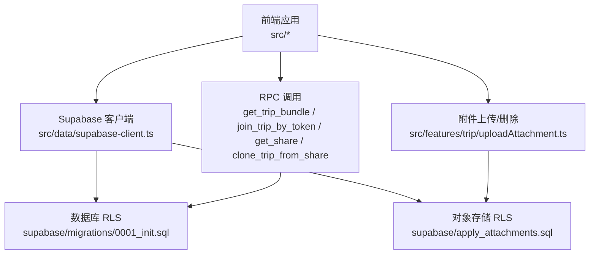
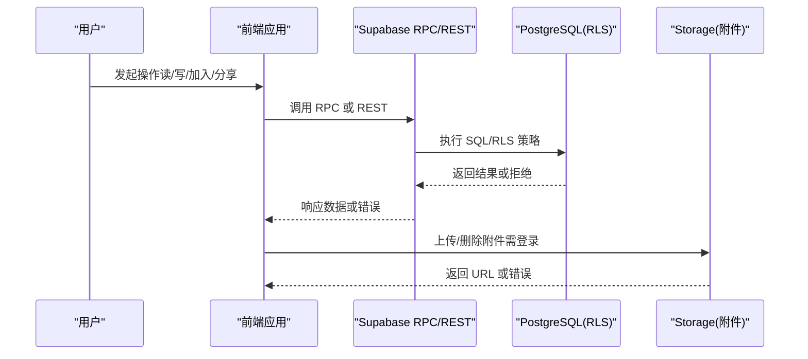
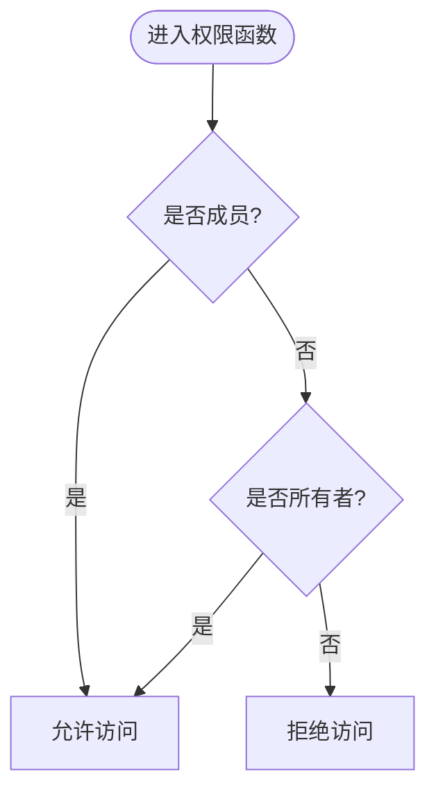
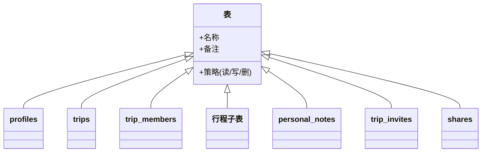
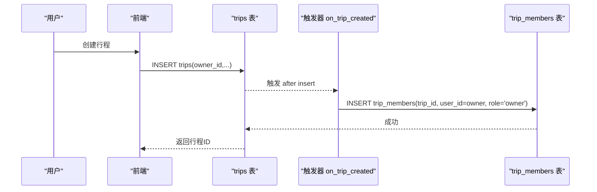
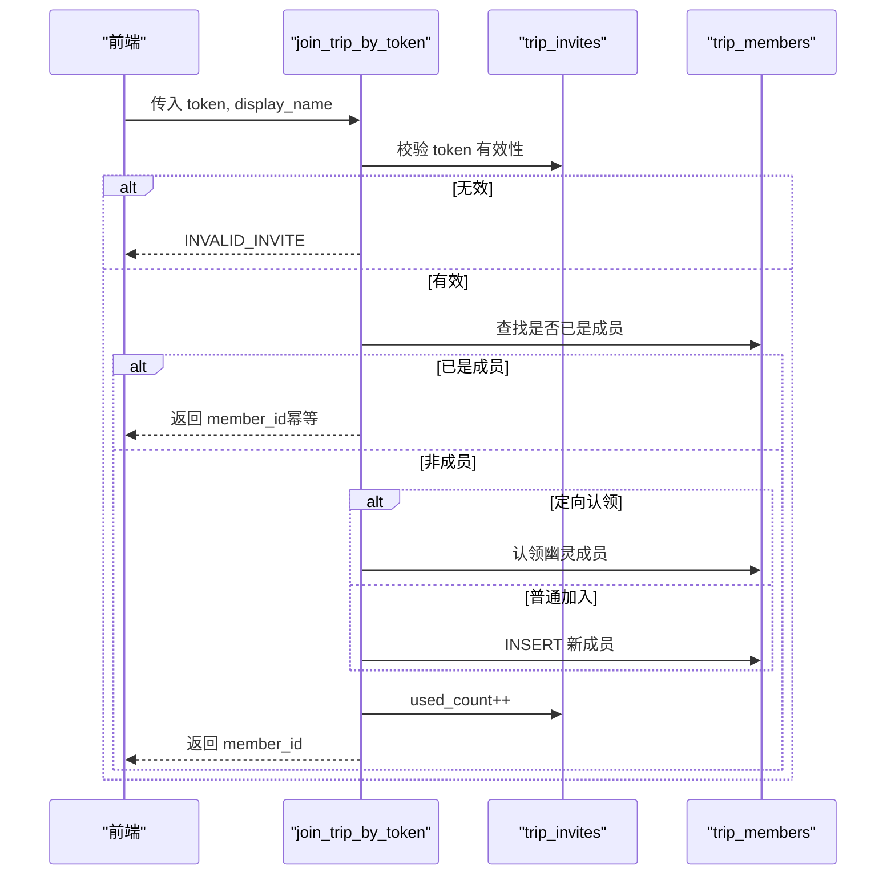
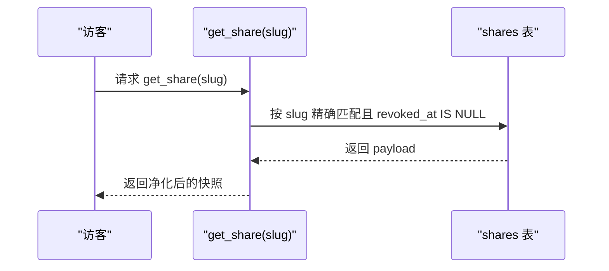
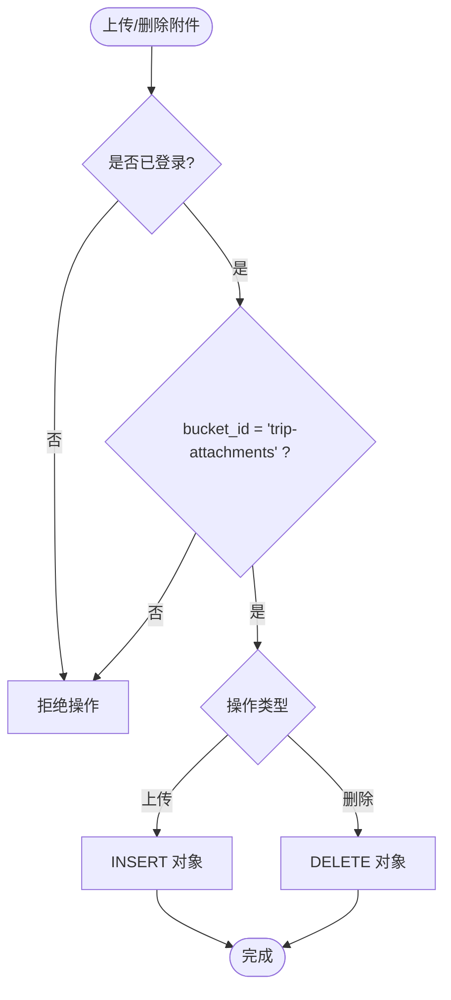
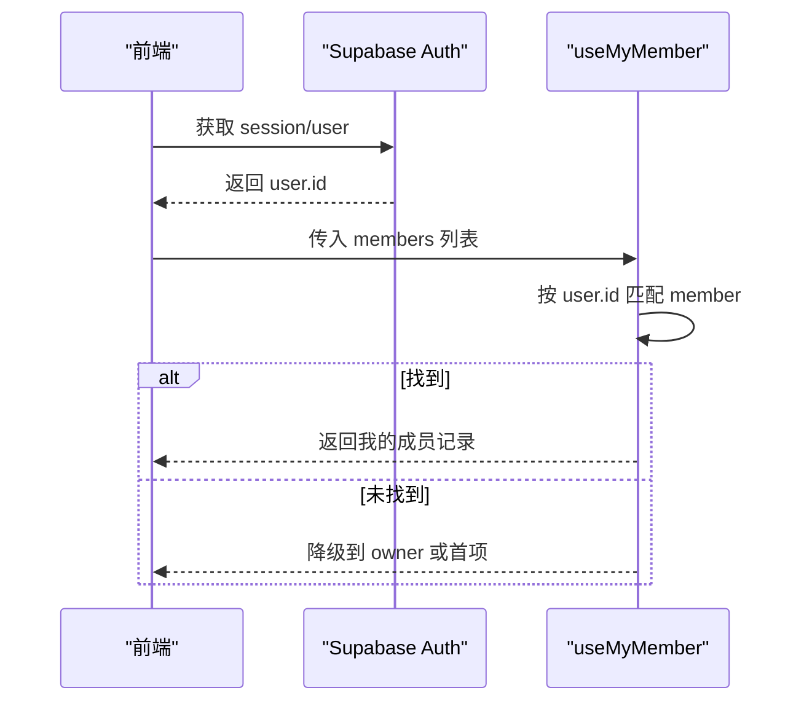
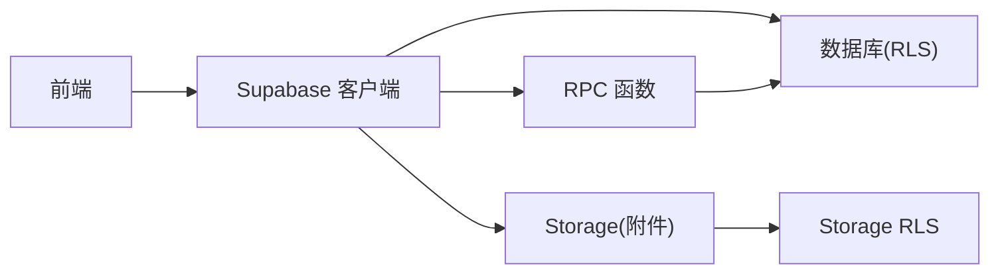

# 安全与权限

<cite>
**本文引用的文件**
- [supabase/migrations/0001_init.sql](file://supabase/migrations/0001_init.sql)
- [supabase/apply_attachments.sql](file://supabase/apply_attachments.sql)
- [docs/技术方案.md](file://docs/技术方案.md)
- [src/data/supabase-client.ts](file://src/data/supabase-client.ts)
- [src/features/trip/useMyMember.ts](file://src/features/trip/useMyMember.ts)
- [src/features/trip/uploadAttachment.ts](file://src/features/trip/uploadAttachment.ts)
- [scripts/verify-supabase.cjs](file://scripts/verify-supabase.cjs)
</cite>

## 目录
1. [引言](#引言)
2. [项目结构](#项目结构)
3. [核心组件](#核心组件)
4. [架构总览](#架构总览)
5. [详细组件分析](#详细组件分析)
6. [依赖关系分析](#依赖关系分析)
7. [性能考量](#性能考量)
8. [故障排查指南](#故障排查指南)
9. [结论](#结论)
10. [附录：配置示例与调试方法](#附录：配置示例与调试方法)

## 引言
本文件面向“玩无一失”的安全与权限体系，系统性说明行级安全（RLS）策略的设计与实现，覆盖成员权限、所有者权限与匿名访问控制；解释权限判定函数 is_trip_member 与 is_trip_owner 的实现逻辑；阐述 RPC 函数的安全设计与权限验证；并给出安全最佳实践、常见问题解决方案以及可操作的配置与调试方法。目标是让读者既能理解整体架构，也能在实际工程中正确落地与维护。

## 项目结构
与安全相关的关键位置如下：
- 数据库迁移与 RLS 策略定义：supabase/migrations/0001_init.sql
- 对象存储（附件）的 RLS 策略：supabase/apply_attachments.sql
- 安全设计文档与清单：docs/技术方案.md
- 前端认证客户端与会话管理：src/data/supabase-client.ts
- 前端协作中“我”的成员身份判定：src/features/trip/useMyMember.ts
- 附件上传与删除：src/features/trip/uploadAttachment.ts
- 端到端验证脚本：scripts/verify-supabase.cjs

图表来源
- [supabase/migrations/0001_init.sql:306-386](file://supabase/migrations/0001_init.sql#L306-L386)
- [supabase/apply_attachments.sql:60-82](file://supabase/apply_attachments.sql#L60-L82)
- [src/data/supabase-client.ts:1-106](file://src/data/supabase-client.ts#L1-L106)
- [src/features/trip/uploadAttachment.ts:35-53](file://src/features/trip/uploadAttachment.ts#L35-L53)

章节来源
- [supabase/migrations/0001_init.sql:306-386](file://supabase/migrations/0001_init.sql#L306-L386)
- [supabase/apply_attachments.sql:60-82](file://supabase/apply_attachments.sql#L60-L82)
- [docs/技术方案.md:441-601](file://docs/技术方案.md#L441-L601)
- [src/data/supabase-client.ts:1-106](file://src/data/supabase-client.ts#L1-L106)

## 核心组件
- 行级安全（RLS）策略：对所有业务表启用 RLS，并通过策略限制读/写范围。
- 权限判定函数：is_trip_member、is_trip_owner，使用 SECURITY DEFINER 避免 RLS 递归。
- 触发器：on_trip_created 自动将行程创建者加入成员表，解决“鸡生蛋”问题。
- 邀请与加入：join_trip_by_token 通过 token 校验完成加入，支持认领幽灵成员。
- 分享快照：shares 表仅 owner 管理，匿名读取唯一入口为 get_share(slug)。
- 对象存储：trip-attachments bucket 公开读，已登录用户可上传/删除。
- 前端会话：必须登录才能走云端模式，RLS 基于 auth.uid() 生效。

章节来源
- [supabase/migrations/0001_init.sql:287-386](file://supabase/migrations/0001_init.sql#L287-L386)
- [supabase/migrations/0001_init.sql:392-525](file://supabase/migrations/0001_init.sql#L392-L525)
- [supabase/apply_attachments.sql:60-82](file://supabase/apply_attachments.sql#L60-L82)
- [docs/技术方案.md:441-601](file://docs/技术方案.md#L441-L601)
- [src/data/supabase-client.ts:1-106](file://src/data/supabase-client.ts#L1-L106)

## 架构总览
下图展示从前端到数据库/RPC/存储的整体安全路径：

图表来源
- [supabase/migrations/0001_init.sql:392-525](file://supabase/migrations/0001_init.sql#L392-L525)
- [supabase/apply_attachments.sql:60-82](file://supabase/apply_attachments.sql#L60-L82)
- [src/data/supabase-client.ts:1-106](file://src/data/supabase-client.ts#L1-L106)

## 详细组件分析

### 权限判定函数：is_trip_member 与 is_trip_owner
- 目标：在 RLS 策略中判断当前用户是否为某行程成员或所有者。
- 关键点：
  - 使用 SECURITY DEFINER 以绕过 RLS 递归（避免 trip_members 自身 SELECT 策略再次查询 trip_members）。
  - 显式 set search_path = public，防止 search_path 注入。
  - 稳定函数 stable，利于优化。
- 行为：
  - is_trip_member：检查 trip_members 中是否存在 user_id = auth.uid() 且 trip_id 匹配的行。
  - is_trip_owner：检查 trips 中是否存在 id 匹配且 owner_id = auth.uid() 的行。

图表来源
- [supabase/migrations/0001_init.sql:287-304](file://supabase/migrations/0001_init.sql#L287-L304)

章节来源
- [supabase/migrations/0001_init.sql:287-304](file://supabase/migrations/0001_init.sql#L287-L304)
- [docs/技术方案.md:450-473](file://docs/技术方案.md#L450-L473)

### 各表访问控制策略（RLS）
- profiles：仅本人读写（id = auth.uid()），他人展示名通过 trip_members.display_name 获取。
- trips：
  - SELECT：成员可读或所有者可读。
  - INSERT：仅所有者可创建。
  - UPDATE：成员可更新。
  - DELETE：仅所有者可删除。
- trip_members：
  - SELECT：成员可读（含所有者）。
  - INSERT/UPDATE/DELETE：仅所有者（加入房间走 RPC）。
- 行程子表（trip_days、trip_items、item_votes、tickets、expenses、expense_shares、transports、accommodations）：统一模板——所有操作需 is_trip_member(trip_id)。
- personal_notes：仅本人（且必须是该行程成员）。
- trip_invites：成员可读可建，匿名不可读（使用走 RPC）。
- shares：仅 owner 管理；匿名读取唯一入口为 get_share(slug)，严禁直接开放匿名 select 策略。

图表来源
- [supabase/migrations/0001_init.sql:306-386](file://supabase/migrations/0001_init.sql#L306-L386)
- [docs/技术方案.md:488-497](file://docs/技术方案.md#L488-L497)

章节来源
- [supabase/migrations/0001_init.sql:306-386](file://supabase/migrations/0001_init.sql#L306-L386)
- [docs/技术方案.md:488-497](file://docs/技术方案.md#L488-L497)

### 触发器：on_trip_created（解决“鸡生蛋”）
- 目的：创建行程后自动将 owner 加入 trip_members，role='owner'，使 owner 能立即读取自己的行程。
- 机制：after insert on trips，security definer，插入 trip_members 记录。

图表来源
- [supabase/migrations/0001_init.sql:83-95](file://supabase/migrations/0001_init.sql#L83-L95)

章节来源
- [supabase/migrations/0001_init.sql:83-95](file://supabase/migrations/0001_init.sql#L83-L95)
- [docs/技术方案.md:499-513](file://docs/技术方案.md#L499-L513)

### 邀请与加入：join_trip_by_token
- 功能：通过 token 加入行程，支持认领幽灵成员（继承其历史投票与账本记录）。
- 安全要点：
  - 校验 token 有效性（未过期、未超次数）。
  - 幂等：已是成员则直接返回 member_id。
  - 定向认领：若 claim_member_id 存在且 user_id 为空，则将其 user_id 改为当前用户。
  - 否则新增成员。
  - 增加 used_count。
  - 仅授予 authenticated 角色执行权限。

图表来源
- [supabase/migrations/0001_init.sql:432-465](file://supabase/migrations/0001_init.sql#L432-L465)
- [docs/技术方案.md:515-557](file://docs/技术方案.md#L515-L557)

章节来源
- [supabase/migrations/0001_init.sql:432-465](file://supabase/migrations/0001_init.sql#L432-L465)
- [docs/技术方案.md:515-557](file://docs/技术方案.md#L515-L557)

### 分享快照：get_share 与 shares 表
- 设计原则：
  - shares 表开启 RLS 但无匿名 select 策略，禁止通过 PostgREST 枚举。
  - 匿名读取唯一入口：get_share(slug)，精确匹配 slug 且 revoked_at 为空。
  - slug 高熵生成，防枚举攻击。
- 安全要点：
  - 严禁给 shares 表加匿名 select 策略，否则会被拉取全量数据。
  - payload 为发布时生成的隐私净化快照，包含必要信息但不含敏感字段。

图表来源
- [supabase/migrations/0001_init.sql:467-474](file://supabase/migrations/0001_init.sql#L467-L474)
- [docs/技术方案.md:561-589](file://docs/技术方案.md#L561-L589)

章节来源
- [supabase/migrations/0001_init.sql:467-474](file://supabase/migrations/0001_init.sql#L467-L474)
- [docs/技术方案.md:561-589](file://docs/技术方案.md#L561-L589)

### 对象存储：trip-attachments 的 RLS
- 策略：
  - 公开读：bucket_id = 'trip-attachments' 的对象可被任何人读取。
  - 已登录用户可上传/删除（authenticated）。
- 前端集成：
  - 上传/删除通过 Supabase Storage API 调用。
  - 删除时需解析公开 URL 得到对象路径。

图表来源
- [supabase/apply_attachments.sql:60-82](file://supabase/apply_attachments.sql#L60-L82)
- [src/features/trip/uploadAttachment.ts:35-53](file://src/features/trip/uploadAttachment.ts#L35-L53)

章节来源
- [supabase/apply_attachments.sql:60-82](file://supabase/apply_attachments.sql#L60-L82)
- [src/features/trip/uploadAttachment.ts:35-53](file://src/features/trip/uploadAttachment.ts#L35-L53)

### 前端会话与“我”的成员身份
- 会话管理：
  - 必须登录才能使用云端模式，RLS 基于 auth.uid() 生效。
  - 提供匿名登录、邮箱 OTP、邮箱+密码等方式。
- “我”的成员身份：
  - useMyMember 根据 auth.user.id 匹配 trip_members.user_id，未匹配时降级到 owner（本地模式或异常兜底）。
  - 避免之前直接用 role='owner' 判定的错误。

图表来源
- [src/data/supabase-client.ts:1-106](file://src/data/supabase-client.ts#L1-L106)
- [src/features/trip/useMyMember.ts:1-31](file://src/features/trip/useMyMember.ts#L1-L31)

章节来源
- [src/data/supabase-client.ts:1-106](file://src/data/supabase-client.ts#L1-L106)
- [src/features/trip/useMyMember.ts:1-31](file://src/features/trip/useMyMember.ts#L1-L31)

## 依赖关系分析
- 前端依赖 Supabase 客户端进行认证与数据访问。
- 数据库层通过 RLS 与 SECURITY DEFINER 函数保证数据安全。
- 对象存储通过 bucket 级别的 RLS 控制上传/删除权限。
- RPC 作为受控入口，集中校验与事务处理。

图表来源
- [src/data/supabase-client.ts:1-106](file://src/data/supabase-client.ts#L1-L106)
- [supabase/migrations/0001_init.sql:306-525](file://supabase/migrations/0001_init.sql#L306-L525)
- [supabase/apply_attachments.sql:60-82](file://supabase/apply_attachments.sql#L60-L82)

章节来源
- [src/data/supabase-client.ts:1-106](file://src/data/supabase-client.ts#L1-L106)
- [supabase/migrations/0001_init.sql:306-525](file://supabase/migrations/0001_init.sql#L306-L525)
- [supabase/apply_attachments.sql:60-82](file://supabase/apply_attachments.sql#L60-L82)

## 性能考量
- 使用 stable 函数提升查询计划稳定性。
- 批量聚合数据通过 get_trip_bundle 减少往返。
- 索引：trip_members.trip_id、trips.owner_id 等关键列建立索引以提升查询效率。
- 对象存储：图片尺寸限制与 MIME 类型限制可减少带宽与安全风险。

[本节为通用指导，不直接分析具体文件]

## 故障排查指南
- 无法读取行程：确认已登录且为成员；检查 is_trip_member 与 is_trip_owner 判定。
- 无法加入行程：检查 token 是否有效（未过期、未超次数）；确认 join_trip_by_token 权限。
- 无法上传附件：确认已登录且 bucket_id 正确；检查 Storage RLS 策略。
- 分享链接无效：确认 slug 存在且未被撤销；检查 get_share 返回。
- 端到端验证：使用 verify-supabase 脚本创建测试行程并调用 bundle RPC 验证触发器与权限。

章节来源
- [scripts/verify-supabase.cjs:31-55](file://scripts/verify-supabase.cjs#L31-L55)
- [supabase/migrations/0001_init.sql:392-525](file://supabase/migrations/0001_init.sql#L392-L525)
- [supabase/apply_attachments.sql:60-82](file://supabase/apply_attachments.sql#L60-L82)

## 结论
本项目通过 RLS、SECURITY DEFINER 函数、触发器与 RPC 的组合，构建了严密的行级安全与权限体系。成员、所有者与匿名访问边界清晰，分享快照模型确保隐私可控，对象存储策略兼顾可用性与安全性。配合前端会话管理与“我”的成员身份判定，实现了跨端一致的安全体验。建议在生产环境中持续遵循安全清单，定期审计策略与 RPC 权限，确保系统长期安全。

[本节为总结性内容，不直接分析具体文件]

## 附录：配置示例与调试方法

### 安全最佳实践
- 所有 SECURITY DEFINER 函数显式 set search_path = public，防止 search_path 注入。
- 对敏感字段（如 booking_ref）在分享快照中剔除，避免泄露。
- 禁止存储证件信息（护照号、身份证号、出生日期）。
- 使用 CSP 限制资源加载与连接来源。
- 外链添加 target="_blank" rel="noopener noreferrer"。

章节来源
- [docs/技术方案.md:591-601](file://docs/技术方案.md#L591-L601)

### 常见安全问题与解决方案
- 枚举攻击：shares 表不开放匿名 select，仅通过 get_share(slug) 精确读取。
- 越权写入：trip_members 的增删改仅限 owner，加入走 RPC 校验 token。
- 隐私泄漏：个人笔记仅本人可见；分享快照一次性净化。
- 存储滥用：附件 bucket 限制 MIME 类型与大小，仅已登录用户可上传/删除。

章节来源
- [supabase/migrations/0001_init.sql:377-386](file://supabase/migrations/0001_init.sql#L377-L386)
- [supabase/apply_attachments.sql:28-82](file://supabase/apply_attachments.sql#L28-L82)
- [docs/技术方案.md:561-601](file://docs/技术方案.md#L561-L601)

### 权限配置示例
- 成员读/写：对所有行程子表使用 is_trip_member(trip_id) 策略。
- 所有者管理：trips 的 INSERT/DELETE 限 owner；shares 的管理限 owner。
- 匿名访问：仅 get_share(slug) 允许匿名读取。

章节来源
- [supabase/migrations/0001_init.sql:355-386](file://supabase/migrations/0001_init.sql#L355-L386)
- [supabase/migrations/0001_init.sql:467-474](file://supabase/migrations/0001_init.sql#L467-L474)

### 调试方法
- 使用 verify-supabase 脚本：
  - 创建测试行程，验证 INSERT 策略。
  - 调用 get_trip_bundle 验证触发器与成员关系。
  - 清理测试数据。
- 前端调试：
  - 确认登录态与 user.id。
  - 使用 useMyMember 获取“我”的成员记录。
  - 附件上传/删除时检查 Storage 策略与路径解析。

章节来源
- [scripts/verify-supabase.cjs:31-55](file://scripts/verify-supabase.cjs#L31-L55)
- [src/features/trip/useMyMember.ts:1-31](file://src/features/trip/useMyMember.ts#L1-L31)
- [src/features/trip/uploadAttachment.ts:35-53](file://src/features/trip/uploadAttachment.ts#L35-L53)