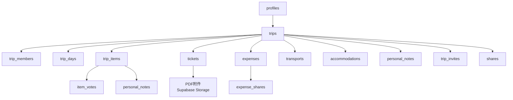
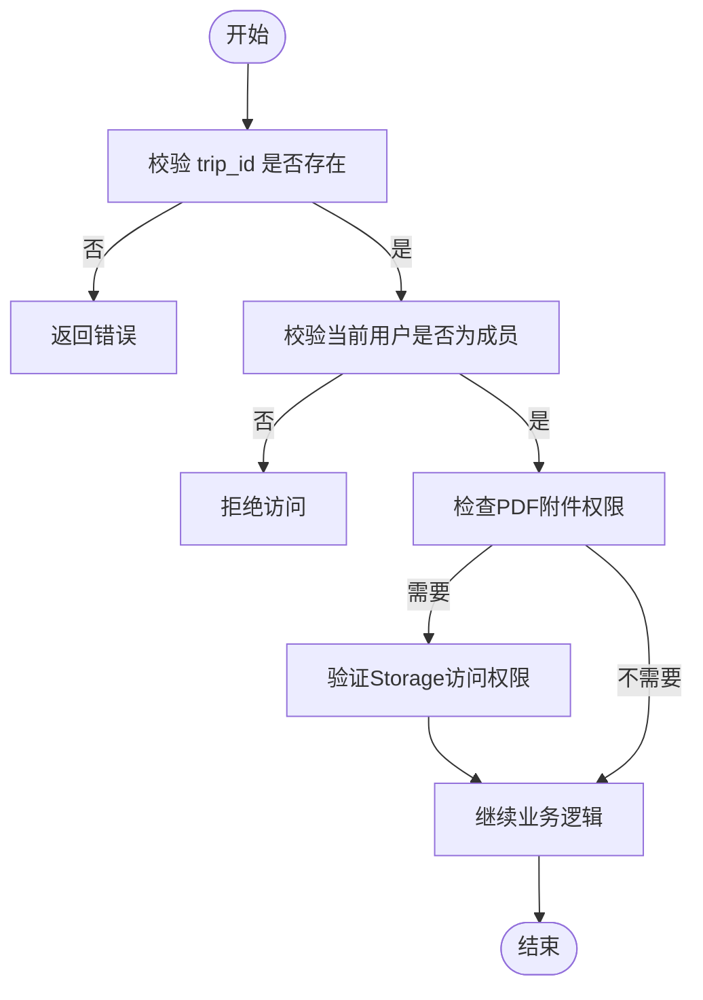
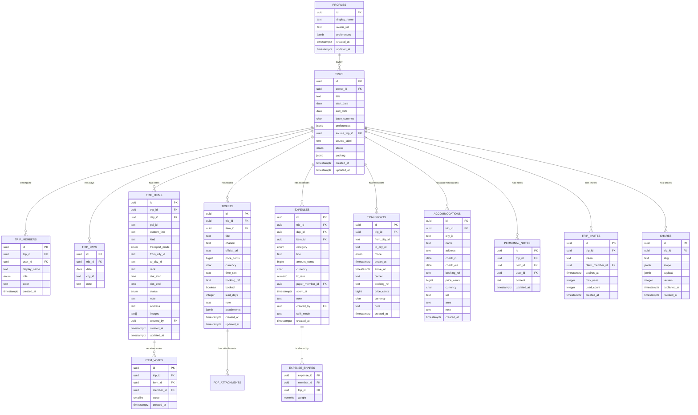

# 数据表结构

<cite>
**本文引用的文件**
- [supabase/migrations/0001_init.sql](file://supabase/migrations/0001_init.sql)
- [supabase/migrations/0002_trip_items_custom.sql](file://supabase/migrations/0002_trip_items_custom.sql)
- [supabase/migrations/0003_trip_packing.sql](file://supabase/migrations/0003_trip_packing.sql)
- [supabase/migrations/0004_expense_split_mode.sql](file://supabase/migrations/0004_expense_split_mode.sql)
- [supabase/migrations/0005_trip_item_images.sql](file://supabase/migrations/0005_trip_item_images.sql)
- [supabase/migrations/0007_trip_item_address.sql](file://supabase/migrations/0007_trip_item_address.sql)
- [supabase/migrations/0008_ticket_attachments.sql](file://supabase/migrations/0008_ticket_attachments.sql)
- [supabase/apply_attachments.sql](file://supabase/apply_attachments.sql)
- [src/data/types.ts](file://src/data/types.ts)
- [src/features/trip/uploadTicketAttachment.ts](file://src/features/trip/uploadTicketAttachment.ts)
- [src/features/trip/TicketEditor.tsx](file://src/features/trip/TicketEditor.tsx)
- [src/components/PdfViewer.tsx](file://src/components/PdfViewer.tsx)
- [docs/技术方案.md](file://docs/技术方案.md)
</cite>

## 更新摘要
**变更内容**
- 新增tickets表的attachments字段，用于存储PDF附件元数据
- 更新trip-attachments存储桶以支持PDF文件（application/pdf MIME类型）
- 新增完整的PDF附件上传、预览和删除功能
- 扩展Ticket类型定义以包含attachments数组
- 新增PdfViewer组件用于PDF文件预览

## 目录
1. [简介](#简介)
2. [项目结构与数据来源](#项目结构与数据来源)
3. [核心组件与表概览](#核心组件与表概览)
4. [架构总览](#架构总览)
5. [详细表设计说明](#详细表设计说明)
6. [依赖关系分析](#依赖关系分析)
7. [性能与索引策略](#性能与索引策略)
8. [故障排查指南](#故障排查指南)
9. [结论](#结论)
10. [附录：实体关系图](#附录：实体关系图)

## 简介
本文件为"玩无一失"的数据表结构权威文档，覆盖用户资料、行程、成员、日程、项目（景点/交通/住宿/备注）、投票、票券、费用与分摊、交通、住宿、个人笔记、邀请与分享等全部核心表。内容包含字段定义、数据类型、约束条件、外键与唯一性约束、检查约束、索引策略、RLS 权限边界以及表间关系映射，并给出可视化 ER 图与关键流程时序图，帮助开发者与产品人员准确理解数据库设计与业务语义。

**最新更新**：新增门票PDF附件功能，支持电子票和确认单的上传、预览和管理。

## 项目结构与数据来源
- 数据库 DDL 与迁移脚本位于 supabase/migrations，按版本号顺序演进，保证幂等可重复执行。
- 前端类型定义位于 src/data/types.ts，与数据库列名一一对应（camelCase ↔ snake_case），确保前后端契约一致。
- 世界库 schema 位于 src/domain/world/schema.ts，用于校验 POI/城市/国家等内容质量，间接影响 trip_items 的 poi_id 引用有效性。
- 设计要点与整体关系在 docs/技术方案.md 中进行了高层说明，本文在此基础上补充字段级细节与约束。

**章节来源**
- [supabase/migrations/0001_init.sql:1-530](file://supabase/migrations/0001_init.sql#L1-L530)
- [supabase/migrations/0008_ticket_attachments.sql:1-20](file://supabase/migrations/0008_ticket_attachments.sql#L1-L20)
- [supabase/apply_attachments.sql:1-83](file://supabase/apply_attachments.sql#L1-L83)
- [src/data/types.ts:1-310](file://src/data/types.ts#L1-L310)
- [src/domain/world/schema.ts:1-317](file://src/domain/world/schema.ts#L1-L317)
- [docs/技术方案.md:325-357](file://docs/技术方案.md#L325-L357)

## 核心组件与表概览
系统围绕"行程"组织数据，所有子表通过 trip_id 冗余列简化 RLS 策略与查询；成员以 trip_members 为统一主体，支持幽灵成员（无账号）参与投票与记账；分享采用快照 payload 隔离敏感信息；个人笔记严格隔离，仅本人可见。

- 用户与协作：profiles、trip_members、trip_invites
- 行程与日程：trips、trip_days
- 项目与排序：trip_items（含 kind、transport_mode、from/to city、address、images）
- 投票：item_votes
- 票务：tickets（新增PDF附件支持）
- 费用与分摊：expenses、expense_shares
- 交通与住宿：transports、accommodations
- 隐私与分享：personal_notes、shares

**章节来源**
- [supabase/migrations/0001_init.sql:25-267](file://supabase/migrations/0001_init.sql#L25-L267)
- [supabase/migrations/0002_trip_items_custom.sql:11-70](file://supabase/migrations/0002_trip_items_custom.sql#L11-L70)
- [supabase/migrations/0003_trip_packing.sql:13-16](file://supabase/migrations/0003_trip_packing.sql#L13-L16)
- [supabase/migrations/0004_expense_split_mode.sql:6-8](file://supabase/migrations/0004_expense_split_mode.sql#L6-L8)
- [supabase/migrations/0005_trip_item_images.sql:10-11](file://supabase/migrations/0005_trip_item_images.sql#L10-L11)
- [supabase/migrations/0007_trip_item_address.sql:10-11](file://supabase/migrations/0007_trip_item_address.sql#L10-L11)
- [supabase/migrations/0008_ticket_attachments.sql:10-12](file://supabase/migrations/0008_ticket_attachments.sql#L10-L12)

## 架构总览
下图展示核心表之间的引用关系与数据流向。所有子表均通过 trip_id 与 trips 关联，便于 RLS 与聚合查询。

**图表来源**
- [supabase/migrations/0001_init.sql:51-267](file://supabase/migrations/0001_init.sql#L51-L267)
- [supabase/migrations/0002_trip_items_custom.sql:11-70](file://supabase/migrations/0002_trip_items_custom.sql#L11-L70)
- [supabase/migrations/0004_expense_split_mode.sql:6-8](file://supabase/migrations/0004_expense_split_mode.sql#L6-L8)
- [supabase/migrations/0005_trip_item_images.sql:10-11](file://supabase/migrations/0005_trip_item_images.sql#L10-L11)
- [supabase/migrations/0007_trip_item_address.sql:10-11](file://supabase/migrations/0007_trip_item_address.sql#L10-L11)
- [supabase/migrations/0008_ticket_attachments.sql:10-12](file://supabase/migrations/0008_ticket_attachments.sql#L10-L12)

## 详细表设计说明

### 用户资料表 profiles
- 作用：auth.users 的公开扩展，存储显示名、头像与偏好。
- 关键字段
  - id：主键，关联 auth.users，删除级联
  - display_name：非空，默认"旅行者"
  - avatar_url：可选
  - preferences：JSONB，默认空对象
  - created_at / updated_at：时间戳，updated_at 由触发器维护
- 约束与索引
  - 主键：id
  - 外键：references auth.users(id) on delete cascade
  - 自动更新：before update 触发器设置 updated_at
- 权限
  - RLS：仅本人可读写

**章节来源**
- [supabase/migrations/0001_init.sql:25-32](file://supabase/migrations/0001_init.sql#L25-L32)
- [supabase/migrations/0001_init.sql:272-285](file://supabase/migrations/0001_init.sql#L272-L285)
- [supabase/migrations/0001_init.sql:324-327](file://supabase/migrations/0001_init.sql#L324-L327)

### 行程表 trips
- 作用：行程主表，承载标题、日期范围、币种、状态、跟随来源与打包清单等。
- 关键字段
  - id：主键
  - owner_id：非空，关联 profiles(id)，删除级联
  - title：非空
  - start_date / end_date：可选
  - base_currency：非空，默认 CNY
  - preferences：JSONB，默认空对象
  - source_trip_id / source_label：跟随来源
  - status：枚举 planning/ongoing/finished/archived
  - packing：JSONB 数组，存放打包清单项（迁移 0003 新增）
  - created_at / updated_at：时间戳，updated_at 由触发器维护
- 约束与索引
  - 主键：id
  - 外键：owner_id references profiles(id) on delete cascade；source_trip_id references trips(id) on delete set null
  - 索引：idx_trips_owner(owner_id)
  - 自动更新：before update 触发器设置 updated_at
- 权限
  - RLS：成员可读/可改，仅 owner 可创建/删除

**章节来源**
- [supabase/migrations/0001_init.sql:51-65](file://supabase/migrations/0001_init.sql#L51-L65)
- [supabase/migrations/0003_trip_packing.sql:13-16](file://supabase/migrations/0003_trip_packing.sql#L13-L16)
- [supabase/migrations/0001_init.sql:272-285](file://supabase/migrations/0001_init.sql#L272-L285)
- [supabase/migrations/0001_init.sql:329-344](file://supabase/migrations/0001_init.sql#L329-L344)

### 成员表 trip_members
- 作用：行程成员，作为投票与账本的统一主体；user_id 可为 NULL 表示幽灵成员。
- 关键字段
  - id：主键
  - trip_id：非空，关联 trips(id)，删除级联
  - user_id：可选，关联 profiles(id)，删除置空
  - display_name：非空
  - role：枚举 owner/member
  - color：可选
  - created_at：时间戳
- 约束与索引
  - 主键：id
  - 外键：trip_id references trips(id) on delete cascade；user_id references profiles(id) on delete set null
  - 唯一性：uq_trip_members_user(trip_id, user_id) where user_id is not null
  - 索引：idx_trip_members_trip(trip_id)
- 权限
  - RLS：成员可读；仅 owner 可增删改

**章节来源**
- [supabase/migrations/0001_init.sql:70-81](file://supabase/migrations/0001_init.sql#L70-L81)
- [supabase/migrations/0001_init.sql:346-353](file://supabase/migrations/0001_init.sql#L346-L353)

### 日程表 trip_days
- 作用：行程日期维度，每个 trip_id + date 唯一。
- 关键字段
  - id：主键
  - trip_id：非空，关联 trips(id)，删除级联
  - date：非空
  - city_id：文本，世界库城市引用
  - note：可选
- 约束与索引
  - 主键：id
  - 唯一性：unique(trip_id, date)
  - 索引：idx_trip_days_trip(trip_id)
- 权限
  - RLS：成员可读写

**章节来源**
- [supabase/migrations/0001_init.sql:100-108](file://supabase/migrations/0001_init.sql#L100-L108)
- [supabase/migrations/0001_init.sql:355-369](file://supabase/migrations/0001_init.sql#L355-L369)

### 项目表 trip_items
- 作用：行程条目，支持景点、交通、住宿与备注四类；支持候选池（day_id 为空）。
- 关键字段
  - id：主键
  - trip_id：非空，关联 trips(id)，删除级联
  - day_id：可选，关联 trip_days(id)，删除置空
  - poi_id：可选，世界库 POI 引用
  - custom_title：可选，自定义条目标题
  - kind：文本，默认 'poi'，取值 poi/transport/note/accommodation（迁移 0002 新增）
  - transport_mode：可选，复用 transport_mode 枚举
  - from_city_id / to_city_id：可选，世界库城市引用
  - rank：文本，fractional index 排序
  - slot_start / slot_end：时间区间
  - status：枚举 wishlist/candidate/confirmed/visited/dropped
  - note：共享笔记
  - address：可选，住宿详细地址（迁移 0007 新增）
  - images：文本数组，默认空数组，图片直链（迁移 0005 新增）
  - created_by：可选，关联 profiles(id)，删除置空
  - created_at / updated_at：时间戳，updated_at 由触发器维护
- 约束与索引
  - 主键：id
  - 外键：trip_id references trips(id) on delete cascade；day_id references trip_days(id) on delete set null；created_by references profiles(id) on delete set null
  - 检查约束：item_has_target(poi_id is not null or custom_title is not null)
  - 索引：idx_trip_items_trip(trip_id)、idx_trip_items_day(day_id, rank)、idx_trip_items_kind(kind)
  - 自动更新：before update 触发器设置 updated_at
- 权限
  - RLS：成员可读写

**章节来源**
- [supabase/migrations/0001_init.sql:110-127](file://supabase/migrations/0001_init.sql#L110-L127)
- [supabase/migrations/0002_trip_items_custom.sql:11-18](file://supabase/migrations/0002_trip_items_custom.sql#L11-L18)
- [supabase/migrations/0002_trip_items_custom.sql:69-70](file://supabase/migrations/0002_trip_items_custom.sql#L69-L70)
- [supabase/migrations/0005_trip_item_images.sql:10-11](file://supabase/migrations/0005_trip_item_images.sql#L10-L11)
- [supabase/migrations/0007_trip_item_address.sql:10-11](file://supabase/migrations/0007_trip_item_address.sql#L10-L11)
- [supabase/migrations/0001_init.sql:272-285](file://supabase/migrations/0001_init.sql#L272-L285)
- [supabase/migrations/0001_init.sql:355-369](file://supabase/migrations/0001_init.sql#L355-L369)

### 投票表 item_votes
- 作用：成员对项目的投票，值限定为 -1 或 1，每人每项目仅一票。
- 关键字段
  - id：主键
  - trip_id：非空，关联 trips(id)，删除级联
  - item_id：非空，关联 trip_items(id)，删除级联
  - member_id：非空，关联 trip_members(id)，删除级联
  - value：smallint，检查约束 in (-1, 1)
  - created_at：时间戳
- 约束与索引
  - 主键：id
  - 唯一性：unique(item_id, member_id)
  - 索引：idx_item_votes_trip(trip_id)
- 权限
  - RLS：成员可读写

**章节来源**
- [supabase/migrations/0001_init.sql:129-138](file://supabase/migrations/0001_init.sql#L129-L138)
- [supabase/migrations/0001_init.sql:355-369](file://supabase/migrations/0001_init.sql#L355-L369)

### 票券表 tickets
- 作用：记录景点/活动的票券信息，包含渠道、价格、时段、确认号等。**新增PDF附件支持**。
- 关键字段
  - id：主键
  - trip_id：非空，关联 trips(id)，删除级联
  - item_id：可选，关联 trip_items(id)，删除置空
  - title：非空
  - channel / official_url：可选
  - price_cents：bigint，检查 >= 0
  - currency：可选
  - time_slot：可选
  - booking_ref：可选，绝不进分享快照
  - booked：布尔，默认 false
  - lead_days：可选
  - note：可选
  - **attachments：JSONB数组，存储PDF附件元数据（迁移 0008 新增）**
  - created_at / updated_at：时间戳，updated_at 由触发器维护
- 约束与索引
  - 主键：id
  - 外键：trip_id references trips(id) on delete cascade；item_id references trip_items(id) on delete set null
  - 检查约束：price_cents >= 0
  - 索引：idx_tickets_trip(trip_id)
  - 自动更新：before update 触发器设置 updated_at
- 权限
  - RLS：成员可读写

**更新** 新增attachments字段用于存储PDF附件元数据，支持电子票和确认单的管理。

**章节来源**
- [supabase/migrations/0001_init.sql:143-160](file://supabase/migrations/0001_init.sql#L143-L160)
- [supabase/migrations/0008_ticket_attachments.sql:10-12](file://supabase/migrations/0008_ticket_attachments.sql#L10-L12)
- [supabase/migrations/0001_init.sql:272-285](file://supabase/migrations/0001_init.sql#L272-L285)
- [supabase/migrations/0001_init.sql:355-369](file://supabase/migrations/0001_init.sql#L355-L369)

### 费用表 expenses
- 作用：记录花费，金额一律整数分，支持汇率换算与分摊模式。
- 关键字段
  - id：主键
  - trip_id：非空，关联 trips(id)，删除级联
  - day_id / item_id：可选，分别关联 trip_days / trip_items，删除置空
  - category：枚举 ticket/transport/food/stay/shopping/other
  - title：非空
  - amount_cents：bigint，检查 > 0
  - currency：非空
  - fx_rate：numeric(12,6)，默认 1
  - payer_member_id：非空，关联 trip_members(id)，删除限制（restrict）
  - spent_at：时间戳，默认 now()
  - note：可选
  - created_by：可选，关联 profiles(id)，删除置空
  - split_mode：文本，默认 'aa'，检查 in ('aa','personal')（迁移 0004 新增）
- 约束与索引
  - 主键：id
  - 外键：trip_id references trips(id) on delete cascade；payer_member_id references trip_members(id) on delete restrict
  - 检查约束：amount_cents > 0；split_mode in ('aa','personal')
  - 索引：idx_expenses_trip(trip_id)
- 权限
  - RLS：成员可读写

**章节来源**
- [supabase/migrations/0001_init.sql:165-181](file://supabase/migrations/0001_init.sql#L165-L181)
- [supabase/migrations/0004_expense_split_mode.sql:6-8](file://supabase/migrations/0004_expense_split_mode.sql#L6-L8)
- [supabase/migrations/0001_init.sql:355-369](file://supabase/migrations/0001_init.sql#L355-L369)

### 分摊表 expense_shares
- 作用：记录每笔费用由哪些成员按权重分摊。
- 关键字段
  - expense_id：非空，关联 expenses(id)，删除级联
  - member_id：非空，关联 trip_members(id)，删除级联
  - trip_id：非空，冗余列供 RLS
  - weight：numeric(8,3)，默认 1，检查 > 0
- 约束与索引
  - 主键：(expense_id, member_id)
  - 外键：expense_id references expenses(id) on delete cascade；member_id references trip_members(id) on delete cascade；trip_id references trips(id) on delete cascade
  - 检查约束：weight > 0
  - 索引：idx_expense_shares_trip(trip_id)
- 权限
  - RLS：成员可读写

**章节来源**
- [supabase/migrations/0001_init.sql:183-190](file://supabase/migrations/0001_init.sql#L183-L190)
- [supabase/migrations/0001_init.sql:355-369](file://supabase/migrations/0001_init.sql#L355-L369)

### 交通表 transports
- 作用：记录行程中的交通段，用于签证行程单等场景。
- 关键字段
  - id：主键
  - trip_id：非空，关联 trips(id)，删除级联
  - from_city_id / to_city_id：可选，世界库城市引用
  - mode：枚举 train/flight/bus/ferry/car/walk/other，默认 train
  - depart_at / arrive_at：时间戳
  - carrier / booking_ref / price_cents / currency / note：可选
  - created_at：时间戳
- 约束与索引
  - 主键：id
  - 外键：trip_id references trips(id) on delete cascade
  - 索引：idx_transports_trip(trip_id)
- 权限
  - RLS：成员可读写

**章节来源**
- [supabase/migrations/0001_init.sql:195-210](file://supabase/migrations/0001_init.sql#L195-L210)
- [supabase/migrations/0001_init.sql:355-369](file://supabase/migrations/0001_init.sql#L355-L369)

### 住宿表 accommodations
- 作用：记录住宿信息，包含地址、入住离店日期等。
- 关键字段
  - id：主键
  - trip_id：非空，关联 trips(id)，删除级联
  - city_id：可选，世界库城市引用
  - name：非空
  - address：可选
  - check_in / check_out：日期
  - booking_ref / price_cents / currency / url / area / note：可选
  - created_at：时间戳
- 约束与索引
  - 主键：id
  - 外键：trip_id references trips(id) on delete cascade
  - 检查约束：check_out > check_in
  - 索引：idx_accommodations_trip(trip_id)
- 权限
  - RLS：成员可读写

**章节来源**
- [supabase/migrations/0001_init.sql:212-229](file://supabase/migrations/0001_init.sql#L212-L229)
- [supabase/migrations/0001_init.sql:355-369](file://supabase/migrations/0001_init.sql#L355-L369)

### 个人笔记表 personal_notes
- 作用：成员的个人私有笔记，仅本人可见，永不进入分享快照。
- 关键字段
  - id：主键
  - trip_id：非空，关联 trips(id)，删除级联
  - item_id：可选，关联 trip_items(id)，删除级联
  - user_id：非空，关联 profiles(id)，删除级联
  - content：非空
  - updated_at：时间戳，默认 now()
- 约束与索引
  - 主键：id
  - 外键：trip_id references trips(id) on delete cascade；item_id references trip_items(id) on delete cascade；user_id references profiles(id) on delete cascade
  - 索引：idx_personal_notes_user(user_id, trip_id)
- 权限
  - RLS：仅本人且必须是该行程成员可读写

**章节来源**
- [supabase/migrations/0001_init.sql:234-242](file://supabase/migrations/0001_init.sql#L234-L242)
- [supabase/migrations/0001_init.sql:371-375](file://supabase/migrations/0001_init.sql#L371-L375)

### 邀请表 trip_invites
- 作用：生成一次性/有限次数的邀请链接，支持认领幽灵成员。
- 关键字段
  - id：主键
  - trip_id：非空，关联 trips(id)，删除级联
  - token：非空，唯一
  - claim_member_id：可选，关联 trip_members(id)，删除置空
  - expires_at：可选
  - max_uses：非空，默认 20
  - used_count：非空，默认 0
  - created_at：时间戳
- 约束与索引
  - 主键：id
  - 外键：trip_id references trips(id) on delete cascade；claim_member_id references trip_members(id) on delete set null
  - 唯一性：token unique
- 权限
  - RLS：成员可读写

**章节来源**
- [supabase/migrations/0001_init.sql:247-256](file://supabase/migrations/0001_init.sql#L247-L256)
- [supabase/migrations/0001_init.sql:377-380](file://supabase/migrations/0001_init.sql#L377-L380)

### 分享表 shares
- 作用：发布已净化后的行程快照，匿名可通过 RPC 精确读取。
- 关键字段
  - id：主键
  - trip_id：非空，关联 trips(id)，删除级联
  - slug：非空，唯一，base62(22)
  - scope：JSONB，默认空对象
  - payload：JSONB，不可空，已净化的发布快照
  - version：整数，默认 1
  - published_at：时间戳，默认 now()
  - revoked_at：可选
- 约束与索引
  - 主键：id
  - 外键：trip_id references trips(id) on delete cascade
  - 唯一性：slug unique
- 权限
  - RLS：仅 owner 可管理；匿名读取通过 get_share(slug) RPC

**章节来源**
- [supabase/migrations/0001_init.sql:258-267](file://supabase/migrations/0001_init.sql#L258-L267)
- [supabase/migrations/0001_init.sql:382-386](file://supabase/migrations/0001_init.sql#L382-L386)

## 依赖关系分析
- 强耦合点
  - trips 是所有子表的根，几乎所有子表都通过 trip_id 冗余列简化 RLS 与查询。
  - trip_members 是投票与费用的主体，允许幽灵成员存在，提升协作灵活性。
  - trip_items 支持多类条目（景点/交通/住宿/备注），通过 kind 区分，兼容旧数据。
  - **tickets 与 PDF 附件存储紧密耦合，通过 attachments 字段关联 Supabase Storage**。
- 弱耦合点
  - personal_notes 仅绑定 user_id 与 trip_id，与其他业务表解耦，保障隐私。
  - shares 通过 payload 快照隔离生产表，避免直接暴露敏感字段。
- 外部依赖
  - world schema 提供 POI/城市/国家的结构化校验，间接影响 trip_items.poi_id 的有效性。
  - **Supabase Storage trip-attachments bucket 用于存储PDF文件，支持最大10MB文件大小**。

**章节来源**
- [docs/技术方案.md:325-357](file://docs/技术方案.md#L325-L357)
- [supabase/migrations/0001_init.sql:288-386](file://supabase/migrations/0001_init.sql#L288-L386)
- [supabase/migrations/0008_ticket_attachments.sql:14-19](file://supabase/migrations/0008_ticket_attachments.sql#L14-L19)

## 性能与索引策略
- 常用查询优化
  - trips.owner_id：idx_trips_owner
  - trip_days.trip_id：idx_trip_days_trip
  - trip_items.trip_id、day_id+rank、kind：idx_trip_items_trip、idx_trip_items_day、idx_trip_items_kind
  - item_votes.trip_id：idx_item_votes_trip
  - tickets.expenses.transports.accommodations 的 trip_id 索引：idx_*_trip
  - expense_shares.trip_id：idx_expense_shares_trip
  - personal_notes.user_id+trip_id：idx_personal_notes_user
- 写入优化
  - fractional indexing（rank）减少拖拽重排开销
  - 使用 JSONB 存储灵活配置（preferences、scope、payload）
  - **PDF附件元数据存储在JSONB字段中，文件本体存储在Supabase Storage中**
- 一致性保障
  - 检查约束确保数值范围与业务规则（如 amount_cents > 0、check_out > check_in、split_mode 合法）
  - 唯一性约束防止重复（如 trip_members 的 user_id 唯一、invites.token 唯一、shares.slug 唯一）
- **PDF附件存储优化**
  - 文件大小限制：10MB
  - 路径结构：`{tripId}/tickets/{ticketId}/{timestamp}-{filename}`
  - 支持MIME类型：image/png, image/jpeg, image/webp, image/gif, application/pdf

**章节来源**
- [supabase/migrations/0001_init.sql:65-229](file://supabase/migrations/0001_init.sql#L65-L229)
- [supabase/migrations/0002_trip_items_custom.sql:69-70](file://supabase/migrations/0002_trip_items_custom.sql#L69-L70)
- [supabase/migrations/0004_expense_split_mode.sql:6-8](file://supabase/migrations/0004_expense_split_mode.sql#L6-L8)
- [supabase/migrations/0008_ticket_attachments.sql:14-19](file://supabase/migrations/0008_ticket_attachments.sql#L14-L19)

## 故障排查指南
- 常见错误
  - 权限不足：检查 RLS 策略是否满足 is_trip_member/is_trip_owner；确认当前用户是否在 trip_members 中
  - 数据不一致：检查外键约束是否被违反（如 payer_member_id 必须存在）
  - 分享失败：确认 shares.payload 已净化，不包含 booking_ref 等敏感字段
  - **PDF上传失败：检查文件大小是否超过10MB限制，确认文件格式为PDF**
  - **PDF预览失败：确认Storage RLS策略正确配置，检查文件路径解析是否正确**
- 调试建议
  - 使用 get_trip_bundle 一次性获取全量数据，减少往返与缓存不一致
  - 使用 join_trip_by_token 加入行程时，检查 invite 是否过期、used_count 是否达到上限
  - 克隆分享行程时，注意日期偏移计算与 kind/transport_mode 字段的复制
  - **PDF附件问题：检查trip-attachments bucket的allowed_mime_types配置，确认包含application/pdf**

**章节来源**
- [supabase/migrations/0001_init.sql:388-525](file://supabase/migrations/0001_init.sql#L388-L525)
- [supabase/migrations/0008_ticket_attachments.sql:14-19](file://supabase/migrations/0008_ticket_attachments.sql#L14-L19)
- [src/features/trip/uploadTicketAttachment.ts:24-26](file://src/features/trip/uploadTicketAttachment.ts#L24-L26)

## 结论
本数据模型以 trips 为核心，通过 trip_id 冗余与 RLS 策略实现高效且安全的协作体验；trip_members 作为统一主体支持幽灵成员；trip_items 的多态设计满足复杂行程编排；费用与分摊模型兼顾 AA 与个人自付；分享机制通过快照隔离敏感信息。**新增的PDF附件功能为用户提供了完整的电子票管理能力，支持上传、预览和删除操作，进一步提升了旅行规划体验**。整体设计在可扩展性、安全性与性能之间取得平衡，适合旅行协作场景。

## 附录：实体关系图

**图表来源**
- [supabase/migrations/0001_init.sql:25-267](file://supabase/migrations/0001_init.sql#L25-L267)
- [supabase/migrations/0002_trip_items_custom.sql:11-70](file://supabase/migrations/0002_trip_items_custom.sql#L11-L70)
- [supabase/migrations/0003_trip_packing.sql:13-16](file://supabase/migrations/0003_trip_packing.sql#L13-L16)
- [supabase/migrations/0004_expense_split_mode.sql:6-8](file://supabase/migrations/0004_expense_split_mode.sql#L6-L8)
- [supabase/migrations/0005_trip_item_images.sql:10-11](file://supabase/migrations/0005_trip_item_images.sql#L10-L11)
- [supabase/migrations/0007_trip_item_address.sql:10-11](file://supabase/migrations/0007_trip_item_address.sql#L10-L11)
- [supabase/migrations/0008_ticket_attachments.sql:10-12](file://supabase/migrations/0008_ticket_attachments.sql#L10-L12)