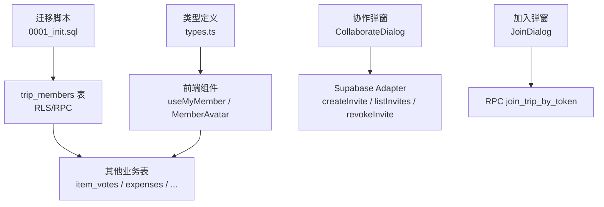
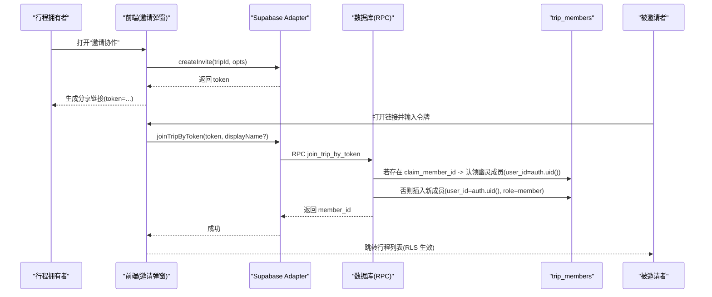
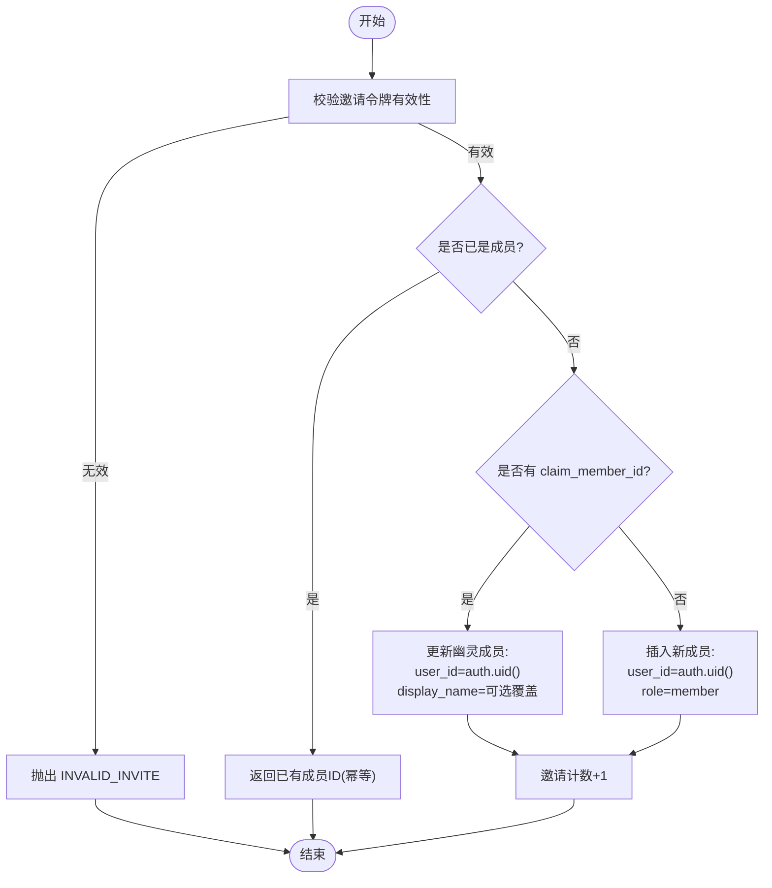
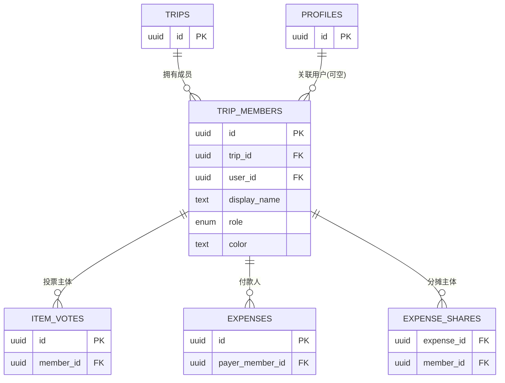

# 成员表 (trip_members)

<cite>
**本文引用的文件**
- [supabase/migrations/0001_init.sql](file://supabase/migrations/0001_init.sql)
- [src/data/types.ts](file://src/data/types.ts)
- [src/features/trip/useMyMember.ts](file://src/features/trip/useMyMember.ts)
- [src/features/trip/CollaborateDialog.tsx](file://src/features/trip/CollaborateDialog.tsx)
- [src/features/trip/JoinDialog.tsx](file://src/features/trip/JoinDialog.tsx)
- [src/data/adapters/supabase-trip.ts](file://src/data/adapters/supabase-trip.ts)
- [src/features/trip/MemberAvatar.tsx](file://src/features/trip/MemberAvatar.tsx)
</cite>

## 目录
1. [简介](#简介)
2. [项目结构中的位置](#项目结构中的位置)
3. [核心组件](#核心组件)
4. [架构总览](#架构总览)
5. [详细组件分析](#详细组件分析)
6. [依赖关系分析](#依赖关系分析)
7. [性能与约束](#性能与约束)
8. [故障排查指南](#故障排查指南)
9. [结论](#结论)
10. [附录：使用场景与代码路径](#附录使用场景与代码路径)

## 简介
本文件聚焦协作系统中的“成员表”trip_members，解释其在行程协作中的核心地位、角色体系（owner/member）、幽灵成员机制（user_id 为 NULL）以及字段设计意图。同时说明唯一性约束 uq_trip_members_user 的作用、幽灵成员从注销到重新认领的完整生命周期，并给出邀请、加入、角色管理等实际流程的代码路径参考。

## 项目结构中的位置
- 数据模型与权限策略定义在数据库迁移脚本中，包含 trip_members 表结构、索引、RLS 策略和 RPC 函数。
- 前端类型定义将数据库列映射为驼峰命名，供 UI 与业务逻辑使用。
- 协作入口由两个对话框组成：Owner 端生成邀请链接（CollaborateDialog），朋友端粘贴令牌加入（JoinDialog）。
- 数据访问通过 Supabase adapter 调用 RPC join_trip_by_token 完成加入流程；本地模式提供对应接口但行为不同。
- 成员识别与展示逻辑集中在 useMyMember 与 MemberAvatar 等组件中。

图表来源
- [supabase/migrations/0001_init.sql:67-91](file://supabase/migrations/0001_init.sql#L67-L91)
- [supabase/migrations/0001_init.sql:287-353](file://supabase/migrations/0001_init.sql#L287-L353)
- [supabase/migrations/0001_init.sql:431-465](file://supabase/migrations/0001_init.sql#L431-L465)
- [src/data/types.ts:129-149](file://src/data/types.ts#L129-L149)
- [src/features/trip/CollaborateDialog.tsx:1-100](file://src/features/trip/CollaborateDialog.tsx#L1-L100)
- [src/features/trip/JoinDialog.tsx:1-110](file://src/features/trip/JoinDialog.tsx#L1-L110)
- [src/data/adapters/supabase-trip.ts:366-413](file://src/data/adapters/supabase-trip.ts#L366-L413)

章节来源
- [supabase/migrations/0001_init.sql:67-91](file://supabase/migrations/0001_init.sql#L67-L91)
- [src/data/types.ts:129-149](file://src/data/types.ts#L129-L149)

## 核心组件
- trip_members 表：存储行程成员及其角色、显示名、颜色标识等，是投票、账本等功能的“唯一主体”。
- 角色体系：owner（创建者）与 member（普通成员）。
- 幽灵成员：当 user_id 为 NULL 时，表示该成员已注销或尚未认领账号，但仍保留历史数据与展示名。
- 唯一性约束：uq_trip_members_user 防止同一用户在同一个行程内重复成为成员。
- RLS 策略：成员可读，仅 owner 可增删改；加入走 RPC，避免直接写表。
- RPC：join_trip_by_token 支持凭邀请令牌加入，并可定向认领幽灵成员。

章节来源
- [supabase/migrations/0001_init.sql:67-91](file://supabase/migrations/0001_init.sql#L67-L91)
- [supabase/migrations/0001_init.sql:287-353](file://supabase/migrations/0001_init.sql#L287-L353)
- [supabase/migrations/0001_init.sql:431-465](file://supabase/migrations/0001_init.sql#L431-L465)

## 架构总览
下图展示了成员表在协作系统中的核心作用：它既是权限判定依据，也是投票、记账等业务实体的归属主体；邀请与加入流程通过 RPC 安全地写入成员记录，RLS 自动授予相应权限。

图表来源
- [src/features/trip/CollaborateDialog.tsx:1-100](file://src/features/trip/CollaborateDialog.tsx#L1-L100)
- [src/data/adapters/supabase-trip.ts:366-413](file://src/data/adapters/supabase-trip.ts#L366-L413)
- [supabase/migrations/0001_init.sql:431-465](file://supabase/migrations/0001_init.sql#L431-L465)

## 详细组件分析

### 表结构与字段设计
- id：主键，用于业务引用（如 item_votes.member_id、expenses.payer_member_id）。
- trip_id：关联 trips.id，删除级联，确保成员随行程清理。
- user_id：可空，指向 profiles.id；当用户注销时 on delete set null，退化为幽灵成员，历史数据保留。
- display_name：冗余存储显示名，避免频繁查询 profiles，且允许匿名/幽灵成员有独立展示名。
- role：枚举 member_role，默认 'member'；创建行程时触发器将 owner 加为成员。
- color：可选的颜色标识，优先用于头像配色，提升成员辨识度。
- created_at：创建时间，用于排序与审计。

唯一性约束与索引
- uq_trip_members_user：在 user_id 非空时，保证同一行程内每个用户只能有一个成员记录，防止重复加入。
- idx_trip_members_trip：按 trip_id 建立索引，加速成员列表查询。

章节来源
- [supabase/migrations/0001_init.sql:67-91](file://supabase/migrations/0001_init.sql#L67-L91)
- [supabase/migrations/0001_init.sql:287-353](file://supabase/migrations/0001_init.sql#L287-L353)

### 角色体系与权限控制
- 角色：owner（创建者）与 member（普通成员）。
- RLS 策略：
  - 成员可读：is_trip_member 或 is_trip_owner 可读取 trip_members。
  - 仅 owner 可增删改：通过 is_trip_owner 限制写入。
  - 加入流程走 RPC，避免前端直写成员表。

章节来源
- [supabase/migrations/0001_init.sql:287-353](file://supabase/migrations/0001_init.sql#L287-L353)

### 幽灵成员机制与生命周期
- 触发条件：当 profiles 被删除时，trip_members.user_id 设置为 NULL，成员变为“幽灵”，但 display_name、color、role 等历史数据保留。
- 影响范围：幽灵成员仍可作为投票、记账的主体（其 id 被 item_votes、expenses 等引用），因此不能物理删除。
- 认领流程：
  - 邀请时可设置 claim_member_id，指向某个幽灵成员。
  - 被邀请者调用 join_trip_by_token 后，服务端将该幽灵成员的 user_id 更新为当前登录用户，display_name 可按需提供覆盖。
  - 认领成功后，该成员恢复为真实成员，继承全部历史数据。

图表来源
- [supabase/migrations/0001_init.sql:431-465](file://supabase/migrations/0001_init.sql#L431-L465)

章节来源
- [supabase/migrations/0001_init.sql:431-465](file://supabase/migrations/0001_init.sql#L431-L465)

### 前端识别与展示
- 成员识别：useMyMember 根据 auth 的 user.id 匹配 trip_members.userId，未登录或本地模式降级为 owner。
- 幽灵成员展示：MemberAvatar 检测 userId 是否为 null，以样式区分幽灵成员；颜色优先使用 trip_members.color，否则基于 id 哈希选择稳定色板。

章节来源
- [src/features/trip/useMyMember.ts:1-31](file://src/features/trip/useMyMember.ts#L1-L31)
- [src/features/trip/MemberAvatar.tsx:1-88](file://src/features/trip/MemberAvatar.tsx#L1-L88)

### 邀请与加入流程
- Owner 端：CollaborateDialog 调用 repo.createInvite 生成邀请令牌，支持有效期与最大使用次数，并可指定 claim_member_id 定向认领幽灵成员。
- 朋友端：JoinDialog 调用 repo.joinTripByToken，后端执行 RPC join_trip_by_token，完成认领或新增成员，RLS 自动授予权限。

章节来源
- [src/features/trip/CollaborateDialog.tsx:1-197](file://src/features/trip/CollaborateDialog.tsx#L1-L197)
- [src/features/trip/JoinDialog.tsx:1-110](file://src/features/trip/JoinDialog.tsx#L1-L110)
- [src/data/adapters/supabase-trip.ts:366-413](file://src/data/adapters/supabase-trip.ts#L366-L413)

## 依赖关系分析
- trip_members 被以下业务表引用：
  - item_votes.member_id：投票归属。
  - expenses.payer_member_id：付款人归属。
  - expense_shares.member_id：分摊归属。
- 外键约束：
  - trips(id) -> trip_members.trip_id：级联删除。
  - profiles(id) -> trip_members.user_id：删除置空，支持幽灵成员。
- RLS 与权限函数：
  - is_trip_member/is_trip_owner：统一权限判定。
  - p_members_read/p_members_write：成员读、owner 写。

图表来源
- [supabase/migrations/0001_init.sql:67-91](file://supabase/migrations/0001_init.sql#L67-L91)
- [supabase/migrations/0001_init.sql:129-190](file://supabase/migrations/0001_init.sql#L129-L190)

章节来源
- [supabase/migrations/0001_init.sql:67-91](file://supabase/migrations/0001_init.sql#L67-L91)
- [supabase/migrations/0001_init.sql:129-190](file://supabase/migrations/0001_init.sql#L129-L190)

## 性能与约束
- 索引优化：idx_trip_members_trip 加速按行程查询成员列表；uq_trip_members_user 在保证唯一性的同时避免对幽灵成员产生冲突。
- 幂等加入：join_trip_by_token 先检查是否已是成员，再决定是否认领或新增，避免重复写入。
- 权限最小化：RLS 限制成员写入，所有变更通过 RPC 进行，降低越权风险。
- 幽灵成员不可删除：由于被 item_votes、expenses 等引用，删除会受外键限制，需先处理相关数据。

章节来源
- [supabase/migrations/0001_init.sql:67-91](file://supabase/migrations/0001_init.sql#L67-L91)
- [supabase/migrations/0001_init.sql:287-353](file://supabase/migrations/0001_init.sql#L287-L353)
- [supabase/migrations/0001_init.sql:431-465](file://supabase/migrations/0001_init.sql#L431-L465)

## 故障排查指南
- 无法移除成员：若成员是某笔账单的付款人，删除会被外键 RESTRICT 拦截。需先修改相关账单的付款人。
- 加入失败：检查邀请令牌是否过期、是否达到最大使用次数；确认已登录云端（匿名也可加入）。
- 幽灵成员显示异常：确认 display_name 是否正确；认领后 user_id 应更新为当前用户。
- 权限不足：确认当前用户是否为行程成员或 owner；RLS 策略可能阻止写入。

章节来源
- [src/features/trip/CollaborateDialog.tsx:67-82](file://src/features/trip/CollaborateDialog.tsx#L67-L82)
- [src/features/trip/JoinDialog.tsx:27-38](file://src/features/trip/JoinDialog.tsx#L27-L38)
- [supabase/migrations/0001_init.sql:287-353](file://supabase/migrations/0001_init.sql#L287-L353)

## 结论
trip_members 是协作系统的核心实体，承载成员身份、角色与历史数据。通过唯一性约束、RLS 与 RPC，系统实现了安全的邀请与加入流程；幽灵成员机制保障了用户注销后的数据完整性与可认领性。配合前端识别与展示逻辑，系统在多用户协作场景中提供了稳定、一致的用户体验。

## 附录：使用场景与代码路径
- 创建行程并自动添加 owner 为成员：
  - 触发器 on_trip_created 在 trips 插入时自动写入 trip_members。
  - 参考路径：[supabase/migrations/0001_init.sql:83-95](file://supabase/migrations/0001_init.sql#L83-L95)
- 生成邀请链接（Owner 端）：
  - CollaborateDialog 调用 repo.createInvite，生成 token 并拼接分享链接。
  - 参考路径：[src/features/trip/CollaborateDialog.tsx:42-55](file://src/features/trip/CollaborateDialog.tsx#L42-L55)
  - 适配器实现：[src/data/adapters/supabase-trip.ts:366-390](file://src/data/adapters/supabase-trip.ts#L366-L390)
- 加入行程（朋友端）：
  - JoinDialog 调用 repo.joinTripByToken，后端执行 RPC join_trip_by_token。
  - 参考路径：[src/features/trip/JoinDialog.tsx:27-38](file://src/features/trip/JoinDialog.tsx#L27-L38)
  - RPC 实现：[supabase/migrations/0001_init.sql:431-465](file://supabase/migrations/0001_init.sql#L431-L465)
- 认领幽灵成员：
  - 邀请时设置 claim_member_id，加入时服务端更新 user_id 与 display_name。
  - 参考路径：[supabase/migrations/0001_init.sql:446-452](file://supabase/migrations/0001_init.sql#L446-L452)
- 成员识别与展示：
  - useMyMember 根据 userId 匹配当前成员；MemberAvatar 使用 color 与 ghost 样式。
  - 参考路径：[src/features/trip/useMyMember.ts:16-31](file://src/features/trip/useMyMember.ts#L16-L31)
  - 参考路径：[src/features/trip/MemberAvatar.tsx:39-45](file://src/features/trip/MemberAvatar.tsx#L39-L45)