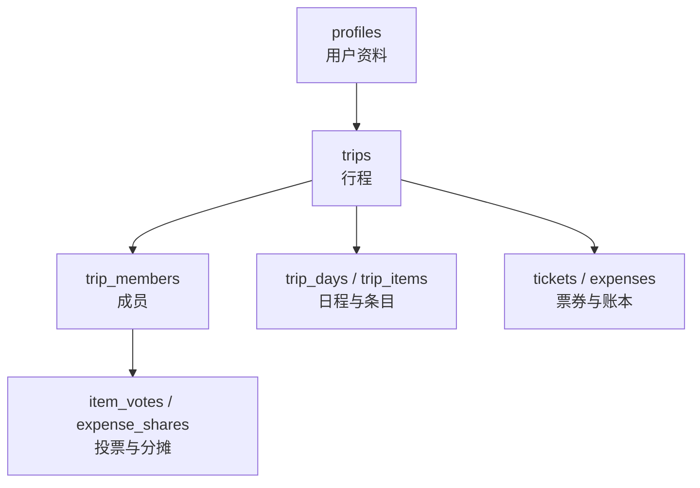
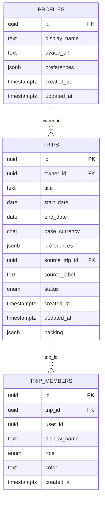
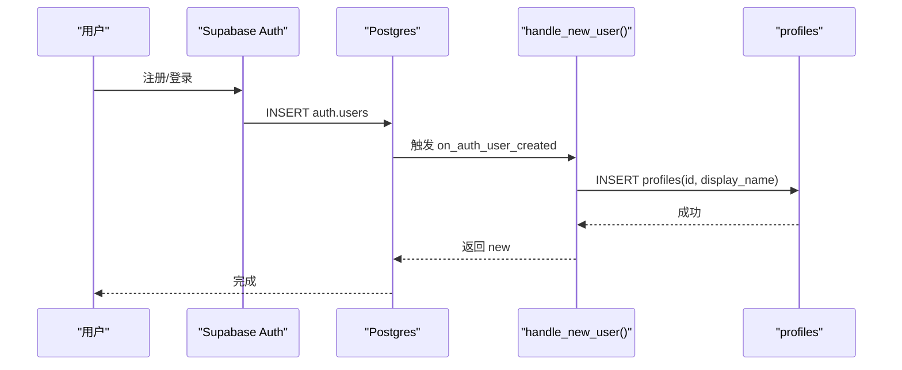
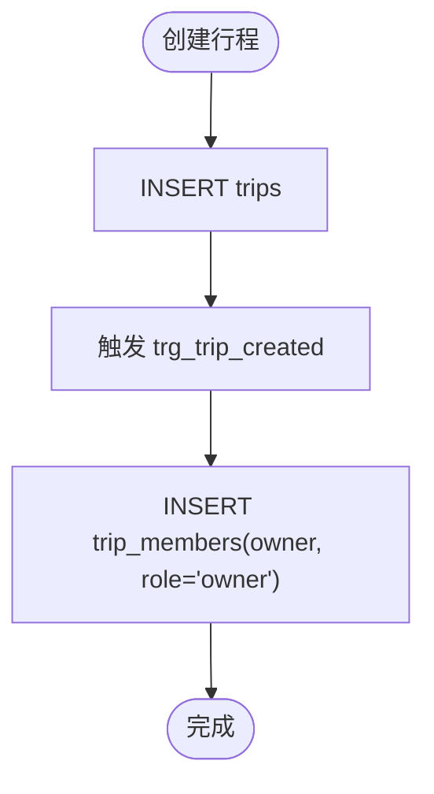
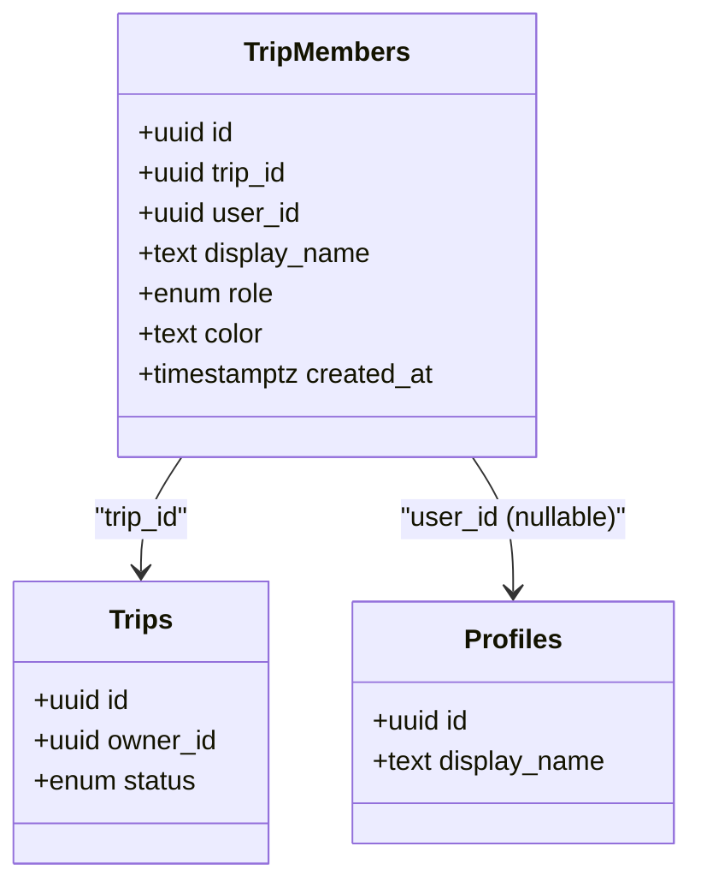
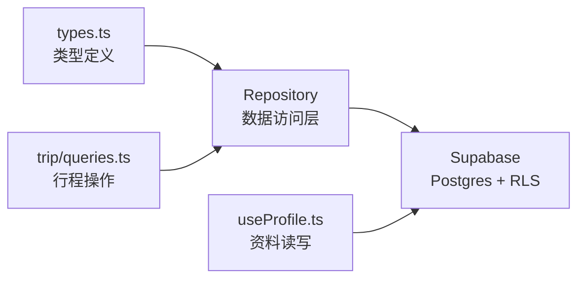

# 核心实体表

<cite>
**本文引用的文件**
- [supabase/migrations/0001_init.sql](file://supabase/migrations/0001_init.sql)
- [supabase/migrations/0002_trip_items_custom.sql](file://supabase/migrations/0002_trip_items_custom.sql)
- [supabase/migrations/0003_trip_packing.sql](file://supabase/migrations/0003_trip_packing.sql)
- [src/data/types.ts](file://src/data/types.ts)
- [src/features/auth/useProfile.ts](file://src/features/auth/useProfile.ts)
- [src/features/trip/queries.ts](file://src/features/trip/queries.ts)
- [docs/技术方案.md](file://docs/技术方案.md)
</cite>

## 目录
1. [简介](#简介)
2. [项目结构](#项目结构)
3. [核心组件](#核心组件)
4. [架构总览](#架构总览)
5. [详细组件分析](#详细组件分析)
6. [依赖关系分析](#依赖关系分析)
7. [性能考量](#性能考量)
8. [故障排查指南](#故障排查指南)
9. [结论](#结论)
10. [附录：使用场景与数据示例](#附录使用场景与数据示例)

## 简介
本文件聚焦“玩无一失”的核心实体表设计，围绕用户资料表 profiles、行程表 trips、成员表 trip_members 展开，解释字段定义、扩展机制、状态管理、货币支持、来源跟随、成员角色体系、幽灵成员机制与唯一性约束，并给出表关系图、外键约束说明以及实际使用场景与数据示例。

## 项目结构
- 数据库迁移集中在 supabase/migrations，核心建表、触发器、RLS 策略与 RPC 函数在 0001_init.sql 中定义；后续迁移逐步增强 trips、trip_items 等表能力（如 packing、kind、images、address）。
- 前端类型定义在 src/data/types.ts，与数据库列名一一对应，保证前后端契约一致。
- 认证与个人资料读写在 src/features/auth/useProfile.ts 中封装为 React Query Hook。
- 行程相关查询与写操作在 src/features/trip/queries.ts 中统一通过 Repository 调用。

图表来源
- [supabase/migrations/0001_init.sql:25-81](file://supabase/migrations/0001_init.sql#L25-L81)
- [supabase/migrations/0001_init.sql:100-190](file://supabase/migrations/0001_init.sql#L100-L190)

章节来源
- [supabase/migrations/0001_init.sql:1-530](file://supabase/migrations/0001_init.sql#L1-L530)
- [supabase/migrations/0002_trip_items_custom.sql:1-75](file://supabase/migrations/0002_trip_items_custom.sql#L1-L75)
- [supabase/migrations/0003_trip_packing.sql:1-21](file://supabase/migrations/0003_trip_packing.sql#L1-L21)
- [src/data/types.ts:113-187](file://src/data/types.ts#L113-L187)
- [src/features/auth/useProfile.ts:1-65](file://src/features/auth/useProfile.ts#L1-L65)
- [src/features/trip/queries.ts:1-236](file://src/features/trip/queries.ts#L1-L236)
- [docs/技术方案.md:325-355](file://docs/技术方案.md#L325-L355)

## 核心组件
- profiles：auth.users 的公开扩展，仅本人可读写；新用户注册时自动创建 profile 行。
- trips：行程主表，包含状态、基础货币、偏好、来源跟随、打包清单等。
- trip_members：成员表，承载角色、显示名、颜色；user_id 可为空表示幽灵成员；唯一性约束针对非空 user_id。

章节来源
- [supabase/migrations/0001_init.sql:25-81](file://supabase/migrations/0001_init.sql#L25-L81)
- [supabase/migrations/0001_init.sql:51-66](file://supabase/migrations/0001_init.sql#L51-L66)
- [supabase/migrations/0003_trip_packing.sql:13-16](file://supabase/migrations/0003_trip_packing.sql#L13-L16)
- [src/data/types.ts:113-137](file://src/data/types.ts#L113-L137)

## 架构总览
下图展示核心实体之间的关系与关键外键约束，体现“成员是投票与账本的唯一主体”的设计原则。

图表来源
- [supabase/migrations/0001_init.sql:25-81](file://supabase/migrations/0001_init.sql#L25-L81)
- [supabase/migrations/0001_init.sql:51-66](file://supabase/migrations/0001_init.sql#L51-L66)
- [supabase/migrations/0003_trip_packing.sql:13-16](file://supabase/migrations/0003_trip_packing.sql#L13-L16)

## 详细组件分析

### profiles 表：用户资料的扩展机制
- 设计要点
  - 以 auth.users.id 为主键的外键关联，删除级联，确保资料与账号生命周期一致。
  - 新增 handle_new_user 触发器：在 auth.users 插入后自动写入 profiles.display_name，默认从邮箱前缀或元数据推导，避免首次登录空白。
  - RLS 策略 p_profiles_self：仅本人可读写，他人不可读，隐私边界清晰。
  - 前端 useProfile Hook 提供读取与更新 displayName 的能力，并通过 React Query 缓存失效刷新成员列表。

- 关键字段
  - id：UUID，对应 auth.users.id
  - display_name：显示名，默认“旅行者”
  - avatar_url：头像链接
  - preferences：JSONB，存放 excludeTags、pace、interests 等偏好
  - created_at / updated_at：审计时间戳

- 触发器与权限
  - on_auth_user_created 触发器：after insert on auth.users，调用 handle_new_user 自动创建 profile。
  - RLS：p_profiles_self 限制为 id = auth.uid()。

图表来源
- [supabase/migrations/0001_init.sql:34-46](file://supabase/migrations/0001_init.sql#L34-L46)
- [supabase/migrations/0001_init.sql:324-327](file://supabase/migrations/0001_init.sql#L324-L327)
- [src/features/auth/useProfile.ts:19-65](file://src/features/auth/useProfile.ts#L19-L65)

章节来源
- [supabase/migrations/0001_init.sql:25-46](file://supabase/migrations/0001_init.sql#L25-L46)
- [supabase/migrations/0001_init.sql:324-327](file://supabase/migrations/0001_init.sql#L324-L327)
- [src/features/auth/useProfile.ts:1-65](file://src/features/auth/useProfile.ts#L1-L65)

### trips 表：状态管理、货币支持与来源跟随
- 设计要点
  - 状态机：planning → ongoing → finished → archived，用于控制流程阶段。
  - 基础货币 base_currency：默认 CNY，所有金额换算到此币种，便于结算与报表。
  - 来源跟随：source_trip_id 指向来源行程，source_label 记录“跟随自《XX》”，配合 clone_trip_from_share 实现一键克隆。
  - 打包清单 packing：JSONB 数组，存储 PackingItem，随行程一起读写。

- 关键字段
  - id：UUID
  - owner_id：外键到 profiles，拥有者
  - title/start_date/end_date：基本信息
  - base_currency：三字母货币代码
  - preferences：JSONB，如 excludeTags
  - source_trip_id/source_label：来源跟随
  - status：枚举 trip_status
  - packing：JSONB 数组（由 0003 迁移添加）

- 触发器
  - trg_trip_created：插入 trips 后自动将 owner 加入 trip_members 并标记为 owner，解决“鸡生蛋”问题。

图表来源
- [supabase/migrations/0001_init.sql:84-95](file://supabase/migrations/0001_init.sql#L84-L95)
- [supabase/migrations/0003_trip_packing.sql:13-16](file://supabase/migrations/0003_trip_packing.sql#L13-L16)

章节来源
- [supabase/migrations/0001_init.sql:51-66](file://supabase/migrations/0001_init.sql#L51-L66)
- [supabase/migrations/0001_init.sql:84-95](file://supabase/migrations/0001_init.sql#L84-L95)
- [supabase/migrations/0003_trip_packing.sql:1-21](file://supabase/migrations/0003_trip_packing.sql#L1-L21)
- [src/data/types.ts:113-127](file://src/data/types.ts#L113-L127)

### trip_members 表：成员角色体系、幽灵成员与唯一性约束
- 设计要点
  - 角色体系：owner/member，owner 拥有管理权限，member 参与协作。
  - 幽灵成员：user_id 可为 NULL，仅保留 display_name，仍可被投票、记账、结算；注销后退化为幽灵，历史保留。
  - 唯一性约束：uq_trip_members_user 对 (trip_id, user_id) 建立部分唯一索引（user_id IS NOT NULL），防止同一用户在同一行程重复加入。
  - 加入流程：通过 join_trip_by_token RPC 校验邀请 token，支持认领幽灵成员（claim_member_id），继承其历史。

- 关键字段
  - id：UUID
  - trip_id：外键到 trips
  - user_id：可选，关联 profiles；NULL 表示幽灵成员
  - display_name：冗余存储显示名，避免跨用户读 profiles
  - role：枚举 member_role
  - color：成员标识色
  - created_at：加入时间

图表来源
- [supabase/migrations/0001_init.sql:70-81](file://supabase/migrations/0001_init.sql#L70-L81)
- [supabase/migrations/0001_init.sql:432-465](file://supabase/migrations/0001_init.sql#L432-L465)

章节来源
- [supabase/migrations/0001_init.sql:70-81](file://supabase/migrations/0001_init.sql#L70-L81)
- [supabase/migrations/0001_init.sql:432-465](file://supabase/migrations/0001_init.sql#L432-L465)
- [src/data/types.ts:129-137](file://src/data/types.ts#L129-L137)

### 表关系与外键约束说明
- profiles.id → trips.owner_id：on delete cascade，删除用户资料会级联删除其创建的行程。
- trips.id → trips.source_trip_id：on delete set null，来源行程删除不影响当前行程。
- trips.id → trip_members.trip_id：on delete cascade，删除行程会清理成员。
- profiles.id → trip_members.user_id：on delete set null，用户注销后成员退化为幽灵，历史保留。
- 其他子表（trip_days、trip_items、tickets、expenses 等）均通过 trip_id 与 trips 关联，遵循统一 RLS 模板。

章节来源
- [supabase/migrations/0001_init.sql:25-81](file://supabase/migrations/0001_init.sql#L25-L81)
- [supabase/migrations/0001_init.sql:100-190](file://supabase/migrations/0001_init.sql#L100-L190)
- [docs/技术方案.md:325-355](file://docs/技术方案.md#L325-L355)

## 依赖关系分析
- 前端类型与后端表结构对齐：src/data/types.ts 中的 Trip、TripMember、TripItem 等接口与迁移中的列名一一对应，降低适配成本。
- 认证与资料：useProfile 通过 React Query 读取/更新 profiles，并在成功后使 trip bundle 缓存失效，确保成员显示名同步。
- 行程操作：trip queries 统一通过 Repository 调用，写操作采用乐观更新提升交互体验。

图表来源
- [src/data/types.ts:113-187](file://src/data/types.ts#L113-L187)
- [src/features/auth/useProfile.ts:19-65](file://src/features/auth/useProfile.ts#L19-L65)
- [src/features/trip/queries.ts:1-236](file://src/features/trip/queries.ts#L1-L236)

章节来源
- [src/data/types.ts:113-187](file://src/data/types.ts#L113-L187)
- [src/features/auth/useProfile.ts:1-65](file://src/features/auth/useProfile.ts#L1-L65)
- [src/features/trip/queries.ts:1-236](file://src/features/trip/queries.ts#L1-L236)

## 性能考量
- 一次性加载：get_trip_bundle RPC 一次返回多张表数据，减少往返延迟，适合移动端与高延迟网络环境。
- 乐观更新：前端写操作先更新本地缓存，失败再回滚，提升拖拽与排程的流畅度。
- 索引优化：trip_members.trip_id、trip_items.day_id/rank、trip_items.kind 等索引支撑常用查询与排序。
- 金额精度：金额一律整数分存储，避免浮点误差累积，提高结算准确性。

章节来源
- [supabase/migrations/0001_init.sql:393-427](file://supabase/migrations/0001_init.sql#L393-L427)
- [supabase/migrations/0001_init.sql:127-128](file://supabase/migrations/0001_init.sql#L127-L128)
- [supabase/migrations/0002_trip_items_custom.sql:70-70](file://supabase/migrations/0002_trip_items_custom.sql#L70-L70)
- [docs/技术方案.md:407-428](file://docs/技术方案.md#L407-L428)

## 故障排查指南
- 无法读取自己的行程：检查是否已触发 trg_trip_created 将 owner 加入 trip_members；若未加入，RLS 会拒绝访问。
- 幽灵成员无法认领：确认邀请 token 有效且未被过期或超用；join_trip_by_token 会校验 expires_at 与 used_count。
- 显示名不同步：更新 profiles.display_name 后会触发 trip bundle 缓存失效；若仍不一致，检查 React Query 的 queryKey 与 invalidate 逻辑。
- 重复成员加入：uq_trip_members_user 约束阻止同一用户在同一行程重复加入；若报错，检查 user_id 是否为空。

章节来源
- [supabase/migrations/0001_init.sql:84-95](file://supabase/migrations/0001_init.sql#L84-L95)
- [supabase/migrations/0001_init.sql:432-465](file://supabase/migrations/0001_init.sql#L432-L465)
- [src/features/auth/useProfile.ts:41-65](file://src/features/auth/useProfile.ts#L41-L65)
- [supabase/migrations/0001_init.sql:79-81](file://supabase/migrations/0001_init.sql#L79-L81)

## 结论
profiles、trips、trip_members 构成了“玩无一失”的核心骨架：profiles 作为身份扩展，trips 管理行程生命周期与协作上下文，trip_members 以成员为中心解耦身份与协作，支持幽灵成员与角色体系。结合触发器、RLS、RPC 与前端类型契约，系统在保证安全与隐私的同时，提供了高效的数据访问与良好的用户体验。

## 附录：使用场景与数据示例
- 新用户注册：自动创建 profiles 行，display_name 从邮箱或元数据推导。
- 创建行程：插入 trips 后自动将 owner 加入 trip_members，role=owner。
- 邀请加入：生成 trip_invites token，朋友凭 token 加入，可选择认领幽灵成员。
- 来源跟随：clone_trip_from_share 根据分享快照克隆为新行程，设置 source_trip_id 与 source_label。
- 打包清单：trips.packing 存储 PackingItem 数组，支持离线优先与云端同步。

章节来源
- [supabase/migrations/0001_init.sql:34-46](file://supabase/migrations/0001_init.sql#L34-L46)
- [supabase/migrations/0001_init.sql:84-95](file://supabase/migrations/0001_init.sql#L84-L95)
- [supabase/migrations/0001_init.sql:432-465](file://supabase/migrations/0001_init.sql#L432-L465)
- [supabase/migrations/0001_init.sql:477-520](file://supabase/migrations/0001_init.sql#L477-L520)
- [supabase/migrations/0003_trip_packing.sql:13-16](file://supabase/migrations/0003_trip_packing.sql#L13-L16)
- [src/data/types.ts:96-127](file://src/data/types.ts#L96-L127)