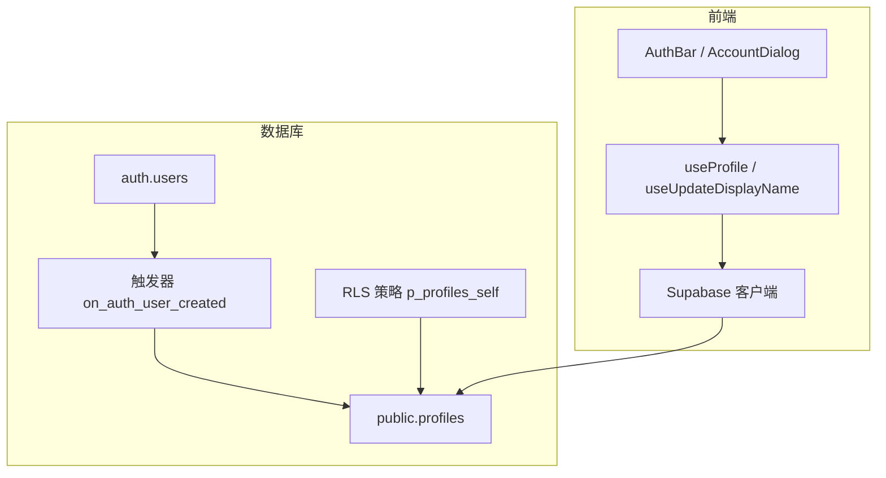
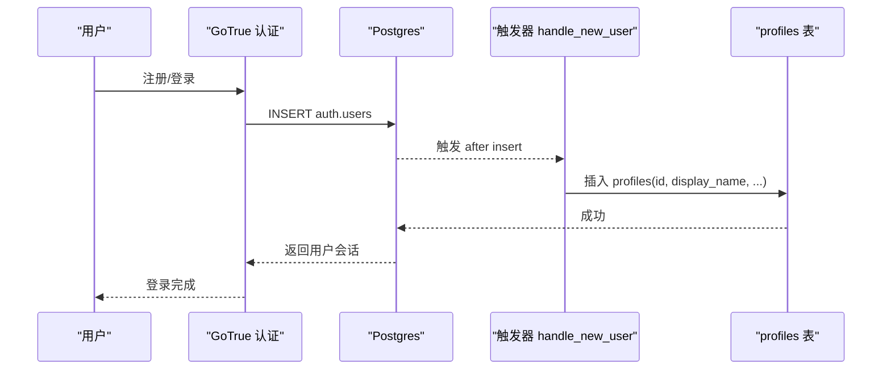
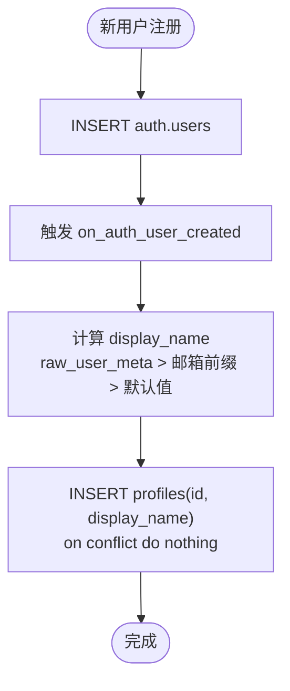
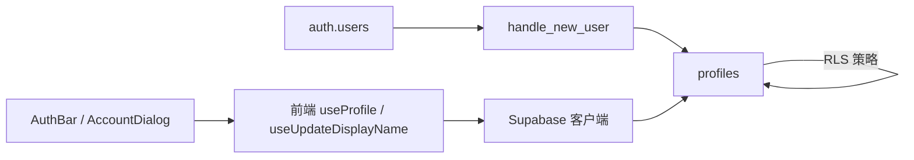

# 用户资料表 (profiles)

<cite>
**本文引用的文件**
- [supabase/migrations/0001_init.sql](file://supabase/migrations/0001_init.sql)
- [src/features/auth/useProfile.ts](file://src/features/auth/useProfile.ts)
- [src/features/auth/AuthBar.tsx](file://src/features/auth/AuthBar.tsx)
- [src/features/auth/AccountDialog.tsx](file://src/features/auth/AccountDialog.tsx)
- [src/data/supabase-client.ts](file://src/data/supabase-client.ts)
- [docs/技术方案.md](file://docs/技术方案.md)
</cite>

## 目录
1. [简介](#简介)
2. [项目结构](#项目结构)
3. [核心组件](#核心组件)
4. [架构总览](#架构总览)
5. [详细组件分析](#详细组件分析)
6. [依赖关系分析](#依赖关系分析)
7. [性能考量](#性能考量)
8. [故障排查指南](#故障排查指南)
9. [结论](#结论)
10. [附录：使用示例与最佳实践](#附录使用示例与最佳实践)

## 简介
本文件聚焦“用户资料表 profiles”的设计与实现，说明其作为 auth.users 扩展表的定位、与认证系统的关联机制、新用户注册时自动创建资料记录的触发器逻辑、字段定义与默认值策略、以及基于行级安全（RLS）的权限模型。同时提供前端获取与更新用户资料的典型用法与注意事项，帮助读者在“玩无一失”项目中正确、安全地使用 profiles 表。

## 项目结构
与 profiles 表直接相关的代码分布在数据库迁移脚本与前端认证/资料模块中：
- 数据库层：建表、触发器、RLS 策略集中在初始化迁移脚本中。
- 前端层：通过 Supabase 客户端读取/更新 profiles，配合 React Query 管理缓存与失效。

图表来源
- [supabase/migrations/0001_init.sql:21-46](file://supabase/migrations/0001_init.sql#L21-L46)
- [supabase/migrations/0001_init.sql:309-327](file://supabase/migrations/0001_init.sql#L309-L327)
- [src/features/auth/useProfile.ts:19-64](file://src/features/auth/useProfile.ts#L19-L64)
- [src/features/auth/AuthBar.tsx:18-56](file://src/features/auth/AuthBar.tsx#L18-L56)
- [src/features/auth/AccountDialog.tsx:13-95](file://src/features/auth/AccountDialog.tsx#L13-L95)
- [src/data/supabase-client.ts:24-34](file://src/data/supabase-client.ts#L24-L34)

章节来源
- [supabase/migrations/0001_init.sql:21-46](file://supabase/migrations/0001_init.sql#L21-L46)
- [supabase/migrations/0001_init.sql:309-327](file://supabase/migrations/0001_init.sql#L309-L327)
- [src/features/auth/useProfile.ts:19-64](file://src/features/auth/useProfile.ts#L19-L64)
- [src/features/auth/AuthBar.tsx:18-56](file://src/features/auth/AuthBar.tsx#L18-L56)
- [src/features/auth/AccountDialog.tsx:13-95](file://src/features/auth/AccountDialog.tsx#L13-L95)
- [src/data/supabase-client.ts:24-34](file://src/data/supabase-client.ts#L24-L34)

## 核心组件
- profiles 表：作为 auth.users 的公开扩展，存储用户的显示名称、头像 URL 与偏好设置等。
- handle_new_user 触发器：在新用户注册后自动创建 profiles 记录，并填充合理的默认值。
- RLS 策略 p_profiles_self：确保每个用户只能读写自己的资料行。
- 前端 useProfile / useUpdateDisplayName：封装查询与更新 profiles 的逻辑，结合 React Query 做缓存与失效。

章节来源
- [supabase/migrations/0001_init.sql:21-46](file://supabase/migrations/0001_init.sql#L21-L46)
- [supabase/migrations/0001_init.sql:309-327](file://supabase/migrations/0001_init.sql#L309-L327)
- [src/features/auth/useProfile.ts:19-64](file://src/features/auth/useProfile.ts#L19-L64)

## 架构总览
profiles 表位于认证系统之上，作为用户公开信息的载体；所有访问均受 RLS 约束，保证数据隔离。新用户注册由触发器自动补齐资料记录，避免前端额外写入。

图表来源
- [supabase/migrations/0001_init.sql:34-46](file://supabase/migrations/0001_init.sql#L34-L46)

章节来源
- [supabase/migrations/0001_init.sql:34-46](file://supabase/migrations/0001_init.sql#L34-L46)

## 详细组件分析

### 表结构与字段语义
profiles 表是 auth.users 的扩展，主键 id 与认证用户一一对应，删除认证用户时级联删除资料。各字段含义如下：
- id：主键，引用 auth.users.id，保证一对一关系。
- display_name：显示名称，非空，默认值为“旅行者”。用于全局昵称展示。
- avatar_url：头像 URL，可选。
- preferences：偏好设置，JSONB 类型，默认空对象，用于存储个性化配置（如排除标签、节奏、兴趣等）。
- created_at / updated_at：审计时间戳，updated_at 由通用触发器维护。

设计要点：
- 仅本人可读写 profiles，其他成员展示名走 trip_members.display_name，从而在不暴露 profiles 读权限的前提下满足协作场景。
- preferences 使用 JSONB 以灵活扩展，便于后续增加更多个性化选项而不破坏兼容性。

章节来源
- [supabase/migrations/0001_init.sql:21-32](file://supabase/migrations/0001_init.sql#L21-L32)
- [docs/技术方案.md:325-355](file://docs/技术方案.md#L325-L355)

### 触发器 handle_new_user：自动创建资料记录
当 auth.users 新增一行（新用户注册），触发器会：
- 尝试插入 profiles 记录，id 为新用户 id。
- display_name 优先取自 raw_user_meta_data 中的 display_name；若不存在则取邮箱前缀；再不存在则使用默认值“旅行者”。
- 使用 on conflict do nothing 避免重复插入。

该触发器确保：
- 新用户无需前端额外写库即可拥有 profiles 记录。
- 即使未提供 display_name，也能获得合理默认值，提升体验一致性。

图表来源
- [supabase/migrations/0001_init.sql:34-46](file://supabase/migrations/0001_init.sql#L34-L46)

章节来源
- [supabase/migrations/0001_init.sql:34-46](file://supabase/migrations/0001_init.sql#L34-L46)

### RLS 权限策略：仅本人读写
profiles 表启用行级安全，并通过策略 p_profiles_self 限制：
- 任何操作（SELECT/INSERT/UPDATE/DELETE）必须满足 id = auth.uid()。
- 这意味着只有当前登录用户能访问自己的资料行，他人无法读取或修改。

这一策略与前端 useSession 提供的 auth.uid() 配合，形成强一致的安全边界。

章节来源
- [supabase/migrations/0001_init.sql:309-327](file://supabase/migrations/0001_init.sql#L309-L327)
- [docs/技术方案.md:450-497](file://docs/技术方案.md#L450-L497)

### 前端使用：获取与更新用户资料
- 获取资料：useProfile 通过 supabase-js 查询 profiles 表，按 userId 过滤，返回 display_name、avatar_url 等字段。
- 更新显示名称：useUpdateDisplayName 对 profiles 执行 upsert（按 id 冲突处理），确保即使资料缺失也能创建；成功后使相关缓存失效，包括 profile 与 trip bundle，以便全应用即时刷新。

注意：
- 更新名称需先确认已登录（获取 user.id）。
- 名称为空时会拒绝提交，保障数据质量。
- 由于 RLS 限制，只有本人能更新自己的 profiles。

章节来源
- [src/features/auth/useProfile.ts:19-64](file://src/features/auth/useProfile.ts#L19-L64)
- [src/features/auth/AuthBar.tsx:18-56](file://src/features/auth/AuthBar.tsx#L18-L56)
- [src/features/auth/AccountDialog.tsx:13-95](file://src/features/auth/AccountDialog.tsx#L13-L95)
- [src/data/supabase-client.ts:24-34](file://src/data/supabase-client.ts#L24-L34)

## 依赖关系分析
- 数据库层依赖：
  - auth.users：触发器监听新注册用户。
  - profiles：被 RLS 保护，供前端读写。
  - trips/trip_members：协作场景下，成员展示名冗余在 trip_members，避免跨用户读 profiles。
- 前端层依赖：
  - Supabase 客户端：负责认证与会话管理。
  - React Query：缓存与失效 profiles 与 trip bundle。
  - UI 组件：AuthBar、AccountDialog 驱动用户交互。

图表来源
- [supabase/migrations/0001_init.sql:34-46](file://supabase/migrations/0001_init.sql#L34-L46)
- [supabase/migrations/0001_init.sql:309-327](file://supabase/migrations/0001_init.sql#L309-L327)
- [src/features/auth/useProfile.ts:19-64](file://src/features/auth/useProfile.ts#L19-L64)
- [src/features/auth/AuthBar.tsx:18-56](file://src/features/auth/AuthBar.tsx#L18-L56)
- [src/features/auth/AccountDialog.tsx:13-95](file://src/features/auth/AccountDialog.tsx#L13-L95)
- [src/data/supabase-client.ts:24-34](file://src/data/supabase-client.ts#L24-L34)

章节来源
- [supabase/migrations/0001_init.sql:34-46](file://supabase/migrations/0001_init.sql#L34-L46)
- [supabase/migrations/0001_init.sql:309-327](file://supabase/migrations/0001_init.sql#L309-L327)
- [src/features/auth/useProfile.ts:19-64](file://src/features/auth/useProfile.ts#L19-L64)
- [src/features/auth/AuthBar.tsx:18-56](file://src/features/auth/AuthBar.tsx#L18-L56)
- [src/features/auth/AccountDialog.tsx:13-95](file://src/features/auth/AccountDialog.tsx#L13-L95)
- [src/data/supabase-client.ts:24-34](file://src/data/supabase-client.ts#L24-L34)

## 性能考量
- 触发器开销：handle_new_user 仅在注册时执行一次，影响极小。
- RLS 评估：p_profiles_self 条件简单（id = auth.uid()），评估成本低。
- 前端缓存：useProfile 使用 React Query，避免频繁请求；更新名称后主动失效 ['profile'] 与 ['trip','bundle']，减少不必要的全量刷新。
- 建议：如需批量更新偏好，尽量合并为单次 upsert，减少往返。

[本节为通用指导，不直接分析具体文件]

## 故障排查指南
常见问题与处理建议：
- 无法读取 profiles：检查是否已登录且具备有效会话；RLS 要求 auth.uid() 存在。
- 更新名称失败：确认名称非空；检查网络与 Supabase 配置；查看错误信息是否为权限问题。
- 新用户无 profiles 记录：确认触发器 on_auth_user_created 已创建并生效；检查 raw_user_meta_data 与 email 是否存在。
- 匿名模式：匿名登录同样具备 uid，RLS 允许本人读写；但某些功能需要登录后才能访问。

章节来源
- [src/features/auth/useProfile.ts:19-64](file://src/features/auth/useProfile.ts#L19-L64)
- [src/data/supabase-client.ts:24-34](file://src/data/supabase-client.ts#L24-L34)
- [supabase/migrations/0001_init.sql:34-46](file://supabase/migrations/0001_init.sql#L34-L46)
- [supabase/migrations/0001_init.sql:309-327](file://supabase/migrations/0001_init.sql#L309-L327)

## 结论
profiles 表作为 auth.users 的扩展，提供了简洁而安全的用户资料管理能力。通过触发器自动创建记录与默认值策略，降低了前端复杂度；通过 RLS 严格限制访问范围，确保隐私与安全。前端通过 useProfile 与 useUpdateDisplayName 提供直观的获取与更新能力，并与全局缓存联动，保证界面一致性。整体设计兼顾了易用性、安全性与可扩展性。

[本节为总结性内容，不直接分析具体文件]

## 附录：使用示例与最佳实践
- 获取当前用户资料：
  - 使用 useProfile hook，传入 userId 作为查询键，确保登录态变化时自动重取。
  - 参考路径：[src/features/auth/useProfile.ts:19-38](file://src/features/auth/useProfile.ts#L19-L38)
- 更新显示名称：
  - 使用 useUpdateDisplayName mutation，进行 upsert 并失效相关缓存。
  - 参考路径：[src/features/auth/useProfile.ts:41-64](file://src/features/auth/useProfile.ts#L41-L64)
- 账户对话框：
  - 在 AccountDialog 中收集用户输入并提交，显示保存状态与错误提示。
  - 参考路径：[src/features/auth/AccountDialog.tsx:27-95](file://src/features/auth/AccountDialog.tsx#L27-L95)
- 顶部状态条：
  - AuthBar 根据登录态显示用户名与登出按钮，点击可打开账户对话框。
  - 参考路径：[src/features/auth/AuthBar.tsx:18-56](file://src/features/auth/AuthBar.tsx#L18-L56)

最佳实践：
- 始终通过 RLS 控制数据访问，不在前端做权限判断。
- 使用 JSONB 存储偏好时，保持向后兼容，新增字段时提供默认值。
- 更新名称后立即失效 ['profile'] 与 ['trip','bundle']，确保全应用同步。
- 新用户注册后无需额外写库，依赖触发器自动创建 profiles。

章节来源
- [src/features/auth/useProfile.ts:19-64](file://src/features/auth/useProfile.ts#L19-L64)
- [src/features/auth/AccountDialog.tsx:27-95](file://src/features/auth/AccountDialog.tsx#L27-L95)
- [src/features/auth/AuthBar.tsx:18-56](file://src/features/auth/AuthBar.tsx#L18-L56)