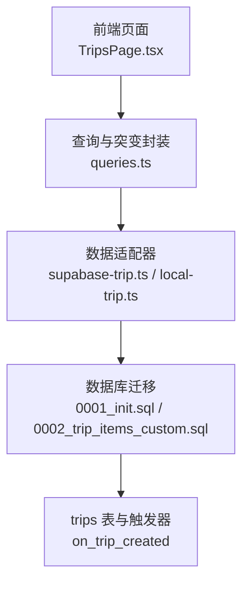
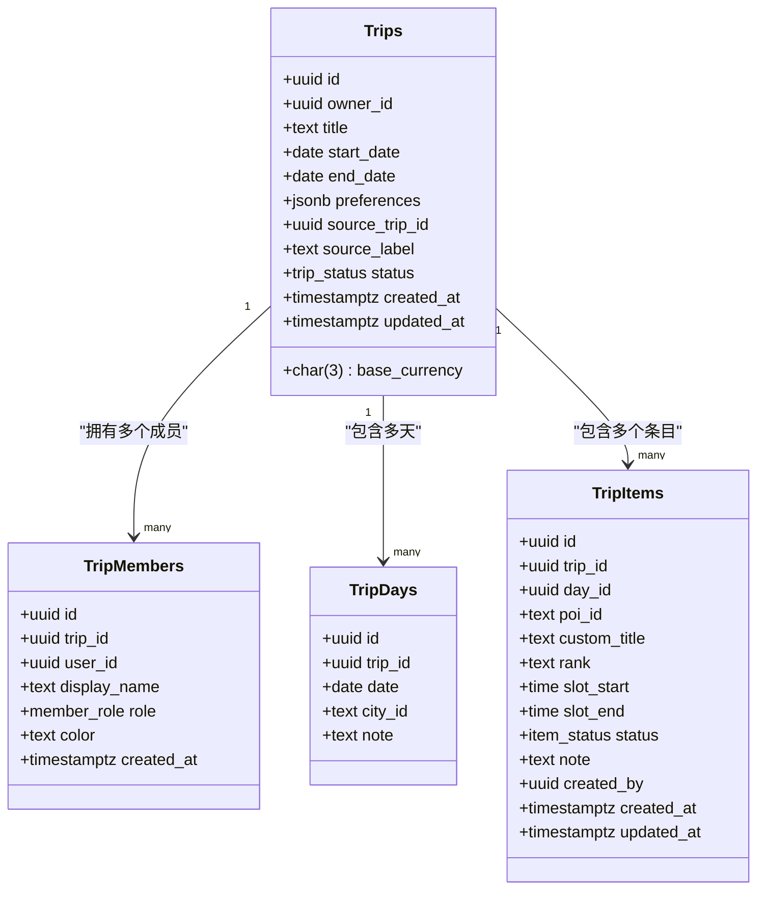
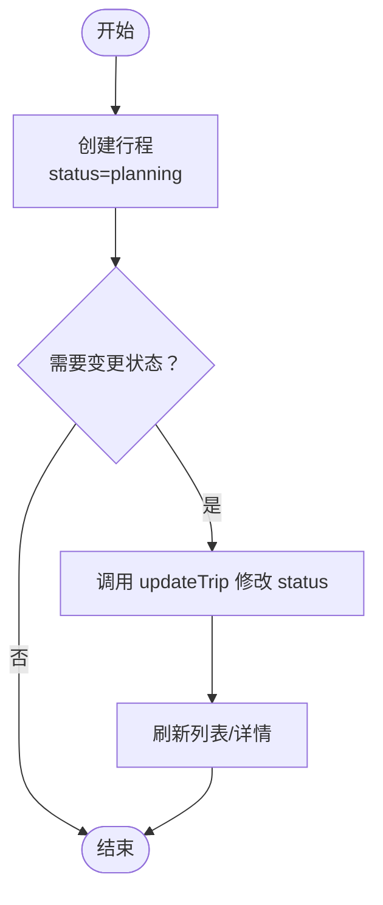
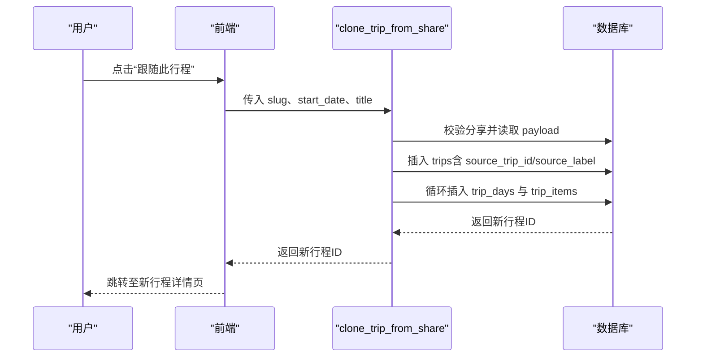
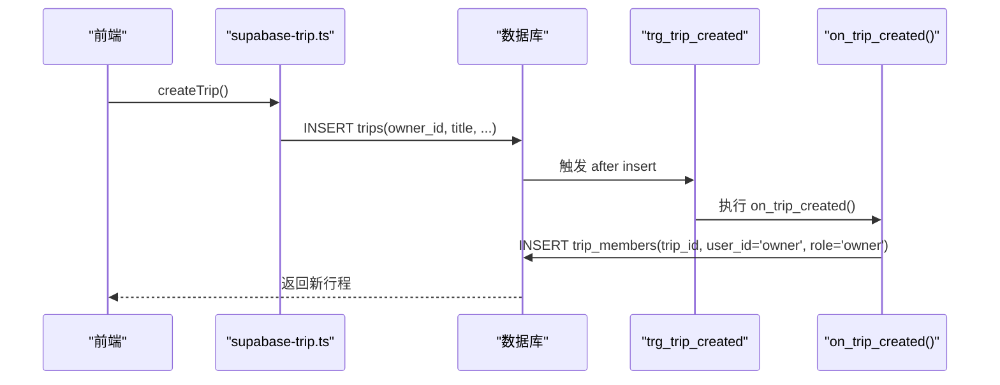
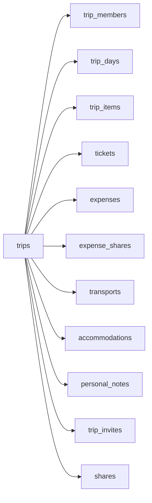

# 行程表 (trips)

<cite>
**本文引用的文件**
- [supabase/migrations/0001_init.sql](file://supabase/migrations/0001_init.sql)
- [supabase/migrations/0002_trip_items_custom.sql](file://supabase/migrations/0002_trip_items_custom.sql)
- [src/data/types.ts](file://src/data/types.ts)
- [src/features/trip/queries.ts](file://src/features/trip/queries.ts)
- [src/data/adapters/supabase-trip.ts](file://src/data/adapters/supabase-trip.ts)
- [src/data/adapters/local-trip.ts](file://src/data/adapters/local-trip.ts)
- [src/pages/TripsPage.tsx](file://src/pages/TripsPage.tsx)
</cite>

## 目录
1. [简介](#简介)
2. [项目结构](#项目结构)
3. [核心组件](#核心组件)
4. [架构总览](#架构总览)
5. [详细组件分析](#详细组件分析)
6. [依赖关系分析](#依赖关系分析)
7. [性能与索引优化](#性能与索引优化)
8. [故障排查指南](#故障排查指南)
9. [结论](#结论)
10. [附录：使用场景与代码路径](#附录使用场景与代码路径)

## 简介
本文件聚焦“玩无一失”中的行程表（trips）核心业务设计，围绕以下关键点展开：
- 行程状态管理：planning、ongoing、finished、archived
- 货币支持：base_currency 字段作为行程级基础币种
- 来源跟随机制：source_trip_id、source_label 实现“无脑跟随”克隆
- 字段语义：owner_id 所有者关系、日期范围 start_date/end_date、preferences 配置项
- 触发器 on_trip_created：自动将创建者添加为行程成员
- 索引与查询性能：基于迁移中的索引设计与批量数据获取策略
- 实际使用场景：行程创建、状态变更、跟随其他行程的代码路径指引

## 项目结构
与 trips 表直接相关的代码分布在数据库迁移、类型定义、前端页面与数据适配器中：
- 数据库层：trips 表结构、枚举、触发器、RLS、RPC 等均在迁移文件中定义
- 类型层：Trip 接口与相关枚举在 types.ts 中定义，与数据库列一一对应
- 前端层：TripsPage 提供创建入口；queries.ts 提供统一写操作封装
- 适配层：supabase-trip.ts 与 local-trip.ts 分别实现云端与本地存储的 CRUD

图表来源
- [src/pages/TripsPage.tsx:1-47](file://src/pages/TripsPage.tsx#L1-L47)
- [src/features/trip/queries.ts:1-236](file://src/features/trip/queries.ts#L1-L236)
- [src/data/adapters/supabase-trip.ts:200-237](file://src/data/adapters/supabase-trip.ts#L200-L237)
- [supabase/migrations/0001_init.sql:48-95](file://supabase/migrations/0001_init.sql#L48-L95)

章节来源
- [src/pages/TripsPage.tsx:1-47](file://src/pages/TripsPage.tsx#L1-L47)
- [src/features/trip/queries.ts:1-236](file://src/features/trip/queries.ts#L1-L236)
- [src/data/adapters/supabase-trip.ts:200-237](file://src/data/adapters/supabase-trip.ts#L200-L237)
- [supabase/migrations/0001_init.sql:48-95](file://supabase/migrations/0001_init.sql#L48-L95)

## 核心组件
- trips 表：承载行程主数据，包含所有者、标题、日期范围、基础币种、偏好、来源跟随、状态与时间戳
- trip_members 表：协作主体，记录成员角色与显示名；触发器确保创建者成为 owner 成员
- 枚举 trip_status：限定行程生命周期状态
- RPC get_trip_bundle：一次性拉取行程全量数据，减少往返
- 函数 clone_trip_from_share：从分享快照“无脑跟随”克隆为新行程，并设置 source_trip_id/source_label

章节来源
- [supabase/migrations/0001_init.sql:11-19](file://supabase/migrations/0001_init.sql#L11-L19)
- [supabase/migrations/0001_init.sql:48-95](file://supabase/migrations/0001_init.sql#L48-L95)
- [supabase/migrations/0001_init.sql:393-429](file://supabase/migrations/0001_init.sql#L393-L429)
- [supabase/migrations/0002_trip_items_custom.sql:20-74](file://supabase/migrations/0002_trip_items_custom.sql#L20-L74)

## 架构总览
trips 表处于整个行程系统的中心位置，被多张子表通过 trip_id 引用。其关键职责包括：
- 定义行程元数据与权限边界（owner_id）
- 驱动状态机（status）以控制 UI 展示与流程
- 支撑“跟随”能力（source_trip_id/source_label），便于复用他人行程骨架
- 作为预算与货币基准（base_currency），影响费用换算与展示

图表来源
- [supabase/migrations/0001_init.sql:48-127](file://supabase/migrations/0001_init.sql#L48-L127)

章节来源
- [supabase/migrations/0001_init.sql:48-127](file://supabase/migrations/0001_init.sql#L48-L127)

## 详细组件分析

### trips 表字段与业务含义
- id：主键，UUID
- owner_id：所有者用户 ID，关联 profiles，删除级联
- title：行程标题
- start_date/end_date：行程日期范围，可为空
- base_currency：行程级基础币种（默认 CNY），用于费用换算与展示
- preferences：JSONB 配置项（如 excludeTags），用于过滤或个性化行为
- source_trip_id：来源行程 ID，指向另一条 trips 记录，删除时置空
- source_label：文本标签，记录“跟随自《...》”，便于溯源
- status：行程状态枚举，默认 planning
- created_at/updated_at：创建与更新时间，由触发器自动维护

章节来源
- [supabase/migrations/0001_init.sql:48-65](file://supabase/migrations/0001_init.sql#L48-L65)
- [src/data/types.ts:113-127](file://src/data/types.ts#L113-L127)

### 行程状态管理（planning、ongoing、finished、archived）
- 状态枚举在初始化迁移中定义，限制合法值
- 前端页面根据状态映射中文文案与样式
- 更新状态通过 updateTrip 写入 trips.status

图表来源
- [supabase/migrations/0001_init.sql:11-19](file://supabase/migrations/0001_init.sql#L11-L19)
- [src/pages/TripsPage.tsx:11-23](file://src/pages/TripsPage.tsx#L11-L23)
- [src/features/trip/queries.ts:150-159](file://src/features/trip/queries.ts#L150-L159)
- [src/data/adapters/supabase-trip.ts:220-237](file://src/data/adapters/supabase-trip.ts#L220-L237)

章节来源
- [supabase/migrations/0001_init.sql:11-19](file://supabase/migrations/0001_init.sql#L11-L19)
- [src/pages/TripsPage.tsx:11-23](file://src/pages/TripsPage.tsx#L11-L23)
- [src/features/trip/queries.ts:150-159](file://src/features/trip/queries.ts#L150-L159)
- [src/data/adapters/supabase-trip.ts:220-237](file://src/data/adapters/supabase-trip.ts#L220-L237)

### 货币支持（base_currency）
- trips.base_currency 作为行程级基础币种，默认 CNY
- 费用记录 expenses.currency 与 fx_rate 用于换算到 base_currency
- 前端与后端均读取 trips.base_currency 进行展示与计算

章节来源
- [supabase/migrations/0001_init.sql:57-58](file://supabase/migrations/0001_init.sql#L57-L58)
- [supabase/migrations/0001_init.sql:165-181](file://supabase/migrations/0001_init.sql#L165-L181)
- [src/data/adapters/supabase-trip.ts:220-237](file://src/data/adapters/supabase-trip.ts#L220-L237)

### 来源跟随机制（source_trip_id、source_label）
- 通过 clone_trip_from_share 从分享快照克隆新行程，设置 source_trip_id 与 source_label
- 仅复制 POI 引用、交通字段、时段与顺序；票券/账本/个人笔记不复制；条目状态重置为候选
- 前端可通过 source_label 提示“跟随自《...》”

图表来源
- [supabase/migrations/0002_trip_items_custom.sql:20-74](file://supabase/migrations/0002_trip_items_custom.sql#L20-L74)
- [supabase/migrations/0001_init.sql:476-520](file://supabase/migrations/0001_init.sql#L476-L520)

章节来源
- [supabase/migrations/0002_trip_items_custom.sql:20-74](file://supabase/migrations/0002_trip_items_custom.sql#L20-L74)
- [supabase/migrations/0001_init.sql:476-520](file://supabase/migrations/0001_init.sql#L476-L520)

### 触发器 on_trip_created：自动添加创建者为成员
- 在 trips 插入后触发，自动向 trip_members 插入一条 owner 成员记录
- 使用 profiles.display_name 填充显示名，避免 owner 无法读取自身行程的问题

图表来源
- [supabase/migrations/0001_init.sql:83-95](file://supabase/migrations/0001_init.sql#L83-L95)
- [src/data/adapters/supabase-trip.ts:200-218](file://src/data/adapters/supabase-trip.ts#L200-L218)

章节来源
- [supabase/migrations/0001_init.sql:83-95](file://supabase/migrations/0001_init.sql#L83-L95)
- [src/data/adapters/supabase-trip.ts:200-218](file://src/data/adapters/supabase-trip.ts#L200-L218)

### 日期范围管理与 preferences 配置
- start_date/end_date：可选，用于界定行程时间段
- preferences：JSONB，示例 include excludeTags 等过滤配置，供前端或后端逻辑使用
- 创建时默认空对象，后续可增量更新

章节来源
- [supabase/migrations/0001_init.sql:55-58](file://supabase/migrations/0001_init.sql#L55-L58)
- [src/data/types.ts:113-127](file://src/data/types.ts#L113-L127)
- [src/data/adapters/supabase-trip.ts:220-237](file://src/data/adapters/supabase-trip.ts#L220-L237)

## 依赖关系分析
- trips 表被 trip_members、trip_days、trip_items、tickets、expenses、transports、accommodations、personal_notes、trip_invites、shares 等多张表引用
- RLS 策略基于 is_trip_member/is_trip_owner 判定访问权限
- 批量数据通过 get_trip_bundle 一次性聚合，降低网络往返

图表来源
- [supabase/migrations/0001_init.sql:67-267](file://supabase/migrations/0001_init.sql#L67-L267)

章节来源
- [supabase/migrations/0001_init.sql:67-267](file://supabase/migrations/0001_init.sql#L67-L267)

## 性能与索引优化
- trips.owner_id 索引：加速按所有者查询行程列表
- trip_members.trip_id 索引：加速按行程查成员
- trip_items.trip_id/day_id/rank 索引：加速按天排序与筛选条目
- expense_shares.trip_id 索引：加速按行程汇总分摊
- transports/accommodations/tickets/expenses 的 trip_id 索引：加速子表按行程查询
- get_trip_bundle：一次性聚合多表 JSON，减少多次往返
- updated_at 自动维护：通过触发器在更新时刷新时间戳，便于缓存失效与排序

章节来源
- [supabase/migrations/0001_init.sql:65-66](file://supabase/migrations/0001_init.sql#L65-L66)
- [supabase/migrations/0001_init.sql:79-82](file://supabase/migrations/0001_init.sql#L79-L82)
- [supabase/migrations/0001_init.sql:108-127](file://supabase/migrations/0001_init.sql#L108-L127)
- [supabase/migrations/0001_init.sql:180-190](file://supabase/migrations/0001_init.sql#L180-L190)
- [supabase/migrations/0001_init.sql:210-229](file://supabase/migrations/0001_init.sql#L210-L229)
- [supabase/migrations/0001_init.sql:272-285](file://supabase/migrations/0001_init.sql#L272-L285)
- [supabase/migrations/0001_init.sql:393-429](file://supabase/migrations/0001_init.sql#L393-L429)

## 故障排查指南
- 创建行程后无法看到自己：确认触发器 trg_trip_created 是否生效，检查 trip_members 是否插入 owner 成员
- 权限错误：检查 RLS 策略 p_trips_* 与 is_trip_member/is_trip_owner 是否正确
- 跟随失败：确认分享 slug 有效且未撤销，clone_trip_from_share 是否能读取 payload
- 费用换算异常：核对 expenses.currency 与 fx_rate，以及 trips.base_currency 是否一致
- 列表加载慢：优先使用 get_trip_bundle 减少往返；检查各 trip_id 索引是否存在

章节来源
- [supabase/migrations/0001_init.sql:83-95](file://supabase/migrations/0001_init.sql#L83-L95)
- [supabase/migrations/0001_init.sql:329-344](file://supabase/migrations/0001_init.sql#L329-L344)
- [supabase/migrations/0001_init.sql:393-429](file://supabase/migrations/0001_init.sql#L393-L429)
- [supabase/migrations/0002_trip_items_custom.sql:20-74](file://supabase/migrations/0002_trip_items_custom.sql#L20-L74)

## 结论
trips 表是整个行程系统的核心枢纽，通过明确的状态机、灵活的货币支持与“无脑跟随”机制，既保证了数据一致性，又提升了复用效率。配合完善的索引与批量查询策略，系统在高并发与复杂交互下仍保持良好性能。建议在扩展新功能时遵循现有模式：以 trips 为中心，谨慎设计外键与索引，并通过触发器与 RPC 保证数据一致性与用户体验。

## 附录：使用场景与代码路径

### 场景一：创建行程
- 前端入口：TripsPage.submit 调用 useCreateTrip
- 数据适配器：supabase-trip.createTrip 插入 trips，默认 status=planning，base_currency=CNY
- 触发器：trg_trip_created 自动插入 trip_members 的 owner 成员

章节来源
- [src/pages/TripsPage.tsx:36-47](file://src/pages/TripsPage.tsx#L36-L47)
- [src/features/trip/queries.ts:32-39](file://src/features/trip/queries.ts#L32-L39)
- [src/data/adapters/supabase-trip.ts:200-218](file://src/data/adapters/supabase-trip.ts#L200-L218)
- [supabase/migrations/0001_init.sql:83-95](file://supabase/migrations/0001_init.sql#L83-L95)

### 场景二：变更行程状态
- 前端：useTripMutations.updateTrip 提交 patch，包含 status
- 适配器：updateTrip 将 status 写入 trips
- 列表/详情：刷新后根据状态展示不同文案与样式

章节来源
- [src/features/trip/queries.ts:150-159](file://src/features/trip/queries.ts#L150-L159)
- [src/data/adapters/supabase-trip.ts:220-237](file://src/data/adapters/supabase-trip.ts#L220-L237)
- [src/pages/TripsPage.tsx:11-23](file://src/pages/TripsPage.tsx#L11-L23)

### 场景三：跟随其他行程（无脑跟随）
- 服务端：clone_trip_from_share 读取分享快照，插入新 trips（含 source_trip_id/source_label），并复制日程与条目
- 前端：调用该 RPC 后跳转到新行程详情页

章节来源
- [supabase/migrations/0002_trip_items_custom.sql:20-74](file://supabase/migrations/0002_trip_items_custom.sql#L20-L74)
- [supabase/migrations/0001_init.sql:476-520](file://supabase/migrations/0001_init.sql#L476-L520)

### 场景四：本地模式下的行程创建
- 本地适配器：local-trip.createTrip 生成内存数据结构，并初始化 owner 成员

章节来源
- [src/data/adapters/local-trip.ts:117-152](file://src/data/adapters/local-trip.ts#L117-L152)