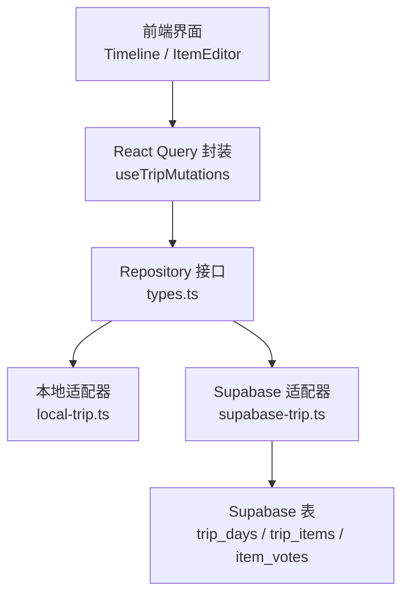
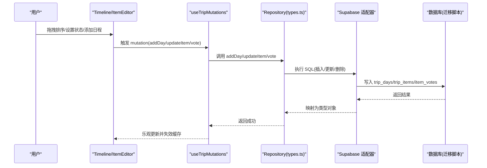
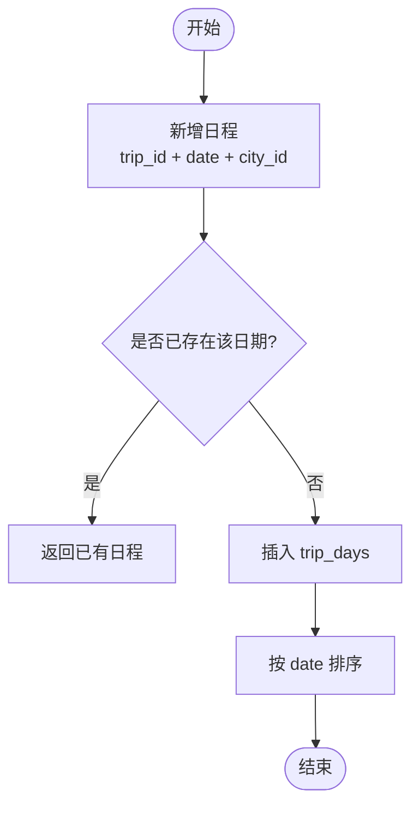
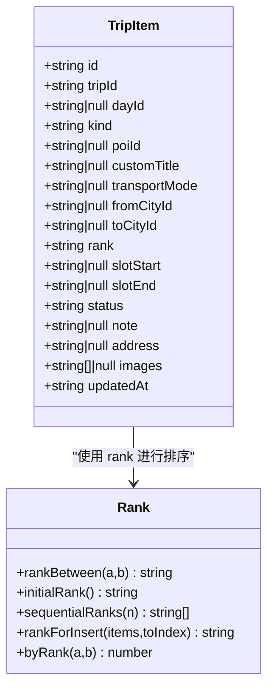
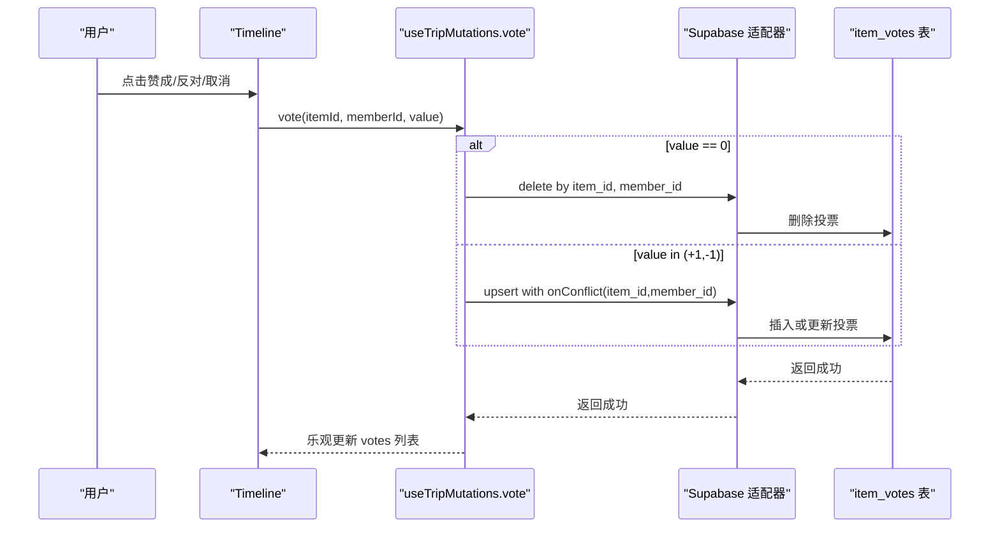
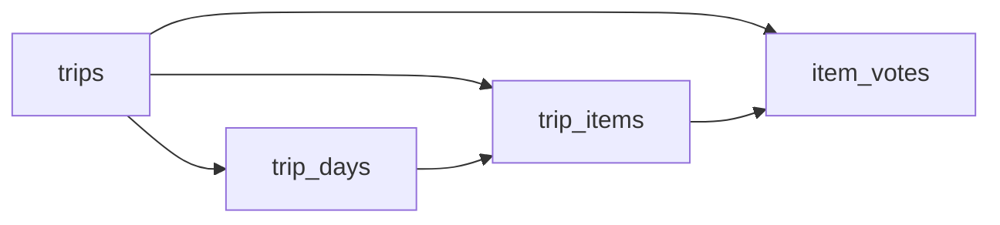

# 行程管理表

<cite>
**本文引用的文件**
- [supabase/migrations/0001_init.sql](file://supabase/migrations/0001_init.sql)
- [supabase/migrations/0002_trip_items_custom.sql](file://supabase/migrations/0002_trip_items_custom.sql)
- [supabase/migrations/0005_trip_item_images.sql](file://supabase/migrations/0005_trip_item_images.sql)
- [supabase/migrations/0007_trip_item_address.sql](file://supabase/migrations/0007_trip_item_address.sql)
- [src/domain/trip/rank.ts](file://src/domain/trip/rank.ts)
- [src/domain/trip/sanity-check.ts](file://src/domain/trip/sanity-check.ts)
- [src/data/types.ts](file://src/data/types.ts)
- [src/features/trip/queries.ts](file://src/features/trip/queries.ts)
- [src/data/adapters/supabase-trip.ts](file://src/data/adapters/supabase-trip.ts)
- [src/data/adapters/local-trip.ts](file://src/data/adapters/local-trip.ts)
</cite>

## 目录
1. [简介](#简介)
2. [项目结构](#项目结构)
3. [核心组件](#核心组件)
4. [架构总览](#架构总览)
5. [详细组件分析](#详细组件分析)
6. [依赖关系分析](#依赖关系分析)
7. [性能与索引优化](#性能与索引优化)
8. [CRUD 操作示例与常见查询模式](#crud-操作示例与常见查询模式)
9. [故障排查指南](#故障排查指南)
10. [结论](#结论)

## 简介
本文档围绕“玩无一失”的行程管理相关表，系统化说明以下三张核心表的设计原理与实现：
- 日程表 trip_days：日期管理与城市关联机制
- 项目表 trip_items：分数序排序算法、状态流转与时间槽管理
- 投票表 item_votes：投票机制与唯一性约束

同时给出索引策略、查询性能考虑、完整 CRUD 示例与常见查询模式，帮助读者从数据库到前端调用链路全面理解。

## 项目结构
本项目的数据模型定义在 Supabase SQL 迁移文件中，业务逻辑在前端 TypeScript 中实现，并通过适配器（本地存储或 Supabase）访问数据。关键路径如下：
- 数据库层：supabase/migrations/*.sql
- 类型与接口：src/data/types.ts
- 领域逻辑：src/domain/trip/*（如 rank.ts、sanity-check.ts）
- 前端交互：src/features/trip/*（如 queries.ts）
- 数据适配：src/data/adapters/*（local-trip.ts、supabase-trip.ts）

图表来源
- [src/features/trip/queries.ts:45-148](file://src/features/trip/queries.ts#L45-L148)
- [src/data/adapters/supabase-trip.ts:244-272](file://src/data/adapters/supabase-trip.ts#L244-L272)
- [src/data/adapters/supabase-trip.ts:415-436](file://src/data/adapters/supabase-trip.ts#L415-L436)
- [src/data/types.ts:151-187](file://src/data/types.ts#L151-L187)

章节来源
- [src/features/trip/queries.ts:45-148](file://src/features/trip/queries.ts#L45-L148)
- [src/data/adapters/supabase-trip.ts:244-272](file://src/data/adapters/supabase-trip.ts#L244-L272)
- [src/data/adapters/supabase-trip.ts:415-436](file://src/data/adapters/supabase-trip.ts#L415-L436)
- [src/data/types.ts:151-187](file://src/data/types.ts#L151-L187)

## 核心组件
- trip_days：按日期组织行程日，支持城市关联与备注；同一行程内日期唯一。
- trip_items：行程条目，支持景点、交通、住宿、备注四类；使用分数序 rank 进行稳定且并发友好的排序；包含时间槽 slot_start/slot_end；状态机涵盖心愿、候选、确定、去过、放弃。
- item_votes：成员对条目的投票记录，限制每个成员对同一条目仅一次投票，值为 +1/-1。

章节来源
- [supabase/migrations/0001_init.sql:100-138](file://supabase/migrations/0001_init.sql#L100-L138)
- [supabase/migrations/0002_trip_items_custom.sql:11-18](file://supabase/migrations/0002_trip_items_custom.sql#L11-L18)
- [src/data/types.ts:151-187](file://src/data/types.ts#L151-L187)

## 架构总览
下图展示从用户操作到数据库落库的整体流程，重点覆盖 trip_days、trip_items、item_votes 的写入路径。

图表来源
- [src/features/trip/queries.ts:65-148](file://src/features/trip/queries.ts#L65-L148)
- [src/data/adapters/supabase-trip.ts:244-272](file://src/data/adapters/supabase-trip.ts#L244-L272)
- [src/data/adapters/supabase-trip.ts:415-436](file://src/data/adapters/supabase-trip.ts#L415-L436)
- [supabase/migrations/0001_init.sql:100-138](file://supabase/migrations/0001_init.sql#L100-L138)

## 详细组件分析

### trip_days 表：日期管理与城市关联
- 设计要点
  - 主键 id，外键 trip_id 引用 trips，级联删除。
  - date 字段表示具体日期，unique(trip_id, date) 保证同行程内日期不重复。
  - city_id 文本引用世界库中的城市（如 city-paris），便于地图与 POI 聚合。
  - note 用于该日的备注信息。
  - 索引 idx_trip_days_trip 加速按行程查询。
- 行为约定
  - 删除某日时，属于该日的条目 day_id 置空退回候选池，避免误删用户积累的点。
  - 新增/更新日程时，按日期排序维护列表顺序。

图表来源
- [src/data/adapters/local-trip.ts:168-196](file://src/data/adapters/local-trip.ts#L168-L196)
- [supabase/migrations/0001_init.sql:100-108](file://supabase/migrations/0001_init.sql#L100-L108)

章节来源
- [supabase/migrations/0001_init.sql:100-108](file://supabase/migrations/0001_init.sql#L100-L108)
- [src/data/adapters/local-trip.ts:168-196](file://src/data/adapters/local-trip.ts#L168-L196)

### trip_items 表：分数序排序、状态流转与时间槽
- 设计要点
  - 主键 id，外键 trip_id、day_id（可为 null 表示候选池）。
  - poi_id/custom_title 二选一，确保条目有目标。
  - kind 支持 poi/transport/note/accommodation，扩展了转场日的时间线串联能力。
  - transport_mode/from_city_id/to_city_id 用于交通类条目。
  - rank 采用分数序（base62 小数），只写被拖动行，天然抗并发。
  - slot_start/slot_end 表示时间槽，便于可视化与校验。
  - status 枚举：wishlist/candidate/confirmed/visited/dropped。
  - 索引 idx_trip_items_trip、idx_trip_items_day(day_id, rank) 提升按天排序查询效率。
- 分数序算法
  - 基于 base62 字符集生成可比较的小数字符串，保证 a < mid < b。
  - 通过 rankBetween、rankForInsert、initialRank、sequentialRanks 等函数完成插入与批量生成。
  - 测试覆盖边界情况与压力场景，确保末位不为 '0'，避免无法插值。
- 状态流转
  - 由前端编辑器提供状态选项，后端以字符串存储，无强制状态机约束。
  - 合理性检查（sanity-check）仅针对 confirmed 状态进行闭馆、过满、折返、预约死线等体检。
- 时间槽管理
  - slot_start/slot_end 用于可视化与校验；配合 POI 时长与步行转场估算，发现排程问题。

图表来源
- [src/data/types.ts:159-187](file://src/data/types.ts#L159-L187)
- [src/domain/trip/rank.ts:1-91](file://src/domain/trip/rank.ts#L1-L91)

章节来源
- [supabase/migrations/0001_init.sql:110-128](file://supabase/migrations/0001_init.sql#L110-L128)
- [supabase/migrations/0002_trip_items_custom.sql:11-18](file://supabase/migrations/0002_trip_items_custom.sql#L11-L18)
- [supabase/migrations/0005_trip_item_images.sql:10-12](file://supabase/migrations/0005_trip_item_images.sql#L10-L12)
- [supabase/migrations/0007_trip_item_address.sql:10-12](file://supabase/migrations/0007_trip_item_address.sql#L10-L12)
- [src/domain/trip/rank.ts:1-91](file://src/domain/trip/rank.ts#L1-L91)
- [src/domain/trip/sanity-check.ts:84-177](file://src/domain/trip/sanity-check.ts#L84-L177)
- [src/data/types.ts:159-187](file://src/data/types.ts#L159-L187)

### item_votes 表：投票机制与唯一性约束
- 设计要点
  - 主键 id，外键 trip_id、item_id、member_id，级联删除。
  - value 限定为 -1 或 1，check 约束防止非法值。
  - unique(item_id, member_id) 保证每个成员对同一条目仅一次投票。
  - 索引 idx_item_votes_trip 加速按行程统计投票。
- 行为约定
  - 前端 vote 操作支持 +1/-1/0（0 表示取消投票），适配器根据 value 决定 upsert 或删除。
  - 本地适配器同样维护 votes 数组，保持前后一致。

图表来源
- [src/features/trip/queries.ts:137-148](file://src/features/trip/queries.ts#L137-L148)
- [src/data/adapters/supabase-trip.ts:415-436](file://src/data/adapters/supabase-trip.ts#L415-L436)
- [src/data/adapters/local-trip.ts:297-303](file://src/data/adapters/local-trip.ts#L297-L303)
- [supabase/migrations/0001_init.sql:129-138](file://supabase/migrations/0001_init.sql#L129-L138)

章节来源
- [supabase/migrations/0001_init.sql:129-138](file://supabase/migrations/0001_init.sql#L129-L138)
- [src/features/trip/queries.ts:137-148](file://src/features/trip/queries.ts#L137-L148)
- [src/data/adapters/supabase-trip.ts:415-436](file://src/data/adapters/supabase-trip.ts#L415-L436)
- [src/data/adapters/local-trip.ts:297-303](file://src/data/adapters/local-trip.ts#L297-L303)

## 依赖关系分析
- trip_days 与 trip_items：trip_items.day_id 外键指向 trip_days，删除 day 时 set null，使条目退回候选池。
- trip_items 与 item_votes：item_votes.item_id 外键指向 trip_items，删除 item 时级联删除其所有投票。
- 权限控制：RLS 策略统一要求 is_trip_member(trip_id)，保障数据隔离。
- RPC：get_trip_bundle 一次性拉取行程全量数据，减少往返。

图表来源
- [supabase/migrations/0001_init.sql:51-64](file://supabase/migrations/0001_init.sql#L51-L64)
- [supabase/migrations/0001_init.sql:100-138](file://supabase/migrations/0001_init.sql#L100-L138)
- [supabase/migrations/0001_init.sql:309-386](file://supabase/migrations/0001_init.sql#L309-L386)
- [supabase/migrations/0001_init.sql:393-427](file://supabase/migrations/0001_init.sql#L393-L427)

章节来源
- [supabase/migrations/0001_init.sql:51-64](file://supabase/migrations/0001_init.sql#L51-L64)
- [supabase/migrations/0001_init.sql:100-138](file://supabase/migrations/0001_init.sql#L100-L138)
- [supabase/migrations/0001_init.sql:309-386](file://supabase/migrations/0001_init.sql#L309-L386)
- [supabase/migrations/0001_init.sql:393-427](file://supabase/migrations/0001_init.sql#L393-L427)

## 性能与索引优化
- 现有索引
  - trips: idx_trips_owner(owner_id)
  - trip_days: idx_trip_days_trip(trip_id)
  - trip_items: idx_trip_items_trip(trip_id), idx_trip_items_day(day_id, rank)
  - item_votes: idx_item_votes_trip(trip_id)
  - 其他：expense_shares、transports、accommodations 等均有 trip_id 索引
- 建议优化
  - 若频繁按 status 过滤 trip_items，可增加复合索引 (trip_id, status) 以提升筛选性能。
  - 若按 kind 过滤（如签证行程单、分色显示），迁移 0002 已创建 idx_trip_items_kind(kind)。
  - 若按 time_slot 查询票券，可在 tickets 上增加 time_slot 索引。
  - 对于 get_trip_bundle 的大包查询，建议在应用层做分页或按需加载，避免一次性拉取过多数据。
  - 注意 RLS 策略带来的额外过滤开销，尽量在查询中显式带上 trip_id 条件，利于索引使用。

章节来源
- [supabase/migrations/0001_init.sql:65-66](file://supabase/migrations/0001_init.sql#L65-L66)
- [supabase/migrations/0001_init.sql:108-108](file://supabase/migrations/0001_init.sql#L108-L108)
- [supabase/migrations/0001_init.sql:126-128](file://supabase/migrations/0001_init.sql#L126-L128)
- [supabase/migrations/0001_init.sql:138-138](file://supabase/migrations/0001_init.sql#L138-L138)
- [supabase/migrations/0002_trip_items_custom.sql:69-70](file://supabase/migrations/0002_trip_items_custom.sql#L69-L70)
- [supabase/migrations/0001_init.sql:393-427](file://supabase/migrations/0001_init.sql#L393-L427)

## CRUD 操作示例与常见查询模式

### trip_days
- 新增日程
  - 前端：调用 useTripMutations.addDay({ date, cityId })
  - 后端：insert into trip_days(trip_id, date, city_id)
  - 参考路径：[queries.ts:65-69](file://src/features/trip/queries.ts#L65-L69)、[supabase-trip.ts:244-251](file://src/data/adapters/supabase-trip.ts#L244-L251)
- 更新日程
  - 前端：updateDay({ id, patch })
  - 后端：update trip_days set ... where id
  - 参考路径：[queries.ts:71-81](file://src/features/trip/queries.ts#L71-L81)、[supabase-trip.ts:254-267](file://src/data/adapters/supabase-trip.ts#L254-L267)
- 删除日程
  - 前端：removeDay(id)
  - 后端：delete from trip_days where id
  - 参考路径：[queries.ts:83-86](file://src/features/trip/queries.ts#L83-L86)、[supabase-trip.ts:269-272](file://src/data/adapters/supabase-trip.ts#L269-L272)
- 常见查询
  - 按行程获取日程：select * from trip_days where trip_id = ? order by date
  - 按日期范围查询：where date between ? and ?

### trip_items
- 新增条目
  - 前端：addItem({ tripId, dayId?, poiId?, customTitle?, kind?, transportMode?, fromCityId?, toCityId?, status?, rank? })
  - 后端：insert into trip_items(...)
  - 参考路径：[queries.ts:88-91](file://src/features/trip/queries.ts#L88-L91)、[types.ts:248-261](file://src/data/types.ts#L248-L261)
- 更新条目
  - 前端：updateItem({ id, patch })
  - 后端：update trip_items set ... where id
  - 参考路径：[queries.ts:93-103](file://src/features/trip/queries.ts#L93-L103)
- 移动条目（含排序）
  - 前端：moveItem({ id, dayId, rank })
  - 后端：update trip_items set day_id=?, rank=? where id
  - 参考路径：[queries.ts:105-119](file://src/features/trip/queries.ts#L105-L119)
- 删除条目
  - 前端：removeItem(id)
  - 后端：delete from trip_items where id
  - 参考路径：[queries.ts:121-130](file://src/features/trip/queries.ts#L121-L130)
- 常见查询
  - 按天排序：select * from trip_items where day_id = ? order by rank
  - 按状态筛选：select * from trip_items where trip_id = ? and status = ?
  - 按 kind 筛选：select * from trip_items where trip_id = ? and kind = ?

### item_votes
- 投票
  - 前端：vote({ itemId, memberId, value })
  - 后端：value==0 则 delete；否则 upsert with onConflict(item_id, member_id)
  - 参考路径：[queries.ts:137-148](file://src/features/trip/queries.ts#L137-L148)、[supabase-trip.ts:415-436](file://src/data/adapters/supabase-trip.ts#L415-L436)
- 常见查询
  - 按条目统计：select item_id, sum(value) from item_votes where trip_id = ? group by item_id
  - 按成员查看：select * from item_votes where member_id = ?

章节来源
- [src/features/trip/queries.ts:65-148](file://src/features/trip/queries.ts#L65-L148)
- [src/data/adapters/supabase-trip.ts:244-272](file://src/data/adapters/supabase-trip.ts#L244-L272)
- [src/data/adapters/supabase-trip.ts:415-436](file://src/data/adapters/supabase-trip.ts#L415-L436)
- [src/data/types.ts:248-261](file://src/data/types.ts#L248-L261)

## 故障排查指南
- 日期冲突
  - 现象：插入 trip_days 时报唯一约束冲突。
  - 原因：同一行程内 date 重复。
  - 处理：先查询是否存在，再决定插入或更新。
  - 参考路径：[0001_init.sql:100-108](file://supabase/migrations/0001_init.sql#L100-L108)
- 条目目标缺失
  - 现象：插入 trip_items 失败。
  - 原因：未满足 constraint item_has_target（poi_id 或 custom_title 至少一个非空）。
  - 处理：确保至少填写一项。
  - 参考路径：[0001_init.sql:110-125](file://supabase/migrations/0001_init.sql#L110-L125)
- 投票重复
  - 现象：重复投票报错。
  - 原因：unique(item_id, member_id) 约束。
  - 处理：使用 upsert 或先删除再插入；前端 value=0 时走删除分支。
  - 参考路径：[0001_init.sql:129-138](file://supabase/migrations/0001_init.sql#L129-L138)、[supabase-trip.ts:415-436](file://src/data/adapters/supabase-trip.ts#L415-L436)
- 权限拒绝
  - 现象：RLS 拒绝读写。
  - 原因：当前用户不是行程成员。
  - 处理：确认 is_trip_member(trip_id) 为真；必要时通过 join_trip_by_token 加入。
  - 参考路径：[0001_init.sql:290-304](file://supabase/migrations/0001_init.sql#L290-L304)、[0001_init.sql:355-369](file://supabase/migrations/0001_init.sql#L355-L369)

章节来源
- [supabase/migrations/0001_init.sql:100-138](file://supabase/migrations/0001_init.sql#L100-L138)
- [supabase/migrations/0001_init.sql:290-304](file://supabase/migrations/0001_init.sql#L290-L304)
- [supabase/migrations/0001_init.sql:355-369](file://supabase/migrations/0001_init.sql#L355-L369)
- [src/data/adapters/supabase-trip.ts:415-436](file://src/data/adapters/supabase-trip.ts#L415-L436)

## 结论
- trip_days 通过日期唯一约束与城市关联，支撑按日组织行程。
- trip_items 利用分数序 rank 实现高并发友好的排序，结合状态机与时间槽，形成完整的条目生命周期管理。
- item_votes 通过唯一约束与 check 约束，确保投票的一致性与合法性。
- 合理的索引设计与 RLS 策略保障了查询性能与数据安全。
- 前端通过 React Query 与适配器封装，提供一致的 CRUD 体验，并支持乐观更新与错误回滚。