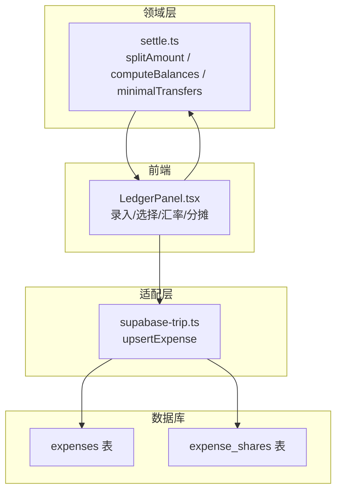
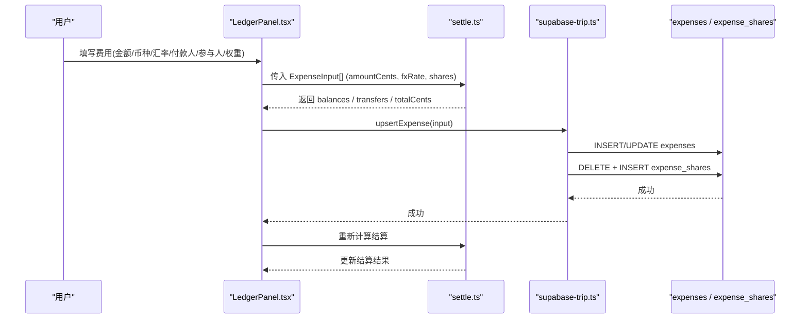
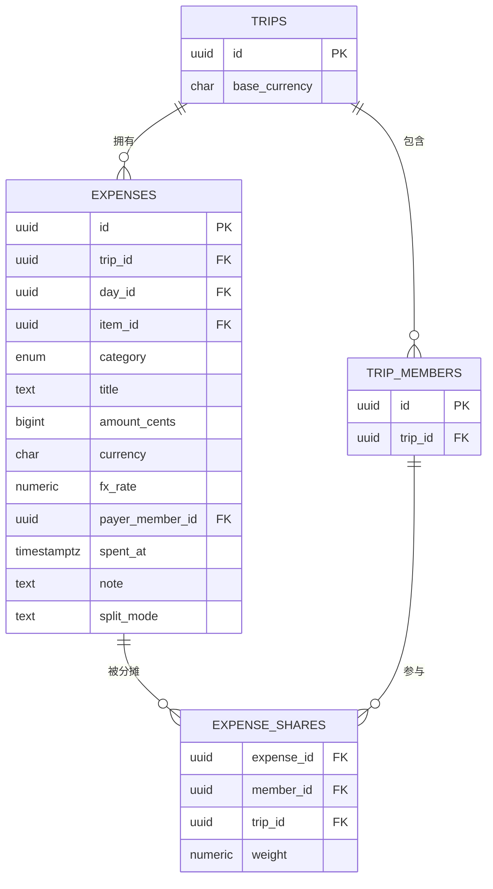
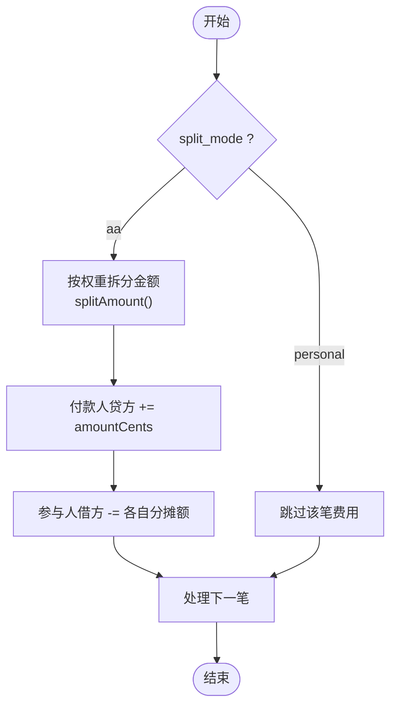
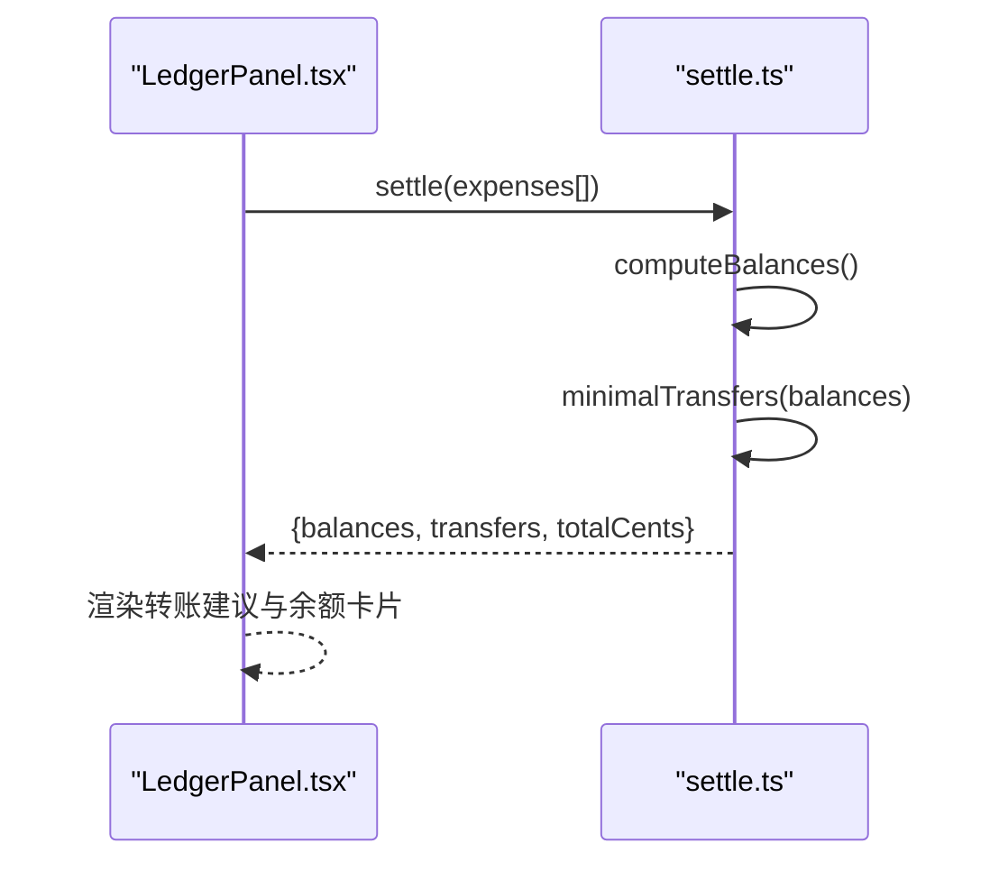
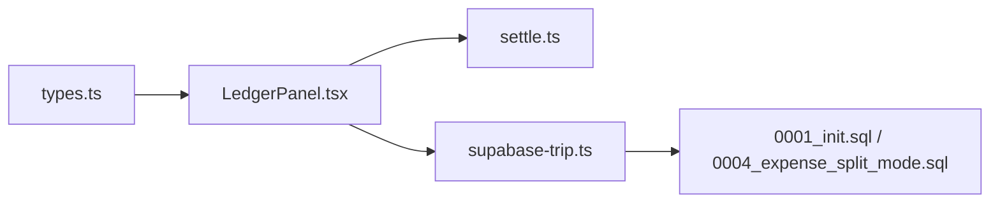
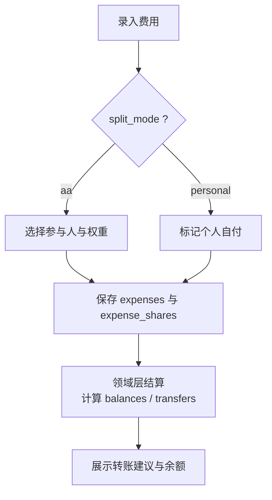

# 费用管理表

<cite>
**本文引用的文件**
- [0001_init.sql](file://supabase/migrations/0001_init.sql)
- [0004_expense_split_mode.sql](file://supabase/migrations/0004_expense_split_mode.sql)
- [types.ts](file://src/data/types.ts)
- [settle.ts](file://src/domain/expense/settle.ts)
- [LedgerPanel.tsx](file://src/features/expense/LedgerPanel.tsx)
- [supabase-trip.ts](file://src/data/adapters/supabase-trip.ts)
</cite>

## 目录
1. [引言](#引言)
2. [项目结构](#项目结构)
3. [核心组件](#核心组件)
4. [架构总览](#架构总览)
5. [详细组件分析](#详细组件分析)
6. [依赖关系分析](#依赖关系分析)
7. [性能考量](#性能考量)
8. [故障排查指南](#故障排查指南)
9. [结论](#结论)
10. [附录](#附录)

## 引言
本文件为“玩无一失”的费用管理模块提供完整的数据与流程文档，聚焦以下目标：
- 费用表 expenses 与分摊表 expense_shares 的设计思路与字段约束
- 金额存储策略（统一使用整数分）与多币种支持、汇率换算机制
- 分摊算法与多种分摊模式（共同 AA / 个人自付）的实现
- 费用分类体系与检查约束
- 费用计算示例与分摊报表生成逻辑
- 数据模型图与业务流程图

## 项目结构
费用相关代码分布在数据库迁移、领域计算、前端展示与数据适配层：
- 数据库层：定义 expenses、expense_shares 表结构与约束，以及 split_mode 枚举校验
- 领域层：实现按权重拆分金额、计算净额与最少转账次数
- 前端层：账本面板负责录入、选择参与人、权重、币种与汇率，并实时结算
- 适配层：将前端 ExpenseInput 持久化为 expenses 与 expense_shares 记录

图表来源
- [0001_init.sql:162-190](file://supabase/migrations/0001_init.sql#L162-L190)
- [0004_expense_split_mode.sql:1-9](file://supabase/migrations/0004_expense_split_mode.sql#L1-L9)
- [settle.ts:34-130](file://src/domain/expense/settle.ts#L34-L130)
- [LedgerPanel.tsx:71-81](file://src/features/expense/LedgerPanel.tsx#L71-L81)
- [supabase-trip.ts:473-515](file://src/data/adapters/supabase-trip.ts#L473-L515)

章节来源
- [0001_init.sql:162-190](file://supabase/migrations/0001_init.sql#L162-L190)
- [0004_expense_split_mode.sql:1-9](file://supabase/migrations/0004_expense_split_mode.sql#L1-L9)
- [types.ts:86-88](file://src/data/types.ts#L86-L88)
- [settle.ts:34-130](file://src/domain/expense/settle.ts#L34-L130)
- [LedgerPanel.tsx:71-81](file://src/features/expense/LedgerPanel.tsx#L71-L81)
- [supabase-trip.ts:473-515](file://src/data/adapters/supabase-trip.ts#L473-L515)

## 核心组件
- 费用表 expenses：记录每笔费用的元数据、金额（整数分）、币种、汇率、付款人、时间等
- 分摊表 expense_shares：记录一笔费用由哪些成员以何种权重参与分摊
- 领域结算 settle.ts：基于整数分的拆分与结算，保证精度与总和守恒
- 账本面板 LedgerPanel.tsx：用户交互入口，采集输入并调用领域结算
- 数据适配 supabase-trip.ts：将 ExpenseInput 写入 expenses 与 expense_shares

章节来源
- [0001_init.sql:162-190](file://supabase/migrations/0001_init.sql#L162-L190)
- [0004_expense_split_mode.sql:1-9](file://supabase/migrations/0004_expense_split_mode.sql#L1-L9)
- [types.ts:212-228](file://src/data/types.ts#L212-L228)
- [settle.ts:34-130](file://src/domain/expense/settle.ts#L34-L130)
- [LedgerPanel.tsx:71-81](file://src/features/expense/LedgerPanel.tsx#L71-L81)
- [supabase-trip.ts:473-515](file://src/data/adapters/supabase-trip.ts#L473-L515)

## 架构总览
费用管理的整体流程如下：
- 用户在 LedgerPanel 中录入费用：标题、类别、金额、币种、汇率、付款人、分摊模式、参与人与权重
- 前端将 amountCents（整数分）与 fxRate（汇率）一并保存
- 领域层 settle.ts 将所有费用按基准币种换算后计算每人净额，并输出最少转账方案
- 数据适配层将 expenses 与 expense_shares 持久化到数据库

图表来源
- [LedgerPanel.tsx:71-81](file://src/features/expense/LedgerPanel.tsx#L71-L81)
- [supabase-trip.ts:473-515](file://src/data/adapters/supabase-trip.ts#L473-L515)
- [settle.ts:72-130](file://src/domain/expense/settle.ts#L72-L130)

## 详细组件分析

### 数据模型与约束
- expenses 表关键字段
  - id：主键
  - trip_id：关联行程
  - day_id / item_id：可选的日期与条目关联
  - category：费用分类，受枚举约束
  - title：标题
  - amount_cents：金额（整数分），必须大于 0
  - currency：原始币种
  - fx_rate：换算到 trips.base_currency 的汇率
  - payer_member_id：付款人
  - spent_at：花费时间
  - note：备注
  - created_by / created_at：创建信息
- expense_shares 表关键字段
  - expense_id：关联费用
  - member_id：参与分摊的成员
  - trip_id：冗余字段用于行级安全
  - weight：权重，必须大于 0
- 新增 split_mode（默认 'aa'，允许 'personal'）
  - 'aa'：计入共同分摊结算
  - 'personal'：个人承担，结算时整笔跳过

图表来源
- [0001_init.sql:162-190](file://supabase/migrations/0001_init.sql#L162-L190)
- [0004_expense_split_mode.sql:1-9](file://supabase/migrations/0004_expense_split_mode.sql#L1-L9)

章节来源
- [0001_init.sql:162-190](file://supabase/migrations/0001_init.sql#L162-L190)
- [0004_expense_split_mode.sql:1-9](file://supabase/migrations/0004_expense_split_mode.sql#L1-L9)
- [types.ts:86-88](file://src/data/types.ts#L86-L88)
- [types.ts:212-228](file://src/data/types.ts#L212-L228)

### 金额存储策略与多币种支持
- 金额一律以整数分（cents）存储与运算，避免浮点误差
- 每笔费用记录原始币种 currency 与汇率 fx_rate（换算到 trips.base_currency）
- 前端在显示与结算时将 amountCents * fxRate 得到基准币种的整数分
- 参考汇率在界面中预填，但允许用户修改；最终金额按整数分四舍五入

章节来源
- [0001_init.sql:162-180](file://supabase/migrations/0001_init.sql#L162-L180)
- [LedgerPanel.tsx:27-30](file://src/features/expense/LedgerPanel.tsx#L27-L30)
- [LedgerPanel.tsx:71-81](file://src/features/expense/LedgerPanel.tsx#L71-L81)
- [LedgerPanel.tsx:284-305](file://src/features/expense/LedgerPanel.tsx#L284-L305)

### 分摊模式与权重分摊算法
- 分摊模式 split_mode
  - 'aa'：纳入共同分摊
  - 'personal'：个人自付，结算时整笔跳过
- 权重分摊算法 splitAmount
  - 按权重比例分配整数分，使用最大余数法确保总和守恒
  - 例：100 分 3 人均摊 → 34/33/33，而非三个 33 少 1 分
- 余额计算 computeBalances
  - 对每笔 'aa' 费用：付款人贷方记入 amountCents，参与人按分摊额借方扣减
  - 'personal' 费用不参与共同分摊
- 最少转账 minimalTransfers
  - 贪心策略：每次让欠最多的人直接还给被欠最多的人
  - 对 2-10 人的旅行场景，转账次数上限为 n-1，满足“少转几次账”的诉求

图表来源
- [settle.ts:34-86](file://src/domain/expense/settle.ts#L34-L86)
- [0004_expense_split_mode.sql:1-9](file://supabase/migrations/0004_expense_split_mode.sql#L1-L9)

章节来源
- [settle.ts:34-130](file://src/domain/expense/settle.ts#L34-L130)
- [0004_expense_split_mode.sql:1-9](file://supabase/migrations/0004_expense_split_mode.sql#L1-L9)

### 费用分类体系与检查约束
- 分类枚举 expense_category：ticket、transport、food、stay、shopping、other
- 检查约束
  - amount_cents > 0
  - weight > 0
  - split_mode in ('aa', 'personal')
- 这些约束在数据库层保证数据质量，前端也进行基本校验（如金额大于 0、必填项）

章节来源
- [0001_init.sql:13-19](file://supabase/migrations/0001_init.sql#L13-L19)
- [0001_init.sql:162-190](file://supabase/migrations/0001_init.sql#L162-L190)
- [0004_expense_split_mode.sql:1-9](file://supabase/migrations/0004_expense_split_mode.sql#L1-L9)
- [LedgerPanel.tsx:18-25](file://src/features/expense/LedgerPanel.tsx#L18-L25)
- [LedgerPanel.tsx:83-96](file://src/features/expense/LedgerPanel.tsx#L83-L96)

### 费用计算示例
- 示例一：均摊
  - 总额 100 分，3 人参与，权重均为 1
  - 每人分摊：34/33/33（最大余数法）
- 示例二：加权分摊
  - 总额 100 分，A 权重 2，B 权重 1，C 权重 1
  - 精确值：A=50，B=25，C=25；若出现小数，按余数从大到小分配
- 示例三：个人自付
  - split_mode='personal'，不进入共同分摊，不影响谁欠谁

章节来源
- [settle.ts:34-70](file://src/domain/expense/settle.ts#L34-L70)
- [settle.ts:72-86](file://src/domain/expense/settle.ts#L72-L86)
- [0004_expense_split_mode.sql:1-9](file://supabase/migrations/0004_expense_split_mode.sql#L1-L9)

### 分摊报表生成逻辑
- 报表内容
  - 每人净额 balances：正数表示应收，负数表示应付
  - 最少转账 transfers：fromMemberId → toMemberId，金额 amountCents
  - 总支出 totalCents：所有费用在基准币种的合计
- 生成流程
  - 前端将 expenses 转换为 ExpenseInput[]（amountCents 已为整数分）
  - 调用 settle() 计算 balances、transfers、totalCents
  - 展示“算账结果”，包括转账建议与每人应收应付

图表来源
- [LedgerPanel.tsx:71-81](file://src/features/expense/LedgerPanel.tsx#L71-L81)
- [settle.ts:72-130](file://src/domain/expense/settle.ts#L72-L130)

章节来源
- [LedgerPanel.tsx:71-81](file://src/features/expense/LedgerPanel.tsx#L71-L81)
- [settle.ts:72-130](file://src/domain/expense/settle.ts#L72-L130)

### 数据持久化流程
- upsertExpense
  - 插入或更新 expenses 行（包含 split_mode）
  - 先删除该 expense_id 下的 expense_shares，再批量插入新的分摊份额
  - 确保 expense_shares 与最新 shares 一致

章节来源
- [supabase-trip.ts:473-515](file://src/data/adapters/supabase-trip.ts#L473-L515)
- [0001_init.sql:162-190](file://supabase/migrations/0001_init.sql#L162-L190)
- [0004_expense_split_mode.sql:1-9](file://supabase/migrations/0004_expense_split_mode.sql#L1-L9)

## 依赖关系分析
- 前端 LedgerPanel.tsx 依赖类型定义 types.ts 中的 ExpenseCategory、ExpenseSplitMode、Expense
- 前端调用领域层 settle.ts 进行结算
- 数据适配层 supabase-trip.ts 依赖数据库迁移定义的表结构与约束
- 数据库层通过枚举与检查约束保证分类、金额、权重与分摊模式的合法性

图表来源
- [types.ts:86-88](file://src/data/types.ts#L86-L88)
- [types.ts:212-228](file://src/data/types.ts#L212-L228)
- [LedgerPanel.tsx:71-81](file://src/features/expense/LedgerPanel.tsx#L71-L81)
- [supabase-trip.ts:473-515](file://src/data/adapters/supabase-trip.ts#L473-L515)
- [0001_init.sql:162-190](file://supabase/migrations/0001_init.sql#L162-L190)
- [0004_expense_split_mode.sql:1-9](file://supabase/migrations/0004_expense_split_mode.sql#L1-L9)

章节来源
- [types.ts:86-88](file://src/data/types.ts#L86-L88)
- [types.ts:212-228](file://src/data/types.ts#L212-L228)
- [LedgerPanel.tsx:71-81](file://src/features/expense/LedgerPanel.tsx#L71-L81)
- [supabase-trip.ts:473-515](file://src/data/adapters/supabase-trip.ts#L473-L515)
- [0001_init.sql:162-190](file://supabase/migrations/0001_init.sql#L162-L190)
- [0004_expense_split_mode.sql:1-9](file://supabase/migrations/0004_expense_split_mode.sql#L1-L9)

## 性能考量
- 金额使用整数分避免浮点误差，减少计算复杂度与错误传播
- 分摊算法采用 O(n) 遍历与排序（按余数），在 2-10 人规模下性能优异
- 数据库层通过索引优化查询（如 idx_expenses_trip、idx_expense_shares_trip）
- 前端 useMemo 缓存结算结果，避免重复计算

[本节为通用指导，无需特定文件引用]

## 故障排查指南
- 金额异常
  - 检查 amount_cents 是否为正整数分
  - 确认 fx_rate 与 currency 设置正确
- 分摊不一致
  - 检查 shares 中每个成员的 weight 是否大于 0
  - 确认 split_mode 是否正确（'aa' 或 'personal'）
- 结算结果不符合预期
  - 核对参与人集合与权重
  - 查看最小转账算法是否按贪心策略执行
- 数据持久化失败
  - 检查 adapter 中 delete + insert 的顺序与事务一致性
  - 验证数据库约束（枚举、检查约束）

章节来源
- [LedgerPanel.tsx:83-96](file://src/features/expense/LedgerPanel.tsx#L83-L96)
- [supabase-trip.ts:473-515](file://src/data/adapters/supabase-trip.ts#L473-L515)
- [0001_init.sql:162-190](file://supabase/migrations/0001_init.sql#L162-L190)
- [0004_expense_split_mode.sql:1-9](file://supabase/migrations/0004_expense_split_mode.sql#L1-L9)

## 结论
本费用管理系统通过整数分存储与换算、严格的数据库约束、稳健的分摊算法与简洁的前端交互，实现了准确、可追溯且易用的费用管理与分摊结算。expenses 与 expense_shares 的设计兼顾了灵活性与一致性，split_mode 提供了共同 AA 与个人自付两种模式，满足旅行场景下的多样化需求。

[本节为总结性内容，无需特定文件引用]

## 附录
- 关键流程图（业务视角）

[此图为概念性流程，不直接映射具体源码文件，故无图表来源]