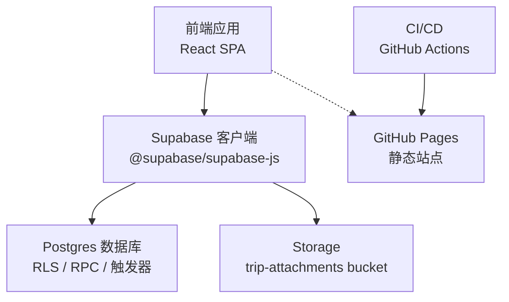
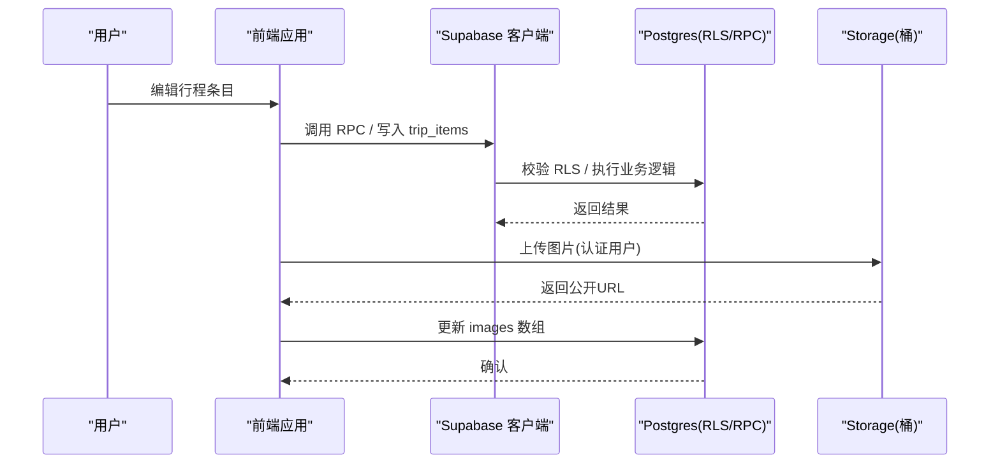
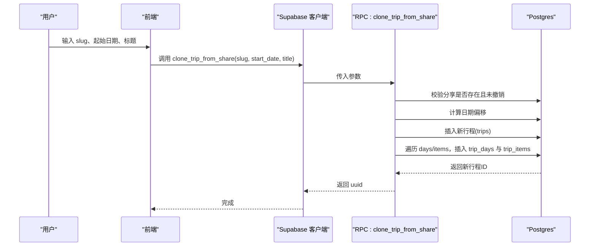
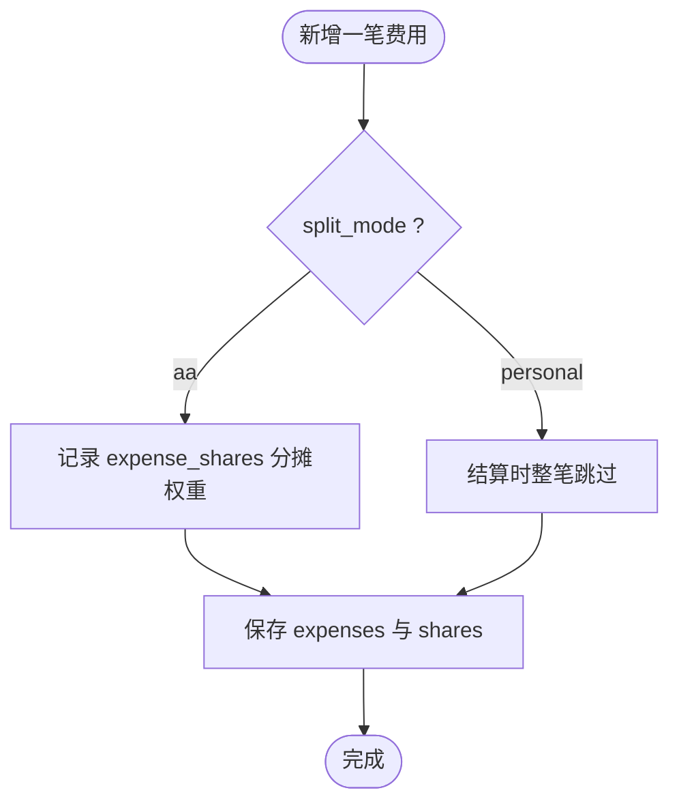
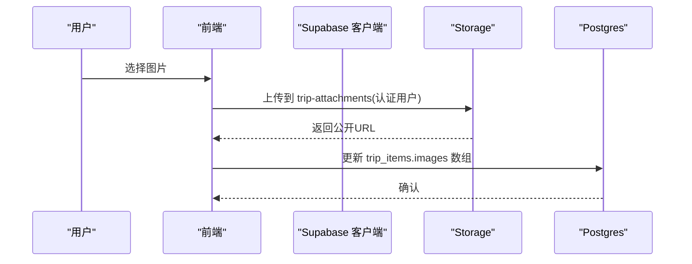
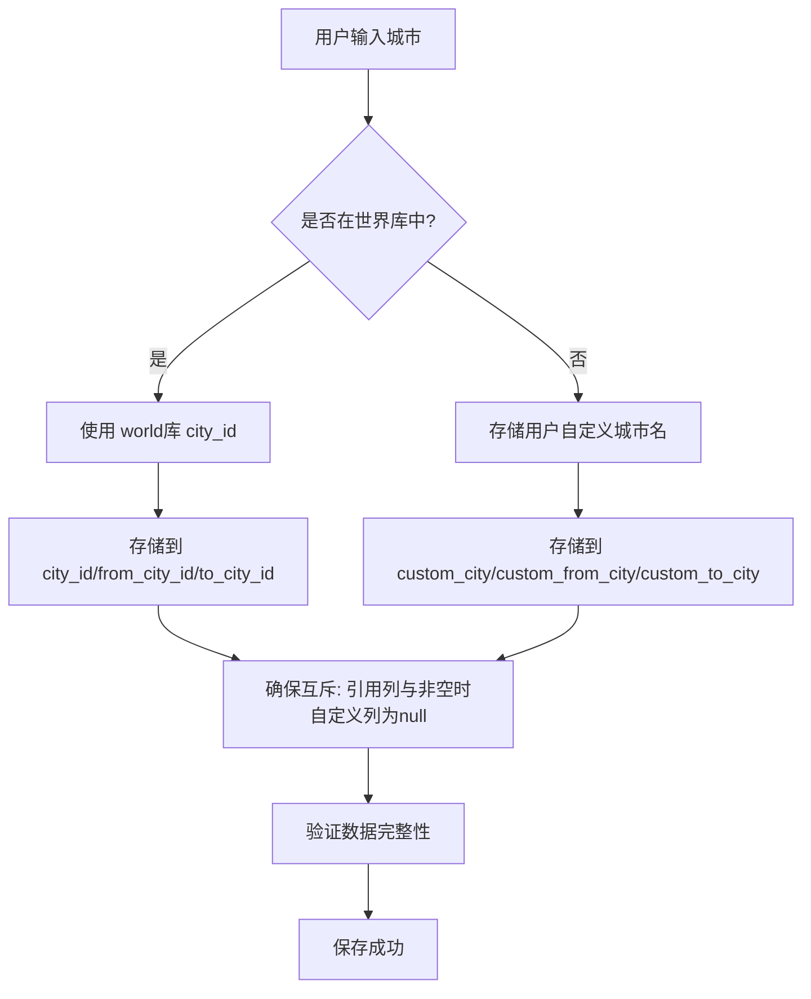
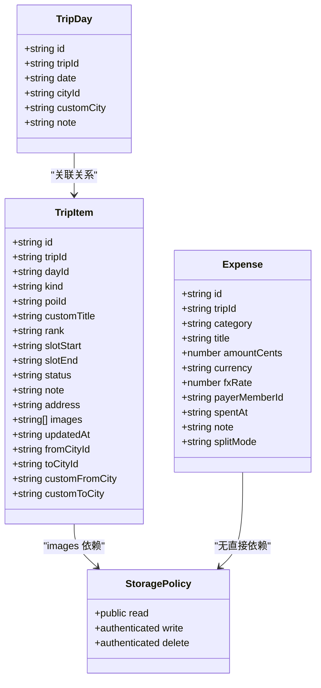

# 数据迁移管理

<cite>
**本文引用的文件**
- [0001_init.sql](file://supabase/migrations/0001_init.sql)
- [0002_trip_items_custom.sql](file://supabase/migrations/0002_trip_items_custom.sql)
- [0003_trip_packing.sql](file://supabase/migrations/0003_trip_packing.sql)
- [0004_expense_split_mode.sql](file://supabase/migrations/0004_expense_split_mode.sql)
- [0005_trip_item_images.sql](file://supabase/migrations/0005_trip_item_images.sql)
- [0007_trip_item_address.sql](file://supabase/migrations/0007_trip_item_address.sql)
- [0008_ticket_attachments.sql](file://supabase/migrations/0008_ticket_attachments.sql)
- [0009_trip_city_custom_text.sql](file://supabase/migrations/0009_trip_city_custom_text.sql)
- [apply_attachments.sql](file://supabase/apply_attachments.sql)
- [deploy.yml](file://.github/workflows/deploy.yml)
- [技术方案.md](file://docs/技术方案.md)
- [types.ts](file://src/data/types.ts)
- [supabase-client.ts](file://src/data/supabase-client.ts)
- [supabase-trip.ts](file://src/data/adapters/supabase-trip.ts)
</cite>

## 更新摘要
**变更内容**
- 新增0009_trip_city_custom_text.sql迁移文件，为trip_days表添加custom_city字段，为trip_items表添加custom_from_city和custom_to_city字段
- 更新迁移版本与执行顺序章节，包含新的迁移文件
- 更新各迁移变更详解章节，详细说明城市自由文本功能
- 更新依赖管理与冲突解决策略，说明新字段的互斥关系
- 更新故障排查指南，包含新字段相关的问题诊断

## 目录
1. [简介](#简介)
2. [项目结构](#项目结构)
3. [核心组件](#核心组件)
4. [架构总览](#架构总览)
5. [详细组件分析](#详细组件分析)
6. [依赖关系分析](#依赖关系分析)
7. [性能考量](#性能考量)
8. [故障排查指南](#故障排查指南)
9. [结论](#结论)
10. [附录](#附录)

## 简介
本文件面向"玩无一失"的数据迁移管理，系统化说明 Supabase 迁移脚本的版本控制、幂等性设计、回滚策略与部署流程；逐项解释每个迁移文件的变更内容（自定义景点支持、打包清单、费用分摊模式、图片附件、地址信息、门票附件、城市自由文本等）；给出迁移执行顺序、依赖管理与冲突解决策略；并提供本地开发环境同步与生产环境部署的最佳实践。

## 项目结构
- 数据库迁移位于 supabase/migrations，按数字前缀排序，体现严格的版本顺序。
- 应用前端通过 Supabase 客户端访问数据库，RLS 策略由迁移脚本统一启用并配置。
- CI/CD 仅负责前端构建与发布到 GitHub Pages；数据库迁移采用"代码即文档 + 手动执行"的方式，确保零成本与可审计。

**图表来源**
- [deploy.yml:1-51](file://.github/workflows/deploy.yml#L1-L51)
- [supabase-client.ts:1-106](file://src/data/supabase-client.ts#L1-L106)

**章节来源**
- [deploy.yml:1-51](file://.github/workflows/deploy.yml#L1-L51)
- [技术方案.md:1101-1127](file://docs/技术方案.md#L1101-L1127)

## 核心组件
- 迁移脚本：以 SQL 形式定义表结构、索引、函数、触发器、RLS 策略与权限，全部具备幂等性保护（如 if not exists、drop if exists）。
- 类型契约：前端 types.ts 中的接口与迁移列名一一对应，保证前后端一致性。
- 安全边界：所有写操作受 RLS 约束，敏感字段在分享快照中剔除。
- 存储附件：图片 URL 存储在 trip_items.images，文件本体存放在 Supabase Storage 的 trip-attachments 桶，并通过 RLS 限制上传与删除。

**章节来源**
- [0001_init.sql:1-530](file://supabase/migrations/0001_init.sql#L1-L530)
- [types.ts:159-187](file://src/data/types.ts#L159-L187)
- [apply_attachments.sql:1-83](file://supabase/apply_attachments.sql#L1-L83)

## 架构总览
- 数据层：Postgres 作为唯一持久化后端，使用 RLS 实现行级安全；通过 RPC 提供聚合查询与业务原子操作。
- 应用层：前端通过 Supabase 客户端调用 RPC 与 REST API，遵循 Repository 抽象。
- 存储层：trip-attachments 桶用于存放行程条目图片，公开读、认证用户可写/删。
- 部署层：CI 仅构建前端产物并发布到 GitHub Pages；数据库结构与权限由迁移脚本维护。

**图表来源**
- [0001_init.sql:288-525](file://supabase/migrations/0001_init.sql#L288-L525)
- [apply_attachments.sql:60-83](file://supabase/apply_attachments.sql#L60-L83)

## 详细组件分析

### 迁移版本与执行顺序
- 0001_init.sql：初始化所有核心表、枚举、触发器、RLS、RPC（包含 get_trip_bundle、join_trip_by_token、get_share、clone_trip_from_share、ping）。
- 0002_trip_items_custom.sql：为 trip_items 增加 kind、transport_mode、from_city_id、to_city_id，并升级 clone_trip_from_share 以复制交通段信息。
- 0003_trip_packing.sql：为 trips 增加 packing jsonb 列，承载打包清单。
- 0004_expense_split_mode.sql：为 expenses 增加 split_mode，区分 AA 与个人自付。
- 0005_trip_item_images.sql：为 trip_items 增加 images text[] 列，用于存储图片公开 URL。
- 0007_trip_item_address.sql：为 trip_items 增加 address 字段，独立住宿详细地址。
- 0008_ticket_attachments.sql：为 tickets 增加 attachments jsonb 列，支持 PDF 附件元数据存储。
- 0009_trip_city_custom_text.sql：为 trip_days 增加 custom_city 字段，为 trip_items 增加 custom_from_city 和 custom_to_city 字段，支持用户自定义城市名称。
- apply_attachments.sql：一键脚本，幂等创建 trip-attachments 桶与 Storage RLS，并补齐 images 列（若未存在）。

执行顺序建议：
- 严格按数字顺序执行 0001 → 0002 → 0003 → 0004 → 0005 → 0007 → 0008 → 0009。
- 0005 与 apply_attachments.sql 可并行或先后执行，但需确保 bucket 与 RLS 已就绪后再上传图片。

**章节来源**
- [0001_init.sql:1-530](file://supabase/migrations/0001_init.sql#L1-L530)
- [0002_trip_items_custom.sql:1-75](file://supabase/migrations/0002_trip_items_custom.sql#L1-L75)
- [0003_trip_packing.sql:1-21](file://supabase/migrations/0003_trip_packing.sql#L1-L21)
- [0004_expense_split_mode.sql:1-9](file://supabase/migrations/0004_expense_split_mode.sql#L1-L9)
- [0005_trip_item_images.sql:1-12](file://supabase/migrations/0005_trip_item_images.sql#L1-L12)
- [0007_trip_item_address.sql:1-12](file://supabase/migrations/0007_trip_item_address.sql#L1-L12)
- [0008_ticket_attachments.sql:1-20](file://supabase/migrations/0008_ticket_attachments.sql#L1-L20)
- [0009_trip_city_custom_text.sql:1-13](file://supabase/migrations/0009_trip_city_custom_text.sql#L1-L13)
- [apply_attachments.sql:1-83](file://supabase/apply_attachments.sql#L1-L83)

### 幂等性设计
- 表与列：使用 create table if not exists、alter table add column if not exists，避免重复执行报错。
- 策略与函数：使用 drop policy if exists、create or replace function，保证覆盖式更新。
- 触发器：drop trigger if exists 后重建，确保行为一致。
- 存储桶与策略：动态探测列是否存在，再插入 bucket；策略使用 drop if exists 保护。

**章节来源**
- [0001_init.sql:272-285](file://supabase/migrations/0001_init.sql#L272-L285)
- [0001_init.sql:324-386](file://supabase/migrations/0001_init.sql#L324-L386)
- [apply_attachments.sql:18-26](file://supabase/apply_attachments.sql#L18-L26)
- [apply_attachments.sql:33-58](file://supabase/apply_attachments.sql#L33-L58)
- [apply_attachments.sql:64-78](file://supabase/apply_attachments.sql#L64-L78)

### 回滚策略
- 推荐做法：保留完整迁移历史，如需回滚，新建反向迁移（例如删除列、禁用 RLS、删除函数），并在目标环境执行。
- 注意事项：
  - 删除列或表会丢失数据，务必先备份。
  - 删除 RLS 策略可能导致权限扩大，需谨慎评估。
  - 对已有数据的列进行默认值变更时，优先新增列+迁移数据+切换引用，而非直接修改。

**章节来源**
- [技术方案.md:1118-1127](file://docs/技术方案.md#L1118-L1127)

### 部署流程
- 前端：CI 在 main 分支推送时执行内容校验、类型检查、单测、构建，并发布到 GitHub Pages。
- 数据库：迁移脚本不随 CI 自动执行；需在 Supabase 控制台 SQL Editor 手动运行，或使用本地 CLI 的 db push。
- 环境变量：VITE_SUPABASE_URL 与 VITE_SUPABASE_ANON_KEY 注入到前端构建产物，供运行时连接 Supabase。

**章节来源**
- [deploy.yml:1-51](file://.github/workflows/deploy.yml#L1-L51)
- [supabase-client.ts:17-34](file://src/data/supabase-client.ts#L17-L34)
- [技术方案.md:1118-1127](file://docs/技术方案.md#L1118-L1127)

### 各迁移变更详解

#### 0001_init.sql：基础表结构与权限
- 新增枚举：行程状态、成员角色、条目状态、费用类别、交通方式。
- 核心表：profiles、trips、trip_members、trip_days、trip_items、item_votes、tickets、expenses、expense_shares、transports、accommodations、personal_notes、trip_invites、shares。
- 触发器：新用户自动创建 profiles；创建行程自动加入 owner 为成员；updated_at 自动维护。
- 权限：启用 RLS，定义 per-table 策略；通过 is_trip_member/is_trip_owner 判定。
- RPC：get_trip_bundle（一次性拉取全量）、join_trip_by_token（凭邀请加入）、get_share（匿名读取分享）、clone_trip_from_share（从分享克隆）、ping（保活）。

**章节来源**
- [0001_init.sql:11-267](file://supabase/migrations/0001_init.sql#L11-L267)
- [0001_init.sql:269-525](file://supabase/migrations/0001_init.sql#L269-L525)

#### 0002_trip_items_custom.sql：自定义景点与交通段
- 新增列：kind（默认 poi）、transport_mode、from_city_id、to_city_id。
- 兜底更新：将历史 null 行修正为 poi。
- 升级 clone_trip_from_share：复制 kind 与交通字段，使转场日也能串入时间线。
- 索引：按 kind 过滤交通段，提升查询效率。

**章节来源**
- [0002_trip_items_custom.sql:11-71](file://supabase/migrations/0002_trip_items_custom.sql#L11-L71)

#### 0003_trip_packing.sql：打包清单
- 新增列：trips.packing jsonb 默认空数组。
- 兜底更新：旧行 null 转为 []。
- 注意：若 RPC 使用 select 列清单而非 to_jsonb(t)，需把 packing 加入返回投影。

**章节来源**
- [0003_trip_packing.sql:13-17](file://supabase/migrations/0003_trip_packing.sql#L13-L17)

#### 0004_expense_split_mode.sql：费用分摊模式
- 新增列：expenses.split_mode，取值 aa/personal，默认 aa。
- 语义：aa 计入共同结算；personal 个人承担，结算时跳过。

**章节来源**
- [0004_expense_split_mode.sql:1-9](file://supabase/migrations/0004_expense_split_mode.sql#L1-L9)

#### 0005_trip_item_images.sql：图片附件 URL
- 新增列：trip_items.images text[] 默认空数组。
- 用途：仅云端档使用，文件存于 trip-attachments 桶，此处只存公开 URL。

**章节来源**
- [0005_trip_item_images.sql:1-12](file://supabase/migrations/0005_trip_item_images.sql#L1-L12)

#### 0007_trip_item_address.sql：住宿地址字段
- 新增列：trip_items.address text 可为空。
- 目的：将住宿详细地址从 note 中拆分出来，便于单独复制与展示。

**章节来源**
- [0007_trip_item_address.sql:1-12](file://supabase/migrations/0007_trip_item_address.sql#L1-L12)

#### 0008_ticket_attachments.sql：门票 PDF 附件
- 新增列：tickets.attachments jsonb 默认空数组。
- 用途：存储 PDF 附件元数据（url、name、size、uploadedAt），文件本体存 Supabase Storage 的 trip-attachments 桶。
- 更新 storage.buckets：允许 application/pdf MIME 类型，文件大小限制提升到 10MB。

**章节来源**
- [0008_ticket_attachments.sql:1-20](file://supabase/migrations/0008_ticket_attachments.sql#L1-L20)

#### 0009_trip_city_custom_text.sql：城市自由文本列
- 新增列：trip_days.custom_city text，用于存储用户自定义的城市名称。
- 新增列：trip_items.custom_from_city text 和 custom_to_city text，用于存储交通段的出发和到达城市名称。
- 设计原则：与世界库引用列（city_id/from_city_id/to_city_id）互斥，一个非空时另一个必为 null。
- 解决的问题：修复之前 Supabase 适配器引用但从未创建导致的 'column does not exist' 错误。
- 幂等性：使用 if not exists 确保可重复执行，每条 ALTER 语句独立以避免多列合一在个别环境报错。

**章节来源**
- [0009_trip_city_custom_text.sql:1-13](file://supabase/migrations/0009_trip_city_custom_text.sql#L1-L13)

#### apply_attachments.sql：图片附件一键脚本
- 幂等添加 images 列（若不存在）。
- 动态探测 storage.buckets 列兼容性，创建 trip-attachments 公开桶，设置文件大小与 MIME 白名单。
- 配置 Storage RLS：公开读、认证用户可上传/删除。

**章节来源**
- [apply_attachments.sql:15-83](file://supabase/apply_attachments.sql#L15-L83)

### 数据流与处理逻辑

#### 克隆行程（从分享快照）

**图表来源**
- [0001_init.sql:476-520](file://supabase/migrations/0001_init.sql#L476-L520)
- [0002_trip_items_custom.sql:21-67](file://supabase/migrations/0002_trip_items_custom.sql#L21-L67)

**章节来源**
- [0001_init.sql:476-520](file://supabase/migrations/0001_init.sql#L476-L520)
- [0002_trip_items_custom.sql:21-67](file://supabase/migrations/0002_trip_items_custom.sql#L21-L67)

#### 费用分摊与结算

**图表来源**
- [0004_expense_split_mode.sql:1-9](file://supabase/migrations/0004_expense_split_mode.sql#L1-L9)

**章节来源**
- [0004_expense_split_mode.sql:1-9](file://supabase/migrations/0004_expense_split_mode.sql#L1-L9)

#### 图片附件上传与存储

**图表来源**
- [apply_attachments.sql:60-83](file://supabase/apply_attachments.sql#L60-L83)
- [0005_trip_item_images.sql:10-12](file://supabase/migrations/0005_trip_item_images.sql#L10-L12)

**章节来源**
- [apply_attachments.sql:60-83](file://supabase/apply_attachments.sql#L60-L83)
- [0005_trip_item_images.sql:10-12](file://supabase/migrations/0005_trip_item_images.sql#L10-L12)

#### 城市自由文本处理流程

**图表来源**
- [supabase-trip.ts:74-91](file://src/data/adapters/supabase-trip.ts#L74-L91)
- [supabase-trip.ts:263-333](file://src/data/adapters/supabase-trip.ts#L263-L333)
- [types.ts:156-177](file://src/data/types.ts#L156-L177)

**章节来源**
- [supabase-trip.ts:74-91](file://src/data/adapters/supabase-trip.ts#L74-L91)
- [supabase-trip.ts:263-333](file://src/data/adapters/supabase-trip.ts#L263-L333)
- [types.ts:156-177](file://src/data/types.ts#L156-L177)

### 依赖管理与冲突解决
- 依赖顺序：0001 为基础，后续迁移均依赖其表结构与枚举；0002 依赖 0001 的 transport_mode 枚举；0005 与 apply_attachments.sql 相互协作（列与桶/RLS）；0009 依赖 0001 的 trip_days 和 trip_items 表结构。
- 冲突预防：
  - 所有 DDL 使用幂等语句，避免重复执行错误。
  - 对共享函数（如 clone_trip_from_share）使用 create or replace，确保行为一致。
  - 对策略使用 drop if exists，避免重复创建。
  - 城市自由文本字段与世界库引用字段保持互斥关系，避免数据冲突。
- 冲突解决：
  - 若多人同时修改同一函数或策略，合并时优先保留最新语义，并确保幂等。
  - 若出现列名冲突，先重命名列或引入新版本列，逐步迁移引用。
  - 对于城市字段，确保世界库引用和用户自定义文本的互斥逻辑正确实现。

**章节来源**
- [0001_init.sql:272-386](file://supabase/migrations/0001_init.sql#L272-L386)
- [0002_trip_items_custom.sql:11-71](file://supabase/migrations/0002_trip_items_custom.sql#L11-L71)
- [0009_trip_city_custom_text.sql:1-13](file://supabase/migrations/0009_trip_city_custom_text.sql#L1-L13)
- [apply_attachments.sql:33-58](file://supabase/apply_attachments.sql#L33-L58)

## 依赖关系分析
- 前端类型与迁移列对齐：TripDay 的 customCity、TripItem 的 customFromCity/customToCity 等字段与迁移脚本保持一致。
- 安全模型：RLS 基于 auth.uid() 与 is_trip_member/is_trip_owner 判定，所有写操作必须通过认证。
- 存储依赖：trip_items.images 与 trip-attachments 桶配合，R LS 限制上传/删除权限。
- 数据完整性：城市自由文本字段与世界库引用字段保持互斥关系，确保数据一致性。

**图表来源**
- [types.ts:151-192](file://src/data/types.ts#L151-L192)
- [apply_attachments.sql:60-83](file://supabase/apply_attachments.sql#L60-L83)

**章节来源**
- [types.ts:151-192](file://src/data/types.ts#L151-L192)
- [apply_attachments.sql:60-83](file://supabase/apply_attachments.sql#L60-L83)

## 性能考量
- 批量读取：get_trip_bundle 一次性聚合多表数据，减少往返次数。
- 索引优化：trip_items(kind)、trip_items(day_id, rank)、expenses(trip_id) 等索引提升查询效率。
- 存储限制：trip-attachments 桶限制文件大小与 MIME 类型，避免滥用。
- 免费档限制：数据库 500MB 足够；闲置约 7 天暂停，可通过 ping RPC 保活。

**章节来源**
- [0001_init.sql:393-429](file://supabase/migrations/0001_init.sql#L393-L429)
- [0001_init.sql:126-138](file://supabase/migrations/0001_init.sql#L126-L138)
- [apply_attachments.sql:33-58](file://supabase/apply_attachments.sql#L33-L58)
- [技术方案.md:1120-1127](file://docs/技术方案.md#L1120-L1127)

## 故障排查指南
- 无法上传图片：
  - 检查是否已执行 apply_attachments.sql，确保 bucket 与 RLS 已创建。
  - 确认用户已登录（authenticated），否则无法上传/删除。
- 分享不可见：
  - 检查 shares.revoked_at 是否为空；get_share 仅返回未撤销的分享。
- 权限拒绝：
  - 确认当前用户是行程成员（is_trip_member）或拥有者（is_trip_owner）。
- 数据不一致：
  - 检查 updated_at 触发器是否生效；必要时重新创建触发器。
- **城市字段相关错误**：
  - 如果出现 'column "custom_city" does not exist' 错误，需要执行 0009_trip_city_custom_text.sql 迁移。
  - 检查是否正确实现了世界库引用字段与自定义文本字段的互斥逻辑。
  - 验证前端适配器是否正确映射 new 字段到数据库列。
- **门票附件问题**：
  - 确认 0008_ticket_attachments.sql 已执行，tickets 表有 attachments 列。
  - 检查 storage.buckets 是否已更新允许 PDF 文件类型。

**章节来源**
- [apply_attachments.sql:60-83](file://supabase/apply_attachments.sql#L60-L83)
- [0001_init.sql:467-474](file://supabase/migrations/0001_init.sql#L467-L474)
- [0001_init.sql:288-386](file://supabase/migrations/0001_init.sql#L288-L386)
- [0001_init.sql:272-285](file://supabase/migrations/0001_init.sql#L272-L285)
- [0009_trip_city_custom_text.sql:1-13](file://supabase/migrations/0009_trip_city_custom_text.sql#L1-L13)
- [0008_ticket_attachments.sql:1-20](file://supabase/migrations/0008_ticket_attachments.sql#L1-L20)

## 结论
本项目通过严格的迁移版本管理、幂等性设计与清晰的权限模型，实现了稳定可靠的数据迁移与部署流程。前端与后端类型对齐，确保数据一致性；Storage 与 RLS 保障图片附件的安全与可用。最新的 0009 迁移解决了城市自由文本功能的数据库缺失问题，完善了用户体验。建议在团队中推广"代码即文档 + 手动执行"的迁移策略，并结合备份与保活机制，确保长期运维的稳定性。

## 附录

### 本地开发环境迁移同步最佳实践
- 首次搭建：
  - 在 Supabase 控制台依次执行 0001 → 0002 → 0003 → 0004 → 0005 → 0007 → 0008 → 0009。
  - 执行 apply_attachments.sql 以创建 bucket 与 RLS。
- 日常迭代：
  - 每次新增迁移后，先在本地测试执行，确认幂等性与兼容性。
  - 更新前端类型与调用逻辑，确保与迁移列一致。
- 验证：
  - 使用 get_trip_bundle 验证数据完整性。
  - 上传图片并检查 images 数组是否正确更新。
  - 测试城市自由文本功能，确保世界库引用与自定义文本的互斥逻辑正确。

**章节来源**
- [0001_init.sql:1-530](file://supabase/migrations/0001_init.sql#L1-L530)
- [0009_trip_city_custom_text.sql:1-13](file://supabase/migrations/0009_trip_city_custom_text.sql#L1-L13)
- [apply_attachments.sql:1-83](file://supabase/apply_attachments.sql#L1-L83)
- [types.ts:151-192](file://src/data/types.ts#L151-L192)

### 生产环境部署最佳实践
- 前端：
  - 通过 CI 自动构建并发布到 GitHub Pages。
  - 确保环境变量 VITE_SUPABASE_URL 与 VITE_SUPABASE_ANON_KEY 正确配置。
- 数据库：
  - 在生产环境手动执行迁移脚本，记录执行时间与执行人。
  - 定期备份关键表，防止数据丢失。
- 监控：
  - 定时调用 ping RPC 保活，避免免费档暂停。
  - 监控 Storage 使用量与错误日志。
- **新迁移部署注意事项**：
  - 0009 迁移修复了关键的数据库缺失问题，应优先在生产环境执行。
  - 执行后验证城市自由文本功能是否正常工作。
  - 检查前端适配器的字段映射是否正确。

**章节来源**
- [deploy.yml:1-51](file://.github/workflows/deploy.yml#L1-L51)
- [supabase-client.ts:17-34](file://src/data/supabase-client.ts#L17-L34)
- [技术方案.md:1120-1127](file://docs/技术方案.md#L1120-L1127)
- [0009_trip_city_custom_text.sql:1-13](file://supabase/migrations/0009_trip_city_custom_text.sql#L1-L13)