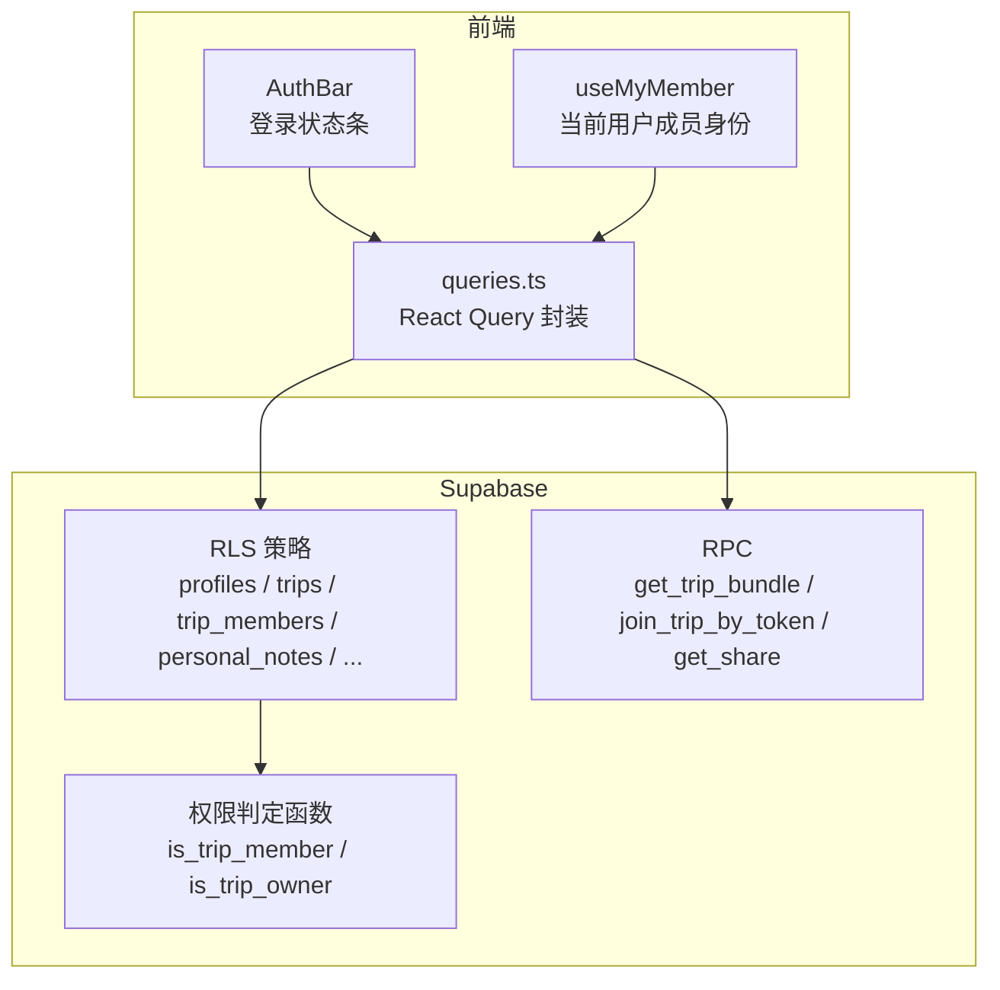
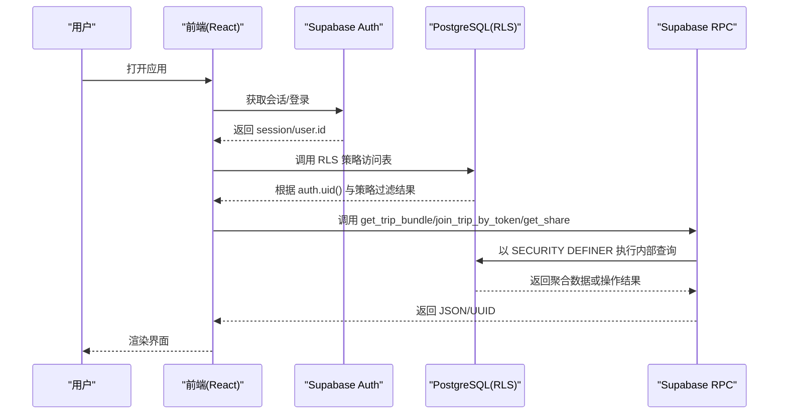
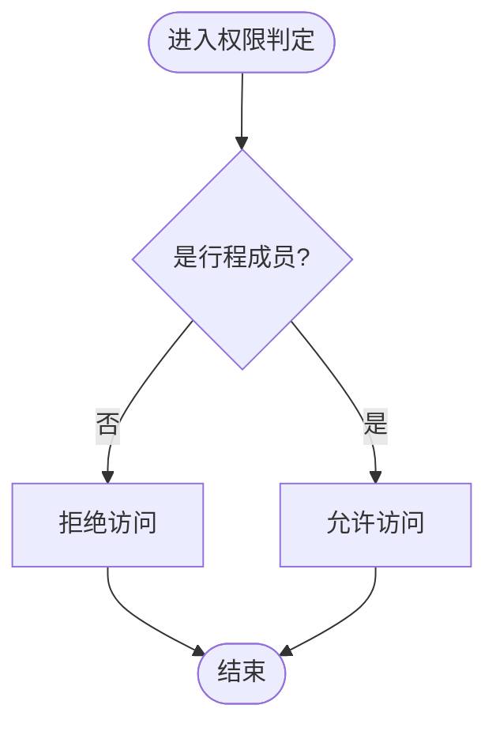
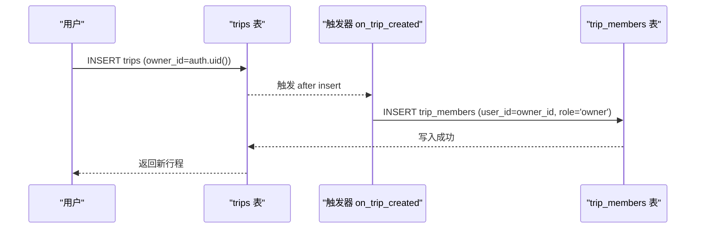
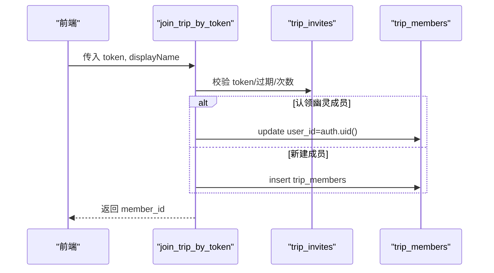
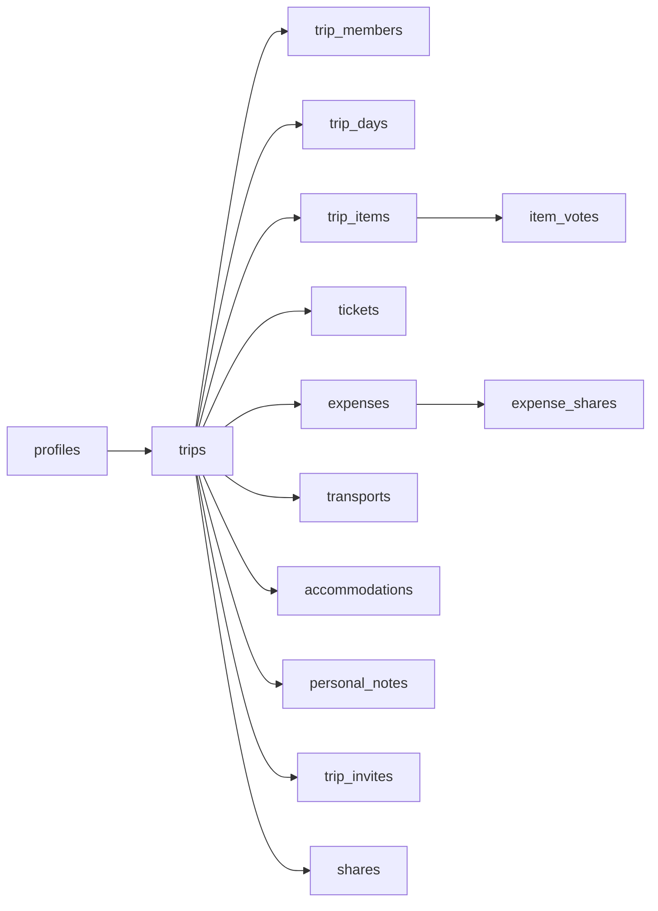

# 行级安全策略

<cite>
**本文引用的文件**
- [supabase/migrations/0001_init.sql](file://supabase/migrations/0001_init.sql)
- [supabase/migrations/0002_trip_items_custom.sql](file://supabase/migrations/0002_trip_items_custom.sql)
- [supabase/migrations/0003_trip_packing.sql](file://supabase/migrations/0003_trip_packing.sql)
- [supabase/migrations/0004_expense_split_mode.sql](file://supabase/migrations/0004_expense_split_mode.sql)
- [supabase/migrations/0005_trip_item_images.sql](file://supabase/migrations/0005_trip_item_images.sql)
- [supabase/migrations/0007_trip_item_address.sql](file://supabase/migrations/0007_trip_item_address.sql)
- [src/data/supabase-client.ts](file://src/data/supabase-client.ts)
- [src/features/auth/AuthBar.tsx](file://src/features/auth/AuthBar.tsx)
- [src/features/trip/useMyMember.ts](file://src/features/trip/useMyMember.ts)
- [src/features/trip/queries.ts](file://src/features/trip/queries.ts)
- [scripts/verify-supabase.cjs](file://scripts/verify-supabase.cjs)
- [docs/技术方案.md](file://docs/技术方案.md)
</cite>

## 目录
1. [简介](#简介)
2. [项目结构](#项目结构)
3. [核心组件](#核心组件)
4. [架构总览](#架构总览)
5. [详细组件分析](#详细组件分析)
6. [依赖关系分析](#依赖关系分析)
7. [性能考量](#性能考量)
8. [故障排查指南](#故障排查指南)
9. [结论](#结论)
10. [附录：常见权限查询示例与最佳实践](#附录：常见权限查询示例与最佳实践)

## 简介
本文件系统化梳理“玩无一失”的行级安全（RLS）策略，围绕基于角色的访问控制机制展开，重点说明成员权限判定函数 is_trip_member、is_trip_owner 的实现原理；逐项解释各表的 RLS 策略配置，包括 profiles 的自我访问控制、trips 的成员读写权限、personal_notes 的个人数据隔离等；并总结权限判定逻辑、安全策略模板与权限继承机制。文末提供常见场景的权限查询示例与安全最佳实践，帮助读者在开发与运维中正确落地和使用该安全模型。

## 项目结构
- 数据库迁移集中在 supabase/migrations 目录，所有表结构、触发器、RLS 策略与 RPC 均在 SQL 中定义与维护。
- 前端通过 Supabase 客户端进行认证与会话管理，并在业务层使用 React Query 封装数据请求与乐观更新。
- 文档 docs/技术方案.md 对认证、角色映射、RLS 策略与分享模型做了完整说明。

图表来源
- [src/features/auth/AuthBar.tsx:18-56](file://src/features/auth/AuthBar.tsx#L18-L56)
- [src/features/trip/useMyMember.ts:16-31](file://src/features/trip/useMyMember.ts#L16-L31)
- [src/features/trip/queries.ts:17-236](file://src/features/trip/queries.ts#L17-L236)
- [supabase/migrations/0001_init.sql:287-386](file://supabase/migrations/0001_init.sql#L287-L386)
- [supabase/migrations/0001_init.sql:392-525](file://supabase/migrations/0001_init.sql#L392-L525)

章节来源
- [src/data/supabase-client.ts:1-106](file://src/data/supabase-client.ts#L1-L106)
- [supabase/migrations/0001_init.sql:25-386](file://supabase/migrations/0001_init.sql#L25-L386)
- [docs/技术方案.md:432-599](file://docs/技术方案.md#L432-L599)

## 核心组件
- 权限判定函数
  - is_trip_member：判断当前用户是否为某行程成员。
  - is_trip_owner：判断当前用户是否为某行程创建者（owner）。
- RLS 策略
  - profiles：仅本人可读写。
  - trips：成员可读；仅 owner 可插入和删除；成员可更新。
  - trip_members：成员可读；增删改仅限 owner（加入房间走 RPC）。
  - 行程子表（trip_days、trip_items、item_votes、tickets、expenses、expense_shares、transports、accommodations）：统一成员读写策略。
  - personal_notes：仅本人可见且可操作，且必须是该行程成员。
  - trip_invites：成员可读可建；匿名不可读（使用走 RPC）。
  - shares：仅 owner 管理；匿名读取唯一入口为 get_share() RPC。
- RPC
  - get_trip_bundle：一次性聚合返回行程全量数据（含个人笔记），需成员权限。
  - join_trip_by_token：凭邀请 token 加入行程，支持认领幽灵成员。
  - get_share：按 slug 精确读取已发布快照，匿名可用。
  - clone_trip_from_share：从分享快照克隆为新行程草稿。
  - ping：保活函数。

章节来源
- [supabase/migrations/0001_init.sql:287-386](file://supabase/migrations/0001_init.sql#L287-L386)
- [supabase/migrations/0001_init.sql:392-525](file://supabase/migrations/0001_init.sql#L392-L525)
- [docs/技术方案.md:441-599](file://docs/技术方案.md#L441-L599)

## 架构总览
下图展示了认证、RLS 与 RPC 之间的交互关系，以及前端如何借助会话与成员身份完成数据访问。

图表来源
- [src/data/supabase-client.ts:45-69](file://src/data/supabase-client.ts#L45-L69)
- [supabase/migrations/0001_init.sql:287-386](file://supabase/migrations/0001_init.sql#L287-L386)
- [supabase/migrations/0001_init.sql:392-525](file://supabase/migrations/0001_init.sql#L392-L525)

## 详细组件分析

### 权限判定函数：is_trip_member 与 is_trip_owner
- 实现要点
  - 使用 SECURITY DEFINER 避免 RLS 递归：当 trip_members 自身被启用 RLS 时，若直接在策略中查询 trip_members 会触发递归；通过 SECURITY DEFINER 函数可在更高权限上下文内安全地检查成员关系。
  - is_trip_member：基于 trip_members 表，判断当前用户是否属于指定 trip_id。
  - is_trip_owner：基于 trips 表，判断当前用户是否为 owner_id。
- 复杂度
  - 均为 O(1) 存在性检查（exists + 索引），配合 trip_members(trip_id, user_id) 的唯一索引与 trips(owner_id) 索引，性能稳定。
- 错误处理
  - 未登录或无权限时，策略直接拒绝访问；RPC 中显式抛出 FORBIDDEN/INVALID_INVITE 等异常。

图表来源
- [supabase/migrations/0001_init.sql:287-304](file://supabase/migrations/0001_init.sql#L287-L304)
- [docs/技术方案.md:450-473](file://docs/技术方案.md#L450-L473)

章节来源
- [supabase/migrations/0001_init.sql:287-304](file://supabase/migrations/0001_init.sql#L287-L304)
- [docs/技术方案.md:450-473](file://docs/技术方案.md#L450-L473)

### profiles 表：自我访问控制
- 策略
  - 仅本人可读写：using/check 均限制 id = auth.uid()。
- 设计动机
  - 保护用户个人信息；同伴展示名冗余在 trip_members.display_name，避免跨表泄露。
- 影响范围
  - 任何对 profiles 的 SELECT/INSERT/UPDATE/DELETE 都受此策略约束。

章节来源
- [supabase/migrations/0001_init.sql:25-32](file://supabase/migrations/0001_init.sql#L25-L32)
- [supabase/migrations/0001_init.sql:324-327](file://supabase/migrations/0001_init.sql#L324-L327)

### trips 表：成员读写与 owner 独占
- 策略
  - SELECT：is_trip_member(id) 或 owner_id = auth.uid()。
  - INSERT：owner_id = auth.uid()。
  - UPDATE：is_trip_member(id)。
  - DELETE：owner_id = auth.uid()。
- 触发器
  - 创建行程后自动将 owner 加入 trip_members 并标记 role='owner'，解决“鸡生蛋”问题（刚创建的行程 owner 尚不是 member）。
- 权限继承
  - 通过 on_trip_created 触发器，新行程自动赋予 owner 成员身份，从而后续可正常读写。

图表来源
- [supabase/migrations/0001_init.sql:83-95](file://supabase/migrations/0001_init.sql#L83-L95)
- [supabase/migrations/0001_init.sql:329-344](file://supabase/migrations/0001_init.sql#L329-L344)

章节来源
- [supabase/migrations/0001_init.sql:51-95](file://supabase/migrations/0001_init.sql#L51-L95)
- [supabase/migrations/0001_init.sql:329-344](file://supabase/migrations/0001_init.sql#L329-L344)

### trip_members 表：成员管理与 owner 写权限
- 策略
  - SELECT：is_trip_member(trip_id) 或 is_trip_owner(trip_id)。
  - 写操作（INSERT/UPDATE/DELETE）：仅 is_trip_owner(trip_id)。
- 加入流程
  - 禁止直接 INSERT trip_members，必须通过 join_trip_by_token RPC 校验 token、有效期与使用次数，确保加入过程可控。
- 幽灵成员
  - user_id IS NULL 的条目仅为展示用，无任何权限；可通过定向邀请认领，继承历史投票与账本记录。

章节来源
- [supabase/migrations/0001_init.sql:70-81](file://supabase/migrations/0001_init.sql#L70-L81)
- [supabase/migrations/0001_init.sql:346-353](file://supabase/migrations/0001_init.sql#L346-L353)
- [supabase/migrations/0001_init.sql:431-465](file://supabase/migrations/0001_init.sql#L431-L465)
- [docs/技术方案.md:515-559](file://docs/技术方案.md#L515-L559)

### 行程子表：统一成员读写策略
- 覆盖表
  - trip_days、trip_items、item_votes、tickets、expenses、expense_shares、transports、accommodations。
- 策略模板
  - for all using (is_trip_member(trip_id)) with check (is_trip_member(trip_id))。
- 扩展字段
  - trip_items 新增 kind、transport_mode、from_city_id、to_city_id、images[]、address 等，不影响 RLS 策略。
  - expenses 新增 split_mode（aa/personal），用于结算区分共同 AA 与个人自付。
  - trips 新增 packing 列承载打包清单。

章节来源
- [supabase/migrations/0001_init.sql:355-369](file://supabase/migrations/0001_init.sql#L355-L369)
- [supabase/migrations/0002_trip_items_custom.sql:11-70](file://supabase/migrations/0002_trip_items_custom.sql#L11-L70)
- [supabase/migrations/0003_trip_packing.sql:13-16](file://supabase/migrations/0003_trip_packing.sql#L13-L16)
- [supabase/migrations/0004_expense_split_mode.sql:1-9](file://supabase/migrations/0004_expense_split_mode.sql#L1-L9)
- [supabase/migrations/0005_trip_item_images.sql:10-11](file://supabase/migrations/0005_trip_item_images.sql#L10-L11)
- [supabase/migrations/0007_trip_item_address.sql:10-11](file://supabase/migrations/0007_trip_item_address.sql#L10-L11)

### personal_notes 表：个人数据隔离
- 策略
  - 全部操作限制 user_id = auth.uid() 且 public.is_trip_member(trip_id)。
- 设计目标
  - 成员之间互不可见；永不进入分享快照；确保个人备注隐私。
- 数据流
  - get_trip_bundle 中仅返回当前用户的 personal_notes（myNotes），其他成员不可见。

章节来源
- [supabase/migrations/0001_init.sql:231-242](file://supabase/migrations/0001_init.sql#L231-L242)
- [supabase/migrations/0001_init.sql:371-375](file://supabase/migrations/0001_init.sql#L371-L375)
- [supabase/migrations/0001_init.sql:392-427](file://supabase/migrations/0001_init.sql#L392-L427)

### trip_invites 与 shares：邀请与分享的安全边界
- trip_invites
  - 成员可读可建；匿名不可读；使用走 RPC join_trip_by_token。
- shares
  - 不开放任何直接访问策略；仅 owner 可管理；匿名读取唯一入口为 get_share(slug)，精确匹配，不可枚举。
- 安全要点
  - 严禁给 shares 表添加匿名 select 策略，否则 PostgREST 可枚举全部分享内容。
  - slug 使用高熵随机生成，防止暴力枚举。

章节来源
- [supabase/migrations/0001_init.sql:247-267](file://supabase/migrations/0001_init.sql#L247-L267)
- [supabase/migrations/0001_init.sql:377-386](file://supabase/migrations/0001_init.sql#L377-L386)
- [supabase/migrations/0001_init.sql:467-474](file://supabase/migrations/0001_init.sql#L467-L474)
- [docs/技术方案.md:561-589](file://docs/技术方案.md#L561-L589)

### RPC：get_trip_bundle、join_trip_by_token、get_share、clone_trip_from_share
- get_trip_bundle
  - 需要 is_trip_member 校验；聚合返回 trip、members、days、items、votes、tickets、expenses、expense_shares、transports、accommodations、myNotes。
- join_trip_by_token
  - 校验 token 有效性、过期时间、使用次数；支持认领幽灵成员；幂等加入。
- get_share
  - 匿名可用；按 slug 精确读取 payload；不可枚举。
- clone_trip_from_share
  - 从分享快照克隆为新行程；只复制 POI 引用、交通字段、时段与顺序；票券/账本/个人笔记一律不复制；状态重置为候选。

图表来源
- [supabase/migrations/0001_init.sql:431-465](file://supabase/migrations/0001_init.sql#L431-L465)

章节来源
- [supabase/migrations/0001_init.sql:392-525](file://supabase/migrations/0001_init.sql#L392-L525)
- [docs/技术方案.md:515-559](file://docs/技术方案.md#L515-L559)

### 前端集成：认证与会话、成员身份判定
- 认证与会话
  - 使用 Supabase 客户端管理会话；支持匿名登录、邮箱密码、OTP；持久化与自动刷新。
- 成员身份
  - useMyMember 根据 auth.user.id 匹配 trip_members.user_id，未登录时降级到 owner。
- 数据访问
  - queries.ts 封装 React Query，使用 get_trip_bundle 一次性加载，写操作采用乐观更新。

章节来源
- [src/data/supabase-client.ts:1-106](file://src/data/supabase-client.ts#L1-L106)
- [src/features/auth/AuthBar.tsx:18-56](file://src/features/auth/AuthBar.tsx#L18-L56)
- [src/features/trip/useMyMember.ts:16-31](file://src/features/trip/useMyMember.ts#L16-L31)
- [src/features/trip/queries.ts:17-236](file://src/features/trip/queries.ts#L17-L236)

## 依赖关系分析
- 表间依赖
  - trips.owner_id -> profiles.id
  - trip_members.trip_id -> trips.id；trip_members.user_id -> profiles.id
  - trip_days/trip_items/item_votes/tickets/expenses/expense_shares/transports/accommodations 均依赖 trips.id
  - personal_notes 依赖 trips.id 与 profiles.id
  - trip_invites/shares 依赖 trips.id
- 策略依赖
  - 所有 RLS 策略依赖 is_trip_member/is_trip_owner 函数。
  - 触发器 on_trip_created 依赖 profiles 与 trip_members。
- 外部依赖
  - Supabase Auth 提供 auth.uid()。
  - PostgREST 暴露 REST API，但 shares 表通过 RPC 限制匿名访问。

图表来源
- [supabase/migrations/0001_init.sql:25-267](file://supabase/migrations/0001_init.sql#L25-L267)

章节来源
- [supabase/migrations/0001_init.sql:25-267](file://supabase/migrations/0001_init.sql#L25-L267)

## 性能考量
- 索引优化
  - trips(owner_id)、trip_members(trip_id, user_id) 唯一索引、trip_items(day_id, rank) 等索引提升查询效率。
- 批量聚合
  - get_trip_bundle 减少多次往返，降低延迟。
- 乐观更新
  - 前端对拖拽排序等高频写操作采用乐观更新，失败回滚，提升体验。
- 匿名访问限制
  - shares 表不开放直接访问，避免 PostgREST 枚举风险。

[本节为通用指导，不直接分析具体文件]

## 故障排查指南
- 常见问题
  - 无法读取刚创建的行程：确认 on_trip_created 触发器是否生效，确保 owner 已加入 trip_members。
  - 匿名访问 shares 报错：确认通过 get_share(slug) 而非直接 REST 访问。
  - 加入行程失败：检查 token 是否有效、是否过期、是否达到最大使用次数。
  - personal_notes 不可见：确认 user_id = auth.uid() 且为行程成员。
- 验证脚本
  - scripts/verify-supabase.cjs 可用于端到端验证：创建行程、调用 bundle、清理数据。

章节来源
- [supabase/migrations/0001_init.sql:83-95](file://supabase/migrations/0001_init.sql#L83-L95)
- [supabase/migrations/0001_init.sql:371-386](file://supabase/migrations/0001_init.sql#L371-L386)
- [supabase/migrations/0001_init.sql:431-465](file://supabase/migrations/0001_init.sql#L431-L465)
- [scripts/verify-supabase.cjs:31-55](file://scripts/verify-supabase.cjs#L31-L55)

## 结论
本项目通过 SECURITIY DEFINER 函数与精细化的 RLS 策略，实现了基于角色的访问控制：成员读写、owner 独占、个人数据隔离、邀请加入与分享快照等能力完备且安全。结合触发器与 RPC，解决了“鸡生蛋”问题与敏感数据外泄风险。前端通过会话管理与成员身份判定，与后端策略协同，形成一致的安全模型。建议在生产环境中严格遵循策略模板与最佳实践，避免引入新的匿名访问面。

[本节为总结性内容，不直接分析具体文件]

## 附录：常见权限查询示例与最佳实践

### 常见权限查询示例
- 读取行程列表
  - 条件：is_trip_member(id) 或 owner_id = auth.uid()。
  - 参考：trips 的 SELECT 策略。
- 写入行程条目
  - 条件：is_trip_member(trip_id)。
  - 参考：trip_items 的统一成员策略。
- 查看个人笔记
  - 条件：user_id = auth.uid() 且 is_trip_member(trip_id)。
  - 参考：personal_notes 策略与 get_trip_bundle 中的 myNotes。
- 加入行程
  - 方式：调用 join_trip_by_token RPC，校验 token 与使用次数。
  - 参考：join_trip_by_token 实现。
- 读取分享快照
  - 方式：调用 get_share(slug)，精确匹配，不可枚举。
  - 参考：get_share 实现与 shares 策略。

章节来源
- [supabase/migrations/0001_init.sql:329-344](file://supabase/migrations/0001_init.sql#L329-L344)
- [supabase/migrations/0001_init.sql:355-369](file://supabase/migrations/0001_init.sql#L355-L369)
- [supabase/migrations/0001_init.sql:371-375](file://supabase/migrations/0001_init.sql#L371-L375)
- [supabase/migrations/0001_init.sql:431-465](file://supabase/migrations/0001_init.sql#L431-L465)
- [supabase/migrations/0001_init.sql:467-474](file://supabase/migrations/0001_init.sql#L467-L474)

### 安全最佳实践
- 始终使用 is_trip_member/is_trip_owner 作为权限判定入口，避免在策略中直接查询 trip_members 导致递归。
- 对敏感表（如 shares）不开放匿名直接访问，仅通过 RPC 精确查询。
- 使用 SECURITY DEFINER 函数时明确 set search_path = public，防止 search_path 注入。
- 对高频写操作采用乐观更新，失败回滚并提示用户。
- 定期运行 verify-supabase 脚本验证 RLS 与 RPC 的正确性。
- 分享快照生成时剔除半敏感字段（如 booking_ref），确保隐私净化。

章节来源
- [docs/技术方案.md:450-599](file://docs/技术方案.md#L450-L599)
- [supabase/migrations/0001_init.sql:287-386](file://supabase/migrations/0001_init.sql#L287-L386)
- [scripts/verify-supabase.cjs:31-55](file://scripts/verify-supabase.cjs#L31-L55)