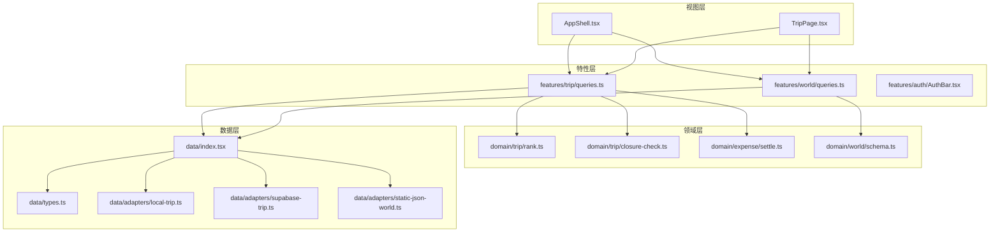
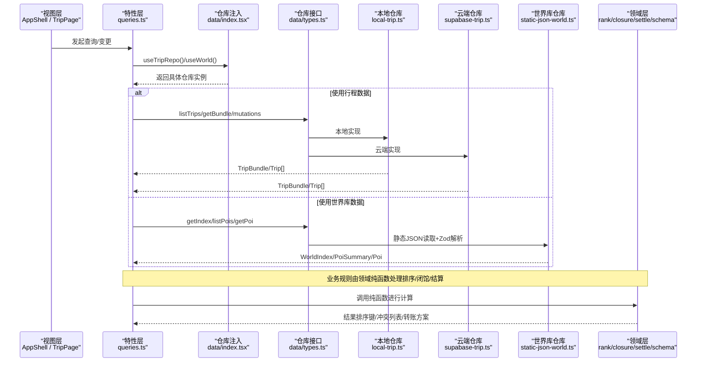
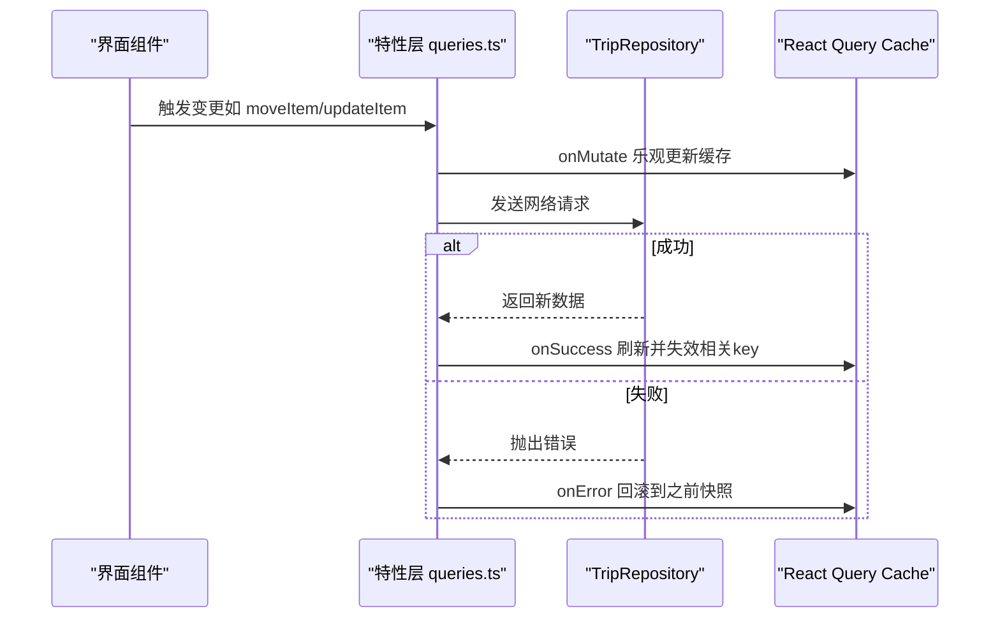
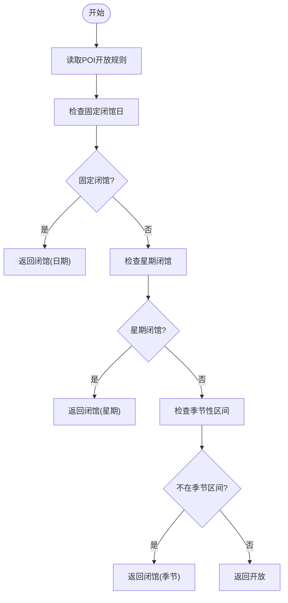
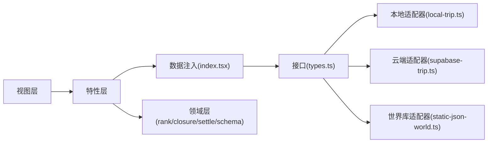

# 分层架构设计

<cite>
**本文引用的文件**
- [AppShell.tsx](file://src/app/AppShell.tsx)
- [index.tsx](file://src/data/index.tsx)
- [types.ts](file://src/data/types.ts)
- [local-trip.ts](file://src/data/adapters/local-trip.ts)
- [supabase-trip.ts](file://src/data/adapters/supabase-trip.ts)
- [static-json-world.ts](file://src/data/adapters/static-json-world.ts)
- [schema.ts](file://src/domain/world/schema.ts)
- [rank.ts](file://src/domain/trip/rank.ts)
- [closure-check.ts](file://src/domain/trip/closure-check.ts)
- [settle.ts](file://src/domain/expense/settle.ts)
- [queries.ts（行程）](file://src/features/trip/queries.ts)
- [queries.ts（世界库）](file://src/features/world/queries.ts)
- [AuthBar.tsx](file://src/features/auth/AuthBar.tsx)
- [TripPage.tsx](file://src/pages/TripPage.tsx)
</cite>

## 目录
1. [引言](#引言)
2. [项目结构](#项目结构)
3. [核心组件](#核心组件)
4. [架构总览](#架构总览)
5. [详细组件分析](#详细组件分析)
6. [依赖关系分析](#依赖关系分析)
7. [性能考量](#性能考量)
8. [故障排查指南](#故障排查指南)
9. [结论](#结论)

## 引言
本文件面向“玩无一失”项目的分层架构设计与实现说明，围绕 View → Feature → Domain → Data 四层模式展开，重点解释：
- 每层职责边界、数据流向与组件交互
- Repository 模式在数据层的抽象与后端隔离（本地存储 vs Supabase 云端）
- 业务逻辑层以纯函数为核心的可测试性与可维护性
- 通过架构图表与代码路径指引，帮助开发者理解依赖与流转

## 项目结构
应用采用清晰的分层组织：
- View 层：页面与外壳（如 AppShell、TripPage），负责路由、布局与用户交互
- Feature 层：按功能域组织（trip、world、auth、expense），封装 React Query 的查询与变更
- Domain 层：纯函数与领域模型（排序、闭馆校验、费用结算、世界库 schema）
- Data 层：Repository 接口与适配器（LocalTripRepository、SupabaseTripRepository、StaticJsonWorldRepository）



图表来源
- [AppShell.tsx:1-135](file://src/app/AppShell.tsx#L1-L135)
- [TripPage.tsx:1-176](file://src/pages/TripPage.tsx#L1-L176)
- [queries.ts（行程）:1-236](file://src/features/trip/queries.ts#L1-L236)
- [queries.ts（世界库）:1-62](file://src/features/world/queries.ts#L1-L62)
- [index.tsx:1-57](file://src/data/index.tsx#L1-L57)
- [types.ts:1-300](file://src/data/types.ts#L1-L300)
- [local-trip.ts:1-349](file://src/data/adapters/local-trip.ts#L1-L349)
- [supabase-trip.ts:1-548](file://src/data/adapters/supabase-trip.ts#L1-L548)
- [static-json-world.ts:1-167](file://src/data/adapters/static-json-world.ts#L1-L167)
- [schema.ts:1-317](file://src/domain/world/schema.ts#L1-L317)
- [rank.ts:1-91](file://src/domain/trip/rank.ts#L1-L91)
- [closure-check.ts:1-98](file://src/domain/trip/closure-check.ts#L1-L98)
- [settle.ts:1-141](file://src/domain/expense/settle.ts#L1-L141)

章节来源
- [AppShell.tsx:1-135](file://src/app/AppShell.tsx#L1-L135)
- [TripPage.tsx:1-176](file://src/pages/TripPage.tsx#L1-L176)

## 核心组件
- 仓库工厂与注入：统一暴露 TripRepository 与 WorldRepository 接口，根据环境选择具体实现；提供 React Context 注入到上层。
- 世界库适配器：静态 JSON 读取 + Zod 安全解析，保证容错与降级渲染。
- 行程适配器：本地 localStorage 与 Supabase 云端两套实现，字段对齐迁移脚本，UI 无感切换。
- 领域纯函数：分数序 rank、闭馆日校验、费用分摊与最小转账计算，全部无副作用、可单测。

章节来源
- [index.tsx:1-57](file://src/data/index.tsx#L1-L57)
- [static-json-world.ts:1-167](file://src/data/adapters/static-json-world.ts#L1-L167)
- [local-trip.ts:1-349](file://src/data/adapters/local-trip.ts#L1-L349)
- [supabase-trip.ts:1-548](file://src/data/adapters/supabase-trip.ts#L1-L548)
- [rank.ts:1-91](file://src/domain/trip/rank.ts#L1-L91)
- [closure-check.ts:1-98](file://src/domain/trip/closure-check.ts#L1-L98)
- [settle.ts:1-141](file://src/domain/expense/settle.ts#L1-L141)

## 架构总览
下图展示从视图到数据层的调用链与数据流，突出 Repository 抽象与领域纯函数的解耦。



图表来源
- [AppShell.tsx:1-135](file://src/app/AppShell.tsx#L1-L135)
- [TripPage.tsx:1-176](file://src/pages/TripPage.tsx#L1-L176)
- [queries.ts（行程）:1-236](file://src/features/trip/queries.ts#L1-L236)
- [queries.ts（世界库）:1-62](file://src/features/world/queries.ts#L1-L62)
- [index.tsx:1-57](file://src/data/index.tsx#L1-L57)
- [types.ts:1-300](file://src/data/types.ts#L1-L300)
- [local-trip.ts:1-349](file://src/data/adapters/local-trip.ts#L1-L349)
- [supabase-trip.ts:1-548](file://src/data/adapters/supabase-trip.ts#L1-L548)
- [static-json-world.ts:1-167](file://src/data/adapters/static-json-world.ts#L1-L167)
- [rank.ts:1-91](file://src/domain/trip/rank.ts#L1-L91)
- [closure-check.ts:1-98](file://src/domain/trip/closure-check.ts#L1-L98)
- [settle.ts:1-141](file://src/domain/expense/settle.ts#L1-L141)

## 详细组件分析

### 数据层：Repository 模式与后端隔离
- 接口定义：TripRepository 与 WorldRepository 在 types.ts 中统一定义，屏蔽后端差异。
- 工厂与注入：index.tsx 根据是否配置 Supabase 动态创建 LocalTripRepository 或 SupabaseTripRepository，并通过 Context 提供给上层。
- 本地实现：local-trip.ts 使用 localStorage 持久化，保持与云端一致的字段结构与行为（如 kind 归一化、splitMode 默认值）。
- 云端实现：supabase-trip.ts 通过 RPC 一次性获取 TripBundle，减少往返；写操作受 RLS 约束；邀请协作等能力仅云端支持。
- 世界库实现：static-json-world.ts 加载构建产物 index.json 与 POI/City/Country JSON，使用 safeParse 容错，避免白屏。

```mermaid
classDiagram
class TripRepository {
<<interface>>
+kind
+capabilities
+listTrips()
+getBundle(tripId)
+createTrip(input)
+updateTrip(id, patch)
+deleteTrip(id)
+addDay(...)
+updateDay(...)
+removeDay(...)
+addItem(...)
+updateItem(...)
+moveItem(...)
+removeItem(...)
+addMember(...)
+removeMember(...)
+createInvite(...)
+listInvites(...)
+revokeInvite(...)
+joinTripByToken(...)
+vote(...)
+upsertTicket(...)
+removeTicket(...)
+upsertExpense(...)
+removeExpense(...)
}
class LocalTripRepository {
+kind = "local"
+capabilities = {canWrite : true, canSync : false}
}
class SupabaseTripRepository {
+kind = "supabase"
+capabilities = {canWrite : true, canSync : true}
}
class WorldRepository {
<<interface>>
+getIndex()
+listCountries()
+getCountry(id)
+listCities(countryId?)
+getCity(id)
+listPois(q)
+getPoi(id)
+getPois(ids)
+search(keyword)
}
class StaticJsonWorldRepository {
+getIndex()
+listPois(q)
+getPoi(id)
+search(keyword)
}
TripRepository <|.. LocalTripRepository
TripRepository <|.. SupabaseTripRepository
WorldRepository <|.. StaticJsonWorldRepository
```

图表来源
- [types.ts:1-300](file://src/data/types.ts#L1-L300)
- [local-trip.ts:1-349](file://src/data/adapters/local-trip.ts#L1-L349)
- [supabase-trip.ts:1-548](file://src/data/adapters/supabase-trip.ts#L1-L548)
- [static-json-world.ts:1-167](file://src/data/adapters/static-json-world.ts#L1-L167)

章节来源
- [index.tsx:1-57](file://src/data/index.tsx#L1-L57)
- [types.ts:1-300](file://src/data/types.ts#L1-L300)
- [local-trip.ts:1-349](file://src/data/adapters/local-trip.ts#L1-L349)
- [supabase-trip.ts:1-548](file://src/data/adapters/supabase-trip.ts#L1-L548)
- [static-json-world.ts:1-167](file://src/data/adapters/static-json-world.ts#L1-L167)

### 特性层：React Query 封装与乐观更新
- 行程查询与变更：queries.ts（行程）封装 useQuery/useMutation，统一 key 管理、staleTime 控制与失效策略。
- 乐观更新：拖拽排程等高频写操作先更新本地缓存，网络失败时回滚，提升交互流畅度。
- 世界库查询：queries.ts（世界库）对静态资源设置永久缓存，避免重复请求。



图表来源
- [queries.ts（行程）:1-236](file://src/features/trip/queries.ts#L1-L236)

章节来源
- [queries.ts（行程）:1-236](file://src/features/trip/queries.ts#L1-L236)
- [queries.ts（世界库）:1-62](file://src/features/world/queries.ts#L1-L62)

### 领域层：纯函数与业务规则
- 分数序排序：rank.ts 实现基于 base62 小数的 rankBetween/initialRank/sequentialRanks，抗并发且无需批量更新。
- 闭馆日校验：closure-check.ts 基于结构化 openness 字段判断闭馆原因并提供同程内建议日期。
- 费用结算：settle.ts 用整数分运算，按权重拆分金额，贪心算法生成最少转账次数。
- 世界库 schema：schema.ts 使用 Zod 定义强类型与运行时校验，保障内容质量与 CI 门禁。



图表来源
- [closure-check.ts:1-98](file://src/domain/trip/closure-check.ts#L1-L98)

章节来源
- [rank.ts:1-91](file://src/domain/trip/rank.ts#L1-L91)
- [closure-check.ts:1-98](file://src/domain/trip/closure-check.ts#L1-L98)
- [settle.ts:1-141](file://src/domain/expense/settle.ts#L1-L141)
- [schema.ts:1-317](file://src/domain/world/schema.ts#L1-L317)

### 视图层：双端分流与装配
- AppShell：根据设备模式渲染桌面/移动端外壳，集成 AuthBar 与存储状态提示。
- TripPage：懒加载工作台/移动行程/账本/打包面板，提供 Markdown 导出与预览，协调世界库映射。

章节来源
- [AppShell.tsx:1-135](file://src/app/AppShell.tsx#L1-L135)
- [TripPage.tsx:1-176](file://src/pages/TripPage.tsx#L1-L176)

## 依赖关系分析
- 视图层依赖特性层提供的 hooks（useTripBundle、useWorldIndex 等），不直接感知数据源。
- 特性层依赖 data/index.tsx 提供的仓库注入，再调用具体适配器。
- 领域层被特性层调用，用于计算与校验，不依赖任何外部状态。
- 数据层通过接口解耦，便于替换实现（本地/云端/离线/模拟）。



图表来源
- [AppShell.tsx:1-135](file://src/app/AppShell.tsx#L1-L135)
- [TripPage.tsx:1-176](file://src/pages/TripPage.tsx#L1-L176)
- [queries.ts（行程）:1-236](file://src/features/trip/queries.ts#L1-L236)
- [queries.ts（世界库）:1-62](file://src/features/world/queries.ts#L1-L62)
- [index.tsx:1-57](file://src/data/index.tsx#L1-L57)
- [types.ts:1-300](file://src/data/types.ts#L1-L300)
- [local-trip.ts:1-349](file://src/data/adapters/local-trip.ts#L1-L349)
- [supabase-trip.ts:1-548](file://src/data/adapters/supabase-trip.ts#L1-L548)
- [static-json-world.ts:1-167](file://src/data/adapters/static-json-world.ts#L1-L167)
- [rank.ts:1-91](file://src/domain/trip/rank.ts#L1-L91)
- [closure-check.ts:1-98](file://src/domain/trip/closure-check.ts#L1-L98)
- [settle.ts:1-141](file://src/domain/expense/settle.ts#L1-L141)

## 性能考量
- 世界库静态资源：使用 memo 缓存与永久 staleTime，避免重复 fetch。
- 行程数据聚合：云端 getBundle 通过 RPC 一次拉取全量，减少多次往返。
- 乐观更新：拖拽等高频率写操作先更新缓存，失败回滚，提升交互体验。
- 分数序排序：rank 插入仅需更新一行，避免批量重算与覆盖冲突。
- 懒加载：TripPage 按需加载工作区/移动行程/账本/打包面板，减小首包体积。

[本节为通用指导，不直接分析具体文件]

## 故障排查指南
- 世界库资源缺失：若 index.json 或 POI JSON 未构建，会抛出资源缺失错误；需执行构建脚本生成内容。
- 权限问题：云端模式下非成员访问会被拒绝（FORBIDDEN），应引导登录或检查成员资格。
- 外键约束：删除成员时若存在关联账单记录，将抛出约束错误；需先处理账目。
- 本地模式限制：本地仓库不支持协作邀请与加入行程，需在云端模式使用。
- 数据一致性：本地与云端字段对齐（如 kind、splitMode、updatedAt），迁移时无需转换。

章节来源
- [static-json-world.ts:1-167](file://src/data/adapters/static-json-world.ts#L1-L167)
- [supabase-trip.ts:1-548](file://src/data/adapters/supabase-trip.ts#L1-L548)
- [local-trip.ts:1-349](file://src/data/adapters/local-trip.ts#L1-L349)

## 结论
本项目通过清晰的 View → Feature → Domain → Data 分层与 Repository 模式，实现了：
- 视图与数据源的解耦：上层只依赖接口，可无缝切换后端
- 业务规则的纯函数化：可测试、可复用、无副作用
- 良好的用户体验：乐观更新、静态资源缓存、懒加载
- 可扩展的数据层：新增存储后端只需实现接口，不影响上层

建议在后续迭代中继续遵循该分层原则，确保新增功能与现有架构一致，维持系统的可维护性与可测试性。