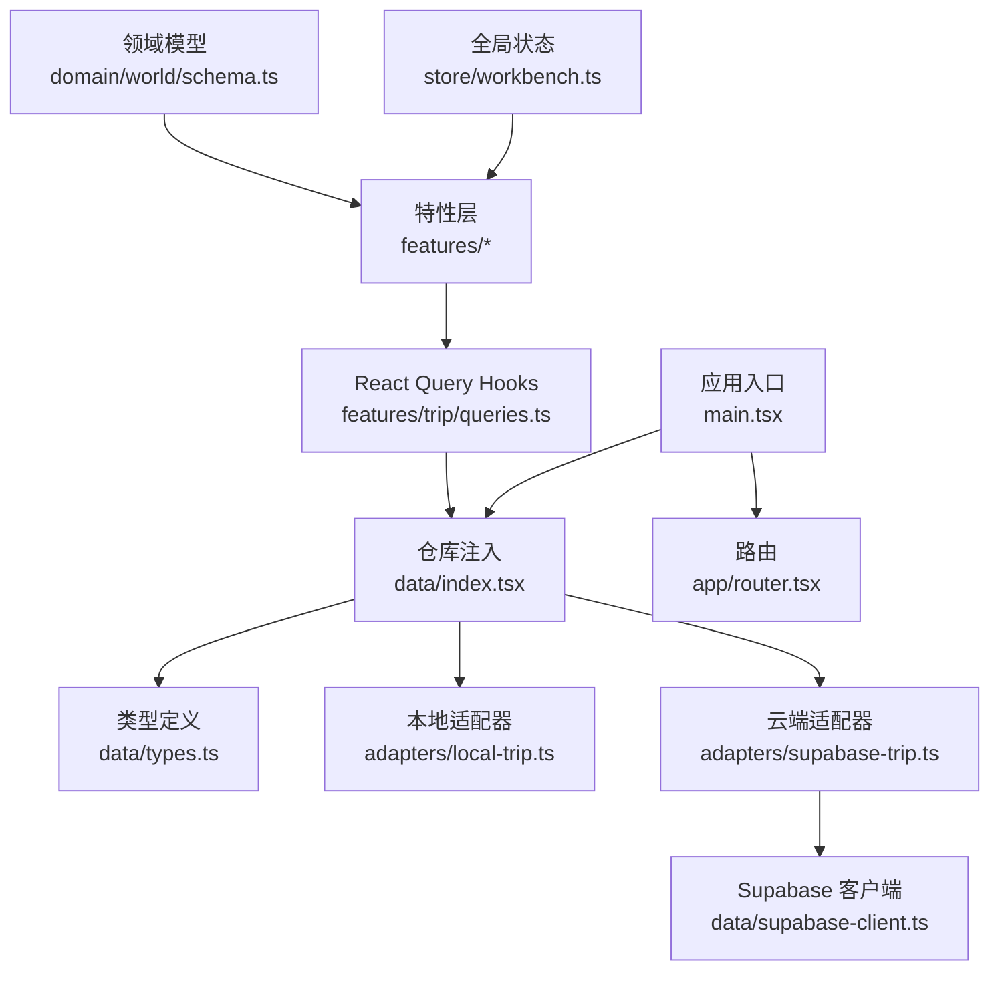
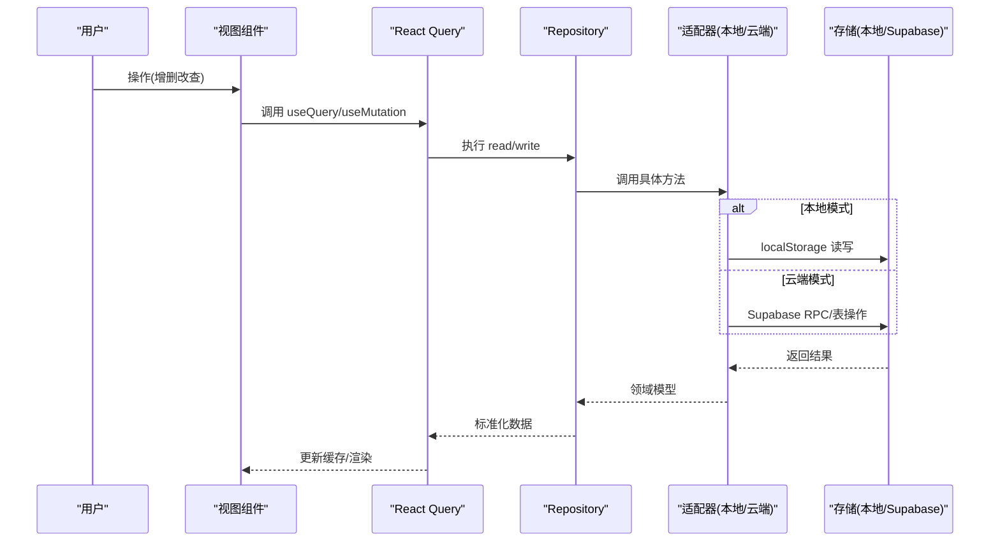
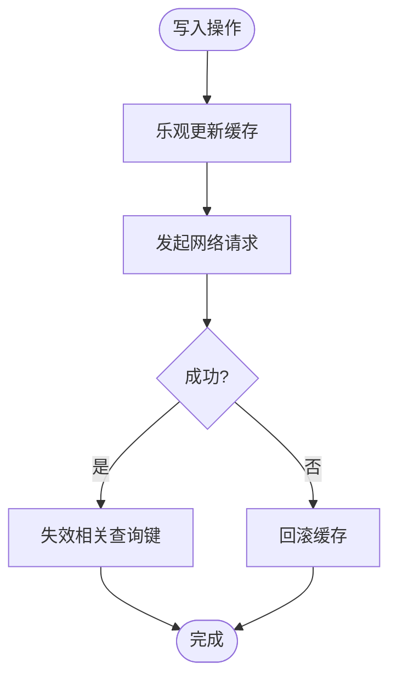
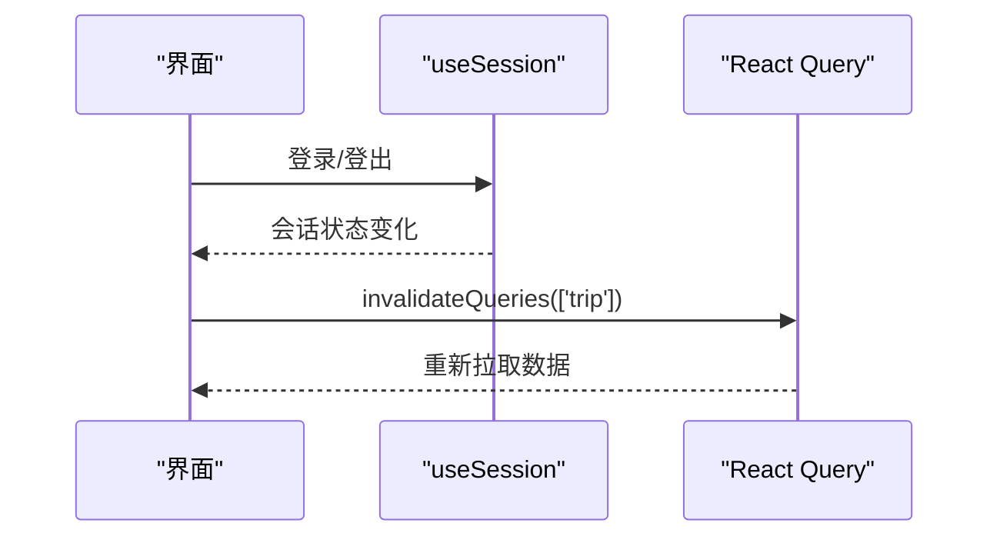
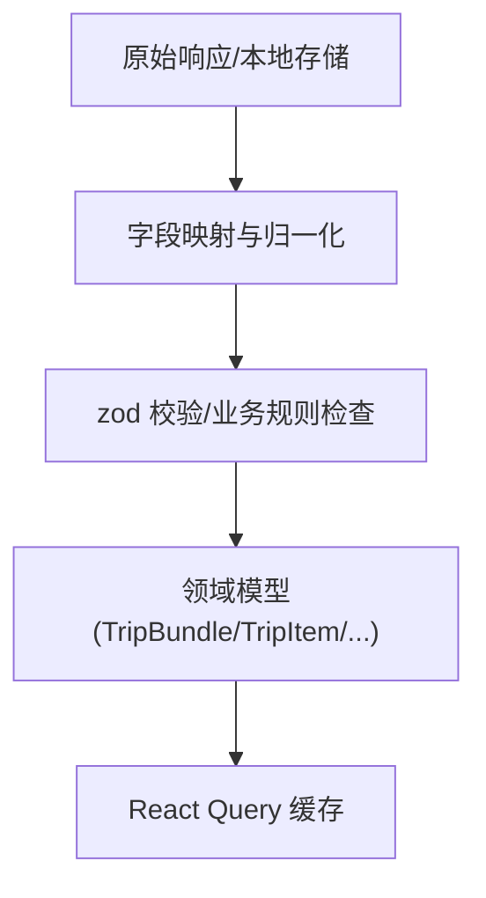
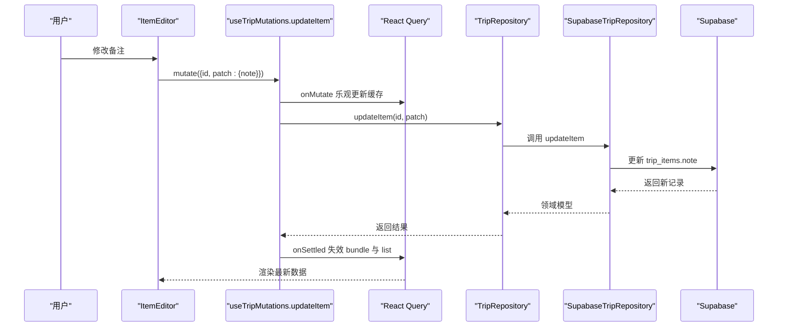
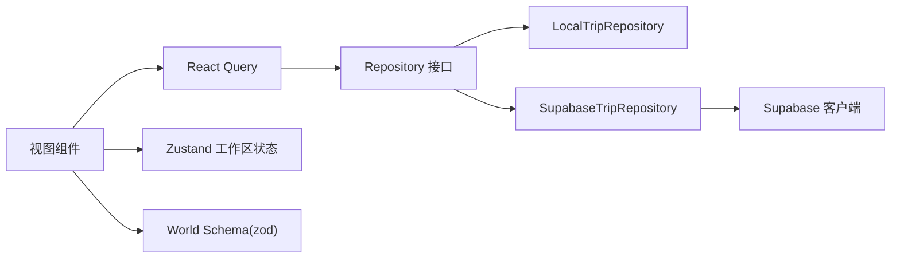

# 数据流设计

<cite>
**本文引用的文件**
- [src/app/main.tsx](file://src/app/main.tsx)
- [src/app/router.tsx](file://src/app/router.tsx)
- [src/data/index.tsx](file://src/data/index.tsx)
- [src/data/types.ts](file://src/data/types.ts)
- [src/data/supabase-client.ts](file://src/data/supabase-client.ts)
- [src/data/adapters/local-trip.ts](file://src/data/adapters/local-trip.ts)
- [src/data/adapters/supabase-trip.ts](file://src/data/adapters/supabase-trip.ts)
- [src/features/trip/queries.ts](file://src/features/trip/queries.ts)
- [src/features/auth/AuthQuerySync.tsx](file://src/features/auth/AuthQuerySync.tsx)
- [src/features/auth/useProfile.ts](file://src/features/auth/useProfile.ts)
- [src/features/trip/ItemEditor.tsx](file://src/features/trip/ItemEditor.tsx)
- [src/features/trip/uploadAttachment.ts](file://src/features/trip/uploadAttachment.ts)
- [src/store/workbench.ts](file://src/store/workbench.ts)
- [src/domain/world/schema.ts](file://src/domain/world/schema.ts)
</cite>

## 目录
1. [简介](#简介)
2. [项目结构](#项目结构)
3. [核心组件](#核心组件)
4. [架构总览](#架构总览)
5. [详细组件分析](#详细组件分析)
6. [依赖关系分析](#依赖关系分析)
7. [性能考量](#性能考量)
8. [故障排查指南](#故障排查指南)
9. [结论](#结论)
10. [附录](#附录)

## 简介
本文件面向“玩无一失”应用的数据流设计，聚焦从用户操作到数据持久化的完整链路，覆盖以下要点：
- React Query 的服务器状态管理策略（缓存、失效、错误处理）
- Zustand 全局状态的使用场景与设计模式
- Supabase Realtime 的连接与事件处理现状说明
- 数据验证与转换流程（API 响应到领域模型映射）
- 数据流图与时间序列图，展示典型场景下的数据流转

## 项目结构
应用采用分层与特性组织相结合的结构：
- 入口与路由：应用启动、React Query 客户端配置、仓库注入、路由定义
- 数据层：Repository 抽象与实现（本地/云端），类型定义，Supabase 客户端封装
- 特性层：按功能域划分（行程、世界库、认证等），包含查询与变更 Hook、UI 组件
- 领域层：纯业务规则与校验（如世界库 schema）
- 全局状态：Zustand 维护 UI 工作区上下文（筛选、选中项等）



图表来源
- [src/app/main.tsx:1-37](file://src/app/main.tsx#L1-L37)
- [src/data/index.tsx:1-57](file://src/data/index.tsx#L1-L57)
- [src/data/types.ts:1-300](file://src/data/types.ts#L1-L300)
- [src/data/adapters/local-trip.ts:1-349](file://src/data/adapters/local-trip.ts#L1-L349)
- [src/data/adapters/supabase-trip.ts:1-548](file://src/data/adapters/supabase-trip.ts#L1-L548)
- [src/data/supabase-client.ts:1-106](file://src/data/supabase-client.ts#L1-L106)
- [src/features/trip/queries.ts:1-236](file://src/features/trip/queries.ts#L1-L236)
- [src/store/workbench.ts:1-77](file://src/store/workbench.ts#L1-L77)
- [src/domain/world/schema.ts:1-317](file://src/domain/world/schema.ts#L1-L317)

章节来源
- [src/app/main.tsx:1-37](file://src/app/main.tsx#L1-L37)
- [src/app/router.tsx:1-31](file://src/app/router.tsx#L1-L31)

## 核心组件
- Repository 工厂与注入：根据是否配置 Supabase 动态选择本地或云端适配器，视图层仅依赖接口。
- Supabase 客户端与认证：提供会话监听、登录/登出能力；RLS 要求必须登录才能写。
- React Query 数据层：统一读取与变更，使用乐观更新提升交互体验，集中失效策略。
- 领域模型与校验：世界库 schema 作为事实源，保障数据结构与业务规则一致性。
- 全局状态：Zustand 管理 UI 工作区上下文（日期、筛选、详情面板等），并持久化到 sessionStorage。

章节来源
- [src/data/index.tsx:1-57](file://src/data/index.tsx#L1-L57)
- [src/data/supabase-client.ts:1-106](file://src/data/supabase-client.ts#L1-L106)
- [src/features/trip/queries.ts:1-236](file://src/features/trip/queries.ts#L1-L236)
- [src/domain/world/schema.ts:1-317](file://src/domain/world/schema.ts#L1-L317)
- [src/store/workbench.ts:1-77](file://src/store/workbench.ts#L1-L77)

## 架构总览
整体数据流遵循“视图 → React Query → Repository → 存储后端”的分层路径，并通过适配层屏蔽后端差异。认证与会话通过 Supabase 客户端统一管理，并在登录态变化时触发查询失效，确保数据一致性。



图表来源
- [src/features/trip/queries.ts:1-236](file://src/features/trip/queries.ts#L1-L236)
- [src/data/adapters/local-trip.ts:1-349](file://src/data/adapters/local-trip.ts#L1-L349)
- [src/data/adapters/supabase-trip.ts:1-548](file://src/data/adapters/supabase-trip.ts#L1-L548)
- [src/data/supabase-client.ts:1-106](file://src/data/supabase-client.ts#L1-L106)

## 详细组件分析

### React Query 服务器状态管理
- 缓存策略：
  - 列表与聚合数据设置 staleTime，减少频繁刷新。
  - 使用 queryKey 分组（如 ['trip', 'bundle', tripId]）进行细粒度失效。
- 乐观更新：
  - 所有写操作在 onMutate 中立即更新缓存，onError 回滚，onSettled 统一失效相关 key，保证 UI 即时反馈且最终一致。
- 错误处理：
  - 适配器抛出错误，React Query 捕获后交由上层提示；权限错误（如 FORBIDDEN）由上层识别并引导登录。
- 登录态同步：
  - AuthQuerySync 订阅会话变化，登录后自动失效 ['trip'] 分组，避免旧缓存导致的数据不一致。



图表来源
- [src/features/trip/queries.ts:45-236](file://src/features/trip/queries.ts#L45-L236)
- [src/features/auth/AuthQuerySync.tsx:1-27](file://src/features/auth/AuthQuerySync.tsx#L1-L27)

章节来源
- [src/features/trip/queries.ts:1-236](file://src/features/trip/queries.ts#L1-L236)
- [src/features/auth/AuthQuerySync.tsx:1-27](file://src/features/auth/AuthQuerySync.tsx#L1-L27)

### 数据适配层与持久化
- 本地适配器：
  - 以 TripBundle 为单位存储在 localStorage，支持离线开发与演示。
  - 对历史数据进行归一化（补齐 kind、splitMode 等字段）。
- 云端适配器：
  - 通过 RPC get_trip_bundle 一次性拉取全量数据，减少往返。
  - 写操作受 RLS 约束，未登录无法写入；错误码与消息用于上层提示。
- 图片附件：
  - 仅云端可用，上传至 Supabase Storage，URL 写回 TripItem.images。

```mermaid
classDiagram
class TripRepository {
+listTrips() Promise~Trip[]~
+getBundle(tripId) Promise~TripBundle|null~
+createTrip(input) Promise~Trip~
+updateTrip(id, patch) Promise~Trip~
+addItem(input) Promise~TripItem~
+updateItem(id, patch) Promise~TripItem~
+moveItem(id, to) Promise~TripItem~
+removeItem(id) Promise~void~
+vote(itemId, memberId, value) Promise~void~
+upsertExpense(input) Promise~Expense~
+removeExpense(id) Promise~void~
}
class LocalTripRepository {
+kind = "local"
+capabilities = {canWrite : true, canSync : false}
}
class SupabaseTripRepository {
+kind = "supabase"
+capabilities = {canWrite : true, canSync : true}
}
TripRepository <|.. LocalTripRepository
TripRepository <|.. SupabaseTripRepository
```

图表来源
- [src/data/types.ts:263-299](file://src/data/types.ts#L263-L299)
- [src/data/adapters/local-trip.ts:67-349](file://src/data/adapters/local-trip.ts#L67-L349)
- [src/data/adapters/supabase-trip.ts:141-548](file://src/data/adapters/supabase-trip.ts#L141-L548)

章节来源
- [src/data/adapters/local-trip.ts:1-349](file://src/data/adapters/local-trip.ts#L1-L349)
- [src/data/adapters/supabase-trip.ts:1-548](file://src/data/adapters/supabase-trip.ts#L1-L548)
- [src/features/trip/uploadAttachment.ts:1-54](file://src/features/trip/uploadAttachment.ts#L1-L54)

### 认证与会话管理
- 会话监听：useSession 订阅 auth 状态变化，SSR 安全，无配置时直接返回未登录。
- 登录方式：匿名登录、邮箱 OTP、邮箱+密码；登出清理会话。
- 查询同步：AuthQuerySync 在 session 变化时失效 ['trip'] 分组，确保登录后数据刷新。



图表来源
- [src/data/supabase-client.ts:45-69](file://src/data/supabase-client.ts#L45-L69)
- [src/features/auth/AuthQuerySync.tsx:15-23](file://src/features/auth/AuthQuerySync.tsx#L15-L23)

章节来源
- [src/data/supabase-client.ts:1-106](file://src/data/supabase-client.ts#L1-L106)
- [src/features/auth/AuthQuerySync.tsx:1-27](file://src/features/auth/AuthQuerySync.tsx#L1-L27)

### 实时数据同步（Supabase Realtime）
- 当前实现：
  - 应用已引入 @supabase/realtime-js 依赖，但前端代码中未见显式订阅逻辑。
  - 注释表明真正的实时性将在后续阶段接管，现阶段依赖 React Query 的缓存与失效机制。
- 建议接入点：
  - 在 supabase-client 中建立 realtime 连接，订阅 trips、trip_items、expenses 等表的变更事件。
  - 在事件回调中调用 queryClient.invalidateQueries 对应 key，驱动 UI 增量更新。

章节来源
- [src/app/main.tsx:12-20](file://src/app/main.tsx#L12-L20)
- [package-lock.json:1373-1385](file://package-lock.json#L1373-L1385)

### 数据验证与转换流程
- 世界库 schema：
  - 使用 zod 定义国家、城市、POI 等结构，强制校验坐标、闭馆日、预约提前期等。
  - 运行时 safeParse 容错解析，避免白屏。
- API 响应映射：
  - 云端适配器将数据库列名（snake_case）映射为领域模型字段（camelCase），补齐默认值与可选字段。
  - 本地适配器对历史数据进行归一化，确保渲染层稳定消费。



图表来源
- [src/domain/world/schema.ts:14-317](file://src/domain/world/schema.ts#L14-L317)
- [src/data/adapters/supabase-trip.ts:35-137](file://src/data/adapters/supabase-trip.ts#L35-L137)
- [src/data/adapters/local-trip.ts:97-115](file://src/data/adapters/local-trip.ts#L97-L115)

章节来源
- [src/domain/world/schema.ts:1-317](file://src/domain/world/schema.ts#L1-L317)
- [src/data/adapters/supabase-trip.ts:1-548](file://src/data/adapters/supabase-trip.ts#L1-L548)
- [src/data/adapters/local-trip.ts:1-349](file://src/data/adapters/local-trip.ts#L1-L349)

### 用户操作到持久化的时间序列示例
以“编辑条目备注”为例：



图表来源
- [src/features/trip/ItemEditor.tsx:52-54](file://src/features/trip/ItemEditor.tsx#L52-L54)
- [src/features/trip/queries.ts:93-103](file://src/features/trip/queries.ts#L93-L103)
- [src/data/adapters/supabase-trip.ts:310-334](file://src/data/adapters/supabase-trip.ts#L310-L334)

章节来源
- [src/features/trip/ItemEditor.tsx:1-450](file://src/features/trip/ItemEditor.tsx#L1-L450)
- [src/features/trip/queries.ts:1-236](file://src/features/trip/queries.ts#L1-L236)
- [src/data/adapters/supabase-trip.ts:1-548](file://src/data/adapters/supabase-trip.ts#L1-L548)

### 全局状态（Zustand）使用场景
- 工作区上下文：
  - selectedDate、inspector、cityFilter、keyword、excludeTags、showSanity 等 UI 状态。
  - 通过 sessionStorage 持久化关键筛选条件，刷新不丢上下文。
- 与数据层解耦：
  - 仅承载 UI 上下文，不参与业务数据读写；数据仍走 React Query 与 Repository。

章节来源
- [src/store/workbench.ts:1-77](file://src/store/workbench.ts#L1-L77)

## 依赖关系分析
- 低耦合：
  - 视图层只依赖 Repository 接口，切换后端无需改动。
  - React Query 集中管理缓存与失效，降低组件内状态复杂度。
- 外部依赖：
  - Supabase 客户端负责认证与存储；Realtime 依赖已引入但未在前端启用。
  - Zod 用于世界库 schema 校验，保障数据质量。



图表来源
- [src/features/trip/queries.ts:1-236](file://src/features/trip/queries.ts#L1-L236)
- [src/data/adapters/local-trip.ts:1-349](file://src/data/adapters/local-trip.ts#L1-L349)
- [src/data/adapters/supabase-trip.ts:1-548](file://src/data/adapters/supabase-trip.ts#L1-L548)
- [src/data/supabase-client.ts:1-106](file://src/data/supabase-client.ts#L1-L106)
- [src/domain/world/schema.ts:1-317](file://src/domain/world/schema.ts#L1-L317)
- [src/store/workbench.ts:1-77](file://src/store/workbench.ts#L1-L77)

章节来源
- [src/data/index.tsx:1-57](file://src/data/index.tsx#L1-L57)
- [src/features/trip/queries.ts:1-236](file://src/features/trip/queries.ts#L1-L236)

## 性能考量
- 批量读取：
  - 使用 RPC get_trip_bundle 一次拉取全量，减少多次往返。
- 缓存与失效：
  - staleTime 控制缓存新鲜度；登录态变化时主动失效，避免陈旧数据。
- 乐观更新：
  - 拖拽排程等高频交互先更新缓存，再异步落库，提升响应速度。
- 资源限制：
  - 图片上传限制大小与类型，避免存储压力。

章节来源
- [src/data/adapters/supabase-trip.ts:159-198](file://src/data/adapters/supabase-trip.ts#L159-L198)
- [src/features/trip/queries.ts:17-39](file://src/features/trip/queries.ts#L17-L39)
- [src/features/trip/uploadAttachment.ts:21-37](file://src/features/trip/uploadAttachment.ts#L21-L37)

## 故障排查指南
- 权限错误（FORBIDDEN）：
  - 检查是否已登录；RLS 要求 authenticated 角色。
  - 使用 AuthQuerySync 在登录后失效查询。
- 数据不一致：
  - 确认 React Query 的 queryKey 是否正确分组；必要时手动 invalidateQueries。
- 上传失败：
  - 检查文件类型与大小限制；确认已连接云端。
- 本地模式限制：
  - 协作邀请、图片上传等功能仅在云端可用；本地模式会抛出明确错误。

章节来源
- [src/data/adapters/supabase-trip.ts:159-166](file://src/data/adapters/supabase-trip.ts#L159-L166)
- [src/features/auth/AuthQuerySync.tsx:15-23](file://src/features/auth/AuthQuerySync.tsx#L15-L23)
- [src/features/trip/uploadAttachment.ts:21-37](file://src/features/trip/uploadAttachment.ts#L21-L37)
- [src/data/adapters/local-trip.ts:283-295](file://src/data/adapters/local-trip.ts#L283-L295)

## 结论
该应用通过 Repository 抽象、React Query 缓存与乐观更新、以及严格的领域模型校验，构建了清晰、可维护的数据流。当前实时能力尚未在前端启用，建议在后续阶段基于 Supabase Realtime 完善事件订阅与增量更新策略，进一步提升多端协作体验。

## 附录
- 关键 Hook 与组件路径参考：
  - 查询与变更：[src/features/trip/queries.ts](file://src/features/trip/queries.ts)
  - 编辑器与附件：[src/features/trip/ItemEditor.tsx](file://src/features/trip/ItemEditor.tsx), [src/features/trip/uploadAttachment.ts](file://src/features/trip/uploadAttachment.ts)
  - 认证与会话：[src/data/supabase-client.ts](file://src/data/supabase-client.ts), [src/features/auth/AuthQuerySync.tsx](file://src/features/auth/AuthQuerySync.tsx), [src/features/auth/useProfile.ts](file://src/features/auth/useProfile.ts)
  - 数据适配：[src/data/adapters/local-trip.ts](file://src/data/adapters/local-trip.ts), [src/data/adapters/supabase-trip.ts](file://src/data/adapters/supabase-trip.ts)
  - 类型与 schema：[src/data/types.ts](file://src/data/types.ts), [src/domain/world/schema.ts](file://src/domain/world/schema.ts)
  - 全局状态：[src/store/workbench.ts](file://src/store/workbench.ts)