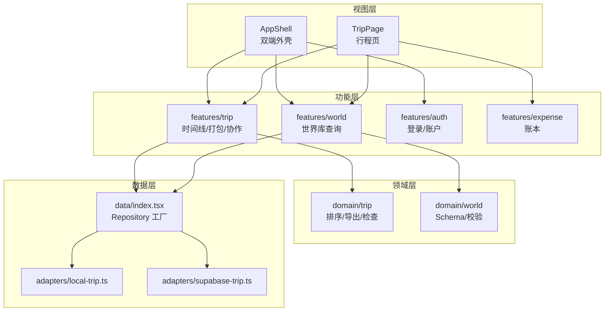
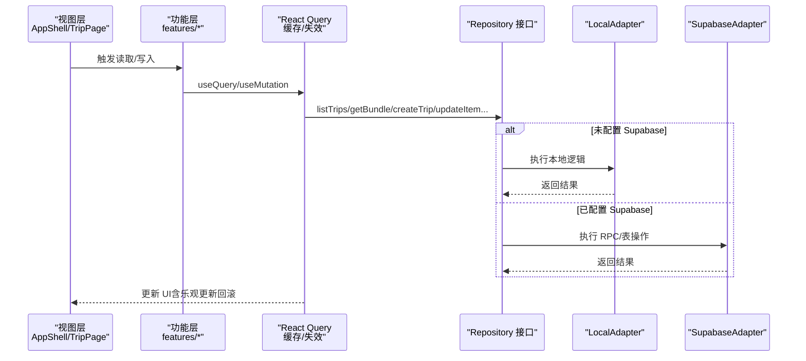
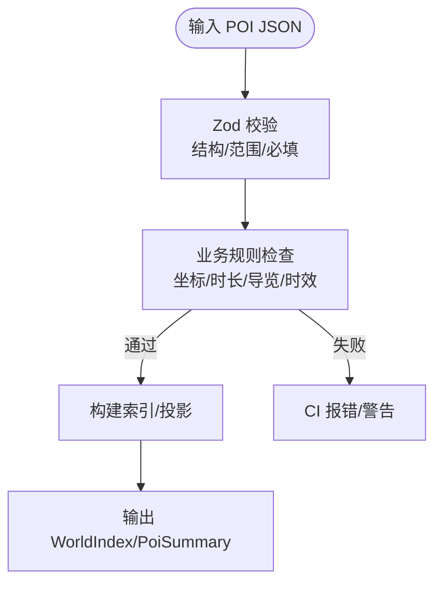
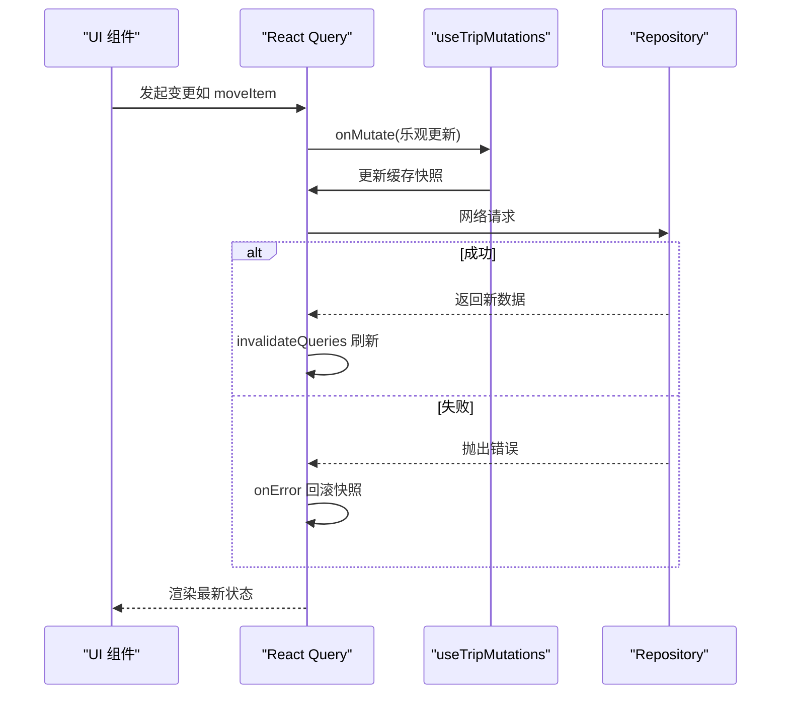
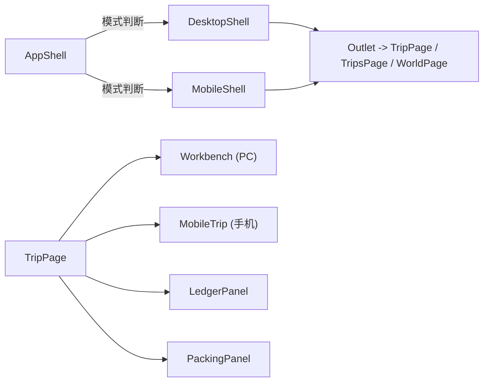
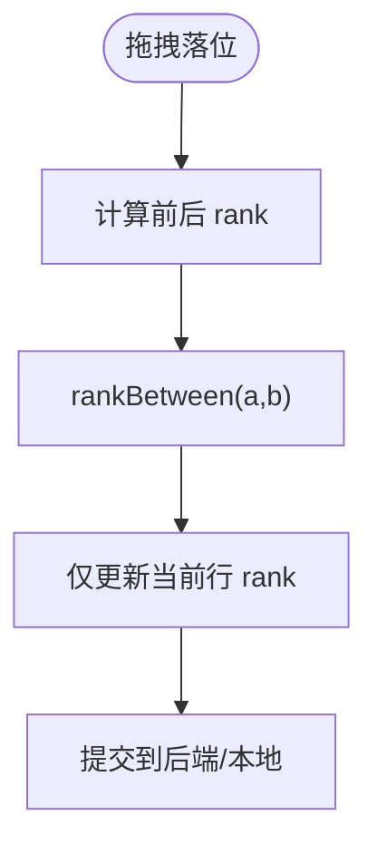
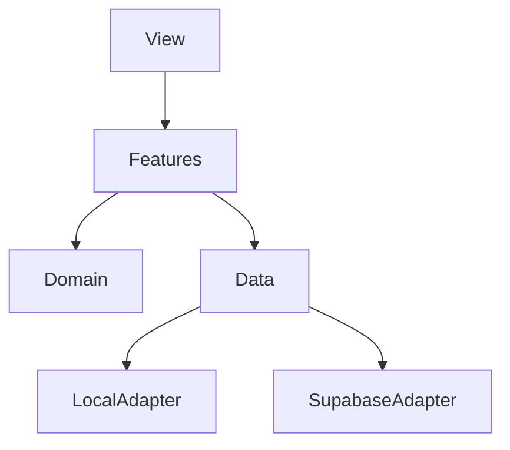

# 架构设计

<cite>
**本文引用的文件**
- [AppShell.tsx](file://src/app/AppShell.tsx)
- [index.tsx](file://src/data/index.tsx)
- [types.ts](file://src/data/types.ts)
- [supabase-trip.ts](file://src/data/adapters/supabase-trip.ts)
- [local-trip.ts](file://src/data/adapters/local-trip.ts)
- [queries.ts（行程）](file://src/features/trip/queries.ts)
- [queries.ts（世界库）](file://src/features/world/queries.ts)
- [schema.ts（世界库 schema）](file://src/domain/world/schema.ts)
- [rank.ts](file://src/domain/trip/rank.ts)
- [TripPage.tsx](file://src/pages/TripPage.tsx)
- [AuthBar.tsx](file://src/features/auth/AuthBar.tsx)
- [workbench.ts](file://src/store/workbench.ts)
- [0001_init.sql](file://supabase/migrations/0001_init.sql)
- [package.json](file://package.json)
</cite>

## 目录
1. [简介](#简介)
2. [项目结构](#项目结构)
3. [核心组件](#核心组件)
4. [架构总览](#架构总览)
5. [详细组件分析](#详细组件分析)
6. [依赖关系分析](#依赖关系分析)
7. [性能考量](#性能考量)
8. [故障排查指南](#故障排查指南)
9. [结论](#结论)
10. [附录](#附录)

## 简介
本文件为“玩无一失”项目的架构设计文档，围绕分层架构模式（View → Feature → Domain → Data）、Repository 模式、组件化架构、数据流与状态管理策略展开。重点解释技术选型（React + TypeScript + Supabase）的原因与权衡，并给出系统边界、组件交互和数据流转的可视化说明，帮助开发者快速理解整体设计思路。

## 项目结构
项目采用清晰的分层与模块化组织：
- View 层：页面与外壳（AppShell、TripPage），负责路由、布局与用户交互入口。
- Feature 层：按业务域划分（trip、world、auth、expense），封装 UI 与查询/变更逻辑。
- Domain 层：纯领域逻辑与规则（排序算法、校验、导出等），不依赖 UI 与存储。
- Data 层：Repository 接口与实现（本地 localStorage、Supabase），对外暴露统一能力。
- Store：轻量全局状态（Zustand），用于工作台筛选与面板选择等跨组件状态。
- 配置与脚本：构建期内容校验与索引生成、Supabase 迁移与函数。



图表来源
- [AppShell.tsx:1-135](file://src/app/AppShell.tsx#L1-L135)
- [TripPage.tsx:1-176](file://src/pages/TripPage.tsx#L1-L176)
- [index.tsx:1-57](file://src/data/index.tsx#L1-L57)
- [supabase-trip.ts:1-548](file://src/data/adapters/supabase-trip.ts#L1-L548)
- [local-trip.ts:1-349](file://src/data/adapters/local-trip.ts#L1-L349)

章节来源
- [AppShell.tsx:1-135](file://src/app/AppShell.tsx#L1-L135)
- [TripPage.tsx:1-176](file://src/pages/TripPage.tsx#L1-L176)
- [index.tsx:1-57](file://src/data/index.tsx#L1-L57)

## 核心组件
- Repository 工厂与注入：在应用启动时根据是否配置 Supabase 动态选择本地或云端实现，视图层仅依赖抽象接口。
- 世界库 Schema：以 Zod 定义强类型与运行时校验，确保内容质量与可演进性。
- 行程查询与变更：基于 React Query 封装读多写少场景，写操作采用乐观更新提升拖拽体验。
- 领域排序算法：分数序 rank 避免并发冲突与批量更新，支撑流畅拖拽。
- 双端外壳：桌面端三栏作战台与移动端单列随身册子共享数据与领域逻辑。

章节来源
- [index.tsx:1-57](file://src/data/index.tsx#L1-L57)
- [schema.ts:1-317](file://src/domain/world/schema.ts#L1-L317)
- [queries.ts（行程）:1-236](file://src/features/trip/queries.ts#L1-L236)
- [rank.ts:1-91](file://src/domain/trip/rank.ts#L1-L91)
- [AppShell.tsx:1-135](file://src/app/AppShell.tsx#L1-L135)

## 架构总览
下图展示从视图到数据层的调用链与数据流向，突出 Repository 模式与 React Query 的状态管理。



图表来源
- [index.tsx:1-57](file://src/data/index.tsx#L1-L57)
- [supabase-trip.ts:1-548](file://src/data/adapters/supabase-trip.ts#L1-L548)
- [local-trip.ts:1-349](file://src/data/adapters/local-trip.ts#L1-L349)
- [queries.ts（行程）:1-236](file://src/features/trip/queries.ts#L1-L236)

## 详细组件分析

### 分层架构与 Repository 模式
- 抽象接口：TripRepository、WorldRepository 定义统一的读写契约，屏蔽后端差异。
- 适配器实现：
  - LocalTripRepository：localStorage 持久化，canSync=false，适合开发与演示。
  - SupabaseTripRepository：通过 RPC get_trip_bundle 一次性拉取全量，减少往返；写操作映射到具体表与约束。
- 工厂与注入：createRepositories 根据 isSupabaseConfigured 决定使用哪个实现，并通过 Context 提供。

```mermaid
classDiagram
class TripRepository {
<<interface>>
+listTrips() Promise~Trip[]~
+getBundle(tripId) Promise~TripBundle|null~
+createTrip(input) Promise~Trip~
+updateItem(id, patch) Promise~TripItem~
+moveItem(id, to) Promise~TripItem~
+removeItem(id) Promise~void~
+addMember(tripId, displayName) Promise~TripMember~
+vote(itemId, memberId, value) Promise~void~
+upsertExpense(input) Promise~Expense~
+removeExpense(id) Promise~void~
+capabilities { canWrite, canSync }
}
class LocalTripRepository {
+kind = "local"
+capabilities = { canWrite : true, canSync : false }
}
class SupabaseTripRepository {
+kind = "supabase"
+capabilities = { canWrite : true, canSync : true }
}
TripRepository <|.. LocalTripRepository
TripRepository <|.. SupabaseTripRepository
```

图表来源
- [types.ts:81-300](file://src/data/types.ts#L81-L300)
- [local-trip.ts:67-349](file://src/data/adapters/local-trip.ts#L67-L349)
- [supabase-trip.ts:141-548](file://src/data/adapters/supabase-trip.ts#L141-L548)

章节来源
- [types.ts:1-300](file://src/data/types.ts#L1-L300)
- [index.tsx:1-57](file://src/data/index.tsx#L1-L57)
- [local-trip.ts:1-349](file://src/data/adapters/local-trip.ts#L1-L349)
- [supabase-trip.ts:1-548](file://src/data/adapters/supabase-trip.ts#L1-L548)

### 世界库 Schema 与内容治理
- 使用 Zod 定义国家、城市、POI 等数据结构，强制字段校验与来源/核实时间标记。
- 提供 CI 校验规则（如坐标范围、闭馆日、导览要求、易变字段时效）。
- 构建产物精简投影（PoiSummary）供列表与地图渲染，降低运行时体积。



图表来源
- [schema.ts:1-317](file://src/domain/world/schema.ts#L1-L317)

章节来源
- [schema.ts:1-317](file://src/domain/world/schema.ts#L1-L317)

### 数据流设计与状态管理策略
- 读取：Feature 层通过 React Query hooks 订阅数据，设置合理的 staleTime/gcTime；世界库静态数据设为无限过期。
- 写入：useTripMutations 统一封装写操作，采用乐观更新（onMutate）即时反馈，失败时回滚（onError）并在完成后刷新（onSettled）。
- 全局状态：Zustand store 维护工作台筛选、选中项等界面上下文，并持久化到 sessionStorage。



图表来源
- [queries.ts（行程）:1-236](file://src/features/trip/queries.ts#L1-L236)
- [workbench.ts:1-77](file://src/store/workbench.ts#L1-L77)

章节来源
- [queries.ts（行程）:1-236](file://src/features/trip/queries.ts#L1-L236)
- [queries.ts（世界库）:1-62](file://src/features/world/queries.ts#L1-L62)
- [workbench.ts:1-77](file://src/store/workbench.ts#L1-L77)

### 组件化架构与双端分流
- AppShell 根据设备模式渲染 DesktopShell/MobileShell，共用导航与认证条。
- TripPage 作为行程页入口，懒加载不同模块（工作台、移动行程、账本、打包），并按 tab 切换。
- 世界库与行程功能解耦，通过 Repository 注入，便于替换与测试。



图表来源
- [AppShell.tsx:1-135](file://src/app/AppShell.tsx#L1-L135)
- [TripPage.tsx:1-176](file://src/pages/TripPage.tsx#L1-L176)

章节来源
- [AppShell.tsx:1-135](file://src/app/AppShell.tsx#L1-L135)
- [TripPage.tsx:1-176](file://src/pages/TripPage.tsx#L1-L176)

### 领域逻辑：排序与校验
- 分数序 rank：通过 base62 小数中点计算，保证插入 O(1) 且抗并发，避免批量重排。
- 世界库校验：对 POI 的开放时段、导览、价格/时长等易变信息强制带来源与核实时间，保障准确性。



图表来源
- [rank.ts:1-91](file://src/domain/trip/rank.ts#L1-L91)

章节来源
- [rank.ts:1-91](file://src/domain/trip/rank.ts#L1-L91)
- [schema.ts:1-317](file://src/domain/world/schema.ts#L1-L317)

### 技术决策与权衡
- React + TypeScript：组件化与类型安全，配合 React Query/Zustand 形成稳定的前端状态体系。
- Supabase：提供数据库、认证、RLS 权限与 RPC，简化后端复杂度；通过迁移与函数集中管理数据一致性。
- 本地优先开发：未配置 Supabase 时使用 localStorage 适配器，保证离线可用与零门槛运行。
- 世界库静态化：构建期生成索引，运行时只读，提高性能与稳定性。

章节来源
- [package.json:1-45](file://package.json#L1-L45)
- [index.tsx:1-57](file://src/data/index.tsx#L1-L57)
- [0001_init.sql:1-530](file://supabase/migrations/0001_init.sql#L1-L530)

## 依赖关系分析
- 视图依赖功能层，功能层依赖领域层与数据层。
- 数据层通过接口隔离，适配器的切换由工厂完成，避免耦合。
- 世界库与行程数据解耦，分别通过独立 Repository 提供。



图表来源
- [index.tsx:1-57](file://src/data/index.tsx#L1-L57)
- [supabase-trip.ts:1-548](file://src/data/adapters/supabase-trip.ts#L1-L548)
- [local-trip.ts:1-349](file://src/data/adapters/local-trip.ts#L1-L349)

章节来源
- [index.tsx:1-57](file://src/data/index.tsx#L1-L57)

## 性能考量
- 一次获取全量：Supabase 通过 RPC get_trip_bundle 聚合多表数据，减少多次往返。
- 乐观更新：拖拽等高频写操作先更新缓存，失败再回滚，显著提升交互流畅度。
- 静态世界库：构建期生成索引，运行时永不失效，降低网络与解析开销。
- 懒加载：页面级与模块级懒加载，减小首屏包体。

[本节为通用性能建议，无需特定文件引用]

## 故障排查指南
- 未登录访问云端资源：Supabase RLS 会拒绝非成员访问，需先通过 AuthBar 登录。
- 协作邀请无效：检查 token 是否过期或被撤销，以及 join_trip_by_token 是否正确调用。
- 数据不一致：确认 React Query 的 invalidateQueries 是否被正确触发，或检查乐观更新回滚逻辑。
- 世界库内容错误：查看 CI 校验报告，修正 schema 或内容字段（如坐标、闭馆日、导览缺失）。

章节来源
- [AuthBar.tsx:1-57](file://src/features/auth/AuthBar.tsx#L1-L57)
- [0001_init.sql:288-530](file://supabase/migrations/0001_init.sql#L288-L530)
- [queries.ts（行程）:41-236](file://src/features/trip/queries.ts#L41-L236)
- [schema.ts:245-317](file://src/domain/world/schema.ts#L245-L317)

## 结论
本项目通过清晰的四层架构与 Repository 模式，将 UI、业务规则与数据存储解耦；借助 React Query 与 Zustand 实现高效的数据流与状态管理；利用 Supabase 的 RLS 与 RPC 强化数据安全与一致性；世界库静态化与内容校验保障数据质量。该设计兼顾了开发效率、运行性能与可扩展性，适合旅行规划类应用的持续演进。

[本节为总结性内容，无需特定文件引用]

## 附录
- 数据库迁移与权限：见初始化迁移，包含枚举、表结构、RLS 策略与关键 RPC。
- 构建脚本：内容校验与索引构建流程，确保发布前数据质量。

章节来源
- [0001_init.sql:1-530](file://supabase/migrations/0001_init.sql#L1-L530)
- [package.json:7-16](file://package.json#L7-L16)