# 组件化架构

<cite>
**本文引用的文件**
- [AppShell.tsx](file://src/app/AppShell.tsx)
- [router.tsx](file://src/app/router.tsx)
- [TripPage.tsx](file://src/pages/TripPage.tsx)
- [WorldPage.tsx](file://src/pages/WorldPage.tsx)
- [Workbench.tsx](file://src/features/trip/Workbench.tsx)
- [Timeline.tsx](file://src/features/trip/Timeline.tsx)
- [PoiGuideCard.tsx](file://src/features/world/PoiGuideCard.tsx)
- [useViewMode.ts](file://src/hooks/useViewMode.ts)
- [workbench.ts](file://src/store/workbench.ts)
- [base.css](file://src/ui/base.css)
- [tokens.css](file://src/ui/tokens.css)
- [ClickableImage.tsx](file://src/components/ClickableImage.tsx)
- [AuthBar.tsx](file://src/features/auth/AuthBar.tsx)
- [index.tsx](file://src/data/index.tsx)
</cite>

## 目录
1. [简介](#简介)
2. [项目结构](#项目结构)
3. [核心组件](#核心组件)
4. [架构总览](#架构总览)
5. [详细组件分析](#详细组件分析)
6. [依赖关系分析](#依赖关系分析)
7. [性能考虑](#性能考虑)
8. [故障排查指南](#故障排查指南)
9. [结论](#结论)
10. [附录](#附录)

## 简介
本文件为“玩无一失”项目的组件化架构文档，聚焦 React 组件层次、职责划分、通信机制、样式策略与可复用性设计。项目采用“双端分流 + 功能域拆分 + 领域逻辑隔离”的架构：应用外壳负责桌面/移动端布局切换；页面层组织路由与懒加载；功能域（trip/world/auth/expense）封装业务特性；基础 UI 组件提供通用能力；数据通过 Repository 抽象与查询 Hook 解耦视图与存储实现；状态管理使用轻量 Store 与本地持久化；样式基于 CSS Modules 与设计 Token 驱动主题与响应式体验。

## 项目结构
- 应用外壳与路由
  - AppShell：根据 view mode 渲染 DesktopShell/MobileShell，统一导航、登录条与深链加入流程。
  - router：HashRouter 配置，根路由挂载 AppShell，子路由包含行程列表、单行程、世界库等。
- 页面层
  - TripPage：行程页入口，按 tab 切换时间线/账本/打包，并按设备懒加载对应工作台或移动视图。
  - WorldPage：世界库独立浏览页，支持城市分组、搜索、详情面板与移动端卡片流。
- 功能域
  - trip：Workbench（三栏工作台）、Timeline（时间线与拖拽排序）、PackingPanel、TicketEditor、MemberAvatar、ChatPanel 等。
  - world：PoiGuideCard（景点导览卡）、WorldNav、queries 等。
  - auth：AuthBar、LoginDialog、AccountDialog、useProfile。
  - expense：LedgerPanel（账本）。
- 基础 UI
  - ClickableImage/Lightbox：图片点击放大与画廊。
  - base.css/tokens.css：全局样式与设计 Token（颜色、字体、圆角、阴影、布局常量）。
- 数据与状态
  - data/index.tsx：Repository 工厂与 Provider，注入 Trip/World 仓库实现。
  - store/workbench.ts：Zustand 工作区状态（选中日期、Inspector、筛选等），sessionStorage 持久化。
  - hooks/useViewMode.ts：view mode 单一真相源，媒体查询与手动覆盖并存。

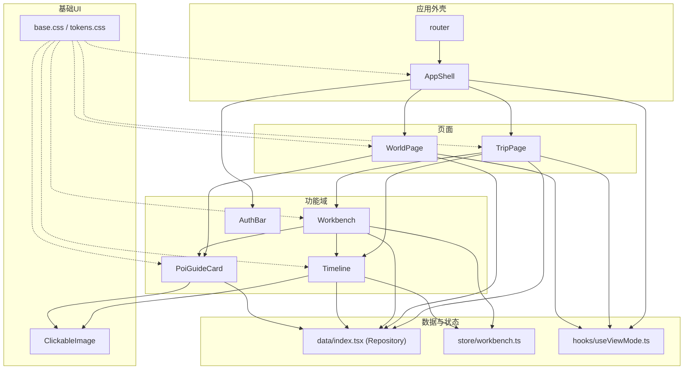

图表来源
- [router.tsx:1-31](file://src/app/router.tsx#L1-L31)
- [AppShell.tsx:1-135](file://src/app/AppShell.tsx#L1-L135)
- [TripPage.tsx:1-176](file://src/pages/TripPage.tsx#L1-L176)
- [WorldPage.tsx:1-346](file://src/pages/WorldPage.tsx#L1-L346)
- [Workbench.tsx:1-414](file://src/features/trip/Workbench.tsx#L1-L414)
- [Timeline.tsx:1-702](file://src/features/trip/Timeline.tsx#L1-L702)
- [PoiGuideCard.tsx:1-309](file://src/features/world/PoiGuideCard.tsx#L1-L309)
- [useViewMode.ts:1-63](file://src/hooks/useViewMode.ts#L1-L63)
- [workbench.ts:1-77](file://src/store/workbench.ts#L1-L77)
- [base.css:1-208](file://src/ui/base.css#L1-L208)
- [tokens.css:1-78](file://src/ui/tokens.css#L1-L78)
- [ClickableImage.tsx:1-147](file://src/components/ClickableImage.tsx#L1-L147)
- [index.tsx:1-57](file://src/data/index.tsx#L1-L57)

章节来源
- [router.tsx:1-31](file://src/app/router.tsx#L1-L31)
- [AppShell.tsx:1-135](file://src/app/AppShell.tsx#L1-L135)

## 核心组件
- 应用外壳 AppShell
  - 职责：根据 useViewMode 决定渲染 DesktopShell 或 MobileShell；处理深链 token 自动弹出加入对话框；集成 AuthBar 与导航。
  - 关键点：双端不是响应式，而是两套布局各自渲染；共享数据层与领域逻辑。
- 路由 router
  - 职责：定义 HashRouter 路由表，根路由挂载 AppShell，子路由映射到 TripsPage、TripPage、WorldPage 及 NotFound。
- 页面 TripPage
  - 职责：按 tab 切换时间线/账本/打包；按设备懒加载 Workbench 或 MobileTrip；提供 Markdown 导出与预览；悬浮 AI 助手 ChatPanel。
- 页面 WorldPage
  - 职责：世界库浏览，支持国家分组、城市筛选、关键词搜索；PC 三栏（侧边、列表、详情），移动端卡片流；选中 POI 进入详情。
- 功能域 Workbench
  - 职责：PC 三栏工作台（世界库导航、时间线、详情面板）；唯一 DndContext 承载跨栏拖拽；计算并展示体检问题；支持列宽拖拽调整。
- 功能域 Timeline
  - 职责：时间线编辑主区域；天卡片与条目可拖拽排序；候选池；地图视图懒加载；乐观更新与校验提示。
- 功能域 PoiGuideCard
  - 职责：景点导览卡，展示票价/开放/预约/路线/亮点/设施等；支持加入行程与票务编辑；图片灯箱。
- 基础 UI ClickableImage
  - 职责：缩略图点击放大，Portal 全屏预览，支持多图画廊与键盘导航。
- 数据与状态
  - Repository 工厂：根据是否配置 Supabase 选择云端或本地 Trip 仓库；World 仓库静态 JSON。
  - workbench Store：Zustand 管理 Inspector、选中日期、筛选等，sessionStorage 持久化。
  - useViewMode：媒体查询 + localStorage 覆盖，单一真相源供外壳与页面消费。

章节来源
- [AppShell.tsx:1-135](file://src/app/AppShell.tsx#L1-L135)
- [router.tsx:1-31](file://src/app/router.tsx#L1-L31)
- [TripPage.tsx:1-176](file://src/pages/TripPage.tsx#L1-L176)
- [WorldPage.tsx:1-346](file://src/pages/WorldPage.tsx#L1-L346)
- [Workbench.tsx:1-414](file://src/features/trip/Workbench.tsx#L1-L414)
- [Timeline.tsx:1-702](file://src/features/trip/Timeline.tsx#L1-L702)
- [PoiGuideCard.tsx:1-309](file://src/features/world/PoiGuideCard.tsx#L1-L309)
- [ClickableImage.tsx:1-147](file://src/components/ClickableImage.tsx#L1-L147)
- [index.tsx:1-57](file://src/data/index.tsx#L1-L57)
- [workbench.ts:1-77](file://src/store/workbench.ts#L1-L77)
- [useViewMode.ts:1-63](file://src/hooks/useViewMode.ts#L1-L63)

## 架构总览
- 分层与职责
  - 外壳层：AppShell 负责布局与导航，router 负责路由。
  - 页面层：TripPage/WorldPage 组合功能域组件，处理页面级状态与懒加载。
  - 功能域层：trip/world/auth/expense 封装业务特性与交互。
  - 基础 UI 层：ClickableImage 等通用组件。
  - 数据层：Repository 抽象 + queries（未在本节展开具体文件）+ supabase-client。
  - 状态层：useViewMode（全局模式）、workbench Store（工作区上下文）。
- 数据流向
  - 页面通过 useTripBundle/usePois 等查询 Hook 获取数据，调用 mutations 进行写操作。
  - 写操作走 optimistic update，先更新本地状态再同步后端（Supabase/本地存储）。
  - 拖拽、排序、状态变更在 Timeline/Workbench 中集中处理，统一写入 rank/dayId 等字段。
- 样式体系
  - 设计 Token（tokens.css）定义品牌色、文字层级、表面层级、语义色、字体、圆角、阴影、布局常量。
  - 基础样式（base.css）引入 tokens，提供按钮、输入框、标签、滚动条、打印样式等通用类。
  - 组件样式使用 CSS Modules，避免全局污染，便于局部定制。

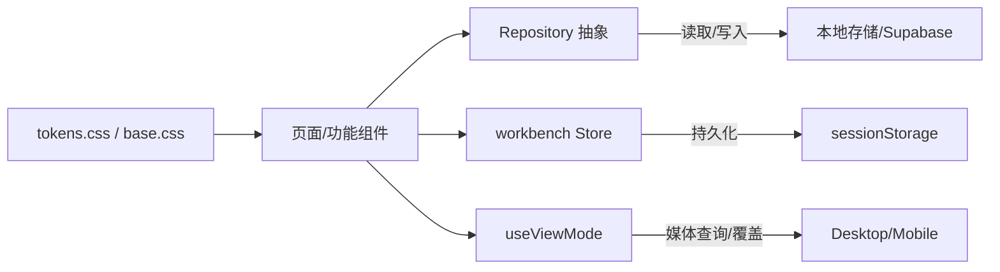

图表来源
- [index.tsx:1-57](file://src/data/index.tsx#L1-L57)
- [workbench.ts:1-77](file://src/store/workbench.ts#L1-L77)
- [useViewMode.ts:1-63](file://src/hooks/useViewMode.ts#L1-L63)
- [base.css:1-208](file://src/ui/base.css#L1-L208)
- [tokens.css:1-78](file://src/ui/tokens.css#L1-L78)

## 详细组件分析

### 应用外壳与路由
- 路由表将根路径指向 AppShell，子路由包含 trips/trip/:tripId/world/world/poi/:poiId 与 NotFound。
- AppShell 根据 useViewMode 渲染 DesktopShell/MobileShell，并在 URL 带 token 时打开 JoinDialog。

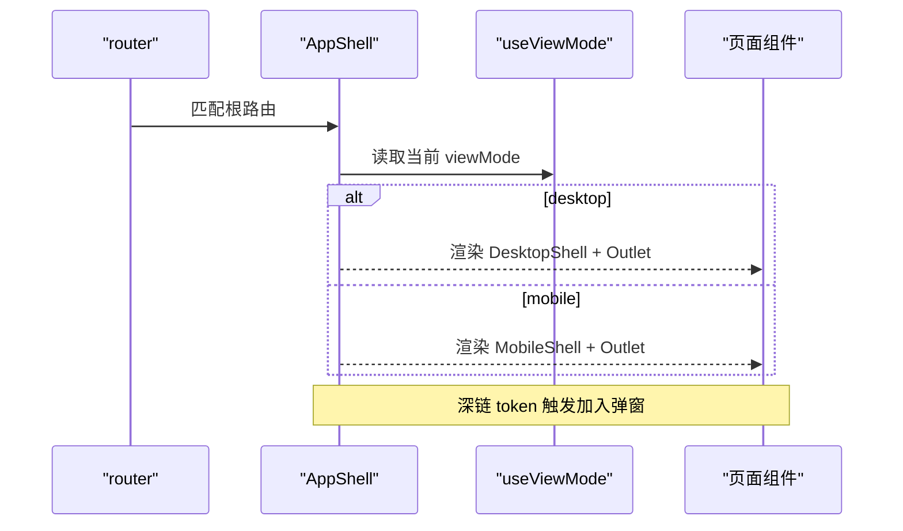

图表来源
- [router.tsx:1-31](file://src/app/router.tsx#L1-L31)
- [AppShell.tsx:1-135](file://src/app/AppShell.tsx#L1-L135)
- [useViewMode.ts:1-63](file://src/hooks/useViewMode.ts#L1-L63)

章节来源
- [router.tsx:1-31](file://src/app/router.tsx#L1-L31)
- [AppShell.tsx:1-135](file://src/app/AppShell.tsx#L1-L135)

### 行程页 TripPage
- 职责：tab 切换（时间线/账本/打包），按设备懒加载 Workbench 或 MobileTrip；提供 Markdown 导出与预览；悬浮 AI 助手。
- 数据：useTripBundle 获取行程包，usePoiMap/useWorldIndex 辅助导出与展示。
- 协作：仅行程拥有者可邀请协作。

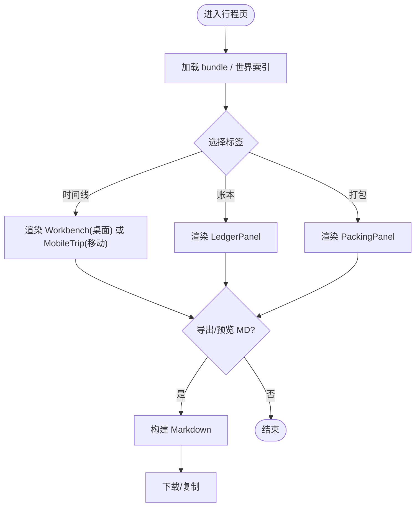

图表来源
- [TripPage.tsx:1-176](file://src/pages/TripPage.tsx#L1-L176)

章节来源
- [TripPage.tsx:1-176](file://src/pages/TripPage.tsx#L1-L176)

### 世界库 WorldPage
- 职责：国家分组、城市筛选、关键词搜索；PC 三栏（侧边、列表、详情），移动端卡片流；选中 POI 进入详情。
- 数据：useWorldIndex/usePois/usePoi 获取世界库数据；cityImages/poiImages 提供图片资源。

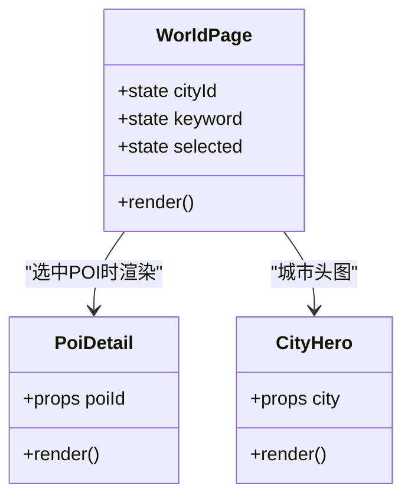

图表来源
- [WorldPage.tsx:1-346](file://src/pages/WorldPage.tsx#L1-L346)

章节来源
- [WorldPage.tsx:1-346](file://src/pages/WorldPage.tsx#L1-L346)

### 工作台 Workbench
- 职责：三栏布局（世界库导航、时间线、详情面板）；唯一 DndContext 承载跨栏拖拽；计算体检问题；列宽拖拽调整。
- 关键交互：从世界库拖入 POI 到时间线；时间线内条目排序；落点换算 fractional rank；选中条目/POI 显示详情。

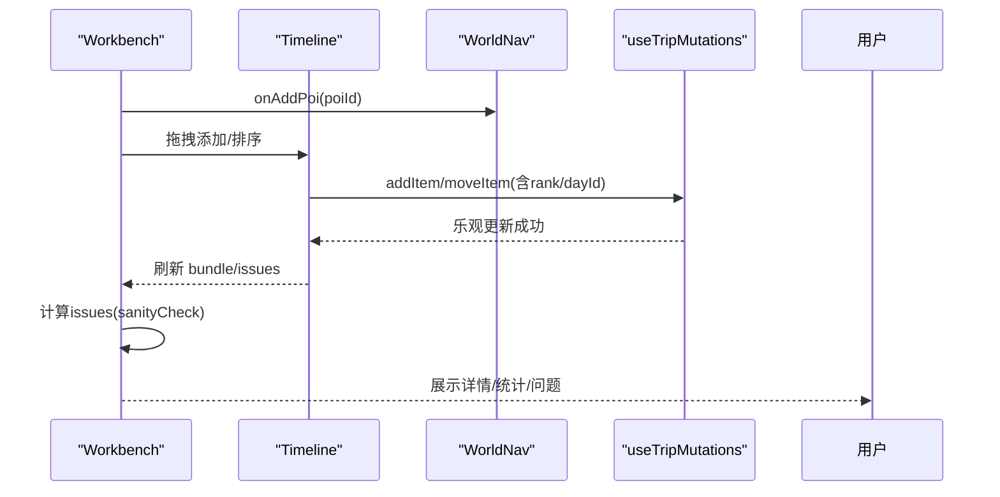

图表来源
- [Workbench.tsx:1-414](file://src/features/trip/Workbench.tsx#L1-L414)
- [Timeline.tsx:1-702](file://src/features/trip/Timeline.tsx#L1-L702)

章节来源
- [Workbench.tsx:1-414](file://src/features/trip/Workbench.tsx#L1-L414)
- [Timeline.tsx:1-702](file://src/features/trip/Timeline.tsx#L1-L702)

### 时间线 Timeline
- 职责：天卡片与条目拖拽排序；候选池；地图视图懒加载；状态切换与删除；成员投票与头像堆叠；地址一键复制。
- 关键算法：计划占用时长计算（优先 slotStart/slotEnd，否则回退 POI 时长）；闭馆检查；排序策略 verticalListSortingStrategy。

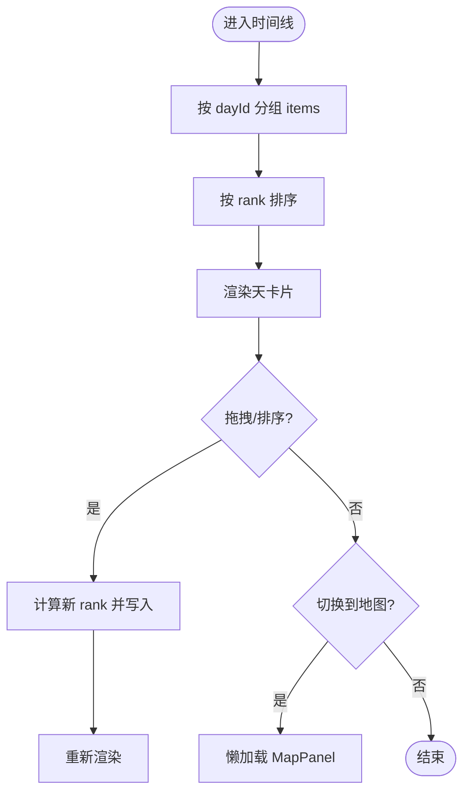

图表来源
- [Timeline.tsx:1-702](file://src/features/trip/Timeline.tsx#L1-L702)

章节来源
- [Timeline.tsx:1-702](file://src/features/trip/Timeline.tsx#L1-L702)

### 景点导览卡 PoiGuideCard
- 职责：展示景点信息（票价/开放/预约/路线/亮点/设施），支持加入行程与票务编辑；图片灯箱。
- 数据：usePoi 拉取 POI 详情；poiImages 提供图片；staleness 提示信息新鲜度。

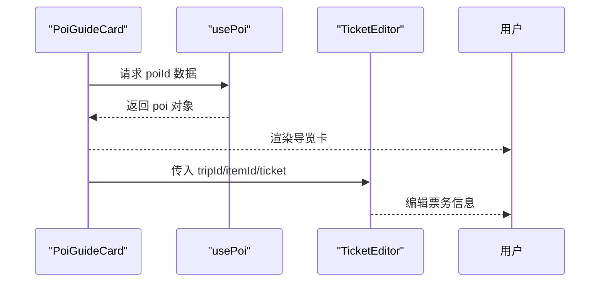

图表来源
- [PoiGuideCard.tsx:1-309](file://src/features/world/PoiGuideCard.tsx#L1-L309)

章节来源
- [PoiGuideCard.tsx:1-309](file://src/features/world/PoiGuideCard.tsx#L1-L309)

### 基础 UI 与样式
- ClickableImage/Lightbox：自包含图片点击放大，Portal 渲染至 body，支持多图画廊与键盘导航。
- 样式策略：
  - tokens.css：设计 Token（品牌色、文字层级、表面层级、语义色、字体、圆角、阴影、布局常量）。
  - base.css：引入 tokens，提供按钮、输入框、标签、滚动条、打印样式等通用类。
  - 组件样式使用 CSS Modules，避免全局污染。

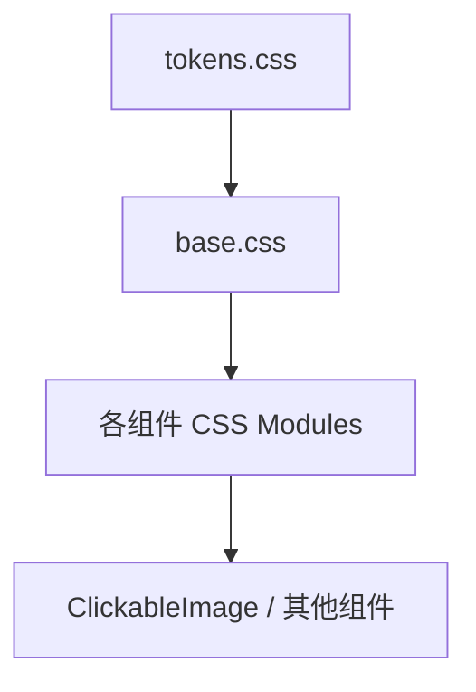

图表来源
- [tokens.css:1-78](file://src/ui/tokens.css#L1-L78)
- [base.css:1-208](file://src/ui/base.css#L1-L208)
- [ClickableImage.tsx:1-147](file://src/components/ClickableImage.tsx#L1-L147)

章节来源
- [ClickableImage.tsx:1-147](file://src/components/ClickableImage.tsx#L1-L147)
- [base.css:1-208](file://src/ui/base.css#L1-L208)
- [tokens.css:1-78](file://src/ui/tokens.css#L1-L78)

### 认证与登录条 AuthBar
- 职责：根据是否配置 Supabase 决定是否渲染；未登录显示登录按钮；已登录显示用户名与登出；支持账户编辑。
- 依赖：useSession/useProfile、LoginDialog/AccountDialog。

章节来源
- [AuthBar.tsx:1-57](file://src/features/auth/AuthBar.tsx#L1-L57)

## 依赖关系分析
- 组件耦合与内聚
  - AppShell 与 router 低耦合，仅通过路由表装配。
  - TripPage 组合多个功能域组件，通过 props 传递 tripId 与状态。
  - Workbench 聚合 WorldNav、Timeline、PoiGuideCard，并通过 useTripMutations 与数据层交互。
  - Timeline 内部高内聚：条目、天卡片、候选池均围绕拖拽与排序。
- 直接/间接依赖
  - 页面依赖功能域；功能域依赖基础 UI 与数据层；数据层通过 Repository 抽象屏蔽实现差异。
  - 状态依赖：useViewMode 被外壳与页面消费；workbench Store 被 Workbench/Timeline 消费。
- 外部依赖
  - dnd-kit：拖拽与排序。
  - react-router-dom：路由与导航。
  - zustand：轻量状态管理。
  - supabase：云端数据与认证（可选）。

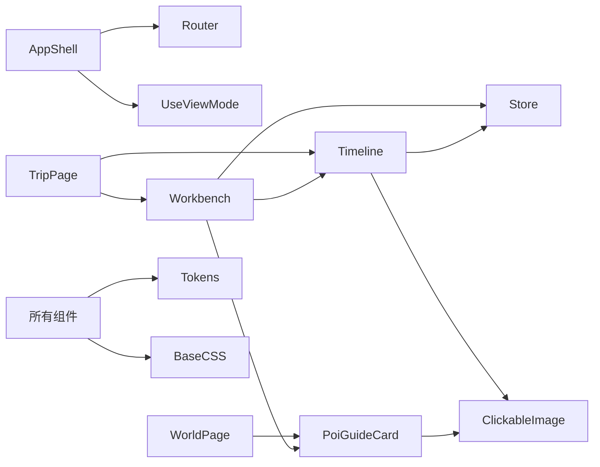

图表来源
- [AppShell.tsx:1-135](file://src/app/AppShell.tsx#L1-L135)
- [TripPage.tsx:1-176](file://src/pages/TripPage.tsx#L1-L176)
- [WorldPage.tsx:1-346](file://src/pages/WorldPage.tsx#L1-L346)
- [Workbench.tsx:1-414](file://src/features/trip/Workbench.tsx#L1-L414)
- [Timeline.tsx:1-702](file://src/features/trip/Timeline.tsx#L1-L702)
- [PoiGuideCard.tsx:1-309](file://src/features/world/PoiGuideCard.tsx#L1-L309)
- [ClickableImage.tsx:1-147](file://src/components/ClickableImage.tsx#L1-L147)
- [workbench.ts:1-77](file://src/store/workbench.ts#L1-L77)
- [base.css:1-208](file://src/ui/base.css#L1-L208)
- [tokens.css:1-78](file://src/ui/tokens.css#L1-L78)

章节来源
- [AppShell.tsx:1-135](file://src/app/AppShell.tsx#L1-L135)
- [TripPage.tsx:1-176](file://src/pages/TripPage.tsx#L1-L176)
- [WorldPage.tsx:1-346](file://src/pages/WorldPage.tsx#L1-L346)
- [Workbench.tsx:1-414](file://src/features/trip/Workbench.tsx#L1-L414)
- [Timeline.tsx:1-702](file://src/features/trip/Timeline.tsx#L1-L702)
- [PoiGuideCard.tsx:1-309](file://src/features/world/PoiGuideCard.tsx#L1-L309)
- [ClickableImage.tsx:1-147](file://src/components/ClickableImage.tsx#L1-L147)
- [workbench.ts:1-77](file://src/store/workbench.ts#L1-L77)
- [base.css:1-208](file://src/ui/base.css#L1-L208)
- [tokens.css:1-78](file://src/ui/tokens.css#L1-L78)

## 性能考虑
- 懒加载与代码分割
  - TripPage 对 Workbench/MobileTrip/LedgerPanel/PackingPanel 使用 lazy/Suspense，减少首屏体积。
  - Timeline 的地图视图 MapPanel 懒加载，仅在切换时下载。
- 拖拽与排序
  - 使用 dnd-kit 的 SortableContext 与 verticalListSortingStrategy 提升长列表排序性能。
  - 唯一 DndContext 在 Workbench，避免重复初始化开销。
- 数据与渲染
  - 使用 useMemo 缓存 poiIds/addedPoiIds/itemsByDay 等派生数据，减少重算。
  - 乐观更新：mutations 先更新本地状态，再同步后端，提升交互响应。
- 样式与主题
  - 设计 Token 驱动主题，避免硬编码颜色，便于维护与扩展。
  - CSS Modules 隔离样式，降低冲突与重绘成本。

[本节为通用指导，不直接分析具体文件]

## 故障排查指南
- 深链加入失败
  - 现象：URL 带 token 但无弹窗。
  - 排查：确认 AppShell 是否正确读取 search params 中的 token，并确保 JoinDialog 的 onClose 清理 URL。
  - 参考：[AppShell.tsx:115-126](file://src/app/AppShell.tsx#L115-L126)
- 拖拽无效或顺序错乱
  - 现象：拖拽后条目顺序未按预期更新。
  - 排查：检查 onDragEnd 中 rank 计算逻辑（rankForInsert/rankBetween）与 mut.moveItem.mutate 参数；确认 SortableContext 的 items 与 id 映射正确。
  - 参考：[Workbench.tsx:182-222](file://src/features/trip/Workbench.tsx#L182-L222)、[Timeline.tsx:415-427](file://src/features/trip/Timeline.tsx#L415-L427)
- 世界库数据为空
  - 现象：WorldPage 列表为空。
  - 排查：确认 useWorldIndex/usePois 是否正确返回数据；检查静态 JSON 仓库是否可用。
  - 参考：[WorldPage.tsx:62-76](file://src/pages/WorldPage.tsx#L62-L76)、[index.tsx:21-29](file://src/data/index.tsx#L21-L29)
- 主题/样式异常
  - 现象：颜色/字体不符合预期。
  - 排查：确认 tokens.css 已引入；检查 CSS Modules 类名是否正确；验证 base.css 的全局样式覆盖。
  - 参考：[tokens.css:1-78](file://src/ui/tokens.css#L1-L78)、[base.css:1-208](file://src/ui/base.css#L1-L208)

章节来源
- [AppShell.tsx:115-126](file://src/app/AppShell.tsx#L115-L126)
- [Workbench.tsx:182-222](file://src/features/trip/Workbench.tsx#L182-L222)
- [Timeline.tsx:415-427](file://src/features/trip/Timeline.tsx#L415-L427)
- [WorldPage.tsx:62-76](file://src/pages/WorldPage.tsx#L62-L76)
- [index.tsx:21-29](file://src/data/index.tsx#L21-L29)
- [tokens.css:1-78](file://src/ui/tokens.css#L1-L78)
- [base.css:1-208](file://src/ui/base.css#L1-L208)

## 结论
本项目采用清晰的组件化架构：外壳层负责布局与路由，页面层组合功能域，功能域封装业务逻辑，基础 UI 提供通用能力，数据层通过 Repository 抽象解耦存储实现，状态管理轻量且持久化。样式基于设计 Token 与 CSS Modules，支持主题与响应式体验。通过懒加载、乐观更新与高效拖拽，兼顾性能与用户体验。整体设计具备良好的可复用性与可扩展性，便于后续迭代与维护。

[本节为总结，不直接分析具体文件]

## 附录
- 组件树概览（概念性）
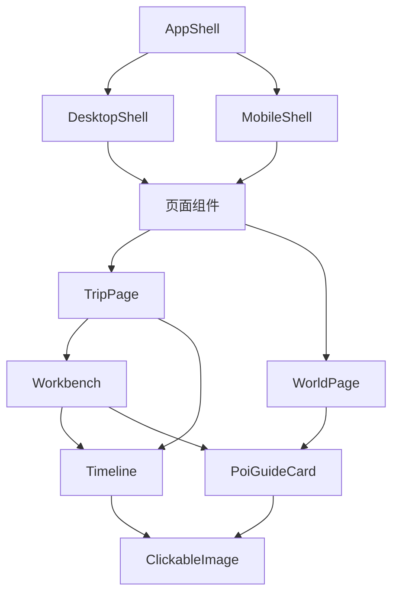

[此图为概念性示意，不直接映射具体源码文件]