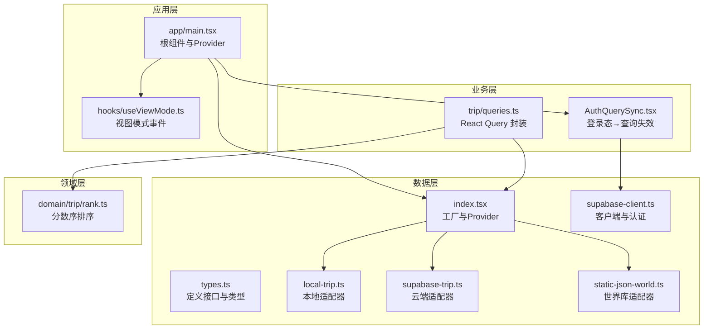
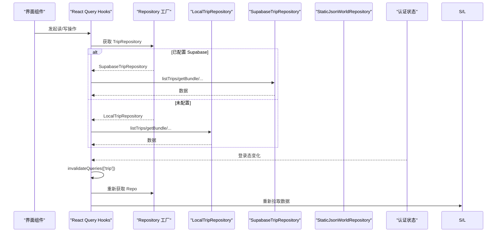
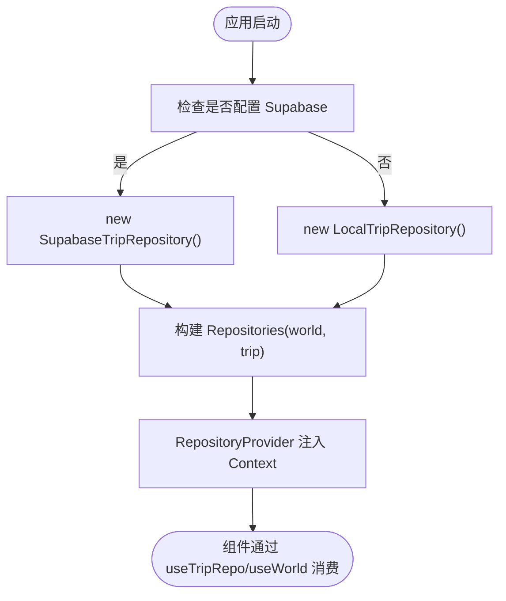
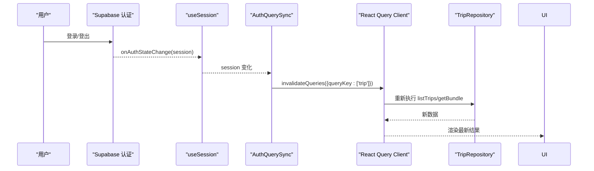
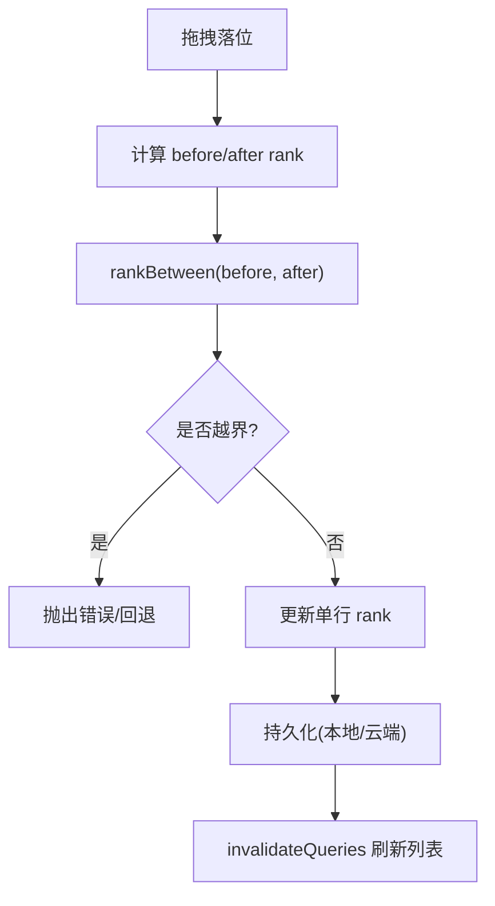
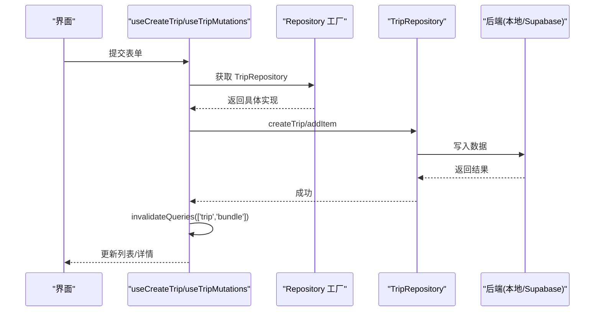
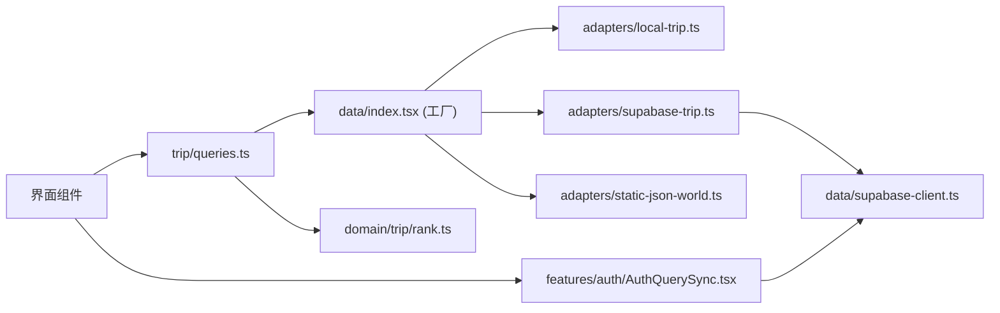

# 设计模式应用

<cite>
**本文引用的文件**
- [src/data/index.tsx](file://src/data/index.tsx)
- [src/data/types.ts](file://src/data/types.ts)
- [src/data/adapters/local-trip.ts](file://src/data/adapters/local-trip.ts)
- [src/data/adapters/supabase-trip.ts](file://src/data/adapters/supabase-trip.ts)
- [src/data/adapters/static-json-world.ts](file://src/data/adapters/static-json-world.ts)
- [src/data/supabase-client.ts](file://src/data/supabase-client.ts)
- [src/features/trip/queries.ts](file://src/features/trip/queries.ts)
- [src/features/auth/AuthQuerySync.tsx](file://src/features/auth/AuthQuerySync.tsx)
- [src/hooks/useViewMode.ts](file://src/hooks/useViewMode.ts)
- [src/domain/trip/rank.ts](file://src/domain/trip/rank.ts)
- [src/app/main.tsx](file://src/app/main.tsx)
</cite>

## 目录
1. [简介](#简介)
2. [项目结构](#项目结构)
3. [核心组件](#核心组件)
4. [架构总览](#架构总览)
5. [详细组件分析](#详细组件分析)
6. [依赖关系分析](#依赖关系分析)
7. [性能考量](#性能考量)
8. [故障排查指南](#故障排查指南)
9. [结论](#结论)
10. [附录](#附录)

## 简介
本文件聚焦“玩无一失”项目中设计模式的落地实践，重点围绕以下模式展开：
- Repository 模式：以统一接口抽象数据访问，屏蔽本地存储与云端数据库差异。
- 适配器模式：通过不同 Adapter 实现同一 TripRepository/WorldRepository 接口，支持多后端（localStorage、Supabase、静态 JSON）。
- 工厂模式：集中创建并注入 Repository 实例，按运行环境选择具体实现。
- 观察者模式：基于 React Query 的查询失效机制与 Supabase 认证状态订阅，实现登录态变化后的数据同步；同时使用 useSyncExternalStore 实现视图模式切换的事件通知。
- 策略/算法模式：在拖拽排序中使用分数序 rank 算法，避免并发冲突与全量更新。

这些模式共同提升了代码的可维护性、可扩展性与可测试性：新增后端只需实现接口；UI 层无需感知底层实现；测试可用本地或 Mock 替换真实后端；实时同步通过事件驱动解耦。

## 项目结构
仓库采用分层组织：
- data：定义 Repository 接口与类型，提供适配器实现与工厂注入点。
- features：业务功能模块（如 trip、auth、world），封装 UI 与数据交互逻辑。
- domain：领域模型与纯函数算法（如行程排序、打包清单等）。
- hooks：跨页面复用的 Hook（如视图模式切换）。
- app：应用入口与全局 Provider。



图表来源
- [src/data/index.tsx:21-29](file://src/data/index.tsx#L21-L29)
- [src/data/types.ts:263-299](file://src/data/types.ts#L263-L299)
- [src/data/adapters/local-trip.ts:67-70](file://src/data/adapters/local-trip.ts#L67-L70)
- [src/data/adapters/supabase-trip.ts:141-143](file://src/data/adapters/supabase-trip.ts#L141-L143)
- [src/data/adapters/static-json-world.ts:48-81](file://src/data/adapters/static-json-world.ts#L48-L81)
- [src/data/supabase-client.ts:22-34](file://src/data/supabase-client.ts#L22-L34)
- [src/features/trip/queries.ts:17-29](file://src/features/trip/queries.ts#L17-L29)
- [src/features/auth/AuthQuerySync.tsx:15-23](file://src/features/auth/AuthQuerySync.tsx#L15-L23)
- [src/domain/trip/rank.ts:57-64](file://src/domain/trip/rank.ts#L57-L64)
- [src/app/main.tsx:25-35](file://src/app/main.tsx#L25-L35)

章节来源
- [src/data/index.tsx:21-29](file://src/data/index.tsx#L21-L29)
- [src/data/types.ts:263-299](file://src/data/types.ts#L263-L299)
- [src/app/main.tsx:25-35](file://src/app/main.tsx#L25-L35)

## 核心组件
- Repository 接口与类型：统一 Trip 与 World 的数据访问契约，屏蔽后端细节。
- 适配器实现：
  - LocalTripRepository：基于 localStorage 的离线开发/演示实现，具备写能力但不可同步。
  - SupabaseTripRepository：基于 Supabase 的云端实现，支持协作邀请、RLS 权限控制与批量聚合读取。
  - StaticJsonWorldRepository：基于静态 JSON 的世界库实现，带内存缓存与降级容错。
- 工厂与注入：createRepositories 根据是否配置 Supabase 决定返回哪个 Trip 适配器；通过 React Context 注入到应用。
- 查询封装：useTrips/useTripBundle/useTripMutations 将 Repo 调用与 React Query 缓存、乐观更新结合。
- 认证与同步：useSession 监听登录态变化，AuthQuerySync 在 session 变化时使相关查询失效，保证登录后数据刷新。
- 视图模式事件：useViewMode 使用 useSyncExternalStore 暴露单一真相源，媒体查询变化时通知所有订阅者。

章节来源
- [src/data/types.ts:263-299](file://src/data/types.ts#L263-L299)
- [src/data/adapters/local-trip.ts:67-70](file://src/data/adapters/local-trip.ts#L67-L70)
- [src/data/adapters/supabase-trip.ts:141-143](file://src/data/adapters/supabase-trip.ts#L141-L143)
- [src/data/adapters/static-json-world.ts:48-81](file://src/data/adapters/static-json-world.ts#L48-L81)
- [src/data/index.tsx:21-29](file://src/data/index.tsx#L21-L29)
- [src/features/trip/queries.ts:17-29](file://src/features/trip/queries.ts#L17-L29)
- [src/features/auth/AuthQuerySync.tsx:15-23](file://src/features/auth/AuthQuerySync.tsx#L15-L23)
- [src/hooks/useViewMode.ts:26-37](file://src/hooks/useViewMode.ts#L26-L37)

## 架构总览
下图展示从 UI 到数据层的调用链与模式组合：工厂选择适配器，UI 通过 React Query 封装调用 Repo，认证变化触发查询失效，世界库走静态 JSON。



图表来源
- [src/data/index.tsx:21-29](file://src/data/index.tsx#L21-L29)
- [src/data/adapters/local-trip.ts:89-115](file://src/data/adapters/local-trip.ts#L89-L115)
- [src/data/adapters/supabase-trip.ts:150-198](file://src/data/adapters/supabase-trip.ts#L150-L198)
- [src/features/trip/queries.ts:17-29](file://src/features/trip/queries.ts#L17-L29)
- [src/features/auth/AuthQuerySync.tsx:15-23](file://src/features/auth/AuthQuerySync.tsx#L15-L23)

## 详细组件分析

### Repository 模式与适配器模式
- 统一接口：TripRepository 定义了行程相关的 CRUD、成员管理、投票、票据与账单等能力；WorldRepository 定义了世界库的索引、城市、POI 查询与搜索。
- 适配器实现：
  - LocalTripRepository：读写 localStorage，数据结构与云端对齐，canSync=false，用于离线开发与演示。
  - SupabaseTripRepository：通过 RPC get_trip_bundle 一次往返拉取全量，字段映射 camelCase/snake_case，受 RLS 保护，支持邀请加入。
  - StaticJsonWorldRepository：加载 index.json/city/poi 等静态资源，内置 memo 缓存与 safeParse 降级。
- 工厂选择：createRepositories 依据 isSupabaseConfigured 决定返回哪个 Trip 适配器；World 固定为静态 JSON 实现。

```mermaid
classDiagram
class TripRepository {
+kind
+capabilities
+listTrips()
+getBundle(tripId)
+createTrip(input)
+updateTrip(id, patch)
+deleteTrip(id)
+addDay(...)
+updateDay(...)
+removeDay(id)
+addItem(input)
+updateItem(...)
+moveItem(...)
+removeItem(id)
+addMember(...)
+removeMember(id)
+createInvite(...)
+listInvites(...)
+revokeInvite(id)
+joinTripByToken(token)
+vote(itemId, memberId, value)
+upsertTicket(...)
+removeTicket(id)
+upsertExpense(...)
+removeExpense(id)
}
class LocalTripRepository {
+kind = "local"
+capabilities = {canWrite : true, canSync : false}
}
class SupabaseTripRepository {
+kind = "supabase"
+capabilities = {canWrite : true, canSync : true}
}
class WorldRepository {
+getIndex()
+listCountries()
+getCountry(id)
+listCities(countryId)
+getCity(id)
+listPois(q)
+getPoi(id)
+getPois(ids)
+search(keyword)
}
class StaticJsonWorldRepository {
+getIndex()
+listCountries()
+getCountry(id)
+listCities(countryId)
+getCity(id)
+listPois(q)
+getPoi(id)
+getPois(ids)
+search(keyword)
}
TripRepository <|.. LocalTripRepository
TripRepository <|.. SupabaseTripRepository
WorldRepository <|.. StaticJsonWorldRepository
```

图表来源
- [src/data/types.ts:263-299](file://src/data/types.ts#L263-L299)
- [src/data/adapters/local-trip.ts:67-70](file://src/data/adapters/local-trip.ts#L67-L70)
- [src/data/adapters/supabase-trip.ts:141-143](file://src/data/adapters/supabase-trip.ts#L141-L143)
- [src/data/adapters/static-json-world.ts:48-81](file://src/data/adapters/static-json-world.ts#L48-L81)

章节来源
- [src/data/types.ts:263-299](file://src/data/types.ts#L263-L299)
- [src/data/adapters/local-trip.ts:67-70](file://src/data/adapters/local-trip.ts#L67-L70)
- [src/data/adapters/supabase-trip.ts:141-143](file://src/data/adapters/supabase-trip.ts#L141-L143)
- [src/data/adapters/static-json-world.ts:48-81](file://src/data/adapters/static-json-world.ts#L48-L81)

### 工厂模式：Repository 实例的创建与管理
- createRepositories 集中判断是否配置 Supabase，返回对应的 Trip 适配器；World 始终使用静态 JSON 适配器。
- RepositoryProvider 通过 React Context 提供 Repositories，useTripRepo/useWorld 便捷获取。
- main.tsx 在根组件中包裹 RepositoryProvider，确保全应用共享同一实例。



图表来源
- [src/data/index.tsx:21-29](file://src/data/index.tsx#L21-L29)
- [src/data/index.tsx:31-46](file://src/data/index.tsx#L31-L46)
- [src/app/main.tsx:25-35](file://src/app/main.tsx#L25-L35)

章节来源
- [src/data/index.tsx:21-29](file://src/data/index.tsx#L21-L29)
- [src/data/index.tsx:31-46](file://src/data/index.tsx#L31-L46)
- [src/app/main.tsx:25-35](file://src/app/main.tsx#L25-L35)

### 观察者模式：实时同步与事件通知
- 认证状态订阅：useSession 订阅 Supabase 认证状态变化；AuthQuerySync 在 session 变化时使 ['trip'] 分组查询失效，强制重拉数据，解决“登录后列表仍为空”的问题。
- 视图模式事件：useViewMode 使用 useSyncExternalStore 暴露单一状态源，媒体查询变化时通过 listeners 集合通知所有消费者，保证 AppShell 与子壳一致。
- React Query 作为全局观察者：mutation 成功后通过 invalidateQueries 触发依赖该 key 的查询重新获取，形成“写→失效→读”的响应式链路。



图表来源
- [src/data/supabase-client.ts:45-69](file://src/data/supabase-client.ts#L45-L69)
- [src/features/auth/AuthQuerySync.tsx:15-23](file://src/features/auth/AuthQuerySync.tsx#L15-L23)
- [src/features/trip/queries.ts:17-29](file://src/features/trip/queries.ts#L17-L29)

章节来源
- [src/data/supabase-client.ts:45-69](file://src/data/supabase-client.ts#L45-L69)
- [src/features/auth/AuthQuerySync.tsx:15-23](file://src/features/auth/AuthQuerySync.tsx#L15-L23)
- [src/hooks/useViewMode.ts:26-37](file://src/hooks/useViewMode.ts#L26-L37)
- [src/features/trip/queries.ts:45-59](file://src/features/trip/queries.ts#L45-L59)

### 复杂对象创建与数据一致性：分数序与适配层
- 分数序 rank：rankBetween/initialRank 生成 base62 小数键，避免并发覆盖与全量重排；插入时仅更新被拖动行，天然抗并发。
- 适配器内一致性：
  - LocalTripRepository：写入前归一化旧数据（补齐 kind、splitMode 等），保证 UI 稳定。
  - SupabaseTripRepository：通过 RPC 一次性拉取 bundle，减少网络往返；删除 day/item 利用外键级联与 set null 行为保持数据一致性。



图表来源
- [src/domain/trip/rank.ts:57-64](file://src/domain/trip/rank.ts#L57-L64)
- [src/domain/trip/rank.ts:86-90](file://src/domain/trip/rank.ts#L86-L90)
- [src/features/trip/queries.ts:105-119](file://src/features/trip/queries.ts#L105-L119)

章节来源
- [src/domain/trip/rank.ts:57-64](file://src/domain/trip/rank.ts#L57-L64)
- [src/domain/trip/rank.ts:86-90](file://src/domain/trip/rank.ts#L86-L90)
- [src/data/adapters/local-trip.ts:97-115](file://src/data/adapters/local-trip.ts#L97-L115)
- [src/data/adapters/supabase-trip.ts:269-272](file://src/data/adapters/supabase-trip.ts#L269-L272)

### API/服务流程：创建行程与条目
- 创建行程：工厂选择适配器后，UI 调用 createTrip；云端需先登录（RLS 限制），本地直接写入 localStorage。
- 添加条目：适配器内部计算 rank 并插入；云端通过 SQL 约束校验（poi_id/custom_title 至少一个）。



图表来源
- [src/features/trip/queries.ts:32-39](file://src/features/trip/queries.ts#L32-L39)
- [src/data/adapters/local-trip.ts:117-152](file://src/data/adapters/local-trip.ts#L117-L152)
- [src/data/adapters/supabase-trip.ts:200-218](file://src/data/adapters/supabase-trip.ts#L200-L218)

章节来源
- [src/features/trip/queries.ts:32-39](file://src/features/trip/queries.ts#L32-L39)
- [src/data/adapters/local-trip.ts:117-152](file://src/data/adapters/local-trip.ts#L117-L152)
- [src/data/adapters/supabase-trip.ts:200-218](file://src/data/adapters/supabase-trip.ts#L200-L218)

## 依赖关系分析
- 低耦合：UI 仅依赖 Repository 接口与 React Query，不关心数据存储位置。
- 高内聚：每个适配器专注一种后端，字段映射与业务规则集中在适配器内。
- 外部依赖：Supabase 客户端与认证、React Query 缓存、浏览器 API（localStorage、matchMedia）。



图表来源
- [src/features/trip/queries.ts:17-29](file://src/features/trip/queries.ts#L17-L29)
- [src/data/index.tsx:21-29](file://src/data/index.tsx#L21-L29)
- [src/data/adapters/local-trip.ts:67-70](file://src/data/adapters/local-trip.ts#L67-L70)
- [src/data/adapters/supabase-trip.ts:141-143](file://src/data/adapters/supabase-trip.ts#L141-L143)
- [src/data/adapters/static-json-world.ts:48-81](file://src/data/adapters/static-json-world.ts#L48-L81)
- [src/data/supabase-client.ts:22-34](file://src/data/supabase-client.ts#L22-L34)
- [src/domain/trip/rank.ts:57-64](file://src/domain/trip/rank.ts#L57-L64)
- [src/features/auth/AuthQuerySync.tsx:15-23](file://src/features/auth/AuthQuerySync.tsx#L15-L23)

章节来源
- [src/features/trip/queries.ts:17-29](file://src/features/trip/queries.ts#L17-L29)
- [src/data/index.tsx:21-29](file://src/data/index.tsx#L21-L29)
- [src/data/supabase-client.ts:22-34](file://src/data/supabase-client.ts#L22-L34)

## 性能考量
- 批量读取：SupabaseTripRepository.getBundle 通过 RPC 一次拉取 trip/members/days/items/votes/tickets/expenses，显著减少网络往返。
- 内存缓存：StaticJsonWorldRepository 对 country/city/poi 加载进行 memo 缓存，避免重复请求。
- 乐观更新：useTripMutations 在 mutation 前立即更新本地缓存，提升拖拽等高频操作的流畅度；失败时回滚。
- 窗口聚焦重取关闭：main.tsx 中 refetchOnWindowFocus=false，避免切标签页导致的闪烁；真正的实时性由 Supabase Realtime 接管（M4）。
- 排序优化：分数序 rank 只更新单行，避免 N 次 UPDATE，降低并发冲突概率。

[本节为通用性能建议，不直接分析具体文件]

## 故障排查指南
- 登录后列表不刷新：检查 AuthQuerySync 是否正确订阅 session 并调用 invalidateQueries(['trip'])。
- 云端写操作失败：确认已登录（RLS 要求）；查看 SupabaseTripRepository 的错误处理分支（如 FORBIDDEN、外键约束）。
- 本地数据异常：LocalTripRepository 会尝试归一化旧数据；若仍异常，检查 localStorage 结构与字段补齐逻辑。
- 世界库资源缺失：StaticJsonWorldRepository 会提示先构建内容；检查 build-index 产物是否存在。
- 视图模式不同步：确认 useViewMode 的 listeners 广播与 useSyncExternalStore 的使用正确。

章节来源
- [src/features/auth/AuthQuerySync.tsx:15-23](file://src/features/auth/AuthQuerySync.tsx#L15-L23)
- [src/data/adapters/supabase-trip.ts:159-166](file://src/data/adapters/supabase-trip.ts#L159-L166)
- [src/data/adapters/supabase-trip.ts:355-364](file://src/data/adapters/supabase-trip.ts#L355-L364)
- [src/data/adapters/local-trip.ts:97-115](file://src/data/adapters/local-trip.ts#L97-L115)
- [src/data/adapters/static-json-world.ts:21-25](file://src/data/adapters/static-json-world.ts#L21-L25)
- [src/hooks/useViewMode.ts:26-37](file://src/hooks/useViewMode.ts#L26-L37)

## 结论
本项目通过 Repository、适配器、工厂与观察者等设计模式，实现了：
- 数据访问抽象：UI 与后端解耦，易于替换与扩展。
- 运行时选择：工厂根据环境自动选择合适实现，零侵入。
- 实时同步：认证状态与查询缓存联动，保证数据一致性。
- 高性能体验：批量读取、内存缓存、乐观更新与分数序排序。
这些模式使得系统在可维护性、可扩展性与可测试性方面达到良好平衡，便于后续引入更多后端或特性。

[本节为总结性内容，不直接分析具体文件]

## 附录
- 关键路径参考：
  - 工厂与注入：[src/data/index.tsx:21-46](file://src/data/index.tsx#L21-L46)
  - 接口定义：[src/data/types.ts:263-299](file://src/data/types.ts#L263-L299)
  - 本地适配器：[src/data/adapters/local-trip.ts:67-349](file://src/data/adapters/local-trip.ts#L67-L349)
  - 云端适配器：[src/data/adapters/supabase-trip.ts:141-548](file://src/data/adapters/supabase-trip.ts#L141-L548)
  - 世界库适配器：[src/data/adapters/static-json-world.ts:48-167](file://src/data/adapters/static-json-world.ts#L48-L167)
  - 认证与同步：[src/data/supabase-client.ts:45-69](file://src/data/supabase-client.ts#L45-L69), [src/features/auth/AuthQuerySync.tsx:15-23](file://src/features/auth/AuthQuerySync.tsx#L15-L23)
  - 查询封装：[src/features/trip/queries.ts:17-236](file://src/features/trip/queries.ts#L17-L236)
  - 视图模式事件：[src/hooks/useViewMode.ts:26-37](file://src/hooks/useViewMode.ts#L26-L37)
  - 根组件：[src/app/main.tsx:25-35](file://src/app/main.tsx#L25-L35)

[本节为索引信息，不直接分析具体文件]