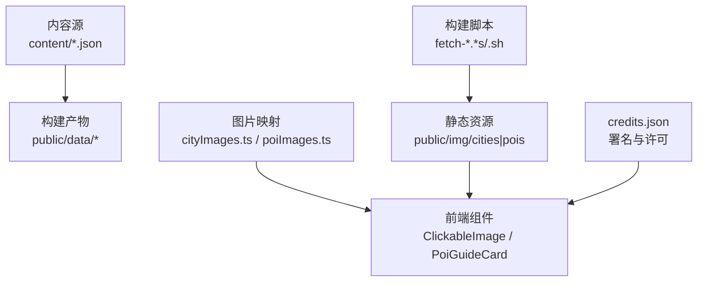
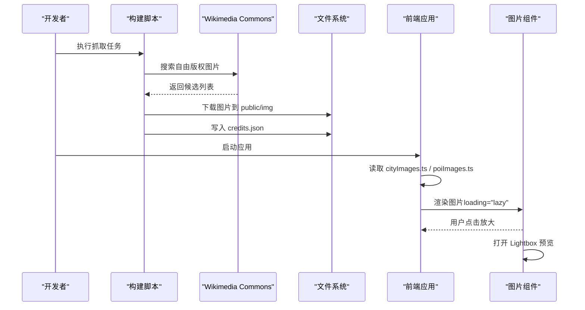
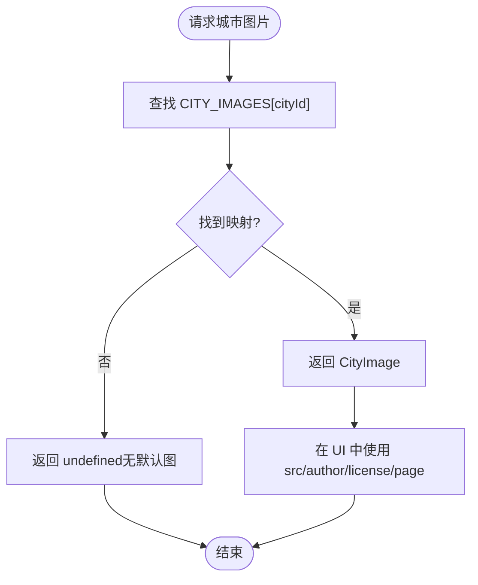
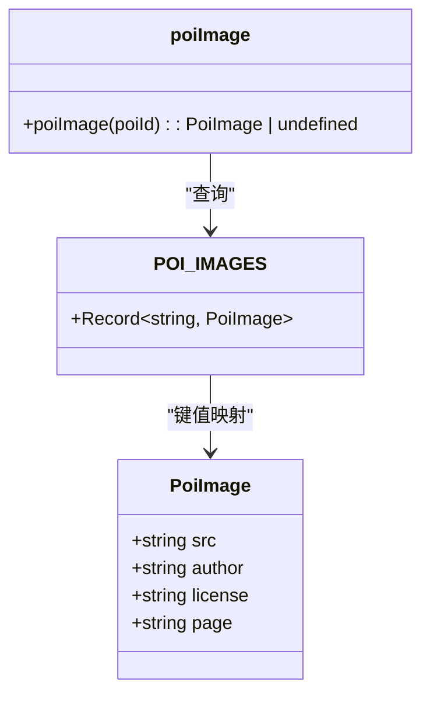
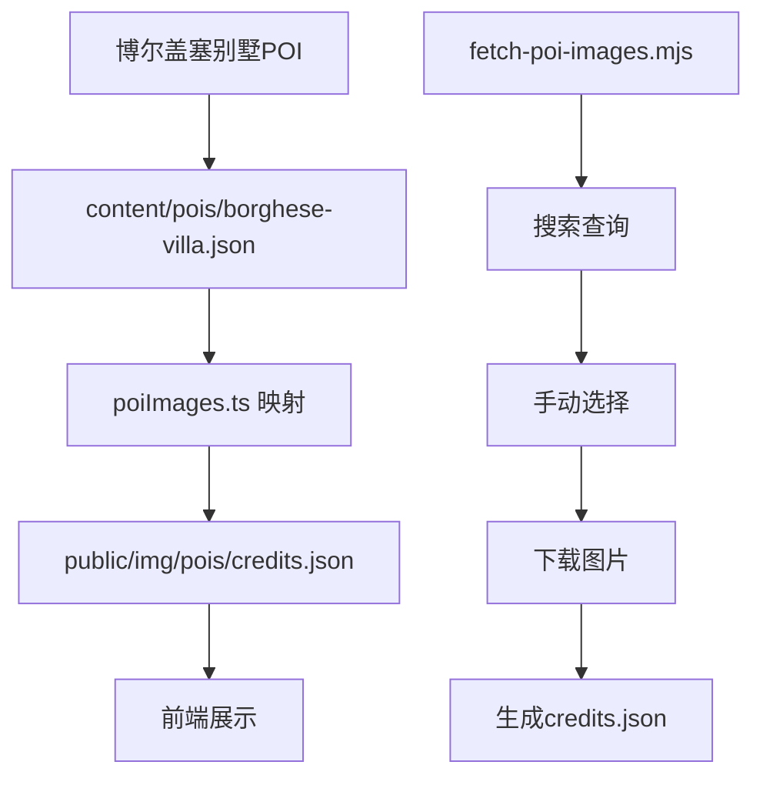
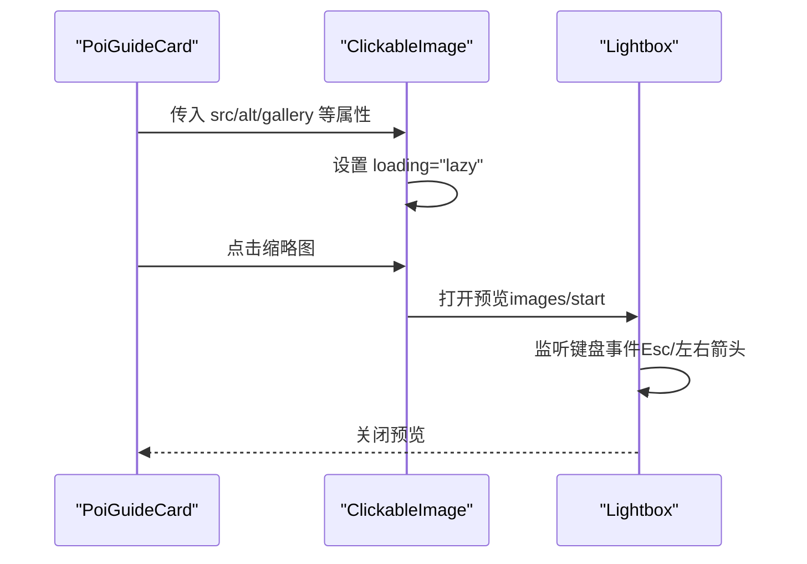
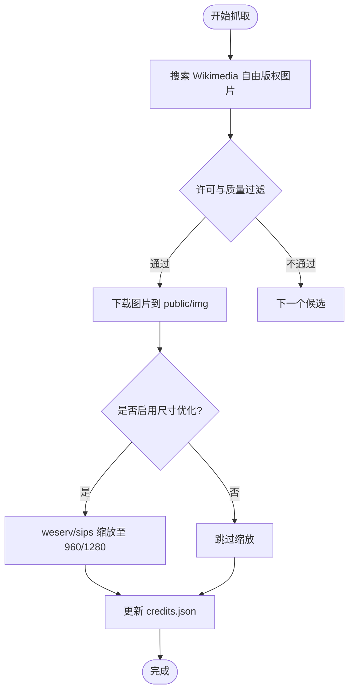
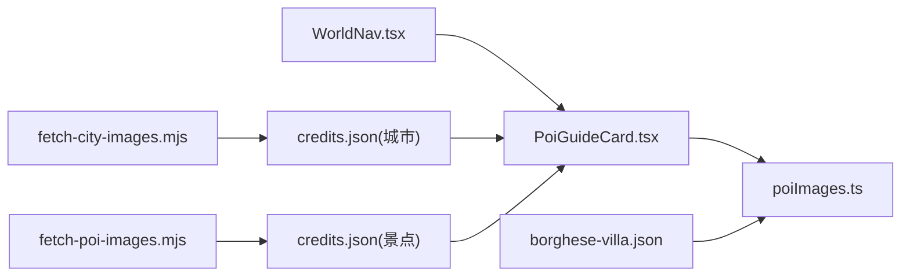

# 世界库图片管理

<cite>
**本文引用的文件**
- [cityImages.ts](file://src/features/world/cityImages.ts)
- [poiImages.ts](file://src/features/world/poiImages.ts)
- [ClickableImage.tsx](file://src/components/ClickableImage.tsx)
- [PoiGuideCard.tsx](file://src/features/world/PoiGuideCard.tsx)
- [fetch-city-images.mjs](file://scripts/fetch-city-images.mjs)
- [fetch-poi-images.mjs](file://scripts/fetch-poi-images.mjs)
- [fetch-new-images.mjs](file://scripts/fetch-new-images.mjs)
- [fetch-south-france-images.sh](file://scripts/fetch-south-france-images.sh)
- [credits.json（城市）](file://public/img/cities/credits.json)
- [credits.json（景点）](file://public/img/pois/credits.json)
- [WorldNav.tsx](file://src/features/world/WorldNav.tsx)
- [content/README.md](file://content/README.md)
- [borghese-villa.json](file://content/pois/borghese-villa.json)
</cite>

## 更新摘要
**变更内容**
- 为博尔盖塞别墅POI添加了完整的图片管理支持
- 在poiImages.ts中注册了新的POI图片映射
- 在credits.json中添加了博尔盖塞别墅的图片署名信息
- 在fetch-poi-images.mjs脚本中添加了搜索查询和手动选择逻辑
- 更新了罗马地区POI图片管理的最佳实践

## 目录
1. [简介](#简介)
2. [项目结构](#项目结构)
3. [核心组件](#核心组件)
4. [架构总览](#架构总览)
5. [详细组件分析](#详细组件分析)
6. [依赖关系分析](#依赖关系分析)
7. [性能与内存优化](#性能与内存优化)
8. [故障排查指南](#故障排查指南)
9. [结论](#结论)
10. [附录：扩展新图片类型](#附录：扩展新图片类型)

## 简介
本系统为"世界库"提供图片与缩略图管理能力，覆盖城市风景图与景点（POI）配图。其目标包括：
- 统一管理图片资源组织、懒加载策略与缓存机制
- 明确城市与景点图片的获取逻辑、默认图处理、格式转换与尺寸优化
- 设计网络异常时的错误处理与降级策略
- 提供可复用的图片展示组件与使用示例
- 给出性能优化建议与内存管理注意事项

## 项目结构
图片资源采用"前端静态映射 + 构建期脚本抓取 + 运行时懒加载"的分层设计：
- 运行时代码通过模块导出常量映射城市/景点 ID 到本地图片路径，并附带作者、许可、来源页等元数据
- 构建期脚本从 Wikimedia Commons 自动搜索、筛选自由版权图片，下载至 public/img/{cities|pois}，并维护 credits.json 署名信息
- 前端页面在渲染时按需懒加载图片，并提供点击放大预览能力

图表来源
- [cityImages.ts:14-124](file://src/features/world/cityImages.ts#L14-L124)
- [poiImages.ts:15-361](file://src/features/world/poiImages.ts#L15-L361)
- [ClickableImage.tsx:14-58](file://src/components/ClickableImage.tsx#L14-L58)
- [PoiGuideCard.tsx:51-80](file://src/features/world/PoiGuideCard.tsx#L51-L80)
- [fetch-city-images.mjs:114-158](file://scripts/fetch-city-images.mjs#L114-L158)
- [fetch-poi-images.mjs:194-234](file://scripts/fetch-poi-images.mjs#L194-L234)
- [credits.json（城市）:1-104](file://public/img/cities/credits.json#L1-L104)
- [credits.json（景点）:1-164](file://public/img/pois/credits.json#L1-L164)

章节来源
- [content/README.md:1-47](file://content/README.md#L1-L47)

## 核心组件
- 图片映射模块
  - 城市图片映射：定义城市 ID 到图片路径及元数据的键值表，并提供按 ID 查询函数
  - 景点图片映射：定义 POI ID 到图片路径及元数据的键值表，并提供按 ID 查询函数
- 图片展示组件
  - ClickableImage：支持懒加载、点击放大、多图画廊、键盘导航、来源署名显示
  - Lightbox：全屏预览容器，支持上一张/下一张切换、关闭、计数器
- 业务卡片集成
  - PoiGuideCard：在景点导览卡中展示封面图、作者署名、许可证与来源链接；点击封面触发 Lightbox 预览

章节来源
- [cityImages.ts:7-124](file://src/features/world/cityImages.ts#L7-L124)
- [poiImages.ts:8-361](file://src/features/world/poiImages.ts#L8-L361)
- [ClickableImage.tsx:5-147](file://src/components/ClickableImage.tsx#L5-L147)
- [PoiGuideCard.tsx:40-80](file://src/features/world/PoiGuideCard.tsx#L40-L80)

## 架构总览
整体流程分为"构建期资源生产"和"运行期资源消费"两部分：
- 构建期：脚本调用 Wikimedia API 搜索自由版权图片，下载并写入 public/img/{cities|pois}，同时更新 credits.json
- 运行期：前端通过 cityImages.ts / poiImages.ts 获取图片路径与元数据，使用 ClickableImage 进行懒加载与预览，PoiGuideCard 负责业务场景下的展示

图表来源
- [fetch-city-images.mjs:70-112](file://scripts/fetch-city-images.mjs#L70-L112)
- [fetch-poi-images.mjs:164-192](file://scripts/fetch-poi-images.mjs#L164-L192)
- [ClickableImage.tsx:42-58](file://src/components/ClickableImage.tsx#L42-L58)
- [PoiGuideCard.tsx:51-80](file://src/features/world/PoiGuideCard.tsx#L51-L80)

## 详细组件分析

### 城市图片映射与获取
- 数据结构：CityImage 包含 src、author、license、page
- 映射表：CITY_IMAGES 以城市 ID 为键，值为 CityImage
- 访问函数：cityImage(cityId) 返回对应图片或 undefined
- 资源位置：图片存放于 public/img/cities/{id}.jpg，署名信息在 public/img/cities/credits.json

图表来源
- [cityImages.ts:7-124](file://src/features/world/cityImages.ts#L7-L124)
- [credits.json（城市）:1-104](file://public/img/cities/credits.json#L1-L104)

章节来源
- [cityImages.ts:14-124](file://src/features/world/cityImages.ts#L14-L124)
- [public/img/cities/credits.json:1-104](file://public/img/cities/credits.json#L1-L104)

### 景点图片映射与获取
- 数据结构：PoiImage 包含 src、author、license、page
- 映射表：POI_IMAGES 以 POI ID 为键，值为 PoiImage
- 访问函数：poiImage(poiId) 返回对应图片或 undefined
- 资源位置：图片存放于 public/img/pois/{id}.jpg，署名信息在 public/img/pois/credits.json

**已更新** 新增了博尔盖塞别墅POI的图片映射支持

图表来源
- [poiImages.ts:8-361](file://src/features/world/poiImages.ts#L8-L361)
- [public/img/pois/credits.json:1-164](file://public/img/pois/credits.json#L1-L164)

章节来源
- [poiImages.ts:15-361](file://src/features/world/poiImages.ts#L15-L361)
- [public/img/pois/credits.json:1-164](file://public/img/pois/credits.json#L1-L164)

### 博尔盖塞别墅POI图片管理实现
**新增功能** 博尔盖塞别墅作为罗马地区的重要公园景点，已完整集成到图片管理系统中：

- **POI数据配置**：在 content/pois/borghese-villa.json 中定义了完整的景点信息，包括地理位置、游览指南、特色亮点等
- **图片映射注册**：在 poiImages.ts 中添加了 'poi-borghese-villa' 映射，指向 img/pois/poi-borghese-villa.jpg
- **署名信息管理**：在 credits.json 中记录了图片作者 Sailko、CC BY-SA 3.0 许可协议及 Wikimedia 来源页面
- **构建脚本支持**：在 fetch-poi-images.mjs 中添加了搜索查询关键词和手动选择配置

图表来源
- [borghese-villa.json:1-69](file://content/pois/borghese-villa.json#L1-L69)
- [poiImages.ts:84-90](file://src/features/world/poiImages.ts#L84-L90)
- [credits.json（景点）:80-85](file://public/img/pois/credits.json#L80-L85)
- [fetch-poi-images.mjs:57-58](file://scripts/fetch-poi-images.mjs#L57-L58)
- [fetch-poi-images.mjs:273-274](file://scripts/fetch-poi-images.mjs#L273-L274)

章节来源
- [borghese-villa.json:1-69](file://content/pois/borghese-villa.json#L1-L69)
- [poiImages.ts:84-90](file://src/features/world/poiImages.ts#L84-L90)
- [public/img/pois/credits.json:80-85](file://public/img/pois/credits.json#L80-L85)
- [fetch-poi-images.mjs:57-58](file://scripts/fetch-poi-images.mjs#L57-L58)
- [fetch-poi-images.mjs:273-274](file://scripts/fetch-poi-images.mjs#L273-L274)

### 图片展示与懒加载
- ClickableImage 使用 loading="lazy" 实现浏览器原生懒加载
- 点击缩略图打开 Lightbox 全屏预览，支持多图画廊与键盘导航
- 大图通过 createPortal 挂载到 document.body，避免层级问题
- 支持 caption、credit、license、page 等元数据展示

图表来源
- [ClickableImage.tsx:14-58](file://src/components/ClickableImage.tsx#L14-L58)
- [ClickableImage.tsx:61-147](file://src/components/ClickableImage.tsx#L61-L147)
- [PoiGuideCard.tsx:51-80](file://src/features/world/PoiGuideCard.tsx#L51-L80)

章节来源
- [ClickableImage.tsx:14-147](file://src/components/ClickableImage.tsx#L14-L147)
- [PoiGuideCard.tsx:51-80](file://src/features/world/PoiGuideCard.tsx#L51-L80)

### 构建期图片抓取与尺寸优化
- 城市图片抓取：
  - 通过 Wikimedia API 搜索自由版权图片，过滤 NC/ND 等限制
  - 选择高分辨率且允许再分发的图片，下载到 public/img/cities/{id}.jpg
  - 更新 credits.json 记录作者、许可、来源页
- 景点图片抓取：
  - 支持 search/download 两种模式
  - 优先使用 images.weserv.nl 服务端代理缩放（w=960），失败则直连原图兜底
  - 可选使用 sips 将最大边约束为 960px（macOS 环境）
- 新增图片抓取：
  - 统一入口 fetch-new-images.mjs，批量处理新增 POI/City
  - 合并 credits.json，记录新条目信息

**已更新** 博尔盖塞别墅的抓取流程遵循相同的标准化流程，支持多轮重试和网络异常处理

图表来源
- [fetch-city-images.mjs:70-158](file://scripts/fetch-city-images.mjs#L70-L158)
- [fetch-poi-images.mjs:104-155](file://scripts/fetch-poi-images.mjs#L104-L155)
- [fetch-new-images.mjs:125-179](file://scripts/fetch-new-images.mjs#L125-L179)
- [fetch-south-france-images.sh:35-63](file://scripts/fetch-south-france-images.sh#L35-L63)

章节来源
- [fetch-city-images.mjs:114-158](file://scripts/fetch-city-images.mjs#L114-L158)
- [fetch-poi-images.mjs:194-234](file://scripts/fetch-poi-images.mjs#L194-L234)
- [fetch-new-images.mjs:149-179](file://scripts/fetch-new-images.mjs#L149-L179)
- [fetch-south-france-images.sh:35-63](file://scripts/fetch-south-france-images.sh#L35-L63)

### 错误处理与降级策略
- 构建期网络异常：
  - 重试机制：多次尝试 curl 请求，间隔等待后重试
  - 代理兜底：当直连 Wikimedia 失败时，尝试公共 CORS 代理（如 allorigins.win）或 images.weserv.nl
  - 最小文件大小校验：防止下载损坏或空文件
- 运行期图片缺失：
  - 若 cityImage/poiImage 返回 undefined，UI 不渲染封面图（无默认图）
  - 建议在业务层提供占位图或提示文案，提升用户体验

**已更新** 博尔盖塞别墅的图片抓取过程同样具备完整的风控机制，确保在网络不稳定情况下仍能成功获取图片

章节来源
- [fetch-poi-images.mjs:81-115](file://scripts/fetch-poi-images.mjs#L81-L115)
- [fetch-new-images.mjs:71-86](file://scripts/fetch-new-images.mjs#L71-86)
- [cityImages.ts:122-124](file://src/features/world/cityImages.ts#L122-L124)
- [poiImages.ts:359-361](file://src/features/world/poiImages.ts#L359-L361)

## 依赖关系分析
- 前端组件依赖图片映射模块：
  - PoiGuideCard 依赖 poiImages.ts 获取景点图片
  - WorldNav 用于浏览与筛选景点，间接影响图片展示范围
- 构建脚本依赖 Wikimedia API：
  - 所有抓取脚本均调用 commons.wikimedia.org API
  - 部分脚本依赖外部工具（sips）进行本地缩放
- 资源文件依赖：
  - public/img/{cities|pois}/credits.json 为署名与许可信息的权威来源
  - 图片文件命名与映射保持一致，确保前端可正确加载

**已更新** 博尔盖塞别墅的依赖关系遵循标准模式，通过统一的映射机制集成到现有系统中

图表来源
- [PoiGuideCard.tsx:51-80](file://src/features/world/PoiGuideCard.tsx#L51-L80)
- [WorldNav.tsx:73-90](file://src/features/world/WorldNav.tsx#L73-L90)
- [fetch-city-images.mjs:114-158](file://scripts/fetch-city-images.mjs#L114-L158)
- [fetch-poi-images.mjs:194-234](file://scripts/fetch-poi-images.mjs#L194-L234)
- [borghese-villa.json:1-69](file://content/pois/borghese-villa.json#L1-L69)

章节来源
- [PoiGuideCard.tsx:51-80](file://src/features/world/PoiGuideCard.tsx#L51-L80)
- [WorldNav.tsx:73-90](file://src/features/world/WorldNav.tsx#L73-L90)
- [fetch-city-images.mjs:114-158](file://scripts/fetch-city-images.mjs#L114-L158)
- [fetch-poi-images.mjs:194-234](file://scripts/fetch-poi-images.mjs#L194-L234)

## 性能与内存优化
- 懒加载：
  - 使用 loading="lazy" 减少首屏图片加载压力
  - 仅在用户交互时加载大图（Lightbox）
- 尺寸优化：
  - 构建期将图片缩放至 960px 或 1280px，平衡清晰度与体积
  - 优先使用服务端缩放（images.weserv.nl），减少客户端计算
- 缓存策略：
  - 浏览器 HTTP 缓存由 CDN/服务器控制，建议设置合理的 Cache-Control
  - 图片文件名稳定，利于长期缓存命中
- 内存管理：
  - 避免一次性加载过多大图，按需加载
  - Lightbox 关闭时及时释放 DOM 引用，避免内存泄漏
- 网络优化：
  - 使用 HTTPS 与压缩传输
  - 合理设置超时与重试，避免长时间阻塞

## 故障排查指南
- 图片无法显示：
  - 检查映射是否正确：确认 cityImage/poiImage 返回有效路径
  - 检查文件是否存在：确认 public/img/{cities|pois}/{id}.jpg 存在
  - 检查 credits.json：确认署名信息与图片一致
- 构建脚本失败：
  - 网络问题：检查代理设置与网络连通性
  - 权限问题：确认对 public/img 目录有写权限
  - 工具依赖：确认 sips 可用（macOS）或跳过缩放步骤
- 图片质量不佳：
  - 调整搜索关键词，提高相关性评分
  - 增加分辨率阈值，过滤低质量图片
  - 手动修正：使用 fix-images.mjs 重新下载指定条目

**已更新** 针对博尔盖塞别墅等新增POI，建议定期检查图片文件的完整性和署名信息的准确性

章节来源
- [fetch-city-images.mjs:114-158](file://scripts/fetch-city-images.mjs#L114-L158)
- [fetch-poi-images.mjs:194-234](file://scripts/fetch-poi-images.mjs#L194-L234)
- [fetch-new-images.mjs:149-179](file://scripts/fetch-new-images.mjs#L149-L179)

## 结论
本系统通过"映射 + 脚本 + 组件"的分层设计，实现了城市与景点图片的统一管理。构建期脚本确保图片资源的合法性与质量，运行期组件提供高效的懒加载与预览体验。通过合理的错误处理与降级策略，系统在异常情况下仍能保持稳定。

**最新进展** 博尔盖塞别墅POI的成功集成证明了系统的可扩展性，为后续新增景点提供了标准化的工作流程。未来可扩展新的图片类型，只需遵循现有映射规范与脚本流程即可。

## 附录：扩展新图片类型
- 新增图片类型步骤：
  1. 定义新的映射模块（如 newTypeImages.ts），包含数据结构与映射表
  2. 创建对应的构建脚本（如 fetch-new-type-images.mjs），实现搜索、下载与 credits.json 更新
  3. 在前端组件中引入新映射模块，提供懒加载与预览功能
  4. 更新相关文档与测试用例
- 最佳实践：
  - 保持图片命名规范，便于管理与维护
  - 严格过滤许可协议，确保合规使用
  - 提供清晰的错误提示与降级方案，提升用户体验
- **博尔盖塞别墅案例参考**：
  - 在 poiImages.ts 中添加映射条目
  - 在 credits.json 中记录署名信息
  - 在 fetch-poi-images.mjs 中添加搜索查询和手动选择配置
  - 确保 content/pois/ 目录下有对应的POI数据文件

**章节来源**
- [poiImages.ts:84-90](file://src/features/world/poiImages.ts#L84-L90)
- [public/img/pois/credits.json:80-85](file://public/img/pois/credits.json#L80-L85)
- [fetch-poi-images.mjs:57-58](file://scripts/fetch-poi-images.mjs#L57-L58)
- [fetch-poi-images.mjs:273-274](file://scripts/fetch-poi-images.mjs#L273-L274)
- [borghese-villa.json:1-69](file://content/pois/borghese-villa.json#L1-L69)