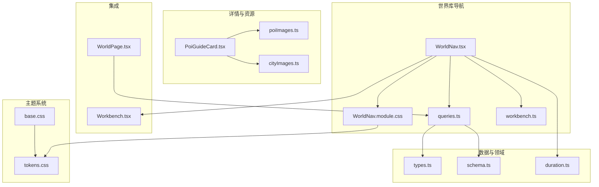
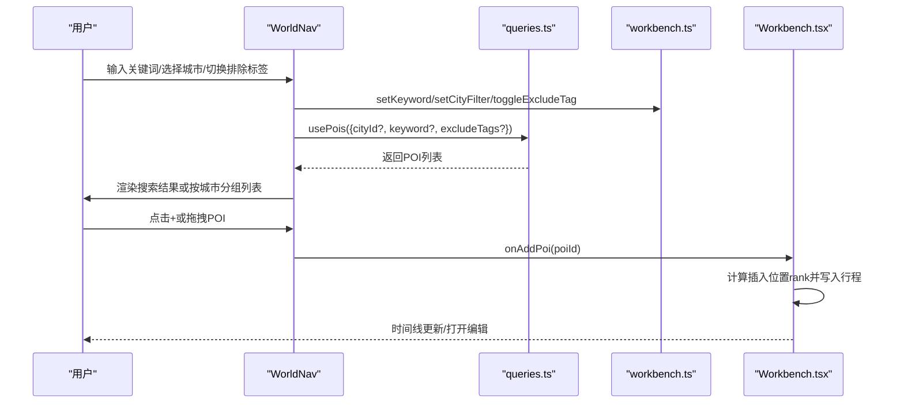
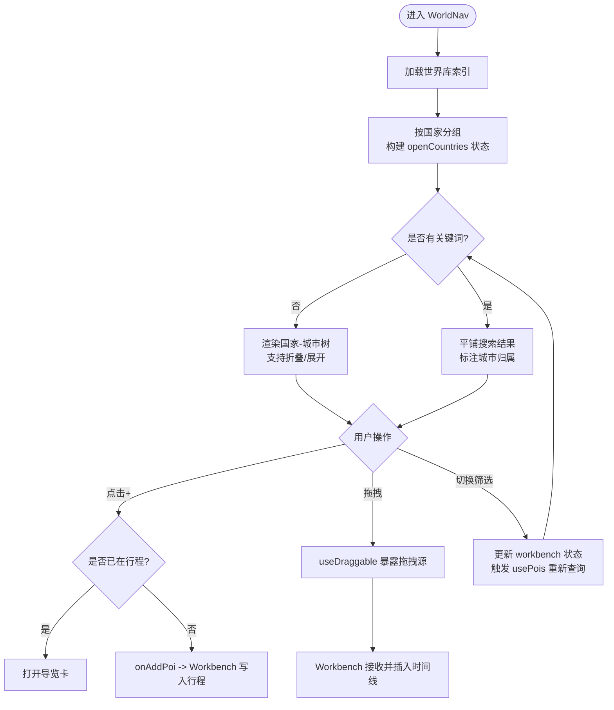
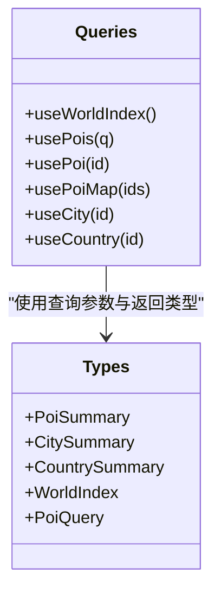
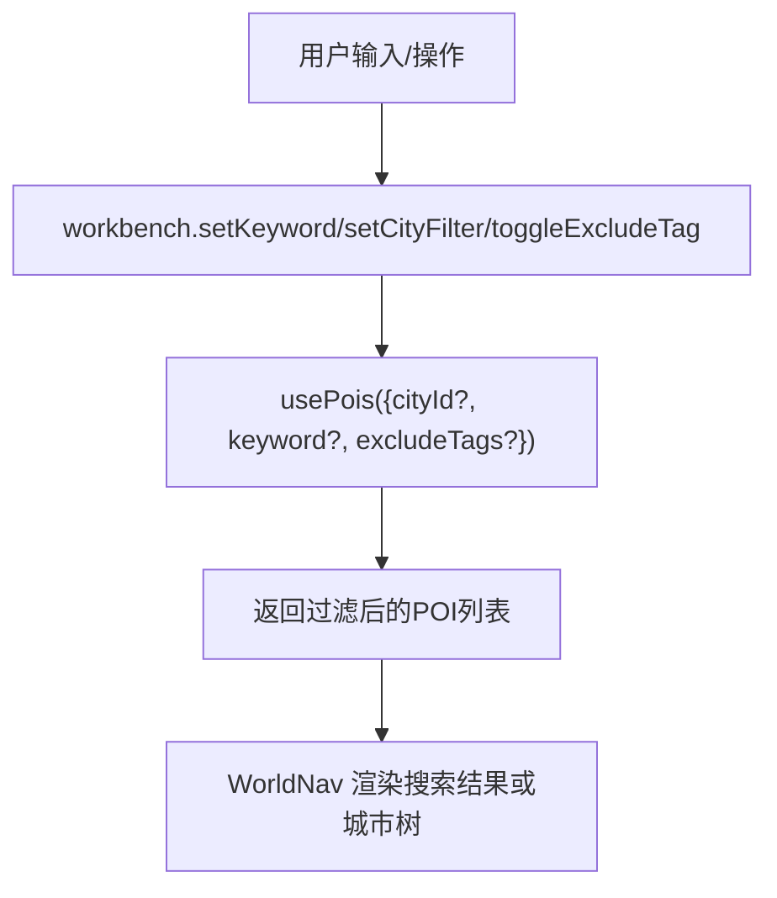
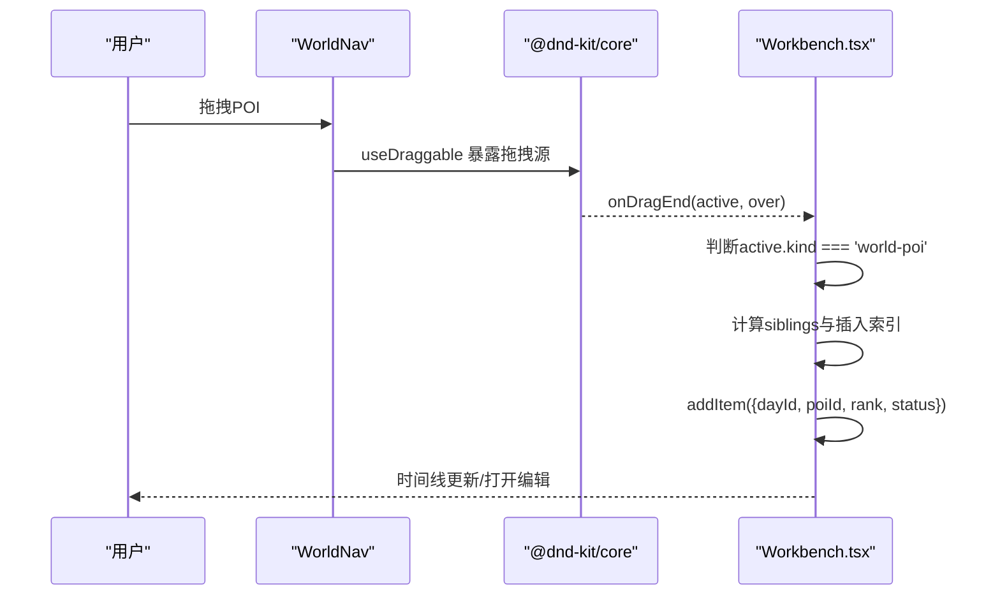
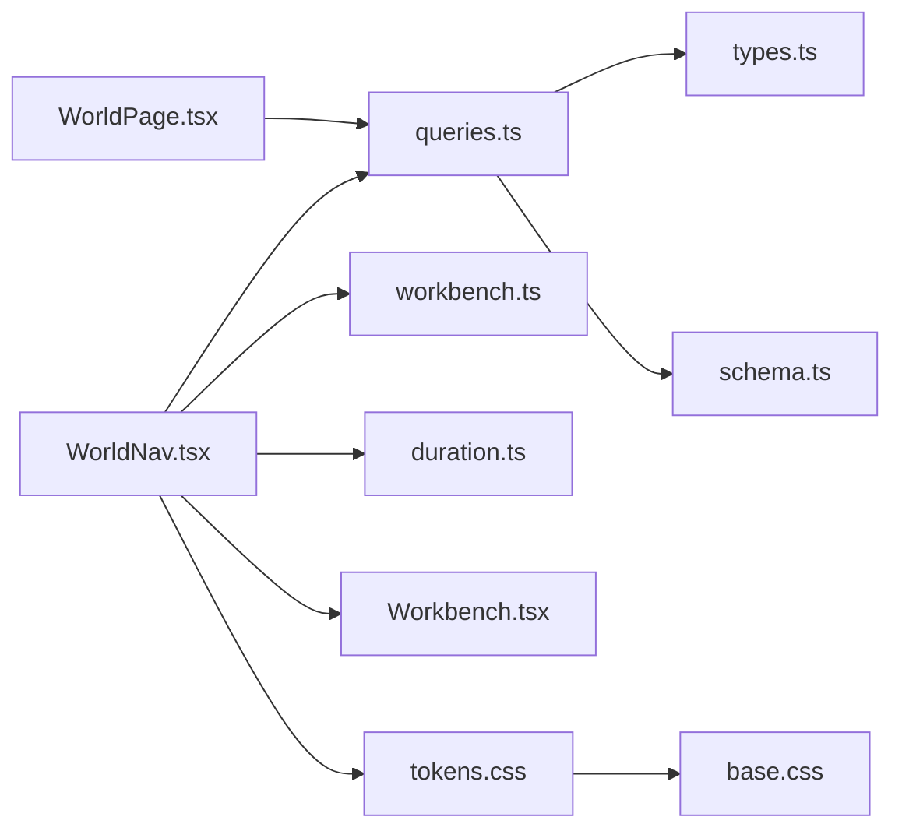

# 世界库导航组件

<cite>
**本文引用的文件**
- [WorldNav.tsx](file://src/features/world/WorldNav.tsx)
- [WorldNav.module.css](file://src/features/world/WorldNav.module.css)
- [queries.ts](file://src/features/world/queries.ts)
- [workbench.ts](file://src/store/workbench.ts)
- [types.ts](file://src/data/types.ts)
- [schema.ts](file://src/domain/world/schema.ts)
- [duration.ts](file://src/domain/world/duration.ts)
- [PoiGuideCard.tsx](file://src/features/world/PoiGuideCard.tsx)
- [poiImages.ts](file://src/features/world/poiImages.ts)
- [cityImages.ts](file://src/features/world/cityImages.ts)
- [Workbench.tsx](file://src/features/trip/Workbench.tsx)
- [WorldPage.tsx](file://src/pages/WorldPage.tsx)
- [tokens.css](file://src/ui/tokens.css)
- [base.css](file://src/ui/base.css)
</cite>

## 更新摘要
**变更内容**
- WorldNav组件的.wrap元素背景色从var(--bg)更新为var(--bg-sub)，采用新的米白背景系统
- 统一应用级主题系统，确保页面级视觉一致性
- 更新了CSS变量使用规范，遵循暖纸风格设计语言

## 目录
1. [简介](#简介)
2. [项目结构](#项目结构)
3. [核心组件](#核心组件)
4. [架构总览](#架构总览)
5. [详细组件分析](#详细组件分析)
6. [依赖关系分析](#依赖关系分析)
7. [性能考虑](#性能考虑)
8. [故障排查指南](#故障排查指南)
9. [结论](#结论)
10. [附录：使用示例与最佳实践](#附录使用示例与最佳实践)

## 简介
本文件为"世界库导航组件"（WorldNav）的完整技术文档。该组件提供国家-城市-景点的三层层级浏览、可折叠的国家节点管理、搜索与筛选（关键词、城市、标签排除），以及将景点拖拽到行程时间线的交互能力。同时，文档说明数据获取钩子 useWorldIndex 与 usePois 的使用方式、用户交互事件处理、性能优化建议与用户体验设计要点。

**更新** WorldNav组件已采用新的米白背景系统，通过var(--bg-sub)变量实现统一的页面级主题化，提升整体视觉一致性和用户体验。

## 项目结构
WorldNav 位于 features/world 下，围绕以下职责组织：
- 视图与交互：WorldNav.tsx 负责树形展示、筛选状态联动、搜索结果平铺、拖拽源配置。
- 样式：WorldNav.module.css 定义层级、筛选区、列表、拖拽态等视觉样式，现已采用统一的米白背景系统。
- 数据层：queries.ts 封装 React Query 钩子，统一读取静态世界库索引与 POI 列表；类型与查询参数来自 data/types.ts；领域模型与校验在 domain/world/schema.ts。
- 状态管理：store/workbench.ts 维护城市筛选、关键词、排除标签等全局工作区状态。
- 详情与配图：PoiGuideCard.tsx 提供深度导览卡片；poiImages.ts / cityImages.ts 提供自由版权图片映射。
- 集成点：Workbench.tsx 接收 WorldNav 的拖拽事件并写入行程条目；WorldPage.tsx 提供独立的世界库浏览页。

**图表来源**
- [WorldNav.tsx:1-266](file://src/features/world/WorldNav.tsx#L1-L266)
- [WorldNav.module.css:1-320](file://src/features/world/WorldNav.module.css#L1-L320)
- [queries.ts:1-62](file://src/features/world/queries.ts#L1-L62)
- [workbench.ts:1-77](file://src/store/workbench.ts#L1-L77)
- [tokens.css:1-78](file://src/ui/tokens.css#L1-L78)
- [base.css:1-149](file://src/ui/base.css#L1-L149)

**章节来源**
- [WorldNav.tsx:1-266](file://src/features/world/WorldNav.tsx#L1-L266)
- [WorldNav.module.css:1-320](file://src/features/world/WorldNav.module.css#L1-L320)
- [queries.ts:1-62](file://src/features/world/queries.ts#L1-L62)
- [workbench.ts:1-77](file://src/store/workbench.ts#L1-L77)
- [tokens.css:1-78](file://src/ui/tokens.css#L1-L78)
- [base.css:1-149](file://src/ui/base.css#L1-L149)

## 核心组件
- WorldNav：实现国家-城市-景点三层结构、搜索与筛选、拖拽源、已加入行程标记与快捷操作。
- PoiGuideCardView：景点深度导览卡片，展示时长、闭馆日、预约、推荐路线、亮点、设施等。
- queries：useWorldIndex/usePois/usePoi 等 React Query 钩子，封装静态世界库数据访问。
- workbench：全局工作区状态（城市筛选、关键词、排除标签等），持久化至 sessionStorage。
- duration：时长格式化，避免不自然的区间文案。
- 图片资源：poiImages.ts / cityImages.ts 提供自由版权图片映射与署名信息。

**更新** WorldNav组件现在使用统一的米白背景系统，通过var(--bg-sub)变量实现一致的页面级主题化效果。

**章节来源**
- [WorldNav.tsx:1-266](file://src/features/world/WorldNav.tsx#L1-L266)
- [WorldNav.module.css:1-320](file://src/features/world/WorldNav.module.css#L1-L320)
- [PoiGuideCard.tsx:1-309](file://src/features/world/PoiGuideCard.tsx#L1-L309)
- [queries.ts:1-62](file://src/features/world/queries.ts#L1-L62)
- [workbench.ts:1-77](file://src/store/workbench.ts#L1-L77)
- [duration.ts:1-24](file://src/domain/world/duration.ts#L1-L24)
- [tokens.css:1-78](file://src/ui/tokens.css#L1-L78)

## 架构总览
WorldNav 通过 useWorldIndex 获取国家-城市索引，按国家分组渲染可折叠节点；通过 usePois 根据城市筛选、关键词、排除标签拉取 POI 列表；点击或拖拽触发 onAddPoi/onInspectPoi 回调，由上层 Workbench 完成落库与时间线更新。

**图表来源**
- [WorldNav.tsx:82-131](file://src/features/world/WorldNav.tsx#L82-L131)
- [queries.ts:13-20](file://src/features/world/queries.ts#L13-L20)
- [workbench.ts:51-76](file://src/store/workbench.ts#L51-L76)
- [Workbench.tsx:154-205](file://src/features/trip/Workbench.tsx#L154-L205)

## 详细组件分析

### WorldNav 组件
- 三层层级与折叠：
  - 国家节点默认展开，支持一键全部展开/收起；选中某城市时自动展开其所属国家，确保可点击性。
  - 城市按钮用于筛选当前城市下的 POI；再次点击取消筛选。
- 搜索与筛选：
  - 关键词搜索时，跨城市平铺结果并在每个条目标注所属城市，降低定位成本。
  - 快速排除标签（如宗教场所、观景、雪山）通过 workbench 的 excludeTags 控制。
  - 城市筛选与关键词、排除标签共同作为 usePois 的查询条件。
- 拖拽功能：
  - 每个 POI 行通过 @dnd-kit/core 的 useDraggable 暴露拖拽源，携带 kind='world-poi' 与 poiId。
  - 拖入 Workbench 的时间线后，由 Workbench 计算 rank 并调用 addPoi 写入行程。
- 已加入行程：
  - 若 POI 已在行程中，点击 + 改为打开导览卡；列表显示"已加"角标，边框与背景色提示。
- 时长与闭馆信息：
  - 使用 formatDuration 将分钟区间转换为自然文案；显示周几闭馆与提前预约天数。

**更新** WorldNav组件的.wrap容器现在使用var(--bg-sub)米白色背景，与应用整体的暖纸风格主题保持一致，提供更好的视觉层次和阅读体验。

**图表来源**
- [WorldNav.tsx:92-131](file://src/features/world/WorldNav.tsx#L92-L131)
- [WorldNav.tsx:135-251](file://src/features/world/WorldNav.tsx#L135-L251)
- [Workbench.tsx:154-205](file://src/features/trip/Workbench.tsx#L154-L205)

**章节来源**
- [WorldNav.tsx:1-266](file://src/features/world/WorldNav.tsx#L1-L266)
- [WorldNav.module.css:1-320](file://src/features/world/WorldNav.module.css#L1-L320)

### 数据获取与查询钩子
- useWorldIndex：读取世界库索引（国家、城市、POI 摘要），用于分组与统计。
- usePois：根据查询参数（cityId、keyword、excludeTags、sort）拉取 POI 列表；静态内容设置永不过期缓存。
- usePoi/usePoiMap/useCity/useCountry：按需获取单条 POI、批量 POI、城市与国家详情。

**图表来源**
- [queries.ts:1-62](file://src/features/world/queries.ts#L1-L62)
- [types.ts:12-79](file://src/data/types.ts#L12-L79)

**章节来源**
- [queries.ts:1-62](file://src/features/world/queries.ts#L1-L62)
- [types.ts:12-79](file://src/data/types.ts#L12-L79)

### 状态管理与筛选逻辑
- workbench 状态：
  - selectedDate：当前选中的日期（用于时间线上下文）。
  - inspector：右栏详情面板的多态状态（none/poi/item/day）。
  - cityFilter：当前城市筛选。
  - keyword：搜索关键词。
  - excludeTags：排除标签数组。
  - showSanity：调试开关。
- 持久化：selectedDate、cityFilter、excludeTags 持久化到 sessionStorage，刷新页面保留上下文。
- 筛选组合：
  - 关键词搜索：usePois 传入 keyword，WorldNav 在搜索模式下平铺结果并标注城市。
  - 城市筛选：usePois 传入 cityId，WorldNav 在树模式下仅展示该城市的 POI。
  - 标签排除：excludeTags 传入 usePois，后端/适配器过滤对应标签的 POI。

**图表来源**
- [workbench.ts:51-76](file://src/store/workbench.ts#L51-L76)
- [WorldNav.tsx:82-90](file://src/features/world/WorldNav.tsx#L82-L90)

**章节来源**
- [workbench.ts:1-77](file://src/store/workbench.ts#L1-L77)
- [WorldNav.tsx:82-90](file://src/features/world/WorldNav.tsx#L82-L90)

### 拖拽到行程时间线
- 拖拽源：WorldNav 的每个 POI 行通过 useDraggable 暴露 id 与 data（kind='world-poi', poiId）。
- 拖拽目标：Workbench 的时间线区域识别 active.data.current.kind，当为 world-poi 时计算插入位置并调用 addPoi。
- 插入策略：
  - 落到天卡片空白处：追加到末尾。
  - 落到具体条目上：插在该条目之前。
  - 根据 siblings 与目标索引计算 rank，保证顺序稳定。

**图表来源**
- [WorldNav.tsx:14-30](file://src/features/world/WorldNav.tsx#L14-L30)
- [Workbench.tsx:154-205](file://src/features/trip/Workbench.tsx#L154-L205)

**章节来源**
- [WorldNav.tsx:14-30](file://src/features/world/WorldNav.tsx#L14-L30)
- [Workbench.tsx:154-205](file://src/features/trip/Workbench.tsx#L154-L205)

### 详情卡片与资源
- PoiGuideCardView：展示名称、本地名、标签、建议时长、闭馆日、最佳时段、预约信息、易变字段（票价/开放/预约）及其官方来源与核实时间、推荐路线、亮点、展陈结构、贴士、设施等。
- 图片资源：poiImages.ts 与 cityImages.ts 提供自由版权图片映射，包含作者、许可与来源页，满足合规署名要求。
- 时长格式化：formatDuration 将分钟区间转为自然文案，避免不合理的区间显示。

**章节来源**
- [PoiGuideCard.tsx:1-309](file://src/features/world/PoiGuideCard.tsx#L1-L309)
- [poiImages.ts:1-362](file://src/features/world/poiImages.ts#L1-L362)
- [cityImages.ts:1-125](file://src/features/world/cityImages.ts#L1-L125)
- [duration.ts:1-24](file://src/domain/world/duration.ts#L1-L24)

### 主题系统与视觉设计
**新增章节** WorldNav组件现已完全融入应用的统一主题系统，采用日式青瓷绿与暖纸风格的配色方案。

- 背景系统：
  - var(--bg-sub): #FCFAF2 - 整体页面底色，暖纸米白
  - var(--bg): #ffffff - 卡片/面板背景，白卡浮于米纸之上
  - var(--surface-2): #F7F3EA - 白卡内的嵌套面板，极淡暖米
- 文字系统：
  - var(--text-1): #2c332f - 主要文字颜色
  - var(--text-2): #626960 - 次要文字颜色  
  - var(--text-3): #949a90 - 辅助文字颜色
- 品牌色彩：
  - var(--brand): #305A56 - 日式青瓷绿主色
  - var(--brand-hover): #376B6D - 悬停状态
  - var(--brand-soft): rgba(48, 90, 86, 0.1) - 柔和强调
- 描边系统：
  - var(--line): #E4DDCC - 常规描边
  - var(--line-strong): #D2CAB6 - 强调描边

**更新** WorldNav的.wrap元素现在使用var(--bg-sub)米白色背景，与应用整体的暖纸风格保持一致，提供更好的视觉层次和阅读体验。

**章节来源**
- [tokens.css:1-78](file://src/ui/tokens.css#L1-L78)
- [base.css:1-149](file://src/ui/base.css#L1-L149)
- [WorldNav.module.css:1-320](file://src/features/world/WorldNav.module.css#L1-L320)

## 依赖关系分析
- WorldNav 依赖：
  - queries.ts：数据获取与缓存策略。
  - workbench.ts：筛选状态与持久化。
  - duration.ts：时长格式化。
  - @dnd-kit/core：拖拽能力。
- 数据层依赖：
  - types.ts：POI/City/Country/WorldIndex/PoiQuery 等类型定义。
  - schema.ts：领域模型与校验规则（如 POI 必填字段、易变字段时效检查）。
- 集成点：
  - Workbench.tsx：接收拖拽并写入行程。
  - WorldPage.tsx：独立世界库浏览页，复用 queries 与详情卡片。
- 主题依赖：
  - tokens.css：设计令牌与CSS变量定义。
  - base.css：基础样式与全局主题设置。

**图表来源**
- [WorldNav.tsx:1-266](file://src/features/world/WorldNav.tsx#L1-L266)
- [queries.ts:1-62](file://src/features/world/queries.ts#L1-L62)
- [types.ts:12-79](file://src/data/types.ts#L12-L79)
- [schema.ts:157-242](file://src/domain/world/schema.ts#L157-L242)
- [Workbench.tsx:154-205](file://src/features/trip/Workbench.tsx#L154-L205)
- [WorldPage.tsx:1-601](file://src/pages/WorldPage.tsx#L1-L601)
- [tokens.css:1-78](file://src/ui/tokens.css#L1-L78)
- [base.css:1-149](file://src/ui/base.css#L1-L149)

**章节来源**
- [WorldNav.tsx:1-266](file://src/features/world/WorldNav.tsx#L1-L266)
- [queries.ts:1-62](file://src/features/world/queries.ts#L1-L62)
- [types.ts:12-79](file://src/data/types.ts#L12-L79)
- [schema.ts:157-242](file://src/domain/world/schema.ts#L157-L242)
- [Workbench.tsx:154-205](file://src/features/trip/Workbench.tsx#L154-L205)
- [WorldPage.tsx:1-601](file://src/pages/WorldPage.tsx#L1-L601)
- [tokens.css:1-78](file://src/ui/tokens.css#L1-L78)
- [base.css:1-149](file://src/ui/base.css#L1-L149)

## 性能考虑
- 静态数据缓存：queries.ts 对世界库数据设置 staleTime/gcTime 为 Infinity，避免重复请求。
- 列表渲染优化：
  - 使用 useMemo 对 grouped 结果进行缓存，减少重渲染开销。
  - 搜索模式平铺结果时，仅渲染必要字段，避免冗余 DOM。
- 图片懒加载：PoiGuideCardView 与 WorldPage 中对图片使用 loading="lazy"，降低首屏压力。
- 筛选与查询：
  - 将筛选条件集中到 usePois 的查询参数，利用 React Query 的 key 去重与缓存。
  - 关键词与城市筛选组合时，尽量在上层聚合后再发起查询。
- 拖拽性能：
  - 使用 @dnd-kit/core 的轻量拖拽方案，避免自定义复杂拖拽逻辑。
  - 仅在必要时启用拖拽属性，减少事件监听开销。
- 主题性能：
  - CSS变量系统减少重复样式计算，提升渲染性能。
  - 统一的背景系统减少样式冲突和重绘开销。

**更新** 新的主题系统通过CSS变量实现了更好的性能优化，减少了样式计算和重绘开销。

## 故障排查指南
- 无匹配结果：
  - 检查关键词、城市筛选、排除标签是否正确设置。
  - 确认 usePois 的查询参数是否传递正确。
- 拖拽无效：
  - 确认 WorldNav 的 POI 行已绑定 useDraggable 且 data 中包含 kind 与 poiId。
  - 检查 Workbench 的 onDragEnd 是否能识别 active.kind === 'world-poi'。
- 详情卡片无法打开：
  - 确认 usePoi 的 id 有效且不为 null。
  - 检查 schema 校验是否通过，避免结构异常导致降级渲染。
- 时长显示异常：
  - 检查 POI 的 durationMinutes 是否为合法区间，并使用 formatDuration 格式化。
- 主题显示问题：
  - 确认CSS变量定义是否正确加载。
  - 检查浏览器是否支持CSS变量语法。
  - 验证主题变量值是否符合预期。

**更新** 新增了主题相关的故障排查指南，帮助解决CSS变量和主题系统的常见问题。

**章节来源**
- [WorldNav.tsx:82-90](file://src/features/world/WorldNav.tsx#L82-L90)
- [WorldNav.tsx:14-30](file://src/features/world/WorldNav.tsx#L14-L30)
- [PoiGuideCard.tsx:261-309](file://src/features/world/PoiGuideCard.tsx#L261-L309)
- [duration.ts:1-24](file://src/domain/world/duration.ts#L1-L24)
- [tokens.css:1-78](file://src/ui/tokens.css#L1-L78)

## 结论
WorldNav 以清晰的三层层级、灵活的筛选与搜索、稳定的拖拽体验为核心，结合 React Query 的静态数据缓存与 workbench 的全局状态管理，提供了高效、可扩展的世界库导航能力。配合 PoiGuideCard 的深度导览与合规的图片资源，既满足信息密度又兼顾用户体验。

**更新** 通过采用统一的米白背景系统和日式青瓷绿主题，WorldNav组件现在与应用的整体设计风格完美融合，提供了更加一致和优雅的视觉体验。建议在后续迭代中继续优化长列表渲染与筛选组合性能，并完善移动端适配。

## 附录：使用示例与最佳实践
- 使用 useWorldIndex 获取国家-城市索引：
  - 在 WorldNav 中用于分组与统计，也可在 WorldPage 中用于侧边栏展示。
- 使用 usePois 获取 POI 列表：
  - 传入 cityId、keyword、excludeTags、sort 等参数，获得过滤后的列表。
- 处理用户交互事件：
  - 点击 + 或拖拽 POI 时，调用 onAddPoi 将景点加入行程；若已存在则打开导览卡。
  - 切换城市筛选或关键词时，workbench 状态更新并触发 usePois 重新查询。
- 最佳实践：
  - 保持筛选条件最小化，避免过多组合导致查询复杂。
  - 合理使用 useMemo 与 React Query 缓存，减少不必要的重渲染。
  - 在移动端优先展示关键信息，简化交互路径。
  - 遵循主题系统规范，使用CSS变量而非硬编码颜色值。

**更新** 新增了主题系统使用的最佳实践，推荐使用CSS变量确保视觉一致性。

**章节来源**
- [WorldNav.tsx:82-131](file://src/features/world/WorldNav.tsx#L82-L131)
- [queries.ts:13-20](file://src/features/world/queries.ts#L13-L20)
- [workbench.ts:51-76](file://src/store/workbench.ts#L51-L76)
- [WorldPage.tsx:1-601](file://src/pages/WorldPage.tsx#L1-L601)
- [tokens.css:1-78](file://src/ui/tokens.css#L1-L78)