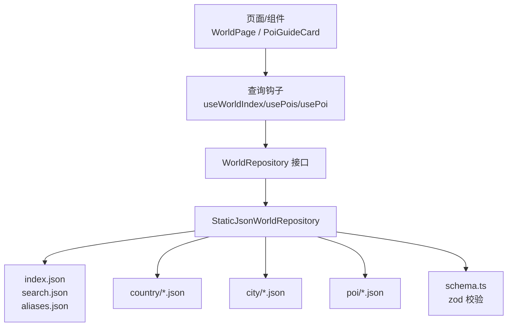
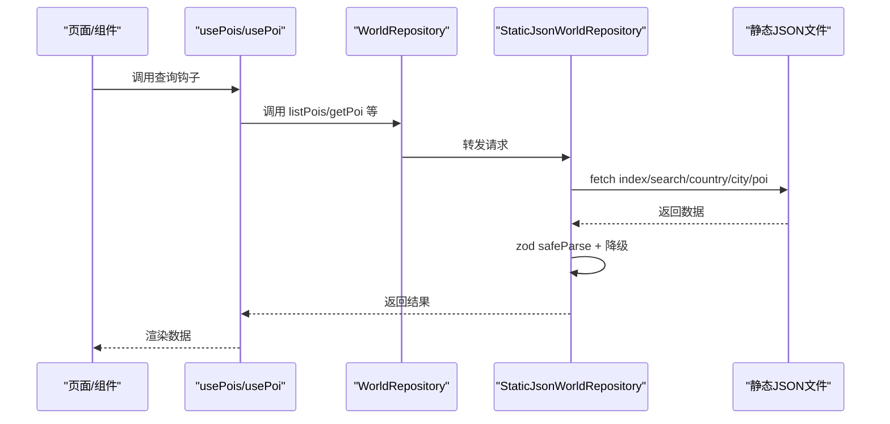
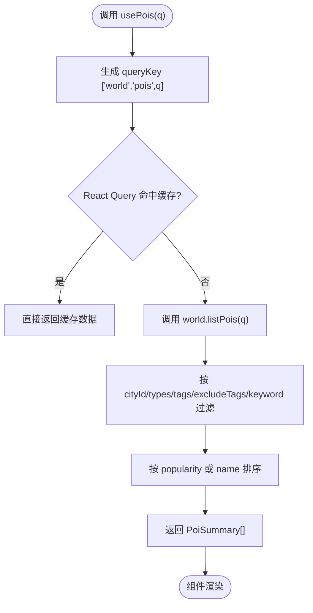
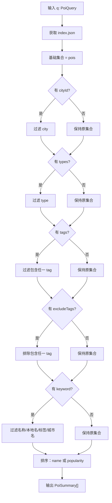
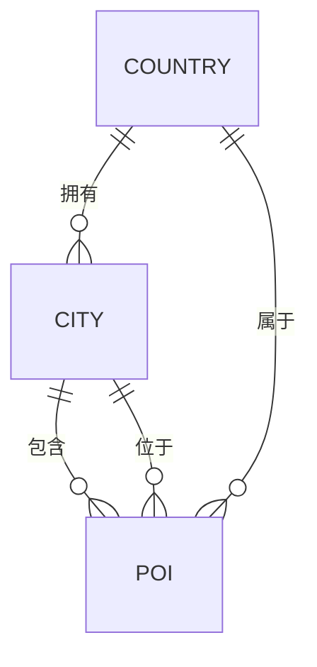
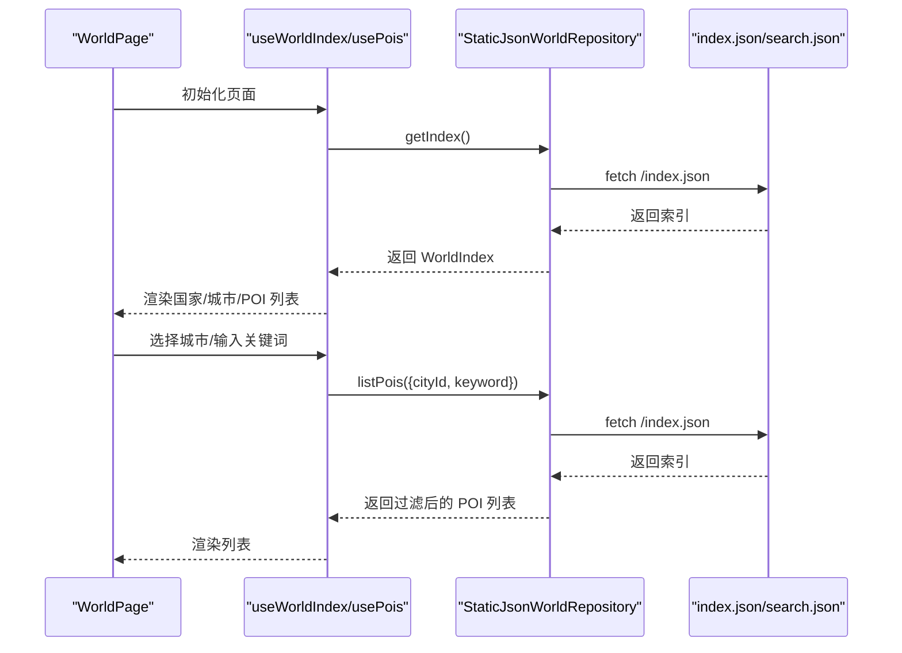
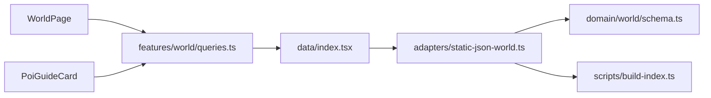

# 世界库数据查询

<cite>
**本文引用的文件**
- [src/features/world/queries.ts](file://src/features/world/queries.ts)
- [src/data/adapters/static-json-world.ts](file://src/data/adapters/static-json-world.ts)
- [src/domain/world/schema.ts](file://src/domain/world/schema.ts)
- [src/data/types.ts](file://src/data/types.ts)
- [scripts/build-index.ts](file://scripts/build-index.ts)
- [src/data/index.tsx](file://src/data/index.tsx)
- [src/pages/WorldPage.tsx](file://src/pages/WorldPage.tsx)
- [src/features/world/PoiGuideCard.tsx](file://src/features/world/PoiGuideCard.tsx)
</cite>

## 目录
1. [简介](#简介)
2. [项目结构](#项目结构)
3. [核心组件](#核心组件)
4. [架构总览](#架构总览)
5. [详细组件分析](#详细组件分析)
6. [依赖关系分析](#依赖关系分析)
7. [性能与缓存策略](#性能与缓存策略)
8. [故障排查指南](#故障排查指南)
9. [结论](#结论)
10. [附录：查询参数与使用示例](#附录：查询参数与使用示例)

## 简介
本文件面向“世界库数据查询层”，系统性说明数据查询钩子（useWorldIndex、usePois 等）的设计模式，阐述静态世界库索引的结构与组织方式（国家-城市-景点的层次与关联），解释搜索与过滤算法（关键词匹配、分类筛选、结果排序），并提供构建查询参数、处理异步数据与错误场景的实践建议。同时总结缓存策略、性能优化与错误处理的要点，帮助读者快速理解并高效使用该查询层。

## 项目结构
世界库查询层由三层构成：
- 数据适配层：StaticJsonWorldRepository 负责从静态 JSON 读取数据，提供统一的 WorldRepository 接口。
- 类型与 Schema 层：domain/world/schema.ts 定义国家、城市、POI 的数据结构与校验规则；data/types.ts 定义查询参数、摘要类型与仓库接口。
- 查询钩子层：features/world/queries.ts 基于 React Query 封装 useWorldIndex、usePois、usePoi 等 Hook，屏蔽底层实现细节。



图表来源
- [src/features/world/queries.ts:8-61](file://src/features/world/queries.ts#L8-L61)
- [src/data/adapters/static-json-world.ts:48-166](file://src/data/adapters/static-json-world.ts#L48-L166)
- [src/domain/world/schema.ts:58-218](file://src/domain/world/schema.ts#L58-L218)
- [scripts/build-index.ts:45-116](file://scripts/build-index.ts#L45-L116)

章节来源
- [src/features/world/queries.ts:1-61](file://src/features/world/queries.ts#L1-L61)
- [src/data/adapters/static-json-world.ts:1-166](file://src/data/adapters/static-json-world.ts#L1-L166)
- [src/domain/world/schema.ts:1-317](file://src/domain/world/schema.ts#L1-L317)
- [src/data/types.ts:1-79](file://src/data/types.ts#L1-L79)
- [scripts/build-index.ts:1-120](file://scripts/build-index.ts#L1-L120)

## 核心组件
- 查询钩子
  - useWorldIndex：获取全局索引（国家、城市摘要、POI 摘要）。
  - usePois：按条件查询 POI 列表（支持城市、类型、标签、排除标签、关键词、排序）。
  - usePoi：根据 ID 获取单个 POI 详情，含别名重定向。
  - usePoiMap：批量获取多个 POI 详情，返回 id→对象映射。
  - useCity / useCountry：按 ID 获取城市/国家详情。
- 数据适配器
  - StaticJsonWorldRepository：实现 WorldRepository，提供内存级 memo 缓存、安全解析与降级、搜索与别名重定向。
- 类型与 Schema
  - schema.ts：使用 zod 定义国家、城市、POI 的结构与业务规则校验。
  - types.ts：定义查询参数、摘要类型、仓库接口等。

章节来源
- [src/features/world/queries.ts:8-61](file://src/features/world/queries.ts#L8-L61)
- [src/data/adapters/static-json-world.ts:48-166](file://src/data/adapters/static-json-world.ts#L48-L166)
- [src/domain/world/schema.ts:58-218](file://src/domain/world/schema.ts#L58-L218)
- [src/data/types.ts:12-79](file://src/data/types.ts#L12-L79)

## 架构总览
世界库为静态内容，运行时通过 fetch 加载构建产物（public/data/*）。查询层采用“React Query + Repository 抽象”的模式：
- 视图层只依赖 hooks，不感知数据来源。
- Repository 统一接口，当前实现为静态 JSON，未来可替换为 Supabase 或其他后端。
- 所有查询均配置 staleTime/gcTime 为 Infinity，因为静态内容版本变更由构建产物与服务端缓存控制。



图表来源
- [src/features/world/queries.ts:8-61](file://src/features/world/queries.ts#L8-L61)
- [src/data/adapters/static-json-world.ts:21-76](file://src/data/adapters/static-json-world.ts#L21-L76)
- [src/data/adapters/static-json-world.ts:78-166](file://src/data/adapters/static-json-world.ts#L78-L166)

## 详细组件分析

### 查询钩子设计模式（useWorldIndex、usePois）
- 设计要点
  - 每个 Hook 对应一个稳定的 queryKey，确保 React Query 能正确去重与缓存。
  - 世界库为静态资源，设置 staleTime/gcTime 为 Infinity，避免重复请求。
  - 对可选参数（如 id）使用 enabled 控制是否发起请求。
- 关键行为
  - useWorldIndex：拉取 index.json，包含国家、城市、POI 摘要。
  - usePois：传入 PoiQuery，内部调用 world.listPois(q)。
  - usePoi：传入 poiId，内部调用 world.getPoi(id)，支持别名重定向。
  - usePoiMap：批量拉取 POI，返回 id→对象的映射，queryKey 基于排序后的 ids 生成稳定键。



图表来源
- [src/features/world/queries.ts:13-20](file://src/features/world/queries.ts#L13-L20)
- [src/data/adapters/static-json-world.ts:100-127](file://src/data/adapters/static-json-world.ts#L100-L127)

章节来源
- [src/features/world/queries.ts:8-61](file://src/features/world/queries.ts#L8-L61)

### 世界库索引结构与数据组织
- 索引文件（index.json）
  - generatedAt：构建时间戳。
  - countries：国家摘要数组（id、name、localName、currency、hasVisa）。
  - cities：城市摘要数组（id、name、localName、country、location、poiCount、hasSurvival）。
  - pois：POI 摘要数组（id、type、name、localName、city、country、location、tags、popularity、closedWeekdays、hasGuide、durationMinutes、bookingLeadDays）。
- 构建过程（build-index.ts）
  - 从 content/ 源数据生成 public/data/*。
  - 剥离编著期字段（_todo/_sources），仅保留运行时所需字段。
  - 生成 search.json（轻量搜索记录）、aliases.json（旧 id→新 id 映射）。

```mermaid
classDiagram
class WorldIndex {
+string generatedAt
+CountrySummary[] countries
+CitySummary[] cities
+PoiSummary[] pois
}
class CountrySummary {
+string id
+string name
+string localName
+string currency
+boolean hasVisa
}
class CitySummary {
+string id
+string name
+string localName
+string country
+{lat : number;lng : number} location
+number poiCount
+boolean hasSurvival
}
class PoiSummary {
+string id
+string type
+string name
+string localName
+string city
+string country
+{lat : number;lng : number} location
+string[] tags
+number popularity
+number[] closedWeekdays
+boolean hasGuide
+[number,number] durationMinutes
+number|null bookingLeadDays
}
WorldIndex --> CountrySummary : "包含"
WorldIndex --> CitySummary : "包含"
WorldIndex --> PoiSummary : "包含"
```

图表来源
- [src/data/types.ts:46-51](file://src/data/types.ts#L46-L51)
- [scripts/build-index.ts:67-89](file://scripts/build-index.ts#L67-L89)

章节来源
- [src/data/types.ts:46-51](file://src/data/types.ts#L46-L51)
- [scripts/build-index.ts:45-116](file://scripts/build-index.ts#L45-L116)

### 搜索与过滤算法
- 关键词匹配
  - 在 listPois 中，若提供 keyword，则对 POI 名称、本地名、标签以及所属城市的名称/本地名进行小写包含匹配。
  - 在 search 中，使用预构建的 search.json 文本字段进行小写包含匹配，并限制最多返回 20 条。
- 分类筛选
  - cityId：限定城市。
  - types：限定 POI 类型。
  - tags：包含任意指定标签。
  - excludeTags：排除包含任一指定标签的 POI。
- 结果排序
  - sort === 'name'：按中文 locale 比较排序。
  - 默认：按 popularity 降序。



图表来源
- [src/data/adapters/static-json-world.ts:100-127](file://src/data/adapters/static-json-world.ts#L100-L127)
- [src/data/adapters/static-json-world.ts:149-165](file://src/data/adapters/static-json-world.ts#L149-L165)

章节来源
- [src/data/adapters/static-json-world.ts:100-127](file://src/data/adapters/static-json-world.ts#L100-L127)
- [src/data/adapters/static-json-world.ts:149-165](file://src/data/adapters/static-json-world.ts#L149-L165)

### 数据模型与关联关系
- 国家（Country）
  - 标识：ISO 3166-1 alpha-2 小写 id。
  - 信息：名称、本地名、货币、语言、时区、插头类型、紧急电话、小费提示、签证信息等。
- 城市（City）
  - 标识：city-xxx 格式。
  - 归属：country 引用国家 id。
  - 信息：名称、本地名、坐标、时区、生存主题、交通通票等。
- 景点（POI）
  - 标识：poi-xxx 格式。
  - 归属：city 引用城市 id，country 引用国家 id。
  - 信息：类型、名称、本地名、坐标、标签、热度、开放时间、预约要求、设施、导览、图片等。
- 别名重定向
  - aliases.json 维护旧 id → 新 id 映射，getPoi 会先尝试直接加载，失败后走别名重定向，保证老行程不断链。



图表来源
- [src/domain/world/schema.ts:58-103](file://src/domain/world/schema.ts#L58-L103)
- [src/domain/world/schema.ts:157-218](file://src/domain/world/schema.ts#L157-L218)
- [src/data/adapters/static-json-world.ts:129-137](file://src/data/adapters/static-json-world.ts#L129-L137)

章节来源
- [src/domain/world/schema.ts:58-218](file://src/domain/world/schema.ts#L58-L218)
- [src/data/adapters/static-json-world.ts:129-137](file://src/data/adapters/static-json-world.ts#L129-L137)

### 查询钩子在页面中的使用
- WorldPage
  - 使用 useWorldIndex 获取国家与城市分组。
  - 使用 usePois 按城市与关键词过滤，并按热度排序。
  - 使用 usePoi 展示选中 POI 的详细导览卡片。
- PoiGuideCard
  - 使用 usePoi 获取 POI 详情，并在缺失或结构异常时降级显示友好文案。



图表来源
- [src/pages/WorldPage.tsx:58-76](file://src/pages/WorldPage.tsx#L58-L76)
- [src/features/world/queries.ts:8-20](file://src/features/world/queries.ts#L8-L20)
- [src/data/adapters/static-json-world.ts:78-127](file://src/data/adapters/static-json-world.ts#L78-L127)

章节来源
- [src/pages/WorldPage.tsx:58-76](file://src/pages/WorldPage.tsx#L58-L76)
- [src/features/world/queries.ts:8-20](file://src/features/world/queries.ts#L8-L20)

## 依赖关系分析
- 组件到钩子
  - WorldPage 依赖 useWorldIndex、usePois、usePoi。
  - PoiGuideCard 依赖 usePoi。
- 钩子到仓库
  - 所有查询钩子通过 useWorld 注入 WorldRepository 实例。
- 仓库到数据源
  - StaticJsonWorldRepository 依赖 schema.ts 做运行时校验，依赖 build-index.ts 产出的静态 JSON。



图表来源
- [src/pages/WorldPage.tsx:1-14](file://src/pages/WorldPage.tsx#L1-L14)
- [src/features/world/PoiGuideCard.tsx:1-11](file://src/features/world/PoiGuideCard.tsx#L1-L11)
- [src/features/world/queries.ts:1-61](file://src/features/world/queries.ts#L1-L61)
- [src/data/index.tsx:1-57](file://src/data/index.tsx#L1-L57)
- [src/data/adapters/static-json-world.ts:1-166](file://src/data/adapters/static-json-world.ts#L1-L166)
- [src/domain/world/schema.ts:1-317](file://src/domain/world/schema.ts#L1-L317)
- [scripts/build-index.ts:1-120](file://scripts/build-index.ts#L1-L120)

章节来源
- [src/features/world/queries.ts:1-61](file://src/features/world/queries.ts#L1-L61)
- [src/data/index.tsx:1-57](file://src/data/index.tsx#L1-L57)
- [src/data/adapters/static-json-world.ts:1-166](file://src/data/adapters/static-json-world.ts#L1-L166)

## 性能与缓存策略
- 内存级 memo 缓存
  - 对 getJson 的结果使用 memo 包装，相同 key 的请求复用 Promise，减少重复网络开销。
- React Query 缓存
  - 世界库为静态内容，设置 staleTime/gcTime 为 Infinity，避免过期与重复请求。
- 构建产物优化
  - index.json 聚合国家、城市、POI 摘要，一次请求即可满足导航需求。
  - search.json 提供轻量搜索索引，避免全量扫描。
- 批量请求
  - getPois 使用 Promise.all 并发拉取，提升批量加载性能。
- 降级与容错
  - 单个 POI 结构异常时 safeParse 失败返回 null，UI 显示友好降级文案，不会白屏。

章节来源
- [src/data/adapters/static-json-world.ts:21-39](file://src/data/adapters/static-json-world.ts#L21-L39)
- [src/features/world/queries.ts:5-6](file://src/features/world/queries.ts#L5-L6)
- [scripts/build-index.ts:67-116](file://scripts/build-index.ts#L67-L116)
- [src/data/adapters/static-json-world.ts:139-147](file://src/data/adapters/static-json-world.ts#L139-L147)

## 故障排查指南
- 常见错误
  - 资源缺失：fetch 返回非 ok 状态，抛出“世界库资源缺失”错误，需执行构建命令生成 public/data/*。
  - 结构异常：safeParse 失败，控制台输出前 3 条 issues，并降级返回 null。
  - 别名未生效：确认 aliases.json 是否存在且包含旧 id 映射。
- 定位步骤
  - 检查浏览器网络面板是否成功加载 index.json、search.json、aliases.json。
  - 查看控制台是否有 safeParse 警告与具体字段问题。
  - 验证 build-index.ts 是否正确生成摘要与搜索索引。
- 恢复措施
  - 重新运行构建脚本，确保 public/data/* 最新。
  - 修正 content/ 下的源数据，确保符合 schema 约束。
  - 更新 aliases.json 以兼容旧链接。

章节来源
- [src/data/adapters/static-json-world.ts:21-25](file://src/data/adapters/static-json-world.ts#L21-L25)
- [src/data/adapters/static-json-world.ts:67-76](file://src/data/adapters/static-json-world.ts#L67-L76)
- [scripts/build-index.ts:45-51](file://scripts/build-index.ts#L45-L51)

## 结论
世界库数据查询层通过“React Query + Repository 抽象 + 静态 JSON”的组合，实现了高性能、易扩展、强容错的查询能力。查询钩子屏蔽了底层实现，使页面代码简洁清晰；Schema 与构建脚本保证了数据质量与一致性；搜索与过滤算法兼顾灵活性与性能。建议在新增功能时遵循现有模式：明确查询参数、利用索引与搜索文件、合理设置缓存与降级策略。

## 附录：查询参数与使用示例
- 查询参数（PoiQuery）
  - cityId：限定城市。
  - types：限定类型数组。
  - tags：包含标签数组。
  - excludeTags：排除标签数组。
  - keyword：关键词（小写包含匹配）。
  - sort：'popularity' 或 'name'。
- 使用示例（路径引用）
  - 构建查询参数并调用 usePois：参考 [src/pages/WorldPage.tsx:68-72](file://src/pages/WorldPage.tsx#L68-L72)。
  - 获取世界索引：参考 [src/pages/WorldPage.tsx:62](file://src/pages/WorldPage.tsx#L62)。
  - 获取单个 POI：参考 [src/features/world/PoiGuideCard.tsx:277](file://src/features/world/PoiGuideCard.tsx#L277)。
  - 批量获取 POI：参考 [src/features/world/queries.ts:32-41](file://src/features/world/queries.ts#L32-L41)。
- 异步与错误处理
  - 使用 React Query 的 isLoading、data 判断加载态与数据。
  - 当 POI 不存在或结构异常时，组件显示降级文案，参考 [src/features/world/PoiGuideCard.tsx:279-280](file://src/features/world/PoiGuideCard.tsx#L279-L280)。
  - 资源缺失时抛出错误，需在构建阶段生成数据，参考 [src/data/adapters/static-json-world.ts:21-25](file://src/data/adapters/static-json-world.ts#L21-L25)。