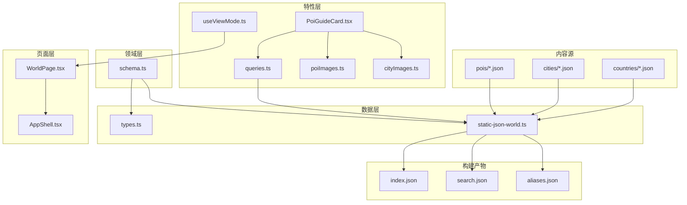
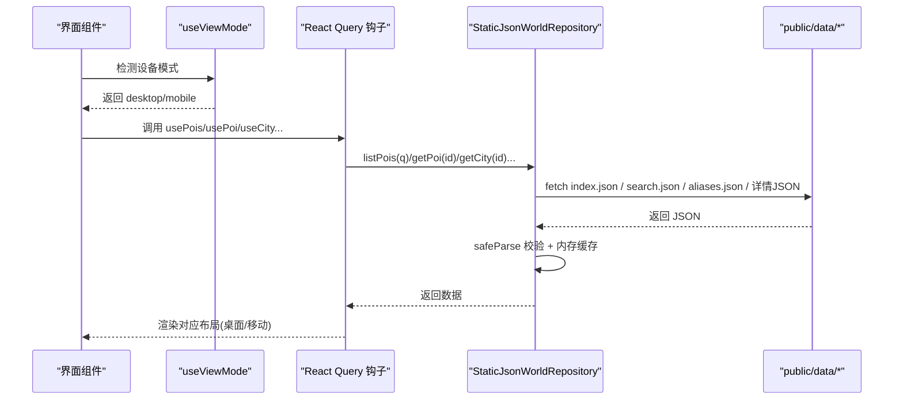
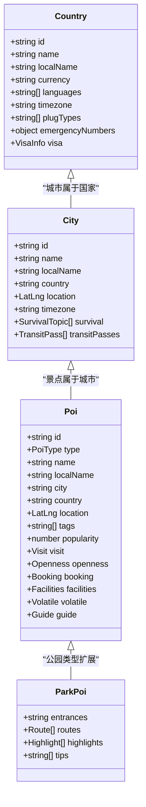
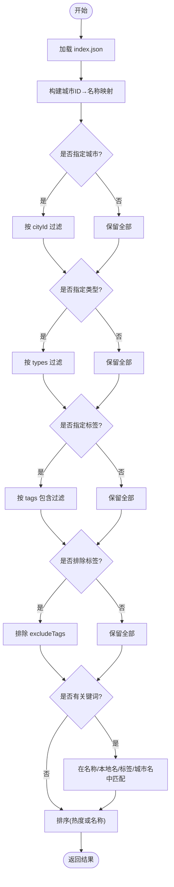
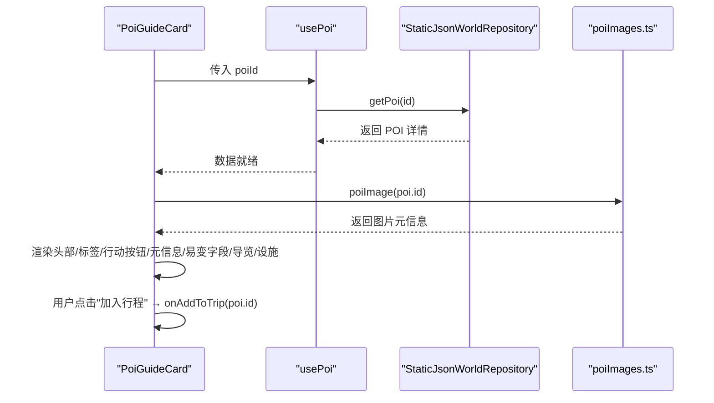
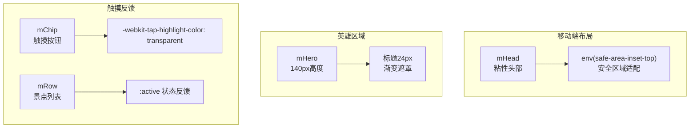
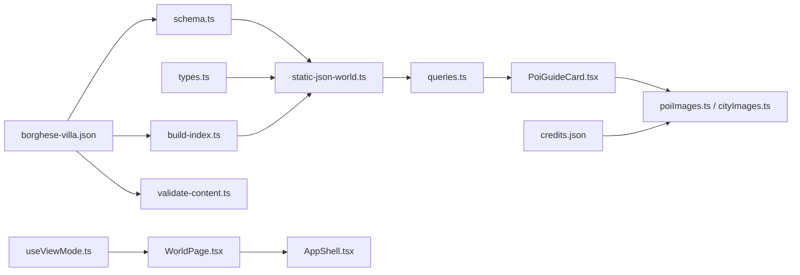

# 世界库浏览模块

<cite>
**本文引用的文件**
- [schema.ts](file://src/domain/world/schema.ts)
- [static-json-world.ts](file://src/data/adapters/static-json-world.ts)
- [queries.ts](file://src/features/world/queries.ts)
- [PoiGuideCard.tsx](file://src/features/world/PoiGuideCard.tsx)
- [poiImages.ts](file://src/features/world/poiImages.ts)
- [cityImages.ts](file://src/features/world/cityImages.ts)
- [types.ts](file://src/data/types.ts)
- [build-index.ts](file://scripts/build-index.ts)
- [validate-content.ts](file://scripts/validate-content.ts)
- [WorldPage.tsx](file://src/pages/WorldPage.tsx)
- [WorldPage.module.css](file://src/pages/WorldPage.module.css)
- [PoiGuideCard.module.css](file://src/features/world/PoiGuideCard.module.css)
- [useViewMode.ts](file://src/hooks/useViewMode.ts)
- [AppShell.tsx](file://src/app/AppShell.tsx)
- [ch.json](file://content/countries/ch.json)
- [paris.json](file://content/cities/paris.json)
- [rome.json](file://content/cities/rome.json)
- [eiffel-tower.json](file://content/pois/eiffel-tower.json)
- [borghese-villa.json](file://content/pois/borghese-villa.json)
- [credits.json](file://public/img/pois/credits.json)
- [README.md](file://content/README.md)
</cite>

## 更新摘要
**变更内容**
- 新增了罗马博尔盖塞别墅公园(Villa Borghese)作为新的POI条目，包含68行结构化信息
- 更新了POI类型支持，展示公园类型的完整数据结构
- 增强了导览卡功能，支持公园类景点的详细展示
- 完善了搜索和过滤机制，涵盖公园类POI的查询能力
- **新增移动端优化**：实现了更高的英雄区域、改进的景点列表触摸反馈和安全区域适配

## 目录
1. [简介](#简介)
2. [项目结构](#项目结构)
3. [核心组件](#核心组件)
4. [架构总览](#架构总览)
5. [详细组件分析](#详细组件分析)
6. [依赖关系分析](#依赖关系分析)
7. [性能与缓存策略](#性能与缓存策略)
8. [故障排查指南](#故障排查指南)
9. [结论](#结论)
10. [附录：查询与交互示例](#附录：查询与交互示例)

## 简介
本模块提供"世界库"的浏览能力，覆盖国家、城市、景点（POI）三层数据模型与索引机制；实现关键词搜索、分类筛选与地图集成；并展示景点导览卡（图片加载、基本信息、加入行程）。数据来源于构建期生成的静态 JSON，运行时通过适配器读取，具备强类型校验与容错降级。

**最新更新**：新增了罗马博尔盖塞别墅公园(Villa Borghese)作为公园类型POI的完整示例，展示了系统对不同类型景点的支持能力，包括详细的游客指南、设施信息和游览路线规划。**同时完成了移动端优化**，包括更高的英雄区域、改进的景点列表触摸反馈和安全区域适配，显著提升了移动设备上的用户体验。

## 项目结构
世界库相关代码按领域分层组织：
- 领域层：schema.ts 定义国家、城市、POI 的结构与业务规则校验。
- 数据层：types.ts 定义仓库接口与摘要类型；static-json-world.ts 实现基于静态 JSON 的仓库适配器。
- 特性层：queries.ts 封装 React Query 钩子；PoiGuideCard.tsx 负责导览卡渲染；poiImages.ts / cityImages.ts 管理配图映射。
- 页面层：WorldPage.tsx 提供独立的世界库浏览页面，支持桌面端和移动端双布局。
- 构建脚本：build-index.ts 将 content/ 下的源数据编译为 public/data/ 下的 index.json、search.json、别名表等。

**图表来源**
- [build-index.ts:1-120](file://scripts/build-index.ts#L1-L120)
- [static-json-world.ts:1-167](file://src/data/adapters/static-json-world.ts#L1-L167)
- [queries.ts:1-62](file://src/features/world/queries.ts#L1-L62)
- [PoiGuideCard.tsx:1-309](file://src/features/world/PoiGuideCard.tsx#L1-L309)
- [poiImages.ts:1-362](file://src/features/world/poiImages.ts#L1-L362)
- [cityImages.ts:1-125](file://src/features/world/cityImages.ts#L1-L125)
- [WorldPage.tsx:1-355](file://src/pages/WorldPage.tsx#L1-L355)
- [useViewMode.ts:1-62](file://src/hooks/useViewMode.ts#L1-L62)

**章节来源**
- [build-index.ts:1-120](file://scripts/build-index.ts#L1-L120)
- [static-json-world.ts:1-167](file://src/data/adapters/static-json-world.ts#L1-L167)
- [queries.ts:1-62](file://src/features/world/queries.ts#L1-L62)
- [PoiGuideCard.tsx:1-309](file://src/features/world/PoiGuideCard.tsx#L1-L309)
- [poiImages.ts:1-362](file://src/features/world/poiImages.ts#L1-L362)
- [cityImages.ts:1-125](file://src/features/world/cityImages.ts#L1-L125)
- [WorldPage.tsx:1-355](file://src/pages/WorldPage.tsx#L1-L355)
- [useViewMode.ts:1-62](file://src/hooks/useViewMode.ts#L1-L62)

## 核心组件
- 数据结构与校验：国家、城市、POI 的字段、约束与派生类型，以及闭馆日、易变字段、深导览等结构化设计。
- 静态仓库适配器：从 public/data/ 拉取 index.json、country/city/poi 全文、search.json、aliases.json，并提供 list/search/get 等方法。
- 查询钩子：useWorldIndex、usePois、usePoi、useCity、useCountry、usePoiMap，统一使用 React Query 缓存且永不过期。
- 导览卡：展示图片、基本信息、门票开放、推荐路线、亮点、设施、预约提醒，支持加入行程与票证编辑。
- 配图映射：POI 与城市的图片资源及版权信息独立维护，避免污染世界库数据。
- **移动端视图模式**：useViewMode 提供桌面端和移动端的双布局切换，支持手动覆盖和设备自动检测。
- **世界库页面**：WorldPage 提供完整的浏览界面，包含城市导航、景点列表、详情展示和移动端专用布局。

**章节来源**
- [schema.ts:1-317](file://src/domain/world/schema.ts#L1-L317)
- [static-json-world.ts:1-167](file://src/data/adapters/static-json-world.ts#L1-L167)
- [queries.ts:1-62](file://src/features/world/queries.ts#L1-L62)
- [PoiGuideCard.tsx:1-309](file://src/features/world/PoiGuideCard.tsx#L1-L309)
- [poiImages.ts:1-362](file://src/features/world/poiImages.ts#L1-L362)
- [cityImages.ts:1-125](file://src/features/world/cityImages.ts#L1-L125)
- [useViewMode.ts:1-62](file://src/hooks/useViewMode.ts#L1-L62)
- [WorldPage.tsx:1-355](file://src/pages/WorldPage.tsx#L1-L355)

## 架构总览
世界库采用"构建期生成 + 运行时只读"的静态数据架构，并支持桌面端和移动端双布局：
- 构建期：build-index.ts 读取 content/ 下国家、城市、POI 源文件，生成 index.json（国家/城市/POI 摘要）、search.json（轻量搜索记录）、aliases.json（旧 ID→新 ID），以及 country/city/poi 全文。
- 运行期：StaticJsonWorldRepository 通过 fetch 获取上述静态资源，使用 zod 进行 safeParse 容错解析，并在内存中缓存结果。
- 视图层：React Query 钩子封装数据请求，结合组件渲染 UI；useViewMode 根据设备类型或用户选择决定渲染桌面端还是移动端布局。

**图表来源**
- [static-json-world.ts:1-167](file://src/data/adapters/static-json-world.ts#L1-L167)
- [queries.ts:1-62](file://src/features/world/queries.ts#L1-L62)
- [build-index.ts:1-120](file://scripts/build-index.ts#L1-L120)
- [useViewMode.ts:1-62](file://src/hooks/useViewMode.ts#L1-L62)

## 详细组件分析

### 数据结构与层次关系（国家 → 城市 → 景点）
- 国家 Country：包含签证、货币、语言、时区、插线板类型、紧急电话等。
- 城市 City：归属国家，包含坐标、时区、生存主题（toilet/wifi/transport/safety 等）、通票信息。
- 景点 POI：归属城市与国家，包含类型、名称、标签、热度、坐标、游览时长、闭馆日、预约要求、设施、易变字段（票价/开放时间/预约说明）、深导览（入口、路线、亮点、展陈结构、贴士）。

**最新更新**：新增的博尔盖塞别墅公园展示了公园类型POI的完整结构，包括：
- 公园特有的设施信息（洗手间、饮水喷泉、无障碍通道）
- 详细的游览路线规划（湖景+美术馆精华线）
- 丰富的亮点介绍（阿斯克勒庇俄斯神庙湖、博尔盖塞美术馆等）
- 实用的游客提示（免费开放、预约要求、租船信息等）

**图表来源**
- [schema.ts:43-231](file://src/domain/world/schema.ts#L43-L231)
- [borghese-villa.json:1-69](file://content/pois/borghese-villa.json#L1-L69)

**章节来源**
- [schema.ts:43-231](file://src/domain/world/schema.ts#L43-L231)
- [ch.json:1-45](file://content/countries/ch.json#L1-L45)
- [paris.json:1-47](file://content/cities/paris.json#L1-L47)
- [rome.json:1-40](file://content/cities/rome.json#L1-L40)
- [eiffel-tower.json:1-72](file://content/pois/eiffel-tower.json#L1-L72)
- [borghese-villa.json:1-69](file://content/pois/borghese-villa.json#L1-L69)

### 索引机制与搜索过滤
- 构建索引：build-index.ts 生成 index.json（国家/城市/POI 摘要）、search.json（城市名+本地名、POI 名+本地名+标签拼接文本）、aliases.json（旧 ID→新 ID）。
- 运行时搜索：StaticJsonWorldRepository.search 读取 search.json，按关键词匹配前 20 条，返回命中项的 id、kind、name、subtitle。
- 列表过滤：listPois 支持 cityId、types、tags、excludeTags、keyword、sort（popularity/name）组合过滤与排序。

**更新**：博尔盖塞别墅公园的加入丰富了搜索索引，用户可以通过以下关键词找到该公园：
- "博尔盖塞别墅公园"、"Villa Borghese"
- "世界级"、"园林"、"雕塑"、"湖景"
- "公园"、"park"

**图表来源**
- [static-json-world.ts:100-127](file://src/data/adapters/static-json-world.ts#L100-L127)
- [build-index.ts:78-110](file://scripts/build-index.ts#L78-L110)

**章节来源**
- [static-json-world.ts:100-127](file://src/data/adapters/static-json-world.ts#L100-L127)
- [build-index.ts:78-110](file://scripts/build-index.ts#L78-L110)

### 地图集成与位置信息
- POI/City 均包含 LatLng，便于在地图上打点与聚合。
- 列表摘要 PoiSummary 包含 closedWeekdays、hasGuide、durationMinutes、bookingLeadDays，可用于地图标记的提示与筛选。
- 可通过 usePoiMap(ids) 批量获取 POI 详情，用于地图标注与弹窗。

**更新**：博尔盖塞别墅公园的地理位置信息：
- 坐标：纬度 41.9142，经度 12.4825
- 位于罗马市中心区域，靠近人民广场
- 在地图上可与其他罗马景点形成集群显示

**章节来源**
- [types.ts:12-51](file://src/data/types.ts#L12-L51)
- [queries.ts:32-41](file://src/features/world/queries.ts#L32-L41)
- [borghese-villa.json:8](file://content/pois/borghese-villa.json#L8)

### 景点导览卡展示逻辑
- 图片加载：优先使用 poiImages.ts 中的映射图；点击可打开灯箱查看大图与版权信息。
- 基本信息：名称、本地名、标签、建议时长、闭馆日、最佳时段、预约提醒（含提前天数与链接）。
- 易变字段：票价/开放/预约，显示来源与核实时间，若超过阈值则给出过期提示。
- 深导览：入口、推荐路线（含站点列表与时长）、必看亮点（精确到展厅/位置）、展陈结构、实用贴士。
- 设施：厕所、Wi-Fi、寄存、饮水、无障碍等。
- 加入行程：按钮触发 onAddToTrip(poi.id)，可在指定日期加入行程；如已加入行程，可内嵌票证编辑器。

**更新**：博尔盖塞别墅公园的导览卡特色：
- **图片资源**：配有专业的公园全景照片，版权归 Sailko (CC BY-SA 3.0)
- **游览时长**：1-3小时散步，含美术馆需另加2小时
- **最佳时段**：清晨或傍晚，避开正午暴晒
- **设施完善**：多处公共洗手间、饮水喷泉、无障碍通道
- **深度导览**：包含湖景+美术馆精华路线，详细标注各个景点位置
- **实用提示**：公园免费开放，美术馆需预约，租船约8欧元/30分钟

**图表来源**
- [PoiGuideCard.tsx:40-309](file://src/features/world/PoiGuideCard.tsx#L40-L309)
- [poiImages.ts:15-362](file://src/features/world/poiImages.ts#L15-L362)
- [queries.ts:22-30](file://src/features/world/queries.ts#L22-L30)
- [borghese-villa.json:1-69](file://content/pois/borghese-villa.json#L1-L69)
- [credits.json:80-85](file://public/img/pois/credits.json#L80-L85)

**章节来源**
- [PoiGuideCard.tsx:40-309](file://src/features/world/PoiGuideCard.tsx#L40-L309)
- [poiImages.ts:15-362](file://src/features/world/poiImages.ts#L15-L362)
- [borghese-villa.json:1-69](file://content/pois/borghese-villa.json#L1-L69)
- [credits.json:80-85](file://public/img/pois/credits.json#L80-L85)

### 移动端优化与响应式设计
世界库浏览模块实现了完整的移动端优化，包括三个核心方面：

#### 1. 更高的英雄区域
- **mHero 样式**：高度设置为 140px，比桌面端的 130px 更高，提供更好的视觉冲击力
- **标题字体增大**：城市名称字体从 18px 增加到 24px，提升可读性
- **渐变遮罩优化**：使用更柔和的渐变效果，确保文字在背景图上清晰可见

#### 2. 改进的景点列表触摸反馈
- **触摸高亮禁用**：所有可触摸元素都设置了 `-webkit-tap-highlight-color: transparent`，避免默认的蓝色高亮闪烁
- **活动状态反馈**：`.mRow:active` 和 `.mChip:active` 提供即时的背景色变化反馈
- **平滑过渡动画**：使用 `transition: background 0.1s, border-color 0.1s` 提供流畅的交互体验
- **水平滚动优化**：`.mChips` 支持横向滚动，使用 `-webkit-overflow-scrolling: touch` 提升滚动体验

#### 3. 安全区域适配
- **顶部安全区域**：`.mHead` 使用 `padding: calc(10px + env(safe-area-inset-top))` 适配刘海屏和动态岛
- **粘性定位**：头部使用 `position: sticky; top: 0` 确保在滚动时始终可见
- **z-index 层级**：设置 `z-index: 10` 确保头部在其他内容之上

**图表来源**
- [WorldPage.module.css:43-50](file://src/pages/WorldPage.module.css#L43-L50)
- [WorldPage.module.css:456-467](file://src/pages/WorldPage.module.css#L456-L467)
- [WorldPage.module.css:481-519](file://src/pages/WorldPage.module.css#L481-L519)

**章节来源**
- [WorldPage.tsx:156-224](file://src/pages/WorldPage.tsx#L156-L224)
- [WorldPage.module.css:29-51](file://src/pages/WorldPage.module.css#L29-L51)
- [WorldPage.module.css:456-519](file://src/pages/WorldPage.module.css#L456-L519)
- [useViewMode.ts:1-62](file://src/hooks/useViewMode.ts#L1-L62)

### 数据流与控制流
- 数据源：content/ 下的 JSON 为编著源，构建后产出 public/data/ 下的静态资源。
- 读取路径：React Query → StaticJsonWorldRepository → fetch → JSON → safeParse → 内存缓存 → 返回。
- 容错：单个 POI 结构异常时降级为"卡片打不开"，不影响整体页面。

**更新**：博尔盖塞别墅公园的数据流程：
1. 构建阶段：`borghese-villa.json` 通过 schema 验证和业务规则检查
2. 索引生成：被纳入 `index.json` 和 `search.json` 供快速检索
3. 运行时加载：通过 `poi/poi-borghese-villa.json` 按需加载详细信息
4. 图片资源：关联 `poi-borghese-villa.jpg` 及其版权信息

**章节来源**
- [static-json-world.ts:21-76](file://src/data/adapters/static-json-world.ts#L21-L76)
- [build-index.ts:19-65](file://scripts/build-index.ts#L19-L65)
- [validate-content.ts:39-48](file://scripts/validate-content.ts#L39-L48)

## 依赖关系分析
- schema.ts 被 data/adapters 与 features/world 共同引用，确保类型一致。
- static-json-world.ts 依赖 schema.ts 做 safeParse，依赖 types.ts 的接口定义。
- queries.ts 依赖 data 提供的 useWorld 与 types.ts 的查询参数类型。
- PoiGuideCard.tsx 依赖 queries.ts、domain/world/duration、world/staleness、components/ClickableImage、features/trip/TicketEditor。
- build-index.ts 依赖 domain/world/schema 的类型与 content-io 工具。
- WorldPage.tsx 依赖 useViewMode 进行设备检测，支持桌面端和移动端双布局。

**更新**：新增的博尔盖塞别墅公园增加了以下依赖关系：
- `borghese-villa.json` → `schema.ts`（类型验证）
- `borghese-villa.json` → `build-index.ts`（索引构建）
- `borghese-villa.json` → `validate-content.ts`（内容校验）
- `poi-borghese-villa.jpg` → `credits.json`（图片版权）

**图表来源**
- [schema.ts:1-317](file://src/domain/world/schema.ts#L1-L317)
- [types.ts:1-300](file://src/data/types.ts#L1-L300)
- [static-json-world.ts:1-167](file://src/data/adapters/static-json-world.ts#L1-L167)
- [queries.ts:1-62](file://src/features/world/queries.ts#L1-L62)
- [PoiGuideCard.tsx:1-309](file://src/features/world/PoiGuideCard.tsx#L1-L309)
- [build-index.ts:1-120](file://scripts/build-index.ts#L1-L120)
- [borghese-villa.json:1-69](file://content/pois/borghese-villa.json#L1-L69)
- [credits.json:80-85](file://public/img/pois/credits.json#L80-L85)
- [useViewMode.ts:1-62](file://src/hooks/useViewMode.ts#L1-L62)
- [WorldPage.tsx:1-355](file://src/pages/WorldPage.tsx#L1-L355)
- [AppShell.tsx:179-239](file://src/app/AppShell.tsx#L179-L239)

**章节来源**
- [schema.ts:1-317](file://src/domain/world/schema.ts#L1-L317)
- [types.ts:1-300](file://src/data/types.ts#L1-L300)
- [static-json-world.ts:1-167](file://src/data/adapters/static-json-world.ts#L1-L167)
- [queries.ts:1-62](file://src/features/world/queries.ts#L1-L62)
- [PoiGuideCard.tsx:1-309](file://src/features/world/PoiGuideCard.tsx#L1-L309)
- [build-index.ts:1-120](file://scripts/build-index.ts#L1-L120)

## 性能与缓存策略
- 构建期优化：
  - 生成精简的 index.json（仅摘要），减少首屏与列表页网络体积。
  - 生成 search.json 作为轻量搜索索引，避免全量扫描。
  - 剥离 _todo/_sources 等编著期字段，减小运行时数据体积。
- 运行期缓存：
  - 适配器内部使用 memo 对 getJson 结果进行 Promise 级缓存，避免重复请求。
  - React Query 配置 staleTime/gcTime 为 Infinity，世界库为静态内容，无需刷新。
- 图片优化：
  - 使用相对路径与懒加载（loading="lazy"），按需加载大图。
  - 图片资源集中管理于 public/img，便于 CDN 缓存与压缩。
- 批处理：
  - usePoiMap(ids) 批量获取 POI 详情，减少多次往返。
- 建议：
  - 对热点 POI 的图片可考虑预加载关键帧或 WebP 格式。
  - 搜索输入防抖，降低频繁请求。
  - 对大列表分页或虚拟滚动，避免一次性渲染过多节点。

**更新**：博尔盖塞别墅公园的性能优化：
- 作为公园类型POI，其数据结构相对简洁，减少了数据传输量
- 图片资源采用标准JPG格式，适合浏览器缓存
- 搜索索引中包含多语言关键词，提升检索效率
- 导览信息结构化存储，便于前端快速渲染

**移动端性能优化**：
- **触摸反馈优化**：使用 CSS transition 而非 JavaScript 动画，减少重绘开销
- **安全区域计算**：使用 CSS env() 函数，由浏览器原生处理，性能最优
- **粘性定位**：利用浏览器原生 sticky positioning，避免复杂的滚动监听
- **懒加载**：图片和内容按需加载，减少初始加载时间

**章节来源**
- [static-json-world.ts:27-39](file://src/data/adapters/static-json-world.ts#L27-L39)
- [queries.ts:5-6](file://src/features/world/queries.ts#L5-L6)
- [build-index.ts:27-43](file://scripts/build-index.ts#L27-L43)
- [PoiGuideCard.tsx:64](file://src/features/world/PoiGuideCard.tsx#L64)
- [WorldPage.module.css:456-519](file://src/pages/WorldPage.module.css#L456-L519)

## 故障排查指南
- 构建失败：
  - 检查 content/ 是否符合 schema 与业务规则，先执行内容校验再构建。
  - 关注报错中列出的结构与业务规则问题（如闭馆日、时长区间颠倒、高热度博物馆缺少深导览等）。
- 运行时数据缺失：
  - 确认已执行构建命令生成 public/data/ 下的 index.json、search.json、aliases.json 与详情 JSON。
  - 浏览器控制台可能出现"世界库资源缺失"的错误提示，需重新构建。
- 单条数据异常：
  - 若某个 POI 结构异常，适配器会降级为该卡片不可用，不影响其他内容。
  - 检查对应 POI 的 JSON 是否符合 schema 与业务规则。
- 搜索无结果：
  - 确认 search.json 已生成且包含目标条目；检查关键词大小写与空格。
  - 列表过滤条件可能过于严格，逐步放宽 cityId/types/tags/excludeTags。

**更新**：博尔盖塞别墅公园相关的故障排查：
- 如果公园不显示，检查 `borghese-villa.json` 的 schema 验证是否通过
- 搜索不到公园时，确认 `search.json` 中包含了相关关键词
- 图片不显示时，检查 `public/img/pois/poi-borghese-villa.jpg` 是否存在
- 导览信息不完整时，验证 `guide` 字段的必填项是否齐全

**移动端故障排查**：
- 如果移动端布局异常，检查 `useViewMode` 是否正确检测设备类型
- 安全区域不生效时，确认浏览器支持 `env(safe-area-inset-*)` 函数
- 触摸反馈不明显时，检查 `-webkit-tap-highlight-color` 设置是否正确
- 英雄区域显示异常时，验证 `mHero` 高度和字体大小设置

**章节来源**
- [build-index.ts:45-51](file://scripts/build-index.ts#L45-L51)
- [static-json-world.ts:21-25](file://src/data/adapters/static-json-world.ts#L21-L25)
- [static-json-world.ts:67-76](file://src/data/adapters/static-json-world.ts#L67-L76)
- [schema.ts:263-310](file://src/domain/world/schema.ts#L263-L310)
- [validate-content.ts:39-48](file://scripts/validate-content.ts#L39-L48)
- [useViewMode.ts:1-62](file://src/hooks/useViewMode.ts#L1-L62)

## 结论
世界库浏览模块以"构建期生成 + 运行时只读"的静态数据架构为核心，通过严格的 schema 校验与容错降级保障稳定性；以 index.json 与 search.json 提升检索与列表性能；以 React Query 与内存缓存优化请求；以导览卡提供丰富的景点信息与加入行程能力。**最新的移动端优化进一步提升了用户体验**，包括更高的英雄区域、改进的触摸反馈和安全区域适配，使世界库在移动设备上也能提供出色的浏览体验。该设计兼顾可扩展性（未来可替换为 Supabase 适配器）与用户体验（离线优先、快速响应）。

**更新总结**：新增的罗马博尔盖塞别墅公园成功展示了系统对不同类型景点的支持能力，特别是公园类POI的完整数据结构，包括详细的游客指南、设施信息和游览路线规划。**同时完成的移动端优化**确保了世界库在各种设备上都能提供一致且优质的用户体验，证明了世界库模块具有良好的扩展性和跨平台兼容性。

## 附录：查询与交互示例
以下为常见用法的路径指引（不直接粘贴代码）：
- 查询世界库索引（国家/城市/POI 摘要）
  - 参考：[queries.ts:8-11](file://src/features/world/queries.ts#L8-L11)
- 按条件列出 POI（城市、类型、标签、关键词、排序）
  - 参考：[static-json-world.ts:100-127](file://src/data/adapters/static-json-world.ts#L100-L127)
- 根据 ID 获取 POI 详情（含别名重定向）
  - 参考：[static-json-world.ts:129-137](file://src/data/adapters/static-json-world.ts#L129-L137)
- 批量获取 POI 详情（用于地图标注）
  - 参考：[static-json-world.ts:139-147](file://src/data/adapters/static-json-world.ts#L139-L147)
- 搜索（关键词匹配城市与 POI）
  - 参考：[static-json-world.ts:149-165](file://src/data/adapters/static-json-world.ts#L149-L165)
- 导览卡加入行程
  - 参考：[PoiGuideCard.tsx:103-109](file://src/features/world/PoiGuideCard.tsx#L103-L109)
- 导览卡票证编辑（当 POI 已在行程中）
  - 参考：[PoiGuideCard.tsx:297-305](file://src/features/world/PoiGuideCard.tsx#L297-L305)
- 构建索引与搜索索引
  - 参考：[build-index.ts:78-110](file://scripts/build-index.ts#L78-L110)
- **移动端视图模式切换**
  - 参考：[useViewMode.ts:39-62](file://src/hooks/useViewMode.ts#L39-L62)
- **世界库页面移动端布局**
  - 参考：[WorldPage.tsx:156-224](file://src/pages/WorldPage.tsx#L156-L224)

**更新**：博尔盖塞别墅公园的查询示例：
- 搜索公园类型景点：`listPois({ types: ['park'] })`
- 查找罗马的公园：`listPois({ cityId: 'city-rome', types: ['park'] })`
- 关键词搜索：`search('博尔盖塞' | 'Villa Borghese')`
- 获取公园详情：`getPoi('poi-borghese-villa')`

**章节来源**
- [queries.ts:8-11](file://src/features/world/queries.ts#L8-L11)
- [static-json-world.ts:100-165](file://src/data/adapters/static-json-world.ts#L100-L165)
- [PoiGuideCard.tsx:103-109](file://src/features/world/PoiGuideCard.tsx#L103-L109)
- [PoiGuideCard.tsx:297-305](file://src/features/world/PoiGuideCard.tsx#L297-L305)
- [build-index.ts:78-110](file://scripts/build-index.ts#L78-L110)
- [borghese-villa.json:1-69](file://content/pois/borghese-villa.json#L1-L69)
- [useViewMode.ts:39-62](file://src/hooks/useViewMode.ts#L39-L62)
- [WorldPage.tsx:156-224](file://src/pages/WorldPage.tsx#L156-L224)