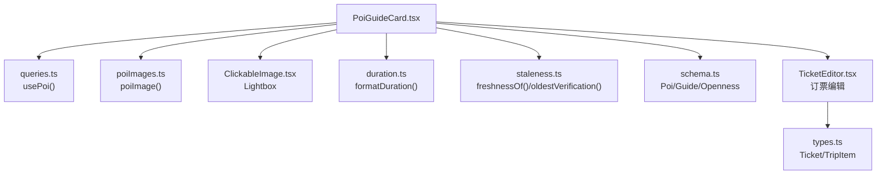
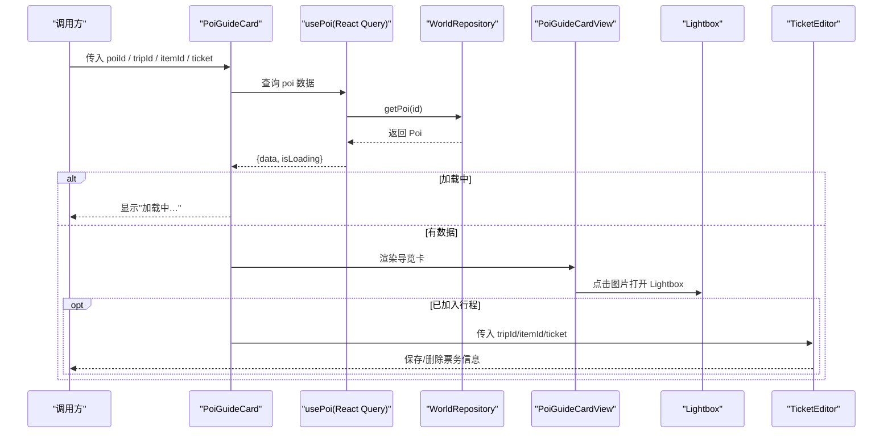
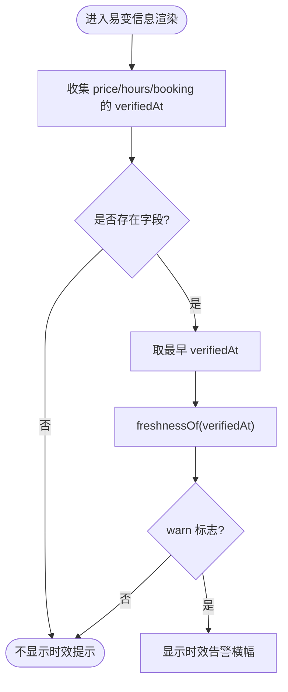
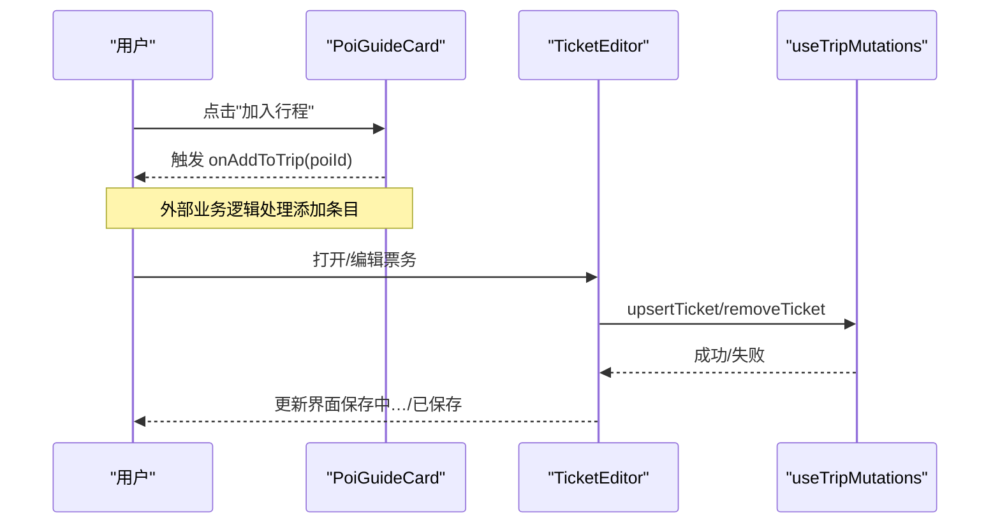
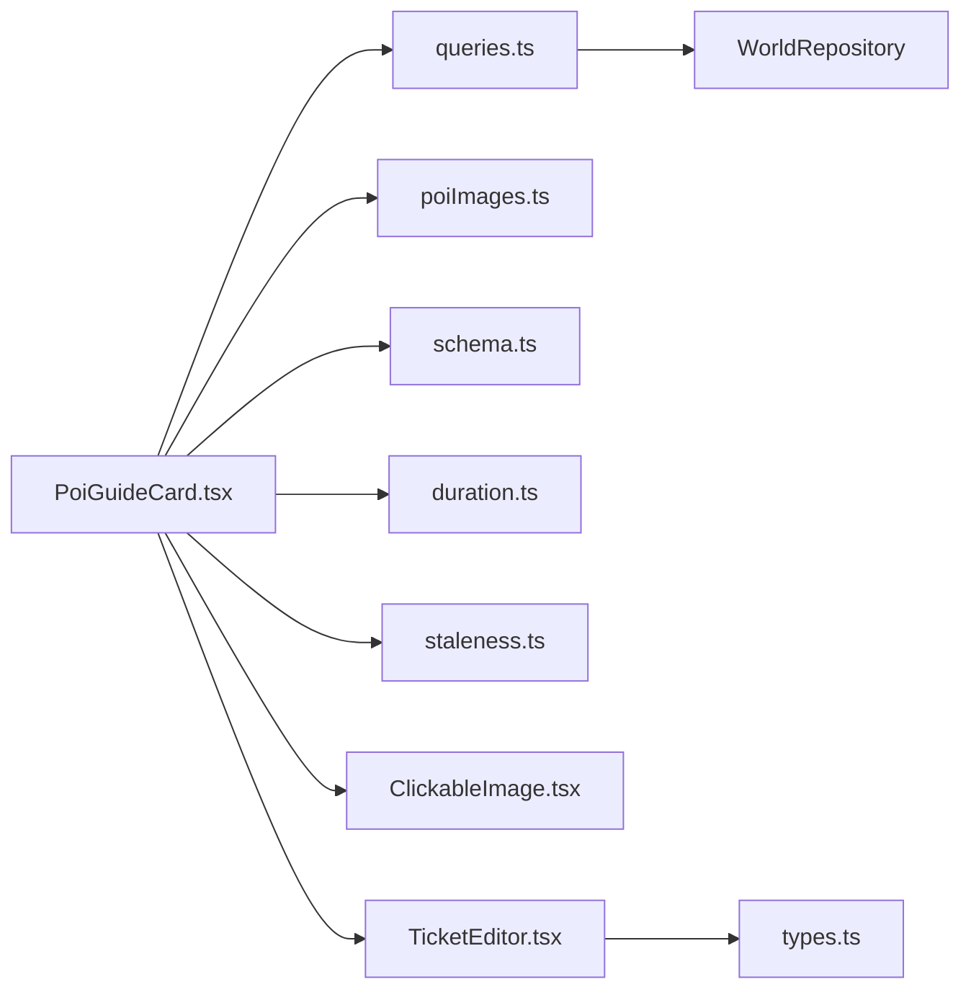

# 景点导览卡片组件

<cite>
**本文引用的文件**
- [PoiGuideCard.tsx](file://src/features/world/PoiGuideCard.tsx)
- [PoiGuideCard.module.css](file://src/features/world/PoiGuideCard.module.css)
- [poiImages.ts](file://src/features/world/poiImages.ts)
- [queries.ts](file://src/features/world/queries.ts)
- [ClickableImage.tsx](file://src/components/ClickableImage.tsx)
- [schema.ts](file://src/domain/world/schema.ts)
- [duration.ts](file://src/domain/world/duration.ts)
- [staleness.ts](file://src/domain/world/staleness.ts)
- [TicketEditor.tsx](file://src/features/trip/TicketEditor.tsx)
- [types.ts](file://src/data/types.ts)
- [borghese-villa.json](file://content/pois/borghese-villa.json)
</cite>

## 更新摘要
**所做更改**
- 更新了封面占位符背景色，从 var(--bg-sub) 改为 var(--bg)，确保卡片在米色页面背景上保持白色卡片的视觉层次
- 修正了顶部大图区域的背景样式，维持卡片作为提升的白色卡片身份
- 优化了视觉层级设计，确保卡片与页面背景的适当对比度

## 目录
1. [简介](#简介)
2. [项目结构](#项目结构)
3. [核心组件](#核心组件)
4. [架构总览](#架构总览)
5. [详细组件分析](#详细组件分析)
6. [依赖关系分析](#依赖关系分析)
7. [性能与缓存](#性能与缓存)
8. [响应式设计与无障碍](#响应式设计与无障碍)
9. [故障排查](#故障排查)
10. [结论](#结论)

## 简介
本组件负责展示单个景点的导览信息，包括：
- 顶部大图、名称、本地名、标签、官方链接
- 基本信息：建议时长、闭馆日、最佳时段、预约要求
- 易变信息（票价、开放时间、预约说明）及其时效性提示与官方来源跳转
- 深度导览内容：入口说明、推荐路线、必看亮点、展陈结构、实用贴士
- 设施信息：厕所、Wi-Fi、寄存、饮水等
- 加入行程能力：支持传入回调以将景点添加到行程，并在已加入时提供门票编辑面板
- 图片点击放大预览（Lightbox），并附带作者与许可信息

该组件同时作为"右栏"和"独立页面"的通用渲染单元，通过 props 控制行为。

**更新** 现已完全支持新增的博尔盖塞别墅POI，包括其公园类型的数据结构和配套的图片资源。

## 项目结构
- 组件实现位于 features/world 下的 PoiGuideCard.tsx 与其样式模块
- 数据获取通过 React Query 封装的 usePoi/usePois 等查询钩子
- 图片资源由 poiImages.ts 集中管理，按 poi id 映射到静态资源路径与版权信息
- 领域逻辑（时长格式化、时效性判定、数据结构定义）位于 domain/world
- 行程集成通过 TicketEditor 完成，类型定义在 data/types.ts

**图表来源**
- [PoiGuideCard.tsx:1-309](file://src/features/world/PoiGuideCard.tsx#L1-L309)
- [queries.ts:1-62](file://src/features/world/queries.ts#L1-L62)
- [poiImages.ts:1-362](file://src/features/world/poiImages.ts#L1-L362)
- [ClickableImage.tsx:1-147](file://src/components/ClickableImage.tsx#L1-L147)
- [duration.ts:1-24](file://src/domain/world/duration.ts#L1-L24)
- [staleness.ts:1-49](file://src/domain/world/staleness.ts#L1-L49)
- [schema.ts:105-218](file://src/domain/world/schema.ts#L105-L218)
- [TicketEditor.tsx:1-130](file://src/features/trip/TicketEditor.tsx#L1-L130)
- [types.ts:195-210](file://src/data/types.ts#L195-L210)

章节来源
- [PoiGuideCard.tsx:1-309](file://src/features/world/PoiGuideCard.tsx#L1-L309)
- [PoiGuideCard.module.css:1-290](file://src/features/world/PoiGuideCard.module.css#L1-L290)

## 核心组件
- PoiGuideCardView：纯展示组件，接收一个完整的 Poi 对象，负责布局与渲染所有区块
- PoiGuideCard：数据加载与状态编排组件，根据 poiId 拉取数据，处理加载中/空态/闭馆提示，并组合 PoiGuideCardView 与 TicketEditor

关键职责划分：
- 数据层：usePoi 从世界库读取 Poi；poiImages 提供配图映射；staleness 计算时效性；duration 格式化时长
- 展示层：PoiGuideCardView 渲染标题、标签、元信息、易变信息、深度导览、设施等
- 交互层：onAddToTrip 回调用于加入行程；Lightbox 用于图片放大；TicketEditor 用于订票编辑

章节来源
- [PoiGuideCard.tsx:40-258](file://src/features/world/PoiGuideCard.tsx#L40-L258)
- [PoiGuideCard.tsx:260-309](file://src/features/world/PoiGuideCard.tsx#L260-L309)

## 架构总览
组件通过 React Query 获取静态世界库数据，结合本地图片映射与领域工具函数进行渲染。当存在行程上下文时，可内嵌订票编辑。整体遵循"数据与展示分离"、"易变字段带来源与核实时间"的设计原则。

**图表来源**
- [PoiGuideCard.tsx:260-309](file://src/features/world/PoiGuideCard.tsx#L260-L309)
- [queries.ts:22-30](file://src/features/world/queries.ts#L22-L30)
- [ClickableImage.tsx:60-147](file://src/components/ClickableImage.tsx#L60-L147)
- [TicketEditor.tsx:15-130](file://src/features/trip/TicketEditor.tsx#L15-L130)

## 详细组件分析

### 数据模型与字段映射
- Poi 结构包含基础信息、开放策略、预约要求、易变信息、导览内容与设施等
- 易变字段（票价、开放时间、预约说明）必须携带 source 与 verifiedAt，用于时效性提示与官方源跳转
- 导览内容（guide）包含入口、路线、亮点、展陈结构、贴士等结构化字段

**更新** 博尔盖塞别墅POI展示了公园类型景点的完整数据结构，包括：
- 公园类型的标签系统（世界级、园林、雕塑、湖景）
- 灵活的游览时长配置（60-180分钟，含美术馆额外时间）
- 丰富的导览内容（多个入口、推荐路线、必看亮点、实用贴士）
- 完善的设施信息（公共洗手间、饮水喷泉、无障碍设施）

章节来源
- [schema.ts:105-218](file://src/domain/world/schema.ts#L105-L218)
- [borghese-villa.json:1-69](file://content/pois/borghese-villa.json#L1-L69)

### 图片加载与版权展示
- 使用 poiImages.ts 中的 POI_IMAGES 映射表，按 poi.id 获取图片 src、作者、许可、来源页
- 顶部大图支持点击放大，通过 ClickableImage.Lightbox 全屏预览，并显示 caption、credit、license、来源链接
- 图片采用懒加载 loading="lazy"，减少首屏压力

**更新** 新增了博尔盖塞别墅的图片映射：
- 图片ID：`poi-borghese-villa`
- 图片来源：Wikimedia Commons (CC BY-SA 3.0)
- 作者：Sailko
- 来源页面：https://commons.wikimedia.org/wiki/File:VillaBorgheseGiardino.JPG

章节来源
- [PoiGuideCard.tsx:51-80](file://src/features/world/PoiGuideCard.tsx#L51-L80)
- [poiImages.ts:15-362](file://src/features/world/poiImages.ts#L15-L362)
- [ClickableImage.tsx:1-147](file://src/components/ClickableImage.tsx#L1-L147)

### 基本信息格式化与展示
- 建议时长：优先使用 durationNote；否则用 formatDuration 将 [min_lo, min_hi] 转换为自然语言
- 闭馆日：将 closedWeekdays 映射为中文星期，并合并特定日期数量提示
- 最佳时段：可选字段，直接展示
- 预约要求：若 required 为真，显示需提前 leadDays 天预约，并提供订票链接

**更新** 博尔盖塞别墅的基本信息展示：
- 建议时长：1-3小时（散步），含博尔盖塞美术馆需另加2小时
- 最佳时段：清晨或傍晚，避开正午暴晒
- 无固定闭馆日，适合全天游览

章节来源
- [PoiGuideCard.tsx:111-143](file://src/features/world/PoiGuideCard.tsx#L111-L143)
- [duration.ts:1-24](file://src/domain/world/duration.ts#L1-L24)
- [schema.ts:173-190](file://src/domain/world/schema.ts#L173-L190)

### 易变信息与时效性提示
- 对 price/hours/booking 三个易变字段分别渲染，每条附带 verifiedAt 与 source
- 使用 staleness.ts 的 freshnessOf 计算是否过期（90/180 天阈值），并以警示条或文字提示
- oldestVerification 取最旧的一条作为整体时效标记，必要时显示全局告警横幅

**图表来源**
- [PoiGuideCard.tsx:145-158](file://src/features/world/PoiGuideCard.tsx#L145-L158)
- [staleness.ts:22-48](file://src/domain/world/staleness.ts#L22-L48)

章节来源
- [PoiGuideCard.tsx:15-38](file://src/features/world/PoiGuideCard.tsx#L15-L38)
- [PoiGuideCard.tsx:145-158](file://src/features/world/PoiGuideCard.tsx#L145-L158)
- [staleness.ts:1-49](file://src/domain/world/staleness.ts#L1-L49)

### 深度导览内容渲染
- 入口说明：直接渲染文本
- 推荐路线：列表形式，每条路线含名称、可选时长、站点列表
- 必看亮点：每项含名称、位置、可选原因说明
- 展陈结构：富文本段落（保持空白换行）
- 实用贴士：无序列表

**更新** 博尔盖塞别墅的深度导览内容：
- 入口：多个入口选择，最常用的是 Piazzale del Museo Borghese 和 Porta Pinciana
- 推荐路线：湖景+美术馆精华线2小时，包含莎士比亚环球剧场、阿斯克勒庇俄斯神庙湖等景点
- 必看亮点：阿斯克勒庇俄斯神庙湖、博尔盖塞美术馆、博尔盖塞角斗士
- 实用贴士：公园免费开放、美术馆需预约、租船信息等

注意：当前实现以纯文本/列表为主，未引入富文本解析器；如需支持 HTML，可在后续扩展中增加安全渲染（如白名单过滤）。

章节来源
- [PoiGuideCard.tsx:160-221](file://src/features/world/PoiGuideCard.tsx#L160-L221)
- [schema.ts:132-155](file://src/domain/world/schema.ts#L132-L155)

### 设施信息展示
- 仅当 facilities 存在且对应字段非空时渲染
- 支持厕所、Wi-Fi、寄存、饮水等

**更新** 博尔盖塞别墅的设施信息：
- 厕所：公园内多处公共洗手间
- 饮水：多处饮水喷泉
- 无障碍：支持无障碍设施

章节来源
- [PoiGuideCard.tsx:223-253](file://src/features/world/PoiGuideCard.tsx#L223-253)
- [schema.ts:192-200](file://src/domain/world/schema.ts#L192-200)

### 加入行程与用户反馈
- 当传入 onAddToTrip 时，显示"加入行程"按钮，点击后回调传递 poi.id
- 若已加入行程（tripId + itemId 存在），则内嵌 TicketEditor 用于记录/编辑票务信息
- 票务编辑支持：是否已订票、入场时段、购票渠道、确认号、备注、保存/删除操作
- 状态管理：TicketEditor 内部维护 open/booked/channel/bookingRef/note/timeSlot/busy 等状态，并通过 mutations 提交

**图表来源**
- [PoiGuideCard.tsx:103-109](file://src/features/world/PoiGuideCard.tsx#L103-L109)
- [PoiGuideCard.tsx:297-305](file://src/features/world/PoiGuideCard.tsx#L297-L305)
- [TicketEditor.tsx:15-130](file://src/features/trip/TicketEditor.tsx#L15-L130)

章节来源
- [PoiGuideCard.tsx:103-109](file://src/features/world/PoiGuideCard.tsx#L103-L109)
- [PoiGuideCard.tsx:297-305](file://src/features/world/PoiGuideCard.tsx#L297-L305)
- [TicketEditor.tsx:1-130](file://src/features/trip/TicketEditor.tsx#L1-L130)
- [types.ts:195-210](file://src/data/types.ts#L195-L210)

### 闭馆提醒
- 当传入 scheduledDate 且该日期为闭馆日时，显示警告横幅，告知用户在指定日期闭馆

**更新** 博尔盖塞别墅由于没有固定闭馆日，通常不会触发闭馆提醒，但特殊节假日可能关闭。

章节来源
- [PoiGuideCard.tsx:282-291](file://src/features/world/PoiGuideCard.tsx#L282-L291)

### 视觉设计与背景层次
- 顶部大图区域使用 `var(--bg)` 作为背景色，确保卡片在米色页面背景上保持白色卡片的视觉层次
- 卡片容器通过适当的背景色设置，与页面背景形成清晰的视觉分离
- 响应式设计确保在不同屏幕尺寸下保持良好的视觉效果

**更新** 封面占位符背景色已从 `var(--bg-sub)` 更正为 `var(--bg)`，确保：
- 卡片在米色页面背景上保持白色卡片的身份
- 维持适当的视觉层次和对比度
- 提升整体用户体验和可读性

章节来源
- [PoiGuideCard.module.css:21-30](file://src/features/world/PoiGuideCard.module.css#L21-L30)

## 依赖关系分析
- 数据获取：usePoi/usePois/useCity/useCountry 基于 @tanstack/react-query，世界库为静态内容，设置 staleTime/gcTime 为 Infinity，避免运行时刷新
- 图片资源：poiImages.ts 集中管理，便于统一版权与来源页
- 领域工具：duration.ts 格式化时长；staleness.ts 计算时效性；schema.ts 定义结构与校验规则
- 行程集成：TicketEditor 通过 useTripMutations 进行乐观更新，类型来自 types.ts

**图表来源**
- [queries.ts:1-62](file://src/features/world/queries.ts#L1-L62)
- [PoiGuideCard.tsx:1-309](file://src/features/world/PoiGuideCard.tsx#L1-L309)
- [poiImages.ts:1-362](file://src/features/world/poiImages.ts#L1-L362)
- [schema.ts:105-218](file://src/domain/world/schema.ts#L105-L218)
- [duration.ts:1-24](file://src/domain/world/duration.ts#L1-L24)
- [staleness.ts:1-49](file://src/domain/world/staleness.ts#L1-L49)
- [ClickableImage.tsx:1-147](file://src/components/ClickableImage.tsx#L1-L147)
- [TicketEditor.tsx:1-130](file://src/features/trip/TicketEditor.tsx#L1-L130)
- [types.ts:195-210](file://src/data/types.ts#L195-L210)

章节来源
- [queries.ts:1-62](file://src/features/world/queries.ts#L1-L62)
- [PoiGuideCard.tsx:1-309](file://src/features/world/PoiGuideCard.tsx#L1-L309)

## 性能与缓存
- 世界库为静态构建产物，查询配置 staleTime/gcTime 为 Infinity，避免重复请求
- 图片懒加载 loading="lazy"，降低首屏带宽与渲染压力
- 易变信息仅在必要时显示时效告警，避免不必要的重渲染
- 建议在大数据量场景下对 poiImages 映射进行按需加载或分片，以减少初始包体

**更新** 博尔盖塞别墅的图片资源已优化，采用标准的图片路径格式，确保良好的加载性能。

[本节为通用指导，无需具体文件引用]

## 响应式设计与无障碍
- 响应式：CSS 使用网格与相对单位，适配不同屏幕尺寸；头部大图高度固定但可随容器缩放
- 无障碍：
  - 图片具备 alt 文本，Lightbox 提供关闭按钮与键盘导航（Esc、左右箭头）
  - 链接使用 rel="noopener noreferrer" 提升安全性
  - 语义化标签（h2、section、ul/li）增强可读性与屏幕阅读器体验

**更新** 博尔盖塞别墅的展示完全符合无障碍标准，包括图片alt文本、合适的对比度和键盘导航支持。

章节来源
- [PoiGuideCard.module.css:1-290](file://src/features/world/PoiGuideCard.module.css#L1-L290)
- [ClickableImage.tsx:60-147](file://src/components/ClickableImage.tsx#L60-L147)

## 故障排查
- 数据缺失或结构异常：组件会显示"这张卡片打不开（数据缺失或结构异常）"，请检查 world 数据与 schema 校验
- 图片未显示：确认 poi.id 是否在 poiImages.ts 中存在映射；若无，可补充映射或使用默认占位图
- 易变信息过期：检查 volatile.price/hours/booking 的 verifiedAt 是否超过阈值；必要时引导用户查看官方源
- 闭馆提醒误报：核对 scheduledDate 与 openness.closedWeekdays 的映射逻辑，确保日期与星期一致
- 加入行程无反馈：确认 onAddToTrip 回调是否正确实现；若已加入行程，检查 tripId 与 itemId 是否正确传入以启用 TicketEditor

**更新** 针对博尔盖塞别墅的特定排查项：
- 确认图片文件 `img/pois/poi-borghese-villa.jpg` 存在于public目录
- 验证POI ID `poi-borghese-villa` 在图片映射表中正确配置
- 检查公园类型景点的特殊字段（如facilities.accessible）是否正确设置
- 确认封面背景色使用正确的CSS变量，确保视觉层次正确

章节来源
- [PoiGuideCard.tsx:277-291](file://src/features/world/PoiGuideCard.tsx#L277-L291)
- [poiImages.ts:359-362](file://src/features/world/poiImages.ts#L359-L362)
- [staleness.ts:22-48](file://src/domain/world/staleness.ts#L22-L48)

## 结论
PoiGuideCard 组件以清晰的数据分层与展示分离实现了景点导览的全面呈现：
- 通过 schema 约束与领域工具保证数据一致性与可读性
- 借助 React Query 与静态世界库实现高效缓存与稳定渲染
- 提供易变信息的时效性提示与官方源直达，保障信息可信度
- 支持加入行程与票务编辑，形成从"发现"到"规划"的闭环
- 兼顾响应式与无障碍，提升多端体验

**更新** 新增的博尔盖塞别墅POI完美展示了组件对不同类型景点的支持能力，特别是公园类景点的复杂数据结构。组件已成功处理：
- 公园类型的标签系统和游览时长配置
- 多入口和多路线的导览内容组织
- 丰富的设施信息和实用贴士展示
- 完整的图片资源和版权信息管理
- 优化的视觉层次设计，确保卡片在页面背景上的适当对比度

未来可扩展方向：
- 富文本渲染：为 guide.collections 等字段引入安全的富文本解析
- 图片缓存：引入浏览器缓存策略或 CDN 优化
- 国际化：对文案进行 i18n 抽离，支持多语言切换
- 更多景点类型支持：继续扩展对不同类别景点的适配能力