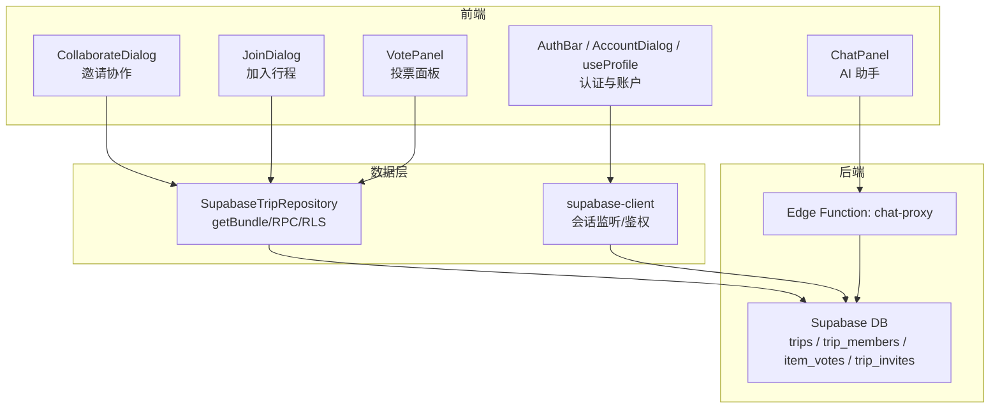
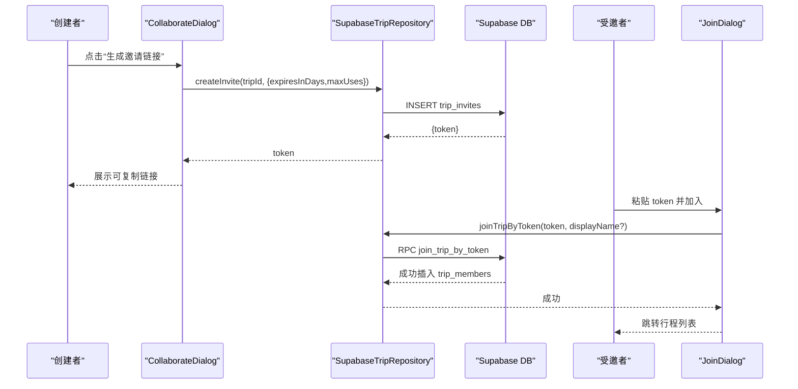
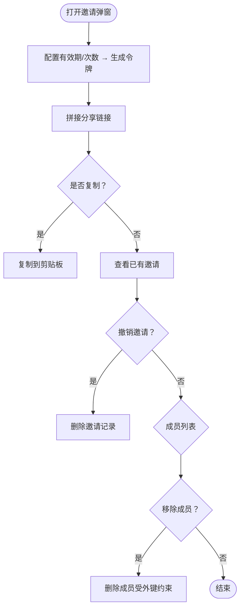
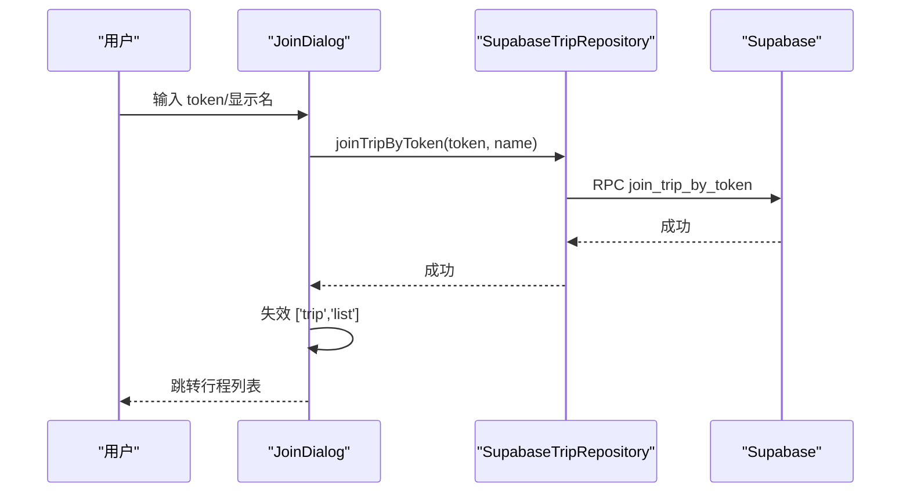
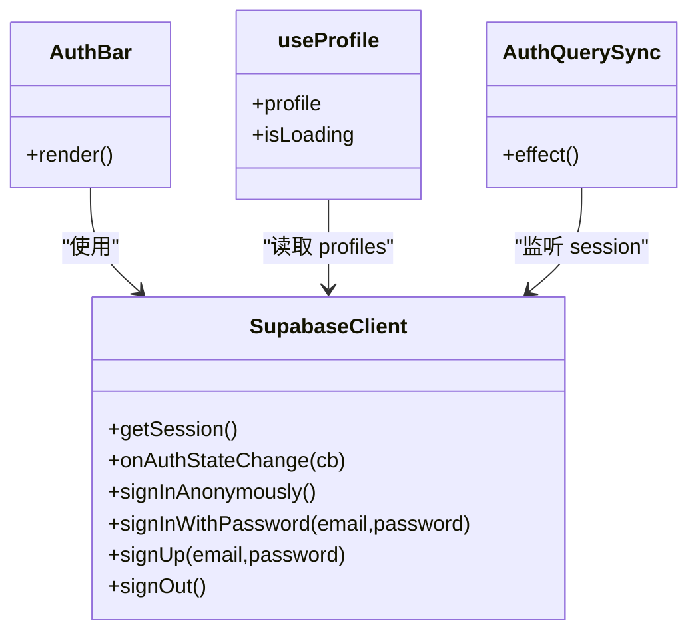
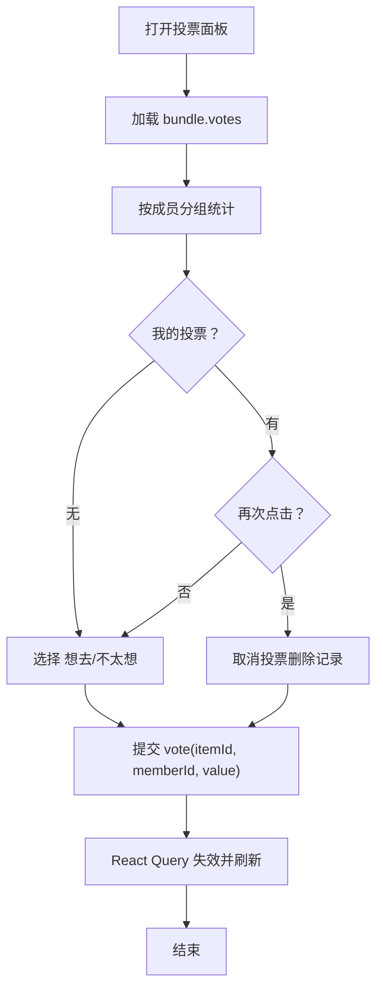
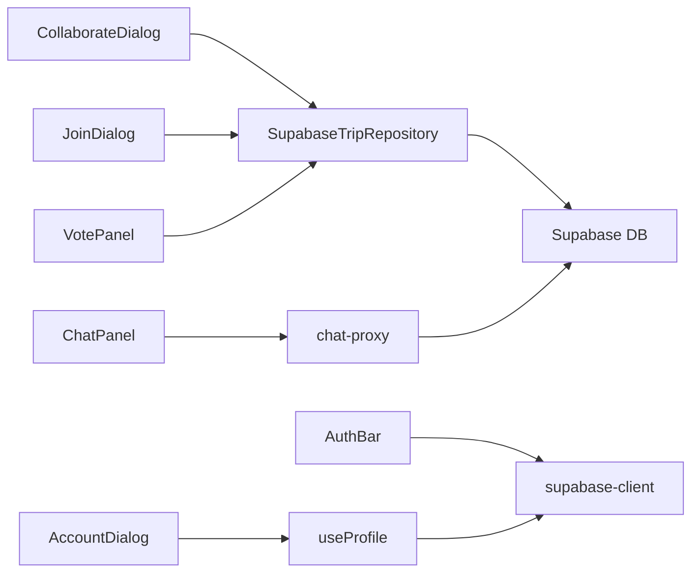

# 团队协作模块

<cite>
**本文引用的文件**
- [CollaborateDialog.tsx](file://src/features/trip/CollaborateDialog.tsx)
- [JoinDialog.tsx](file://src/features/trip/JoinDialog.tsx)
- [AuthBar.tsx](file://src/features/auth/AuthBar.tsx)
- [useProfile.ts](file://src/features/auth/useProfile.ts)
- [AccountDialog.tsx](file://src/features/auth/AccountDialog.tsx)
- [supabase-client.ts](file://src/data/supabase-client.ts)
- [supabase-trip.ts](file://src/data/adapters/supabase-trip.ts)
- [0001_init.sql](file://supabase/migrations/0001_init.sql)
- [VotePanel.tsx](file://src/features/trip/VotePanel.tsx)
- [ChatPanel.tsx](file://src/features/trip/ChatPanel.tsx)
- [chat-proxy/index.ts](file://supabase/functions/chat-proxy/index.ts)
- [AppShell.tsx](file://src/app/AppShell.tsx)
- [AuthQuerySync.tsx](file://src/features/auth/AuthQuerySync.tsx)
- [main.tsx](file://src/app/main.tsx)
- [useMyMember.ts](file://src/features/trip/useMyMember.ts)
</cite>

## 目录
1. [简介](#简介)
2. [项目结构](#项目结构)
3. [核心组件](#核心组件)
4. [架构总览](#架构总览)
5. [详细组件分析](#详细组件分析)
6. [依赖关系分析](#依赖关系分析)
7. [性能考虑](#性能考虑)
8. [故障排查指南](#故障排查指南)
9. [结论](#结论)
10. [附录：代码示例路径](#附录代码示例路径)

## 简介
本模块面向多人协作编辑行程，提供成员邀请、权限控制与实时数据同步能力；同时包含认证流程（登录验证、会话管理、用户信息同步）以及投票决策功能。通过 Supabase 的 RLS（行级安全）、RPC 与 Edge Function，实现安全的协作边界与可扩展的 AI 助手集成。

## 项目结构
协作相关的前端组件集中在 features/trip 与 features/auth，数据访问通过 data/adapters 的适配器抽象，数据库结构与权限策略在 supabase/migrations 中定义，AI 助手通过 supabase/functions/chat-proxy 暴露。

图表来源
- [CollaborateDialog.tsx:1-197](file://src/features/trip/CollaborateDialog.tsx#L1-L197)
- [JoinDialog.tsx:1-110](file://src/features/trip/JoinDialog.tsx#L1-L110)
- [AuthBar.tsx:1-57](file://src/features/auth/AuthBar.tsx#L1-L57)
- [supabase-trip.ts:141-198](file://src/data/adapters/supabase-trip.ts#L141-L198)
- [supabase-client.ts:22-69](file://src/data/supabase-client.ts#L22-L69)
- [0001_init.sql:47-138](file://supabase/migrations/0001_init.sql#L47-L138)
- [chat-proxy/index.ts:1-81](file://supabase/functions/chat-proxy/index.ts#L1-L81)

章节来源
- [CollaborateDialog.tsx:1-197](file://src/features/trip/CollaborateDialog.tsx#L1-L197)
- [JoinDialog.tsx:1-110](file://src/features/trip/JoinDialog.tsx#L1-L110)
- [supabase-trip.ts:141-198](file://src/data/adapters/supabase-trip.ts#L141-L198)
- [0001_init.sql:47-138](file://supabase/migrations/0001_init.sql#L47-L138)

## 核心组件
- 邀请协作：生成带过期与使用次数限制的邀请令牌，拼接可分享链接，支持撤销与成员移除。
- 加入行程：凭令牌加入目标行程，自动成为成员并受 RLS 授权读写。
- 认证与会话：统一登录态管理，支持匿名/邮箱密码/魔法链接；登录后自动刷新查询缓存。
- 用户信息同步：读取/更新 profiles.display_name，并在行程成员展示时优先覆盖显示名。
- 投票决策：对行程条目进行“想去/不太想”的实名投票，聚合展示净分与成员表态。
- 实时同步：通过 get_trip_bundle RPC 一次性拉取全量数据；配合 React Query 失效机制与 Supabase Realtime（M4 阶段接管）实现近实时体验。

章节来源
- [CollaborateDialog.tsx:24-197](file://src/features/trip/CollaborateDialog.tsx#L24-L197)
- [JoinDialog.tsx:16-110](file://src/features/trip/JoinDialog.tsx#L16-L110)
- [AuthBar.tsx:18-57](file://src/features/auth/AuthBar.tsx#L18-L57)
- [useProfile.ts:19-39](file://src/features/auth/useProfile.ts#L19-L39)
- [AccountDialog.tsx:13-36](file://src/features/auth/AccountDialog.tsx#L13-L36)
- [VotePanel.tsx:15-105](file://src/features/trip/VotePanel.tsx#L15-L105)
- [supabase-trip.ts:159-198](file://src/data/adapters/supabase-trip.ts#L159-L198)
- [main.tsx:12-20](file://src/app/main.tsx#L12-L20)

## 架构总览
协作链路围绕“邀请令牌 + 成员表 + RLS”展开：
- 创建者生成邀请令牌（trip_invites），附带有效期与最大使用次数。
- 受邀者打开链接后调用 join_trip_by_token，插入 trip_members（role=member）。
- RLS 基于 auth.uid() 与 trip_members 判定读/写权限，未登录或无成员身份将被拒绝。
- 数据读取通过 get_trip_bundle RPC 一次返回 trips/trip_members/trip_days/trip_items/item_votes/tickets/expenses，减少往返。
- 投票写入 item_votes，按 member_id 唯一约束避免重复。

图表来源
- [CollaborateDialog.tsx:42-65](file://src/features/trip/CollaborateDialog.tsx#L42-L65)
- [supabase-trip.ts:368-413](file://src/data/adapters/supabase-trip.ts#L368-L413)
- [JoinDialog.tsx:27-38](file://src/features/trip/JoinDialog.tsx#L27-L38)
- [0001_init.sql:47-138](file://supabase/migrations/0001_init.sql#L47-L138)

## 详细组件分析

### 邀请协作（CollaborateDialog）
- 功能要点
  - 生成邀请令牌，设置有效期与最大使用次数。
  - 拼接部署子路径的分享链接，支持一键复制。
  - 列出已有邀请，支持撤销。
  - 列出成员，支持移除非 owner 成员（外键限制会提示需先处理账单付款人）。
- 关键交互
  - 生成/撤销/移除均触发 React Query 失效，保证列表即时刷新。

图表来源
- [CollaborateDialog.tsx:42-82](file://src/features/trip/CollaborateDialog.tsx#L42-L82)
- [CollaborateDialog.tsx:84-149](file://src/features/trip/CollaborateDialog.tsx#L84-L149)
- [CollaborateDialog.tsx:151-192](file://src/features/trip/CollaborateDialog.tsx#L151-L192)

章节来源
- [CollaborateDialog.tsx:24-197](file://src/features/trip/CollaborateDialog.tsx#L24-L197)

### 加入行程（JoinDialog）
- 功能要点
  - 校验云端配置，本地模式不可用。
  - 需要登录（匿名也可），输入 token 与可选显示名。
  - 成功后使 trip list 失效并跳转。
- 错误处理
  - 未配置云端、未登录、token 无效等场景均有明确提示。

图表来源
- [JoinDialog.tsx:27-38](file://src/features/trip/JoinDialog.tsx#L27-L38)
- [supabase-trip.ts:407-413](file://src/data/adapters/supabase-trip.ts#L407-L413)

章节来源
- [JoinDialog.tsx:16-110](file://src/features/trip/JoinDialog.tsx#L16-L110)

### 认证流程与会话管理
- 登录态监听
  - useSession 订阅 auth 状态变化，未配置 Supabase 时直接返回未登录。
- 登录入口
  - AuthBar 在未配置时不渲染；已登录显示显示名与登出；未登录弹出 LoginDialog。
- 账户信息
  - useProfile 读取 profiles 表；AccountDialog 允许修改显示名，并通过 react-query 失效联动刷新。
- 查询同步
  - AuthQuerySync 在 session 变化时失效 ['trip'] 分组，确保登录后立即看到协作数据。

图表来源
- [supabase-client.ts:22-105](file://src/data/supabase-client.ts#L22-L105)
- [AuthBar.tsx:18-57](file://src/features/auth/AuthBar.tsx#L18-L57)
- [useProfile.ts:19-39](file://src/features/auth/useProfile.ts#L19-L39)
- [AuthQuerySync.tsx:15-26](file://src/features/auth/AuthQuerySync.tsx#L15-L26)

章节来源
- [supabase-client.ts:22-105](file://src/data/supabase-client.ts#L22-L105)
- [AuthBar.tsx:18-57](file://src/features/auth/AuthBar.tsx#L18-L57)
- [useProfile.ts:19-39](file://src/features/auth/useProfile.ts#L19-L39)
- [AccountDialog.tsx:13-36](file://src/features/auth/AccountDialog.tsx#L13-L36)
- [AuthQuerySync.tsx:15-26](file://src/features/auth/AuthQuerySync.tsx#L15-L26)

### 投票决策（VotePanel）
- 功能要点
  - 将 item_votes 以实名清单形式展示，区分“想去/不太想/未表态”。
  - 支持切换自己的投票（去重：再次点击取消）。
  - 计算净分（想去人数 - 不太想人数）。
- 数据写入
  - value 为 1/-1/0；value=0 时删除记录，否则 upsert 到 item_votes。

图表来源
- [VotePanel.tsx:15-68](file://src/features/trip/VotePanel.tsx#L15-L68)
- [supabase-trip.ts:415-436](file://src/data/adapters/supabase-trip.ts#L415-L436)
- [0001_init.sql:129-138](file://supabase/migrations/0001_init.sql#L129-L138)

章节来源
- [VotePanel.tsx:15-105](file://src/features/trip/VotePanel.tsx#L15-L105)
- [supabase-trip.ts:415-436](file://src/data/adapters/supabase-trip.ts#L415-L436)
- [0001_init.sql:129-138](file://supabase/migrations/0001_init.sql#L129-L138)

### 实时同步机制
- 当前实现
  - 通过 get_trip_bundle RPC 一次性获取行程全量数据，减少多次请求。
  - 关闭窗口聚焦重取，避免频繁刷新；真实实时性由 Supabase Realtime（M4 阶段）接管。
- 未来扩展
  - 可在各页面订阅 Realtime 频道，结合 React Query 的 invalidateQueries 做增量更新。

章节来源
- [supabase-trip.ts:159-198](file://src/data/adapters/supabase-trip.ts#L159-L198)
- [main.tsx:12-20](file://src/app/main.tsx#L12-L20)

### 深度链接与加入入口
- AppShell 解析 URL 中的 token，自动弹出 JoinDialog。
- 关闭弹窗时清理 URL 参数，保持地址整洁。

章节来源
- [AppShell.tsx:115-134](file://src/app/AppShell.tsx#L115-L134)
- [JoinDialog.tsx:16-110](file://src/features/trip/JoinDialog.tsx#L16-L110)

### AI 助手与协作增强（ChatPanel）
- 设计要点
  - 模型仅做建议，实际落库通过现有 mutation（addDay/addItem/updateItem/upsertExpense/setPacking）。
  - 调用 Edge Function chat-proxy，携带 JWT，服务端校验并转发至大模型。
- 工具链
  - add_trip_item / add_expense / add_packing_item，参数严格枚举，前端负责字段归一化与成员/城市/POI 解析。

章节来源
- [ChatPanel.tsx:197-580](file://src/features/trip/ChatPanel.tsx#L197-L580)
- [chat-proxy/index.ts:1-81](file://supabase/functions/chat-proxy/index.ts#L1-L81)

## 依赖关系分析
- 组件耦合
  - CollaborateDialog/JoinDialog 强依赖 SupabaseTripRepository 的邀请与加入接口。
  - VotePanel 依赖 bundle.votes 与 useTripMutations.vote。
  - AuthBar/useProfile/AccountDialog 依赖 supabase-client 的会话与 profiles 表。
- 外部依赖
  - Supabase（PostgreSQL + RLS + RPC + Edge Functions）。
  - React Query（缓存与失效）。
- 潜在循环
  - 无明显循环依赖；数据流单向：UI → Repository → DB/Function。

图表来源
- [CollaborateDialog.tsx:24-197](file://src/features/trip/CollaborateDialog.tsx#L24-L197)
- [JoinDialog.tsx:16-110](file://src/features/trip/JoinDialog.tsx#L16-L110)
- [VotePanel.tsx:15-105](file://src/features/trip/VotePanel.tsx#L15-L105)
- [AuthBar.tsx:18-57](file://src/features/auth/AuthBar.tsx#L18-L57)
- [useProfile.ts:19-39](file://src/features/auth/useProfile.ts#L19-L39)
- [supabase-trip.ts:141-198](file://src/data/adapters/supabase-trip.ts#L141-L198)
- [chat-proxy/index.ts:1-81](file://supabase/functions/chat-proxy/index.ts#L1-L81)

章节来源
- [supabase-trip.ts:141-198](file://src/data/adapters/supabase-trip.ts#L141-L198)
- [supabase-client.ts:22-105](file://src/data/supabase-client.ts#L22-L105)

## 性能考虑
- 批量读取
  - 使用 get_trip_bundle RPC 一次拉取多表数据，显著降低网络往返。
- 缓存策略
  - 关闭窗口聚焦重取，避免不必要刷新；通过显式 invalidateQueries 控制刷新时机。
- 写入优化
  - 投票采用 upsert，避免重复插入；删除空投票以减少冗余。
- 实时性
  - 当前以轮询/失效为主，后续接入 Supabase Realtime 可实现推送式更新。

[本节为通用指导，不直接分析具体文件]

## 故障排查指南
- 无法加入协作
  - 检查是否已配置 Supabase；本地模式不支持加入。
  - 确认已登录（匿名亦可）；未登录将无法执行 join_trip_by_token。
- 加入失败
  - 检查 token 是否有效、是否过期或被撤销。
  - 查看后端 RPC 返回的错误信息。
- 成员移除失败
  - 若该成员是某笔账单的付款人，外键 RESTRICT 会阻止删除；需先更改账单付款人。
- 显示名未生效
  - 修改后需失效 ['profile'] 与 ['trip','bundle']；AccountDialog 已内置此逻辑。
- 投票异常
  - 确认 member_id 正确（useMyMember 根据 auth.user.id 匹配）；避免误写到 owner 上。

章节来源
- [JoinDialog.tsx:40-110](file://src/features/trip/JoinDialog.tsx#L40-L110)
- [CollaborateDialog.tsx:67-82](file://src/features/trip/CollaborateDialog.tsx#L67-L82)
- [useMyMember.ts:16-32](file://src/features/trip/useMyMember.ts#L16-L32)
- [AccountDialog.tsx:27-36](file://src/features/auth/AccountDialog.tsx#L27-L36)

## 结论
本协作模块通过“邀请令牌 + 成员表 + RLS”的安全模型，实现了可控的成员准入与数据隔离；借助 RPC 批量读取与 React Query 缓存失效，兼顾了性能与一致性。投票功能为集体决策提供了透明、实名的基础。AI 助手通过 Edge Function 安全地桥接大模型，在不泄露密钥的前提下增强协作效率。后续可引入 Supabase Realtime 进一步提升实时性。

[本节为总结，不直接分析具体文件]

## 附录：代码示例路径
- 邀请成员
  - 生成邀请链接：[CollaborateDialog.tsx:42-65](file://src/features/trip/CollaborateDialog.tsx#L42-L65)
  - 列出/撤销邀请：[CollaborateDialog.tsx:34-65](file://src/features/trip/CollaborateDialog.tsx#L34-L65)
- 管理权限
  - 移除成员（含外键冲突提示）：[CollaborateDialog.tsx:67-82](file://src/features/trip/CollaborateDialog.tsx#L67-L82)
  - 加入行程（令牌→成员）：[JoinDialog.tsx:27-38](file://src/features/trip/JoinDialog.tsx#L27-L38)
  - 后端 RPC 调用：[supabase-trip.ts:407-413](file://src/data/adapters/supabase-trip.ts#L407-L413)
- 实时数据同步
  - 批量读取 bundle：[supabase-trip.ts:159-198](file://src/data/adapters/supabase-trip.ts#L159-L198)
  - 关闭窗口聚焦重取：[main.tsx:12-20](file://src/app/main.tsx#L12-L20)
- 认证与用户信息同步
  - 登录态监听：[supabase-client.ts:45-69](file://src/data/supabase-client.ts#L45-L69)
  - 账户显示名读取/更新：[useProfile.ts:19-39](file://src/features/auth/useProfile.ts#L19-L39), [AccountDialog.tsx:27-36](file://src/features/auth/AccountDialog.tsx#L27-L36)
  - 登录态变更刷新查询：[AuthQuerySync.tsx:15-26](file://src/features/auth/AuthQuerySync.tsx#L15-L26)
- 投票决策
  - 投票 UI 与逻辑：[VotePanel.tsx:15-68](file://src/features/trip/VotePanel.tsx#L15-L68)
  - 投票写入（upsert/delete）：[supabase-trip.ts:415-436](file://src/data/adapters/supabase-trip.ts#L415-L436)
  - 数据结构（item_votes）：[0001_init.sql:129-138](file://supabase/migrations/0001_init.sql#L129-L138)
- 深度链接加入
  - 解析 token 并弹出加入弹窗：[AppShell.tsx:115-134](file://src/app/AppShell.tsx#L115-L134)
- AI 助手（协作增强）
  - 调用 Edge Function：[ChatPanel.tsx:157-190](file://src/features/trip/ChatPanel.tsx#L157-L190)
  - 服务端代理与鉴权：[chat-proxy/index.ts:32-81](file://supabase/functions/chat-proxy/index.ts#L32-L81)