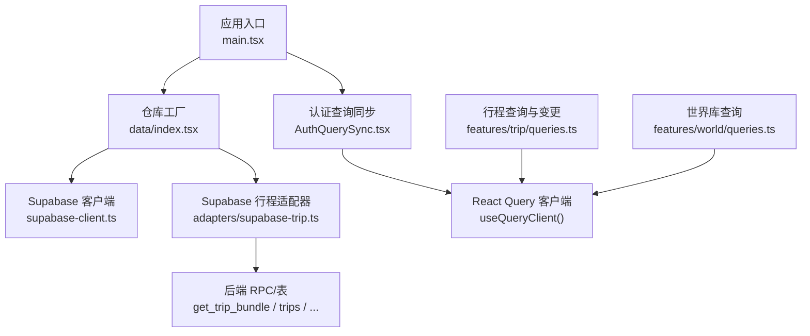
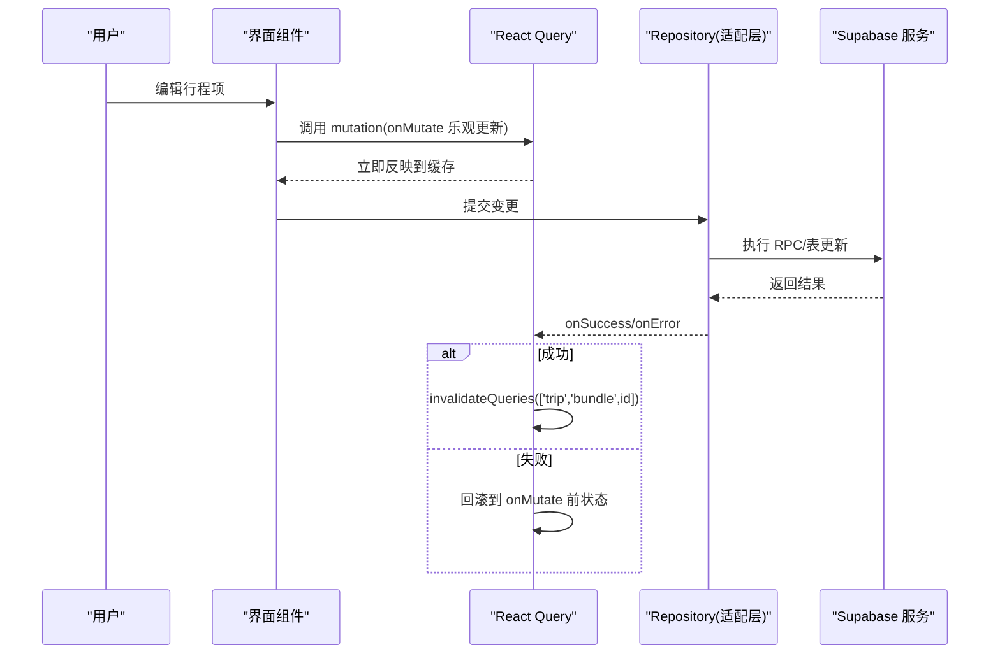
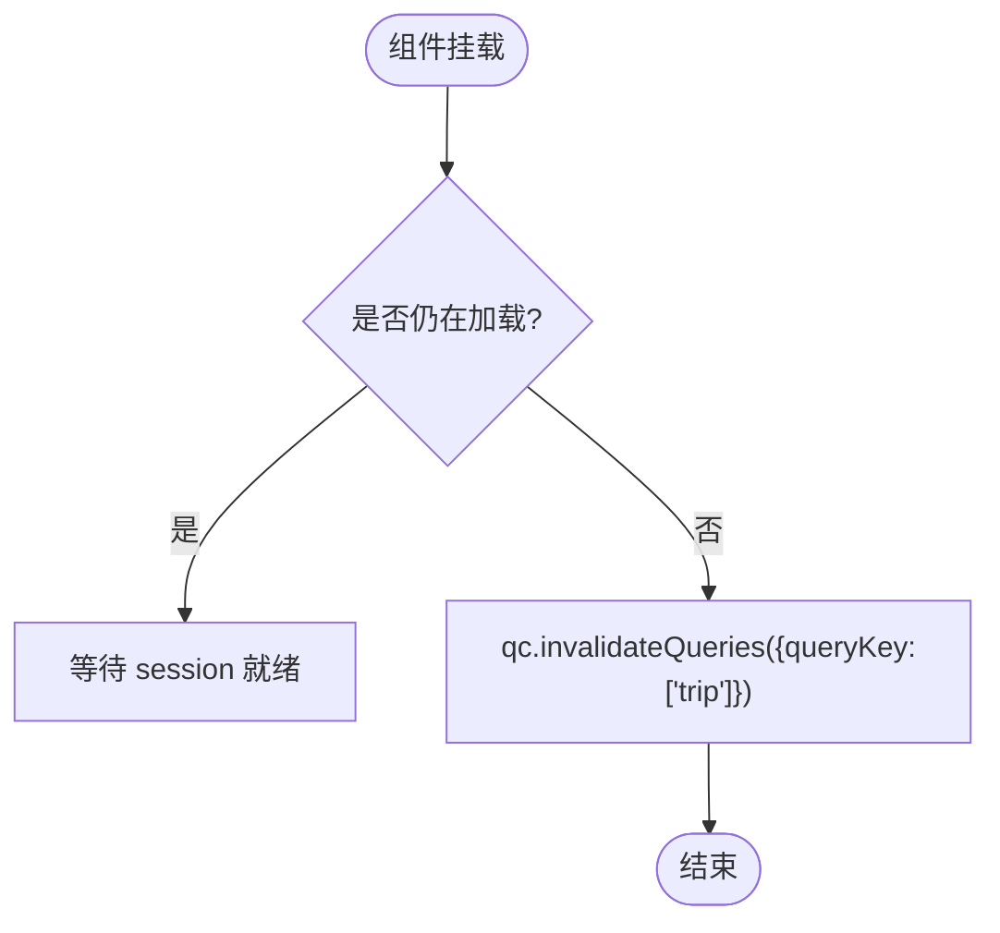
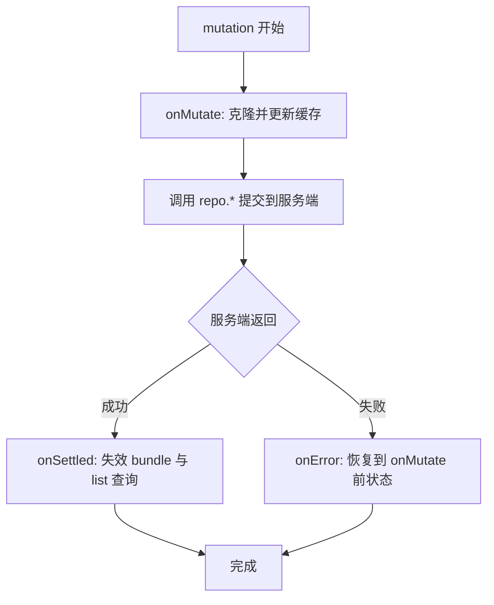
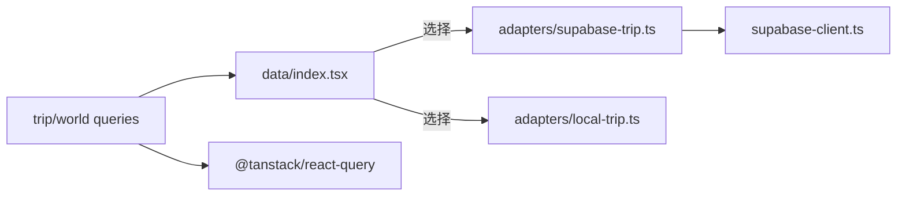
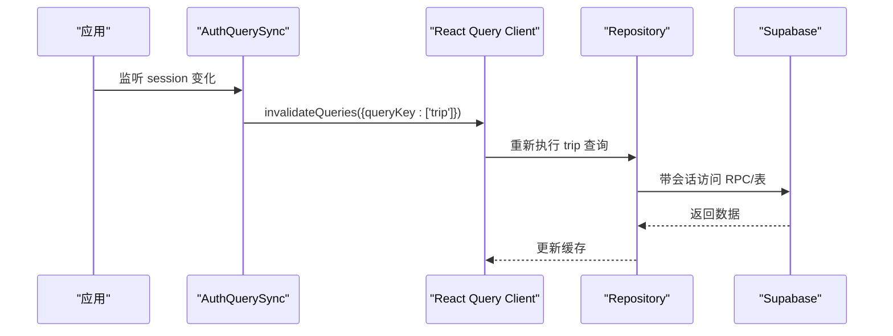
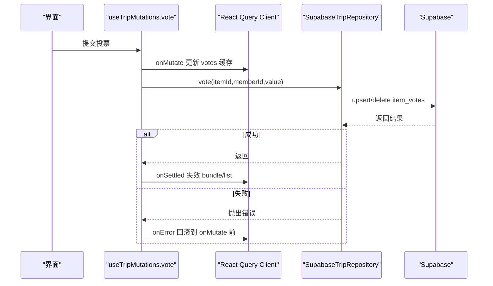

# 实时同步

<cite>
**本文引用的文件**
- [src/features/auth/AuthQuerySync.tsx](file://src/features/auth/AuthQuerySync.tsx)
- [src/data/supabase-client.ts](file://src/data/supabase-client.ts)
- [src/features/trip/queries.ts](file://src/features/trip/queries.ts)
- [src/features/world/queries.ts](file://src/features/world/queries.ts)
- [src/data/adapters/supabase-trip.ts](file://src/data/adapters/supabase-trip.ts)
- [src/data/index.tsx](file://src/data/index.tsx)
- [src/app/main.tsx](file://src/app/main.tsx)
- [src/features/auth/useProfile.ts](file://src/features/auth/useProfile.ts)
- [package.json](file://package.json)
- [docs/技术方案.md](file://docs/技术方案.md)
</cite>

## 目录
1. [简介](#简介)
2. [项目结构](#项目结构)
3. [核心组件](#核心组件)
4. [架构总览](#架构总览)
5. [详细组件分析](#详细组件分析)
6. [依赖关系分析](#依赖关系分析)
7. [性能考量](#性能考量)
8. [故障恢复与离线支持](#故障恢复与离线支持)
9. [结论](#结论)
10. [附录：关键流程时序图](#附录：关键流程时序图)

## 简介
本文件面向“基于 Supabase Realtime 的多用户数据同步”实现，聚焦以下目标：
- 连接管理：认证会话生命周期、查询失效与重取策略。
- 数据冲突解决：乐观更新 + 服务端权威回写的一致性模型。
- 状态一致性保证：React Query 缓存键约定、分组失效与 staleTime 控制。
- AuthQuerySync 组件：登录态变化驱动的数据同步机制。
- React Query 与实时更新集成：缓存策略、性能优化与并发更新处理。
- 故障恢复与离线支持：错误重试、只读快照与降级路径。

说明：当前代码库中未直接出现显式的 Supabase Realtime 订阅（channel）调用；多端一致性与实时性主要通过“乐观更新 + 服务端 RLS/RPC + React Query 缓存失效”的组合达成。后续可在需要时扩展 Realtime 通道以进一步降低网络往返。

## 项目结构
- 数据层：Repository 工厂根据环境选择本地或云端适配器；Supabase 客户端单例提供认证与会话监听。
- 特性层：行程与世界库的查询与变更封装为 hooks，统一使用 React Query。
- 应用入口：配置 QueryClient 默认行为，挂载全局同步组件。



图表来源
- [src/app/main.tsx:1-37](file://src/app/main.tsx#L1-L37)
- [src/data/index.tsx:1-57](file://src/data/index.tsx#L1-L57)
- [src/data/supabase-client.ts:1-106](file://src/data/supabase-client.ts#L1-L106)
- [src/data/adapters/supabase-trip.ts:1-548](file://src/data/adapters/supabase-trip.ts#L1-L548)
- [src/features/trip/queries.ts:1-236](file://src/features/trip/queries.ts#L1-L236)
- [src/features/world/queries.ts:1-62](file://src/features/world/queries.ts#L1-L62)

章节来源
- [src/app/main.tsx:1-37](file://src/app/main.tsx#L1-L37)
- [src/data/index.tsx:1-57](file://src/data/index.tsx#L1-L57)

## 核心组件
- AuthQuerySync：监听认证会话变化，触发 trip 相关查询组失效，确保登录后立即用新权限拉取数据。
- supabase-client：创建 Supabase 客户端、暴露 useSession 钩子，集中处理登录/登出与令牌刷新。
- trip queries：封装所有行程读取与写入，采用乐观更新 + 失败回滚 + 成功后失效缓存的策略。
- world queries：静态内容查询，设置永久缓存避免重复请求。
- supabase-trip 适配器：将业务操作映射到数据库表与 RPC，受 RLS 保护，返回结构化数据。

章节来源
- [src/features/auth/AuthQuerySync.tsx:1-27](file://src/features/auth/AuthQuerySync.tsx#L1-L27)
- [src/data/supabase-client.ts:1-106](file://src/data/supabase-client.ts#L1-L106)
- [src/features/trip/queries.ts:1-236](file://src/features/trip/queries.ts#L1-L236)
- [src/features/world/queries.ts:1-62](file://src/features/world/queries.ts#L1-L62)
- [src/data/adapters/supabase-trip.ts:1-548](file://src/data/adapters/supabase-trip.ts#L1-L548)

## 架构总览
整体采用“Repository 抽象 + React Query 缓存 + 乐观更新”的架构：
- 视图通过 hooks 发起查询/变更，不关心底层是本地还是云端。
- 云端模式下，写操作先乐观更新 UI，再异步提交到服务端；成功则保持缓存一致，失败则回滚。
- 认证状态变化会触发相关查询组失效，保证权限变更后数据正确。



图表来源
- [src/features/trip/queries.ts:45-175](file://src/features/trip/queries.ts#L45-L175)
- [src/data/adapters/supabase-trip.ts:159-198](file://src/data/adapters/supabase-trip.ts#L159-L198)

章节来源
- [src/features/trip/queries.ts:45-175](file://src/features/trip/queries.ts#L45-L175)
- [src/data/adapters/supabase-trip.ts:159-198](file://src/data/adapters/supabase-trip.ts#L159-L198)

## 详细组件分析

### AuthQuerySync 组件：认证状态与查询同步
- 作用：当登录态变化（登录/登出），立即使 ['trip'] 分组下的所有查询失效，强制以新会话重新拉取数据，避免“已登录但列表仍为空”的问题。
- 关键点：
  - 使用 useSession 监听会话加载与变化。
  - 在 loading 结束后对 queryKey 前缀 ['trip'] 进行分组失效。
  - 与 useProfile 的 profile 查询 key 包含 userId，登录态变化也会自动重取。



图表来源
- [src/features/auth/AuthQuerySync.tsx:15-23](file://src/features/auth/AuthQuerySync.tsx#L15-L23)
- [src/features/auth/useProfile.ts:23-36](file://src/features/auth/useProfile.ts#L23-L36)

章节来源
- [src/features/auth/AuthQuerySync.tsx:1-27](file://src/features/auth/AuthQuerySync.tsx#L1-L27)
- [src/features/auth/useProfile.ts:1-65](file://src/features/auth/useProfile.ts#L1-L65)

### Supabase 客户端与会话管理
- 客户端初始化：仅在环境变量配置齐全时创建客户端，否则为 null，便于本地模式运行。
- 会话监听：useSession 获取初始会话并订阅 onAuthStateChange，保证登录/登出事件及时响应。
- 登录方式：匿名、邮箱 OTP、邮箱+密码注册/登录，以及统一的 signOut。

```mermaid
classDiagram
class SupabaseClient {
+createClient(url, anonKey, options)
+auth.getSession()
+auth.onAuthStateChange(callback)
+auth.signInAnonymously()
+auth.signUp(email,password)
+auth.signInWithPassword(email,password)
+auth.signOut()
}
class SessionHook {
+useSession() : {loading,session,user}
}
SessionHook --> SupabaseClient : "订阅/获取会话"
```

图表来源
- [src/data/supabase-client.ts:24-69](file://src/data/supabase-client.ts#L24-L69)

章节来源
- [src/data/supabase-client.ts:1-106](file://src/data/supabase-client.ts#L1-L106)

### 行程查询与变更：React Query 集成与乐观更新
- 读取：useTrips、useTripBundle 等 hook 定义稳定的 queryKey，配合 staleTime 控制缓存新鲜度。
- 写入：useTripMutations 统一封装，onMutate 即时更新缓存，onError 回滚，onSettled/onSuccess 失效相关查询组。
- 关键策略：
  - 拖拽/排序等高频交互优先乐观更新，避免卡顿。
  - 通过 bundleKey(['trip','bundle',tripId]) 精确失效，减少不必要重取。
  - 列表与详情同时失效，保证一致性。



图表来源
- [src/features/trip/queries.ts:45-175](file://src/features/trip/queries.ts#L45-L175)

章节来源
- [src/features/trip/queries.ts:1-236](file://src/features/trip/queries.ts#L1-L236)

### 世界库查询：静态内容缓存
- 世界库为静态资源，设置 staleTime/gcTime 为 Infinity，避免运行时重复请求。
- 通过不同 queryKey 区分索引、POI、城市、国家等维度。

章节来源
- [src/features/world/queries.ts:1-62](file://src/features/world/queries.ts#L1-L62)

### Supabase 适配器：RPC 与表操作
- getBundle：通过 RPC 一次性聚合多表数据，减少往返次数。
- 写操作：按字段映射到对应表，遵循 RLS 约束；删除/级联由数据库约束保障。
- 别名覆盖：成员显示名优先取自 profiles，提升协作体验。

章节来源
- [src/data/adapters/supabase-trip.ts:159-198](file://src/data/adapters/supabase-trip.ts#L159-L198)
- [src/data/adapters/supabase-trip.ts:200-523](file://src/data/adapters/supabase-trip.ts#L200-L523)

## 依赖关系分析
- Repository 工厂：根据 isSupabaseConfigured 决定使用 Supabase 或本地适配器，视图层无感知切换。
- React Query：作为统一缓存层，协调查询与变更的生命周期。
- Supabase：提供认证与会话持久化、RLS 安全策略、RPC 聚合能力。



图表来源
- [src/data/index.tsx:21-29](file://src/data/index.tsx#L21-L29)
- [src/features/trip/queries.ts:1-30](file://src/features/trip/queries.ts#L1-L30)
- [src/data/supabase-client.ts:24-34](file://src/data/supabase-client.ts#L24-L34)

章节来源
- [src/data/index.tsx:1-57](file://src/data/index.tsx#L1-L57)
- [src/features/trip/queries.ts:1-30](file://src/features/trip/queries.ts#L1-L30)

## 性能考量
- 批量聚合：get_trip_bundle 一次 RPC 返回全量，避免多次往返造成的延迟。
- 缓存策略：
  - 行程列表 staleTime 60s，行程详情 staleTime 30s，平衡实时性与带宽。
  - 世界库静态内容永久缓存，减少网络开销。
- 乐观更新：高频交互（如拖拽排序）先改 UI，再异步落库，提升响应速度。
- 窗口聚焦重取关闭：避免切标签页导致的闪烁与多余请求。

章节来源
- [docs/技术方案.md:407-420](file://docs/技术方案.md#L407-L420)
- [src/app/main.tsx:12-20](file://src/app/main.tsx#L12-L20)
- [src/features/trip/queries.ts:17-29](file://src/features/trip/queries.ts#L17-L29)

## 故障恢复与离线支持
- 错误重试：QueryClient 默认 retry=1，避免频繁重试造成雪崩。
- 权限错误：RPC 返回 FORBIDDEN 时上层提示登录，避免静默失败。
- 外键约束：移除成员等操作遇到数据库约束时给出明确错误信息。
- 离线只读：
  - 通过 PWA 与服务工作线程策略，静态资源秒开，行程数据不走 SW 缓存以避免过期。
  - 出发前导出离线包，行中无网切换到只读快照模式，禁用编辑入口。
- 会话持久化：Supabase 客户端开启 persistSession 与 autoRefreshToken，保证跨页面与会话续期。

章节来源
- [src/data/adapters/supabase-trip.ts:159-165](file://src/data/adapters/supabase-trip.ts#L159-L165)
- [src/data/adapters/supabase-trip.ts:355-364](file://src/data/adapters/supabase-trip.ts#L355-L364)
- [docs/技术方案.md:947-976](file://docs/技术方案.md#L947-L976)
- [src/data/supabase-client.ts:24-34](file://src/data/supabase-client.ts#L24-L34)

## 结论
本项目通过“Repository 抽象 + React Query 缓存 + 乐观更新”实现了高效、可维护的多用户数据同步方案：
- 认证变化驱动查询失效，保证权限变更后数据一致性。
- 写操作乐观更新提升交互体验，失败回滚保障数据正确性。
- 静态内容永久缓存、动态内容合理 staleTime，兼顾性能与实时性。
- 完善的错误处理与离线降级路径，提升鲁棒性。
未来可在热点数据场景引入 Supabase Realtime 通道，进一步降低网络往返并增强实时性。

## 附录：关键流程时序图

### 登录态变化触发查询失效


图表来源
- [src/features/auth/AuthQuerySync.tsx:15-23](file://src/features/auth/AuthQuerySync.tsx#L15-L23)
- [src/data/adapters/supabase-trip.ts:159-198](file://src/data/adapters/supabase-trip.ts#L159-L198)

### 行程项投票的乐观更新与回滚


图表来源
- [src/features/trip/queries.ts:137-148](file://src/features/trip/queries.ts#L137-L148)
- [src/data/adapters/supabase-trip.ts:415-436](file://src/data/adapters/supabase-trip.ts#L415-L436)