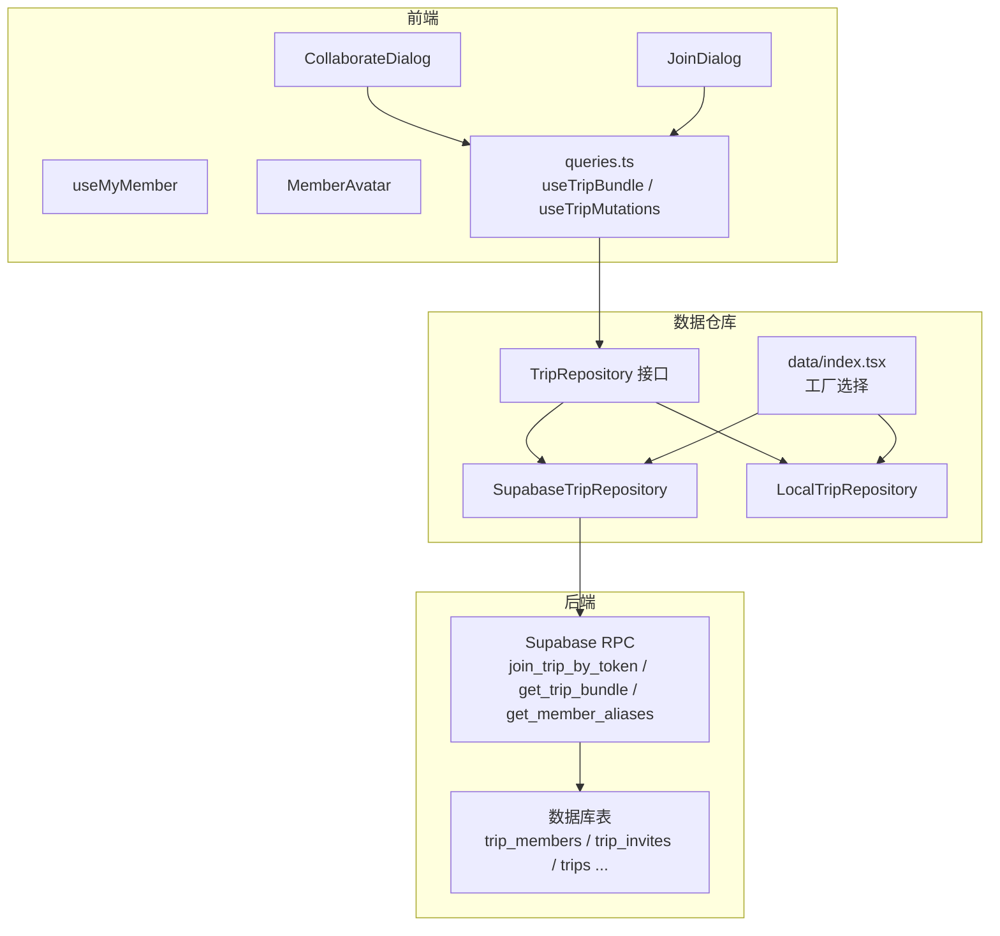
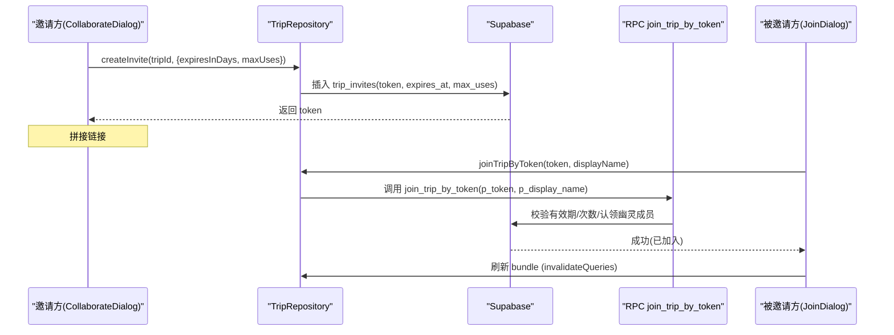
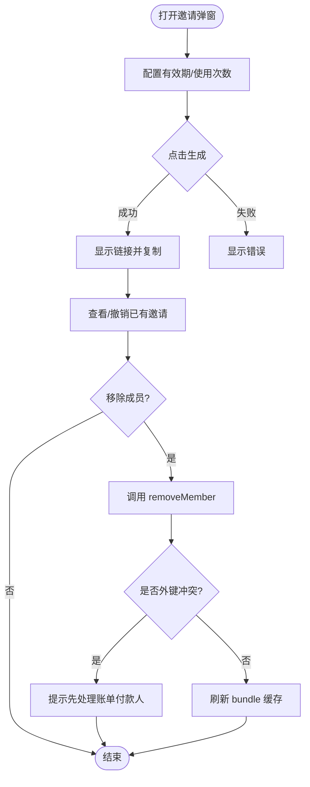
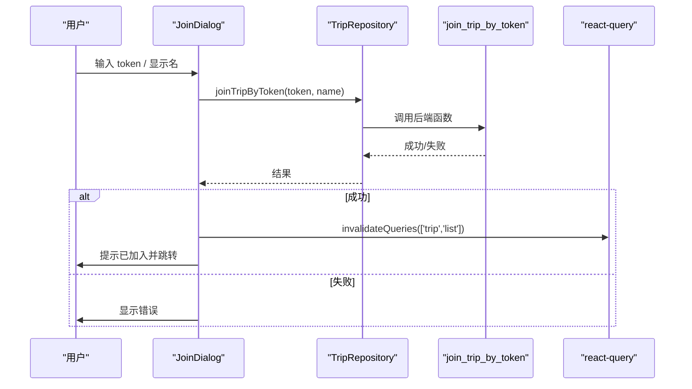
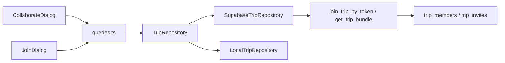

# 成员管理

<cite>
**本文引用的文件**
- [CollaborateDialog.tsx](file://src/features/trip/CollaborateDialog.tsx)
- [JoinDialog.tsx](file://src/features/trip/JoinDialog.tsx)
- [useMyMember.ts](file://src/features/trip/useMyMember.ts)
- [MemberAvatar.tsx](file://src/features/trip/MemberAvatar.tsx)
- [queries.ts](file://src/features/trip/queries.ts)
- [types.ts](file://src/data/types.ts)
- [supabase-trip.ts](file://src/data/adapters/supabase-trip.ts)
- [local-trip.ts](file://src/data/adapters/local-trip.ts)
- [index.tsx](file://src/data/index.tsx)
- [0001_init.sql](file://supabase/migrations/0001_init.sql)
</cite>

## 目录
1. [简介](#简介)
2. [项目结构](#项目结构)
3. [核心组件](#核心组件)
4. [架构总览](#架构总览)
5. [详细组件分析](#详细组件分析)
6. [依赖关系分析](#依赖关系分析)
7. [性能与实时性](#性能与实时性)
8. [故障排查](#故障排查)
9. [结论](#结论)
10. [附录：使用示例与最佳实践](#附录使用示例与最佳实践)

## 简介
本文件面向“行程成员管理”能力，覆盖邀请链接生成、成员角色分配、用户移除、权限控制与安全机制，并重点说明 CollaborateDialog 组件的实现细节（邀请配置、有效期、使用次数限制），以及成员状态管理与数据同步策略。文档同时提供具体代码路径与调用流程，帮助开发者快速理解与扩展该功能。

## 项目结构
成员管理涉及前端交互、数据仓库适配层、后端 RPC 与数据库迁移四个层次：
- 前端交互：CollaborateDialog（邀请方）、JoinDialog（被邀请方）、useMyMember（当前成员判定）、MemberAvatar（成员视觉标识）
- 数据仓库：TripRepository 接口定义与实现（SupabaseTripRepository、LocalTripRepository）
- 后端能力：Supabase RPC join_trip_by_token、get_trip_bundle、get_member_aliases
- 数据模型：trip_members、trip_invites 等表结构与约束



图表来源
- [CollaborateDialog.tsx:24-197](file://src/features/trip/CollaborateDialog.tsx#L24-L197)
- [JoinDialog.tsx:16-110](file://src/features/trip/JoinDialog.tsx#L16-L110)
- [queries.ts:22-30](file://src/features/trip/queries.ts#L22-L30)
- [supabase-trip.ts:141-198](file://src/data/adapters/supabase-trip.ts#L141-L198)
- [index.tsx:21-29](file://src/data/index.tsx#L21-L29)

章节来源
- [CollaborateDialog.tsx:24-197](file://src/features/trip/CollaborateDialog.tsx#L24-L197)
- [JoinDialog.tsx:16-110](file://src/features/trip/JoinDialog.tsx#L16-L110)
- [queries.ts:22-30](file://src/features/trip/queries.ts#L22-L30)
- [supabase-trip.ts:141-198](file://src/data/adapters/supabase-trip.ts#L141-L198)
- [index.tsx:21-29](file://src/data/index.tsx#L21-L29)

## 核心组件
- CollaborateDialog：邀请方弹窗，支持设置有效期与使用次数，生成可分享链接，列出已有邀请与行程成员，支持撤销邀请与移除成员。
- JoinDialog：被邀请方弹窗，校验登录态，粘贴 token 加入行程，成功后刷新列表并跳转。
- useMyMember：统一判定“我在该行程中的成员记录”，优先按 auth.user.id 匹配，否则降级为 owner。
- MemberAvatar：成员头像与颜色派生，支持幽灵成员显示与“我”的高亮。
- queries.ts：封装 useTripBundle 与各类写操作的乐观更新与失效策略。
- data/types.ts：TripMember、TripInvite、TripRepository 等类型定义。
- supabase-trip.ts：云端适配器，实现邀请创建/查询/撤销、令牌加入、成员增删等。
- local-trip.ts：本地适配器，协作相关方法抛出错误提示仅云端可用。
- 0001_init.sql：join_trip_by_token 的 SQL 实现，包含有效期、使用次数、认领幽灵成员等逻辑。

章节来源
- [CollaborateDialog.tsx:24-197](file://src/features/trip/CollaborateDialog.tsx#L24-L197)
- [JoinDialog.tsx:16-110](file://src/features/trip/JoinDialog.tsx#L16-L110)
- [useMyMember.ts:16-31](file://src/features/trip/useMyMember.ts#L16-L31)
- [MemberAvatar.tsx:39-88](file://src/features/trip/MemberAvatar.tsx#L39-L88)
- [queries.ts:22-30](file://src/features/trip/queries.ts#L22-L30)
- [types.ts:129-149](file://src/data/types.ts#L129-L149)
- [supabase-trip.ts:366-413](file://src/data/adapters/supabase-trip.ts#L366-L413)
- [local-trip.ts:283-295](file://src/data/adapters/local-trip.ts#L283-L295)
- [0001_init.sql:431-462](file://supabase/migrations/0001_init.sql#L431-L462)

## 架构总览
成员管理的端到端流程如下：
- 邀请方在 CollaborateDialog 中配置有效期与使用次数，调用 repo.createInvite 生成 token，拼接分享链接。
- 被邀请方通过 JoinDialog 粘贴 token，调用 repo.joinTripByToken，触发后端 RPC join_trip_by_token 校验 token 有效性（有效期、使用次数），插入或认领 trip_members，RLS 自动授予读写权限。
- 成员列表通过 useTripBundle 获取，变更时通过 react-query 失效缓存并重新拉取。
- 成员身份判定由 useMyMember 统一处理，避免协作模式下误判“我”。



图表来源
- [CollaborateDialog.tsx:42-65](file://src/features/trip/CollaborateDialog.tsx#L42-L65)
- [JoinDialog.tsx:27-38](file://src/features/trip/JoinDialog.tsx#L27-L38)
- [supabase-trip.ts:366-413](file://src/data/adapters/supabase-trip.ts#L366-L413)
- [0001_init.sql:431-462](file://supabase/migrations/0001_init.sql#L431-L462)

## 详细组件分析

### CollaborateDialog 组件
- 功能要点
  - 邀请配置：有效期（天）与最多使用次数；支持永久与不限次数。
  - 链接生成：根据当前 origin 与 pathname 拼接分享链接，兼容部署子路径。
  - 成员管理：展示行程成员列表，非 owner 可移除；若外键约束阻止删除，给出明确提示。
  - 邀请管理：列出已有邀请，支持撤销；失败时显示错误信息。
- 关键流程
  - generate：调用 repo.createInvite，成功后刷新 invites 缓存。
  - revoke：调用 repo.revokeInvite，刷新 invites 缓存。
  - removeMember：调用 repo.removeMember，刷新 trip bundle 以联动刷新账本/时间线/打包清单。
- 安全与权限
  - 仅云端模式可用；本地模式会抛错提示。
  - 成员移除受数据库外键约束保护，防止误删有账务关联的成员。



图表来源
- [CollaborateDialog.tsx:42-82](file://src/features/trip/CollaborateDialog.tsx#L42-L82)
- [supabase-trip.ts:355-364](file://src/data/adapters/supabase-trip.ts#L355-L364)

章节来源
- [CollaborateDialog.tsx:24-197](file://src/features/trip/CollaborateDialog.tsx#L24-L197)
- [supabase-trip.ts:355-364](file://src/data/adapters/supabase-trip.ts#L355-L364)

### JoinDialog 组件
- 功能要点
  - 环境检测：未配置 Supabase 时提示无法协作。
  - 登录态检查：未登录需引导登录/注册（匿名也可加入）。
  - 加入流程：粘贴 token 与可选显示名，调用 repo.joinTripByToken，成功后刷新行程列表并跳转。
- 关键流程
  - useMutation 包装加入操作，onSuccess 中刷新 ['trip','list'] 并关闭弹窗导航。
  - onError 捕获错误并展示。



图表来源
- [JoinDialog.tsx:27-38](file://src/features/trip/JoinDialog.tsx#L27-L38)
- [supabase-trip.ts:407-413](file://src/data/adapters/supabase-trip.ts#L407-L413)

章节来源
- [JoinDialog.tsx:16-110](file://src/features/trip/JoinDialog.tsx#L16-L110)
- [supabase-trip.ts:407-413](file://src/data/adapters/supabase-trip.ts#L407-L413)

### 成员身份与状态管理
- useMyMember：基于 auth.user.id 精确匹配成员，避免协作模式下将“我”误判为 owner；未登录或本地模式降级到 owner。
- TripMember：包含 id、tripId、userId、displayName、role、color；userId 为 null 表示幽灵成员（无账号但可参与投票/记账/结算）。
- 成员视觉：MemberAvatar 根据成员 id 或自定义 color 派生稳定配色，支持“我”高亮与幽灵成员灰显。

```mermaid
classDiagram
class TripMember {
+string id
+string tripId
+string userId
+string displayName
+MemberRole role
+string color
}
class MemberAvatar {
+initialOf(name) string
+memberColor(member) {bg, fg}
}
class useMyMember {
+useMyMember(members) TripMember
}
MemberAvatar --> TripMember : "读取属性"
useMyMember --> TripMember : "匹配当前用户"
```

图表来源
- [useMyMember.ts:16-31](file://src/features/trip/useMyMember.ts#L16-L31)
- [MemberAvatar.tsx:39-88](file://src/features/trip/MemberAvatar.tsx#L39-L88)
- [types.ts:129-137](file://src/data/types.ts#L129-L137)

章节来源
- [useMyMember.ts:16-31](file://src/features/trip/useMyMember.ts#L16-L31)
- [MemberAvatar.tsx:39-88](file://src/features/trip/MemberAvatar.tsx#L39-L88)
- [types.ts:129-137](file://src/data/types.ts#L129-L137)

### 权限控制与安全性
- 邀请加入必须经过 SECURITY DEFINER 函数 join_trip_by_token，校验 token 有效期与使用次数，防止任意用户自插成员。
- RLS（行级安全）在成员加入后自动授予对行程数据的读+改权限，未登录或非成员无法访问。
- 成员移除受外键约束保护，若成员作为账单付款人或分摊参与者，禁止直接删除，需先调整账务。
- 本地模式不支持协作邀请，调用会抛错提示仅云端可用。

章节来源
- [0001_init.sql:431-462](file://supabase/migrations/0001_init.sql#L431-L462)
- [supabase-trip.ts:355-364](file://src/data/adapters/supabase-trip.ts#L355-L364)
- [local-trip.ts:283-295](file://src/data/adapters/local-trip.ts#L283-L295)

## 依赖关系分析
- 组件依赖
  - CollaborateDialog 依赖 useTripRepo、useTripBundle、react-query 进行状态管理与缓存失效。
  - JoinDialog 依赖 useTripRepo、useSession、react-router-dom 进行加入与导航。
  - useMyMember 依赖 useSession 与 TripMember 类型。
  - MemberAvatar 依赖 TripMember 类型与配色算法。
- 仓库依赖
  - TripRepository 接口统一抽象，SupabaseTripRepository 实现云端逻辑，LocalTripRepository 实现本地逻辑。
  - 工厂 index.tsx 根据 isSupabaseConfigured 决定使用哪个实现。
- 后端依赖
  - join_trip_by_token 负责令牌校验与成员插入/认领。
  - get_trip_bundle 一次性聚合行程数据，减少往返。
  - get_member_aliases 用于成员别名覆盖（全局昵称）。



图表来源
- [queries.ts:22-30](file://src/features/trip/queries.ts#L22-L30)
- [supabase-trip.ts:141-198](file://src/data/adapters/supabase-trip.ts#L141-L198)
- [index.tsx:21-29](file://src/data/index.tsx#L21-L29)

章节来源
- [queries.ts:22-30](file://src/features/trip/queries.ts#L22-L30)
- [supabase-trip.ts:141-198](file://src/data/adapters/supabase-trip.ts#L141-L198)
- [index.tsx:21-29](file://src/data/index.tsx#L21-L29)

## 性能与实时性
- 批量读取：get_trip_bundle 一次返回 trip、members、days、items、votes、tickets、expenses，显著减少网络往返。
- 乐观更新：useTripMutations 对写操作采用乐观更新，提升拖拽排程等高频交互体验，并在 onSettled 时失效缓存保证一致性。
- 缓存失效：成员变更（移除/加入）后主动 invalidateQueries 对应 key，确保 UI 即时反映最新状态。
- 别名优化：get_member_aliases 在 bundle 加载后覆盖成员显示名，避免额外请求。

章节来源
- [supabase-trip.ts:159-198](file://src/data/adapters/supabase-trip.ts#L159-L198)
- [queries.ts:45-63](file://src/features/trip/queries.ts#L45-L63)

## 故障排查
- 无法加入行程
  - 未配置 Supabase：JoinDialog 会提示本地模式不可用。
  - 未登录：JoinDialog 要求先登录（匿名亦可）。
  - 令牌无效：后端校验失败（过期或使用次数耗尽），请重新生成邀请。
- 无法移除成员
  - 外键约束：若成员是某笔账单的付款人或分摊参与者，需先调整账务再移除。
- 协作功能不可用
  - 本地模式：协作邀请仅云端支持，调用会抛错提示。

章节来源
- [JoinDialog.tsx:40-52](file://src/features/trip/JoinDialog.tsx#L40-L52)
- [JoinDialog.tsx:68-70](file://src/features/trip/JoinDialog.tsx#L68-L70)
- [supabase-trip.ts:355-364](file://src/data/adapters/supabase-trip.ts#L355-L364)
- [local-trip.ts:283-295](file://src/data/adapters/local-trip.ts#L283-L295)

## 结论
成员管理通过“邀请令牌 + RPC 校验 + RLS 授权”的闭环设计，实现了安全的协作加入机制。CollaborateDialog 提供灵活的邀请配置与成员管理能力，JoinDialog 简化了被邀请方的加入流程。useMyMember 确保协作模式下成员身份的正确判定，MemberAvatar 提供一致的视觉反馈。结合批量读取与乐观更新，系统在多成员协作场景下具备良好的性能与用户体验。

## 附录：使用示例与最佳实践
- 邀请新成员
  - 在 CollaborateDialog 中设置有效期与使用次数，点击生成链接并分享给对方。
  - 参考路径：[CollaborateDialog.tsx:42-65](file://src/features/trip/CollaborateDialog.tsx#L42-L65)
- 加入行程
  - 在 JoinDialog 中粘贴 token 与显示名，点击加入；成功后自动刷新列表并跳转。
  - 参考路径：[JoinDialog.tsx:27-38](file://src/features/trip/JoinDialog.tsx#L27-L38)
- 管理现有成员
  - 在 CollaborateDialog 中查看成员列表，非 owner 可移除；若外键冲突，先调整账务。
  - 参考路径：[CollaborateDialog.tsx:67-82](file://src/features/trip/CollaborateDialog.tsx#L67-L82)
- 处理成员变更事件
  - 使用 react-query 的 invalidateQueries 刷新 ['trip','bundle', tripId] 与 ['invites', tripId]，确保 UI 一致。
  - 参考路径：[CollaborateDialog.tsx:49-62](file://src/features/trip/CollaborateDialog.tsx#L49-L62)
- 权限控制与安全性
  - 所有加入操作必须通过 join_trip_by_token 校验，避免越权。
  - 成员移除受外键约束保护，防止误删。
  - 参考路径：[0001_init.sql:431-462](file://supabase/migrations/0001_init.sql#L431-L462)、[supabase-trip.ts:355-364](file://src/data/adapters/supabase-trip.ts#L355-L364)