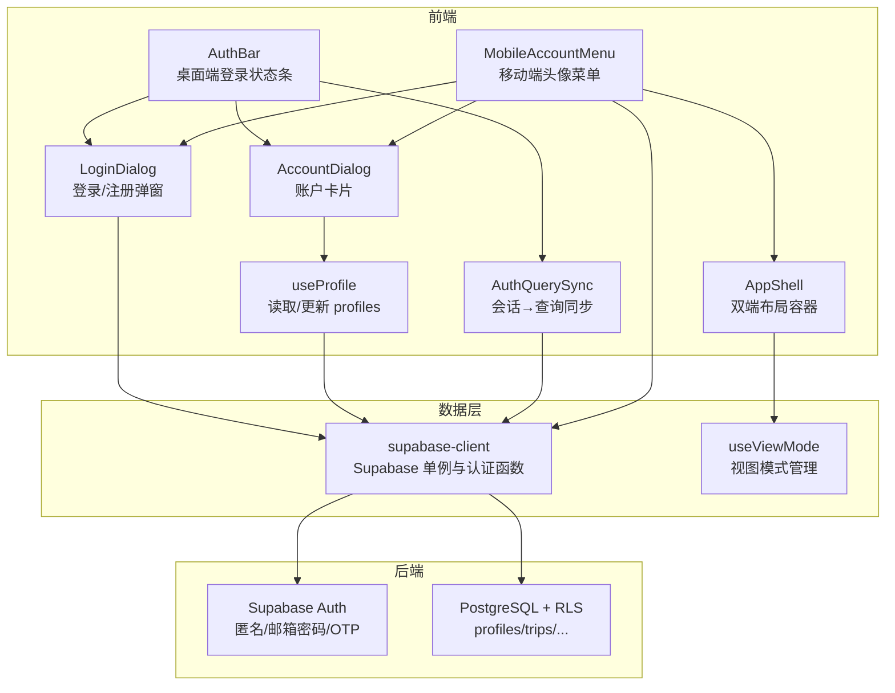
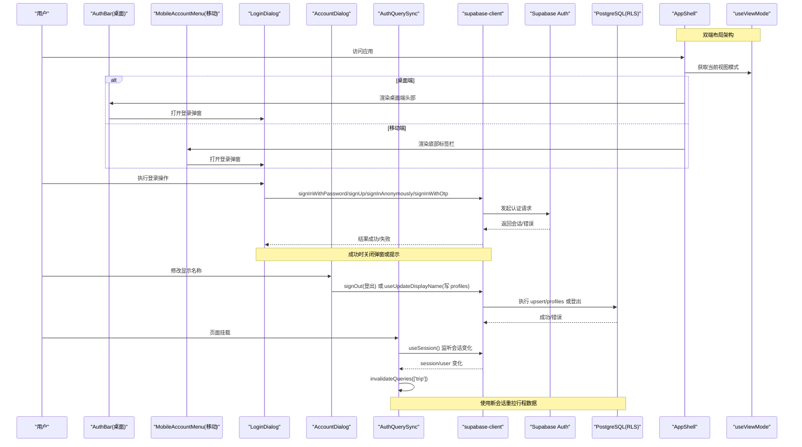
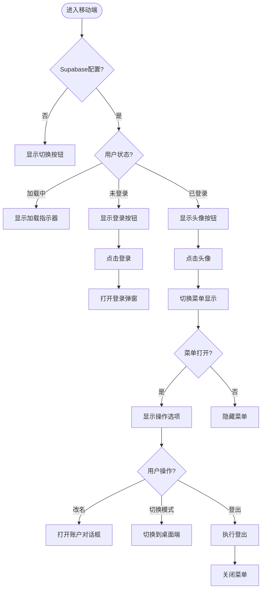
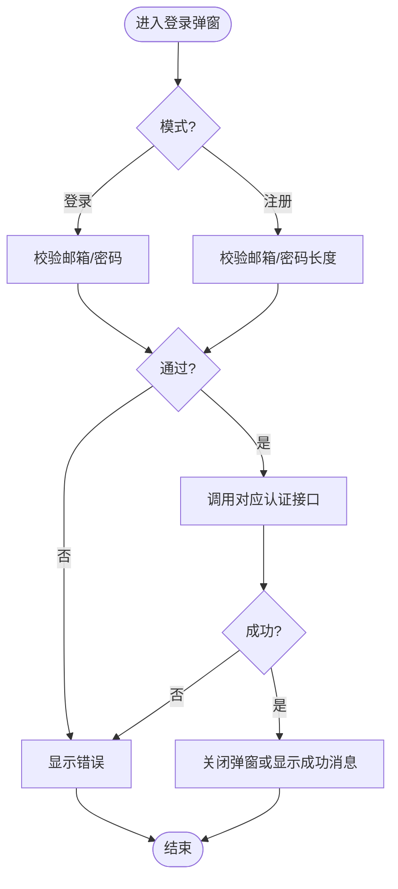
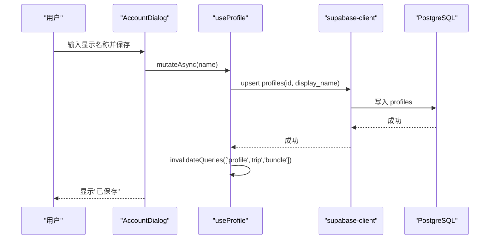
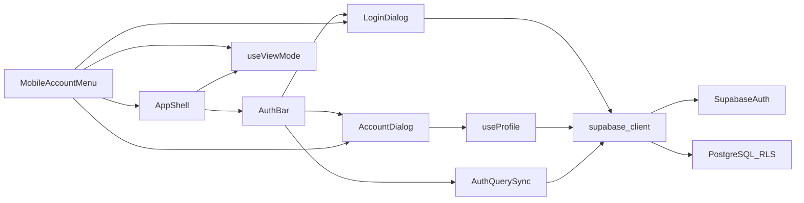

# 认证系统

<cite>
**本文引用的文件**
- [src/features/auth/LoginDialog.tsx](file://src/features/auth/LoginDialog.tsx)
- [src/features/auth/AccountDialog.tsx](file://src/features/auth/AccountDialog.tsx)
- [src/features/auth/AuthBar.tsx](file://src/features/auth/AuthBar.tsx)
- [src/features/auth/AuthQuerySync.tsx](file://src/features/auth/AuthQuerySync.tsx)
- [src/features/auth/useProfile.ts](file://src/features/auth/useProfile.ts)
- [src/app/AppShell.tsx](file://src/app/AppShell.tsx)
- [src/app/AppShell.module.css](file://src/app/AppShell.module.css)
- [src/hooks/useViewMode.ts](file://src/hooks/useViewMode.ts)
- [src/data/supabase-client.ts](file://src/data/supabase-client.ts)
- [supabase/migrations/0001_init.sql](file://supabase/migrations/0001_init.sql)
</cite>

## 更新摘要
**所做更改**
- 新增移动端底部标签栏头像弹出菜单组件（MobileAccountMenu）的实现说明
- 更新移动端架构重构：用户账户管理从独立认证栏整合到移动端底部标签栏
- 新增双端布局切换机制和视图模式管理
- 更新移动端用户体验优化和交互流程
- 补充移动端样式和布局设计说明

## 目录
1. [简介](#简介)
2. [项目结构](#项目结构)
3. [核心组件](#核心组件)
4. [架构总览](#架构总览)
5. [详细组件分析](#详细组件分析)
6. [依赖关系分析](#依赖关系分析)
7. [性能考虑](#性能考虑)
8. [故障排查指南](#故障排查指南)
9. [结论](#结论)
10. [附录：最佳实践与安全建议](#附录最佳实践与安全建议)

## 简介
本章节概述认证系统的目标与范围：实现用户登录、注册与会话管理，集成 Supabase 认证能力，完成用户状态同步与权限验证；提供登录对话框（表单校验、错误处理、体验优化）与账户管理（查看/修改显示名称、登出）。同时说明基于 RLS 的权限模型以及会话失效后的查询缓存刷新策略。

**更新** 本次更新重点反映了移动端架构重构：用户账户管理已从独立的认证栏整合到移动端底部标签栏的头像弹出菜单中，实现了更紧凑的移动用户体验。

## 项目结构
认证相关代码集中在 features/auth 与 data/supabase-client，数据库结构与权限策略在 supabase/migrations 中定义。整体采用"前端 UI 组件 + React Query 缓存 + Supabase 客户端"的分层组织方式。

**图表来源**
- [src/features/auth/AuthBar.tsx:18-56](file://src/features/auth/AuthBar.tsx#L18-L56)
- [src/features/auth/LoginDialog.tsx:18-82](file://src/features/auth/LoginDialog.tsx#L18-L82)
- [src/features/auth/AccountDialog.tsx:13-95](file://src/features/auth/AccountDialog.tsx#L13-L95)
- [src/features/auth/AuthQuerySync.tsx:15-26](file://src/features/auth/AuthQuerySync.tsx#L15-L26)
- [src/features/auth/useProfile.ts:19-64](file://src/features/auth/useProfile.ts#L19-L64)
- [src/app/AppShell.tsx:81-177](file://src/app/AppShell.tsx#L81-L177)
- [src/hooks/useViewMode.ts:39-62](file://src/hooks/useViewMode.ts#L39-L62)
- [src/data/supabase-client.ts:24-105](file://src/data/supabase-client.ts#L24-L105)

**章节来源**
- [src/features/auth/AuthBar.tsx:1-57](file://src/features/auth/AuthBar.tsx#L1-L57)
- [src/app/AppShell.tsx:1-239](file://src/app/AppShell.tsx#L1-L239)
- [src/data/supabase-client.ts:1-106](file://src/data/supabase-client.ts#L1-L106)

## 核心组件
- **登录状态条（AuthBar）**：根据是否配置 Supabase、当前会话状态渲染"登录/用户名+登出"，并触发登录或账户弹窗。
- **登录对话框（LoginDialog）**：支持邮箱+密码登录、邮箱+密码注册、匿名快速体验、邮箱魔法链接；包含基础表单校验与统一错误/成功提示。
- **账户对话框（AccountDialog）**：展示当前身份、修改全局显示名称（写入 profiles.display_name）、登出。
- **会话到查询同步（AuthQuerySync）**：监听会话变化，自动失效行程相关查询缓存，确保登录后数据按新会话重新拉取。
- **用户资料 Hook（useProfile）**：读取当前用户 profiles，并提供更新显示名称的 mutation，成功后主动失效相关缓存。
- **移动端头像菜单（MobileAccountMenu）**：**新增** 移动端底部标签栏右侧的头像弹出菜单，整合登录、账户管理和模式切换功能。
- **应用外壳（AppShell）**：**新增** 双端布局容器，根据视图模式渲染桌面端或移动端界面。
- **视图模式管理（useViewMode）**：**新增** 统一管理桌面端和移动端的视图切换逻辑。

**章节来源**
- [src/features/auth/AuthBar.tsx:18-56](file://src/features/auth/AuthBar.tsx#L18-L56)
- [src/features/auth/LoginDialog.tsx:18-82](file://src/features/auth/LoginDialog.tsx#L18-L82)
- [src/features/auth/AccountDialog.tsx:13-95](file://src/features/auth/AccountDialog.tsx#L13-L95)
- [src/features/auth/AuthQuerySync.tsx:15-26](file://src/features/auth/AuthQuerySync.tsx#L15-L26)
- [src/features/auth/useProfile.ts:19-64](file://src/features/auth/useProfile.ts#L19-L64)
- [src/app/AppShell.tsx:81-177](file://src/app/AppShell.tsx#L81-L177)
- [src/hooks/useViewMode.ts:39-62](file://src/hooks/useViewMode.ts#L39-L62)
- [src/data/supabase-client.ts:24-105](file://src/data/supabase-client.ts#L24-L105)

## 架构总览
下图展示了从 UI 到认证服务再到数据库的完整调用链，包括会话监听、查询缓存失效与 RLS 权限控制，以及新增的双端布局架构。

**图表来源**
- [src/features/auth/AuthBar.tsx:18-56](file://src/features/auth/AuthBar.tsx#L18-L56)
- [src/app/AppShell.tsx:81-177](file://src/app/AppShell.tsx#L81-L177)
- [src/features/auth/LoginDialog.tsx:52-82](file://src/features/auth/LoginDialog.tsx#L52-L82)
- [src/features/auth/AccountDialog.tsx:27-90](file://src/features/auth/AccountDialog.tsx#L27-L90)
- [src/features/auth/AuthQuerySync.tsx:15-26](file://src/features/auth/AuthQuerySync.tsx#L15-L26)
- [src/data/supabase-client.ts:71-105](file://src/data/supabase-client.ts#L71-L105)
- [supabase/migrations/0001_init.sql:309-386](file://supabase/migrations/0001_init.sql#L309-L386)

## 详细组件分析

### 移动端头像菜单（MobileAccountMenu）
**新增** 这是本次架构重构的核心组件，将用户账户管理功能整合到移动端底部标签栏中。

- **功能要点**
  - 头像按钮：显示用户首字母或默认标识，点击展开菜单
  - 未登录状态：显示"登录"按钮，直接打开登录弹窗
  - 已登录状态：显示用户信息、改名/账号选项、切换到桌面端、登出
  - 弹出菜单：支持点击外部区域关闭，触摸设备友好
  - 模式切换：无缝切换到桌面端作战台模式

- **关键流程**
  - 初始化：检查 Supabase 配置，加载用户会话和资料
  - 菜单展开：点击头像按钮展开下拉菜单，显示用户信息和操作选项
  - 登录流程：点击登录按钮打开 LoginDialog
  - 账户管理：点击"改名/账号"打开 AccountDialog
  - 模式切换：点击"切到作战台"切换到桌面端布局

**图表来源**
- [src/app/AppShell.tsx:81-177](file://src/app/AppShell.tsx#L81-L177)

**章节来源**
- [src/app/AppShell.tsx:81-177](file://src/app/AppShell.tsx#L81-L177)

### 应用外壳（AppShell）
**新增** 双端布局的统一容器，负责根据视图模式渲染不同的界面布局。

- **功能要点**
  - 视图模式检测：通过 useViewMode 钩子获取当前视图模式
  - 条件渲染：根据模式渲染 DesktopShell 或 MobileShell
  - 深链支持：处理分享链接中的 token 参数，自动弹出加入对话框
  - 布局切换：支持在桌面端和移动端之间自由切换

- **关键流程**
  - 初始化：检测 URL 参数中的 token，设置加入对话框状态
  - 模式判断：根据 useViewMode 返回的模式决定渲染哪个 Shell
  - 路由处理：通过 Outlet 组件渲染当前路由对应的页面内容

**章节来源**
- [src/app/AppShell.tsx:1-239](file://src/app/AppShell.tsx#L1-L239)

### 视图模式管理（useViewMode）
**新增** 统一管理桌面端和移动端的视图切换逻辑。

- **功能要点**
  - 媒体查询检测：根据屏幕宽度和指针类型自动判断视图模式
  - 本地存储：支持手动覆盖视图模式，持久化用户选择
  - 响应式更新：监听媒体查询变化，自动更新视图模式
  - 单一真相源：确保所有组件共享同一份视图模式状态

- **关键流程**
  - 初始化：从 localStorage 读取用户偏好，否则根据媒体查询确定模式
  - 模式切换：更新 localStorage 中的模式设置，通知所有订阅者
  - 媒体查询监听：监听屏幕尺寸变化，在非手动模式下自动切换

**章节来源**
- [src/hooks/useViewMode.ts:1-62](file://src/hooks/useViewMode.ts#L1-L62)

### 登录对话框（LoginDialog）
- **功能要点**
  - 模式切换：登录/注册两种模式，共享邮箱与密码输入。
  - 表单校验：必填校验、最小密码长度校验。
  - 登录方式：邮箱+密码登录、邮箱+密码注册、匿名快速体验、邮箱魔法链接。
  - 交互体验：Esc 关闭、Enter 提交、统一 busy/loading 状态、错误与成功消息提示。
- **关键流程**
  - 登录：校验 → 调用签名接口 → 成功则关闭或提示 → 失败则显示错误。
  - 注册：校验 → 调用注册接口 → 提示"注册成功，用同一邮箱登录"。
  - 匿名：直接获取匿名会话，便于无邮件环境快速体验。
  - OTP：发送魔法链接，提示用户查收邮件后刷新页面完成登录。

**图表来源**
- [src/features/auth/LoginDialog.tsx:18-82](file://src/features/auth/LoginDialog.tsx#L18-L82)

**章节来源**
- [src/features/auth/LoginDialog.tsx:1-159](file://src/features/auth/LoginDialog.tsx#L1-L159)

### 账户对话框（AccountDialog）
- **功能要点**
  - 显示当前身份（匿名用户/邮箱/已登录）。
  - 修改显示名称：写入 profiles.display_name，保存后提示"已保存"。
  - 登出：调用登出接口并关闭弹窗。
- **关键流程**
  - 保存名称：去空校验 → 调用 mutation → 成功后使 profile 与 trip bundle 缓存失效 → 界面立即刷新。
  - 登出：调用 signOut 并关闭弹窗。

**图表来源**
- [src/features/auth/AccountDialog.tsx:27-90](file://src/features/auth/AccountDialog.tsx#L27-L90)
- [src/features/auth/useProfile.ts:41-64](file://src/features/auth/useProfile.ts#L41-L64)

**章节来源**
- [src/features/auth/AccountDialog.tsx:1-96](file://src/features/auth/AccountDialog.tsx#L1-L96)
- [src/features/auth/useProfile.ts:1-65](file://src/features/auth/useProfile.ts#L1-L65)

### 登录状态条（AuthBar）
- **行为**
  - 未配置 Supabase：不渲染任何内容（本地模式零干扰）。
  - 加载中：显示占位符。
  - 已登录：显示用户名（优先 profiles.display_name，否则匿名标识或邮箱前缀），可点击进入账户对话框；提供登出按钮。
  - 未登录：显示"登录"按钮，点击打开登录弹窗。
- **关键点**
  - 使用 isSupabaseConfigured 判断是否启用云端模式。
  - 使用 useSession 获取当前用户与加载状态。
  - 使用 useProfile 获取显示名称。

**章节来源**
- [src/features/auth/AuthBar.tsx:1-57](file://src/features/auth/AuthBar.tsx#L1-L57)

### 会话与查询同步（AuthQuerySync）
- **目的**
  - 解决"未登录时已跑过查询并被缓存，登录后仍显示旧结果"的问题。
- **机制**
  - 订阅 useSession 的 session 变化，一旦变化（登录成功/登出），立即失效 ['trip'] 分组查询，强制以新会话重新拉取。
- **效果**
  - 登录后列表/时间线/账本等数据能即时刷新，避免陈旧缓存误导。

**章节来源**
- [src/features/auth/AuthQuerySync.tsx:1-27](file://src/features/auth/AuthQuerySync.tsx#L1-L27)

### 用户资料 Hook（useProfile）
- **读取资料**
  - 基于 react-query 的 useQuery，将 userId 放入 queryKey，确保登录态变化（含匿名→账号）时自动重取。
  - 仅在有 supabase 且存在 userId 时启用查询。
- **更新名称**
  - 使用 useMutation 对 profiles 表进行 upsert（onConflict id），保证即使行不存在也能创建。
  - 成功后主动失效 ['profile'] 与 ['trip','bundle'] 缓存，使全应用立即反映新昵称。

**章节来源**
- [src/features/auth/useProfile.ts:1-65](file://src/features/auth/useProfile.ts#L1-L65)

### Supabase 客户端封装（supabase-client）
- **客户端初始化**
  - 从环境变量读取 URL 与 ANON KEY，若两者均存在则创建客户端单例，并开启持久化与会话自动刷新。
  - 关闭 detectSessionInUrl，避免 HashRouter 下路由冲突。
- **会话监听**
  - useSession：首次获取当前会话，随后订阅 onAuthStateChange，统一输出 loading/session/user。
- **认证能力**
  - 匿名登录、邮箱+密码注册/登录、邮箱 OTP、登出。
- **安全注意**
  - 所有写操作需具备有效会话；RLS 基于 auth.uid() 控制访问。

**章节来源**
- [src/data/supabase-client.ts:1-106](file://src/data/supabase-client.ts#L1-L106)

## 依赖关系分析
- **组件耦合**
  - AuthBar 依赖 supabase-client 的 isSupabaseConfigured、useSession、signOut，以及 useProfile、LoginDialog、AccountDialog。
  - **新增** MobileAccountMenu 依赖 AppShell、useViewMode、useSession、useProfile、LoginDialog、AccountDialog。
  - **新增** AppShell 依赖 useViewMode、AuthBar、LoginDialog、AccountDialog、JoinDialog。
  - LoginDialog 依赖 supabase-client 的认证函数。
  - AccountDialog 依赖 supabase-client 的 signOut、useSession，以及 useProfile 的 useUpdateDisplayName。
  - AuthQuerySync 依赖 supabase-client 的 useSession 与 react-query 的 QueryClient。
  - useProfile 依赖 supabase-client 的 supabase 实例与 useSession。
- **外部依赖**
  - @supabase/supabase-js：认证与 REST 客户端。
  - @tanstack/react-query：缓存与失效策略。
- **数据库与权限**
  - RLS 策略限制 profiles 仅本人读写；trips 及子表通过 is_trip_member/is_trip_owner 判定。
  - 匿名或未登录角色无法对 trips 等表进行写操作。

**图表来源**
- [src/features/auth/AuthBar.tsx:18-56](file://src/features/auth/AuthBar.tsx#L18-L56)
- [src/app/AppShell.tsx:81-177](file://src/app/AppShell.tsx#L81-L177)
- [src/features/auth/LoginDialog.tsx:52-82](file://src/features/auth/LoginDialog.tsx#L52-L82)
- [src/features/auth/AccountDialog.tsx:27-90](file://src/features/auth/AccountDialog.tsx#L27-L90)
- [src/features/auth/AuthQuerySync.tsx:15-26](file://src/features/auth/AuthQuerySync.tsx#L15-L26)
- [src/features/auth/useProfile.ts:19-64](file://src/features/auth/useProfile.ts#L19-L64)
- [src/data/supabase-client.ts:24-105](file://src/data/supabase-client.ts#L24-L105)
- [supabase/migrations/0001_init.sql:309-386](file://supabase/migrations/0001_init.sql#L309-L386)

**章节来源**
- [src/features/auth/AuthBar.tsx:1-57](file://src/features/auth/AuthBar.tsx#L1-L57)
- [src/app/AppShell.tsx:1-239](file://src/app/AppShell.tsx#L1-L239)
- [src/features/auth/LoginDialog.tsx:1-159](file://src/features/auth/LoginDialog.tsx#L1-L159)
- [src/features/auth/AccountDialog.tsx:1-96](file://src/features/auth/AccountDialog.tsx#L1-L96)
- [src/features/auth/AuthQuerySync.tsx:1-27](file://src/features/auth/AuthQuerySync.tsx#L1-L27)
- [src/features/auth/useProfile.ts:1-65](file://src/features/auth/useProfile.ts#L1-L65)
- [src/data/supabase-client.ts:1-106](file://src/data/supabase-client.ts#L1-L106)
- [supabase/migrations/0001_init.sql:25-46](file://supabase/migrations/0001_init.sql#L25-L46)
- [supabase/migrations/0001_init.sql:309-386](file://supabase/migrations/0001_init.sql#L309-L386)

## 性能考虑
- **会话监听与最小化渲染**
  - useSession 仅在 supabase 可用时订阅，避免不必要的副作用。
- **查询缓存与失效**
  - 使用 react-query 的 queryKey 区分不同用户资料（['profile', userId]），登录态变化自动重取。
  - 会话变化时主动失效 ['trip'] 分组，避免陈旧数据。
  - 更新显示名称后失效 ['profile'] 与 ['trip','bundle']，减少重复请求。
- **网络与重试**
  - 启用 persistSession 与 autoRefreshToken，降低频繁鉴权开销。
- **用户体验**
  - 统一 busy 状态与错误提示，避免重复提交与误判。
- **新增：双端布局优化**
  - 视图模式切换使用单一真相源，避免重复计算和状态不一致。
  - 移动端头像菜单使用事件委托，减少内存占用。
  - 条件渲染避免不必要的组件挂载和状态维护。

## 故障排查指南
- **未配置 Supabase**
  - 现象：AuthBar 不渲染，应用走本地模式。
  - 原因：环境变量缺失导致 isSupabaseConfigured 为 false。
  - 处理：检查 VITE_SUPABASE_URL 与 VITE_SUPABASE_ANON_KEY。
- **登录失败**
  - 现象：弹窗显示错误信息。
  - 可能原因：邮箱格式错误、密码过短、后台未开启 Email/Password 或 Anonymous sign-ins。
  - 处理：核对 Supabase 后台设置与表单校验逻辑。
- **登录后数据未刷新**
  - 现象：登录后行程列表仍为空或陈旧。
  - 原因：React Query 缓存未失效。
  - 处理：确认 AuthQuerySync 已生效并已失效 ['trip']。
- **修改显示名称无效**
  - 现象：保存后未刷新。
  - 原因：未正确失效 ['profile'] 与 ['trip','bundle']。
  - 处理：检查 useUpdateDisplayName 的 onSuccess 回调。
- **权限被拒**
  - 现象：写操作报错或无数据。
  - 原因：RLS 限制，未登录或匿名角色无写权限。
  - 处理：确保已登录并获得真实 uid。
- **新增：移动端问题**
  - **现象**：移动端头像菜单不显示或功能异常
  - **原因**：useViewMode 状态不同步或 MobileAccountMenu 组件挂载失败
  - **处理**：检查 AppShell 是否正确渲染 MobileShell，确认 useViewMode 返回值

**章节来源**
- [src/features/auth/AuthBar.tsx:18-25](file://src/features/auth/AuthBar.tsx#L18-L25)
- [src/features/auth/LoginDialog.tsx:52-82](file://src/features/auth/LoginDialog.tsx#L52-L82)
- [src/features/auth/AuthQuerySync.tsx:15-26](file://src/features/auth/AuthQuerySync.tsx#L15-L26)
- [src/features/auth/useProfile.ts:41-64](file://src/features/auth/useProfile.ts#L41-L64)
- [src/data/supabase-client.ts:24-34](file://src/data/supabase-client.ts#L24-L34)
- [supabase/migrations/0001_init.sql:309-386](file://supabase/migrations/0001_init.sql#L309-L386)
- [src/app/AppShell.tsx:81-177](file://src/app/AppShell.tsx#L81-L177)
- [src/hooks/useViewMode.ts:39-62](file://src/hooks/useViewMode.ts#L39-L62)

## 结论
该认证系统通过 Supabase 认证能力与 React Query 缓存策略，实现了稳定的登录/注册与会话管理；结合 RLS 的细粒度权限控制，确保数据安全。登录对话框提供多方式登录与良好交互体验，账户管理支持显示名称的全局同步。通过会话变化驱动的查询失效，保证了登录后数据的及时性与一致性。

**更新** 本次架构重构成功实现了移动端用户体验优化，将用户账户管理功能整合到移动端底部标签栏的头像弹出菜单中，提供了更紧凑、直观的移动界面。双端布局分离设计确保了桌面端和移动端都能获得最佳的交互体验。

## 附录：最佳实践与安全建议
- **会话安全**
  - 启用 persistSession 与 autoRefreshToken，减少频繁鉴权。
  - 关闭 detectSessionInUrl，避免与前端路由冲突。
- **权限最小化**
  - 严格依赖 RLS 策略，禁止在前端做越权判断。
  - 匿名角色仅允许必要读操作，写操作必须 authenticated。
- **表单与错误处理**
  - 前端只做基础校验（如必填、长度），服务端 RLS 与业务逻辑兜底。
  - 统一错误提示与忙态，避免重复提交。
- **缓存一致性**
  - 会话变化时主动失效相关查询组，避免陈旧数据。
  - 更新用户资料后，失效影响到的所有相关缓存键。
- **可观测性**
  - 记录关键步骤的错误日志（如认证失败、RLS 拒绝），便于定位问题。
- **扩展性**
  - 新增认证方式时，保持 supabase-client 的统一入口，UI 层按需接入。
  - 使用 react-query 的 key 设计，确保变更传播准确。
- **新增：移动端最佳实践**
  - **触摸友好**：确保移动端元素有足够的点击区域和视觉反馈
  - **性能优化**：使用条件渲染避免不必要的组件挂载
  - **状态同步**：确保视图模式在所有组件间保持一致
  - **用户体验**：提供清晰的导航模式和模式切换提示